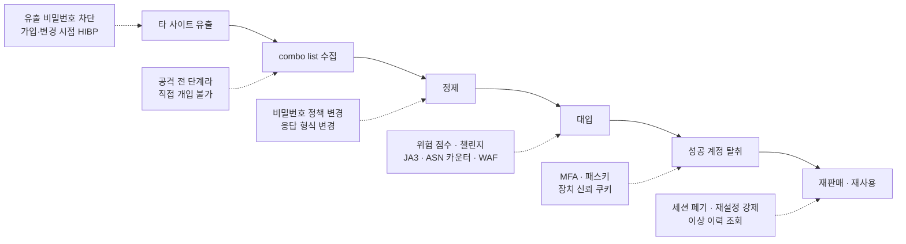
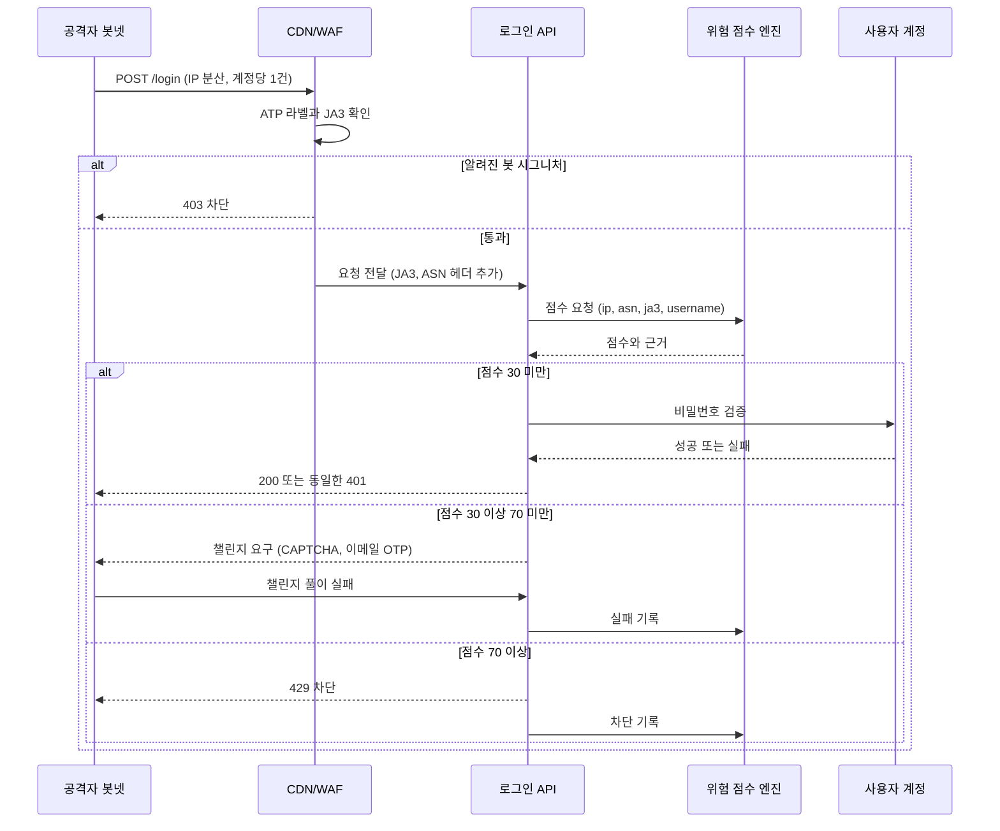
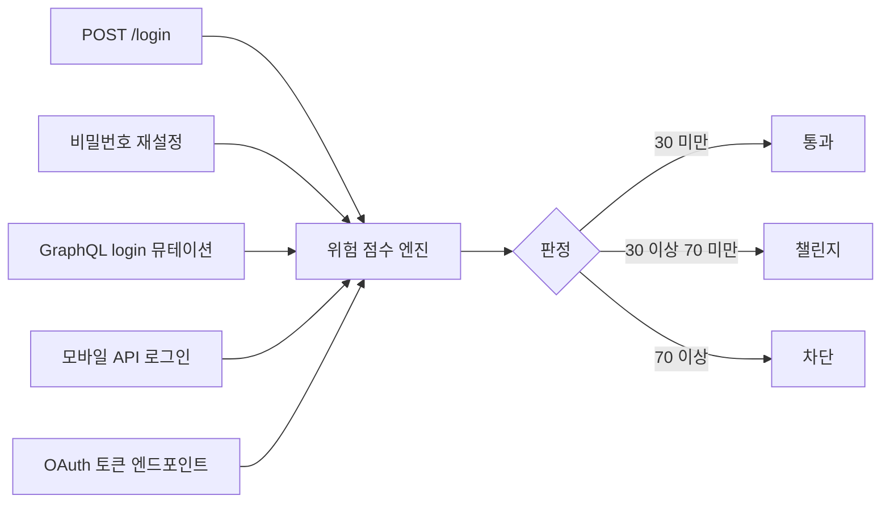

# 크리덴션 스터핑

새벽 3시에 로그인 실패율 알람이 울렸다. 평소 95% 근처이던 로그인 성공률이 1~3%대로 내려가 있었고, 계정 잠금 카운터는 한 번도 올라가지 않았다. 계정별 실패 횟수를 세는 방어는 그대로였는데 공격은 그 밑으로 지나가고 있었다. 그날 이후 로그인 방어를 계정 단위에서 요청 전체의 분포를 보는 방식으로 바꿨다. 이 문서는 그때 정리한 내용이다.

크리덴션 스터핑(credential stuffing)은 다른 서비스에서 유출된 이메일·비밀번호 쌍을 우리 서비스 로그인에 그대로 넣어 보는 공격이다. 비밀번호를 추측하지 않는다. 사용자가 여러 사이트에 같은 비밀번호를 쓴다는 사실에 기댄다. 그래서 우리 서비스의 비밀번호 해싱이 아무리 단단해도, 사용자가 다른 곳에서 유출당했다면 소용이 없다. 우리가 통제할 수 있는 부분은 로그인 요청이 들어오는 순간과 성공한 이후의 처리뿐이다.

## 스터핑이 계정 잠금을 지나가는 이유

무차별 대입은 한 계정에 비밀번호를 바꿔 가며 수백, 수천 번 던진다. 계정당 실패 5회에 잠금을 거는 규칙이 정확히 이 모양을 막으려고 만든 것이다. 스터핑은 반대다. 공격자가 가진 건 계정마다 짝지어진 비밀번호 하나라서, 계정 하나에 1~2번 시도하고 다음 계정으로 넘어간다. 계정별 실패 카운터는 1에서 멈춘다.

IP 단위 제한도 잘 안 걸린다. 레지덴셜 프록시나 감염된 기기로 구성한 봇넷은 IP를 요청마다 바꾼다. 우리가 로그에서 본 패턴은 IP 하나당 요청이 1~3건이었고, 요청 사이 간격도 일부러 벌려 두었다. 초당 요청 수로 보면 정상 트래픽보다 낮은 시간대도 있었다.

세 공격을 나란히 놓으면 방어가 어디서 달라지는지 보인다.

| 항목 | 무차별 대입 | 비밀번호 스프레이 | 크리덴션 스터핑 |
|---|---|---|---|
| 시도 대상 | 계정 1개 | 계정 수천 개 | 계정 수만~수백만 개 |
| 비밀번호 | 사전·규칙으로 생성 | 흔한 비밀번호 1~2개 고정 | 계정마다 다른, 유출된 실제 값 |
| 계정당 시도 수 | 수백~수천 | 1~3 | 1~2 |
| IP 분산 | 낮음. 한두 IP | 중간. 잠금 우회용 분산 | 높음. 요청마다 IP 교체 |
| 성공률 | 거의 0 | 0.1% 안팎 | 1~3%대. 서비스마다 차이가 크다 |
| 탐지 신호 | 계정별 실패 급증 | 한 비밀번호에 대한 다계정 시도 | 고유 username 폭증, JA3 편중, 없는 계정 비율 |
| 유효한 방어 | 계정 잠금, 지연 | 흔한 비밀번호 차단, 계정 횟수 제한 | 유출 비밀번호 차단, 위험 점수, MFA, 패스키 |

표의 마지막 줄이 핵심이다. 앞의 두 공격은 시도 횟수를 세면 잡힌다. 스터핑은 시도 하나하나가 정상 로그인 실패와 구별되지 않아서, 개별 요청이 아니라 요청 집단의 분포를 봐야 한다. 로그인 보호의 기본 구조는 [로그인 무차별 대입 방어](../Backend/Authentication/Login_Brute_Force_Protection.md)에 있고, 이 문서는 그 위에서 스터핑만 따로 판다.

## 공격이 돌아가는 순서

방어 지점을 잡으려면 공격자가 어떤 순서로 일하는지 알아야 한다. 도구 사용법이 아니라 단계마다 어디에 방어를 끼울 수 있는지가 관심사다.



점선으로 이어진 상자가 각 단계에서 우리가 끼울 수 있는 방어다. 점선이 없는 단계는 우리 손이 닿지 않는다.

유출은 우리와 무관한 서비스에서 일어난다. 그 데이터가 `email:password` 한 줄짜리 텍스트 파일, 흔히 combo list라 부르는 형태로 모여 돌아다닌다. 수십만에서 수억 줄이 한 파일에 들어 있다. 공격자는 이 파일을 정제한다. 중복 제거, 우리 서비스 사용자가 많을 만한 도메인으로 필터링, 그리고 우리 비밀번호 정책(최소 8자, 영문·숫자 조합 같은)에 맞지 않는 줄을 미리 버린다. 이 마지막 단계 때문에 공격 트래픽에는 "비밀번호 형식 오류" 응답이 거의 없다. 정상 사용자의 오타 실패와 섞이지 않는 첫 번째 단서다.

대입 단계에서는 OpenBullet 계열 도구가 쓰인다. 설정 파일 안에 로그인 요청의 형식, 그리고 응답이 성공인지 실패인지 판정하는 규칙이 들어 있다. 판정 규칙은 대개 응답 본문의 특정 문자열, 상태 코드, `Set-Cookie` 헤더 존재 같은 것에 기댄다. 프록시 로테이션은 요청마다 다른 출구 IP를 쓰게 한다. 이 설정 파일은 서비스별로 만들어져 유통된다. 우리가 로그인 요청 필드명이나 응답 구조를 바꿨을 때 공격이 하루 이틀 멈춘 적이 있었다. 근본 방어는 아니지만 공격자가 설정을 다시 만들어야 해서 비용이 올라간다.

성공한 계정은 hit라고 불린다. hit 목록은 그대로 팔리거나, 포인트·쿠폰·저장된 결제 수단을 직접 현금화하는 데 쓰인다. 같은 계정이 다른 서비스에서 한 번 더 시도되기도 한다. 우리 쪽에서 보면 뒤처리 단계다. 계정이 이미 뚫린 뒤라서 사용자가 입을 피해를 줄이는 일만 남는다.

## 로그에서 보이는 신호

로그인 이벤트를 한 테이블에 모아 두면 대부분의 신호가 집계 쿼리 몇 개로 나온다. 이 절의 쿼리는 `login_events(ts, username, ip, asn, ja3, ua, success, user_exists)` 구조를 가정한다. `user_exists`는 요청된 username이 실제 계정인지를 서버 내부에서만 기록한 컬럼이고, 응답에는 노출하지 않는다.

분 단위 성공률과 고유 username, 고유 IP를 같이 본다.

```sql
SELECT date_trunc('minute', ts)                                  AS minute,
       count(*)                                                  AS attempts,
       round(100.0 * count(*) FILTER (WHERE success) / count(*), 2) AS success_pct,
       count(DISTINCT username)                                  AS uniq_users,
       count(DISTINCT ip)                                        AS uniq_ips,
       round(count(*)::numeric / count(DISTINCT username), 2)    AS attempts_per_user
FROM login_events
WHERE ts > now() - interval '6 hours'
GROUP BY 1
ORDER BY 1;
```

정상 시간대에는 `attempts_per_user`가 1.1 안팎이고 성공률이 95% 근처다. 사고 당시에는 `attempts_per_user`가 1.0에 붙고 `uniq_users`가 평소의 수십 배로 뛰었다. 무차별 대입이라면 `uniq_users`가 오히려 줄어든다. 이 방향이 반대라는 점이 두 공격을 가르는 가장 빠른 판별법이다.

UA와 TLS 핑거프린트는 분포로 본다. JA3는 TLS 핸드셰이크의 파라미터를 해시한 값이라 UA 문자열을 바꿔도 도구가 쓰는 TLS 라이브러리가 같으면 같은 값이 나온다.

```sql
SELECT ja3,
       count(*)                                          AS attempts,
       count(DISTINCT ip)                                AS ips,
       round(100.0 * count(*) / sum(count(*)) OVER (), 1) AS share_pct,
       round(100.0 * count(*) FILTER (WHERE success) / count(*), 2) AS success_pct
FROM login_events
WHERE ts > now() - interval '30 minutes'
GROUP BY ja3
ORDER BY attempts DESC
LIMIT 10;
```

정상 트래픽은 브라우저 몇 종류와 모바일 앱 몇 개 버전으로 갈라진다. 공격 시간대에는 UA가 최신 Chrome으로 위장되어 있어도 JA3 하나가 전체의 40~60%를 차지하고, 그 JA3의 성공률만 1~2%였다. UA만 봤다면 놓쳤을 신호다. 존재하지 않는 계정 비율은 같은 테이블에서 `WHERE NOT user_exists` 비율을 보면 된다. 정제를 거쳤어도 우리 서비스에 가입하지 않은 이메일이 대량으로 섞여 들어오기 때문에, 평소 몇 퍼센트이던 값이 수십 퍼센트로 뛴다.

DB 집계는 몇 분 늦다. 실시간으로 보려면 Redis에 분 단위 HyperLogLog를 두는 방법이 있다.

```
PFADD  cs:users:202610010312 "alice@example.com"
PFADD  cs:ips:202610010312   "203.0.113.7"
EXPIRE cs:users:202610010312 7200
EXPIRE cs:ips:202610010312   7200

PFCOUNT cs:users:202610010312     # 이 분에 로그인을 시도한 고유 username 수
PFCOUNT cs:ips:202610010312       # 같은 분의 고유 IP 수
```

HyperLogLog는 키 하나가 12KB 이하라서 분 단위로 두어도 부담이 없고, 오차는 1% 안팎이다. 알람은 `PFCOUNT` 값이 직전 1시간 중앙값의 몇 배를 넘는지로 건다.

## 다차원 슬라이딩 윈도우 탐지

집계 쿼리는 사후 분석에 맞고, 요청 한 건을 받을 때 판단하려면 카운터가 필요하다. 한 차원만 쓰면 우회된다. IP만 보면 프록시 로테이션에 지고, 계정만 보면 스터핑에 진다. IP, 계정, ASN, JA3 네 차원을 동시에 보고, 각 차원에서 "시도 횟수"와 "서로 다른 대상의 수"를 윈도우 안에서 센다.

### 카운터 구현

Redis 정렬 집합(sorted set)의 score에 타임스탬프를 넣고 `ZCOUNT`로 윈도우 안의 원소 수를 센다. 같은 member를 다시 `ZADD`하면 score만 갱신되어서 고유 개수가 자연스럽게 세어진다. IP·ASN·JA3 차원에서는 member가 username 해시이므로 `ZCARD`가 고유 username 수가 되고, 계정 차원에서는 member를 IP 해시로 두어 한 계정에 접근한 고유 IP 수를 센다.

기록은 실패한 로그인만 한다. 정상 브라우저의 JA3 하나에는 요청이 수만 건씩 몰려서 모든 요청을 쓰면 hot key가 된다. 실패는 정상 트래픽에서 드물어서 이렇게 해도 신호는 유지된다.

```ts
import Redis from 'ioredis';
import { createHash, randomUUID } from 'node:crypto';

export type Dimension = 'ip' | 'asn' | 'ja3' | 'account';

export interface LoginContext {
  ip: string;
  asn: number;
  ja3: string;
  username: string;
}

export interface WindowCount {
  attempts: number;
  distinct: number;
}

export type Signals = Record<Dimension, Record<number, WindowCount>>;

const WINDOWS_MS = [60_000, 600_000, 3_600_000];
const RETENTION_MS = WINDOWS_MS[WINDOWS_MS.length - 1];

const redis = new Redis(process.env.REDIS_URL!);

function digest(value: string): string {
  return createHash('sha256').update(value.toLowerCase()).digest('base64url').slice(0, 16);
}

function keysOf(ctx: LoginContext): Record<Dimension, { key: string; member: string }> {
  const user = digest(ctx.username);
  const ip = digest(ctx.ip);
  return {
    ip: { key: ctx.ip, member: user },
    asn: { key: String(ctx.asn), member: user },
    ja3: { key: ctx.ja3, member: user },
    account: { key: user, member: ip },
  };
}

export async function recordFailure(ctx: LoginContext, now = Date.now()): Promise<void> {
  const pipe = redis.pipeline();
  for (const [dim, { key, member }] of Object.entries(keysOf(ctx))) {
    const att = `cs:att:${dim}:${key}`;
    const uniq = `cs:uniq:${dim}:${key}`;
    pipe.zadd(att, now, `${now}-${randomUUID()}`);
    pipe.zadd(uniq, now, member);
    pipe.zremrangebyscore(att, 0, now - RETENTION_MS);
    pipe.zremrangebyscore(uniq, 0, now - RETENTION_MS);
    pipe.pexpire(att, RETENTION_MS);
    pipe.pexpire(uniq, RETENTION_MS);
  }
  await pipe.exec();
}

export async function readSignals(ctx: LoginContext, now = Date.now()): Promise<Signals> {
  const dims = keysOf(ctx);
  const pipe = redis.pipeline();
  for (const [dim, { key }] of Object.entries(dims)) {
    for (const w of WINDOWS_MS) {
      pipe.zcount(`cs:att:${dim}:${key}`, now - w, '+inf');
      pipe.zcount(`cs:uniq:${dim}:${key}`, now - w, '+inf');
    }
  }
  const res = (await pipe.exec())!;

  const out = {} as Signals;
  let i = 0;
  for (const dim of Object.keys(dims) as Dimension[]) {
    out[dim] = {};
    for (const w of WINDOWS_MS) {
      out[dim][w] = {
        attempts: Number(res[i++][1]),
        distinct: Number(res[i++][1]),
      };
    }
  }
  return out;
}
```

`readSignals`는 비밀번호 검증 전에, `recordFailure`는 검증이 실패한 뒤에 부른다. 읽기와 쓰기를 분리한 이유는 판정이 이전까지의 기록만 근거로 해야 하기 때문이다. 현재 요청을 먼저 기록하면 첫 요청부터 카운터가 1씩 올라가 임계값 근처의 판정이 흔들린다.

### 점수와 판정

각 차원마다 임계값을 넘으면 가중치만큼 점수를 더한다. 가중치 합이 30 이상이면 챌린지, 70 이상이면 차단이다. 계정 차원의 최대 가중치를 30으로 묶어 둔 데에는 이유가 있다. 뒤의 계정 잠금 DoS 항목에서 설명한다.

```ts
interface Rule {
  dim: Dimension;
  windowMs: number;
  metric: keyof WindowCount;
  threshold: number;
  weight: number;
}

const RULES: Rule[] = [
  { dim: 'ip',      windowMs: 600_000,   metric: 'distinct', threshold: 5,    weight: 40 },
  { dim: 'ip',      windowMs: 60_000,    metric: 'attempts', threshold: 8,    weight: 20 },
  { dim: 'asn',     windowMs: 600_000,   metric: 'distinct', threshold: 300,  weight: 25 },
  { dim: 'ja3',     windowMs: 600_000,   metric: 'distinct', threshold: 1000, weight: 30 },
  { dim: 'account', windowMs: 3_600_000, metric: 'distinct', threshold: 4,    weight: 30 },
];

// 이동통신사 ASN 예시. 서비스 사용자 분포에 맞게 로그에서 직접 뽑아 채운다.
const CARRIER_ASNS = new Set([4766, 9644, 3786]);

export type Decision = 'allow' | 'challenge' | 'block';

export function riskScore(signals: Signals, ctx: LoginContext): number {
  const carrier = CARRIER_ASNS.has(ctx.asn);
  let score = 0;
  for (const r of RULES) {
    const value = signals[r.dim][r.windowMs][r.metric];
    if (value < r.threshold) continue;
    const ipRule = r.dim === 'ip';
    score += carrier && ipRule ? r.weight / 2 : r.weight;
  }
  return Math.min(score, 100);
}

export function decide(score: number, trustedDevice: boolean): Decision {
  const adjusted = trustedDevice ? Math.max(0, score - 50) : score;
  if (adjusted >= 70) return 'block';
  if (adjusted >= 30) return 'challenge';
  return 'allow';
}
```

로그인 핸들러에서는 이렇게 묶는다.

```ts
app.post('/login', async (req, res) => {
  const ctx: LoginContext = {
    ip: req.ip,
    asn: Number(req.header('x-client-asn')),
    ja3: req.header('x-client-ja3') ?? 'unknown',
    username: String(req.body.username),
  };

  const signals = await readSignals(ctx);
  const trusted = await isTrustedDevice(req.cookies.dev_id, ctx.username);
  const decision = decide(riskScore(signals, ctx), trusted);

  if (decision === 'block') return res.status(429).json({ message: '잠시 후 다시 시도해 주세요.' });
  if (decision === 'challenge' && !(await verifyChallenge(req))) {
    return res.status(401).json({ message: '로그인 정보를 확인해 주세요.', challenge: true });
  }

  const ok = await verifyPassword(ctx.username, req.body.password);
  if (!ok) {
    await recordFailure(ctx);
    return res.status(401).json({ message: '로그인 정보를 확인해 주세요.' });
  }
  return issueSession(res, ctx.username);
});
```

`x-client-asn`과 `x-client-ja3`는 앞단 CDN이나 WAF가 붙여 주는 헤더다. 애플리케이션이 직접 TLS를 끝내지 않으면 JA3를 알 수 없다. 클라이언트가 같은 이름의 헤더를 직접 보낼 수 있으니 앞단에서 덮어쓰는지 반드시 확인한다. 이걸 놓쳐서 공격자가 `x-client-asn`을 이동통신사 값으로 위조하는 것을 로그에서 본 적이 있다.

### 오탐이 나는 자리

임계값은 정상 트래픽에서 터지는 곳이 반드시 있다. 우리가 겪은 것은 세 군데였다.

사무실과 학교는 출구 IP 하나에 수백 명이 있다. 월요일 오전 9시에 전원이 로그인하면 `ip` 차원의 고유 username 수가 쉽게 5를 넘는다. 다만 이 경우는 대부분 성공이라서 실패만 기록하는 구조에서는 카운터가 오르지 않는다. 문제는 비밀번호를 바꾼 직후 같은 이유로 여럿이 한꺼번에 실패하는 경우다. 학교 단위의 시험 기간 로그인 폭주에서 챌린지가 한꺼번에 떴다.

통신사 CGNAT는 수천 명이 IP 하나를 공유한다. 모바일 사용자의 IP별 고유 username 수는 원래 높다. 위 코드에서 `CARRIER_ASNS`에 속하면 IP 차원의 가중치를 반으로 줄이는 이유다. 한 가지 더 복잡한 점은 공격자가 모바일 프록시를 쓰는 경우다. 통신사 IP가 출구인 프록시라서 ASN만 보면 정상 모바일과 구별되지 않는다. 이쪽은 JA3 편중과 성공률 하락으로 잡아야 한다. IP 차원 신호를 낮춰 둔 만큼 JA3 차원이 뒤를 받쳐야 한다.

임계값 자체도 조정 대상이다. 처음에는 고정값으로 두었다가 서비스가 커지면서 오탐이 늘었고, 지금은 2주 단위로 정상 구간의 95번째 백분위수를 다시 뽑아 임계값에 반영한다.

### 잠금을 악용한 DoS

계정 단위 잠금은 공격자에게 무기를 쥐여 준다. 피해자의 이메일을 알고 있으면 일부러 5번 틀려서 그 계정을 잠가 버릴 수 있다. 스터핑 방어에 계정 잠금을 얹으면 오히려 정상 사용자의 로그인이 막히는 쪽으로 사고가 난다. 한 번은 공격자가 우리 쪽 임직원 계정 목록을 대상으로 실패를 쏟아부어 사내 도구 로그인이 한 시간 막힌 일이 있었다.

그래서 위 코드는 계정 차원 신호 하나만으로는 차단까지 가지 못한다. 가중치를 30으로 묶어 챌린지까지만 가게 한다. 또 장치 신뢰 쿠키가 있는 요청은 점수에서 50을 뺀다. 계정을 잠그는 대신 그 계정에 "익숙하지 않은 장치"의 요청만 한 단계 더 확인하는 방식이다. 공격자가 아무리 실패를 쌓아도 사용자 본인은 평소 쓰던 기기에서 그대로 들어온다.

## 점수에 따른 단계별 대응

요청 하나가 들어와서 판정이 갈리는 흐름을 한 번에 보면 시퀀스 도식이 된다. 봇넷의 요청은 CDN/WAF에서 한 번 걸러지고, 통과한 것은 로그인 API가 위험 점수 엔진에 물어본 뒤 점수 구간에 따라 세 갈래로 나뉜다.



가운데 갈래가 중요하다. 점수가 애매한 요청을 바로 차단하면 오탐이 사용자 피해로 직결된다. 챌린지는 정상 사용자에게는 한 번의 수고이고 봇에게는 요청당 비용이다. 단계를 두는 이유가 여기 있다.

### 유출 비밀번호 차단

가장 앞에서 효과가 큰 방어다. 스터핑이 성공하는 조건이 유출된 비밀번호를 그대로 쓰는 것이라서, 유출 목록에 있는 비밀번호를 애초에 쓰지 못하게 하면 공격 성공률의 상한이 내려간다. 가입과 비밀번호 변경 시점에 HIBP의 Pwned Passwords를 k-anonymity 방식으로 조회한다. SHA-1 앞 5자리만 보내고 나머지는 로컬에서 비교한다. 조회 코드는 [로그인 무차별 대입 방어](../Backend/Authentication/Login_Brute_Force_Protection.md)에 있고, 저장 쪽 해시 설계는 [패스워드 해싱](Password_Hashing.md)에 있다.

이미 가입한 사용자에게는 방법이 하나 더 있다. 로그인에 성공한 순간에는 서버가 평문 비밀번호를 메모리에 들고 있다. 이 시점에 비동기로 HIBP를 조회해 유출 목록에 있으면 다음 로그인에 비밀번호 변경을 요구한다. 로그인 응답 경로에 외부 호출이 들어가지 않아서 지연이 늘지 않는다.

### 챌린지

CAPTCHA는 공격을 막는 게 아니라 비싸게 만든다. 풀이를 대행하는 서비스가 있어서 결의가 있는 공격자는 건당 비용만 치르고 통과한다. 단가가 오르면 수익이 낮은 서비스는 표적에서 빠지는 효과가 있다. 우리가 겪은 공격은 CAPTCHA를 켠 뒤 시도 수가 눈에 띄게 줄었지만 0이 되지는 않았다.

이메일 OTP는 성격이 다르다. 코드가 계정에 등록된 메일로 가기 때문에 combo list만 가진 공격자는 받을 수 없다. 대신 OTP 메일 발송이 남용될 수 있다. 피해자 메일함에 메일을 쏟아붓는 데 쓸 수 있어서 계정당 시간당 발송 횟수에 상한을 둔다.

### MFA, 패스키, 장치 신뢰

MFA를 쓰는 계정은 비밀번호가 유출돼도 뚫리지 않는다. 문제는 가입률이다. 의무가 아니면 사용자의 상당수는 켜지 않는다. 패스키는 비밀번호 자체가 없어서 재사용이 일어나지 않는다. 구현은 [다중 인증과 패스키](../Backend/Authentication/MFA_Passkey.md)와 [WebAuthn·Passkeys](Web_Authn_Passkeys.md)에 있다.

장치 신뢰 쿠키는 MFA를 통과한 기기에 서버가 발급한 랜덤 토큰이다. 서버는 계정별로 이 토큰의 해시를 저장한다. 쿠키가 있고 서버 목록과 일치하면 위험 점수에서 50을 뺀다. `HttpOnly`, `Secure`, `SameSite=Lax`를 붙이고 만료는 30~90일로 둔다. 쿠키를 훔치면 우회가 가능하니 비밀번호가 바뀌는 순간 그 계정의 장치 토큰을 모두 폐기한다.

### 로그인 응답 동일화

존재하지 않는 계정과 비밀번호가 틀린 계정의 응답이 다르면 공격자는 그 차이를 판정 규칙으로 쓴다. 계정 존재 여부를 알면 정제 단계에서 우리 서비스 사용자만 골라내서 이후 공격의 효율이 올라간다. 상태 코드, 본문, 헤더, 응답 시간까지 같아야 한다. 응답 시간은 놓치기 쉽다. 계정이 없을 때 해시 검증을 건너뛰면 시간 차이로 드러난다.

```ts
const DUMMY_HASH = await argon2.hash('dummy-password-for-timing');

export async function verifyPassword(username: string, password: string): Promise<boolean> {
  const user = await findUserByEmail(username);
  const valid = await argon2.verify(user?.passwordHash ?? DUMMY_HASH, password);
  return Boolean(user) && valid;
}
```

계정이 없어도 더미 해시로 같은 비용의 검증을 돌린다. 마지막 줄에서 `user`가 없으면 검증 결과와 상관없이 거짓을 돌려준다. 타이밍 문제는 [패스워드 해싱](Password_Hashing.md)에서도 다룬다.

## 뚫린 계정 처리

방어가 완벽할 수 없어서 hit은 생긴다. 사고 때 가장 먼저 한 일은 공격 시간대의 성공 로그인 중 의심 조건에 맞는 계정을 뽑는 것이었다.

```sql
SELECT username,
       min(ts) AS first_hit,
       count(*) AS hit_count,
       array_agg(DISTINCT asn) AS asns
FROM login_events
WHERE success
  AND ts BETWEEN '2026-09-28 02:50' AND '2026-09-28 05:10'
  AND ja3 IN ('편중된_JA3_값')
GROUP BY username
ORDER BY first_hit;
```

조건은 JA3 편중과 시간대를 기본으로 하고, 신뢰 쿠키가 없는 장치에서의 성공을 추가로 건다. 공격 구간의 정상 로그인이 섞일 수 있어서 후보 목록을 만든 뒤 다시 사람이 걸러야 했다.

계정이 확정되면 순서가 중요하다. 비밀번호 재설정 메일을 먼저 보내면 공격자가 이미 열어 둔 세션이 그대로 살아 있다. 세션을 먼저 지운다.

```ts
async function containAccount(userId: string, reason: string): Promise<void> {
  await db.$transaction([
    db.user.update({
      where: { id: userId },
      data: { mustResetPassword: true, resetReason: reason },
    }),
    db.refreshToken.updateMany({
      where: { userId, revokedAt: null },
      data: { revokedAt: new Date() },
    }),
    db.trustedDevice.deleteMany({ where: { userId } }),
  ]);

  const sessionIds = await redis.smembers(`sess:user:${userId}`);
  if (sessionIds.length > 0) {
    await redis.del(...sessionIds.map((id) => `sess:${id}`), `sess:user:${userId}`);
  }

  await notifyUser(userId, 'suspicious-login');
}
```

세션 저장소가 사용자별 인덱스(`sess:user:{id}`)를 갖고 있지 않으면 전부 폐기가 안 된다. 이 인덱스가 없어서 사고 때 Redis 전체 세션을 훑어야 했고, 그 뒤로 로그인 시 세션 ID를 사용자별 집합에도 넣게 바꿨다. 세션과 토큰 폐기 설계는 [Session Management](Session_Management.md)에 있다.

사용자 알림은 가입 이메일로 보내는 것이 기본인데, 공격자가 이메일 변경까지 해 두었을 수 있다. 침해 구간에 이메일·전화번호·배송지가 바뀐 이력이 있으면 원래 값으로 되돌리고, 그 이전 이메일과 앱 푸시로 같이 알린다. 마지막으로 침해 구간 이후의 주문, 포인트 사용, 결제 수단 등록 같은 행위를 감사 로그에서 조회해서 사용자가 입은 실제 피해를 확인한다. 로그 설계는 [보안 로깅과 감사](Security_Logging_and_Auditing.md)에서 다룬다.

## 운영하면서 막힌 곳

### 새벽 시간대

공격은 새벽에 몰렸다. 내 서비스에서는 02시에서 05시 사이였다. 정상 트래픽이 가장 적을 때라서 공격이 비율로 도드라지지만, 알람을 받을 사람도 가장 적을 때다. 두 가지를 바꿨다. 첫째, 알람 임계를 비율이 아니라 절대 개수와 비율의 조합으로 걸고 최소 표본 수를 둔다. 새벽에는 분당 로그인이 몇 건 안 되어서 실패 두세 건에도 비율이 요동쳤다. 둘째, 시간대별로 점수 가중치를 다르게 둔다. 새벽에는 챌린지 기준을 30에서 20으로 낮추는 식이다. 자동 대응이 사람 대신 첫 방어선을 맡는다.

### 로그인 밖의 경로

`/login`만 막으면 공격자는 같은 검증을 해 주는 다른 경로를 찾는다. 우리가 실제로 확인한 우회 경로를 표로 정리했다.

| 경로 | 우회되는 이유 | 처리 |
|---|---|---|
| 비밀번호 재설정 | 이메일 존재 여부 응답이 달라서 정제에 쓰인다 | 응답·시간 동일화, 발송 횟수 제한 |
| GraphQL | 한 요청에 login 뮤테이션을 alias로 수백 개 담으면 요청 1건으로 계산된다 | 연산 단위로 카운트, alias 개수 상한. [GraphQL Security](Graph_QL_Security.md) |
| 모바일 API | 구버전 앱 경로가 CAPTCHA를 지원하지 못해 챌린지가 빠져 있다 | 최소 앱 버전 강제, 구경로 폐기 |
| OAuth 토큰 엔드포인트 | `grant_type=password`를 열어 두면 비밀번호 검증이 그대로 노출된다 | password grant 제거, 클라이언트 인증 필수 |

네 경로 모두 비밀번호를 검증하는 지점이라는 공통점이 있다. 경로마다 방어를 따로 붙이면 한 곳이 빠진다. 위험 점수 엔진을 하나만 두고 모든 인증 경로가 같은 카운터를 읽고 쓰게 해야 한다.



카운터 키에 경로를 넣지 않는다는 점이 핵심이다. 공격자가 `/login`에서 막히고 `/oauth/token`으로 옮겨 가도 같은 IP·JA3 카운터에 쌓인다.

### WAF ATP 라벨 연동

AWS WAF를 쓰면 ATP 룰 그룹이 유출 자격증명 일치와 세션 단위 과다 시도를 라벨로 달아 준다. 구성은 [AWS WAF Bot Control과 봇 방어](../Cloud/AWS/Security/WAF_Bot_Control.md)에 있다. 우리는 ATP를 Count로 두고, 라벨을 애플리케이션이 읽어 위험 점수에 반영한다.

`awswaf:managed:aws:atp:signal:credential_compromised` 라벨은 WAF가 유출 DB와 대조해서 붙이는 것이라 정확도가 높다. 이 라벨이 붙은 요청은 점수에 50을 더하고, 로그인에 성공했더라도 비밀번호 변경을 요구한다. `volumetric:session:high` 라벨은 가중치를 낮게 잡는다. 세션 단위 과다 시도는 정상 사용자의 반복 실패와 구별이 어렵다. `ResponseInspection`의 성공·실패 판정 설정이 어긋나면 ATP가 정상 로그인을 공격으로 학습하니, 응답 동일화를 적용한 뒤에는 ATP의 판정 규칙을 반드시 다시 확인한다. 응답 동일화로 본문이 같아졌는데 ATP가 본문 문자열로 성공을 판정하게 설정되어 있으면 성공과 실패가 구분되지 않는다. 상태 코드 기준으로 설정하는 쪽이 안전하다.

애플리케이션 점수와 ATP 라벨 중 어느 쪽이 먼저 반응하는지는 서비스마다 다르다. 우리는 ATP 라벨이 오탐 없이 맞아떨어지는 구간이 전체 공격의 일부였고, 나머지는 JA3·ASN 카운터가 잡았다. 한쪽에만 기대지 않고 두 신호를 합치는 쪽이 공격 구간 동안 차단 누락이 적었다.
