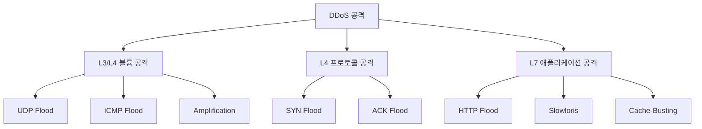
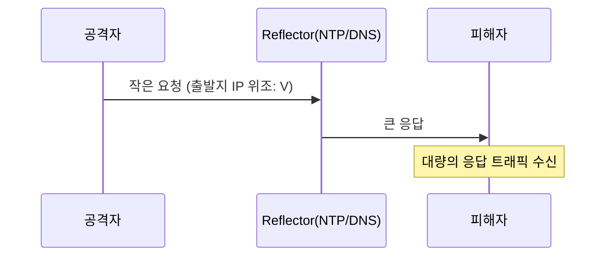
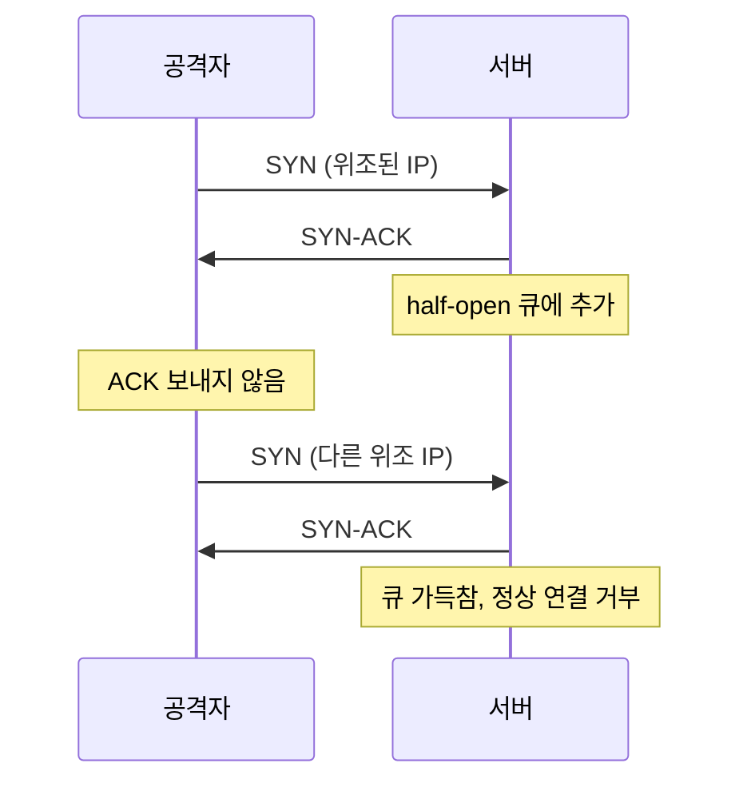

# DDoS 공격 방어

서비스를 운영하다 보면 트래픽이 갑자기 폭증하는 순간이 온다. 마케팅 효과로 인한 정상 트래픽일 수도 있고, 누군가 의도적으로 서비스를 마비시키려는 공격일 수도 있다. 5년차 개발자라면 한 번쯤은 새벽에 알람 받고 깨서 트래픽 그래프 보면서 "이거 정상 트래픽인가, 공격인가?" 고민해본 경험이 있을 것이다.

DDoS(Distributed Denial of Service)는 분산 서비스 거부 공격이다. 여러 출처에서 동시에 트래픽을 발생시켜 서버나 네트워크 자원을 고갈시키는 공격을 말한다. 단일 IP에서 오는 DoS와 달리 분산된 봇넷에서 오기 때문에 단순히 IP 차단으로 막기 어렵다.

## 공격 계층별 분류

DDoS는 OSI 7계층 중 어디를 노리느냐에 따라 성격이 완전히 다르다. 방어 방법도 계층별로 달라야 한다.



L3/L4는 네트워크 자체를 마비시키는 형태다. 대역폭(Gbps 단위)을 채워버리거나 라우터/방화벽의 처리 능력을 넘게 만든다. L7은 정상 HTTP 요청처럼 보이지만 서버 자원(CPU, DB 커넥션)을 고갈시킨다. L7은 트래픽 양은 적어도 서비스를 마비시킬 수 있다.

## L3/L4 볼륨 공격

### UDP Flood

UDP는 연결 상태가 없어서 출발지 IP를 위조하기 쉽다. 공격자는 위조된 IP에서 무작위 UDP 패킷을 대량으로 보낸다. 서버는 해당 포트에 서비스가 없으면 ICMP "Destination Unreachable"을 응답하느라 자원을 소모한다.

UDP Flood는 라우터와 방화벽 단에서 막아야 한다. 서버까지 도달하면 이미 늦은 경우가 많다. 클라우드 환경이면 ACL이나 Security Group에서 사용하지 않는 UDP 포트를 전부 차단해두는 게 첫 단계다.

### ICMP Flood

흔히 "Ping of Death"라고 부르지만 정확히는 ICMP Echo Request를 대량으로 보내는 공격이다. 서버는 매번 Echo Reply를 만들어야 하므로 자원이 고갈된다.

운영 환경에서는 외부에서 들어오는 ICMP를 일부 제한하거나 rate limit을 거는 게 일반적이다. 다만 ICMP를 완전히 차단하면 PMTU Discovery가 깨져서 일부 클라이언트의 패킷이 단편화되지 못해 통신이 끊기는 경우가 있다. 무작정 막지 말고 rate limit을 걸어야 한다.

### Amplification 공격

이게 진짜 골치 아프다. 공격자는 작은 요청을 보내고 서버는 큰 응답을 만든다. 게다가 출발지 IP를 피해자로 위조하면 응답이 피해자에게 쏟아진다. 이게 증폭(amplification) 공격의 핵심이다.

대표적인 증폭 비율(Amplification Factor)은 다음과 같다.

| 프로토콜 | 증폭 비율 |
|---------|----------|
| DNS | 28~54배 |
| NTP (monlist) | 약 556배 |
| Memcached | 10,000~50,000배 |
| SSDP | 약 30배 |
| CLDAP | 약 56배 |

2018년 GitHub에 1.35Tbps Memcached 공격이 들어왔을 때 증폭 비율이 51,000배였다. 공격자가 1Mbps만 써도 51Gbps가 피해자에게 쏟아지는 셈이다.



방어는 두 가지 방향이다. 첫째, 자신의 인프라가 reflector로 악용되지 않도록 한다. Memcached는 외부 노출을 절대 하지 말고, NTP는 monlist 명령어를 비활성화한다. 둘째, 피해자 입장에서는 클라우드 DDoS 방어 서비스를 쓰는 수밖에 없다. 단일 회선으로는 Tbps급 트래픽을 흡수할 수 없다.

## SYN Flood와 SYN Cookie

SYN Flood는 TCP 3-way handshake의 빈틈을 노린다. 클라이언트가 SYN을 보내면 서버는 SYN-ACK를 응답하고 ACK를 기다리는 half-open 상태가 된다. 이 상태로 큐(backlog)에 쌓이는데, 공격자가 ACK를 보내지 않으면 큐가 가득 차서 정상 연결을 못 받는다.



리눅스 서버라면 `net.ipv4.tcp_syncookies` 설정을 확인해야 한다. 대부분의 배포판에서 기본 활성화되어 있지만 가끔 비활성화된 경우가 있다.

```bash
# 현재 상태 확인
sysctl net.ipv4.tcp_syncookies

# 활성화
sysctl -w net.ipv4.tcp_syncookies=1

# 영구 적용
echo "net.ipv4.tcp_syncookies = 1" >> /etc/sysctl.conf
```

SYN Cookie의 동작 원리는 영리하다. 서버가 SYN을 받으면 큐에 저장하지 않고, 대신 클라이언트 정보(IP, 포트, MSS, 시간)를 해시해서 SYN-ACK의 시퀀스 번호에 인코딩해 보낸다. 클라이언트가 ACK를 보내면 ACK 번호를 검증해서 진짜 핸드셰이크였는지 확인한다. half-open 큐를 사용하지 않으니 큐가 차서 거부되는 일이 없다.

단점도 있다. SYN Cookie를 쓰면 SACK, Window Scale 같은 TCP 옵션을 정확히 보존하기 어렵다. 정상 시에는 사용하지 않다가 큐가 가득 찰 때만 활성화되는 방식이라 큰 문제는 아니지만, 고대역폭 환경에서 성능 저하가 있을 수 있다.

관련 커널 파라미터를 같이 조정하면 도움이 된다.

```bash
# half-open 큐 크기 (기본값보다 크게)
net.ipv4.tcp_max_syn_backlog = 8192

# SYN-ACK 재전송 횟수 줄이기 (기본 5 → 2)
net.ipv4.tcp_synack_retries = 2

# 사용된 소켓 빠르게 회수
net.ipv4.tcp_fin_timeout = 30
```

`tcp_max_syn_backlog`만 무작정 키우면 메모리만 잡아먹는다. 실제 트래픽 패턴 보면서 조정해야 한다.

## L7 애플리케이션 공격

### Slowloris

이게 가장 음흉한 공격이다. HTTP 헤더를 천천히 보내면서 연결을 유지한다. 서버 입장에서는 정상적인 느린 클라이언트처럼 보인다. 적은 트래픽으로도 워커 프로세스/스레드를 모두 점유해버린다.

```
GET / HTTP/1.1\r\n
Host: example.com\r\n
X-Random-1: aaaaa\r\n
(10초 후)
X-Random-2: bbbbb\r\n
(10초 후)
...
```

헤더를 절대 끝내지 않는다(`\r\n\r\n`을 보내지 않음). 서버는 요청이 완성되기를 기다리며 연결을 유지한다. Apache가 prefork 모드일 때 특히 취약했고, 그래서 worker 모드나 event 모드로 전환을 권장한다. nginx는 이벤트 기반이라 Slowloris에 비교적 강하지만 `client_header_timeout`을 짧게 잡지 않으면 여전히 문제가 된다.

```nginx
# 헤더 수신 타임아웃
client_header_timeout 10s;

# 본문 수신 타임아웃
client_body_timeout 10s;

# 헤더 전체 크기 제한
large_client_header_buffers 4 8k;

# 클라이언트별 동시 연결 수 제한
limit_conn addr 10;
```

`limit_conn`은 단독으로는 부족하다. 봇넷에서 오는 공격은 IP가 분산되어 있어서 IP당 10개 제한해도 IP 1만 개면 10만 연결이다. 그래도 단일 IP에서 오는 공격은 잘 막는다.

### HTTP Flood

정상적인 HTTP 요청을 대량으로 보낸다. 헤더 형태가 정상이고 User-Agent도 정상 브라우저로 위장한다. L4에서는 정상 트래픽과 구분이 안 된다.

GET Flood는 캐시로 막을 수 있다. 동일한 URL에 요청이 몰리면 CDN이나 nginx 캐시가 막아낸다. 문제는 동적 엔드포인트, 특히 `/api/search?q=xxx` 같은 검색 API다. 매번 DB까지 가야 하니 막지 못하면 DB가 먼저 죽는다.

POST Flood는 더 위험하다. 로그인 엔드포인트를 노리면 매 요청이 bcrypt 해싱을 유발한다. CPU가 순식간에 100% 찍힌다. 회원가입, 비밀번호 재설정처럼 비용이 큰 작업도 우선 보호 대상이다.

### Cache-Busting

캐시를 우회하는 공격이다. 쿼리 파라미터를 매번 다르게 보내서 캐시 키가 매번 달라지게 만든다.

```
GET /products?_=1234567890
GET /products?_=1234567891
GET /products?_=1234567892
```

CDN과 캐시는 쿼리 파라미터가 다르면 다른 리소스로 본다. 그래서 매번 origin까지 요청이 도달한다. 방어는 캐시 키에서 알 수 없는 파라미터를 제거하도록 설정하는 것이다.

```nginx
# 캐시 키에서 _ 파라미터 무시
proxy_cache_key "$scheme$request_method$host$uri$is_args$args";
proxy_cache_bypass $arg_nocache;

# 또는 특정 파라미터만 캐시 키에 포함
map $args $cache_args {
    ~*(^|&)category=([^&]*) "category=$2";
    default "";
}
proxy_cache_key "$scheme$request_method$host$uri?$cache_args";
```

Cloudflare를 쓴다면 Cache Rules에서 "Ignore Query String" 옵션을 활용하거나 특정 파라미터만 캐시 키에 포함시킬 수 있다.

## 클라우드 프로바이더 보호

### AWS Shield

AWS Shield는 두 단계로 나뉜다.

Shield Standard는 무료로 모든 AWS 사용자에게 자동 적용된다. CloudFront, Route 53, ELB 앞에서 SYN/UDP Flood, Reflection 공격을 차단한다. 일반적인 L3/L4 공격은 막아주지만 L7은 안 된다.

Shield Advanced는 월 3,000달러 + 데이터 처리료다. 1년 약정이 기본이고 24/7 DDoS Response Team(DRT) 지원이 포함된다. 가장 큰 매력은 cost protection이다. 공격으로 인한 EC2/ELB/CloudFront 사용량 증가에 대한 비용을 환불해준다. 공격 받아본 사람만 이게 얼마나 중요한지 안다. 1Tbps 공격 한 번에 데이터 전송 비용이 수억 원 나올 수 있다.

다만 Shield Advanced도 만능은 아니다. L7 공격은 WAF와 같이 써야 한다. AWS WAF가 별도 비용으로 청구되고, 룰셋 관리는 직접 해야 한다. Managed Rule Group을 쓰면 편하지만 룰당 추가 비용이 있다.

### Cloudflare

Cloudflare는 CDN 기반이라 origin이 노출되지 않는 게 큰 장점이다. 무료 플랜에서도 L3/L4 공격은 무제한 보호된다.

L7 보호 강도는 플랜에 따라 다르다. Pro($25/월), Business($250/월), Enterprise(협상)로 올라갈수록 룰셋과 분석 기능이 강화된다. 큰 공격 받을 가능성이 있으면 최소 Business는 써야 한다. Magic Transit은 IP 단위 보호를 제공하지만 Enterprise급 비용이다.

Cloudflare를 쓸 때 가장 중요한 건 origin IP를 절대 노출하지 않는 것이다. DNS에 직접 IP를 노출하거나, 서브도메인 중 일부가 Cloudflare를 거치지 않으면 거기로 직공격이 들어온다.

### 클라우드 보호의 한계

클라우드 보호 서비스를 맹신하면 안 된다. 몇 가지 한계가 있다.

첫째, L7 공격은 정상 트래픽과 구분이 어렵다. 봇이 정상 브라우저처럼 행동하면 차단 룰이 정상 사용자도 차단할 수 있다. False positive가 발생하면 매출 손실이 더 클 수도 있다.

둘째, 비용이다. AWS Shield Advanced 없이 단순히 ELB+EC2로 받으면 데이터 전송 비용이 폭발한다. 1Gbps만 받아도 시간당 수십 달러다.

셋째, Origin 노출이다. Cloudflare를 쓰더라도 SSH 포트가 외부에 열려 있거나 메일 서버 등 다른 서비스의 IP가 origin과 같으면 우회 공격이 가능하다.

## Rate Limiting 구현

Rate limiting은 모든 방어의 기본이다. 클라우드 서비스 외에 자체 인프라에서도 반드시 구현해야 한다.

### nginx limit_req

가장 흔한 방법이다. leaky bucket 알고리즘 기반이다.

```nginx
http {
    # 클라이언트 IP 기준, 10MB 메모리, 초당 10 요청
    limit_req_zone $binary_remote_addr zone=api:10m rate=10r/s;
    
    # 로그인 엔드포인트는 더 엄격하게
    limit_req_zone $binary_remote_addr zone=login:10m rate=5r/m;
    
    server {
        location /api/ {
            # 버스트 20개까지 허용, nodelay로 즉시 처리
            limit_req zone=api burst=20 nodelay;
            limit_req_status 429;
            proxy_pass http://backend;
        }
        
        location /login {
            limit_req zone=login burst=3 nodelay;
            limit_req_status 429;
            proxy_pass http://backend;
        }
    }
}
```

`burst`는 버킷 크기다. `nodelay`는 버스트 내에서 즉시 처리한다. 없으면 rate에 맞춰 천천히 처리해서 응답이 느려진다. 일반 API에는 `nodelay`가 사용자 경험에 좋다.

CDN/프록시 뒤에 있다면 `$binary_remote_addr` 대신 `$http_x_forwarded_for`를 써야 한다. 다만 X-Forwarded-For는 위조 가능하니 신뢰 가능한 프록시에서만 받도록 `set_real_ip_from`을 설정해야 한다.

```nginx
set_real_ip_from 173.245.48.0/20;  # Cloudflare IP 대역
set_real_ip_from 103.21.244.0/22;
real_ip_header CF-Connecting-IP;
```

### Redis 기반 토큰 버킷

분산 환경에서는 nginx 단일 서버 rate limit으로는 부족하다. 여러 서버에 트래픽이 분산되면 각 서버가 본 트래픽만 카운트하므로 실제 제한이 N배로 느슨해진다. Redis로 중앙 집중식 카운터를 만들어야 한다.

토큰 버킷 알고리즘은 시간당 일정 속도로 토큰이 채워지고, 요청마다 토큰을 소비한다. 토큰이 없으면 거부한다. Lua 스크립트로 atomic하게 구현한다.

```lua
-- token_bucket.lua
-- KEYS[1]: bucket key
-- ARGV[1]: capacity (최대 토큰)
-- ARGV[2]: refill_rate (초당 토큰 보충)
-- ARGV[3]: now (현재 시간, ms)
-- ARGV[4]: requested (요청 토큰 수)

local key = KEYS[1]
local capacity = tonumber(ARGV[1])
local refill_rate = tonumber(ARGV[2])
local now = tonumber(ARGV[3])
local requested = tonumber(ARGV[4])

local bucket = redis.call('HMGET', key, 'tokens', 'last_refill')
local tokens = tonumber(bucket[1]) or capacity
local last_refill = tonumber(bucket[2]) or now

-- 경과 시간만큼 토큰 보충
local elapsed = math.max(0, now - last_refill) / 1000
local new_tokens = math.min(capacity, tokens + elapsed * refill_rate)

if new_tokens < requested then
    redis.call('HMSET', key, 'tokens', new_tokens, 'last_refill', now)
    redis.call('EXPIRE', key, math.ceil(capacity / refill_rate))
    return {0, new_tokens}
end

new_tokens = new_tokens - requested
redis.call('HMSET', key, 'tokens', new_tokens, 'last_refill', now)
redis.call('EXPIRE', key, math.ceil(capacity / refill_rate))
return {1, new_tokens}
```

Node.js에서 호출하는 예시다.

```javascript
const Redis = require('ioredis');
const redis = new Redis();

const tokenBucketScript = `
-- 위 Lua 스크립트 내용
`;

const SCRIPT_SHA = await redis.script('LOAD', tokenBucketScript);

async function checkRateLimit(userId, capacity = 100, refillRate = 10) {
    const key = `rl:${userId}`;
    const now = Date.now();
    
    const [allowed, remaining] = await redis.evalsha(
        SCRIPT_SHA,
        1,
        key,
        capacity,
        refillRate,
        now,
        1
    );
    
    return {
        allowed: allowed === 1,
        remaining: Math.floor(remaining)
    };
}

// Express 미들웨어
app.use(async (req, res, next) => {
    const userId = req.user?.id || req.ip;
    const result = await checkRateLimit(userId, 60, 1);
    
    res.set('X-RateLimit-Remaining', result.remaining);
    
    if (!result.allowed) {
        return res.status(429).json({ error: 'Too Many Requests' });
    }
    
    next();
});
```

EVALSHA로 호출해야 매번 스크립트를 전송하지 않는다. NOSCRIPT 에러 시 EVAL로 fallback해야 한다.

토큰 버킷의 장점은 burst 처리가 가능하다는 점이다. 사용자가 잠시 안 쓰다가 갑자기 여러 요청을 보내도 쌓인 토큰만큼은 즉시 처리된다. UX 측면에서 슬라이딩 윈도우보다 부드럽다.

## 봇 트래픽 식별

L7 공격을 막으려면 봇과 사람을 구분해야 한다. 완벽하지는 않지만 몇 가지 패턴이 있다.

User-Agent 분석이 첫 단계다. 비어있거나, 오래된 버전(Chrome 50대), 알려진 봇 라이브러리(`python-requests`, `curl`, `Go-http-client`) 같은 패턴은 의심해야 한다. 다만 정상 봇(Googlebot, Bingbot)은 차단하면 안 된다. IP 역방향 DNS로 검증한다.

행동 패턴도 중요하다. 정상 사용자는 페이지를 로드한 후 정적 자원(CSS, JS, 이미지)을 같이 받는다. HTML만 받고 정적 자원을 안 받으면 봇일 가능성이 높다. JavaScript 실행이 안 되면 SPA가 동작 안 하니 정상 트래픽이 아니다.

Cloudflare나 AWS WAF는 JavaScript Challenge나 CAPTCHA를 자동으로 띄워준다. 의심 트래픽에 한해 적용하면 정상 사용자에게 영향을 최소화할 수 있다. 다만 시각 장애인이나 특수 환경에서 CAPTCHA를 풀지 못하는 경우가 있어서 무차별 적용은 피해야 한다.

ASN(Autonomous System Number) 기반 차단도 효과적이다. 데이터센터 ASN(AWS, GCP, DigitalOcean, OVH)에서 오는 트래픽은 일반 사용자가 아닐 가능성이 높다. VPN 사용자가 일부 있겠지만, 의심 트래픽이라면 추가 검증을 거치게 한다.

```javascript
// 의심 패턴 점수화
function calculateRiskScore(req) {
    let score = 0;
    
    const ua = req.headers['user-agent'] || '';
    if (!ua) score += 30;
    if (/curl|wget|python|java|go-http/i.test(ua)) score += 50;
    if (/Chrome\/(4[0-9]|5[0-9])\./.test(ua)) score += 20;
    
    // Accept 헤더 누락
    if (!req.headers['accept']) score += 20;
    if (!req.headers['accept-language']) score += 15;
    
    // 정적 자원 요청 비율 체크 (Redis에서 IP별 통계)
    // ...
    
    return score;
}
```

이런 점수가 임계값을 넘으면 CAPTCHA로 redirect하거나 더 엄격한 rate limit을 적용한다.

## 트래픽 폭주 시 대응 절차

새벽에 알람이 떠서 일어났다. 트래픽이 평소의 100배다. 이때 무엇을 해야 하는가?

### 1단계: 상황 파악

먼저 정상 트래픽인지 공격인지 구분한다. 마케팅 캠페인, 인플루언서 언급, 뉴스 노출 등으로 정상 트래픽이 폭증할 수 있다. 트래픽 출처를 본다.

```bash
# nginx access log에서 상위 IP 추출
awk '{print $1}' /var/log/nginx/access.log | sort | uniq -c | sort -rn | head -20

# User-Agent 분포
awk -F'"' '{print $6}' /var/log/nginx/access.log | sort | uniq -c | sort -rn | head -20

# 특정 시간대 요청 수
awk '{print $4}' /var/log/nginx/access.log | cut -d: -f1-2 | sort | uniq -c
```

특정 IP/ASN/User-Agent에 집중되어 있으면 공격이다. 반면 다양한 정상 UA에서 분산되어 들어오면 정상 폭증일 가능성이 높다.

### 2단계: 즉시 대응

공격이라고 판단되면 다음 순서로 대응한다.

**Origin IP 숨기기**: 가장 먼저 origin IP를 외부에서 직접 접근 못하게 한다. 보안 그룹에서 Cloudflare/CDN IP 대역만 허용하도록 변경한다.

```bash
# AWS CLI 예시
aws ec2 authorize-security-group-ingress \
    --group-id sg-xxxxx \
    --protocol tcp \
    --port 443 \
    --cidr 173.245.48.0/20  # Cloudflare IPv4 대역
```

이미 origin IP가 노출되었다면 IP를 변경해야 할 수도 있다. ELB는 새로 만들면 IP가 바뀐다. EC2는 Elastic IP를 dissociate하고 새로 발급받는다.

**5xx 페이지 정적화**: 모든 동적 처리를 멈추고 정적 페이지를 띄운다. CDN 단에서 Maintenance 페이지를 서빙하면 origin 부하가 0에 가까워진다.

```nginx
# nginx에서 임시로 정적 페이지만 서빙
server {
    listen 443 ssl;
    server_name example.com;
    
    location / {
        return 503;
    }
    
    error_page 503 /maintenance.html;
    location = /maintenance.html {
        root /var/www/static;
        internal;
    }
}
```

핵심 페이지(결제, 로그인)만 살려두고 나머지는 정적 페이지로 돌리는 것도 방법이다. 매출 손실은 최소화하면서 자원은 절약한다.

**Geo-block**: 공격이 특정 국가에서 집중되면 일시적으로 해당 국가를 차단한다. 한국 서비스인데 동유럽이나 동남아에서 트래픽이 폭증한다면 명확한 신호다.

```nginx
# nginx geo 모듈
geo $allowed_country {
    default 0;
    include /etc/nginx/conf.d/kr_ip_ranges.conf;  # 한국 IP 대역
}

server {
    if ($allowed_country = 0) {
        return 403;
    }
}
```

Cloudflare에서는 Firewall Rules에서 한 줄로 처리한다. `(ip.geoip.country ne "KR")` 차단.

### 3단계: 분석과 룰 작성

기본 차단이 적용되면 로그를 보면서 정밀한 룰을 만든다. 공격 패턴은 보통 특정 URL, 특정 헤더 조합, 특정 User-Agent 패턴을 가진다.

```bash
# 공격 트래픽의 URL 분포
awk '{print $7}' /var/log/nginx/access.log | sort | uniq -c | sort -rn | head -20

# 응답 코드 분포 (500/503이 많으면 origin 부하 신호)
awk '{print $9}' /var/log/nginx/access.log | sort | uniq -c | sort -rn
```

공격 패턴을 찾으면 WAF 룰로 정형화한다. AWS WAF나 Cloudflare WAF에서 커스텀 룰을 추가한다. Geo-block은 정상 사용자도 차단하므로 가능한 빨리 정밀 룰로 대체해야 한다.

### 4단계: 사후 분석

공격이 끝난 후에는 반드시 회고를 해야 한다. 어떤 알람이 가장 먼저 울렸는가, 대응까지 얼마나 걸렸는가, 어떤 룰이 효과적이었는가를 정리한다. 다음 공격에 대비한 runbook을 갱신한다.

비용도 확인한다. 데이터 전송, EC2 추가 사용량, WAF 룰 평가 비용 등이 청구서에 반영된다. AWS Shield Advanced를 쓰고 있으면 cost protection 신청을 잊지 말아야 한다.

## 마무리

DDoS 방어는 단일 솔루션으로 끝나지 않는다. CDN/Shield 같은 클라우드 보호, 인프라 단의 SYN Cookie와 커널 튜닝, 애플리케이션 단의 rate limiting과 캐싱, 운영 단의 모니터링과 runbook이 모두 필요하다.

평소에 origin IP 숨기기, rate limit 룰 적용, 트래픽 모니터링, 5xx 정적 페이지 준비 같은 기본기를 갖춰두지 않으면 새벽에 공격 받았을 때 대응할 시간이 없다. 공격 받기 전에 한 번씩 시뮬레이션해보고 runbook을 정리해두는 것이 실전에서 가장 중요한 준비다.
