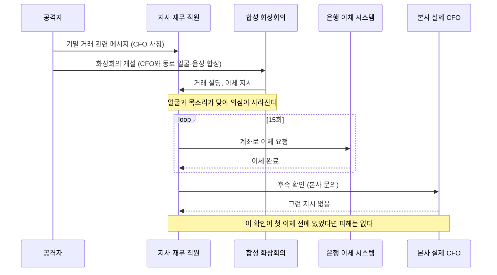
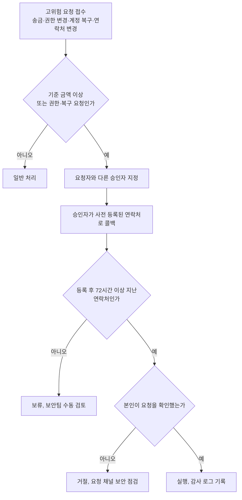
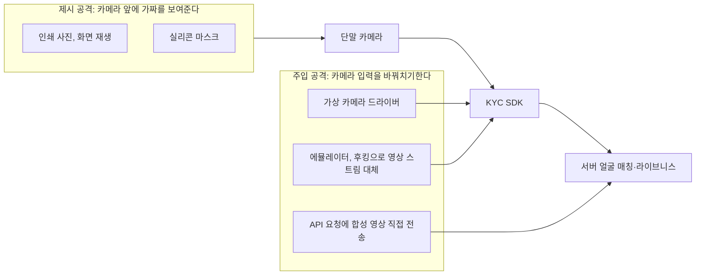
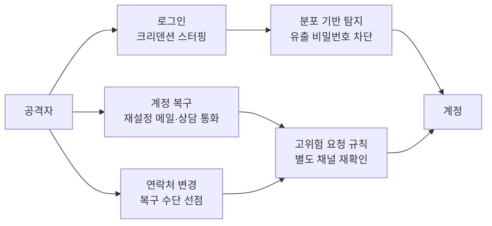

# 딥페이크와 AI 사기

[AI로 보안 강화하기](AI_for_Security.md)는 방어하는 쪽이 LLM을 어디에 넣고 어디에 넣지 말아야 하는지를 다룬다. 이 문서는 반대편, 공격자가 AI를 쓰기 시작하면서 서비스 운영자가 실제로 마주치는 사기 유형을 다룬다. 새로운 취약점은 거의 없다. 코드의 버그가 아니라 사람과 절차, 그리고 본인확인 단계가 공격 대상이다.

운영하면서 가장 먼저 바뀐 건 "이 요청을 한 사람이 진짜 그 사람인가"를 판단하는 근거였다. 문장이 자연스러운지, 목소리가 맞는지, 영상 속 얼굴이 맞는지로 판단하던 것들이 전부 근거가 되지 못한다. 그래서 대응도 탐지 쪽보다 절차 쪽에 무게가 실린다. 탐지기가 왜 단독 방어선이 못 되는지는 마지막 절에서 숫자로 본다.

## 문장 품질이 신호가 아니게 된 이후의 피싱

번역투와 어색한 호칭으로 피싱을 가려내던 시기는 끝났다. 한 연구진이 낸 실험에서 GPT-4 기반 도구가 자동으로 만든 스피어피싱 메일의 클릭률은 54%였고, 사람 전문가가 만든 메일(54%)과 같았다. 무작위로 보낸 일반 피싱(대조군)은 12%였다. 사람이 AI 초안을 다듬은 쪽은 56%였다. [Heiding 외, 완전 자동 스피어피싱 평가 (arXiv 2412.00586)](https://arxiv.org/abs/2412.00586) 실험 참가자를 대상으로 한 측정이라 실제 공격 성공률과 같지는 않다. 다만 "AI가 쓴 메일은 티가 난다"는 가정을 깔고 설계한 필터와 교육이 더는 맞지 않는다는 방향은 분명하다.

FBI도 같은 방향으로 경고한다. 생성형 AI로 문법·철자 오류를 없애고, 가짜 프로필을 대량으로 만들고, 신분증 사진과 음성을 합성해 사기에 쓴다는 내용이다. [FBI IC3 공지 I-241203-PSA](https://www.ic3.gov/PSA/2024/PSA241203)

### 메일 필터가 놓치는 지점

문장 품질이 사라진 자리에 남는 신호는 본문 바깥에 있다. 필터가 어디를 보고 있었는지 나눠 보면 무엇이 빠지는지 드러난다.

| 필터가 보던 것 | 지금 상황 |
|---|---|
| 본문 문체, 오타, 어색한 호칭 | 거의 사라졌다. 사실상 신호가 아니다 |
| 같은 본문의 대량 발송(해시, 유사도 군집) | 수신자마다 본문이 달라서 묶이지 않는다 |
| 악성 링크, 첨부 파일 | "지금 통화 가능하세요?" 한 줄에는 링크도 첨부도 없다 |
| 발신 도메인 평판 | 새로 등록한 도메인은 평판 기록 자체가 없다 |
| SPF·DKIM·DMARC | 공격자 도메인에서는 통과한다. 통과가 곧 안전은 아니다 |

세 번째 줄이 중요하다. 임원 사칭 메일의 목적은 링크를 누르게 하는 게 아니라 대화를 다른 채널(메신저, 전화, 화상회의)로 옮기는 것이다. 검사할 URL도 첨부도 없으니 콘텐츠 검사 엔진이 볼 게 없다. 마지막 줄도 오해하기 쉽다. DMARC 정렬은 "이 메일이 그 도메인에서 왔다"는 뜻이지 "그 도메인이 믿을 만하다"는 뜻이 아니다. 공격자는 `example-corp.com` 대신 `examp1e-corp.com`을 사서 정상 인증을 통과시킨다.

그래서 룰이 보는 대상은 발신 정보와 도메인 쪽으로 이동한다. 아래는 표시 이름이 임원인데 외부 도메인인 경우, 우리 도메인과 편집 거리가 가까운 도메인, Reply-To가 From과 다른 경우, 등록한 지 얼마 안 된 도메인을 잡는 최소 형태다.

```python
from email.utils import parseaddr

OWN_DOMAINS = {"example-corp.com"}
EXEC_NAMES = {"김대표", "박재무이사"}


def edit_distance(a: str, b: str) -> int:
    prev = list(range(len(b) + 1))
    for i, ca in enumerate(a, 1):
        cur = [i]
        for j, cb in enumerate(b, 1):
            cur.append(min(prev[j] + 1, cur[j - 1] + 1, prev[j - 1] + (ca != cb)))
        prev = cur
    return prev[-1]


def score_sender(from_header: str, reply_to: str | None, domain_age_days: int | None) -> list[str]:
    name, addr = parseaddr(from_header)
    domain = addr.rsplit("@", 1)[-1].lower()
    hits = []

    if name.replace(" ", "") in EXEC_NAMES and domain not in OWN_DOMAINS:
        hits.append("display_name_is_exec_but_external_domain")

    for own in OWN_DOMAINS:
        if domain != own and edit_distance(domain, own) <= 2:
            hits.append(f"lookalike_domain:{own}")

    if reply_to:
        _, rt_addr = parseaddr(reply_to)
        if rt_addr.rsplit("@", 1)[-1].lower() != domain:
            hits.append("reply_to_domain_differs")

    if domain_age_days is not None and domain_age_days < 30:
        hits.append("domain_registered_under_30_days")
    return hits
```

`"김대표" <ceo@examp1e-corp.com>`에 Reply-To를 외부 무료 메일로 두고 도메인 나이를 6일로 넣으면 네 개가 전부 걸리고, 정상 주소는 빈 리스트가 나온다. 도메인 나이는 WHOIS/RDAP 조회 결과를 캐시해서 넣는다. 실시간 조회를 메일 경로에 직접 넣으면 조회 지연이 메일 지연이 된다.

이 룰은 막는 장치가 아니라 점수를 올리는 장치다. 편집 거리 2 이하는 정상 거래처 도메인과도 우연히 겹치는 경우가 있어서 단독 차단 근거로 쓰면 오탐이 난다. 격리보다는 "외부 발신, 임원 사칭 의심" 배너를 붙이는 쪽이 운영하기 쉬웠다.

## 임원 사칭 송금 사고에서 실제로 일어난 일

딥페이크 사기의 사례는 부풀려 인용되는 경우가 많다. 출처가 있는 건만 추리면 아래와 같다.

| 시점 | 대상 | 수법 | 결과 |
|---|---|---|---|
| 2019년 3월 | 영국 에너지 회사 | 독일 모회사 CEO의 목소리를 합성한 전화 | 약 €220,000(US$243,000) 이체 |
| 2024년 1월 | Arup 홍콩 지사 | 영국 본사 CFO와 동료들을 합성한 화상회의 | 15회 이체, 총 HK$200 million |
| 2024년 5월 | WPP | 대표 사진으로 만든 WhatsApp 계정, 음성 합성, Teams 회의 | 실패 |
| 2024년 7월 | Ferrari 임원 | CEO를 사칭한 WhatsApp 메시지와 음성 합성 통화 | 실패 |

2019년 사건은 Euler Hermes 쪽 사기 전문가 증언을 근거로 WSJ가 보도했다. 영국 지사 CEO가 독일 모회사 CEO의 억양과 말투가 그대로인 전화를 받고 한 시간 안에 헝가리 공급업체로 송금했다. 공격자는 같은 목소리로 두 번 더 전화해서 환급이 됐다고 거짓말을 하고 추가 송금을 요구했다. [Sophos 정리 (WSJ 보도 인용)](https://news.sophos.com/en-us/2019/09/05/scammers-deepfake-ceos-voice-to-talk-underling-into-243000-transfer/) 이 사건에서 눈여겨볼 건 음성 하나가 아니라 "한 시간 안에"라는 시간 압박과 전화를 세 번 건 집요함이다.

Arup 사건은 2024년 1월 홍콩 지사 직원이 영국 본사 CFO라고 주장하는 쪽에서 "기밀 거래"에 관한 메시지를 받으면서 시작됐다. 이어진 화상회의에는 CFO와 여러 동료가 나왔고, 전부 합성이었다. 직원은 다섯 개 홍콩 은행 계좌로 15번에 걸쳐 총 HK$200 million을 보냈고, 이후 본사에 확인하고서야 사기임을 알았다. Arup은 가짜 음성과 이미지가 쓰였다고 확인했고 내부 시스템은 침해되지 않았다고 밝혔다. [Dezeen, Arup deepfake 사건 보도](https://www.dezeen.com/2024/05/17/arup-victim-deepfake-video-scam/)

내부 시스템이 침해되지 않았다는 말이 핵심이다. 방화벽, EDR, 메일 보안이 전부 정상이었어도 일어난 사고다. 15번이라는 횟수도 걸린다. 첫 이체에서 멈출 수 있는 지점이 열네 번 더 있었다는 뜻이다.

실패한 두 건에서는 방어가 어디서 먹혔는지가 보인다. WPP는 공격자가 대표의 공개 사진으로 WhatsApp 계정을 만들고 Teams 회의를 열었다. 음성 합성과 YouTube 영상을 쓰고 채팅창으로 새 사업 설립과 개인 정보를 요구했지만 시도는 실패했다. [AI Incident Database 983](https://incidentdatabase.ai/cite/983/) Ferrari 임원은 CEO 목소리의 억양은 정확했지만 말의 리듬이 기계적으로 끊기는 걸 이상하게 여겼고, CEO가 며칠 전 추천해 준 책 제목을 물었다. 대답이 없이 통화가 끊겼다. [AI Incident Database 966](https://incidentdatabase.ai/cite/966/) Ferrari는 탐지 도구가 아니라 둘만 아는 정보를 묻는 질문 하나가 막았다. 사람 한 명의 기지에 의존하는 방어는 운이 좋을 때 한 번 통한다는 점도 같이 읽어야 한다.

### 공격 흐름

Arup 사건을 기준으로 각 단계에서 어떤 정보가 누구에게 보이는지를 그려 보면 방어가 들어갈 자리가 보인다. 공격자가 직원에게 닿는 경로가 전부 직원이 확인할 수 없는 채널이라는 점을 보면 된다.



시퀀스에서 직원이 본사에 확인하는 단계는 맨 끝에 있다. 방어를 설계한다는 건 이 단계를 앞으로 끌어와서 사람의 기분이 아니라 시스템이 강제하게 만드는 일이다.

## 고위험 요청을 별도 채널로 확인하는 구조

사칭 사고에서 공통된 건 요청이 들어온 채널로 그대로 확인했다는 점이다. 메일로 온 요청을 메일 답장으로, 화상회의로 온 요청을 같은 회의에서 확인한다. 이 채널은 공격자가 이미 쥐고 있다. 확인은 요청이 오지 않은 경로로 해야 의미가 있다.

서비스를 운영하는 쪽에서 고위험 요청에 해당하는 건 정해져 있다. 송금과 정산 계좌 변경, 관리자 권한 부여, 계정 복구, 그리고 복구에 쓰이는 연락처 변경이다. 이 네 가지에 공통 규칙을 건다.

### 승인 단계 분리

아래 흐름은 요청이 들어온 뒤 승인까지 거치는 단계다. 요청자와 승인자가 달라야 하고, 승인자가 요청 채널이 아닌 곳으로 재확인해야만 실행된다.



승인 조건을 코드로 두면 사람이 바쁠 때 건너뛰는 일이 없어진다. 콘솔에서 승인 버튼을 누르는 순간 검증하는 최소 형태다.

```typescript
type RiskKind = "payout" | "role_change" | "account_recovery" | "contact_change";

interface HighRiskRequest {
  id: string;
  kind: RiskKind;
  requestedBy: string;
  amount?: number;
  channel: "email" | "messenger" | "phone" | "console";
}

interface ApprovalInput {
  approverId: string;
  callbackConfirmedAt: Date | null;
  callbackTarget: { value: string; registeredAt: Date } | null;
}

const COOLING_MS = 72 * 3600 * 1000;
const PAYOUT_THRESHOLD = 5_000_000;

function needsSecondApprover(r: HighRiskRequest): boolean {
  if (r.kind === "payout") return (r.amount ?? 0) >= PAYOUT_THRESHOLD;
  return true;
}

function assertCanApprove(r: HighRiskRequest, a: ApprovalInput, now: Date): void {
  if (a.approverId === r.requestedBy) {
    throw new Error("requester cannot approve own request");
  }
  if (!a.callbackConfirmedAt) {
    throw new Error("callback confirmation missing");
  }
  const t = a.callbackTarget;
  if (!t || now.getTime() - t.registeredAt.getTime() < COOLING_MS) {
    throw new Error("callback target is missing or registered within cooling period");
  }
}
```

기준 금액과 72시간은 예시 값이다. 우리 거래 규모와 정산 주기에 맞춰 정해야 하고, 기준을 너무 낮게 잡으면 승인 요청이 쌓여 사람들이 콜백을 형식적으로 처리하기 시작한다. 승인이 일상이 되면 방어는 죽는다.

### 콜백 번호의 출처

콜백 번호는 요청 안에 들어 있던 번호를 쓰면 안 된다. "이 번호로 확인해 주세요"라는 문장 자체가 공격자의 것이다. 번호는 시스템에 미리 등록된 값에서만 가져와야 한다.

여기서 한 번 더 막힌다. 공격자는 연락처를 먼저 바꾼다. 계정 복구용 전화번호나 정산 담당자 번호를 자기 것으로 바꿔 두면 이후 콜백이 공격자에게 간다. 그래서 연락처 변경도 고위험 요청에 넣고, 변경 직후 일정 시간은 그 연락처를 콜백 대상으로 인정하지 않는다. 위 코드의 `COOLING_MS`가 그 장치다. 변경 알림은 기존 연락처로 보낸다. 새 연락처로 보내는 알림은 아무 의미가 없다.

## 본인확인 우회

원격 본인확인(KYC)은 신분증 사진, 셀피, 라이브니스 검사로 구성된다. 딥페이크는 이 세 군데를 다 건드린다. 공격 지점은 둘로 나눠 봐야 방어가 헷갈리지 않는다.

### 막는 대상이 둘로 갈린다



제시 공격은 카메라가 실제 장면을 본다. 라이브니스 검사(깜빡임, 질감, 깊이)가 겨냥하는 대상이 이쪽이다. 주입 공격은 카메라를 건너뛰고 앱이나 서버가 받는 영상 자체를 갈아끼운다. 제시 공격 방어를 아무리 잘 만들어도 입력 경로가 뚫려 있으면 통과한다. Gartner는 2026년까지 기업의 30%가 얼굴 생체 인증 기반 본인확인 솔루션을 단독으로는 신뢰하지 않게 된다고 내다봤고, 현행 PAD 표준·시험이 AI 합성 영상을 이용한 디지털 주입 공격을 다루지 않는다는 점을 이유로 들었다. [FutureCIO, Gartner 예측 소개](https://futurecio.tech/deepfakes-to-render-identity-verification-and-authentication-solutions-inefficient/) 이 예측의 숫자보다 PAD만으로는 부족하다는 구조적 지적이 더 쓸모 있다.

신분증 쪽에서는 `OnlyFake`라는 사이트가 사례가 됐다. 신경망으로 신분증 이미지를 만들어 준다며 장당 15달러를 받았고, 404 Media 기자가 이 서비스로 만든 이미지로 암호화폐 거래소 OKX의 KYC를 통과했다. 다만 실제로 AI가 쓰였다는 증거는 약하다는 지적이 있어서, 이 사례에서 가져갈 건 "사진 한 장짜리 문서 검증이 싸게 뚫린다"는 사실이다. [404 Media, OnlyFake 조사](https://www.404media.co/onlyfake-neural-network-fake-id-site-goes-dark-after-404-media-investigation/)

### 서버에서 볼 수 있는 신호

영상이 진짜인지 서버에서 판정하려 들면 지는 싸움이다. 대신 영상 바깥의 기록은 합성하기 어렵다. FinCEN도 금융기관에 딥페이크 의심 신호로 문서와 맞지 않는 지리·단말 정보, 탐지 소프트웨어가 걸러낸 사진·영상, 개설 직후 고위험 수취인에게 몰리는 거래를 들었다. [FinCEN Alert FIN-2024-Alert004](https://www.fincen.gov/news/news-releases/fincen-issues-alert-fraud-schemes-involving-deepfake-media-targeting-financial)

| 신호 | 왜 쓸 만한가 | 오탐이 나는 경우 |
|---|---|---|
| 서버가 발급한 nonce와 제출 시간 간격 | 사전 녹화·주입 영상은 챌린지 응답 시차가 규칙적이거나 비정상적으로 짧다 | 네트워크 지연이 큰 환경 |
| 기기 무결성 증명(Play Integrity, App Attest) | 에뮬레이터·후킹 환경에서 증명이 실패한다 | 루팅 사용자, 구형 기기 |
| 얼굴 템플릿의 계정 간 중복 | 한 얼굴로 여러 신원을 만드는 경우가 잡힌다 | 쌍둥이, 가족 |
| 문서 번호·문서 이미지 해시 재사용 | 같은 합성 템플릿 재활용이 잡힌다 | 재가입, 재촬영 |
| 문서 발급국과 접속 IP 국가 불일치 | FinCEN이 드는 신호다 | 해외 거주·출장자, VPN |
| 가상 카메라 의심 정보(장치 이름, 해상도·프레임 분포) | 주입 공격 단말에서 드러난다 | 화상회의 앱을 같이 쓰는 사용자 |

이 신호들은 하나로 차단하지 않고 점수로 합친다. 합산 후 점수에 따라 통과, 추가 인증, 수동 심사로 나눈다.

```python
from dataclasses import dataclass


@dataclass
class KycSession:
    doc_country: str
    ip_country: str
    device_attested: bool
    virtual_camera_suspected: bool
    capture_to_submit_ms: int
    face_template_matches_other_accounts: int
    doc_number_seen_before: bool
    doc_image_phash_dup: bool


def kyc_signals(s: KycSession) -> dict[str, int]:
    w = {}
    if s.doc_country != s.ip_country:
        w["geo_mismatch"] = 1
    if not s.device_attested:
        w["no_device_attestation"] = 2
    if s.virtual_camera_suspected:
        w["virtual_camera"] = 4
    if s.capture_to_submit_ms < 1500:
        w["submit_too_fast"] = 2
    if s.face_template_matches_other_accounts > 0:
        w["face_reuse"] = 3 + min(s.face_template_matches_other_accounts, 5)
    if s.doc_number_seen_before:
        w["doc_number_reuse"] = 4
    if s.doc_image_phash_dup:
        w["doc_image_dup"] = 3
    return w


def decide(w: dict[str, int]) -> str:
    total = sum(w.values())
    if total >= 7:
        return "manual_review"
    if total >= 3:
        return "step_up"
    return "pass"
```

가중치는 예시다. 국가 불일치가 1점인 이유는 정상 사용자 중에도 흔해서이고, 가상 카메라 의심이 4점인 이유는 정상 사용자가 KYC 촬영 중 가상 카메라를 쓸 일이 드물어서다. 숫자는 서비스의 실제 사기 사례와 정상 사용자 분포를 보면서 정해야 한다. 점수만 보고 통과시킨 계정은 이후 행동(가입 직후 고액 이체, 새 수취인 반복 등록)도 계속 점수에 반영한다. 본인확인은 가입 시점 한 번으로 끝나는 검사가 아니다.

## 자동화 계정 탈취의 고도화

[크리덴션 스터핑](Credential_Stuffing.md)은 유출된 아이디·비밀번호 쌍을 로그인에 넣어 보는 공격이고, 방어의 중심은 계정별 실패 횟수가 아니라 요청 전체의 분포였다. AI가 이 공격을 바꾸는 방향은 셋이다.

하나는 챌린지 통과 비용이다. Searles 외의 USENIX Security 2023 연구에서 봇은 왜곡 텍스트 CAPTCHA를 거의 100% 풀었고 사람은 50~84%였다. 1,400명이 CAPTCHA 14,000개를 푼 실험이다. [Searles 외, An Empirical Study & Evaluation of Modern CAPTCHAs 소개 (UC Irvine)](https://ics.uci.edu/2023/09/14/new-findings-on-captchas-attract-worldwide-attention/) CAPTCHA는 공격 단가를 올리는 장치이지 방어선이 아니다. 로그인 보호를 CAPTCHA 하나에 걸어 둔 서비스는 다시 설계해야 한다.

둘은 적응 비용이다. 고정된 셀렉터로 로그인 폼을 채우는 봇은 페이지 구조가 바뀌면 깨졌다. 화면을 읽고 폼을 찾는 에이전트형 봇이라면 이 비용이 줄어든다. 실제로 이 효과를 측정한 수치를 이 문서에서 제시하지는 않는다. 다만 "프런트 구조를 바꾸면 봇이 며칠은 멈춘다"는 기대는 접어야 한다.

셋은 공격 경로의 이동이다. 로그인 쪽 방어가 올라가면 상대적으로 약한 계정 복구 경로로 간다. 상담 챗봇과 상담원에게 사칭 통화를 걸거나, 비밀번호 재설정 메일을 노리거나, 복구 연락처 변경을 시도한다. 그림으로 보면 같은 계정 하나를 두고 입구가 여럿이다.



로그인 입구 방어는 [크리덴션 스터핑](Credential_Stuffing.md)의 다차원 슬라이딩 윈도우, 단계별 대응, 뚫린 계정 처리를 그대로 쓴다. 이 문서에서 달라지는 건 복구와 연락처 변경 입구다. 상담 채널에서 계정 복구나 연락처 변경을 처리하는 순간 앞 절의 고위험 요청 규칙이 같이 걸려야 한다. 로그인에서 막은 공격자가 통화 한 번으로 복구에 성공한다면 로그인 방어에 쓴 비용은 의미가 없다. [Rate Limiting](Rate_Limiting.md)과 [로그인 무차별 대입 방어](../Backend/Authentication/Login_Brute_Force_Protection.md)는 입구를 좁히는 쪽이고, 비밀번호 재사용 자체를 없애는 방법은 [다중 인증과 패스키](../Backend/Authentication/MFA_Passkey.md)와 [WebAuthn·Passkeys](Web_Authn_Passkeys.md)에 있다. 패스키는 비밀번호가 없어서 유출 쌍을 넣어 볼 대상이 사라진다. 대신 패스키 분실 시 복구 경로가 새 취약점이 되므로 복구 절차를 약하게 남겨 두지 않는다.

## 탐지기에 기대면 안 되는 이유

딥페이크 영상·AI 생성 텍스트 탐지기를 붙이면 해결될 거라는 기대가 있다. 실측은 반대다.

Meta가 주최한 Deepfake Detection Challenge에서 우승 모델(Selim Seferbekov)의 평균 정밀도는 공개 데이터셋에서 82.56%였고, 참가자에게 공개하지 않은 블랙박스 데이터셋(10,000개 영상, 인터넷에서 수집한 실제 영상 포함)에서는 65.18%로 떨어졌다. [Meta AI, DFDC 결과](https://ai.meta.com/blog/deepfake-detection-challenge-results-an-open-initiative-to-advance-ai/) 본 적 없는 합성 방식 앞에서 성능이 크게 내려간다는 뜻이다. 공격자는 탐지기가 학습한 방식이 아닌 다른 생성 도구를 쓰면 된다.

텍스트 쪽은 오탐이 문제다. Liang 외의 연구에서 GPT 탐지기들은 비원어민이 쓴 TOEFL 에세이를 평균 61.3% 비율로 AI가 쓴 글이라고 판정했다. 모든 탐지기가 한꺼번에 AI로 판정한 에세이도 19.8%였다. [Liang 외, GPT detectors are biased against non-native English writers](https://arxiv.org/abs/2304.02819) OpenAI도 자체 분류기를 2023년 7월에 내렸다. 공개 당시 AI가 쓴 글의 26%만 "AI 작성 가능성 높음"으로 분류했고 사람이 쓴 글의 9%를 AI로 잘못 분류했다. [TechCrunch, OpenAI 분류기 중단](https://techcrunch.com/2023/07/25/openai-scuttles-ai-written-text-detector-over-low-rate-of-accuracy)

정확도가 높아도 사기가 드문 환경에서는 다른 문제가 생긴다. 세션 1,000건에 실제 사기가 10건(1%) 섞여 있다고 해 보자. 아래는 가정을 둔 계산이다. 측정값이 아니다.

| 탐지기 | 사기 탐지율 | 정상 오탐률 | 사기 적중 | 정상 오탐 | 경고 중 실제 사기 비율 |
|---|---|---|---|---|---|
| A | 95% | 5% | 9.5건 | 49.5건 | 16.1% |
| B | 80% | 10% | 8.0건 | 99.0건 | 7.5% |

탐지율 95%, 오탐률 5%라는 좋은 성능에서도 경고가 울린 세션 열 건 중 여덟 건 이상은 정상 사용자다. 이 경고로 바로 계정을 막으면 정상 고객 쪽 피해가 커진다. 반대로 오탐이 많다고 경고를 무시하기 시작하면 진짜 사기도 같이 묻힌다.

그래서 탐지기 결과는 점수 하나로만 쓴다. 앞 절 점수표에 "탐지 소프트웨어가 의심"을 한 칸으로 넣고, 그 칸 하나로는 심사나 추가 인증 단계를 넘지 못하게 한다. 사람의 얼굴과 목소리가 근거가 되지 못하는 시대에 확실한 방어는 요청 채널과 다른 채널의 재확인, 요청자와 승인자의 분리, 그리고 영상 밖의 기록(기기, 네트워크, 계정 이력)이다. 사고가 났을 때의 대응 흐름은 [보안 사고 대응 절차](Incident_Response.md), 감사 로그 설계는 [보안 로깅과 감사](Security_Logging_and_Auditing.md)를 본다.
