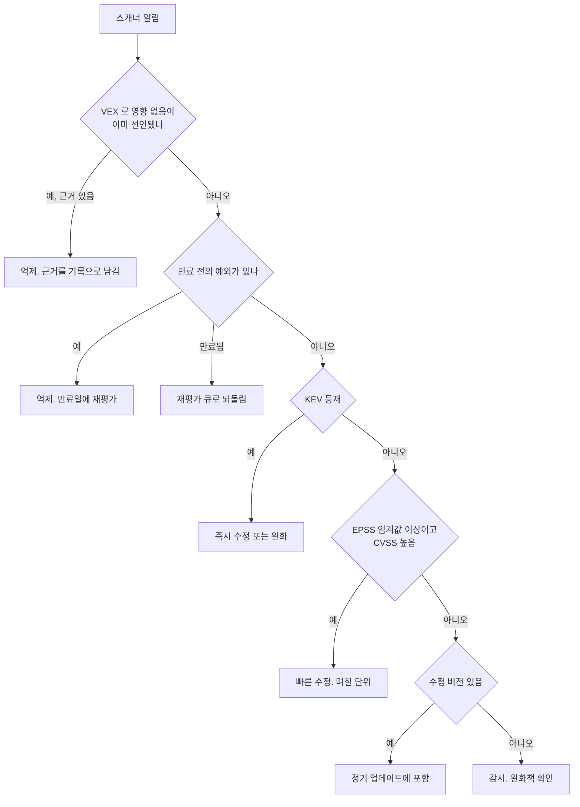

# 의존성 취약점 알림 선별과 VEX

의존성 스캐너를 CI에 처음 붙이면 첫 실행에서 수백 건이 나온다. 이 중 실제로 이번 주에 손대야 하는 것은 몇 건뿐이고, 나머지는 "라이브러리에는 결함이 있지만 우리 서비스는 그 코드를 쓰지 않는" 경우, 개발 전용 패키지, 아직 수정 버전이 없는 건이다. 알림을 전부 같은 무게로 대하면 두 가지 중 하나로 끝난다. 아무도 안 읽는 빨간 CI가 되거나, 임계값을 올려서 스캐너를 사실상 꺼 버리거나.

이 문서는 스캐너가 알려 주는 "취약한 버전이 들어 있다"는 사실을 "고쳐야 한다"는 결정으로 바꾸는 과정을 다룬다. 쓰는 도구는 점수(CVSS, EPSS), 악용 사실(KEV), 영향 없음 선언(VEX), 만료가 있는 예외 목록이다. SBOM을 만드는 방법과 스캐너 설치는 [공급망 보안](Supply_Chain_Security.md)에 있고, 엣지 장비 제로데이처럼 패치 기한을 시간 단위로 다루는 경우는 [엣지 장비 제로데이 대응](Edge_Device_Zero_Day_Response.md)이 맡는다. 여기서는 평소의 라이브러리 취약점 알림 운영만 본다. 파이프라인 전반의 SAST·SCA 배치는 [DevSecOps](Dev_Sec_Ops.md)를 본다.

## 점수가 답해 주지 않는 질문

알림 하나에는 보통 CVSS 숫자가 붙어 있다. 이 숫자가 무엇을 재는지 먼저 정리해 둬야 한다.

| 신호 | 무엇을 나타내나 | 무엇을 나타내지 않나 |
|---|---|---|
| CVSS base score | 취약점 자체의 성질. 공격 경로, 필요한 권한, 사용자 상호작용, 기밀·무결·가용성 영향 | 우리 환경에서 그 코드가 호출되는지, 인터넷에 노출됐는지 |
| EPSS | 앞으로 30일 안에 악용이 관측될 확률 추정치(0~1). FIRST가 공개하는 모델 | 우리 서비스에 영향이 있는지, 영향의 크기 |
| CISA KEV | 실제 악용이 확인된 취약점 목록(CISA 관리) | 목록에 없다는 것이 안전하다는 뜻은 아님. 등재까지 시차가 있다 |
| 수정 버전 존재 | 업그레이드로 해결 가능한지 | 업그레이드가 호환되는지 |

CVSS base는 취약점마다 하나로 고정된 값이다. 같은 CVE가 인터넷에 열린 API 서버에서도, 오프라인 배치 서버에서도 같은 9.8이다. 환경을 반영하는 값은 CVSS의 Environmental 지표인데, 스캐너가 이걸 채워 주지는 않는다. 그래서 환경 정보는 사람이 판단하고, 그 판단을 기록하는 형식이 아래에서 다룰 VEX다.

점수가 어떻게 나오는지 알아 두면 숫자를 덜 맹신하게 된다. CVSS 3.1 base score 공식을 그대로 옮긴 코드를 돌려서 몇 가지 벡터를 계산해 봤다.

```python
import math
W = {"AV": {"N": .85, "A": .62, "L": .55, "P": .2},
     "AC": {"L": .77, "H": .44},
     "UI": {"N": .85, "R": .62},
     "CIA": {"H": .56, "L": .22, "N": 0}}
PR = {"U": {"N": .85, "L": .62, "H": .27}, "C": {"N": .85, "L": .68, "H": .5}}

def roundup(x):                       # CVSS 3.1 부록 A 의 올림 규칙
    i = round(x * 100000)
    return i / 100000.0 if i % 10000 == 0 else (math.floor(i / 10000) + 1) / 10.0

def base(vector):
    m = dict(p.split(":") for p in vector.split("/")[1:])
    s = m["S"]
    iss = 1 - (1 - W["CIA"][m["C"]]) * (1 - W["CIA"][m["I"]]) * (1 - W["CIA"][m["A"]])
    imp = 6.42 * iss if s == "U" else 7.52 * (iss - .029) - 3.25 * (iss - .02) ** 15
    expl = 8.22 * W["AV"][m["AV"]] * W["AC"][m["AC"]] * PR[s][m["PR"]] * W["UI"][m["UI"]]
    if imp <= 0:
        return 0.0
    raw = imp + expl if s == "U" else 1.08 * (imp + expl)
    return roundup(min(raw, 10))
```

실행 결과는 다음과 같다. 9.8과 10.0, 7.8은 흔히 보이는 값과 일치하고, 6.1은 반사형 XSS에서 자주 보이는 벡터다.

| 벡터(축약) | 점수 | 읽는 법 |
|---|---|---|
| `AV:N/AC:L/PR:N/UI:N/S:U/C:H/I:H/A:H` | 9.8 | 인증 없이 네트워크로, 영향 전부 높음 |
| `AV:N/AC:L/PR:N/UI:N/S:C/C:H/I:H/A:H` | 10.0 | 위와 같되 Scope 가 바뀜(Log4Shell 의 벡터) |
| `AV:L/AC:L/PR:L/UI:N/S:U/C:H/I:H/A:H` | 7.8 | 로컬 계정이 있어야 함 |
| `AV:N/AC:L/PR:N/UI:R/S:C/C:L/I:L/A:N` | 6.1 | 사용자가 링크를 눌러야 함. 반사형 XSS 류 |
| `AV:N/AC:H/PR:N/UI:N/S:U/C:N/I:N/A:H` | 5.9 | 조건이 까다로운 서비스 거부 |

주목할 점은 `AV`(공격 경로)가 `N`(네트워크)이라서 9.8이 나왔다는 것이다. 서버가 그 라이브러리의 취약한 함수에 외부 입력을 넘기지 않는다면 `N`이라는 전제 자체가 우리 환경에서는 성립하지 않는다. 숫자는 라이브러리 입장의 최악을 가정한 값이다.

## 알림 하나를 처리하는 질문 순서

점수 하나로 줄을 세우는 대신 질문을 순서대로 던지면 대부분 앞쪽에서 결정이 난다.



VEX와 예외를 앞에 둔 이유가 있다. 이미 사람이 검토해서 "영향 없음"이라고 결론 낸 건이 매번 새 알림처럼 올라오면 검토가 헛수고가 된다. 반대로 KEV는 영향 없음 판정보다 뒤에 오는데, 영향 없음의 근거가 코드 수준에서 맞다면 KEV 등재 여부와 무관하게 이 서비스에는 해당되지 않기 때문이다. 다만 그 근거가 틀렸을 때 비용이 큰 건이므로, KEV 등재 건에 대해서는 억제를 한 번 더 사람이 확인하는 승인 규칙을 두는 것이 좋다.

## VEX로 "영향 없음"을 기록하기

VEX(Vulnerability Exploitability eXchange)는 "이 취약점이 이 제품에 실제로 영향을 주는가"를 기계가 읽을 수 있게 적은 문서다. SBOM이 "무엇이 들어 있나"를 적는다면 VEX는 "들어 있는 것 중 어느 취약점이 우리에게 문제인가"를 적는다. 스캐너가 SBOM으로 알림을 만들고, VEX로 그 알림을 걸러낸다.

대표 포맷은 OpenVEX와 CycloneDX VEX다. OpenVEX 문장의 최소 형태는 이렇다.

```json
{
  "@context": "https://openvex.dev/ns/v0.2.0",
  "@id": "https://example.com/vex/order-service/2026-09-05",
  "author": "security-team@example.com",
  "timestamp": "2026-09-05T09:00:00Z",
  "version": 1,
  "statements": [
    {
      "vulnerability": { "name": "CVE-2099-0002" },
      "products": [ { "@id": "pkg:npm/yaml-lite@1.0.9" } ],
      "status": "not_affected",
      "justification": "vulnerable_code_not_in_execute_path",
      "impact_statement": "yaml-lite 는 설정 파일 로더에서만 쓰이고 입력은 배포 시점에 고정된 파일뿐이다."
    }
  ]
}
```

`CVE-2099-0002`는 설명을 위해 만든 가짜 번호다. 상태값은 네 가지다.

| status | 의미 |
|---|---|
| `not_affected` | 영향 없음. 반드시 `justification`(또는 `impact_statement`)이 따라야 한다 |
| `affected` | 영향 있음. 조치 권고를 `action_statement`에 쓴다 |
| `fixed` | 이 제품 버전에서는 수정됨 |
| `under_investigation` | 조사 중 |

`not_affected`일 때 쓰는 근거 분류(`justification`)는 다섯 가지로 정해져 있다.

| justification | 쓰는 경우 |
|---|---|
| `component_not_present` | 해당 컴포넌트가 제품에 없다 (스캐너 오탐, 번들에서 제외됨) |
| `vulnerable_code_not_present` | 컴포넌트는 있지만 취약한 코드가 빠져 있다 (일부 모듈만 포함) |
| `vulnerable_code_not_in_execute_path` | 코드는 있지만 어떤 경로로도 실행되지 않는다 |
| `vulnerable_code_cannot_be_controlled_by_adversary` | 실행되지만 공격자가 입력을 조작할 수 없다 |
| `inline_mitigations_already_exist` | 제품 안에 이미 완화 장치가 있다 |

CycloneDX는 같은 정보를 BOM 안의 `vulnerabilities[].analysis`에 담는다. 이름이 달라서 변환할 때 헷갈린다.

| 의미 | OpenVEX | CycloneDX `analysis.state` / `justification` |
|---|---|---|
| 영향 없음 | `not_affected` | `not_affected` |
| 영향 있음 | `affected` | `exploitable` |
| 수정됨 | `fixed` | `resolved` |
| 조사 중 | `under_investigation` | `in_triage` |
| 스캐너 오탐(대략적 대응) | `component_not_present` | `false_positive` |
| 코드 경로 없음 | `vulnerable_code_not_in_execute_path` | `code_not_reachable` |
| 완화됨 | `inline_mitigations_already_exist` | `protected_by_mitigating_control` 등 |

도구 측면에서는 Trivy와 Grype가 VEX 문서를 입력으로 받아 해당 알림을 결과에서 빼는 옵션(`--vex`)을 제공한다. 지원하는 포맷과 옵션 이름은 버전마다 달라질 수 있어서 쓰는 버전의 `--help`로 확인한다. 이 서버에는 두 도구가 설치돼 있지 않아 직접 실행해 보지는 못했다.

### VEX 문장이 쓸모 있으려면

VEX는 쓰기 쉬워서 오히려 위험하다. "영향 없음" 한 줄이면 알림이 사라지기 때문에, 근거 없는 `not_affected`가 쌓이면 스캐너를 끄는 것과 같다. 그래서 문장에 요구하는 것을 정해 둔다.

- `justification`이 없는 `not_affected`는 거부한다. 아래 triage 스크립트도 그렇게 처리한다.
- `impact_statement`에 코드 경로 수준의 이유를 쓴다. "사용하지 않음"이 아니라 "설정 로더에서만 호출되고 입력은 빌드 시점 고정 파일"처럼 다른 사람이 검증할 수 있는 문장이다.
- 제품(`products`)은 `purl`에 버전까지 적는다. 버전 없이 패키지 이름만 적으면 업그레이드 뒤에도 영향 없음 선언이 따라붙어서, 새 버전에서 달라진 코드 경로를 못 본다.
- 의존성 버전이 바뀌면 그 문장은 무효로 취급한다. 문장의 `products` 버전과 SBOM의 버전이 정확히 같을 때만 억제한다.

## 만료가 있는 예외 목록

VEX가 "기술적으로 영향 없음"을 적는 자리라면 예외는 "영향은 있지만 지금 고치지 않기로 한 결정"을 적는 자리다. 둘을 섞으면 안 된다. 예외는 위험을 수용한 것이므로 이유와 만료일과 담당자가 있어야 한다.

스캐너마다 예외를 쓰는 방식이 다르고, 만료일을 지원하는 곳과 아닌 곳이 갈린다.

| 도구 | 예외 방법 | 만료일 |
|---|---|---|
| npm audit | 자체 예외 목록 기능이 없다(npm 10.8.2의 `npm audit --help` 옵션에 없음). `--audit-level`과 `--omit=dev`로 범위만 조정 | 없음 |
| pip-audit | `--ignore-vuln ID` | 없음 |
| Trivy | `.trivyignore` 파일에 ID를 한 줄씩 적음 | `exp:YYYY-MM-DD`를 줄 끝에 붙여 만료 지정 가능 |
| Grype | `.grype.yaml`의 `ignore` 목록 | 도구 자체는 만료 없음 |
| OSV-Scanner | `osv-scanner.toml`의 `[[IgnoredVulns]]` | `ignoreUntil` 필드 |

표의 도구별 설정은 각 프로젝트 문서를 근거로 적은 것이고 이 서버에서 실행해 확인하지는 못했다. npm audit만 설치돼 있어서 옵션 목록을 직접 확인했다. 만료 기능이 없는 도구를 쓴다면 만료 검사를 우리가 만들어야 한다. 예외를 `ignores.json` 같은 한 곳에 모으고, CI에서 만료일이 지난 항목이 있으면 실패시키는 식이다. 스캐너의 네이티브 ignore 파일을 직접 편집하게 두면 이유와 만료일이 사라지기 쉽다.

## 선별 스크립트로 묶어 보기

위 질문 순서를 코드로 옮긴 것이다. 입력은 스캐너 결과(정규화한 JSON), 정책 파일(KEV 목록, EPSS 임계값, 예외, VEX 문장)이고 출력은 알림별 결정이다. 실제로는 스캐너 출력 형식에 맞는 변환 한 단계가 앞에 붙는다.

```python
#!/usr/bin/env python3
import json, sys, datetime as dt

TODAY = dt.date.fromisoformat(sys.argv[3]) if len(sys.argv) > 3 else dt.date.today()
findings = json.load(open(sys.argv[1]))
policy = json.load(open(sys.argv[2]))
vex = {(s["vulnerability"]["name"], p["@id"]): s
       for s in policy["vex"]["statements"] for p in s["products"]}
ignores = {i["id"]: i for i in policy["ignores"]}
KEV = set(policy["kev"])

def decide(f):
    st = vex.get((f["id"], f["purl"]))              # purl 에 버전이 포함돼야 일치한다
    if st and st["status"] == "not_affected":
        if "justification" not in st:
            return "REJECT", "not_affected 인데 justification 이 없다"
        return "SUPPRESS", f"VEX not_affected ({st['justification']})"
    ig = ignores.get(f["id"])
    if ig:
        exp = dt.date.fromisoformat(ig["until"])
        if exp < TODAY:
            return "EXPIRED", f"예외가 {ig['until']} 에 만료됐다. 재평가 필요"
        return "SUPPRESS", f"예외 유효 {ig['until']}까지: {ig['reason']}"
    if f["id"] in KEV:
        return "FIX_NOW", "KEV 등재"
    if f["epss"] >= policy["epss_threshold"] and f["cvss"] >= 7.0:
        return "FIX_FAST", f"EPSS {f['epss']} >= {policy['epss_threshold']}"
    if f["fixed_in"]:
        return "SCHEDULE", f"수정 버전 {f['fixed_in']} 있음, 정기 업데이트에 포함"
    return "WATCH", "수정 버전 없음, 완화책 확인"

for f in findings:
    d, why = decide(f)
    print(f"{d:9} {f['id']:16} cvss={f['cvss']:<4} {f['purl']:34} {why}")
```

가짜 CVE 번호 여섯 건(KEV 등재 1건, 높은 점수지만 영향 없음으로 선언된 1건, 만료된 예외 1건, 유효한 예외 1건, EPSS가 높은 건 1건, 근거 없는 `not_affected` 1건)에 대해 기준일을 2026-10-05로 두고 돌린 출력이다.

```text
FIX_NOW   CVE-2099-0001    cvss=9.8  pkg:npm/web-util@2.3.1             KEV 등재
SUPPRESS  CVE-2099-0002    cvss=9.8  pkg:npm/yaml-lite@1.0.9            VEX not_affected (vulnerable_code_not_in_execute_path)
EXPIRED   CVE-2099-0003    cvss=7.5  pkg:maven/org.example/img-tool@4.2.0 예외가 2026-09-30 에 만료됐다. 재평가 필요
SUPPRESS  CVE-2099-0004    cvss=8.1  pkg:pypi/report-gen@0.8.2          예외 유효 2026-12-31까지: report-gen 은 배치 서버 전용, 외부 입력 없음
FIX_FAST  CVE-2099-0005    cvss=7.4  pkg:npm/web-util@2.3.1             EPSS 0.31 >= 0.1
REJECT    CVE-2099-0006    cvss=9.1  pkg:npm/dev-mock@3.0.0             not_affected 인데 justification 이 없다
```

CVSS 9.8짜리가 억제되고 7.4짜리가 "빠른 수정"으로 올라온 점을 보면 정렬 기준이 점수와 다르다는 게 드러난다. 실무에서는 `REJECT`와 `EXPIRED`를 CI 실패로, `FIX_NOW`와 `FIX_FAST`를 담당자 호출로, `SCHEDULE`을 티켓 자동 생성으로 연결한다. `SUPPRESS`는 로그에만 남긴다. 억제한 건수와 사유별 집계를 매 실행에 같이 출력해 두면 억제가 슬금슬금 늘어나는 것을 눈치챌 수 있다.

## 재평가가 필요한 시점

선별 결과는 한 번 내리고 끝이 아니다. 다음 사건이 생기면 이전 결정을 다시 연다.

| 사건 | 다시 볼 대상 |
|---|---|
| 예외 만료일 도래 | 해당 예외. 연장하려면 새 근거와 새 만료일 |
| 새로 KEV에 등재 | KEV 이전에 `SCHEDULE`·`WATCH`·`SUPPRESS`로 분류한 건 전부 |
| 의존성 버전 변경 | 그 버전을 가리키던 VEX 문장(버전이 달라지면 자동 무효) |
| 코드 변경으로 호출 경로가 생김 | `vulnerable_code_not_in_execute_path` 근거의 문장들 |
| 서비스 노출 범위 변경(내부용을 외부에 공개) | `AV`나 노출을 근거로 한 예외 전부 |
| 수정 버전 배포 | `WATCH` 로 두었던 건 |

표의 끝에서 두 번째 행이 놓치기 쉽다. "내부 전용이라 괜찮다"는 예외는 서비스를 외부에 열 때 무효가 되는데, 그때 예외 목록을 같이 열어 보는 절차가 없으면 아무도 기억하지 못한다. 예외 항목에 `assumption` 필드(예: `internal-only`)를 두고, 배포 설정이 바뀔 때 이 필드로 대상 예외를 조회하게 만들면 된다.

## 실무 주의점

- 개발 전용 의존성(`devDependencies`, 테스트 도구)은 운영 노출 경로가 아니다. npm이면 `npm audit --omit=dev`로 운영 의존성만 먼저 보고, 개발 의존성은 별도 잡에서 낮은 우선순위로 본다. 단, 빌드 서버에 시크릿이 있다면 빌드 도구의 취약점은 공급망 쪽 위험이라 같은 기준으로 보면 안 된다.
- 간접 의존성이 알림의 다수를 차지한다. 직접 의존하는 라이브러리 하나를 올리면 여러 알림이 한꺼번에 사라지는 경우가 많으므로, 알림 단위가 아니라 "어느 직접 의존성을 올릴지" 단위로 묶어서 본다.
- 수정 버전이 없는 건에 예외만 걸지 않는다. 예외 이유에 완화책(입력 검증, 해당 기능 비활성화, WAF 규칙)을 같이 적고, 대체 라이브러리 검토 일정을 만료일로 삼는다.
- 컨테이너 이미지의 OS 패키지 알림은 베이스 이미지에서 온 것이 많다. 앱 코드로는 고칠 수 없고 베이스 이미지 갱신 주기와 묶어서 처리한다. "수정 없음" 상태가 오래가면 더 작은 베이스 이미지로 바꾸는 것이 근본 처방이다.
- lockfile이 진실이다. `package.json`의 범위 표기(`^1.2.0`)로 스캔하면 실제 설치 버전과 다르다. `package-lock.json`, `poetry.lock`, `go.sum` 같은 고정된 파일이나 빌드 결과물의 SBOM을 입력으로 쓴다.
- EPSS 임계값은 출발값일 뿐이다. 알림이 너무 많이 올라와서 임계값을 높이면 그 아래 구간에서 놓치는 건이 생긴다. 이 점을 정책 문서에 적어 두고, 임계값 아래라도 KEV에 올라가면 위 규칙으로 되살아나게 한다.
- 스캐너의 데이터베이스는 서로 다르다. 같은 이미지를 두 도구로 돌리면 결과가 갈린다. 도구 하나를 정해서 기준으로 삼고 다른 도구는 교차 확인용으로만 쓴다. 결과를 합칠 때는 CVE와 GHSA, OSV 같은 식별자 별칭을 먼저 맞춰야 중복이 안 생긴다.
- 억제는 삭제가 아니다. VEX와 예외 파일을 저장소에 커밋하고 변경은 PR 리뷰를 거치게 한다. 보안팀 승인 없이 개발자가 스스로 `not_affected`를 쓸 수 있으면 노이즈 제거가 아니라 우회 수단이 된다. `CODEOWNERS`로 이 파일들의 승인자를 지정한다.

## 참고 자료

- FIRST, EPSS 개요와 데이터 다운로드: https://www.first.org/epss/
- CISA, Known Exploited Vulnerabilities Catalog: https://www.cisa.gov/known-exploited-vulnerabilities-catalog
- FIRST, CVSS v3.1 명세(공식 포함): https://www.first.org/cvss/v3.1/specification-document
- OpenVEX 명세: https://github.com/openvex/spec
- CycloneDX VEX 사용 안내: https://cyclonedx.org/capabilities/vex/
