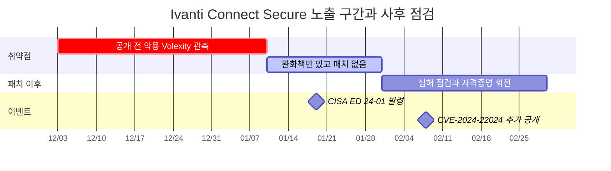
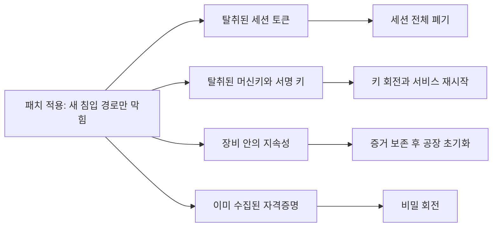
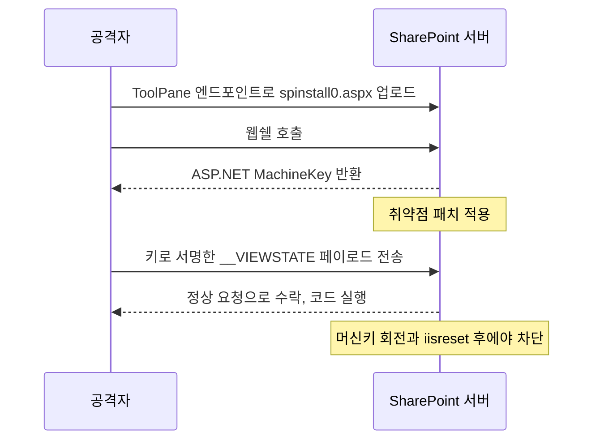
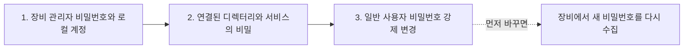
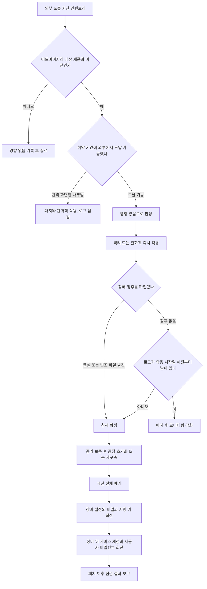
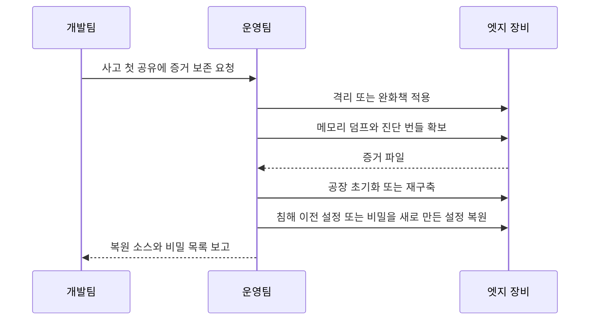
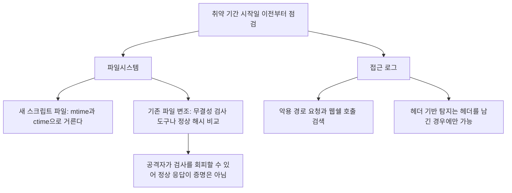
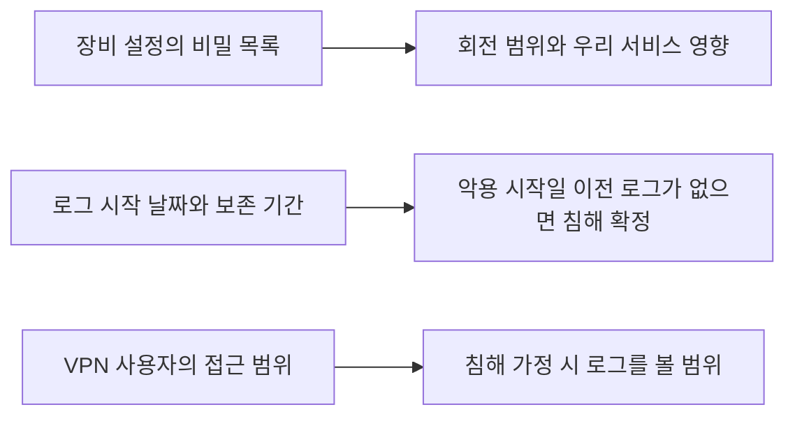

# 엣지 장비 제로데이 대응

VPN, 방화벽, 파일 전송 서버, 사내 SharePoint 같은 장비는 인터넷에 직접 열려 있고, EDR을 올릴 수 없거나 올려도 아무도 보지 않는다. 이런 장비의 제로데이 사고는 어드바이저리가 뜨는 순간 이미 시작된 지 몇 주가 지난 상태인 경우가 많다. 그래서 "패치 올렸습니다"라는 보고는 대응의 끝이 아니라 사후 점검의 시작이다.

이 문서는 Ivanti Connect Secure, Fortinet FortiOS, Citrix Bleed, MOVEit Transfer, SharePoint ToolShell 다섯 건을 놓고 패치 뒤에 남는 문제를 다룬다. 사고별 개요와 연도별 흐름은 [최근 보안사고 사례 2021~2025](Recent_Security_Incidents.md)에 있고, 일반적인 사고 대응 절차는 [보안 사고 대응 절차](Incident_Response.md)에 있다. 여기서는 패치 이후에 무엇을 지워야 하고 무엇을 새로 만들어야 하는지에 집중한다.

## 패치 날짜가 노출 구간의 끝이 아닌 이유

취약점 공개일을 기준으로 영향 기간을 잡으면 항상 짧게 잡힌다. 제로데이는 정의상 공개 전에 악용이 시작된 취약점이라, 노출 구간은 공개일보다 앞에서 열리고 패치일보다 뒤에서 닫힌다. 앞쪽은 아무도 모르던 시간이고, 뒤쪽은 패치로 입구는 막았지만 이미 들어온 것이 남아 있는 시간이다.

Ivanti가 가장 선명한 사례다. Volexity는 12월 초부터 악용 흔적을 봤고, Ivanti가 취약점과 완화책을 공개한 날은 2024년 1월 10일이다. 패치는 1월 31일에야 나왔다. 아래 간트 차트에서 빨간 막대가 공개 전 구간이고, 파란 막대가 패치 없이 완화책만 있던 구간이며, 마지막 막대가 패치 이후에 해야 하는 일이다. 패치가 나온 날 대응이 끝나지 않고 막대가 한 달 더 이어진다는 점을 보면 된다.



날짜 근거는 [Volexity 분석](https://www.volexity.com/blog/2024/01/10/active-exploitation-of-two-zero-day-vulnerabilities-in-ivanti-connect-secure-vpn/)과 [CISA ED 24-01](https://www.cisa.gov/news-events/directives/ed-24-01-mitigate-ivanti-connect-secure-and-ivanti-policy-secure-vulnerabilities)이다. 마지막 막대의 끝인 3월 1일은 CISA가 연방 기관에 자격증명 리셋 완료를 요구한 기한이다.

다섯 건을 같은 표로 놓으면 패턴이 반복된다.

| 사고 | 악용 시작 | 공개 또는 패치 | 패치 후에도 남는 것 |
|---|---|---|---|
| Fortinet SSL-VPN, CVE-2022-42475 | 공개 최소 2개월 전 | 2022년 12월 패치 | 펌웨어 업그레이드를 견디는 Coathanger 임플란트, 설정에 저장된 자격증명 |
| MOVEit Transfer, CVE-2023-34362 | 2023년 5월 27일 | 5월 31일 공개 | 웹쉘, 이미 반출된 파일 |
| Citrix Bleed, CVE-2023-4966 | 2023년 8월 하순 | 2023년 10월 10일 패치 | 이미 탈취된 세션 토큰 |
| Ivanti, CVE-2023-46805 · CVE-2024-21887 | 2023년 12월 초 | 2024년 1월 10일 공개, 1월 31일 패치 | 장비 내부 파일 변조, 수집된 자격증명, 초기화를 견디는 지속성 가능성 |
| SharePoint ToolShell, CVE-2025-53770 | 2025년 7월 7일 이전 시도 확인 | 2025년 7월 19일 안내와 패치 | 탈취된 ASP.NET 머신키, 웹쉘 |

Fortinet의 14,000대라는 숫자는 네덜란드 MIVD 보고에서 나온 것으로, 공개 전 제로데이 기간에만 그만큼 감염됐다는 내용이다. 출처는 [Security Affairs 정리](https://securityaffairs.com/158765/apt/china-linked-apt-dutch-mod.html)다. MOVEit 날짜는 [CISA AA23-158A](https://www.cisa.gov/news-events/cybersecurity-advisories/aa23-158a), Citrix 패치 날짜는 [Citrix 보안 공지](https://support.citrix.com/external/article/579459/netscaler-adc-and-netscaler-gateway-security-bulletin-for-cve20234966-and-cve20234967)다.

## 패치가 닫지 못하는 것 네 가지

표의 마지막 열을 묶으면 패치로 해결되지 않는 것은 네 가지로 정리된다. 탈취된 세션, 탈취된 서명 키나 머신키, 장비 안에 심어진 지속성, 이미 수집된 자격증명이다. 각각 대응이 다르다.

아래 도식은 패치 뒤에 남는 것 네 가지가 각각 어떤 조치로 이어지는지 보여준다. 패치 한 번이 네 갈래 어디에도 해당하지 않는다는 점을 보면 된다.



### 세션 토큰은 패치와 별개로 죽여야 한다

Citrix Bleed는 장비가 메모리 내용을 응답에 섞어 돌려주는 버그였고, 그 메모리에 로그인이 끝난 세션의 토큰이 있었다. 토큰으로 접속하면 비밀번호도 MFA도 다시 묻지 않는다. 패치는 새 토큰이 새는 것을 막을 뿐이고 이미 가져간 토큰은 서버 쪽 세션 테이블에서 유효한 상태로 남는다. Citrix는 패치 후에 활성 세션과 영속 세션을 모두 끊으라고 안내했다. [NetScaler 블로그](https://www.netscaler.com/blog/news/cve-2023-4966-critical-security-update-now-available-for-netscaler-adc-and-netscaler-gateway/)에 있는 명령은 다음과 같다.

```bash
# NetScaler CLI. 패치 적용 후 실행하고, 전체 사용자가 재로그인한다
kill aaa session -all
kill icaconnection -all
kill rdp connection -all
kill pcoipConnection -all
clear lb persistentSessions
```

운영팀이 이 명령을 업무 시간에 치기 꺼리는 경우가 많다. 전 직원이 한 번에 로그아웃되기 때문이다. 하지만 이 비용을 아끼면 패치한 장비로 공격자가 계속 들어온다. 서버 개발자가 할 일은 이 일정을 운영팀과 같이 잡는 것이다. 새벽에 끊는다면 야간 배치나 배포 파이프라인이 VPN 세션에 의존하는지 먼저 확인해야 한다. 파이프라인이 VPN 뒤의 사설 저장소를 읽는 구조라면 세션을 끊는 순간 그 작업이 실패한다.

장비 세션만 끊으면 반쪽이다. 장비를 통해 접속하며 SSO로 발급받은 애플리케이션 세션과 리프레시 토큰은 별개로 살아 있다. 사내 SSO를 쓰고 있다면 IdP에서 해당 기간에 VPN 경유로 로그인한 사용자의 세션을 같이 폐기해야 한다. 우리 서비스 쪽에서는 [세션 관리](Session_Management.md) 문서에 있는 방식으로 사용자별 세션 일괄 폐기가 되는지 평소에 확인해 두어야 한다. 세션 저장소에 사용자 ID로 키를 조회하는 인덱스가 없으면 사고 당일 전체 삭제밖에 선택지가 없다.

### 머신키와 서명 키는 설정 값이 아니라 침해 대상이다

SharePoint ToolShell이 이 부류다. 공격자는 ToolPane 엔드포인트로 들어와 `spinstall0.aspx`라는 웹쉘을 올렸고, 이 파일이 하는 일은 ASP.NET MachineKey를 읽어서 돌려주는 것이었다. [Microsoft 분석](https://www.microsoft.com/en-us/security/blog/2025/07/22/disrupting-active-exploitation-of-on-premises-sharepoint-vulnerabilities/)에 따르면 이 키가 있으면 공격자가 서명된 `__VIEWSTATE` 페이로드를 직접 만들어 서버가 정상 요청으로 받아들이게 할 수 있다. 취약점을 패치해도 키가 공격자 손에 있으면 같은 종류의 요청이 다시 통한다.

그래서 Microsoft가 패치와 함께 요구한 것은 머신키 회전과 IIS 재시작이었다. `Set-SPMachineKey` 또는 중앙 관리의 Machine Key Rotation Job을 실행하고, 모든 SharePoint 서버에서 `iisreset.exe`를 돌린다. 패치만 하고 웹쉘을 지운 뒤 끝낸 서버는 키가 유출된 채로 남는다.

아래 시퀀스는 키가 유출되는 순서와, 패치 뒤에도 키로 요청이 통하는 지점을 보여준다. 마지막 두 화살표가 패치 이후에도 성립한다는 점을 보면 된다.



이 교훈은 SharePoint 밖에도 해당한다. 서버가 요청이나 쿠키의 서명 키를 신뢰의 근거로 쓰는 구조라면(JWT 서명 키, 세션 쿠키 서명 키, ViewState 키, 웹훅 서명 시크릿) 그 서버에서 RCE가 났을 때 키를 새로 만드는 것까지 대응에 포함된다. 서명 키 회전을 한 번도 해 본 적이 없는 서비스는 사고 당일에야 회전이 되는지 안 되는지 알게 된다. [JWKS 엔드포인트](JWKS_Endpoint.md)처럼 키를 여러 개 동시에 유효하게 두는 구조가 있어야 회전 중 장애가 나지 않는다.

### 장비 안의 지속성은 초기화로도 안 지워질 수 있다

패치와 초기화는 다른 문제다. Fortinet이 2025년 4월 10일 공개한 [분석](https://www.fortinet.com/blog/psirt-blogs/analysis-of-threat-actor-activity)이 대표적이다. 공격자가 이미 알려진 SSL-VPN 취약점(CVE-2022-42475, CVE-2023-27997, CVE-2024-21762)으로 침투한 뒤 SSL-VPN 언어 파일 디렉터리에 사용자 파일시스템과 루트 파일시스템을 잇는 심볼릭 링크를 만들었다. 이 링크는 장비를 패치된 버전으로 올려도 남았고, 설정 파일을 읽는 통로가 됐다. Fortinet은 7.6.2, 7.4.7, 7.2.11, 7.0.17, 6.4.16에서 이 링크를 제거하도록 했고, 설정 전체를 침해된 것으로 간주하라고 안내했다.

더 심한 경우가 Coathanger다. 네덜란드 MIVD 보고에 따르면 이 임플란트는 재부팅 때마다 스스로를 다시 심고 펌웨어 업그레이드도 견뎠다. 펌웨어 업그레이드는 해결책이 아니었다는 뜻이다. Ivanti도 비슷하다. CISA는 ED 24-01 보충 지침에서 정교한 공격자가 공장 초기화를 견디는 루트킷 수준의 지속성을 심고 임의의 기간 동안 잠복할 수 있다고 가정하라고 했다. 같은 지침은 1월 31일, 2월 1일 패치 이전에 이미 공장 초기화를 마친 기관은 다시 초기화하지 않아도 된다는 예외를 뒀다. 순서도 중요하다는 얘기다. 초기화를 하고 나서 패치를 올려야 하고, 패치된 장비를 초기화한다고 이전 침투가 지워지는 것은 아니다.

현장에서 흔히 나오는 실수는 초기화한 뒤 백업 설정을 그대로 복원하는 것이다. 설정에는 관리자 계정, 사용자 계정, 사설 키, 인증서가 들어 있다. 설정 파일이 유출 경로였다면 복원하는 순간 같은 비밀이 다시 장비에 들어간다. 복원할 설정은 침해 이전 시점의 것이거나, 비밀 값을 전부 새로 만든 뒤에 옮긴 것이어야 한다.

### 이미 수집된 자격증명은 시간이 지나서 터진다

Ivanti 사건에서 Volexity는 공격자가 `lastauthserverused.js`를 변조해 로그인 자격증명을 수집했다고 밝혔다. 장비가 뚫리는 동안 VPN으로 로그인한 모든 사용자의 비밀번호가 수집 대상이었다. CISA가 요구한 것은 장비의 관리자 비밀번호, 저장된 API 키, 장비에 정의된 모든 로컬 계정(서비스 계정 포함)의 교체였고, 온프레미스 계정은 비밀번호를 두 번 초기화하고 Kerberos 티켓을 폐기하라고 했다. 하이브리드 구성이면 클라우드 계정의 토큰도 폐기 대상이다.

회전을 미루면 어떻게 되는지는 Fortinet이 보여준다. 2025년 1월 Belsen Group이 FortiGate 약 15,000대의 설정과 자격증명을 공개했는데, 데이터는 2022년 10월경 CVE-2022-40684 악용으로 수집된 것으로 분석됐다. [SecurityWeek 보도](https://www.securityweek.com/data-from-15000-fortinet-firewalls-leaked-by-hackers/)가 있다. 2022년에 가져간 값이 2025년에 공개된 것이다. 그 사이 회전하지 않은 사이트 간 IPsec 터널 설정과 VPN 계정은 그대로 유효했다. 패치만 한 조직은 이 3년 동안 조용히 노출돼 있었던 셈이다.

장비 설정에 들어가는 비밀은 사람이 기억하는 목록보다 길다. LDAP 바인드 계정, RADIUS 공유 비밀, IPsec 사전 공유 키, SAML 서명 인증서와 개인 키, SNMP 커뮤니티 문자열, 백업 서버 접속 정보, 장비가 외부 서비스를 부를 때 쓰는 API 키가 있다. 이 중 하나라도 회전 대상에서 빠지면 그 비밀이 다음 침입 경로가 된다. 회전 순서도 있다. 장비 자체의 관리자 비밀번호와 로컬 계정을 먼저 바꾸고, 장비가 연결된 디렉터리와 서비스의 비밀을 바꾼 뒤, 마지막으로 일반 사용자 비밀번호를 강제 변경한다. 사용자 비밀번호를 먼저 바꾸면 공격자가 장비에서 새 비밀번호를 다시 수집할 수 있다.

회전 순서를 도식으로 놓으면 다음과 같다. 점선은 순서를 뒤집었을 때 생기는 문제다.



## 의사결정 흐름

이 네 가지를 의사결정으로 묶으면 흐름은 대체로 정해져 있다. 질문은 "이 장비가 취약했던 기간에 외부에서 도달 가능했는가"와 "그 기간에 침해 징후가 있었는가"다. 두 번째 질문의 답이 "확인할 수 없다"일 때가 가장 많고, 그 경우 침해된 것으로 가정하고 아래 오른쪽 분기로 간다.



판정 분기에서 "로그가 악용 시작일 이전부터 남아 있나"가 핵심이다. 로그 보존 기간이 30일인 장비는 Ivanti 사건에서 12월 초 로그를 이미 잃은 상태다. 로그가 없으면 침해가 없었다는 증명도 못 하므로 침해로 간주한다. 이 판단을 사고 당일 회의에서 처음 내리면 논쟁만 길어진다. 평소에 "로그로 증명할 수 없으면 침해로 간주한다"는 원칙을 정해 두어야 한다.

격리 단계에서 증거 보존이 중요하다. Volexity는 무결성 검사 도구를 돌리고 재부팅 전에 메모리 증거를 보존하라고 했다. 장비를 먼저 재부팅하거나 초기화하면 분석할 수 있는 것이 사라진다. 운영팀은 빨리 정상화하려는 마음에 곧바로 초기화하는 경우가 많아서, 개발팀이 "스냅샷이나 메모리 덤프를 먼저 뜬 뒤에 초기화"를 요청해야 한다.

개발팀과 운영팀 사이의 순서는 아래와 같다. 증거 확보 요청이 초기화보다 앞에 오고, 복원 소스를 마지막에 확인한다는 점을 보면 된다.



## 패치 기한을 정하는 기준

모든 취약점을 같은 속도로 패치할 수 없으니 기한을 나눠야 한다. 기준을 CVSS 하나로 잡으면 이 문서의 사고 대부분에서 순서가 틀어진다. CVSS는 공격이 쉽고 영향이 큰지를 보지만 실제로 악용되고 있는지는 보지 않는다. EPSS는 앞으로 30일 안에 악용될 확률을 0과 1 사이 값으로 추정하고, CISA KEV는 이미 악용이 확인된 취약점 목록이다. 세 값은 서로 다른 질문에 답한다.

아래 표는 우리 팀에서 쓸 수 있는 기준 예시다. 숫자는 자산 분포에 맞춰 조정한다. EPSS 0.1은 출발값이다.

| 조건 | 대상 | 기한 | 패치와 함께 하는 일 |
|---|---|---|---|
| KEV 등재 또는 벤더가 악용 확인을 명시 | 인터넷에 노출된 엣지 장비 | 24시간 안에 격리나 완화, 패치는 벤더 제공 즉시 | 사후 점검을 패치와 동시에 시작 |
| KEV 등재 | 내부 전용 시스템 | 7일 | 접근 경로가 내부망뿐인지 재확인 |
| KEV 미등재, EPSS 0.1 이상, CVSS 9.0 이상 | 인터넷 노출 | 72시간 | 노출 면 축소, 로그 보존 연장 |
| KEV 미등재, EPSS 0.1 미만, CVSS 9.0 이상 | 인터넷 노출 | 14일 | 다음 정기 점검 때 재평가 |
| CVSS 7.0 이상 9.0 미만 | 인터넷 노출 | 30일 | 정기 패치 주기에 편입 |
| 그 외 | 내부 | 정기 패치 | 없음 |

KEV 등재를 기다리면 늦는다는 점이 이 표의 첫 행이다. KEV는 악용이 확인된 뒤에 올라가므로 제로데이는 공개 순간에 이미 해당한다. MOVEit은 CISA가 공개 이틀 뒤인 6월 2일 KEV에 올렸는데, 벤더 어드바이저리에 "악용 확인" 문구가 나온 시점에 이미 첫 행으로 취급했어야 한다. KEV의 기한은 CISA가 연방 기관에 붙이는 값이라 [BOD 22-01](https://www.cisa.gov/news-events/directives/bod-22-01-reducing-significant-risk-known-exploited-vulnerabilities)을 참고하되, 우리 기한은 위처럼 따로 정한다.

기한을 지켰는지만으로는 부족하다. 패치 기한 안에 패치를 적용했어도 그 이전 기간의 침해는 별개 문제이므로, 표의 마지막 열에 있는 일이 같이 돌아가야 한다. 기한 달성률 숫자만 보고하면 "패치 완료"가 "문제 없음"으로 읽힌다.

## 노출 자산부터 찾는다

영향 여부를 한 시간 안에 답하려면 외부에서 보이는 자산 목록이 먼저 있어야 한다. 장비 목록은 대개 구매 시점의 문서에만 있고 실제로 열려 있는 포트와 다르다. 외부에서 직접 스캔해 보는 것이 가장 정확하다. 아래 명령은 반드시 우리가 소유한 대역에만 쓴다. 문서 예시의 `203.0.113.0/28`은 예약된 문서용 주소이므로 실제 대역으로 바꾼다.

```bash
# 외부 네트워크에서 우리 공인 대역의 관리 포트와 VPN 포트를 확인한다
nmap -Pn -sT -p 21,22,443,990,4443,8080,8443,10443 --open \
  -sV --version-light -oG - 203.0.113.0/28

# 열린 443에서 제품을 식별하는 알려진 경로. 응답 코드와 크기만 본다
for ip in 203.0.113.5 203.0.113.6; do
  for p in /remote/login /dana-na/auth/url_default/welcome.cgi \
           /vpn/index.html /_layouts/15/start.aspx /human.aspx; do
    printf '%s %s ' "$ip" "$p"
    curl -sk -o /dev/null -m 5 -w '%{http_code} %{size_download}\n' "https://$ip$p"
  done
done
```

경로는 순서대로 FortiGate SSL-VPN 로그인, Ivanti Connect Secure 웰컴 페이지, NetScaler Gateway, SharePoint, MOVEit Transfer의 웹 인터페이스다. 200이나 302가 돌아오는 조합이 있으면 그 장비는 외부에서 제품이 식별된다는 뜻이다. 배너가 안 보여도 기본 경로가 열려 있으면 공격자도 같은 방식으로 찾는다.

서버 안쪽에서는 모든 인터페이스에 바인딩한 리스닝 포트를 본다.

```bash
# 0.0.0.0 또는 [::]에 바인딩된 리스너와 프로세스
ss -Htlnp | awk '$4 ~ /^(0\.0\.0\.0|\*|\[::\]):/ {print $4, $6}' | sort -u
```

AWS 계정에서는 공인 IP가 붙은 인스턴스와 전체 개방 보안그룹을 뽑는다. 마켓플레이스에서 가져온 VPN이나 방화벽 어플라이언스가 EC2 위에서 돌고 있다면 이 목록에서 잡힌다. 이미지 ID를 보면 어떤 제품인지 추적할 수 있다.

```bash
aws ec2 describe-instances \
  --query 'Reservations[].Instances[?PublicIpAddress!=`null`].[InstanceId,PublicIpAddress,ImageId,Tags[?Key==`Name`]|[0].Value]' \
  --output text

aws ec2 describe-security-groups \
  --filters Name=ip-permission.cidr,Values='0.0.0.0/0' \
  --query 'SecurityGroups[].{id:GroupId,name:GroupName}' --output table

aws ec2 describe-addresses \
  --query 'Addresses[].[PublicIp,InstanceId,NetworkInterfaceId]' --output text
```

계정이 여러 개라면 리전과 계정마다 반복해야 한다. 이 목록이 한 번도 만들어진 적이 없는 조직에서는 첫 결과를 보고 소유자를 모르는 항목이 나오는 경우가 많다. 그 항목이 가장 먼저 침해되는 후보다.

## 패치 이전 침투 흔적 찾기

패치 후 점검에서는 두 가지를 찾는다. 파일시스템의 웹쉘과 접근 로그의 악용 요청이다. 둘 다 취약 기간의 시작일 이전부터 살펴야 한다.

두 갈래가 각각 무엇을 보고 어디서 한계가 생기는지 도식으로 놓는다.



### 웹쉘

웹쉘은 보통 웹 루트나 임시 디렉터리 아래 새 스크립트 파일로 나타난다. MOVEit의 `human2.aspx`와 SharePoint의 `spinstall0.aspx`처럼 정상 파일 이름과 비슷한 경우가 많아서 이름만 보지 말고 시간으로 거른다. 수정 시간은 공격자가 되돌릴 수 있으므로 상태 변경 시간(ctime)도 같이 본다.

```bash
# 기준일 이후 변경되거나 inode가 바뀐 스크립트 파일
find /var/www /opt/app -type f \
  \( -name '*.jsp' -o -name '*.jspx' -o -name '*.php' -o -name '*.aspx' \) \
  \( -newermt '2025-07-01' -o -newerct '2025-07-01' \) \
  -printf '%TY-%Tm-%Td %TH:%TM %u %p\n' | sort

# 명령 실행과 인코딩 우회에 자주 쓰이는 문자열
grep -rIlE 'Runtime\.getRuntime\(\)\.exec|ProcessBuilder|eval\(base64_decode|FromBase64String|Request\.Form\[' \
  --include='*.jsp' --include='*.php' --include='*.aspx' /var/www /opt/app
```

Windows 서버에서는 이름과 경로가 알려진 파일을 직접 찾는다.

```powershell
# SharePoint ToolShell 웹쉘. 변형 이름까지 본다
Get-ChildItem "C:\Program Files\Common Files\Microsoft Shared\Web Server Extensions" `
  -Recurse -Include spinstall*.aspx -ErrorAction SilentlyContinue |
  Select-Object FullName, CreationTime, LastWriteTime

# MOVEit 웹쉘
Get-ChildItem -Path C:\ -Recurse -Filter human2.aspx -ErrorAction SilentlyContinue
```

grep으로 잡히지 않는 웹쉘이 있다. 난독화했거나 기존 정상 파일에 몇 줄만 끼워 넣은 경우다. Ivanti 사건에서는 새 파일이 아니라 `compcheckresult.cgi`와 `visits.py` 같은 기존 파일이 변조됐다. 이런 변조는 파일 목록으로는 안 보이고 벤더가 제공하는 무결성 검사 도구나 알려진 정상 해시와의 비교로만 잡힌다. 장비 파일시스템에 우리가 접근할 수 없으면 grep이 불가능하다는 점이 어플라이언스 사고의 본질이다. 다만 Volexity가 지적했듯 공격자가 무결성 검사를 회피하도록 파일을 건드릴 수 있어서, 도구가 정상이라고 답했다는 사실이 침해가 없다는 증명은 아니다.

### 접근 로그

앞단 로드밸런서나 리버스 프록시 로그가 있으면 악용 요청을 취약 기간 전체에 걸쳐 거슬러 찾는다. SharePoint는 ToolPane 엔드포인트로 가는 POST와 웹쉘 파일로 가는 GET이 신호다.

```bash
# nginx 또는 Apache 접근 로그. 압축된 회전 로그까지 본다
zcat -f /var/log/nginx/access.log* \
  | grep -E 'POST /_layouts/15/ToolPane\.aspx|GET /_layouts/15/spinstall[0-9]*\.aspx'

# 요청 횟수가 매우 적은 스크립트 경로 상위. 웹쉘은 호출 횟수가 적다
zcat -f /var/log/nginx/access.log* \
  | awk '{print $7}' | grep -E '\.(aspx|jsp|jspx|php)(\?|$)' \
  | sort | uniq -c | sort -n | head -30
```

두 번째 명령은 정상 경로를 외우지 않아도 되는 대신 오탐이 많다. 적게 호출되는 정상 경로가 섞여 나온다. 결과를 웹 루트의 실제 파일 목록과 대조하면 로그에는 있는데 배포 이력에는 없는 경로가 남는다.

ALB 액세스 로그를 Athena로 보는 경우에는 날짜 파티션을 먼저 걸고 같은 패턴을 찾는다. 테이블 이름과 파티션 컬럼은 계정마다 다르니 `SHOW CREATE TABLE`로 확인한 뒤 쓴다.

```sql
SELECT time, client_ip, request_verb, request_url, elb_status_code
FROM alb_logs
WHERE day >= '2025/07/01'
  AND regexp_like(request_url, '(?i)/_layouts/15/(ToolPane|spinstall)')
ORDER BY time;
```

HTTP 헤더를 기록하지 않는 로그로는 헤더 기반 탐지가 안 된다. MOVEit 웹쉘이 쓴 `X-siLock-Comment` 헤더가 대표적이고, IIS는 요청 헤더를 기본으로 남기지 않는다. 사고가 나고 나서야 프록시에 헤더 로깅을 켜면 이전 요청은 영영 볼 수 없다. 이 이유로 평소 보존하는 로그 필드가 사고 당일 판단의 한계를 정한다.

## 운영팀에 요청해야 할 것들

서버 개발자는 장비를 직접 만지지 않는다. 그래서 요청을 구체적으로 해야 하고, 요청이 모호하면 "패치했습니다"라는 답이 돌아온다. 경험상 이런 질문에서 답이 빈다.

아래 도식은 요청 중 답이 곧 다음 판단을 정하는 세 가지를 묶은 것이다.



첫째로 장비가 어떤 비밀을 들고 있는지 묻는다. "VPN 장비 계정 바꿨나요"라고 물으면 관리자 비밀번호 하나를 바꿨다는 답이 오지만, "이 장비 설정 파일에 들어 있는 모든 비밀 목록을 주세요"라고 하면 LDAP 바인드 계정, 사전 공유 키, 인증서 개인 키가 목록에 올라온다. 그 목록 중 우리 서비스와 연결된 것(내부 API 키, 서비스 계정)은 개발팀이 회전을 맡는다. 회전 때 우리 서비스가 끊기는지는 개발팀만 안다.

둘째로 로그 보존 기간과 로그의 시작 날짜를 묻는다. 어드바이저리에 악용 시작일이 적혀 있으니 그 날짜 이전 로그가 남아 있는지가 핵심이다. 남아 있지 않으면 위 흐름도의 "침해 확정" 쪽으로 간다는 점을 미리 합의해 둔다. 답이 "30일치"라면 장비 로그를 외부 저장소로 보내는 작업을 이번 사고의 후속 과제로 요청한다.

셋째로 초기화 전에 증거를 떴는지 묻는다. 운영팀은 장비를 빨리 복구하려고 곧바로 초기화하는 경우가 있다. 메모리 덤프나 벤더 진단 번들을 확보하기 전에는 초기화하지 말아 달라고 사고 시작 시점에 요청해야 한다. 이 요청은 초기화 직전이 아니라 사고 첫 공유 메시지에 넣어야 효과가 있다.

넷째로 초기화 후 설정을 어디서 복원했는지 묻는다. 침해된 장비의 설정 백업을 그대로 올렸다면 비밀과 함께 변조된 설정까지 복원된 것이다. 복원 소스가 침해 이전의 것인지, 비밀을 새로 만든 설정인지 확인해야 한다.

다섯째로 장비 뒤의 접근 범위를 묻는다. 장비가 뚫리면 공격자는 그 장비가 닿는 모든 곳에 사용자와 같은 권한으로 접근할 수 있다. VPN 사용자가 어느 서브넷과 어느 서비스에 접근할 수 있었는지 목록을 받아 두면, 침해 가정 시 로그를 봐야 할 범위가 정해진다. 이 목록이 "전체 사내망"이면 문제의 크기가 그만큼 큰 것이고, 사고 후 접근 제어 분할이 과제가 된다. 장기적으로는 [제로 트러스트](Zero_Trust_Architecture.md)처럼 장비 하나가 뚫려도 서비스 단위 인증이 남아 있는 구조로 가야 한다.

여섯째로 취약 제품을 쓰는 다른 사이트나 협력사 연결 장비가 있는지 묻는다. 본사 장비만 패치하고 지사의 같은 제품 또는 협력사에 내어 준 VPN 계정 장비를 놓치는 경우가 있다. 사이트 간 IPsec 터널은 Belsen 유출에서 보듯 설정이 노출되면 상대편 사이트도 위험해진다.

## 자주 빠지는 지점

패치 완료를 영향 종료로 보고하는 것이 가장 흔하다. 보고 양식에 "패치 완료 일시" 칸만 있고 "취약 기간 로그 점검 결과" 칸이 없으면 점검이 이루어지지 않는다. 점검 결과가 "이상 없음"이어도 어떤 로그를 어느 기간에 어떤 쿼리로 봤는지를 같이 남겨야 나중에 다시 확인할 수 있다.

두 번째는 후속 취약점이다. Ivanti는 1월 10일 공개 이후 2월 8일에 CVE-2024-22024가 추가로 나왔고, MOVEit도 첫 취약점 이후 같은 제품에서 SQL 인젝션이 연달아 공개됐다. 한 제품에서 제로데이가 나오면 연구자와 공격자가 그 제품의 같은 영역을 집중해서 판다. 첫 패치를 올린 날 이후 몇 주는 어드바이저리를 계속 확인하고, 그 장비의 외부 노출 자체를 줄이는 쪽(관리 화면 내부망 한정, VPN 장비 앞단에 접근 제어)이 장기적으로 낫다.

세 번째는 의존 서비스 확인 없이 세션을 끊는 것이다. 위에서 말한 대로 파이프라인과 배치가 VPN 세션을 쓰는 경우가 있다. 반대로 세션을 끊지 않으면 위험이 남는다. 이 둘 사이는 사고 전에 어떤 자동화가 VPN에 의존하는지 목록으로 만들어 두면 당일 판단이 쉬워진다.

네 번째는 기한 표를 사고가 난 뒤에 만드는 것이다. 위의 표는 평소에 팀이 합의해 두어야 쓸모가 있다. 사고 당일에 24시간이냐 72시간이냐를 논의하면 그 시간이 이미 노출 구간에 들어간다.
