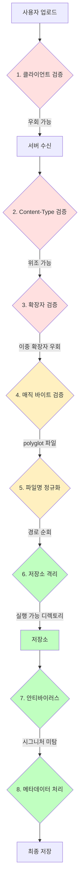
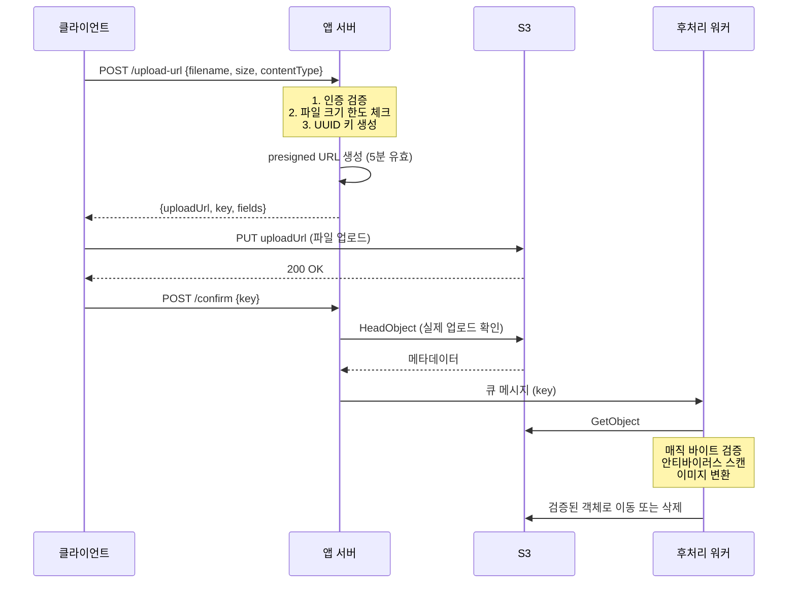

# 파일 업로드 보안

## 왜 파일 업로드가 위험한가

파일 업로드는 사용자가 서버에 임의의 바이트를 쓰는 행위다. 텍스트 입력은 SQL Injection이나 XSS만 신경 쓰면 되지만, 파일은 실행 가능한 코드, 악성 매크로, 압축 폭탄, 위장된 스크립트 같은 게 통째로 서버에 들어온다. 한 번 잘못 받아두면 그 파일이 어딘가에 저장되고, 누군가 그 URL을 통해 실행하거나 다운로드한다.

내가 본 사고 케이스 중 가장 흔한 패턴은 이렇다. 프로필 이미지 업로드 기능을 만들면서 클라이언트 측 검증만 한 다음, 서버는 그냥 받아서 `/var/www/uploads/`에 저장하고 그 경로를 그대로 노출한다. 공격자가 `shell.php` 파일을 올리면 끝이다. PHP가 해석하는 디렉토리에 PHP 파일이 떨어진 순간 RCE다.

파일 업로드 취약점은 단일 항목이 아니라 여러 검증이 결합되어야 막을 수 있는 영역이다. MIME 타입 하나만 본다거나, 확장자만 본다거나 하면 우회 방법이 너무 많다.

---

## 파일 업로드 공격 표면



빨간 단계는 단독으로 신뢰하면 안 된다. 노란 단계는 보조 수단이고, 초록 단계가 핵심 방어선이다. 어느 한 단계만 뚫리면 끝나는 게 아니라, 여러 단계를 동시에 뚫어야 하도록 설계해야 한다.

---

## Content-Type 검증의 한계

가장 먼저 떠올리는 검증이 HTTP 요청의 `Content-Type` 헤더 확인이다. 이건 클라이언트가 보내는 값이라 100% 위조 가능하다.

```javascript
// 잘못된 검증 — Content-Type만 확인
app.post('/upload', upload.single('file'), (req, res) => {
  if (req.file.mimetype !== 'image/png') {
    return res.status(400).send('PNG만 가능합니다');
  }
  // 이 시점에 mimetype은 클라이언트가 보낸 값을 그대로 받은 것
  fs.writeFileSync(`/uploads/${req.file.originalname}`, req.file.buffer);
});
```

curl로 임의의 파일에 `Content-Type: image/png`를 붙이면 그냥 통과한다.

```bash
curl -X POST https://example.com/upload \
  -F "file=@shell.php;type=image/png"
```

`Content-Type`은 첫 번째 필터로만 사용하고, 실제 검증은 파일 내용 자체로 해야 한다.

---

## 매직 바이트 검증

모든 파일 포맷은 시작 부분에 고유한 바이트 시퀀스를 가진다. 이걸 매직 넘버 또는 시그니처라고 한다.

| 포맷 | 매직 바이트 (hex) |
|------|-------------------|
| PNG | `89 50 4E 47 0D 0A 1A 0A` |
| JPEG | `FF D8 FF` |
| GIF | `47 49 46 38` |
| PDF | `25 50 44 46` |
| ZIP | `50 4B 03 04` |
| MP4 | `00 00 00 ?? 66 74 79 70` |

Node.js에서 `file-type` 라이브러리를 쓰면 직접 비교할 필요 없다.

```javascript
import { fileTypeFromBuffer } from 'file-type';

async function validateImage(buffer, allowedTypes) {
  const detected = await fileTypeFromBuffer(buffer);

  if (!detected) {
    throw new Error('파일 타입을 식별할 수 없습니다');
  }

  if (!allowedTypes.includes(detected.mime)) {
    throw new Error(`허용되지 않은 파일 타입: ${detected.mime}`);
  }

  return detected;
}

app.post('/upload', upload.single('file'), async (req, res) => {
  try {
    const detected = await validateImage(
      req.file.buffer,
      ['image/png', 'image/jpeg', 'image/webp']
    );
    // 여기서 detected.ext가 실제 확장자
  } catch (err) {
    return res.status(400).json({ error: err.message });
  }
});
```

매직 바이트 검증을 하더라도 polyglot 파일을 조심해야 한다. 파일 앞부분은 PNG 시그니처를 가지면서 뒤에 PHP 코드가 붙어있는 형태로, 매직 바이트 검사는 통과하지만 PHP 인터프리터에 들어가면 실행되는 케이스다.

```bash
# polyglot 파일 만들기 — PNG로 보이지만 PHP도 실행됨
cat valid.png > polyglot.png
echo '<?php system($_GET["cmd"]); ?>' >> polyglot.png
```

그래서 매직 바이트 검증만으로는 부족하다. 저장 시 확장자를 강제로 변경하고, 업로드 디렉토리에서 스크립트 실행을 차단해야 한다.

---

## 확장자 화이트리스트

블랙리스트는 절대 안 된다. `.php`만 막으면 `.phtml`, `.php5`, `.php7`, `.phar`로 우회된다. ASP는 `.asp`, `.aspx`, `.cer`, `.cdx` 같은 변종이 있다.

화이트리스트로 작성한다.

```javascript
const ALLOWED_EXTENSIONS = {
  image: ['.jpg', '.jpeg', '.png', '.webp', '.gif'],
  document: ['.pdf', '.docx', '.xlsx'],
  archive: ['.zip']
};

function validateExtension(filename, category) {
  const ext = path.extname(filename).toLowerCase();
  const allowed = ALLOWED_EXTENSIONS[category] || [];

  if (!allowed.includes(ext)) {
    throw new Error(`허용되지 않은 확장자: ${ext}`);
  }
  return ext;
}
```

이중 확장자 공격도 있다. `image.php.jpg` 같은 파일이 들어오면 일부 웹서버 설정에서 PHP로 해석된다. Apache의 `AddHandler`나 `mod_mime` 설정 미스가 대표적이다.

```javascript
// 이중 확장자 차단
function hasMultipleExtensions(filename) {
  const parts = filename.split('.');
  // image.php.jpg → ['image', 'php', 'jpg']
  return parts.length > 2;
}
```

가장 안전한 방법은 클라이언트가 보낸 파일명을 신뢰하지 않는 것이다. 서버에서 UUID를 생성해서 새로운 파일명을 부여한다.

```javascript
import { randomUUID } from 'crypto';

async function saveUploadedFile(buffer, originalName) {
  const detected = await fileTypeFromBuffer(buffer);
  const newFilename = `${randomUUID()}.${detected.ext}`;
  // originalName은 메타데이터로만 보관, 파일 시스템에는 사용하지 않음
  await fs.writeFile(`/uploads/${newFilename}`, buffer);
  return { filename: newFilename, originalName };
}
```

---

## 파일명 정규화와 경로 순회

사용자가 보낸 파일명을 그대로 경로에 붙이면 디렉토리 이탈이 발생한다.

```javascript
// 위험한 코드
const filename = req.file.originalname;
fs.writeFileSync(`/uploads/${filename}`, req.file.buffer);

// 공격: filename = "../../../etc/cron.d/backdoor"
// 결과: /etc/cron.d/backdoor 에 파일 생성
```

`path.basename()`으로 경로 부분을 제거하는 게 1차 방어다.

```javascript
import path from 'path';

const safeName = path.basename(req.file.originalname);
// "../../../etc/passwd" → "passwd"
// 하지만 여전히 "passwd"라는 파일명은 살아있음
```

윈도우 환경이면 더 까다롭다. `..\..\windows\system32` 같은 백슬래시 경로, NTFS 대체 데이터 스트림(`file.txt:hidden.exe`), 예약어(`CON`, `PRN`, `NUL`, `AUX`, `COM1~9`, `LPT1~9`)가 모두 문제가 된다.

유니코드 정규화도 빼먹으면 안 된다. NFD/NFC 차이로 같은 문자가 다른 바이트로 표현되거나, 0폭 문자를 끼워넣어 검증을 우회하는 케이스가 있다.

```javascript
function normalizeFilename(name) {
  // 1. 유니코드 정규화
  let normalized = name.normalize('NFC');

  // 2. 제어 문자, 0폭 문자 제거
  normalized = normalized.replace(/[-​-‏]/g, '');

  // 3. 경로 구분자 제거
  normalized = normalized.replace(/[\/\\]/g, '');

  // 4. 앞뒤 공백, 점 제거 (윈도우는 트레일링 점/공백 무시)
  normalized = normalized.trim().replace(/^\.+|\.+$/g, '');

  // 5. 윈도우 예약어 차단
  const reserved = /^(CON|PRN|AUX|NUL|COM[1-9]|LPT[1-9])(\..*)?$/i;
  if (reserved.test(normalized)) {
    throw new Error('예약된 파일명입니다');
  }

  // 6. 길이 제한
  if (normalized.length > 255 || normalized.length === 0) {
    throw new Error('파일명 길이가 유효하지 않습니다');
  }

  return normalized;
}
```

저장 후에는 실제 경로가 의도한 디렉토리 안에 있는지 한 번 더 검증한다.

```javascript
function safeJoin(baseDir, userPath) {
  const resolved = path.resolve(baseDir, userPath);
  const baseResolved = path.resolve(baseDir);

  if (!resolved.startsWith(baseResolved + path.sep)) {
    throw new Error('경로 순회가 감지되었습니다');
  }
  return resolved;
}
```

가장 깔끔한 방법은 앞서 언급한 대로 UUID 기반 파일명을 쓰고 원본 파일명은 DB 컬럼에만 저장하는 것이다. 파일 시스템에는 사용자 입력을 1바이트도 노출하지 않는다.

---

## S3 Presigned URL 패턴

업로드 트래픽이 애플리케이션 서버를 통과하면 메모리, 대역폭, 디스크 I/O를 모두 잡아먹는다. 1GB짜리 파일 100명이 동시에 올리면 서버가 죽는다. S3나 GCS 같은 객체 스토리지에 직접 업로드하게 하고, 서버는 업로드 권한만 발급한다.



핵심은 presigned URL을 발급할 때부터 제약을 박아넣는 것이다.

```javascript
import { S3Client, PutObjectCommand } from '@aws-sdk/client-s3';
import { getSignedUrl } from '@aws-sdk/s3-request-presigner';
import { randomUUID } from 'crypto';

const s3 = new S3Client({ region: 'ap-northeast-2' });

async function generateUploadUrl(userId, contentType, fileSize) {
  // 콘텐츠 타입 화이트리스트
  const allowed = ['image/png', 'image/jpeg', 'application/pdf'];
  if (!allowed.includes(contentType)) {
    throw new Error('허용되지 않은 콘텐츠 타입');
  }

  // 크기 상한
  const MAX_SIZE = 50 * 1024 * 1024; // 50MB
  if (fileSize > MAX_SIZE) {
    throw new Error('파일 크기 초과');
  }

  // 사용자별 격리된 키 prefix, UUID로 충돌 방지
  const key = `uploads/${userId}/${randomUUID()}`;

  const command = new PutObjectCommand({
    Bucket: 'my-uploads',
    Key: key,
    ContentType: contentType,
    ContentLength: fileSize,
    // 서버사이드 암호화 강제
    ServerSideEncryption: 'AES256',
  });

  // 5분 유효, 짧을수록 좋다
  const url = await getSignedUrl(s3, command, { expiresIn: 300 });

  return { url, key };
}
```

S3에 들어온 파일은 아직 검증 전이라 `pending/` prefix에 두고, 후처리 워커가 검증 후 `verified/`로 옮긴다. 검증 실패 시 삭제. 공개 버킷으로 바로 쓰지 않는다.

PUT 방식 presigned URL은 ContentType과 ContentLength를 강제할 수 있지만, POST 방식(presigned POST)은 더 세밀한 정책을 박을 수 있다. 파일 크기 범위, 키 prefix, 메타데이터까지 정책에 포함시킬 수 있다.

```javascript
import { createPresignedPost } from '@aws-sdk/s3-presigned-post';

const { url, fields } = await createPresignedPost(s3, {
  Bucket: 'my-uploads',
  Key: `uploads/${userId}/${randomUUID()}`,
  Conditions: [
    ['content-length-range', 1024, 10485760], // 1KB ~ 10MB
    ['starts-with', '$Content-Type', 'image/'],
    ['starts-with', '$key', `uploads/${userId}/`],
  ],
  Expires: 300,
});
```

---

## 안티바이러스 스캔 (ClamAV)

매직 바이트와 확장자 검증으로 잡히지 않는 게 알려진 악성코드다. 워드 매크로 멀웨어, 트로이목마, 랜섬웨어 페이로드 같은 것들. ClamAV는 오픈소스 안티바이러스로, 시그니처 기반 스캔을 제공한다.

ClamAV를 별도 컨테이너로 띄우고 TCP로 연결한다.

```yaml
# docker-compose.yml
services:
  clamav:
    image: clamav/clamav:latest
    ports:
      - "3310:3310"
    volumes:
      - clamav-db:/var/lib/clamav
    healthcheck:
      test: ["CMD", "clamdcheck.sh"]
      interval: 60s
      timeout: 10s
      retries: 3
volumes:
  clamav-db:
```

Node.js에서 스캔하기.

```javascript
import NodeClam from 'clamscan';

const clamscan = await new NodeClam().init({
  clamdscan: {
    host: 'clamav',
    port: 3310,
    timeout: 60000,
  },
});

async function scanFile(filePath) {
  const { isInfected, viruses } = await clamscan.scanFile(filePath);

  if (isInfected) {
    // 파일 즉시 삭제, 사용자 차단, 알림 발송
    await fs.unlink(filePath);
    throw new Error(`악성코드 감지: ${viruses.join(', ')}`);
  }
  return true;
}
```

스트림으로 스캔하면 임시 파일 안 만들고 처리할 수 있다.

```javascript
async function scanStream(stream) {
  const { isInfected, viruses } = await clamscan.scanStream(stream);
  if (isInfected) {
    throw new Error(`악성코드 감지: ${viruses.join(', ')}`);
  }
}
```

ClamAV로 잡지 못하는 케이스가 있다는 걸 인지해야 한다. 새로운 멀웨어, 패킹된 바이너리, 0-day 페이로드는 시그니처 DB에 없으면 통과한다. ClamAV는 한 겹의 방어이지 마지막 방어선이 아니다. 시그니처 DB는 `freshclam`으로 자동 업데이트되는지 확인한다.

운영하면서 겪었던 문제: 큰 파일(수백 MB) 스캔하면 ClamAV 메모리가 폭증한다. `MaxFileSize`, `MaxScanSize` 옵션으로 상한을 두고, 그 이상은 별도 처리하거나 거부한다. 압축 파일 안의 재귀 깊이는 `MaxRecursion`으로 제한한다.

---

## 이미지 메타데이터 제거

JPEG, PNG, HEIC 같은 이미지 포맷은 EXIF, IPTC, XMP 같은 메타데이터를 담고 있다. 여기엔 GPS 좌표, 촬영 기기, 작성자 정보, 썸네일 이미지가 들어있다. 사용자가 모르고 올린 사진의 GPS 좌표가 그대로 노출되면 프라이버시 사고가 된다.

메타데이터 자체에 악성 페이로드를 숨기는 공격도 있다. EXIF 코멘트 필드에 PHP 코드를 넣어두고, 이미지 처리 라이브러리 취약점과 결합해서 RCE를 노린다.

`sharp` 라이브러리를 쓰면 메타데이터를 자동으로 제거한다.

```javascript
import sharp from 'sharp';

async function sanitizeImage(inputBuffer) {
  return await sharp(inputBuffer)
    .rotate() // EXIF orientation을 적용한 후 메타데이터 제거
    .toBuffer();
  // sharp는 기본적으로 메타데이터를 보존하지 않음
}
```

`.withMetadata()`를 명시적으로 호출하지 않는 한 sharp는 메타데이터를 버린다. 만약 ICC 프로파일은 유지하고 EXIF만 제거하고 싶다면.

```javascript
const cleaned = await sharp(inputBuffer)
  .rotate()
  .withMetadata({ exif: {} }) // EXIF만 비움
  .toBuffer();
```

이미지를 디코딩 후 다시 인코딩하는 행위 자체가 polyglot 파일이나 메타데이터 페이로드를 무력화시키는 부수 효과가 있다. 받은 이미지는 무조건 한 번 변환해서 저장하는 게 안전하다.

PDF는 별도 도구가 필요하다. `qpdf`, `exiftool` 같은 CLI 도구로 메타데이터를 제거한다.

```bash
exiftool -all= -overwrite_original input.pdf
qpdf --linearize --decrypt input.pdf output.pdf
```

---

## ZIP 폭탄 대응

ZIP 폭탄은 작은 압축 파일이 압축 해제하면 거대한 크기로 부풀어오르는 공격이다. 유명한 `42.zip`은 42KB지만 풀면 4.5PB가 된다. 디스크와 메모리를 즉시 고갈시킨다.

| 종류 | 설명 |
|------|------|
| 단일 압축 | 같은 바이트 패턴을 반복 압축. 1MB → 수 GB |
| 다중 레벨 | ZIP 안에 ZIP을 재귀적으로 중첩 |
| 다중 파일 | 같은 파일을 16개 폴더 × 16개 파일 식으로 폭증 |
| 동심원 ZIP | 자기 자신을 참조해서 무한 재귀 |

방어 핵심은 압축 해제 전에 메타데이터로 위험을 판단하는 것이다.

```javascript
import yauzl from 'yauzl';

const MAX_FILES = 1000;
const MAX_TOTAL_SIZE = 500 * 1024 * 1024; // 500MB
const MAX_COMPRESSION_RATIO = 100; // 100배 이상이면 의심

async function safeUnzip(zipPath, outputDir) {
  return new Promise((resolve, reject) => {
    yauzl.open(zipPath, { lazyEntries: true }, (err, zipfile) => {
      if (err) return reject(err);

      let totalUncompressed = 0;
      let totalCompressed = 0;
      let fileCount = 0;

      zipfile.readEntry();

      zipfile.on('entry', (entry) => {
        fileCount++;
        if (fileCount > MAX_FILES) {
          zipfile.close();
          return reject(new Error('파일 개수 초과'));
        }

        // 압축 해제 전 메타데이터로 검사
        totalUncompressed += entry.uncompressedSize;
        totalCompressed += entry.compressedSize;

        if (totalUncompressed > MAX_TOTAL_SIZE) {
          zipfile.close();
          return reject(new Error('압축 해제 크기 초과'));
        }

        // 개별 파일 압축비 검사
        const ratio = entry.uncompressedSize / Math.max(entry.compressedSize, 1);
        if (ratio > MAX_COMPRESSION_RATIO) {
          zipfile.close();
          return reject(new Error(`의심스러운 압축비: ${ratio.toFixed(0)}배`));
        }

        // 경로 순회 검사
        const safePath = path.join(outputDir, entry.fileName);
        if (!safePath.startsWith(path.resolve(outputDir) + path.sep)) {
          zipfile.close();
          return reject(new Error('경로 순회 감지'));
        }

        zipfile.openReadStream(entry, (err, stream) => {
          if (err) return reject(err);

          // 실제 해제 시에도 누적 크기 추적
          let written = 0;
          stream.on('data', (chunk) => {
            written += chunk.length;
            if (written > entry.uncompressedSize * 1.1) {
              stream.destroy();
              reject(new Error('실제 크기와 메타데이터 불일치'));
            }
          });

          stream.pipe(fs.createWriteStream(safePath));
          stream.on('end', () => zipfile.readEntry());
        });
      });

      zipfile.on('end', () => resolve({ fileCount, totalUncompressed }));
    });
  });
}
```

중첩 ZIP까지 재귀적으로 풀어야 한다면 깊이 제한을 둔다. 보통 3~4레벨이면 정상적인 사용 케이스는 다 커버한다.

OS 레벨에서 자원 제한을 거는 것도 추가 방어선이다. Linux의 `ulimit`으로 프로세스당 디스크 사용량, 메모리, CPU 시간을 제한할 수 있다. 컨테이너 환경이면 cgroup으로 제한한다.

```bash
# 압축 해제 워커 컨테이너에 리소스 제한
docker run --memory=512m --cpus=1 --tmpfs /tmp:size=1g unzip-worker
```

---

## 업로드 디렉토리 격리

검증을 다 통과한 파일이라도 저장 위치가 잘못되면 사고로 이어진다.

웹 루트 안에 업로드 디렉토리를 두면 절대 안 된다. `/var/www/html/uploads/`에 PHP 파일이 떨어지면 `https://example.com/uploads/shell.php`로 접근 가능해진다. 업로드는 웹 루트 밖에 저장하고, 다운로드는 애플리케이션을 경유시킨다.

```nginx
# 잘못된 설정 — uploads 디렉토리가 웹 루트 안
location /uploads/ {
    root /var/www/html;
}

# 더 잘못된 설정 — PHP 핸들러가 업로드 디렉토리에서 동작
location ~ \.php$ {
    fastcgi_pass unix:/var/run/php-fpm.sock;
}
```

```nginx
# 올바른 설정 — 업로드 디렉토리에서 스크립트 실행 차단
location /uploads/ {
    location ~ \.(php|phtml|php3|php5|phar|jsp|asp|aspx|cgi|pl|py|sh)$ {
        deny all;
        return 403;
    }
    add_header X-Content-Type-Options "nosniff";
}
```

가장 안전한 형태는 객체 스토리지(S3 등) 사용이다. S3 객체는 절대 실행되지 않는다. 정적 자산도 별도 도메인이나 CDN으로 서빙해서 메인 도메인의 쿠키와 격리한다.

이미지를 제공할 때도 `Content-Disposition: attachment`로 다운로드 강제하거나, `Content-Type`을 명시적으로 설정하고 `X-Content-Type-Options: nosniff`로 브라우저 sniffing을 막는다. SVG는 특히 위험하다. SVG는 XML이고 그 안에 `<script>` 태그가 들어갈 수 있어서, 이미지처럼 보이지만 XSS 벡터가 된다. SVG를 받으려면 PNG로 변환해서 저장하거나, DOMPurify의 SVG 모드로 정제한다.

---

## 전체 업로드 플로우 통합

지금까지 다룬 검증을 다 적용한 코드 흐름이다.

```javascript
import { fileTypeFromBuffer } from 'file-type';
import sharp from 'sharp';
import NodeClam from 'clamscan';
import { randomUUID } from 'crypto';
import path from 'path';

const ALLOWED_TYPES = {
  'image/jpeg': 'jpg',
  'image/png': 'png',
  'image/webp': 'webp',
};

const MAX_FILE_SIZE = 10 * 1024 * 1024;

async function processUpload(buffer, userId, originalName) {
  // 1. 크기 검증
  if (buffer.length > MAX_FILE_SIZE) {
    throw new Error('파일 크기 초과');
  }

  // 2. 매직 바이트로 실제 타입 확인
  const detected = await fileTypeFromBuffer(buffer);
  if (!detected || !ALLOWED_TYPES[detected.mime]) {
    throw new Error('허용되지 않은 파일 타입');
  }

  // 3. 안티바이러스 스캔
  const clamscan = await new NodeClam().init({ /* config */ });
  const { isInfected } = await clamscan.scanStream(
    require('stream').Readable.from(buffer)
  );
  if (isInfected) {
    throw new Error('악성코드 감지');
  }

  // 4. 이미지 재인코딩 (메타데이터 제거 + polyglot 무력화)
  const sanitized = await sharp(buffer)
    .rotate()
    .resize({ width: 2000, height: 2000, fit: 'inside', withoutEnlargement: true })
    .toFormat(detected.ext)
    .toBuffer();

  // 5. UUID 기반 새 파일명
  const ext = ALLOWED_TYPES[detected.mime];
  const filename = `${randomUUID()}.${ext}`;
  const key = `uploads/${userId}/${filename}`;

  // 6. S3에 저장
  await s3.send(new PutObjectCommand({
    Bucket: 'my-uploads',
    Key: key,
    Body: sanitized,
    ContentType: detected.mime,
    ServerSideEncryption: 'AES256',
    Metadata: {
      'original-name': encodeURIComponent(originalName).slice(0, 1024),
      'uploaded-by': userId,
    },
  }));

  // 7. DB에 메타데이터 기록
  await db.uploads.create({
    key,
    userId,
    originalName,
    mimeType: detected.mime,
    size: sanitized.length,
    uploadedAt: new Date(),
  });

  return { key, filename };
}
```

운영 중에 파일 업로드 관련 보안 사고를 한 번이라도 겪어보면, 처음 만들 때 귀찮아도 이 정도는 해두는 게 맞다는 걸 알게 된다. RCE 한 번 터지면 인프라 통째로 재구축해야 하는 경우도 있다.
