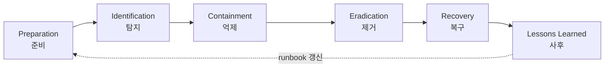
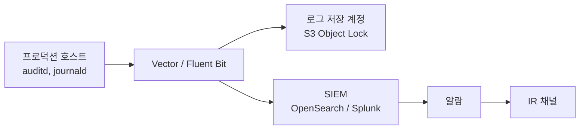

# 보안 사고 대응 절차

## 사고가 터졌을 때, 가장 먼저 하지 말아야 할 일부터

보안 사고가 처음 터졌을 때 본능적으로 하게 되는 행동이 몇 가지 있다. 그리고 이 본능 대부분이 사고 대응을 망친다.

- 침해당한 서버에 SSH로 들어가서 `ps`, `netstat`, `ls` 같은 명령을 마구 친다
- 의심스러운 파일을 발견하고 바로 `rm` 한다
- 공격자 IP를 보고 분노해서 방화벽에 차단 규칙부터 추가한다
- "일단 재부팅해보자"
- 슬랙 공개 채널에 "야 우리 해킹당한 것 같은데?" 라고 쓴다

이 다섯 가지가 왜 잘못인지 이해하는 게 사고 대응의 시작이다. 첫 두 개는 증거를 망가뜨린다. 디스크의 atime이 바뀌고, 메모리 상태가 변하고, 공격자가 남긴 흔적이 사라진다. 세 번째는 공격자에게 "탐지됐다"는 신호를 줘서 공격자가 더 깊이 숨거나 백도어를 추가로 심게 만든다. 네 번째는 RAM에 있던 모든 증거가 날아간다. 마지막은 만약 공격자가 슬랙에 침투해 있다면 본인이 탐지됐다는 사실을 그쪽에 알려주는 셈이다.

5년차쯤 되면 한 번쯤 이런 사고를 겪는다. 그때를 위해 미리 절차를 외워둬야 한다. 사고 한복판에서 절차를 만들 시간은 없다.

## 첫 30분: 무엇을, 어떤 순서로

침해가 의심된다는 알람이 떴거나 누가 신고했을 때, 첫 30분 안에 해야 할 일은 정해져 있다.

### 1. 사람부터 모은다 (5분)

- 사고 대응 책임자(IR Lead) 한 명을 정한다. 보통 보안 담당자나 SRE 리드.
- 별도 채널을 만든다. 공개 슬랙 말고, 사람 추가형 비공개 채널 또는 시그널 그룹.
- "공격자가 우리 슬랙도 보고 있을 수 있다"를 전제로 한다.
- 외부 통신은 IR Lead만 한다. 다른 엔지니어가 트위터나 깃허브에 단서를 흘리지 않게 한다.

### 2. 시간을 기록한다 (1분)

별거 아니어 보이지만 사고 후 회고에서 가장 많이 빠지는 부분이다. 사고 대응 채널 첫 메시지에 이렇게 남긴다.

```
[T0] 2026-05-04 14:32 KST - alert fired (CloudTrail GetCallerIdentity from 1.2.3.4)
[T+5] 14:37 KST - IR channel created, lead: @kkyung
[T+8] 14:40 KST - identified affected resource: i-0abc123 (prod-api-01)
```

이 타임라인이 KISA 신고서, 사후 회고, 그리고 만약 법정에 가게 되면 그 모든 곳에서 쓰인다. 메모리에 의존하지 말고 실시간으로 적는다.

### 3. 증거 보전 (10분)

서버를 끄지 않는다. 재부팅하지 않는다. 의심 파일을 삭제하지 않는다. 대신 다음을 수집한다.

```bash
# 메모리 덤프 (LiME, AVML 등)
sudo avml /mnt/evidence/memory.lime

# 프로세스 목록
ps auxef > /mnt/evidence/ps.txt

# 네트워크 연결
ss -tnp > /mnt/evidence/netstat.txt
lsof -i > /mnt/evidence/lsof.txt

# 로그인 기록
last -F > /mnt/evidence/last.txt
who > /mnt/evidence/who.txt

# 의심 파일 해시
find /tmp /var/tmp /dev/shm -type f -newer /etc/passwd -exec sha256sum {} \; > /mnt/evidence/recent_files.txt
```

수집한 파일은 별도 스토리지에 올린다. 침해 서버 디스크에 저장하면 의미가 없다. AWS라면 별도 S3 버킷(SCP로 잠긴, 침해당한 계정에서 접근 못 하는)이 좋다.

EC2 인스턴스라면 EBS 스냅샷도 떠둔다. 재부팅하지 말고 살아있는 상태에서 스냅샷을 뜬다. 라이브 메모리는 어차피 못 살리지만 디스크 상태는 그대로 보존된다.

### 4. 격리 (5분)

격리 시점은 IR Lead가 판단한다. 너무 일찍 격리하면 공격자 행동을 더 이상 관찰 못 하고, 너무 늦게 격리하면 피해가 확산된다. 보통은 다음 중 하나가 확인된 시점에 격리한다.

- 공격자가 데이터를 추출(exfiltration)하기 시작했다
- 공격자가 측면 이동(lateral movement)을 시도한다
- 랜섬웨어처럼 활동이 파괴적이다

격리 방법:

```bash
# AWS - 보안 그룹을 격리용으로 교체 (인바운드 X, 아웃바운드 X)
aws ec2 modify-instance-attribute \
  --instance-id i-0abc123 \
  --groups sg-quarantine

# 격리 보안 그룹은 미리 만들어둔다 (사고 터지고 만들면 늦다)
# - 인바운드: 사고 대응팀 점프 호스트 IP에서 SSH만
# - 아웃바운드: 증거 수집용 S3 엔드포인트만
```

쿠버네티스라면 NetworkPolicy로 격리한다. 파드를 죽이지 말고 트래픽만 차단한다. 죽이면 메모리가 날아간다.

```yaml
apiVersion: networking.k8s.io/v1
kind: NetworkPolicy
metadata:
  name: quarantine-pod
spec:
  podSelector:
    matchLabels:
      quarantine: "true"
  policyTypes: [Ingress, Egress]
  ingress: []
  egress: []
```

오염된 파드에 `quarantine=true` 레이블을 붙이면 모든 트래픽이 끊긴다.

### 5. 1차 보고 (5분)

IR Lead는 임원진(CTO, CISO 등)에게 짧게 알린다. 이 시점에는 "확실하지 않다"는 표현이 맞다.

```
주제: [P1] 프로덕션 보안 사고 의심 - 조사 중
시간: 14:32 KST 알람
범위: prod-api-01 (단일 인스턴스, 현재 격리 중)
영향: 고객 데이터 유출 여부 확인 중
다음 업데이트: 30분 내
```

이 시점에 외부 공지는 안 한다. 사실관계가 너무 부족하다.

## NIST / SANS 단계 모델

업계 표준 사고 대응 프레임워크는 두 개다. NIST SP 800-61 Rev.2와 SANS PICERL. 거의 같지만 단계 분리 방식이 조금 다르다.

| 단계 | NIST | SANS |
|------|------|------|
| 1 | Preparation | Preparation |
| 2 | Detection & Analysis | Identification |
| 3 | Containment, Eradication & Recovery | Containment / Eradication / Recovery (3단계로 분리) |
| 4 | Post-Incident Activity | Lessons Learned |

실무에서는 SANS의 6단계가 더 추적하기 쉽다. 단계마다 산출물이 분명하기 때문이다.



### Preparation (준비)

사고가 터진 뒤에 준비하면 늦다. 평시에 갖춰야 할 것들:

- IR Runbook (시나리오별 대응 절차서)
- 비상 연락망 (CTO, CISO, 법무, 홍보, 외부 IR 업체, KISA)
- 격리용 보안 그룹/NetworkPolicy 사전 정의
- 증거 보관용 별도 S3 버킷 (Object Lock 활성화)
- 점프 호스트 (IR 전용, 평시에는 끄거나 잠가둠)
- 워룸 채널 템플릿
- 키 회전 절차 (아래 SSH 키 유출 시나리오 참고)

회사가 작아서 IR 팀이 따로 없다면 외부 DFIR(Digital Forensics & Incident Response) 업체와 리테이너 계약을 맺어두는 것도 방법이다. 사고가 터진 다음에 업체를 찾으면 며칠이 그냥 간다.

### Identification (탐지·분석)

탐지원은 다양하다.

- SIEM 알람 (CloudTrail, GuardDuty, Falco, Wazuh 등)
- 직원 신고 ("이상한 메일이 왔어요")
- 외부 신고 (보안 연구자, 고객, KISA 통보)
- 미디어 보도 (이미 늦었다는 신호)

탐지 직후에는 "진짜 사고인가, 오탐인가"를 빠르게 판단한다. 오탐 비율이 높으면 사고 대응팀이 번아웃되고, 진짜 사고가 묻힌다. 그렇다고 너무 까다롭게 분류하면 진짜 사고를 놓친다.

분류 기준 예시:

- P1: 프로덕션 데이터 유출 의심, 외부 공격자 활성, 랜섬웨어
- P2: 내부 데이터 노출, 권한 오용, 인증 정보 유출 의심
- P3: 정책 위반, 단일 시스템 멀웨어 감염
- P4: 알려진 취약점 미패치, 의심스러운 활동 (사고는 아님)

### Containment (억제)

격리는 두 단계로 나뉜다.

**단기 억제(Short-term containment)**: 피해 확산 차단. 위에서 다룬 보안 그룹 교체, NetworkPolicy 적용 등이 여기 해당한다. 핵심은 "공격자 행위 중단"이지 "근본 원인 제거"가 아니다.

**장기 억제(Long-term containment)**: 시스템을 운영하면서 공격자를 천천히 몰아낼 환경 구성. 예를 들어 공격자가 사용하던 계정을 비활성화하고, 침해 IP를 WAF에서 차단하고, 임시 패치를 배포한다. 이 단계에서 공격자가 다른 백도어를 활성화할 수 있으므로 모니터링을 강화한다.

### Eradication (제거)

원인을 완전히 제거한다.

- 침해당한 호스트는 재구축 (재설치, 패치)이 원칙. "청소"는 신뢰할 수 없다.
- 컨테이너라면 이미지를 새로 빌드해서 배포한다.
- 침해된 자격증명(SSH 키, IAM 키, DB 비밀번호, API 토큰)은 전부 회전한다.
- 백도어, 웹쉘, cron job, systemd 유닛, kernel module 잔재 확인.
- IOC(Indicator of Compromise)를 다른 시스템에서 검색한다. 공격자가 한 군데만 침투했을 가능성은 낮다.

### Recovery (복구)

운영 환경으로 점진적 복귀.

- 재구축한 시스템을 격리 상태에서 먼저 가동
- 모니터링 강화 (보통 평시의 3~5배)
- 트래픽을 단계적으로 라우팅
- 며칠~몇 주 동안 재침투 신호 관찰

너무 빨리 복구하면 공격자가 같은 경로로 다시 들어온다. 6개월 안에 재침해되는 사례가 적지 않다.

### Lessons Learned (사후 회고)

사고 종료 후 1~2주 안에 작성한다. 더 늦으면 기억이 흐려지고, 더 이르면 감정이 정리되지 않는다. 작성법은 아래 별도 섹션에서 다룬다.

## 한국 KISA 신고 의무

여기서 많이들 헷갈리는데, 한국에서 보안 사고가 터지면 신고 의무가 법적으로 명시되어 있다. 회사가 망해도 신고 의무는 남는다.

### 정보통신망법 제48조의3 - 침해사고 신고

정보통신서비스 제공자(웹/앱 서비스 운영자 거의 다 해당)는 침해사고 발생 시 KISA(한국인터넷진흥원)에 신고해야 한다.

- 신고 대상: 해킹, DDoS, 악성코드 감염, 정보 유출 등
- 신고 시점: 인지 후 즉시 (실무적으로 24시간 이내가 안전선)
- 신고 채널: 보호나라 (boho.or.kr) 또는 118 전화

### 개인정보보호법 제34조 - 개인정보 유출 신고

개인정보가 유출됐다면 별도 의무가 추가된다.

- **정보주체 통지**: 유출 사실 인지 후 72시간 이내에 정보주체(고객)에게 알림
- **감독기관 신고**: 1,000명 이상 유출 시 개인정보보호위원회 또는 KISA에 신고
- 신고 항목: 유출 항목, 시점, 경위, 피해 최소화 조치, 담당자 연락처

여기서 "1,000명 이상"이라는 기준이 있어서 작은 사고는 신고 안 해도 된다고 오해하기 쉬운데, 정보주체 통지는 1명만 유출돼도 의무다. 헷갈리지 말 것.

### 신용정보법 - 금융권 추가 의무

금융 관련 서비스라면 금융위·금감원에도 추가 신고 의무가 있다. 카드사·은행·증권사 자회사라면 그쪽 사업자 보안 담당과 즉시 협의한다.

### 신고 vs 공지 vs 통지

용어가 비슷해서 헷갈린다.

- **신고(Reporting)**: 정부 기관(KISA, 개보위, 금감원)에 알리는 것. 의무.
- **통지(Notification)**: 영향받은 정보주체(고객)에게 알리는 것. 의무.
- **공지(Disclosure)**: 일반 공개. 홈페이지 공지문 등. 통지를 갈음할 수 있는 경우 있음.

법적 의무를 회피할 수 있다고 판단되더라도 신고는 하는 게 좋다. 추후 적발되면 제재 수위가 훨씬 높다.

## 로그 수집 시점이 사고 대응 성패를 가른다

사고 대응 회고에서 가장 많이 나오는 후회는 "로그가 없다"이다. 평시에 로그를 어떻게 보관하느냐가 사고 대응 능력의 80%를 결정한다.

### 무엇을 어디에 보관해야 하는가

| 로그 종류 | 보관 기간 (최소) | 비고 |
|-----------|------------------|------|
| OS auth 로그 (`/var/log/auth.log`, `secure`) | 1년 | 로그인 시도 추적 |
| 웹 접근 로그 (Nginx, ALB) | 1년 | 침해 진입점 추적 |
| 애플리케이션 로그 | 6개월~1년 | 비정상 행위 추적 |
| DB 쿼리 로그 (감사 로그) | 1년 | 데이터 접근 추적 |
| CloudTrail / Audit Log | 7년 권장 | API 호출 추적, 법적 증거 |
| Kubernetes audit log | 6개월~1년 | 클러스터 행위 추적 |
| VPC Flow Log / ssh 세션 녹화 | 90일~1년 | 측면 이동 탐지 |

여기서 핵심은 "침해당한 시스템에서 로그를 빼낼 수 있느냐"가 아니라 "침해당하기 전에 외부로 미리 보냈느냐"다. 공격자가 첫 번째로 하는 일이 로그 삭제다.

```
✗ 침해 호스트 로컬에만 보관 → 삭제됨
✗ 같은 계정 S3에 백업 → 공격자가 IAM 권한 탈취하면 같이 사라짐
✓ 별도 AWS 계정 S3 + Object Lock + MFA Delete → 공격자도 못 지운다
```

### 로그 수집 아키텍처 예시



저장(immutable archive)과 분석(SIEM)을 분리한다. SIEM은 비싸서 보존 기간이 짧다. S3 Glacier는 저렴해서 7년 보관해도 부담이 적다.

### 로그가 충분한지 자가 점검

사고가 터진 시점에서 다음 질문에 답이 안 나온다면 로깅이 부족한 거다.

- 누가 언제 어디서 SSH로 들어왔나
- 어떤 IAM 사용자가 어떤 API를 호출했나
- 어떤 SQL 쿼리가 어느 IP에서 들어왔나
- 어떤 S3 객체가 누구에 의해 다운로드됐나
- 어떤 컨테이너가 어떤 이미지로 실행됐나

이 다섯 개에 대답할 수 있는 로그를 평시에 모아둬야 한다.

## 사고 시나리오 1: SSH 키 유출

깃허브 공개 레포지토리에 실수로 SSH 개인키를 커밋했다는 알람이 떴다. 이후 30분간 시나리오를 따라가본다.

### T+0 (탐지)

- 사내 GitHub Secret Scanning 또는 외부 도구(GitGuardian, TruffleHog)가 알람 발송
- "RSA private key detected in commit abc123 by @kkyung"

### T+2 (분류)

IR Lead가 P2로 분류한다. 키 자체는 유출됐지만 즉시 데이터 유출은 아니다. 하지만 이 키로 어떤 시스템에 접근 가능한지부터 확인한다.

### T+5 (영향 범위 식별)

```bash
# 그 키의 공개키 fingerprint 확인
ssh-keygen -lf id_rsa.pub
# 256 SHA256:abc... user@host

# 모든 서버 authorized_keys에서 해당 fingerprint 검색
ansible all -m shell -a "ssh-keygen -lf ~/.ssh/authorized_keys 2>/dev/null | grep 'abc...'"

# AWS EC2의 모든 인스턴스 ssh 키 검사
aws ec2 describe-instances --query 'Reservations[].Instances[].KeyName' --output text | sort -u
```

해당 키가 어떤 인스턴스의 어떤 사용자 계정에 등록됐는지 모두 찾는다.

### T+10 (격리 — 키 회전)

SSH 키 유출은 격리가 비교적 단순하다. 키를 무효화하면 끝.

```bash
# 1. authorized_keys에서 제거 (Ansible 일괄)
ansible all -m authorized_key -a "user=deploy key=$KEY_TO_REVOKE state=absent"

# 2. AWS EC2 키페어 삭제 (이미 등록된 인스턴스에는 영향 없지만 신규 인스턴스 차단)
aws ec2 delete-key-pair --key-name leaked-key

# 3. 새 키 발급, authorized_keys 갱신
ssh-keygen -t ed25519 -f new_key -C "user@host-2026-05-04"
ansible all -m authorized_key -a "user=deploy key='$(cat new_key.pub)'"
```

### T+15 (피해 확인)

키가 외부에 노출된 시점부터 회전 시점까지의 SSH 로그를 본다.

```bash
# 모든 호스트에서 deploy 계정의 로그인 기록
ansible all -m shell -a "grep 'deploy' /var/log/auth.log | grep -i 'accepted'"

# 비정상 IP에서 로그인 흔적 있는지 확인
# 우리 사무실 IP, VPN IP, 점프 호스트 IP 외에서 들어왔다면 침해 의심
```

비정상 로그인이 있다면 P1으로 격상하고 위에서 다룬 표준 절차로 전환한다. 단순 키 유출에서 호스트 침해로 사고 성격이 바뀐다.

### T+20 (깃허브 정리)

```bash
# 단순 force-push로 안 된다 — 깃허브는 dangling commit 추적함
# BFG Repo-Cleaner 사용
java -jar bfg.jar --delete-files id_rsa my-repo.git
git -C my-repo.git reflog expire --expire=now --all
git -C my-repo.git gc --prune=now --aggressive
git -C my-repo.git push --force

# 하지만 GitHub Support에 연락해서 commit 자체를 garbage collect 요청
# https://docs.github.com/en/authentication/keeping-your-account-and-data-secure/removing-sensitive-data-from-a-repository
```

여기서 중요한 점: 깃허브에 한 번 푸시된 데이터는 "키를 회전했으니 끝"이라고 생각하면 안 된다. 봇이 깃허브 공개 레포를 실시간으로 스캔하므로 노출 시점부터 분 단위로 시도가 들어온다. 노출 시간이 30초였어도 키는 유출됐다고 가정한다.

### T+30 (KISA 신고 여부 판단)

키 유출만으로 침해 흔적이 없다면 정보통신망법 신고 의무는 모호하다. 하지만 "고객 데이터에 접근 가능한 키"였다면 보수적으로 신고한다. 판단이 어렵다면 보호나라 118로 전화해서 사례 확인 후 결정한다.

## 사고 시나리오 2: S3 버킷 공개 노출

GuardDuty가 "Unusual S3 access pattern detected" 알람을 띄웠다. 외부에서 S3 버킷에 대량 다운로드가 발생했다.

### T+0 (탐지·분석)

```bash
# 어떤 버킷인지 확인
aws s3api get-bucket-acl --bucket suspect-bucket
aws s3api get-bucket-policy --bucket suspect-bucket

# Block Public Access 설정 확인
aws s3api get-public-access-block --bucket suspect-bucket
```

`"Principal": "*"` 또는 `BlockPublicAcls: false` 가 보이면 공개 노출 확정.

### T+5 (즉시 격리)

```bash
# Block Public Access 켜기 — 버킷 정책에 우선
aws s3api put-public-access-block \
  --bucket suspect-bucket \
  --public-access-block-configuration \
  "BlockPublicAcls=true,IgnorePublicAcls=true,BlockPublicPolicy=true,RestrictPublicBuckets=true"

# 버킷 정책 자체도 비공개로 변경
aws s3api delete-bucket-policy --bucket suspect-bucket
```

이때 운영 트래픽이 끊길 수 있다. 정상 사용자가 그 버킷을 쓰고 있었다면 일시적 장애가 발생한다. 그래도 격리가 우선이다.

### T+10 (피해 범위 산정)

S3 액세스 로그 또는 CloudTrail Data Events를 본다.

```bash
# CloudTrail에서 GetObject 호출 추출
aws athena start-query-execution \
  --query-string "
    SELECT eventTime, sourceIPAddress, userIdentity.principalId,
           requestParameters.key, additionalEventData.bytesTransferredOut
    FROM cloudtrail_logs
    WHERE eventName = 'GetObject'
      AND requestParameters.bucketName = 'suspect-bucket'
      AND eventTime > '2026-04-01'
    ORDER BY eventTime
  "
```

여기서 확인할 것:

- 외부 IP에서 다운로드한 객체 키 목록
- 다운로드된 총 용량
- 다운로드 시간대 분포 (한 번에 일괄? 천천히 분산?)

객체 키 하나하나가 무엇을 담고 있는지 검토한다. 마케팅 자료뿐이라면 영향이 작지만, 고객 개인정보 백업이라면 P1 사고로 격상된다.

### T+30 (정보주체 통지 준비)

개인정보가 포함됐다면 72시간 카운트다운이 시작된다. 다음을 정리한다.

- 유출된 정보주체 식별 (객체 키에 사용자 ID가 있다면 매핑)
- 유출된 항목 목록 (이름, 주민번호, 전화번호 등)
- 유출 시점 (객체가 공개로 바뀐 시점부터)
- 위험 최소화를 위한 권고사항 (비밀번호 변경, 카드 재발급 등)

### T+1H (KISA 신고)

1,000명 이상 개인정보 유출 시 신고 의무. 신고 양식은 보호나라 사이트에 있다. 신고 시 다음을 첨부한다.

- 사고 인지 시각, 발생 시각, 종료 시각
- 사고 원인 (예: 버킷 정책 오설정)
- 영향받은 정보주체 수
- 유출 항목
- 응급 조치 내역
- 재발 방지 대책

신고는 보수적으로. 정보주체 수를 추정으로 신고한 뒤 정확한 수가 나오면 갱신 신고하는 게 안전하다. "1,000명 미만이라고 추정해서 신고 안 했는데 나중에 더 나왔다"가 가장 위험하다.

### 재발 방지

S3 공개 노출은 사람 실수가 거의 항상 원인이다. 평시 통제로 막아야 한다.

```bash
# 계정 레벨 Block Public Access (모든 버킷에 우선 적용)
aws s3control put-public-access-block \
  --account-id 123456789012 \
  --public-access-block-configuration \
  "BlockPublicAcls=true,IgnorePublicAcls=true,BlockPublicPolicy=true,RestrictPublicBuckets=true"

# AWS Config 규칙 활성화
# - s3-bucket-public-read-prohibited
# - s3-bucket-public-write-prohibited
# - s3-bucket-server-side-encryption-enabled

# IaC 단계에서 차단 (Terraform)
# 모든 aws_s3_bucket 리소스가 aws_s3_bucket_public_access_block 을 동반하도록 OPA/Sentinel 정책으로 강제
```

## 사후 회고(Postmortem) 작성법

회고는 사고 대응의 마지막이자 다음 사고 대응의 시작이다. 잘 쓰면 같은 사고를 두 번 안 겪는다. 못 쓰면 매년 같은 자리에서 미끄러진다.

### 회고는 비난하지 않는다 (Blameless)

이게 안 지켜지면 회고 자체가 무의미해진다. "@xx가 키를 깃허브에 올려서 사고가 났다"라고 쓰는 순간, 다음 사고 때 아무도 솔직하게 말 안 한다. 대신 이렇게 쓴다.

> 개발자가 로컬 테스트용 SSH 키를 별도 디렉토리에 보관하다가 git add . 명령으로 의도치 않게 커밋했다. pre-commit 훅이나 secret scanning이 평시에 작동하지 않아 사전 차단되지 못했다.

사람이 아니라 시스템을 본다.

### 표준 항목

회고 문서는 다음을 포함한다.

```markdown
# [P2] SSH 키 유출 사고 회고 - 2026-05-04

## 요약
3줄 이내. 무엇이, 언제, 어떻게.

## 영향 (Impact)
- 영향받은 시스템: prod-api-01, prod-api-02
- 영향받은 사용자: 없음 (외부 침해 흔적 없음)
- 다운타임: 0 (격리 시 트래픽 영향 없음)
- 데이터 유출: 없음

## 타임라인
| 시각 (KST) | 이벤트 |
|------------|--------|
| 14:32 | GitGuardian 알람 |
| 14:35 | IR 채널 생성, IR Lead 지정 |
| 14:40 | 영향 범위 식별 완료 |
| 14:45 | 키 회전 완료 |
| 15:10 | 침해 흔적 없음 확인 |
| 15:30 | 사고 종료 선언 |

## 근본 원인 (Root Cause)
5 Whys 또는 그에 준하는 분석.

## 잘된 점 (What went well)
- 알람이 2분 내 발송됨
- IR Runbook이 있어서 즉시 절차 진행 가능
- Ansible 키 회전 자동화로 회전 시간 5분

## 개선할 점 (What didn't)
- pre-commit hook이 일부 개발자 환경에서 비활성화되어 있었음
- 영향 범위 식별이 수동이라 10분 소요

## 액션 아이템
| 항목 | 담당 | 기한 | 우선순위 |
|------|------|------|----------|
| pre-commit hook 강제 (CI에서 검증) | @sre | 2026-05-15 | P1 |
| 키-인스턴스 매핑 자동화 | @platform | 2026-05-31 | P2 |
| IR Runbook에 SSH 시나리오 추가 | @security | 2026-05-10 | P2 |
```

### 5 Whys

근본 원인 분석은 "왜?"를 다섯 번 반복하는 게 정석이다.

> 1. 왜 SSH 키가 깃허브에 올라갔나? → 개발자가 git add . 로 실수 커밋
> 2. 왜 pre-commit hook이 막지 못했나? → 해당 개발자 환경에 hook이 설치 안 됨
> 3. 왜 환경에 hook이 없었나? → 신규 입사자 온보딩에 hook 설치 단계가 없었음
> 4. 왜 온보딩에 그 단계가 없었나? → 온보딩 문서가 2년 전 기준
> 5. 왜 온보딩 문서가 갱신 안 됐나? → 책임자가 명시되지 않음

여기까지 가야 액션 아이템이 "온보딩 문서 책임자 지정 + 분기별 검토"로 나온다. "개발자 교육"으로 끝나면 또 같은 사고가 난다.

### 액션 아이템에 기한이 없으면 액션이 아니다

회고에 "X를 개선한다"라고만 쓰면 누구도 안 한다. 담당자, 기한, 우선순위가 없으면 액션 아이템이 아니다. 그리고 회고 후 1주일 안에 그 액션 아이템들이 트래커(JIRA, Linear 등)에 등록됐는지 IR Lead가 확인해야 한다.

### 회고 공유 범위

P1~P2 사고 회고는 회사 전체에 공유한다. 보안팀끼리만 보면 다른 팀이 같은 실수를 반복한다. 단, 외부 공개 시점과 범위는 별도 판단. 고객 신뢰가 걸린 사고라면 외부 블로그 포스트로 풀어내는 것도 방법이다 (Cloudflare, GitHub 등이 잘하는 사례).

## 끝으로 외워둘 한 가지

사고 대응의 핵심은 "절차대로 한다"가 아니라 "절차를 평시에 만들어둔다"다. 알람 떨어진 뒤에 "이제 뭐하지?"를 고민하는 사람과 "5분 내에 격리, 10분 내에 보전"이 몸에 밴 사람의 차이는 사고 1건에서 회사가 살아남느냐로 나타난다.

런북을 만들고, 시뮬레이션을 돌리고(Tabletop Exercise), 키 회전 자동화를 미리 짜둔다. 이게 보안 엔지니어가 평시에 하는 일이다.
