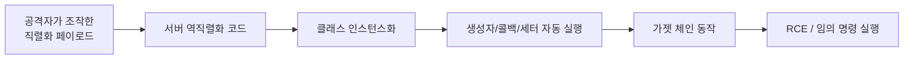
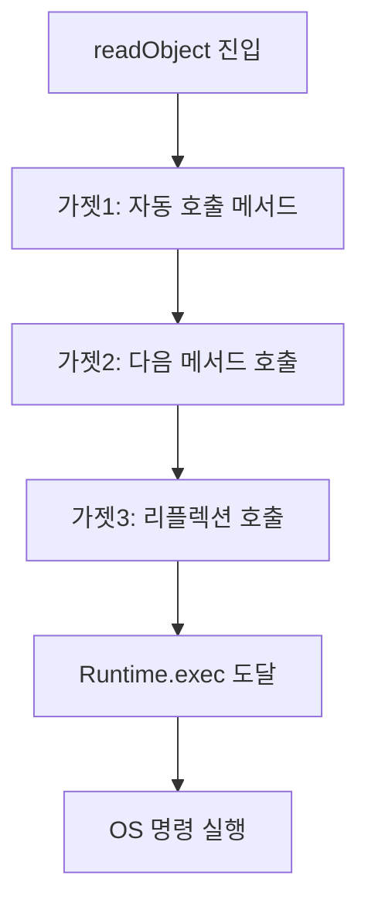
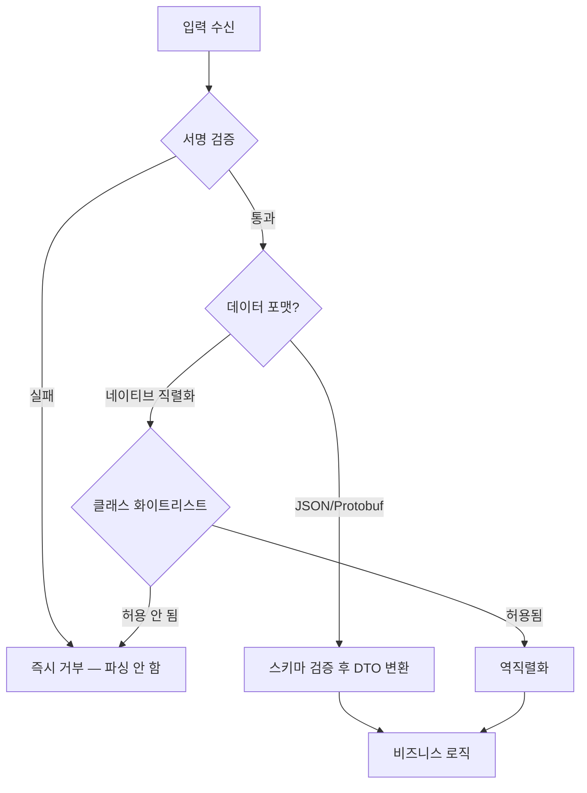

# 안전하지 않은 역직렬화 (Insecure Deserialization)

역직렬화 취약점은 한 번 터지면 대부분 RCE(원격 코드 실행)로 직결된다. SQL Injection처럼 데이터만 새는 게 아니라, 공격자가 서버에서 임의 코드를 돌릴 수 있게 된다. 그런데도 코드 리뷰에서 잘 안 잡힌다. `readObject()` 한 줄, `pickle.loads()` 한 줄이 어떤 의미인지 모르고 지나가기 때문이다.

직렬화 포맷 자체를 다루는 내용은 [Serialization_Formats_Deep_Dive](../DataRepresentation/Serialization_Formats_Deep_Dive.md)에 있다. 여기서는 그 포맷들이 어떻게 공격에 악용되는지, 그리고 어떻게 막는지만 본다.

## 직렬화와 역직렬화에서 뭐가 위험한가

직렬화는 메모리에 있는 객체를 바이트 스트림으로 바꾸는 것이고, 역직렬화는 그 반대다. 문제는 역직렬화 쪽에 있다.

직렬화된 데이터에는 단순한 값만 들어있는 게 아니다. "어떤 클래스의 객체인지", "그 객체의 필드가 무엇인지"가 같이 들어있다. 역직렬화 코드는 이 정보를 보고 객체를 다시 만든다. 즉 입력 데이터가 "어떤 클래스를 인스턴스화할지"를 지정할 수 있다는 뜻이다.

공격자가 직렬화된 바이트를 마음대로 조작할 수 있으면, "이 클래스의 객체를 만들어라"라고 서버에 지시할 수 있다. 그 과정에서 호출되는 생성자, 콜백 메서드, 필드 세팅 로직이 공격 표면이 된다.



핵심은 "역직렬화 = 단순한 데이터 파싱"이 아니라는 점이다. 역직렬화는 코드 실행을 동반한다. 그래서 신뢰할 수 없는 데이터를 역직렬화하는 순간 게임이 끝난다.

## 가젯 체인이라는 개념

처음 이 취약점을 공부할 때 가장 헷갈리는 게 가젯 체인(gadget chain)이다. "공격자가 자기 악성 클래스를 서버에 보내면 되는 거 아닌가?"라고 생각하기 쉬운데, 그게 아니다.

서버는 자기가 클래스패스에 가지고 있는 클래스만 역직렬화할 수 있다. 공격자가 정의한 적 없는 클래스는 만들 수 없다. 그래서 공격자는 **이미 서버 클래스패스에 존재하는 클래스들**을 조합한다.

가젯(gadget)은 역직렬화 과정에서 자동으로 호출되는 메서드를 가진 클래스다. 예를 들어 Java에서 `readObject()`가 호출될 때 내부적으로 특정 메서드를 부르는 클래스가 있다고 하자. 그 메서드가 또 다른 객체의 메서드를 부르고, 그게 또 다른 걸 부르고... 이렇게 연쇄적으로 호출되는 사슬을 엮어서 마지막에 `Runtime.exec()` 같은 위험한 호출에 도달하게 만드는 게 가젯 체인이다.



여기서 중요한 건 가젯 체인에 쓰이는 클래스들이 **취약점이 있는 라이브러리가 아니라 흔히 쓰는 정상 라이브러리**라는 점이다. Apache Commons Collections, Spring, Groovy 같은 라이브러리가 클래스패스에 있으면 거기서 가젯이 나온다. 그래서 "우리 코드엔 문제없는데?"라고 안심하면 안 된다. 의존성에 commons-collections가 들어있고 어딘가에서 신뢰할 수 없는 데이터를 역직렬화하면 그걸로 끝이다.

ysoserial이라는 도구가 이런 가젯 체인을 자동으로 만들어준다. 라이브러리 조합별로 페이로드를 생성해주기 때문에, 공격자 입장에서는 직접 체인을 발굴할 필요도 없다. 방어하는 입장에서는 이게 무섭다. "우리는 commons-collections 3.1 쓰는데 ysoserial에 CommonsCollections1 체인이 있네"면 바로 공격 가능하다고 봐야 한다.

## Java: ObjectInputStream

Java의 역직렬화가 가장 악명 높다. RMI, JMX, 일부 메시징, 옛날 세션 클러스터링, 일부 캐시 라이브러리가 내부적으로 Java 직렬화를 쓴다. 본인이 직접 `ObjectInputStream`을 안 써도 프레임워크가 쓰고 있을 수 있다.

### 취약한 코드

```java
// 신뢰할 수 없는 입력을 그대로 역직렬화 — 위험
public Object deserialize(byte[] data) throws Exception {
    ByteArrayInputStream bis = new ByteArrayInputStream(data);
    ObjectInputStream ois = new ObjectInputStream(bis);
    return ois.readObject();  // 여기서 가젯 체인이 동작한다
}
```

`readObject()`가 호출되는 순간 페이로드 안에 들어있는 객체 그래프가 복원되면서 각 객체의 `readObject`, `readResolve`, `finalize`, `hashCode` 같은 메서드가 자동 호출된다. 이 자동 호출이 가젯 체인의 시작점이다.

실제 사고 사례가 많다. 2015년 Apache Commons Collections 가젯이 공개되면서 WebLogic, WebSphere, JBoss, Jenkins 등 수많은 제품에서 RCE가 터졌다. 2017년 Jenkins, 2021년 여러 제품에서도 같은 패턴이 반복됐다. 공통점은 전부 신뢰할 수 없는 입력을 Java 직렬화로 역직렬화했다는 것이다.

### ObjectInputFilter로 화이트리스트 거는 법

Java 9부터 `ObjectInputFilter`가 표준으로 들어왔다 (JEP 290). Java 8에서도 8u121 이상이면 백포트되어 있다. 역직렬화 대상 클래스를 필터링할 수 있다.

```java
import java.io.*;

public Object deserializeSafe(byte[] data) throws Exception {
    ByteArrayInputStream bis = new ByteArrayInputStream(data);
    ObjectInputStream ois = new ObjectInputStream(bis);

    // 허용할 클래스만 명시. 나머지는 전부 거부
    ObjectInputFilter filter = ObjectInputFilter.Config.createFilter(
        "com.myapp.dto.OrderDto;com.myapp.dto.UserDto;" +  // 허용 클래스
        "java.lang.*;java.util.*;" +                        // 기본 타입
        "!*"                                                // 그 외 전부 거부
    );
    ois.setObjectInputFilter(filter);

    return ois.readObject();
}
```

필터 패턴은 왼쪽부터 평가된다. `!*`가 맨 뒤에 있어서 명시적으로 허용되지 않은 모든 클래스를 거부한다. 화이트리스트는 반드시 "기본 거부"로 끝나야 한다. 블랙리스트(`!java.lang.Runtime` 식으로 위험한 것만 막기)는 절대 하면 안 된다. 가젯은 계속 새로 발견되기 때문에 블랙리스트는 항상 뚫린다.

JVM 전역으로 거는 것도 가능하다. 시스템 프로퍼티 `jdk.serialFilter`로 지정하면 모든 `ObjectInputStream`에 적용된다.

```bash
java -Djdk.serialFilter='com.myapp.**;java.base/*;!*' -jar app.jar
```

깊이 제한, 배열 크기 제한, 참조 개수 제한도 같이 걸 수 있다. DoS 방어용이다.

```
maxdepth=20;maxrefs=1000;maxbytes=10000;com.myapp.**;!*
```

필터를 코드로 직접 짤 수도 있다. 클래스 이름 기준이 아니라 패키지나 로더 기준으로 정교하게 거르고 싶을 때 쓴다.

```java
ObjectInputFilter filter = info -> {
    Class<?> clazz = info.serialClass();
    if (clazz == null) {
        return ObjectInputFilter.Status.UNDECIDED;  // 클래스 정보 없으면 다음 검사로
    }
    String name = clazz.getName();
    if (name.startsWith("com.myapp.dto.")) {
        return ObjectInputFilter.Status.ALLOWED;
    }
    return ObjectInputFilter.Status.REJECTED;
};
```

### 더 근본적인 방어

필터를 거는 것보다 Java 직렬화 자체를 안 쓰는 게 낫다. 외부와 주고받는 데이터는 JSON, Protobuf 같은 데이터 전용 포맷으로 바꾼다. DTO를 Jackson으로 직렬화/역직렬화하면 임의 클래스 인스턴스화 문제가 사라진다. 단 Jackson도 설정을 잘못하면 똑같이 뚫린다(아래 JSON 항목 참고).

## Python: pickle

Python의 `pickle`은 설계 자체가 위험하다. 공식 문서에도 "신뢰할 수 없는 데이터를 unpickle하지 마라"라고 빨간 박스로 박혀 있다.

pickle은 `__reduce__` 메서드를 통해 객체 복원 방법을 직접 지정할 수 있다. 이걸 악용하면 unpickle 시점에 임의 함수를 호출하게 만들 수 있다.

```python
import pickle
import os

class Exploit:
    def __reduce__(self):
        # unpickle 시 이 명령이 실행된다
        return (os.system, ('id',))

# 공격자가 만드는 페이로드
payload = pickle.dumps(Exploit())

# 서버가 신뢰 없이 역직렬화하면 끝
pickle.loads(payload)  # 'id' 명령 실행됨
```

`pickle.loads()`를 호출하는 순간 `os.system('id')`가 실행된다. 별도의 가젯 체인을 발굴할 필요도 없다. `__reduce__`가 그냥 "복원할 때 이 callable을 이 인자로 불러라"를 명시하기 때문이다. Java보다 훨씬 직관적으로 위험하다.

실무에서 pickle이 새어나오는 경로가 의외로 많다.

- Redis, Memcached에 객체를 pickle로 캐싱하고, 캐시 서버가 노출되거나 다른 서비스와 공유될 때
- Celery 같은 태스크 큐의 직렬화 포맷을 pickle로 둘 때 (브로커를 장악하면 워커에서 RCE)
- 머신러닝 모델 파일(`.pkl`, `joblib`, PyTorch `.pt`의 일부)을 외부에서 받아 로드할 때
- 멀티프로세싱이나 분산 처리에서 객체를 주고받을 때

특히 ML 모델 로딩은 요즘 자주 터지는 경로다. Hugging Face 같은 데서 받은 모델을 그냥 `torch.load()`하면 내부적으로 pickle을 쓰기 때문에 악성 모델 파일 하나로 RCE가 난다. PyTorch는 `weights_only=True` 옵션을 권장하는 방향으로 바뀌고 있다.

### Python에서의 방어

pickle은 화이트리스트 필터링이 Java만큼 깔끔하지 않다. `pickle.Unpickler`를 상속해서 `find_class`를 오버라이드하는 방법이 있다.

```python
import pickle
import io

class RestrictedUnpickler(pickle.Unpickler):
    # 허용할 (모듈, 클래스) 조합만 명시
    ALLOWED = {
        ('myapp.dto', 'OrderDto'),
        ('myapp.dto', 'UserDto'),
    }

    def find_class(self, module, name):
        if (module, name) in self.ALLOWED:
            return super().find_class(module, name)
        raise pickle.UnpicklingError(
            f"허용되지 않은 클래스: {module}.{name}"
        )

def safe_loads(data: bytes):
    return RestrictedUnpickler(io.BytesIO(data)).load()
```

`os`, `subprocess`, `builtins` 같은 모듈은 절대 허용 목록에 넣으면 안 된다. 그런데 이렇게 막아도 우회 경로가 계속 나오기 때문에, 가장 확실한 건 그냥 pickle을 안 쓰는 것이다.

신뢰 경계를 넘는 데이터는 JSON으로 바꾼다. 객체가 필요하면 JSON으로 받은 뒤 명시적으로 검증해서 dataclass로 변환한다.

```python
import json
from dataclasses import dataclass

@dataclass
class OrderDto:
    order_id: str
    amount: int

def parse_order(raw: str) -> OrderDto:
    data = json.loads(raw)  # 데이터만 파싱, 코드 실행 없음
    # 필드 명시적으로 꺼내고 타입 검증
    return OrderDto(
        order_id=str(data["order_id"]),
        amount=int(data["amount"]),
    )
```

Celery는 직렬화 포맷을 `json`으로 강제하는 게 좋다.

```python
app.conf.update(
    task_serializer='json',
    result_serializer='json',
    accept_content=['json'],  # pickle 수신 자체를 거부
)
```

## Node.js: node-serialize

Node.js는 표준 라이브러리에 위험한 역직렬화가 없다. 문제는 서드파티 패키지다. `node-serialize`가 대표적이다.

`node-serialize`는 함수도 직렬화/역직렬화할 수 있게 만들어졌다. 직렬화된 데이터에 함수 본문이 문자열로 들어가는데, 역직렬화할 때 이걸 `eval`로 되살린다. 게다가 IIFE(즉시 실행 함수) 형태를 넣으면 역직렬화하는 순간 실행된다.

```javascript
const serialize = require('node-serialize');

// 공격자 페이로드. _$$ND_FUNC$$_ 마커 뒤 함수가 eval된다.
// 끝에 ()를 붙여 즉시 실행시킨다.
const payload = '{"rce":"_$$ND_FUNC$$_function(){' +
    'require(\'child_process\').exec(\'id\', function(e,o){console.log(o)});' +
    '}()"}';

serialize.unserialize(payload);  // 역직렬화 시점에 'id' 실행
```

`unserialize`가 객체 안의 `_$$ND_FUNC$$_` 마커를 보고 그 뒤 문자열을 함수로 복원하는데, 끝에 `()`가 붙어 있으면 복원과 동시에 실행된다. 이게 핵심이다.

### Node.js에서의 방어

답은 단순하다. `node-serialize` 같은 함수 직렬화 패키지를 쓰지 않는다. 객체 직렬화가 필요하면 `JSON.stringify` / `JSON.parse`만 쓴다. JSON에는 함수가 없으므로 코드 실행이 일어날 수 없다.

```javascript
// 데이터만 직렬화. 함수는 애초에 들어가지 않는다.
const data = JSON.parse(rawInput);
// 받은 데이터는 스키마 검증 후 사용
```

JSON으로 받되 구조 검증이 필요하면 Zod, Joi, ajv 같은 스키마 검증기를 같이 쓴다.

```javascript
const { z } = require('zod');

const OrderSchema = z.object({
    orderId: z.string(),
    amount: z.number().int().positive(),
});

function parseOrder(raw) {
    const data = JSON.parse(raw);
    return OrderSchema.parse(data);  // 스키마 안 맞으면 예외
}
```

`JSON.parse`의 reviver 함수를 쓸 때도 거기서 임의 코드를 부르지 않도록 조심한다. 그리고 프로토타입 오염(`__proto__` 주입)은 역직렬화와 별개의 문제지만 JSON 파싱 후 객체를 그대로 머지할 때 자주 같이 터지므로, 신뢰할 수 없는 객체를 깊은 병합할 때 주의한다.

## PHP: unserialize

PHP의 `unserialize()`도 매직 메서드 때문에 위험하다. 객체가 역직렬화될 때 `__wakeup()`이 호출되고, 객체가 소멸될 때 `__destruct()`가 호출된다. 스크립트가 끝나면 객체가 소멸되므로 `__destruct()`는 거의 항상 불린다. 여기에 위험한 동작이 있는 클래스가 클래스패스에 있으면 가젯이 된다 (PHP에서는 POP 체인, Property Oriented Programming이라고 부른다).

```php
<?php
class Logger {
    public $logFile;
    public $data;

    function __destruct() {
        // 소멸 시 파일에 쓴다 — 공격자가 logFile, data를 조작하면 웹쉘 작성 가능
        file_put_contents($this->logFile, $this->data);
    }
}

// 공격자가 보내는 직렬화 문자열
// O:6:"Logger":2:{s:7:"logFile";s:9:"shell.php";s:4:"data";s:...:"<?php system($_GET[c]); ?>";}
$obj = unserialize($_POST['data']);  // __destruct에서 웹쉘 생성
?>
```

공격자는 클래스의 프로퍼티 값을 직렬화 문자열로 직접 지정할 수 있다. 위 예처럼 `logFile`을 `shell.php`로, `data`를 PHP 코드로 채워 보내면 스크립트 종료 시 웹쉘이 만들어진다. 실제로는 여러 클래스의 매직 메서드를 엮는 POP 체인으로 더 복잡한 공격을 한다. Laravel, Symfony 같은 프레임워크의 클래스를 가젯으로 쓰는 phpggc 같은 도구도 있다(ysoserial의 PHP 버전).

### PHP에서의 방어

PHP 7부터 `unserialize`에 `allowed_classes` 옵션이 생겼다. 두 번째 인자로 허용 클래스를 지정하거나 아예 객체 복원을 막을 수 있다.

```php
<?php
// 객체 복원 자체를 금지 — 배열, 스칼라만 복원
$data = unserialize($input, ['allowed_classes' => false]);

// 특정 클래스만 허용
$data = unserialize($input, ['allowed_classes' => ['OrderDto', 'UserDto']]);
?>
```

`allowed_classes => false`로 두면 직렬화 문자열에 객체가 있어도 `__PHP_Incomplete_Class`로 복원되어 매직 메서드가 안 불린다. 객체를 주고받을 필요가 없으면 이게 가장 안전하다.

여기서도 더 나은 답은 `unserialize` 대신 `json_decode`를 쓰는 것이다. 외부 입력으로 들어오는 직렬화 데이터는 PHP 직렬화 포맷이 아니라 JSON으로 받는다.

## 공통 방어 원칙

언어마다 문법은 다르지만 방어 원칙은 같다. 우선순위 순서대로 적용한다.

### 1. 신뢰할 수 없는 입력을 역직렬화하지 않는다

가장 확실한 방어다. 사용자 입력, 외부 API 응답, 쿠키, 헤더, 메시지 큐 페이로드를 네이티브 직렬화 포맷으로 역직렬화하지 않는다. "내부 서비스끼리만 쓰니까 괜찮다"는 위험한 가정이다. 내부망이 뚫리거나 내부 서비스가 탈취되면 그대로 측면 이동(lateral movement) 경로가 된다.

### 2. 데이터 전용 포맷을 쓴다

JSON, Protobuf, MessagePack처럼 코드 실행이 불가능한 포맷을 쓴다. 이 포맷들은 "데이터"만 표현하지 "어떤 클래스를 만들어라"를 표현하지 않는다. 받은 데이터는 명시적으로 검증해서 도메인 객체로 변환한다.

단, JSON이라도 다형성 역직렬화(polymorphic deserialization)를 켜면 위험해진다. Jackson의 `enableDefaultTyping()`이나 `@JsonTypeInfo`로 타입 정보를 JSON에 넣고 그걸로 클래스를 결정하게 하면, 결국 입력이 클래스를 지정하는 셈이라 Java 직렬화와 같은 문제가 생긴다. CVE도 많이 나왔다. 다형성이 꼭 필요하면 허용 타입을 화이트리스트로 묶는다(`PolymorphicTypeValidator`).

### 3. 화이트리스트 기반 클래스 필터링

네이티브 직렬화를 도저히 못 버리는 경우(레거시 RMI, 기존 프로토콜 등)에만 쓴다. Java는 `ObjectInputFilter`, Python은 `find_class` 오버라이드, PHP는 `allowed_classes`다. 반드시 "기본 거부 + 명시 허용" 구조여야 한다. 블랙리스트는 항상 우회된다.

### 4. 무결성 검증 (서명)

역직렬화하기 전에 데이터가 변조되지 않았는지 확인한다. HMAC으로 서명하고, 역직렬화 전에 서명을 먼저 검증한다. 서명이 안 맞으면 파싱조차 하지 않는다.

```python
import hmac
import hashlib

SECRET = b"server-side-secret-key"

def sign(payload: bytes) -> bytes:
    mac = hmac.new(SECRET, payload, hashlib.sha256).digest()
    return mac + payload

def verify_and_extract(signed: bytes) -> bytes:
    mac, payload = signed[:32], signed[32:]
    expected = hmac.new(SECRET, payload, hashlib.sha256).digest()
    if not hmac.compare_digest(mac, expected):
        raise ValueError("서명 불일치 — 변조된 데이터")
    return payload  # 검증 통과한 뒤에만 역직렬화로 넘긴다
```

주의할 점이 두 가지 있다. 첫째, 서명 검증은 변조를 막을 뿐 "정당한 키를 가진 쪽이 보낸 악성 페이로드"는 못 막는다. 키가 유출되면 무력화된다. 둘째, 서명만 믿고 역직렬화 자체를 안전하다고 착각하면 안 된다. 서명은 변조 방어이고, 클래스 화이트리스트는 별개로 같이 걸어야 한다. 비교는 반드시 `compare_digest`처럼 타이밍 공격에 안전한 함수로 한다.

이 패턴이 실무에서 자주 보이는 곳이 세션 쿠키와 JWT다. 서버가 세션 객체를 직렬화해서 쿠키에 넣을 때 서명을 빠뜨리면 공격자가 쿠키를 조작해 역직렬화 공격을 한다. Rails의 옛날 `secret_token` 사고, PHP 세션 핸들러 사고가 다 이 패턴이었다.



## 실무에서 점검할 것

코드베이스에서 다음 패턴을 찾으면 일단 의심한다.

- Java: `ObjectInputStream`, `readObject`, RMI/JMX 설정, `XMLDecoder`, 그리고 `enableDefaultTyping`이 켜진 Jackson
- Python: `pickle.loads`, `pickle.load`, `cPickle`, `yaml.load`(Loader 미지정 시 위험 — `yaml.safe_load`를 써야 한다), `torch.load`, `joblib.load`
- Node.js: `node-serialize`, `serialize-to-js`, `funcster` 같은 함수 직렬화 패키지, `eval` 기반 역직렬화
- PHP: `unserialize`에 `allowed_classes`가 없는 경우, `phar://` 래퍼를 통한 역직렬화(파일 경로만 줘도 unserialize가 트리거된다)

의존성도 같이 본다. commons-collections, groovy, spring 같은 라이브러리가 클래스패스에 있고 어딘가에서 네이티브 역직렬화를 하면 가젯 체인이 성립할 수 있다. SCA(Software Composition Analysis) 도구로 취약 버전을 추적한다.

마지막으로, YAML도 역직렬화 취약점이 자주 나온다. PyYAML의 `yaml.load()`는 기본 Loader가 임의 객체를 생성할 수 있어서 pickle과 같은 문제가 있다. 반드시 `yaml.safe_load()`를 쓴다. Ruby의 `YAML.load`(Psych), `Marshal.load`도 동일하게 위험하다. "YAML이니까 데이터겠지"라고 방심하면 안 된다.
