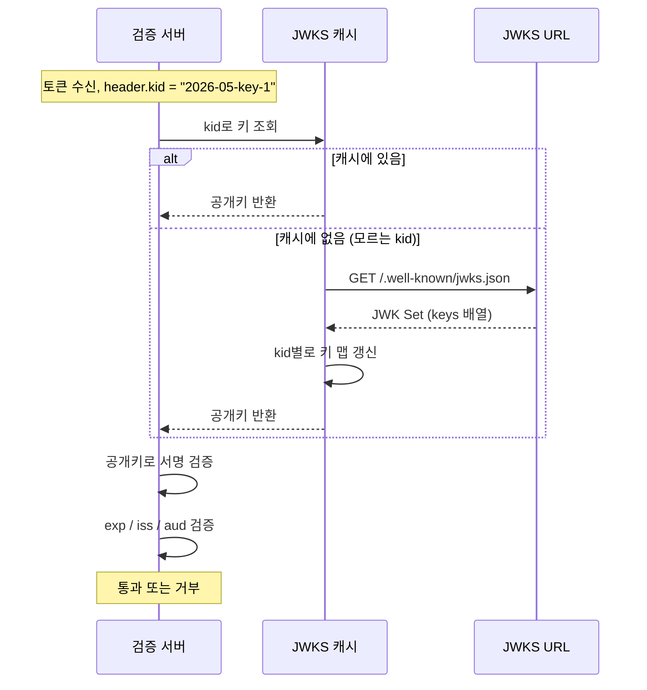
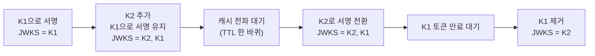

# JWKS URL (JWK Set Endpoint)

## JWKS URL이 뭔가

비대칭키로 서명한 JWT를 검증하려면 검증자가 발급자의 공개키를 알아야 한다. 대칭키(HS256)면 비밀키 하나를 양쪽이 공유하니까 문제가 단순한데, 비대칭키(RS256, ES256)는 발급자가 개인키로 서명하고 검증자가 공개키로 검증한다. 공개키를 검증자한테 어떻게 전달하느냐가 문제다.

공개키를 검증 서버 설정 파일에 하드코딩하면 키 회전 때마다 모든 검증 서버를 재배포해야 한다. 마이크로서비스가 수십 개면 지옥이다. 그래서 발급자(인가 서버, IdP)가 자기 공개키들을 HTTP로 노출하는 엔드포인트를 둔다. 이게 JWKS URL이다. 검증자는 부팅 때나 필요할 때 이 URL을 한 번 긁어서 공개키를 캐싱하고, 키가 바뀌면 다시 긁는다.

JWKS는 JSON Web Key Set의 약자다. 응답 본문이 JWK(JSON Web Key)들의 배열이라서 그렇게 부른다. URL 경로는 관례적으로 `/.well-known/jwks.json`을 쓰지만 강제는 아니다. 실제 경로는 OIDC Discovery 문서의 `jwks_uri` 필드에 적혀 있다.

```
검증 서버가 알아야 하는 것: "이 토큰을 서명한 공개키"
JWKS URL이 하는 일:        "내가 가진 공개키 목록을 여기 줄게, kid로 골라 써"
```

JWK Set의 포맷 자체는 RFC 7517(JWK), 검증에 쓰는 알고리즘 파라미터는 RFC 7518(JWA)에 정의돼 있다. OIDC를 쓰면 거의 자동으로 따라오는 구조다. Google, Auth0, Keycloak, AWS Cognito, Okta 전부 JWKS URL을 노출한다.

JWT 자체의 구조와 검증 절차는 [JWT.md](JWT.md)에서 다룬다. 여기서는 공개키를 어떻게 배포하고 검증자가 어떻게 가져다 쓰는지, 그 과정에서 생기는 캐싱·회전·보안 문제에 집중한다.

## JWKS 엔드포인트를 어디서 찾나

URL을 직접 입력받는 경우도 있지만, OIDC 환경에서는 Discovery로 알아낸다.

```bash
$ curl https://auth.example.com/.well-known/openid-configuration
```

```json
{
  "issuer": "https://auth.example.com",
  "authorization_endpoint": "https://auth.example.com/authorize",
  "token_endpoint": "https://auth.example.com/token",
  "jwks_uri": "https://auth.example.com/.well-known/jwks.json",
  "id_token_signing_alg_values_supported": ["RS256", "ES256"]
}
```

`jwks_uri`가 JWKS URL이다. 검증자 입장에서 issuer만 알면 Discovery로 `jwks_uri`를 알아내고, 거기서 공개키를 가져온다. 그래서 Spring이나 라이브러리 설정에 `issuer-uri`만 주면 나머지를 알아서 채우는 식이다. Discovery와 JWKS 흐름은 [OAuth2/OIDC Flows](../Backend/Authentication/O_Auth2_OIDC_Flows.md)에서 더 자세히 다룬다.

`jwks_uri`를 직접 본 적 없는 사람이 의외로 많다. 한번 긁어보면 구조가 한눈에 들어온다.

```bash
$ curl https://www.googleapis.com/oauth2/v3/certs | jq
```

Google은 `.well-known/jwks.json`이 아니라 `oauth2/v3/certs`를 쓴다. 경로는 발급자 마음이다. 절대 경로를 가정하지 말고 Discovery로 확인해야 한다.

## JWK와 JWK Set 구조

JWKS 응답은 `keys` 배열 하나로 되어 있다.

```json
{
  "keys": [
    {
      "kty": "RSA",
      "kid": "2026-05-key-1",
      "use": "sig",
      "alg": "RS256",
      "n": "0vx7agoebGcQSuuPiLJXZptN9nndrQmbXEps2aiAFbWhM78LhWx...",
      "e": "AQAB",
      "x5c": ["MIIDQjCCAiqgAwIBAgIGA...=="],
      "x5t": "dBjftJeZ4CVP-mB92K27uhbUJU1p1r_wW1gFWFOEjXk"
    },
    {
      "kty": "EC",
      "kid": "2026-05-ec-1",
      "use": "sig",
      "alg": "ES256",
      "crv": "P-256",
      "x": "f83OJ3D2xF1Bg8vub9tLe1gHMzV76e8Tus9uPHvRVEU",
      "y": "x_FEzRu9m36HLN_tue659LNpXW6pCyStikYjKIWI5a0"
    }
  ]
}
```

배열에 키가 여러 개 들어 있는 건 정상이다. 키 회전 중에는 현재 서명용 키와 직전 키가 같이 들어 있다. RSA 키와 EC 키가 섞여 있을 수도 있다. 검증자는 토큰 header의 `kid`로 맞는 키 하나를 골라 쓴다.

필드 하나씩 보자.

| 필드 | 의미 | 비고 |
|------|------|------|
| `kty` | 키 타입 (Key Type) | `RSA`, `EC`, `oct`. 검증에 필요한 다른 필드가 이 값에 따라 달라진다 |
| `kid` | 키 식별자 (Key ID) | 토큰 header의 `kid`와 매칭하는 값. 회전의 핵심 |
| `use` | 용도 (Public Key Use) | `sig`(서명 검증) 또는 `enc`(암호화). 서명 검증엔 `sig`만 써야 한다 |
| `alg` | 의도된 알고리즘 | `RS256`, `ES256` 등. 이 키로 어떤 알고리즘을 쓸지 명시 |
| `key_ops` | 허용 연산 | `verify`, `encrypt` 등. `use`와 비슷한 역할, 보통 둘 중 하나만 온다 |

`kty`에 따라 키 본체 필드가 다르다.

**RSA (`kty: RSA`)**

| 필드 | 의미 |
|------|------|
| `n` | 모듈러스 (modulus). Base64URL 인코딩된 큰 정수 |
| `e` | 공개 지수 (public exponent). 거의 항상 `AQAB`(65537) |

RSA 공개키는 `(n, e)` 쌍이다. JWKS의 `n`과 `e`를 디코딩해서 `RSAPublicKey`를 복원한다. PEM 형식이 아니라 raw 정수를 Base64URL로 담는다는 점이 처음 보면 헷갈린다.

**EC (`kty: EC`)**

| 필드 | 의미 |
|------|------|
| `crv` | 곡선 이름. `P-256`, `P-384`, `P-521` |
| `x`, `y` | 곡선 위 점의 좌표 |

ES256이면 `crv`가 `P-256`이다. `x`, `y`로 공개키 점을 복원한다.

**X.509 관련 (선택)**

| 필드 | 의미 |
|------|------|
| `x5c` | X.509 인증서 체인. Base64(DER) 문자열 배열. `[0]`이 리프 인증서 |
| `x5t` | 인증서의 SHA-1 지문 (thumbprint) |
| `x5t#S256` | 인증서의 SHA-256 지문 |

`x5c`가 있으면 인증서 안에 공개키가 들어 있으니 `n`/`e` 대신 인증서에서 키를 꺼낼 수도 있다. 다만 `x5c`와 `n`/`e`가 모두 있을 때 둘이 일치하는지는 별개 문제다. 보통은 `n`/`e`로 검증하고 `x5c`는 인증서 체인 검증이 필요한 환경에서만 쓴다. mTLS 클라이언트 인증서 바인딩 같은 곳에서 본다.

라이브러리를 쓰면 이 변환을 알아서 해준다. 직접 파싱할 일은 키 디버깅할 때 정도다. `n`/`e`만 보고 키가 맞는지 눈으로 확인하긴 어려우니, 의심되면 `kid`로 매칭부터 본다.

## 검증자가 공개키를 찾는 흐름

토큰을 받은 검증자가 하는 일은 정해져 있다. 토큰 header에서 `kid`를 꺼내고, JWKS에서 같은 `kid`를 가진 키를 찾고, 그 키로 서명을 검증한다.



순서를 강조한다. 토큰 header의 `kid`로 키를 고르되, header의 다른 값을 그대로 믿어선 안 된다. 특히 `alg`은 토큰이 시키는 대로 따르지 말고 검증자가 정한 화이트리스트와 비교만 해야 한다. 이게 깨지면 알고리즘 혼동 공격이 들어온다(아래 보안 절에서 다룬다).

`kid`가 없는 토큰도 있다. 키가 하나뿐인 발급자는 `kid`를 생략하기도 한다. 이 경우 검증자는 JWKS의 모든 키로 서명을 시도해본다. 키가 많으면 비효율적이라 발급자는 보통 `kid`를 넣는다.

## 캐싱 동작

JWKS를 매 토큰 검증마다 긁으면 안 된다. 검증은 초당 수천 번 일어날 수 있는데 그때마다 발급자 서버로 HTTP를 날리면 발급자가 죽는다. 공개키는 자주 안 바뀌니까 캐싱이 기본이다.

### 캐시 수명

HTTP 응답의 `Cache-Control` 헤더를 따른다.

```
Cache-Control: public, max-age=3600
```

`max-age=3600`이면 1시간 캐시하라는 뜻이다. 발급자가 이 값으로 "내 키는 최소 이만큼은 안 바뀐다"를 알려주는 셈이다. 라이브러리가 이 헤더를 읽어 캐시 TTL로 쓴다. 다만 라이브러리마다 헤더를 존중하는 정도가 다르다. 어떤 건 헤더 무시하고 자기 설정값(`cacheMaxAge`)만 쓴다. 그래서 클라이언트 설정의 캐시 시간을 직접 박아두는 경우가 많다.

### 모르는 kid가 오면 즉시 갱신

캐시만 하면 회전 직후 문제가 생긴다. 발급자가 새 키 `kid=K2`로 서명을 시작했는데 검증자 캐시엔 아직 `K1`만 있으면, `K2`로 서명된 토큰을 검증 못 한다. 캐시 TTL(1시간)이 끝날 때까지 멀쩡한 토큰이 전부 거부된다.

그래서 규칙이 하나 더 붙는다. **캐시에 없는 `kid`가 들어오면 TTL이 안 끝났어도 즉시 JWKS를 다시 긁는다.** 이러면 회전 직후에도 검증자가 새 키를 바로 받아온다.

### 가짜 kid 폭탄 DoS와 MIN_REFETCH_INTERVAL

"모르는 kid면 즉시 갱신"을 그대로 두면 공격 경로가 열린다. 공격자가 `kid`를 랜덤하게 바꾼 토큰을 초당 수천 개 던지면, 검증자는 매번 "모르는 kid다, 갱신해야지" 하면서 발급자 JWKS URL로 HTTP를 폭주시킨다. 검증자가 발급자를 상대로 DoS를 대신 쳐주는 꼴이다.

막는 방법은 갱신 자체에 최소 간격을 두는 것이다. 직전 갱신으로부터 N분이 안 지났으면 모르는 `kid`가 와도 갱신하지 않고 그냥 거부한다.

```java
public class JwksCache {
    private volatile Map<String, PublicKey> keysByKid = Map.of();
    private volatile long lastFetched = 0;
    private static final long MIN_REFETCH_INTERVAL_MS = 5 * 60 * 1000; // 5분

    public PublicKey getKey(String kid) {
        PublicKey key = keysByKid.get(kid);
        if (key != null) return key;

        // 모르는 kid다. 갱신을 시도하되 폭주는 막는다.
        long now = System.currentTimeMillis();
        if (now - lastFetched < MIN_REFETCH_INTERVAL_MS) {
            // 방금 갱신했는데도 없는 kid = 가짜일 가능성. 거부한다.
            throw new IllegalStateException("Unknown kid: " + kid);
        }

        synchronized (this) {
            if (keysByKid.containsKey(kid)) return keysByKid.get(kid);
            refetchJwks();
            lastFetched = System.currentTimeMillis();
        }

        key = keysByKid.get(kid);
        if (key == null) throw new IllegalStateException("Unknown kid: " + kid);
        return key;
    }

    private synchronized void refetchJwks() {
        // JWKS URL에서 keys 배열을 가져와 keysByKid를 갱신
    }
}
```

`MIN_REFETCH_INTERVAL`이 핵심이다. 정상 회전은 5분에 한 번 갱신으로 충분히 따라잡고, 가짜 `kid` 폭탄은 5분에 한 번 이상 발급자를 못 때린다. 이 값은 발급자의 회전 주기보다 짧고, 발급자가 견딜 수 있는 호출 빈도보다는 길게 잡는다. 보통 1~5분.

이 로직은 [OAuth2/OIDC Flows](../Backend/Authentication/O_Auth2_OIDC_Flows.md)의 JWKS 키 회전 절에도 같은 코드로 나온다. Spring Security `NimbusJwtDecoder`는 이걸 내장하고 있어서 직접 짤 일이 거의 없지만, 자체 검증 코드를 짜면 빠뜨리기 쉬운 부분이다.

## 키 회전과 캐시 동기화 충돌

운영에서 가장 자주 겪는 JWKS 문제다. "어제까지 멀쩡하던 토큰이 invalid signature로 거부된다"는 신고가 들어오면 십중팔구 회전과 캐시가 어긋난 거다.

### 왜 invalid signature가 나나

발급자가 키를 회전시키는 순간을 쪼개 보자.

```
T0       발급자: K1으로 서명. JWKS = [K1]
T0+10s   발급자: K2 추가, 아직 K1으로 서명. JWKS = [K2, K1]
T0+1h    발급자: K2로 서명 전환. JWKS = [K2, K1]
T0+2h    발급자: K1 제거. JWKS = [K2]
```

문제는 발급자가 K2 추가와 동시에 서명을 K2로 바꿔버리는 경우다. 검증자 캐시엔 아직 `[K1]`만 있는데 `kid=K2` 토큰이 들어온다. 검증자가 "모르는 kid 즉시 갱신" 로직이 없으면, 캐시 TTL이 끝날 때까지 K2 토큰을 전부 거부한다.

반대 방향도 있다. 발급자가 K1을 너무 빨리 제거하면, K1으로 서명돼 아직 만료 안 된 토큰들이 갑자기 검증 못 받는다. K1으로 서명된 토큰의 최대 수명(access token이면 보통 짧지만 ID token은 길 수 있다)만큼 K1을 JWKS에 남겨둬야 한다.

### 발급자 쪽 해결

회전 절차를 단계로 나눈다. 새 키를 JWKS에 먼저 노출하고, 검증자들이 캐시를 갱신할 시간(TTL 한 바퀴)을 준 뒤에 서명을 전환한다.



핵심은 두 가지다. 서명 전환 전에 새 키를 충분히 먼저 노출할 것, 옛 키는 그 키로 서명된 토큰이 다 만료된 뒤에 제거할 것. 이 절차를 안 지키고 키만 휙 바꾸면 그 순간 발급된 토큰들이 검증 구멍에 빠진다.

### 검증자 쪽 해결

발급자를 통제 못 하는 경우(외부 IdP)도 많다. 검증자가 방어해야 한다.

- 모르는 `kid`가 오면 즉시 갱신(위의 캐시 로직).
- 갱신은 `MIN_REFETCH_INTERVAL`로 제한.
- 갱신 실패 시 옛 캐시를 버리지 말 것. 발급자가 잠깐 죽었다고 캐시를 비우면 멀쩡한 토큰까지 다 거부된다.

마지막 항목을 자주 놓친다. JWKS fetch가 타임아웃 났을 때 캐시를 `null`로 만들어버리는 코드를 본 적 있다. 발급자 일시 장애가 검증자 전체 인증 장애로 번진다. 갱신은 실패해도 직전 캐시를 유지하고, 새 키만 못 받는 상태로 견디게 해야 한다.

## 클라이언트 구현

라이브러리마다 JWKS 캐싱·회전 대응이 어디까지 내장돼 있는지 알아야 한다. 직접 짜는 부분과 라이브러리가 해주는 부분을 헷갈리면 중복 구현하거나 빠뜨린다.

### Node.js — jose `createRemoteJWKSet`

`jose`는 표준 준수가 깔끔하다. `createRemoteJWKSet`이 캐싱, 모르는 kid 갱신, 쿨다운까지 다 한다.

```javascript
import { createRemoteJWKSet, jwtVerify } from 'jose';

const JWKS = createRemoteJWKSet(
  new URL('https://auth.example.com/.well-known/jwks.json'),
  {
    cacheMaxAge: 600000,       // 10분 캐시
    cooldownDuration: 30000,   // 모르는 kid 갱신 최소 간격 (DoS 방어)
    timeoutDuration: 5000,     // fetch 타임아웃
  }
);

async function verify(token) {
  const { payload } = await jwtVerify(token, JWKS, {
    issuer: 'https://auth.example.com',
    audience: 'api.example.com',
    algorithms: ['RS256'],     // 알고리즘 화이트리스트는 직접 명시
  });
  return payload;
}
```

`cooldownDuration`이 앞에서 말한 `MIN_REFETCH_INTERVAL`이다. `algorithms`는 직접 넣어야 한다. 안 넣으면 토큰 header의 `alg`을 따라가서 알고리즘 혼동에 노출된다.

### Node.js — jwks-rsa

`jsonwebtoken`과 같이 쓸 때의 조합이다. 오래된 코드베이스에 많다.

```javascript
const jwt = require('jsonwebtoken');
const jwksClient = require('jwks-rsa');

const client = jwksClient({
  jwksUri: 'https://auth.example.com/.well-known/jwks.json',
  cache: true,
  cacheMaxEntries: 5,
  cacheMaxAge: 600000,      // 10분
  rateLimit: true,
  jwksRequestsPerMinute: 10, // 분당 갱신 횟수 제한 (DoS 방어)
});

function getKey(header, callback) {
  client.getSigningKey(header.kid, (err, key) => {
    if (err) return callback(err);
    callback(null, key.getPublicKey());
  });
}

jwt.verify(token, getKey, {
  algorithms: ['RS256'],
  issuer: 'https://auth.example.com',
  audience: 'api.example.com',
}, (err, decoded) => {
  if (err) { /* 거부 */ }
});
```

`cache`, `rateLimit`을 둘 다 켜야 캐싱과 DoS 방어가 동작한다. `rateLimit`을 끄면 `jwks-rsa`가 모르는 kid마다 발급자를 때린다.

### Spring Security — NimbusJwtDecoder

Spring Boot 리소스 서버는 설정 한 줄이면 된다. `jwk-set-uri`나 `issuer-uri` 중 하나를 준다.

```yaml
spring:
  security:
    oauth2:
      resourceserver:
        jwt:
          # 직접 JWKS URL 지정
          jwk-set-uri: https://auth.example.com/.well-known/jwks.json
          # 또는 issuer만 주고 Discovery로 jwks_uri를 알아내게 함
          # issuer-uri: https://auth.example.com
```

`issuer-uri`를 주면 부팅 시 `${issuer-uri}/.well-known/openid-configuration`을 한 번 호출해 `jwks_uri`를 채운다. 이때 인가 서버가 다운돼 있으면 부팅이 실패하는 점은 주의한다.

코드로 직접 만들 때는 `NimbusJwtDecoder`를 빌더로 구성한다.

```java
@Bean
JwtDecoder jwtDecoder() {
    NimbusJwtDecoder decoder = NimbusJwtDecoder
        .withJwkSetUri("https://auth.example.com/.well-known/jwks.json")
        .jwsAlgorithm(SignatureAlgorithm.RS256)  // 알고리즘 화이트리스트
        .build();

    OAuth2TokenValidator<Jwt> validators = new DelegatingOAuth2TokenValidator<>(
        new JwtTimestampValidator(),                          // exp, nbf
        new JwtIssuerValidator("https://auth.example.com"),   // iss
        new JwtClaimValidator<List<String>>("aud",            // aud
            aud -> aud != null && aud.contains("api.example.com"))
    );
    decoder.setJwtValidator(validators);
    return decoder;
}
```

`NimbusJwtDecoder`는 JWKS 캐싱, 모르는 kid 갱신, 쿨다운을 내부적으로 처리한다. 회전 대응 코드를 직접 짤 필요가 없다. `jwsAlgorithm`으로 알고리즘을 고정하는 것과 `aud` 검증을 직접 거는 것만 챙기면 된다. `aud` 검증은 기본으로 안 들어가니 빠뜨리기 쉽다.

### Python — PyJWKClient

`PyJWT`에 `PyJWKClient`가 내장돼 있다.

```python
import jwt
from jwt import PyJWKClient

jwks_client = PyJWKClient(
    "https://auth.example.com/.well-known/jwks.json",
    cache_keys=True,
    max_cached_keys=16,
    lifespan=600,  # 캐시 수명(초)
)

def verify(token: str) -> dict:
    signing_key = jwks_client.get_signing_key_from_jwt(token)
    return jwt.decode(
        token,
        signing_key.key,
        algorithms=["RS256"],          # 알고리즘 화이트리스트
        issuer="https://auth.example.com",
        audience="api.example.com",
        options={"require": ["exp", "iss", "aud"]},
    )
```

`get_signing_key_from_jwt`이 토큰 header의 `kid`를 읽어 JWKS에서 키를 찾는다. `algorithms`는 여기서도 직접 명시한다. `options={"require": [...]}`로 필수 클레임을 강제하면 검증 누락을 줄인다.

`PyJWKClient`의 캐시 동작은 버전 의존성이 있다. 오래된 PyJWT는 모르는 kid 갱신이나 쿨다운이 약하다. 운영에 쓸 거면 버전을 확인하고, 필요하면 `PyJWKClient`를 감싸 쿨다운을 직접 붙인다.

## 보안 주의사항

JWKS 자체보다 JWKS를 잘못 쓰는 데서 사고가 난다.

### 토큰 안의 jku / x5u 헤더를 신뢰하지 마라

JWT header에는 `jku`(JWK Set URL)와 `x5u`(X.509 URL)를 넣을 수 있다. "이 토큰을 검증할 공개키는 이 URL에 있다"고 토큰이 직접 가리키는 필드다. 이걸 검증자가 그대로 따라가면 끝장난다.

```
정상 의도: {"alg":"RS256","kid":"2026-05-key-1"}
공격 헤더: {"alg":"RS256","jku":"https://evil.com/jwks.json"}
```

공격자가 자기 키페어를 만들어 자기 개인키로 서명하고, `jku`를 자기 서버로 가리킨다. 검증자가 `jku`를 따라가 공격자 공개키를 받아 검증하면, 공격자가 서명한 임의의 토큰이 전부 통과한다. 인증이 완전히 뚫린다.

방어는 단순하다. **`jku`, `x5u` 헤더를 아예 무시한다.** 공개키 출처는 토큰이 아니라 검증 서버 설정(`jwk-set-uri`)에서만 가져온다. 검증자가 신뢰하는 JWKS URL은 발급자별로 미리 고정돼 있어야 한다. 토큰이 출처를 정하게 두는 순간 끝이다.

부득이 `jku`를 써야 하는 환경이면 URL 화이트리스트를 강제한다. 호스트가 화이트리스트에 정확히 일치할 때만 허용하고, 그 외엔 거부한다. 이 공격의 상세 분석은 [보안 심화 및 취약점 분석](보안_심화_및_취약점_분석.md)의 jku/x5u 헤더 공격 절을 참고한다.

### alg=none, 알고리즘 혼동

JWKS로 RS256 공개키를 받아 검증하는 서버라도, 토큰 header의 `alg`을 그대로 믿으면 뚫린다.

`alg=none`을 허용하면 서명 없는 토큰이 통과한다. 알고리즘 혼동은 더 교묘하다. 공격자가 `alg`을 `RS256`에서 `HS256`으로 바꾸고, JWKS에 공개돼 있는 RSA 공개키를 HMAC 비밀키로 써서 서명한다. 검증자가 토큰의 `alg`을 따라 HMAC으로 검증하면, 공개키(누구나 아는 값)로 만든 서명이 통과한다.

JWKS는 공개키를 노출하는 구조라서 알고리즘 혼동에 특히 취약하다. 공개키가 곧 공격 재료가 된다. 방어는 검증자가 알고리즘을 화이트리스트로 고정하는 것이다. 위의 모든 클라이언트 예제에서 `algorithms`/`jwsAlgorithm`을 명시한 이유다. `alg=none`과 알고리즘 혼동의 메커니즘은 [JWT.md](JWT.md)의 검증 절차 절에서 자세히 다룬다.

### kid confusion

`kid`는 외부 입력이다. 이걸 키 조회에 쓰는 방식이 안전해야 한다. JWKS에서 받은 키 맵에서 `kid`로 조회하는 건 안전하지만, `kid`를 파일 경로나 SQL 쿼리에 직접 넣으면 경로 조작이나 인젝션이 된다.

```python
# 절대 하지 마라 — 경로 조작
key = open(f"/keys/{header['kid']}").read()
```

`kid=../../dev/null` 같은 값으로 빈 키를 읽게 만들고, 빈 키로 만든 HMAC 서명을 같이 보내면 통과한다. `kid`는 JWKS에서 받은 키 맵의 키로만 쓰고, 거기 없으면 거부한다. 그 외 용도로 `kid`를 신뢰하지 않는다.

### JWKS fetch 시 SSRF

검증자가 JWKS URL을 받아 HTTP를 날린다는 건, 그 URL을 외부가 통제할 수 있으면 SSRF가 된다는 뜻이다. `issuer-uri`나 `jwk-set-uri`를 사용자 입력이나 멀티테넌트 설정에서 동적으로 받는 구조면 특히 위험하다.

```
공격: issuer = http://169.254.169.254/latest/meta-data/
      → 검증자가 클라우드 메타데이터 엔드포인트로 요청을 날림
```

내부망 주소, 클라우드 메타데이터 IP(`169.254.169.254`), `localhost`로 검증자가 요청을 보내게 유도한다. 방어는 JWKS URL을 도메인 화이트리스트로 제한하는 것이다. 신뢰하는 발급자 호스트만 허용하고, fetch 전에 DNS 리바인딩을 막기 위해 resolve된 IP가 사설 대역인지도 본다. SSRF 일반 방어는 [SSRF.md](SSRF.md)를 참고한다.

멀티테넌트에서 테넌트마다 다른 IdP를 쓰는 구조면, 허용 issuer 목록을 설정으로 관리하고 그 안에서만 JWKS를 가져오게 해야 한다. 토큰의 `iss`를 그대로 믿고 거기서 Discovery를 돌리면 SSRF + jku 공격이 한 번에 들어온다.

### HTTPS 강제

JWKS URL은 반드시 HTTPS여야 한다. HTTP로 받으면 중간자가 공개키를 자기 것으로 바꿔치기할 수 있다. 그러면 jku 공격과 같은 결과가 된다. 라이브러리가 HTTP URL을 거부하는지 확인하고, 인증서 검증을 끄는 옵션(개발 편의로 넣은)이 운영에 남아 있지 않은지 본다.

## 자체 검증 코드에서 흔히 빠뜨리는 부분

검증 라이브러리를 안 쓰고 직접 짜야 하는 상황이 가끔 있다. 그때 빠뜨리는 것들이 거의 정해져 있다.

- **알고리즘 화이트리스트.** 토큰 `alg`을 따라가면 알고리즘 혼동에 뚫린다. 검증자가 허용 알고리즘을 고정한다.
- **모르는 kid 즉시 갱신.** 이게 없으면 회전 직후 멀쩡한 토큰이 캐시 TTL 동안 전부 거부된다.
- **갱신 쿨다운(MIN_REFETCH_INTERVAL).** 이게 없으면 가짜 kid 폭탄으로 발급자를 DoS 친다.
- **갱신 실패 시 기존 캐시 유지.** fetch 실패에 캐시를 비우면 발급자 일시 장애가 검증자 전체 인증 장애가 된다.
- **`use: sig` 확인.** `use`가 `enc`인 키로 서명 검증을 하면 안 된다. JWKS에 암호화용 키가 섞여 있을 때 `sig`만 골라 써야 한다.
- **iss / aud / exp 검증.** 서명만 맞으면 통과시키는 코드를 의외로 많이 본다. 서명은 "위조 안 됐다"만 보장한다. 누가 발급했고(`iss`) 누구를 위한 것이고(`aud`) 아직 유효한지(`exp`)는 별도로 봐야 한다.
- **HTTP 타임아웃.** JWKS fetch에 타임아웃이 없으면 발급자가 느려질 때 검증 스레드가 묶인다.

직접 짜는 게 정말 필요한 게 아니면 `jose`, `NimbusJwtDecoder`, `PyJWKClient`를 쓰는 게 낫다. 위 항목 대부분이 이미 들어 있다.

## 운영 트러블슈팅

실제로 마주치는 증상별로 정리한다.

**"어제까지 되던 토큰이 invalid signature"**

키 회전 직후일 가능성이 높다. 토큰의 `kid`(jwt.io나 `jwt decode`로 확인)와 JWKS의 `kid`들을 대조한다. 토큰 `kid`가 JWKS에 없으면, 검증자 캐시가 오래된 것이다. 캐시 TTL과 "모르는 kid 갱신" 로직이 동작하는지 본다. JWKS URL을 직접 `curl`해서 새 `kid`가 노출됐는지도 확인한다.

**"가끔씩만 invalid signature, 재시도하면 됨"**

회전 과도기에 두 키가 공존하는데 일부 검증 인스턴스만 캐시가 갱신된 상태다. 로드밸런서 뒤 인스턴스마다 캐시가 따로라 그렇다. 모든 인스턴스가 모르는 kid 갱신을 하도록 보장하면 줄어든다.

**"검증 서버가 부팅 안 됨"**

`issuer-uri`로 부팅 시 Discovery를 호출하는데 인가 서버가 다운된 경우다. 인가 서버 헬스부터 확인한다. 구조적으로는 `jwk-set-uri`를 직접 주거나 Discovery를 lazy하게 만들어 부팅 의존성을 끊는다.

**"발급자 JWKS URL 호출이 비정상적으로 많음"**

검증자 갱신 쿨다운이 없거나 캐시가 안 켜진 경우다. 가짜 kid 폭탄 공격일 수도 있다. 검증자 로그에서 모르는 kid 빈도를 보고, 정상 회전 빈도를 한참 넘으면 공격을 의심한다. `rateLimit`/`cooldown` 설정을 확인한다.

**"JWKS는 200인데 검증이 안 됨"**

JWKS 응답은 정상인데 검증이 실패하면, 알고리즘 불일치나 `aud`/`iss` 검증에서 막히는 경우가 많다. `curl`로 받은 JWKS의 `alg`과 검증자 화이트리스트가 같은지, 토큰의 `iss`/`aud`가 검증자 기대값과 같은지 본다. 환경(dev/stage/prod)마다 issuer가 달라서 깨지는 일이 흔하다.

**"외부 IdP 키가 갑자기 사라짐"**

Google, Auth0 같은 외부 IdP는 통보 없이 키를 회전하고 옛 키를 제거한다. 옛 키로 서명된 토큰을 오래 들고 있으면 검증 못 한다. access token 수명을 IdP 회전 주기보다 짧게 잡고, 모르는 kid 갱신을 켜둔다.

## 관련 문서

- [JWT.md](JWT.md) — JWT 구조, 서명 알고리즘, 검증 절차, alg=none/알고리즘 혼동/kid 조작 공격
- [OAuth2/OIDC Flows](../Backend/Authentication/O_Auth2_OIDC_Flows.md) — Discovery, jwks_uri, JWKS 키 회전, NimbusJwtDecoder 설정
- [보안 심화 및 취약점 분석](보안_심화_및_취약점_분석.md) — jku/x5u 헤더 공격 상세 분석
- [SSRF.md](SSRF.md) — JWKS fetch 시 SSRF 방어, 도메인 화이트리스트
- [OAuth.md](OAuth.md) — OAuth 2.0 기본 개념
