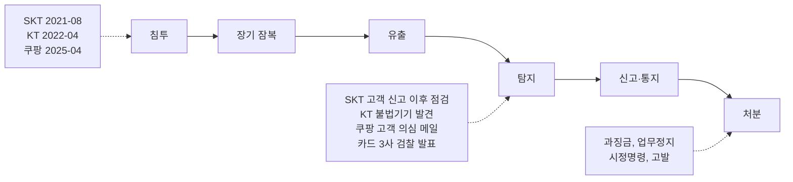
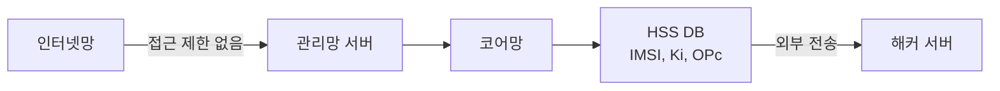
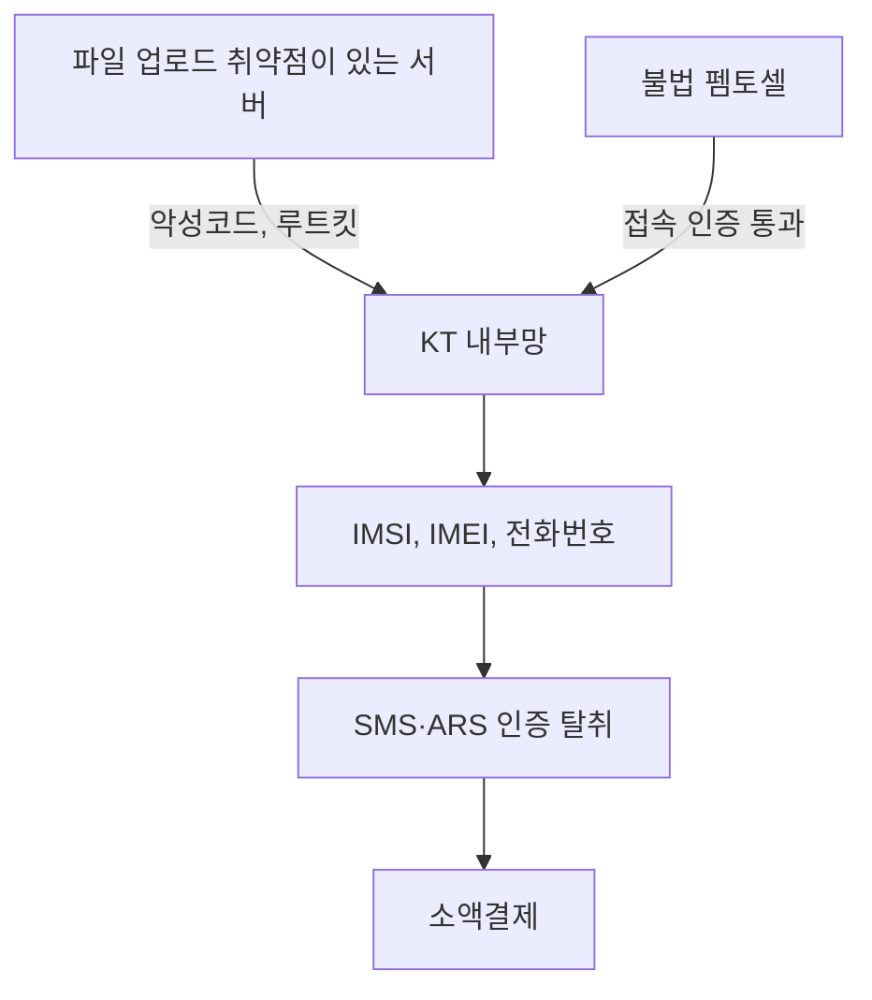
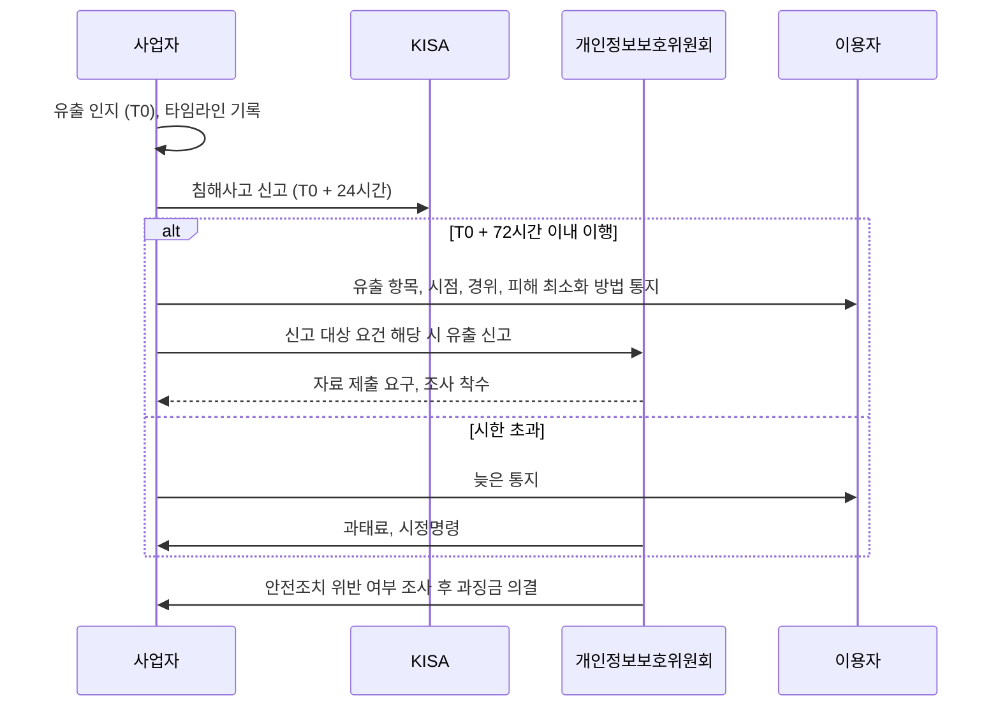
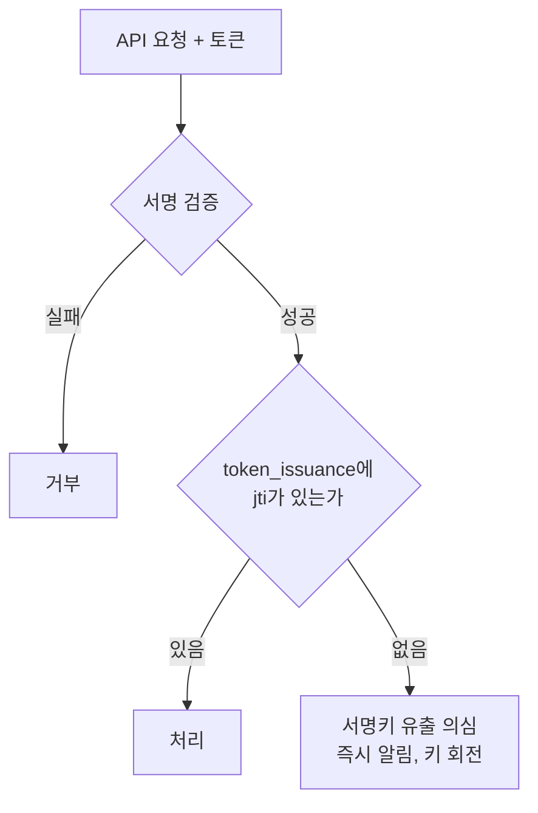

# 국내 개인정보 유출 사고 사례 분석

2014년 카드 3사, 2025년 SK텔레콤과 롯데카드, KT, 쿠팡. 12년 간격의 사고인데 정부 발표문을 나란히 놓으면 지적 사항이 거의 같다. 접속기록이 짧게 남거나 아예 없었고, 내부 계정 하나로 갈 수 있는 범위가 넓었고, 핵심 값이 평문이었다. 새 취약점이 뚫린 사고보다 몇 년째 알려진 기본 항목이 비어 있던 사고가 대부분이다.

이 문서는 공개된 정부 조사 결과와 규제기관 처분문에 있는 내용만 쓴다. 보도 기사로만 확인한 수치는 본문에 기사임을 적었고, 확인하지 못한 수치와 원인은 뺐다. 사고마다 기관이 집계한 수치가 다른 경우가 있어서(KT 유출 인원이 대표적이다) 어느 기관의 숫자인지를 같이 적었다. SKT·KT·쿠팡의 침투 경로와 당일 점검 항목은 [최근 보안사고 사례 2021~2025](Recent_Security_Incidents.md)에 있다. 여기서는 처분 결과, 탐지까지 걸린 시간, 서버 코드에서 무엇이 비어 있었는지를 다룬다. 신고 실무는 [보안 사고 대응 절차](Incident_Response.md), 암호화·마스킹 구현은 [PII 데이터 보호](PII_Data_Protection.md)에 따로 있다.

## 사고 흐름과 탐지까지 걸린 시간

다섯 사고를 한 줄로 그리면 단계가 같다. 차이는 잠복 구간의 길이와, 탐지가 내부에서 왔는지 바깥에서 왔는지다.



점선 박스가 사고별로 다른 부분이다. 탐지 칸이 전부 외부 신호라는 점을 보면 된다. 고객 문의, 불법기기 발견, 수사 발표가 계기였고 내부 모니터링이 먼저 잡은 사고는 이 목록에 없다.

| 사고 | 최초 침투(또는 유출 시작) | 사고를 알게 된 시점 | 걸린 기간 | 알게 된 계기 |
|---|---|---|---|---|
| SKT | 2021-08-06 | 2025-04-19 유출 인지 | 약 3년 8개월 | HSS DB 데이터 외부 전송 확인 |
| KT | 2022-04-02 서버 취약점 악용 시작 | 2025-09-08 | 약 3년 5개월 | 불법 기기의 내부망 접속 발견 후 신고 |
| 쿠팡 | 2025-04-14 집중 조회 시작 (사전 테스트는 1월경) | 2025-11-16 | 약 7개월 | 고객이 보낸 의심 이메일 접수 |
| 롯데카드 | 2025-08-14 | 2025-09-01 신고 | 18일 | 정부 발표문에 인지 경위는 없음 |
| 카드 3사 | NH 2012-10, KB 2013-06, 롯데 2013-12 | 2014-01-08 검찰 발표 | 최장 약 1년 3개월 | 검찰 수사 |

기간은 표의 두 날짜 사이를 단순 계산한 값이다. KT의 3년 5개월은 조사단이 확인한 "최초 악용 시작"부터 센 것이고, 개인정보위는 펨토셀을 거친 유출이 약 11개월 이어지는 동안 KT가 알아채지 못했다고 별도로 판단했다. 같은 사고라도 어디서부터 세느냐에 따라 숫자가 달라진다.

롯데카드는 유독 짧다. 침해 기간이 8월 14~27일로 2주였고 9월 1일에 신고했다. 짧았다고 가벼운 사고는 아니다. 그 2주에 약 200GB가 나갔다. 잠복이 길면 늦게 안 것이 문제고, 잠복이 짧으면 2주 만에 그만큼 가져갈 수 있었던 것이 문제다.

## SK텔레콤

2025년 4월 서버 침해가 확인된 사고다. 조사단은 2021년 8월 6일 외부 접근이 가능한 서버로 첫 침투가 있었다고 밝혔다. 개인정보위 처분문 기준으로 유출된 것은 LTE·5G 이용자 23,244,649명(알뜰폰 포함, 중복 제거)의 휴대전화번호, 가입자식별번호(IMSI), 유심 인증키(Ki, OPc) 등 25종이다. 조사단이 센 약 2,696만 건과 개인정보위의 이용자 수는 단위가 다르다. 전자는 가입자 식별번호 건수이고 후자는 중복을 제거한 사람 수다. 조사단 최종 결과는 [과기정통부 발표](https://www.korea.kr/news/policyNewsView.do?newsId=156721622), 처분 내용은 [개인정보위 보도자료](https://www.korea.kr/briefing/pressReleaseView.do?newsId=156733808)에 있다.

개인정보위가 안전조치 위반으로 본 것은 망 구성이다. 인터넷망, 관리망, 코어망, 사내망이 같은 네트워크로 이어져 있었고 인터넷망에서 내부 관리망 서버로 가는 접근을 제한하지 않았다. 그래서 해커가 인터넷망에서 HSS(가입자 정보를 가진 핵심 설비)까지 곧바로 들어갔다.



그림에서 화살표마다 방화벽 규칙 한 줄이 비어 있었다는 이야기다. 보도에 따르면 이 밖에 지적된 항목은 서버 2,365대의 ID 정보를 암호 설정 없이 저장한 것, 침입탐지 시스템이 낸 이상행위 로그를 확인하지 않은 것, 2017년에 나온 리눅스 커널 취약점(DirtyCow) 패치를 하지 않은 것이다([머니투데이](https://www.mt.co.kr/tech/2025/08/29/2025082818041164473)). 처분문에는 유심 인증키 Ki 26,144,363건을 암호화하지 않고 평문으로 저장했다는 내용이 있다. 서버 개발자 입장에서 가장 아픈 줄이다. 침투를 못 막은 것과 별개로, 침투 후 가져간 값이 그대로 쓸 수 있는 값이었다.

통지 시점도 처분 사유다. SKT는 2025년 4월 19일경 HSS DB 데이터가 외부로 전송된 사실을 확인했지만 법정 72시간 안에 이용자에게 통지하지 않았다. 5월 9일에 유출 "가능성"을 통지했고, "확정" 통지는 7월 28일에 했다. 개인정보위는 과징금 1,347억 9,100만 원과 과태료 960만 원을 부과했다. 과징금은 유출 건에 대한 것이고 과태료 960만 원은 통지 지연에 대한 것이다. 보도에 나온 산정 근거로는 2022~2024년 별도 기준 평균 매출 12조 5,926억 원의 3%를 상한으로 보면 3,778억 원이고, 부과액은 그 약 36%다. SKT는 이후 과징금 취소 소송을 냈다([보안뉴스](https://m.boannews.com/html/detail.html?idx=141569)).

## KT 무단 소액결제

불법 펨토셀(가정·사무실용 초소형 기지국)이 KT 내부망에 붙어 이용자 정보를 빼냈고, 그 정보로 SMS·ARS 인증을 가로채 소액결제가 이뤄진 사고다. 경로가 두 갈래라 헷갈리기 쉽다. 조사단은 서버의 파일 업로드 취약점을 악용한 침투가 2022년 4월 2일부터 2024년 4월 19일까지 있었다고 봤고, 94대 서버에서 악성코드 103종을 확인했다. 루트킷 등은 2023년 3월 11일부터 2025년 7월 4일까지 활동한 흔적이 있다. KT가 불법 기기의 내부망 접속을 발견해 신고한 것은 2025년 9월 8일이다([조사결과 브리핑](https://www.korea.kr/briefing/policyBriefingView.do?newsId=156737260)).



개인정보위는 2026년 7월 29일 과징금 539억 7,900만 원을 의결했다. 안전조치 위반으로 본 것은 펨토셀 쪽이다. 내부망에서 펨토셀이 접속할 때 타사나 해외 IP 같은 비정상 IP를 막지 않았고, 제품 고유번호와 설치 지역 정보가 KT망에 등록된 값인지 검증하지 않았다. 기본적인 접근통제 관리를 소홀히 해서 인가받지 않은 펨토셀이 내부망에 쉽게 붙을 수 있었다는 판단이다. 유출 인원은 개인정보위가 16,647명(알뜰폰 포함), 조사단이 22,227명으로 발표했고, 차이는 법인·다중회선 중복을 제외한 데서 나온다. 368명이 약 2억 4천만 원의 소액결제 피해를 입었다.

처분에서 눈에 띄는 것은 조사 방해다. 개인정보위는 거짓 자료 제출과 침해 서버 로그 삭제를 조사 방해로 보고 고발하기로 했고, 2024년 3월 악성코드 감염 건은 네트워크 로그가 없어 사실관계 확인에 한계가 있다며 별도 처분하기로 했다([아시아경제](https://view.asiae.co.kr/article/2026073012065998189)). 조사단 결과에도 시스템 로그 보관 기간이 1~2개월에 불과해 상세한 원인 파악에 한계가 있었다고 적혀 있다. 2년 넘게 이어진 침해를 2개월치 로그로 복원할 수는 없다.

## 롯데카드

2025년 9월 1일 금융당국에 신고된 사고다. 합동 브리핑에 따르면 미상의 해커가 롯데카드의 온라인 결제 서버(WAS)에 침입해 8월 14일부터 27일 사이 약 200GB를 유출했다. 당초 신고는 1.7GB였는데 금감원·금보원 조사에서 200GB로 늘었다. 개인신용정보 약 297만 명분이고, 이 가운데 약 28만 3천 명(9.5%)은 카드 비밀번호와 CVC까지 유출됐다([금융위·과기정통부 합동 브리핑](https://fsc.go.kr/no010103/85368), [정책뉴스](https://www.korea.kr/news/policyNewsView.do?newsId=148949573)).

이 사고의 처분은 두 갈래다. 개인정보위는 2026년 3월 과징금 96억 2,000만 원과 과태료 480만 원을 의결하면서 주민등록번호 처리를 문제 삼았다. 법적 근거 없이 주민등록번호를 처리했고, 충분한 암호화를 적용하지 않았으며, 로그에 주민등록번호를 포함한 개인정보를 평문으로 기록했다. 주민등록번호 유출 인원은 약 45만 명이다. 시정명령은 전반적인 개인정보 처리 현황 점검과 개인정보 보호책임자(CPO)의 책임·독립성 강화다([개인정보위 보도자료](https://www.pipc.go.kr/np/cop/bbs/selectBoardArticle.do?bbsId=BS074&mCode=C020010000&nttId=11878)). 금융당국은 2026년 7월 말 업무정지 1.5개월의 중징계를 확정했다고 보도됐다([네이트뉴스](https://m.news.nate.com/view/20260731n26025)). 업무정지의 구체적 범위는 확인한 자료에 없어서 쓰지 않았다.

로그에 주민등록번호를 평문으로 남긴 줄이 서버 개발자에게 가장 직접적이다. DB 컬럼은 암호화해 놓고 디버그 로그와 요청 덤프에서 평문이 새는 경우는 흔하다. 암호화를 DB에만 걸면 저장 위치 하나만 막은 것이다.

## 쿠팡

2025년 11월 사고로, 조사단은 공격자가 2025년 4월 14일부터 11월 8일까지 IP 2,313개를 써서 배송지 목록을 148,056,502회 조회했다고 밝혔다. 서명키를 재직 중 관리하던 전직 직원이 그 키를 탈취해 전자 출입증(인증 토큰)을 위·변조했다. 쿠팡이 인지한 것은 11월 16일 고객이 보낸 의심 이메일을 접수하면서다. KISA에는 11월 19일 21시 35분에 신고했고, 조사단은 이를 법정 시한(24시간)을 넘긴 것으로 보고 3,000만 원 이하 과태료를 예고했다([조사단 결과](https://www.korea.kr/briefing/policyBriefingView.do?newsId=156744092)).

조사단이 지적한 미흡 사항이 개발 쪽 용어로 되어 있다. 위·변조된 전자 출입증을 검증하는 체계가 없었고, 서명키가 개발자 노트북에 저장돼 있었고 키 이력 관리가 없었다. ISMS-P 항목으로는 직무 분리와 암호 정책이 부족했고, 비정상 접속 탐지에 실패했으며 로그 저장 기준이 서로 달랐다. 로그 쪽 사실도 있다. 조사단 결과에는 웹 접속기록 약 5개월분(2024년 7월~11월)이 삭제됐다는 내용과 자료보전 명령 위반으로 수사를 의뢰했다는 내용이 함께 있다.

개인정보위는 2026년 6월 쿠팡에 과징금 6,246억 8,100만 원과 과태료 1,680만 원을 의결했다(쿠팡풀필먼트서비스 과징금 2억 4,800만 원 별도). 개인정보 약 3,755만 명 유출이 확인됐고, 인증 서명키 관리와 접근통제 소홀 같은 기본적인 안전관리 체계 미흡이 사유다. 유출통지·파기 의무, CPO 독립성 보장 위반과 조사 방해도 추가로 인정됐다. 회원이 아닌 정보주체(배송지에 적힌 가족·지인)에 대한 유출 통지를 하지 않았고, 배송지 관리 페이지에서 추가 확인된 약 16만 명에 대한 통지를 늦춘 것도 포함된다. 쿠팡에서 타사 웹·앱에 접속한 약 1,117만 명의 온라인 활동기록을 무단 수집해 DB에 저장한 건도 같은 처분에 들어 있어서, 과징금이 모두 유출 건의 몫은 아니다. 시정명령은 안전조치 강화, 비회원 정보주체 통지, CPO의 실질적 역할 보장이고 이행 기한은 3개월이다([개인정보위 처분 정책뉴스](https://www.korea.kr/news/policyNewsView.do?newsId=148966578)).

## 2014년 카드 3사

사고 시점은 지금보다 훨씬 오래됐지만 구조가 가장 알기 쉽다. 신용평가사 KCB의 차장이 카드 3사에 파견돼 부정사용방지시스템(FDS) 개발 프로젝트 책임을 맡았고, 카드사 전산망에 접근해 개인정보를 USB에 복사해 빼냈다. 유출은 NH농협카드 2012년 10~12월, KB국민카드 2013년 6월, 롯데카드 2013년 12월에 일어났다. 규모는 KB국민 5,300만, 롯데 2,600만, NH농협 2,500만으로 합계 1억 400만이고, 이름·휴대전화번호·직장명·주소·카드 사용 정보가 나갔다. 검찰 발표는 2014년 1월 8일이다([서울신문](https://www.seoul.co.kr/news/society/law/2014/01/08/20140108500034)).

처분은 금융위원회가 카드 3사에 3개월 일부 업무정지(2014년 2월 17일~5월 16일)를 내렸다([정책뉴스](https://www.korea.kr/news/policyNewsView.do?newsId=148774089)). KCB에는 임직원 보안교육 소홀과 전산통제 부적정을 이유로 3개월 업무정지를 내렸고 서울행정법원이 이를 정당하다고 판단했다([YTN](https://www.ytn.co.kr/_ln/0103_201512271434356526)). 형사에서는 직원이 징역 3년이 확정됐고 법인 벌금은 농협은행·KB국민카드 각 1,500만 원, 롯데카드 1,000만 원이었다. 판결은 직원이 은행에서 아무런 관리·감독을 받지 않고 USB에 수시로 개인정보를 담았다는 점을 짚었다([한국일보](https://www.hankookilbo.com/news/article/201607151693114624)). 외부 공격이 아니라 권한을 받은 파견 직원이었다는 점이 2025년의 쿠팡(전직 직원의 서명키)과 겹친다.

## 신고와 통지 72시간

사고 인지 후 시계는 둘이 돈다. 정보통신망법의 침해사고 신고는 KISA에 24시간 안에 하는 것이 실무 기준이고(쿠팡 사례에서 조사단이 24시간 초과를 지적했다), 개인정보보호법의 유출 통지는 인지 후 72시간 안이다. SKT 처분문도 "법령에서 정한 72시간 내" 통지 의무를 기준으로 삼았다. 신고 대상 요건과 신고서 항목은 [보안 사고 대응 절차](Incident_Response.md)의 KISA 신고 절에 정리돼 있어서 여기서는 주체별 순서만 본다.



세 가지가 실제 처분에서 걸렸다. 첫째, 시계는 사고 확정이 아니라 인지에서 시작한다. SKT는 4월 19일 인지하고 5월 9일에 "가능성" 통지를 했는데 개인정보위는 이를 지연으로 봤다. 둘째, 통지 대상은 회원만이 아니다. 쿠팡은 배송지 목록에 이름·전화번호·주소가 들어 있던 비회원(가족, 지인)에게 통지하지 않은 것이 위반으로 확인됐다. 셋째, 개정안에는 유출 가능성 단계부터 지체 없이 통지하도록 하는 내용이 들어 있다. 확정될 때까지 기다리는 방식은 앞으로 더 불리해진다.

## 과징금 기준과 ISMS-P 의무가 달라진다

위 처분들은 모두 2026년 9월 11일 개정 개인정보보호법 시행 전에 의결됐다. 개정 전 상한은 전체 매출액의 3%이고 SKT 계산이 그 예다. 개정으로 특정 요건에서는 10%까지 올라간다. ISMS-P는 시행령 개정안이 입법예고 중이라 최종 문안과 시기는 고시 확정본을 다시 확인해야 한다.

| 항목 | 개정 전 | 개정 후 |
|---|---|---|
| 과징금 상한 | 전체 매출액의 3%(SKT 처분 계산 기준 3,778억 원) | 일반은 3%, 특례 요건에서 전체 매출액의 최대 10% |
| 특례 요건 | 없음 | 고의·중과실로 3년 내 위반 반복, 1,000만 명 이상 대규모 피해, 시정명령 불이행 후 유출 |
| 감경 | 사후 시정, 피해 회복 노력 등 | 정보보호 사전 투자 시 기준금액의 40% 범위 감경 |
| 규모 기준 참고 | SKT 2,324만 명, 쿠팡 약 3,755만 명 | 위 두 건 모두 1,000만 명을 넘는 규모 |
| ISMS 인증 의무 | 정보통신서비스 매출 100억 원 이상이면서 일평균 이용자 100만 명 이상 등([ISMS 문서](ISMS.md) 참고) | 입법예고안: 이동통신사업자, 본인확인기관, 고시로 정한 공공시스템운영기관, 전년도 매출 1조 원 이상이면서 정보통신서비스 부문 매출 100억 원 이상인 사업자는 2028-12-31까지 ISMS-P 취득 |
| 심사 방식 | 서면 중심 | 현장 중심, 모의침투 등 기술심사 강화, 상시 점검(보도 기준 심사팀 5명·7일에서 10명·12일, 점검 자산 최대 500대) |
| 정보보호 공시 | 해당 없음 | 2027년부터 모든 상장사 공시 |

과징금 근거는 [정책뉴스](https://www.korea.kr/news/policyNewsView.do?newsId=148971656), ISMS-P는 [보안뉴스](https://www.boannews.com/news/articleView.html?idxno=143105)와 [한국데이터경제신문](https://www.dataeconomy.co.kr/news/articleView.html?idxno=42892) 보도를 봤다. 두 매체의 인증 취득 기한 기사는 2028년 12월 31일로 일치했지만 일평균 저장 인원 같은 세부 조건은 기사마다 달라서 표에는 공통된 것만 넣었다. 서비스가 이 기준에 걸리는지는 개인정보위 입법예고 원문으로 확인해야 한다.

## 서버 코드에서 비어 있던 곳

공개된 지적 사항을 서버 개발자가 손댈 수 있는 네 영역으로 나눠 사고별로 채웠다. 칸이 비어 있는 곳은 확인한 자료에 해당 지적이 없다는 뜻이지 문제가 없었다는 뜻이 아니다.

| 사고 | 로그 보관·점검 | 접근통제 | 암호화 | 내부 계정·권한 |
|---|---|---|---|---|
| SKT | 침입탐지 이상행위 로그 미확인(보도) | 인터넷망에서 HSS까지 제한 없음 | Ki 26,144,363건 평문 | 서버 2,365대 ID 정보 암호 없이 저장(보도) |
| KT | 시스템 로그 1~2개월, 침해 서버 로그 삭제 고발 | 펨토셀 비정상 IP 미차단, 형상정보 미검증 | | |
| 롯데카드 | | 온라인 결제 서버(WAS) 침입, 웹서버 관리 미흡 | 주민등록번호 암호화 미흡, 로그에 평문 기록 | |
| 쿠팡 | 웹 접속기록 약 5개월분 삭제, 로그 저장 기준 불일치 | 서명키 접근통제 소홀, 위조 토큰 검증 없음 | | 서명키가 개발자 노트북에, 직무 분리 미흡 |
| 카드 3사 | | | | 파견 직원이 USB로 반출, 관리·감독 없음 |

### 접근 기록 스키마

KT와 쿠팡은 로그가 있었어도 쓸 수 없는 상태였다. 보관 기간이 1~2개월이거나 기준이 서비스마다 달랐고, 한 줄이 몇 명분의 정보를 건드렸는지 알 수 없는 형태였다. 법적 기준으로 개인정보보호법 시행령 제30조와 안전성 확보조치 기준(고시)은 접속기록을 1년 이상 보관하게 하고, 정보주체 5만 명 이상이거나 고유식별정보·민감정보를 처리하는 시스템은 2년 이상으로 늘린다. 고시 개정이 잦아서 적용 전에 최신본을 확인해야 한다. 기본 보관은 이 기준에 맞추더라도 침해가 2년 넘게 이어진 SKT·KT를 보면 침해 의심 구간의 로그는 별도로 길게 잡아 두는 쪽이 낫다.

한 줄이 몇 명분을 건드렸는지 남기는 것이 스키마의 핵심이다. 쿠팡의 배송지 목록 API는 호출 한 번에 수십 건을 돌려준다. 로그가 "호출 1건"이라고만 남으면 148,056,502회 조회가 얼마나 많은 정보주체에 해당하는지 계산할 수 없다.

```sql
create table audit_access_log (
    id            uuid        not null default gen_random_uuid(),
    occurred_at   timestamptz not null default now(),
    actor_id      text        not null,
    actor_type    text        not null check (actor_type in ('employee','service','partner','token')),
    token_jti     text,
    session_id    text,
    source_ip     inet        not null,
    action        text        not null check (action in ('read','export','update','delete','login')),
    resource      text        not null,
    purpose       text,
    subject_count integer     not null default 1,
    result        text        not null check (result in ('ok','denied','error')),
    request_id    text        not null,
    primary key (id, occurred_at)
) partition by range (occurred_at);

create table audit_access_log_2026_10 partition of audit_access_log
    for values from ('2026-10-01') to ('2026-11-01');

create index on audit_access_log (actor_id, occurred_at);
create index on audit_access_log (resource, occurred_at);

revoke all on audit_access_log from app_rw;
grant insert on audit_access_log to app_rw;
```

`subject_count`는 응답에 담긴 정보주체 수다. `token_jti`는 요청에 쓰인 토큰의 ID이고 뒤의 위조 토큰 탐지에서 쓴다. `purpose`는 직원 계정이 조회할 때 티켓 번호나 사유를 받는 칸이다. 애플리케이션 계정에는 INSERT만 주어서 침투 후 자기 흔적을 지울 수 없게 한다. 단 슈퍼유저와 파티션 소유자는 여전히 지울 수 있어서 DB 밖(별도 계정의 스토리지, WORM)으로 즉시 보내는 구성이 따로 필요하다. 그 방법은 [보안 로깅과 감사](Security_Logging_and_Auditing.md)의 로그 무결성 절에 있다.

### 대량 조회 알림 쿼리

SKT와 쿠팡의 공통점은 정상 계정이나 정상 서명이 붙은 요청으로 평소의 수백, 수천 배를 읽어 갔다는 것이다. 인증 성공 여부로는 못 잡고 총량으로만 잡힌다. 첫 쿼리는 계정별 시간당 조회 인원을 그 계정의 평소 값과 비교한다.

```sql
with hourly as (
    select actor_id,
           date_trunc('hour', occurred_at) as hr,
           sum(subject_count)              as n,
           count(distinct source_ip)       as ips
    from audit_access_log
    where resource = 'delivery_address'
      and action in ('read', 'export')
      and result = 'ok'
      and occurred_at >= now() - interval '15 days'
    group by 1, 2
),
baseline as (
    select actor_id,
           avg(n)                                           as mu,
           percentile_cont(0.99) within group (order by n)  as p99
    from hourly
    where hr < now() - interval '1 day'
    group by 1
)
select h.actor_id, h.hr, h.n, h.ips, round(b.mu) as baseline_avg
from hourly h
left join baseline b on b.actor_id = h.actor_id
where h.hr >= now() - interval '1 day'
  and h.n > greatest(coalesce(b.p99 * 3, 0), 1000)
order by h.n desc;
```

`left join`과 `coalesce`가 중요하다. `inner join`으로 쓰면 평소 기록이 없는 새 계정이 걸러져서, 오늘 만든 계정이나 토큰으로 한 번에 덤프하는 경우를 놓친다. 위 구조를 sqlite로 줄여 새 계정이 5,000건을 읽는 경우와 평소 30건이던 계정이 9,000건을 읽는 경우 둘 다 걸리는 것을 확인했다. `1000`은 시작값이라 서비스의 정상 최대치를 보고 정해야 한다. 바닥값이 낮으면 알림이 쏟아져서 아무도 보지 않게 된다.

이 쿼리로 못 잡는 경우가 쿠팡이다. 공격자가 IP 2,313개로 나눴으니 IP별, 계정별 총량은 평소와 다를 게 없다. 이럴 때는 요청의 양이 아니라 요청의 출처를 본다. 토큰을 발급하는 서버가 `jti`를 기록해 두고, 호출된 API 쪽에서 발급 기록이 없는 `jti`를 찾는다. 서명이 맞아도 발급 서버를 거치지 않은 토큰이면 위조된 것이다.



서명 검증만 있는 구조는 키가 새면 위조를 구별할 수 없다. 발급 기록 대조 한 단계를 더하면 키가 유출됐을 때 위조 토큰이 곧바로 이상 신호가 된다. 아래 쿼리는 이 구조를 sqlite로 줄여 `jti`가 없거나 발급 기록에 없는 요청만 걸리는 것을 확인했다. 쿠팡이 이렇게 했어야 한다는 주장이 아니라 공개된 지적("위·변조 전자 출입증 검증 체계 부재")을 코드로 옮기면 이런 모양이 된다는 예시다.

```sql
select a.actor_id, count(*) as requests, sum(a.subject_count) as subjects
from audit_access_log a
left join token_issuance t on t.jti = a.token_jti
where a.occurred_at >= now() - interval '1 hour'
  and a.result = 'ok'
  and t.jti is null
group by 1
order by requests desc;
```

토큰 만료와 폐기 정책에 따라 `token_issuance`에서 오래된 행을 지우는 시점이 있다. 토큰 수명보다 먼저 지우면 정상 토큰이 오탐으로 올라온다. 서명키 자체의 보관과 회전은 [시크릿 관리](Secrets_Management.md)에서 다룬다. 노트북에 키를 두지 않는 것이 출발점이다.

### 암호화 컬럼과 로그

SKT의 Ki 평문과 롯데카드의 로그 평문은 같은 부류의 문제다. 값 자체를 못 읽게 하는 것은 DB 컬럼 암호화로 해결되지만, 저장 위치가 하나 더 있으면 거기서 샌다. 컬럼 암호화는 행 바꿔치기도 막아야 한다. 공격자가 암호문 두 개를 서로 바꿔 넣는 것을 막으려고 AES-GCM의 AAD(추가 인증 데이터)에 테이블·컬럼·행 ID를 묶었다.

```python
import os
from cryptography.hazmat.primitives.ciphers.aead import AESGCM


def encrypt_column(dek: bytes, table: str, column: str, row_id: int, plain: str) -> bytes:
    nonce = os.urandom(12)
    aad = f"{table}.{column}.{row_id}".encode()
    return nonce + AESGCM(dek).encrypt(nonce, plain.encode(), aad)


def decrypt_column(dek: bytes, table: str, column: str, row_id: int, blob: bytes) -> str:
    aad = f"{table}.{column}.{row_id}".encode()
    return AESGCM(dek).decrypt(blob[:12], blob[12:], aad).decode()
```

1001번 행에 암호화한 값을 1002번 행으로 복호화하면 `InvalidTag`가 나는 것을 확인했다. `dek`(데이터 암호화 키)는 코드나 DB에 두지 않고 KMS나 HSM에서 받아 쓰는 구조로 가야 한다. 키를 같은 DB 서버에 두면 컬럼을 암호화한 의미가 줄어든다. 봉투 암호화와 키 회전은 [PII 데이터 보호](PII_Data_Protection.md)의 필드 단위 암호화 절에 구현이 있다.

로그는 마스킹 필터를 거는 것과 별개로, 이미 남은 로그에 평문이 있는지 주기적으로 훑어야 한다. 롯데카드 처분이 짚은 것이 그 지점이다.

```bash
zgrep -hE '[0-9]{6}-?[1-4][0-9]{6}' /var/log/app/*.log* | head
```

이 패턴은 하이픈 있는 주민등록번호와 없는 형태를 모두 잡는다. 실제로 돌려 보면 `20261001-1234567` 같은 주문번호도 같이 걸린다. 걸린 줄을 눈으로 보고 판단해야 하고, 서비스에 맞게 앞뒤 경계를 넣어 오탐을 줄여야 알림으로 쓸 수 있다.

### 내부 계정과 권한 분리

카드 3사의 파견 직원과 쿠팡의 전직 직원은 공격자가 아니라 계정을 가진 사람이었다. 서버 쪽에서 할 수 있는 것은 계정마다 볼 수 있는 범위를 좁히고, 평소 넓은 권한을 아무에게도 주지 않는 것이다. PostgreSQL 예시는 컬럼 단위 권한과 마스킹 뷰, 만료가 있는 비상 계정이다.

```sql
create table subscriber (
    id        bigint primary key,
    plan_code text  not null,
    status    text  not null,
    phone     text  not null,
    usim_ki   bytea not null
);

revoke all on subscriber from public;

create role app_rw login;
create role support_ro nologin;
create role breakglass nologin;

grant select, insert, update on subscriber to app_rw;

create view subscriber_masked as
select id, plan_code, status,
       left(phone, 3) || '****' || right(phone, 4) as phone
from subscriber;

grant select on subscriber_masked to support_ro;
grant select on subscriber to breakglass;

create role bg_20261001_kim login valid until '2026-10-01 18:00+09' in role breakglass;
```

CS 상담원 계정(`support_ro`)은 마스킹 뷰만 읽고 `usim_ki`에는 닿지 않는다. 운영 DBA 계정에는 데이터 조회 권한을 주지 않고 필요한 순간에만 `breakglass`에 속한 계정을 만든다. `valid until`이 지나면 로그인이 안 되는 계정이라 퇴근 뒤에 남아 있는 권한이 없다. 비상 계정의 사용은 위 접근 기록 테이블에 `purpose`와 함께 남아야 한다. 슈퍼유저는 이 모든 것을 우회하므로 슈퍼유저 계정을 쓰는 사람 수와 접속 경로는 따로 줄여야 한다.

## 반복된 것들

다섯 사고를 겹쳐 보면 반복되는 것이 세 가지다. 첫째, 탐지가 늦은 이유는 평소 기준선이 없어서다. 계정 하나가 하루에 읽는 정상 총량이 숫자로 정해져 있지 않으면 이상 징후가 이상으로 보이지 않는다. 둘째, 로그 보관 기간과 로그의 형식이 사고 조사 단계에서 처음 문제가 된다. KT는 1~2개월, 쿠팡은 서비스마다 기준이 달랐다. 셋째, 처분은 침투가 아니라 안전조치 의무를 따진다. 개인정보위 처분문이 반복해서 쓰는 표현이 기본적인 안전관리 체계 미흡이다. 해킹을 당했다는 사실이 아니라 막을 수 있는 항목이 비어 있었다는 것이 과징금의 이유다.

## 출처

- SKT: [과기정통부 최종 조사결과](https://www.korea.kr/news/policyNewsView.do?newsId=156721622), [개인정보위 처분 보도자료](https://www.korea.kr/briefing/pressReleaseView.do?newsId=156733808), [머니투데이](https://www.mt.co.kr/tech/2025/08/29/2025082818041164473), [보안뉴스 취소소송](https://m.boannews.com/html/detail.html?idx=141569)
- KT: [조사결과 브리핑](https://www.korea.kr/briefing/policyBriefingView.do?newsId=156737260), [아시아경제 처분 기사](https://view.asiae.co.kr/article/2026073012065998189)
- 롯데카드: [개인정보위 보도자료](https://www.pipc.go.kr/np/cop/bbs/selectBoardArticle.do?bbsId=BS074&mCode=C020010000&nttId=11878), [금융위·과기정통부 합동 브리핑](https://fsc.go.kr/no010103/85368), [정책뉴스](https://www.korea.kr/news/policyNewsView.do?newsId=148949573), [네이트뉴스 업무정지](https://m.news.nate.com/view/20260731n26025)
- 쿠팡: [민관합동조사단 결과](https://www.korea.kr/briefing/policyBriefingView.do?newsId=156744092), [개인정보위 처분 정책뉴스](https://www.korea.kr/news/policyNewsView.do?newsId=148966578)
- 카드 3사: [서울신문 2014](https://www.seoul.co.kr/news/society/law/2014/01/08/20140108500034), [금융위 업무정지 정책뉴스](https://www.korea.kr/news/policyNewsView.do?newsId=148774089), [YTN](https://www.ytn.co.kr/_ln/0103_201512271434356526), [한국일보](https://www.hankookilbo.com/news/article/201607151693114624)
- 제도: [개정 과징금 정책뉴스](https://www.korea.kr/news/policyNewsView.do?newsId=148971656), [ISMS-P 의무 확대 보도](https://www.boannews.com/news/articleView.html?idxno=143105)
