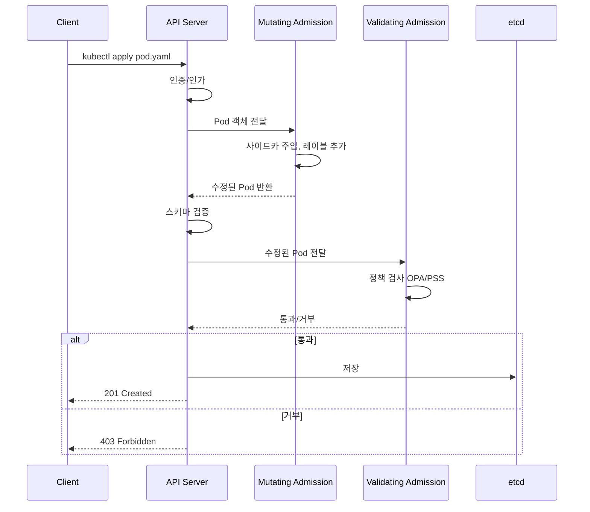

# 쿠버네티스 보안

쿠버네티스는 기본 설정으로 두면 보안 측면에서 위험한 부분이 많다. 클러스터를 처음 띄우면 default ServiceAccount가 모든 Pod에 자동 마운트되고, NetworkPolicy가 없어서 모든 Pod끼리 통신이 가능하며, etcd에는 Secret이 평문으로 저장된다. 운영 환경에서 이런 상태로 두면 Pod 하나가 뚫렸을 때 클러스터 전체가 위험해진다.

5년차 개발자로서 클러스터 운영하면서 한 번씩 사고가 나면 거의 다 권한 관련이거나, 잘못 노출된 Secret 때문이거나, NetworkPolicy 없이 측면 이동이 일어난 경우다. 여기서는 실제 운영에서 막아야 할 위협 모델과 처방을 정리한다.

## 위협 모델 — 어디서 뚫리는가

쿠버네티스 공격 경로는 대체로 다음과 같다.

```mermaid
flowchart TB
    A[외부 공격] --> B[Pod 침투]
    A --> C[API Server 직접 공격]
    A --> D[Supply Chain 이미지]
    B --> E[ServiceAccount 토큰 탈취]
    B --> F[측면 이동 Pod-to-Pod]
    E --> G[API Server 권한 상승]
    F --> H[다른 네임스페이스 Pod 침투]
    G --> I[Secret 탈취]
    I --> J[클러스터 장악]
    H --> J
    C --> J
    D --> B
```



내가 본 실제 사고 패턴은 크게 세 가지다. 첫째, 컨테이너 안 애플리케이션 취약점으로 RCE가 났는데 default ServiceAccount가 list pods 권한이 있어서 공격자가 클러스터 구조를 다 파악한 경우. 둘째, NetworkPolicy 없이 운영하다가 한 Pod에서 다른 네임스페이스의 DB Pod로 직접 접근한 경우. 셋째, etcd 백업이 평문으로 S3에 올라가 있었는데 그 버킷이 public이었던 경우.

대응은 결국 권한 최소화, 네트워크 분리, 데이터 암호화 이 세 축이다.

## RBAC 설계 — 권한 최소화의 출발점

RBAC는 쿠버네티스 보안의 가장 기본이다. Role과 ClusterRole, RoleBinding과 ClusterRoleBinding 네 가지 리소스를 조합한다. Role은 네임스페이스 범위, ClusterRole은 클러스터 범위다.

### 잘못된 예 — cluster-admin 남발

가장 흔한 실수가 개발자 편의를 위해 cluster-admin을 그냥 묶어주는 것이다.

```yaml
# 절대 이렇게 하지 말 것
apiVersion: rbac.authorization.k8s.io/v1
kind: ClusterRoleBinding
metadata:
  name: dev-team-admin
subjects:
- kind: User
  name: developer@company.com
roleRef:
  kind: ClusterRole
  name: cluster-admin
  apiGroup: rbac.authorization.k8s.io
```

이렇게 묶어주면 그 사용자는 모든 네임스페이스에서 모든 리소스를 만들고 지울 수 있다. 실수로 kube-system 네임스페이스를 건드리면 클러스터가 죽는다. 실제로 신입이 잘못된 명령어 하나로 kube-proxy DaemonSet을 지운 적이 있었다.

### 올바른 RBAC 설계 — 네임스페이스 단위 권한

개발팀이 자기 네임스페이스만 만지게 하는 패턴이다.

```yaml
apiVersion: rbac.authorization.k8s.io/v1
kind: Role
metadata:
  namespace: team-payment
  name: developer
rules:
- apiGroups: ["", "apps", "batch"]
  resources: ["pods", "deployments", "services", "configmaps", "jobs"]
  verbs: ["get", "list", "watch", "create", "update", "patch", "delete"]
- apiGroups: [""]
  resources: ["secrets"]
  verbs: ["get", "list"]  # Secret 생성/수정은 막아둠
- apiGroups: [""]
  resources: ["pods/exec"]
  verbs: ["create"]  # kubectl exec 허용
- apiGroups: [""]
  resources: ["pods/log"]
  verbs: ["get", "list"]  # 로그 조회 허용
---
apiVersion: rbac.authorization.k8s.io/v1
kind: RoleBinding
metadata:
  namespace: team-payment
  name: developer-binding
subjects:
- kind: Group
  name: team-payment-developers
  apiGroup: rbac.authorization.k8s.io
roleRef:
  kind: Role
  name: developer
  apiGroup: rbac.authorization.k8s.io
```

여기서 중요한 점이 몇 가지 있다. Secret은 읽기만 가능하게 했다. Secret 생성/수정은 GitOps 파이프라인이 하고, 사람이 직접 만들지 않는다. pods/exec는 디버깅용으로 허용하되, 감사 로그에 다 남는다. 운영 환경에서는 pods/exec를 막고 별도 디버깅 Pod를 쓰는 곳도 많다.

### CI/CD용 ServiceAccount 권한

CI/CD에서 쓰는 ServiceAccount는 사람과 다르게 매우 좁게 잡아야 한다. 예를 들어 Deployment만 업데이트하는 ServiceAccount라면 이렇게 한다.

```yaml
apiVersion: v1
kind: ServiceAccount
metadata:
  name: gitops-deployer
  namespace: team-payment
---
apiVersion: rbac.authorization.k8s.io/v1
kind: Role
metadata:
  namespace: team-payment
  name: deployer
rules:
- apiGroups: ["apps"]
  resources: ["deployments"]
  verbs: ["get", "patch", "update"]
  resourceNames: ["payment-api", "payment-worker"]  # 특정 리소스 이름만
- apiGroups: [""]
  resources: ["pods"]
  verbs: ["get", "list"]  # 배포 후 상태 확인용
```

resourceNames로 특정 이름만 잡아두면 다른 Deployment는 못 건드린다. CI 파이프라인이 털렸을 때 피해를 좁힐 수 있다.

### 권한 점검 명령어

운영하면서 자주 쓰는 명령어다.

```bash
# 특정 사용자/SA가 할 수 있는 일 확인
kubectl auth can-i --list --as=system:serviceaccount:team-payment:gitops-deployer

# 특정 동작이 가능한지 확인
kubectl auth can-i delete pods --as=system:serviceaccount:default:default -n kube-system

# ClusterRoleBinding에서 cluster-admin 묶인 거 찾기
kubectl get clusterrolebindings -o json | \
  jq '.items[] | select(.roleRef.name=="cluster-admin") | .metadata.name'

# 위험한 RBAC 권한 가진 SA 찾기 (rakkess 또는 kubectl-who-can 같은 툴)
kubectl who-can create pods --all-namespaces
```

분기마다 한 번씩 cluster-admin 묶인 거 다 훑어보고 불필요한 거 정리하는 게 좋다. 사람이 회사 나간 후에도 묶여있는 경우가 의외로 많다.

## ServiceAccount와 토큰 관리

ServiceAccount는 Pod가 API Server와 통신할 때 쓰는 신원이다. 모든 Pod는 ServiceAccount를 하나 가지고, 명시하지 않으면 default SA가 붙는다.

### default ServiceAccount 자동 마운트 끄기

기본 설정으로는 default SA의 토큰이 모든 Pod의 `/var/run/secrets/kubernetes.io/serviceaccount/token`에 마운트된다. Pod에서 API Server를 부를 일이 없는데도 토큰이 있으면 Pod가 뚫렸을 때 공격자가 그 토큰으로 API를 칠 수 있다.

네임스페이스 단위로 default SA 자동 마운트를 끄는 방법이다.

```yaml
apiVersion: v1
kind: ServiceAccount
metadata:
  name: default
  namespace: team-payment
automountServiceAccountToken: false
```

Pod에서 API를 정말 호출해야 하는 경우에만 명시적으로 ServiceAccount를 만들고 마운트한다.

```yaml
apiVersion: v1
kind: ServiceAccount
metadata:
  name: payment-api-sa
  namespace: team-payment
automountServiceAccountToken: true
---
apiVersion: apps/v1
kind: Deployment
metadata:
  name: payment-api
spec:
  template:
    spec:
      serviceAccountName: payment-api-sa
      automountServiceAccountToken: true  # Pod 레벨에서도 명시
```

### Token 종류 — Secret 기반 토큰의 위험성

쿠버네티스 1.24 이전에는 ServiceAccount를 만들면 Secret이 자동 생성되고 그 안에 영구 토큰이 들어갔다. 이 방식은 토큰이 만료되지 않아서 한 번 새면 영원히 위험하다.

1.24부터는 Projected ServiceAccount Token이 기본이다. Pod가 시작될 때 짧은 만료 시간을 가진 JWT를 마운트하고, kubelet이 자동으로 갱신한다.

```yaml
apiVersion: v1
kind: Pod
metadata:
  name: example
spec:
  serviceAccountName: payment-api-sa
  containers:
  - name: app
    image: payment-api:1.0
    volumeMounts:
    - mountPath: /var/run/secrets/tokens
      name: api-token
  volumes:
  - name: api-token
    projected:
      sources:
      - serviceAccountToken:
          path: api-token
          expirationSeconds: 3600  # 1시간
          audience: payment-api
```

audience를 지정하면 그 토큰은 해당 audience를 검증하는 서비스에서만 유효하다. 외부 시스템(예: Vault, AWS IAM)과 OIDC로 연동할 때 이 방식이 필수다.

### 외부에서 ServiceAccount Token 발급받기

CI에서 클러스터에 접근할 때 영구 토큰을 만들지 말고 `kubectl create token`으로 단기 토큰을 발급받는다.

```bash
# 1시간짜리 토큰 발급
kubectl create token gitops-deployer -n team-payment --duration=1h

# audience 지정
kubectl create token gitops-deployer -n team-payment \
  --audience=https://kubernetes.default.svc \
  --duration=30m
```

CI 파이프라인이 시작될 때 단기 토큰을 발급받고, 끝나면 자연 만료되게 한다. 영구 토큰을 GitHub Secrets에 박아두면 그게 새는 순간 끝이다.

## NetworkPolicy — 동서 트래픽 제어

쿠버네티스는 기본적으로 모든 Pod가 서로 통신 가능하다. 한 Pod가 뚫리면 같은 클러스터의 모든 Pod로 접근할 수 있다는 뜻이다. NetworkPolicy는 이 동서(East-West) 트래픽을 제한한다.

NetworkPolicy는 CNI 플러그인이 구현한다. Calico, Cilium은 지원하지만 일부 클라우드 기본 CNI는 지원하지 않거나 제한적이다. 클러스터 만들 때 CNI 선택을 보고 가야 한다.

### Default Deny 정책

네임스페이스에 들어오는 모든 트래픽을 막는 정책부터 깔아둔다.

```yaml
apiVersion: networking.k8s.io/v1
kind: NetworkPolicy
metadata:
  name: default-deny-all
  namespace: team-payment
spec:
  podSelector: {}  # 네임스페이스 내 모든 Pod
  policyTypes:
  - Ingress
  - Egress
```

이걸 적용하면 그 네임스페이스 Pod는 외부에서 들어오지도 못하고 밖으로 나가지도 못한다. 그다음 필요한 통신만 하나씩 열어준다.

### DNS 트래픽 허용 (필수)

대부분의 Pod는 kube-dns/CoreDNS를 거쳐 이름을 해석한다. DNS를 막으면 어떤 서비스도 동작하지 않는다.

```yaml
apiVersion: networking.k8s.io/v1
kind: NetworkPolicy
metadata:
  name: allow-dns
  namespace: team-payment
spec:
  podSelector: {}
  policyTypes:
  - Egress
  egress:
  - to:
    - namespaceSelector:
        matchLabels:
          kubernetes.io/metadata.name: kube-system
      podSelector:
        matchLabels:
          k8s-app: kube-dns
    ports:
    - protocol: UDP
      port: 53
    - protocol: TCP
      port: 53
```

NetworkPolicy 깔고 서비스가 안 뜨면 일단 DNS부터 확인한다. 이 실수 정말 자주 한다.

### 특정 서비스 간 통신만 허용

payment-api가 payment-db에만 접근하게 하는 예다.

```yaml
apiVersion: networking.k8s.io/v1
kind: NetworkPolicy
metadata:
  name: payment-db-ingress
  namespace: team-payment
spec:
  podSelector:
    matchLabels:
      app: payment-db
  policyTypes:
  - Ingress
  ingress:
  - from:
    - podSelector:
        matchLabels:
          app: payment-api
    ports:
    - protocol: TCP
      port: 5432
---
apiVersion: networking.k8s.io/v1
kind: NetworkPolicy
metadata:
  name: payment-api-egress-to-db
  namespace: team-payment
spec:
  podSelector:
    matchLabels:
      app: payment-api
  policyTypes:
  - Egress
  egress:
  - to:
    - podSelector:
        matchLabels:
          app: payment-db
    ports:
    - protocol: TCP
      port: 5432
```

Ingress와 Egress를 둘 다 잡아야 한다. payment-db에서 ingress를 열어줘도 payment-api에서 egress가 막혀있으면 통신이 안 된다. 처음 NetworkPolicy 설계할 때 가장 헷갈리는 부분이다.

### 외부 트래픽 제어

운영하다 보면 Pod에서 외부 API를 호출하는 경우가 많다. 예를 들어 결제 API에서 토스/카카오 결제 게이트웨이를 호출한다고 치자. IP CIDR 기반으로 외부 트래픽을 제어할 수 있다.

```yaml
apiVersion: networking.k8s.io/v1
kind: NetworkPolicy
metadata:
  name: payment-api-egress-external
  namespace: team-payment
spec:
  podSelector:
    matchLabels:
      app: payment-api
  policyTypes:
  - Egress
  egress:
  - to:
    - ipBlock:
        cidr: 0.0.0.0/0
        except:
        - 10.0.0.0/8      # 사내망 차단
        - 172.16.0.0/12
        - 192.168.0.0/16
    ports:
    - protocol: TCP
      port: 443
```

이렇게 하면 외부 HTTPS는 가능하지만 사내 다른 네트워크로는 못 나간다. SSRF 공격이 들어와도 내부 서비스로 안 새어 나간다.

### Cilium의 L7 정책

기본 NetworkPolicy는 L4(IP, 포트)까지만 다룬다. Cilium을 쓰면 L7(HTTP path, method)까지 제어할 수 있다.

```yaml
apiVersion: cilium.io/v2
kind: CiliumNetworkPolicy
metadata:
  name: payment-api-l7
  namespace: team-payment
spec:
  endpointSelector:
    matchLabels:
      app: payment-api
  ingress:
  - fromEndpoints:
    - matchLabels:
        app: web-frontend
    toPorts:
    - ports:
      - port: "8080"
        protocol: TCP
      rules:
        http:
        - method: "GET"
          path: "/api/v1/payments/.*"
        - method: "POST"
          path: "/api/v1/payments"
```

web-frontend는 payment-api의 특정 path만 호출할 수 있다. admin path를 호출하면 차단된다. 마이크로서비스 간 호출을 세밀하게 통제할 때 유용하다.

## Pod Security Standards (PSS)

PodSecurityPolicy(PSP)는 1.25에서 제거됐다. 그 자리를 Pod Security Standards가 차지했다. 네임스페이스 레이블만 붙이면 알아서 강제된다.

세 가지 레벨이 있다.

- **privileged**: 제한 없음. 시스템 컴포넌트용
- **baseline**: 최소한의 보안. 흔히 알려진 권한 상승만 차단
- **restricted**: 가장 엄격. 운영 워크로드 기본값

세 가지 모드가 있다.

- **enforce**: 위반 시 Pod 생성 거부
- **audit**: 위반 시 감사 로그만 남김
- **warn**: 위반 시 kubectl에 경고만 표시

### 네임스페이스에 PSS 적용

```yaml
apiVersion: v1
kind: Namespace
metadata:
  name: team-payment
  labels:
    pod-security.kubernetes.io/enforce: restricted
    pod-security.kubernetes.io/enforce-version: v1.28
    pod-security.kubernetes.io/audit: restricted
    pod-security.kubernetes.io/warn: restricted
```

새 네임스페이스를 만들 때부터 restricted로 잡아두는 게 좋다. 운영 중에 baseline에서 restricted로 올리면 기존 Pod가 위반해서 재배포할 때 막힐 수 있다.

### restricted를 만족시키는 Pod 스펙

restricted 모드에서 통과하려면 Pod 스펙에 다음을 모두 채워야 한다.

```yaml
apiVersion: v1
kind: Pod
metadata:
  name: payment-api
spec:
  securityContext:
    runAsNonRoot: true
    runAsUser: 1000
    runAsGroup: 1000
    fsGroup: 1000
    seccompProfile:
      type: RuntimeDefault
  containers:
  - name: app
    image: payment-api:1.0
    securityContext:
      allowPrivilegeEscalation: false
      readOnlyRootFilesystem: true
      capabilities:
        drop:
        - ALL
    volumeMounts:
    - name: tmp
      mountPath: /tmp
    - name: cache
      mountPath: /var/cache
  volumes:
  - name: tmp
    emptyDir: {}
  - name: cache
    emptyDir: {}
```

여기서 중요한 점이 readOnlyRootFilesystem이다. 컨테이너 안 파일시스템을 읽기 전용으로 만들면 공격자가 RCE 후에도 추가 페이로드를 떨굴 수가 없다. 그런데 애플리케이션이 /tmp나 /var/log에 쓰는 경우가 많아서 emptyDir로 따로 마운트해줘야 한다.

readOnlyRootFilesystem 적용하다가 부트 시점 파일 쓰기가 실패해서 한참 디버깅한 적이 있다. JVM이 /tmp에 클래스 파일을 쓰는데 그게 막힌 거였다. 처음 적용할 때는 warn 모드로 두고 위반 사항을 보고 fix한 다음에 enforce로 바꾸는 게 안전하다.

## OPA/Gatekeeper — 정책 엔진

PSS는 정해진 정책이지만, OPA Gatekeeper를 쓰면 임의의 정책을 강제할 수 있다. 예를 들어 "이미지는 반드시 사내 레지스트리에서 와야 한다", "모든 Pod에 cost-center 레이블이 있어야 한다" 같은 거다.

Gatekeeper는 Admission Webhook으로 동작한다. Pod가 생성될 때 API Server가 Gatekeeper에 물어보고, Gatekeeper가 Rego로 작성된 정책을 평가한다.

### ConstraintTemplate과 Constraint

Gatekeeper는 두 단계로 구성된다. ConstraintTemplate은 정책 로직을 정의하고, Constraint는 그 템플릿을 실제 클러스터에 적용한다.

이미지 레지스트리 제한 예시다.

```yaml
apiVersion: templates.gatekeeper.sh/v1
kind: ConstraintTemplate
metadata:
  name: k8sallowedrepos
spec:
  crd:
    spec:
      names:
        kind: K8sAllowedRepos
      validation:
        openAPIV3Schema:
          type: object
          properties:
            repos:
              type: array
              items:
                type: string
  targets:
    - target: admission.k8s.gatekeeper.sh
      rego: |
        package k8sallowedrepos

        violation[{"msg": msg}] {
          container := input.review.object.spec.containers[_]
          satisfied := [good | repo = input.parameters.repos[_]
                              good = startswith(container.image, repo)]
          not any(satisfied)
          msg := sprintf("컨테이너 이미지 %v는 허용된 레지스트리에서 와야 한다", [container.image])
        }
---
apiVersion: constraints.gatekeeper.sh/v1beta1
kind: K8sAllowedRepos
metadata:
  name: allowed-repos
spec:
  match:
    kinds:
      - apiGroups: [""]
        kinds: ["Pod"]
    excludedNamespaces:
      - kube-system
      - gatekeeper-system
  parameters:
    repos:
      - "registry.company.com/"
      - "gcr.io/company-prod/"
```

이제 누가 `docker.io/nginx` 같은 외부 이미지로 Pod를 만들려고 하면 거부된다. 공급망 공격을 막는 1차 방어선이다.

### 흔히 쓰는 Gatekeeper 정책

- 모든 Pod에 resource limits 강제
- privileged Pod 차단
- hostPath 마운트 차단
- 특정 레이블(cost-center, team) 필수
- LoadBalancer Service 차단 (비용 통제)
- 외부 트래픽 허용된 Ingress 호스트만 사용

### Audit과 Dry-run

정책을 처음 적용할 때 enforcementAction을 dryrun으로 두고 위반 현황을 본 다음 deny로 바꾼다.

```yaml
spec:
  enforcementAction: dryrun  # 처음에는 이거
  match: {...}
```

```bash
# 위반 현황 조회
kubectl get k8sallowedrepos allowed-repos -o yaml
# spec.status.violations 부분 확인
```

기존 워크로드 다 정리한 다음에 enforce로 전환한다. 운영 중에 갑자기 enforce 걸면 다음 배포에서 Pod 못 만들어서 장애 난다.

## Admission Controller 흐름

Admission Controller는 API Server가 요청을 받아서 etcd에 저장하기 전에 끼어드는 단계다. 두 종류가 있다.

- **Mutating Admission**: 객체를 수정한다. 사이드카 주입, 기본값 설정
- **Validating Admission**: 객체를 검증만 한다. 통과 못 하면 거부



내장 Admission Controller가 여러 개 있는데, 운영하면서 신경 쓸 것은 다음이다.

- **NodeRestriction**: kubelet이 자기 노드 외의 리소스를 수정 못 하게 막음
- **ResourceQuota**: 네임스페이스 리소스 한도 강제
- **LimitRanger**: 컨테이너 기본 limits/requests 설정
- **PodSecurity**: PSS 강제

외부 webhook을 쓸 때 주의할 점이 있다. Webhook 서버가 죽으면 API Server가 모든 요청을 거부할 수 있다. failurePolicy를 잘못 잡으면 클러스터가 통째로 멈춘다.

```yaml
apiVersion: admissionregistration.k8s.io/v1
kind: ValidatingWebhookConfiguration
metadata:
  name: my-webhook
webhooks:
- name: validate.example.com
  failurePolicy: Fail  # Webhook 죽으면 요청 거부 — 위험
  timeoutSeconds: 5
  namespaceSelector:
    matchExpressions:
    - key: kubernetes.io/metadata.name
      operator: NotIn
      values: ["kube-system", "kube-public"]  # 시스템 NS 제외 필수
```

namespaceSelector로 kube-system은 제외해야 한다. 그렇지 않으면 webhook 자체를 배포하는데 webhook이 막아서 영원히 못 들어간다. 이거 때문에 클러스터 망친 사례 들어본 적 있다.

## Secrets 암호화 — KMS 연동

쿠버네티스 Secret은 etcd에 base64 인코딩되어 저장된다. 인코딩일 뿐 암호화가 아니다. etcd 디스크나 백업이 새면 모든 Secret이 평문으로 노출된다.

### EncryptionConfiguration

API Server 설정에서 Secret을 저장할 때 암호화하도록 한다.

```yaml
# /etc/kubernetes/encryption-config.yaml
apiVersion: apiserver.config.k8s.io/v1
kind: EncryptionConfiguration
resources:
  - resources:
      - secrets
    providers:
      - kms:
          name: aws-kms
          endpoint: unix:///var/run/kmsplugin/socket.sock
          cachesize: 1000
          timeout: 3s
      - aescbc:
          keys:
            - name: key1
              secret: <base64-encoded-32-byte-key>
      - identity: {}  # 마지막은 평문 (마이그레이션용)
```

providers 순서가 중요하다. 위에서부터 시도하고, 쓰기는 첫 번째 것으로 한다. 읽기는 모든 provider로 시도한다. identity를 마지막에 두면 기존 평문 데이터도 읽을 수 있다.

KMS provider는 외부 KMS(AWS KMS, GCP KMS, HashiCorp Vault Transit)와 통신해서 DEK(Data Encryption Key)를 암호화한다. etcd에는 KMS로 암호화된 DEK와 그 DEK로 암호화된 Secret이 같이 저장된다. KMS를 거치니 키 회전, 감사 로그, 접근 제어가 다 KMS에서 관리된다.

### 기존 Secret 재암호화

EncryptionConfiguration을 처음 적용하면 새로 만드는 Secret만 암호화된다. 기존 Secret은 평문이다. 모두 재암호화하려면 명시적으로 업데이트한다.

```bash
# 모든 네임스페이스의 모든 Secret을 다시 저장 (재암호화)
kubectl get secrets --all-namespaces -o json | \
  kubectl replace -f -
```

이 작업은 한 번에 모든 etcd 쓰기를 일으키므로 트래픽이 적을 때 한다. 그리고 백업이 평문이었다면 그 백업도 안전한 곳에 보관하거나 다시 만들어야 한다.

### Secret 사용 패턴 — 외부 비밀 저장소

Secret을 쿠버네티스에 직접 저장하지 않고 외부 비밀 저장소를 쓰는 패턴이 점점 표준이 되고 있다.

- **External Secrets Operator**: Vault, AWS Secrets Manager, GCP Secret Manager에서 가져와서 Secret 리소스로 동기화
- **Secrets Store CSI Driver**: Secret을 etcd에 넣지 않고 Pod에 직접 마운트
- **SOPS**: Git에 암호화된 Secret을 커밋, 배포 시점에 복호화

SOPS와 ArgoCD 조합이 GitOps 환경에서 인기 있다. Secret도 git에 커밋되지만 KMS로 암호화되어 있어 키 없으면 못 읽는다.

```yaml
# secrets.enc.yaml (sops로 암호화된 파일)
apiVersion: v1
kind: Secret
metadata:
  name: payment-db-secret
data:
  password: ENC[AES256_GCM,data:abc...,tag:xyz==,type:str]
sops:
  kms:
    - arn: arn:aws:kms:ap-northeast-2:123456789:key/abc-def
```

## kubeconfig 관리

kubeconfig는 클러스터 접근 정보를 담은 파일이다. 사용자별로 따로 쓰지만, 운영 클러스터의 kubeconfig가 한 번 새면 그 사람의 모든 권한이 외부로 새는 것과 같다.

### 인증 방식 선택

kubeconfig의 user 섹션에는 여러 인증 방식이 들어갈 수 있다.

```yaml
users:
- name: developer
  user:
    # 1. Static token (가장 안 좋음 — 영구 토큰)
    token: eyJhbGc...

    # 2. Client certificate (영구, 회수 어려움)
    client-certificate-data: LS0tLS1...
    client-key-data: LS0tLS1...

    # 3. Exec plugin (OIDC, AWS IAM 등 동적 인증)
    exec:
      apiVersion: client.authentication.k8s.io/v1beta1
      command: aws
      args: ["eks", "get-token", "--cluster-name", "prod"]
```

운영 환경에서는 무조건 exec plugin 방식이다. 사용자가 AWS SSO나 OIDC로 인증하고, 그 결과로 단기 토큰을 받는다. 영구 토큰이나 클라이언트 인증서는 새면 회수가 어렵다.

### EKS의 경우 — IAM 기반

```yaml
users:
- name: arn:aws:eks:ap-northeast-2:123456789:cluster/prod
  user:
    exec:
      apiVersion: client.authentication.k8s.io/v1beta1
      command: aws
      args:
        - eks
        - get-token
        - --cluster-name
        - prod
      env:
        - name: AWS_PROFILE
          value: prod-sso
```

이렇게 하면 사용자는 AWS SSO로 로그인하고, IAM 권한이 RBAC와 매핑된다. IAM에서 사용자를 끄면 클러스터 접근도 같이 끊긴다. 회사 입사/퇴사 프로세스와 자연스럽게 연동된다.

### kubeconfig 권한 분리

운영 클러스터 kubeconfig와 개발 클러스터 kubeconfig는 분리한다. 한 파일에 다 넣으면 context 잘못 잡고 실수로 운영에 명령 내리는 사고가 난다.

```bash
# 클러스터별 kubeconfig 파일 분리
export KUBECONFIG=~/.kube/dev:~/.kube/staging:~/.kube/prod
kubectl config get-contexts

# 또는 매번 명시
kubectl --kubeconfig ~/.kube/prod get pods
```

별칭으로 wrapping해서 운영 명령에는 항상 확인을 거치게 하는 사람도 있다.

```bash
# .zshrc
kprod() {
  read -p "운영 클러스터 명령. 정말 실행? (y/N): " confirm
  [[ $confirm == "y" ]] && KUBECONFIG=~/.kube/prod kubectl "$@"
}
```

## etcd 암호화와 보호

etcd는 쿠버네티스의 데이터베이스다. 모든 리소스, Secret, ConfigMap이 여기 저장된다. etcd가 털리면 클러스터가 통째로 털린 거다.

### etcd 클라이언트 인증

etcd는 mTLS로 통신한다. API Server는 클라이언트 인증서로 etcd에 접근한다.

```yaml
# kube-apiserver 옵션
--etcd-cafile=/etc/kubernetes/pki/etcd/ca.crt
--etcd-certfile=/etc/kubernetes/pki/apiserver-etcd-client.crt
--etcd-keyfile=/etc/kubernetes/pki/apiserver-etcd-client.key
--etcd-servers=https://etcd-0:2379,https://etcd-1:2379,https://etcd-2:2379
```

이 인증서가 새면 누구나 etcd에 접근해서 데이터를 다 읽을 수 있다. 인증서 회전 절차를 미리 마련해둬야 한다.

### etcd 저장 시 암호화

위에서 다룬 EncryptionConfiguration이 etcd 안 Secret 암호화를 책임진다. 추가로 etcd 자체의 디스크 암호화(LUKS, EBS encryption)도 적용한다. 디스크가 도난당해도 직접 읽지 못하게 한다.

### etcd 백업 보안

```bash
# etcd 스냅샷
ETCDCTL_API=3 etcdctl snapshot save /backup/etcd-snapshot.db \
  --endpoints=https://127.0.0.1:2379 \
  --cacert=/etc/kubernetes/pki/etcd/ca.crt \
  --cert=/etc/kubernetes/pki/etcd/server.crt \
  --key=/etc/kubernetes/pki/etcd/server.key
```

스냅샷은 EncryptionConfiguration 적용 후라도 그 안 내용은 Secret이 KMS로 암호화된 상태로 들어간다. 다만 ConfigMap이나 다른 리소스는 평문이다. 백업 파일 자체도 별도 암호화해서 저장한다.

S3에 올린다면 SSE-KMS로 암호화하고, 버킷 정책으로 접근을 제한한다. 백업 복호화 키와 etcd 암호화 키는 별도 KMS에 둔다.

## 이미지 서명 검증

쿠버네티스 노드는 이미지 레지스트리에서 이미지를 받아와 컨테이너를 띄운다. 이미지가 신뢰할 수 있는 곳에서 왔는지, 빌드 후 변조되지 않았는지 확인해야 한다.

### Cosign으로 이미지 서명

Cosign(Sigstore)은 컨테이너 이미지에 서명하는 도구다.

```bash
# 키 페어 생성
cosign generate-key-pair

# 이미지 서명
cosign sign --key cosign.key registry.company.com/payment-api:1.0

# 서명 검증
cosign verify --key cosign.pub registry.company.com/payment-api:1.0
```

CI 파이프라인에서 이미지 빌드 직후 서명한다. 비밀 키는 KMS나 GitHub OIDC + Sigstore Fulcio로 관리한다. Keyless signing은 임시 인증서를 받아서 서명하므로 비밀 키 관리 부담이 없다.

```bash
# Keyless signing (OIDC 기반)
cosign sign --identity-token=$OIDC_TOKEN registry.company.com/payment-api:1.0
```

### 클러스터에서 서명 검증 강제

Sigstore Policy Controller나 Kyverno로 검증을 강제한다.

```yaml
apiVersion: kyverno.io/v1
kind: ClusterPolicy
metadata:
  name: verify-image-signature
spec:
  validationFailureAction: Enforce
  rules:
    - name: check-signature
      match:
        resources:
          kinds:
            - Pod
      verifyImages:
      - imageReferences:
        - "registry.company.com/*"
        attestors:
        - entries:
          - keys:
              publicKeys: |-
                -----BEGIN PUBLIC KEY-----
                MFkwEwYHKoZIzj0CAQYIKoZIzj0DAQcDQgAE...
                -----END PUBLIC KEY-----
```

서명되지 않은 이미지로 Pod를 만들려고 하면 admission 단계에서 거부된다. 공격자가 자기 이미지를 클러스터에 띄우려고 해도 서명이 없어서 막힌다.

### SBOM과 출처 검증

SBOM(Software Bill of Materials)도 같이 생성해서 이미지에 첨부한다.

```bash
# Syft로 SBOM 생성
syft registry.company.com/payment-api:1.0 -o spdx-json > sbom.spdx.json

# 이미지에 첨부
cosign attest --predicate sbom.spdx.json \
  --type spdxjson \
  --key cosign.key \
  registry.company.com/payment-api:1.0
```

이미지 안에 어떤 라이브러리가 들었는지 추적할 수 있다. 나중에 CVE가 터졌을 때 영향받는 이미지를 빠르게 찾는다.

## 감사 로그 — 누가 무엇을 했는가

API Server 감사 로그는 사고 났을 때 유일한 단서다. 기본으로는 안 켜져 있다.

```yaml
# /etc/kubernetes/audit-policy.yaml
apiVersion: audit.k8s.io/v1
kind: Policy
rules:
- level: None
  users: ["system:kube-proxy"]  # 시끄러운 시스템 컴포넌트 제외
  verbs: ["watch"]
  resources:
  - group: ""
    resources: ["endpoints", "services"]

- level: RequestResponse
  resources:
  - group: ""
    resources: ["secrets", "configmaps"]

- level: Metadata
  resources:
  - group: ""
    resources: ["pods"]
  verbs: ["create", "delete", "update", "patch"]

- level: RequestResponse
  resources:
  - group: "rbac.authorization.k8s.io"
    resources: ["*"]

- level: Metadata
```

Secret과 RBAC 변경은 RequestResponse 레벨(요청과 응답 본문 전체)로 남긴다. Pod 생성/삭제는 Metadata 레벨(누가 언제 무엇을)로 충분하다. 너무 자세히 잡으면 로그가 폭발한다.

API Server 옵션에 적용한다.

```yaml
--audit-policy-file=/etc/kubernetes/audit-policy.yaml
--audit-log-path=/var/log/audit.log
--audit-log-maxage=30
--audit-log-maxbackup=10
--audit-log-maxsize=100
```

로그는 SIEM(Splunk, Elastic, Loki)으로 빨아간다. "어제 새벽 3시에 누가 prod에 cluster-admin 묶었나" 같은 질문에 답할 수 있어야 한다.

## 운영 체크 — 정기 점검 항목

운영 중 정기적으로 봐야 할 것들이다.

```bash
# 1. cluster-admin 묶인 모든 ID
kubectl get clusterrolebindings -o json | \
  jq -r '.items[] | select(.roleRef.name=="cluster-admin") |
         "\(.metadata.name): \(.subjects[]?.name)"'

# 2. default 네임스페이스에 떠 있는 워크로드 (의심)
kubectl get all -n default

# 3. NetworkPolicy 없는 네임스페이스
for ns in $(kubectl get ns -o name | cut -d/ -f2); do
  count=$(kubectl get networkpolicy -n $ns --no-headers 2>/dev/null | wc -l)
  echo "$ns: $count NetworkPolicies"
done

# 4. PSS 레이블 없는 네임스페이스
kubectl get ns -L pod-security.kubernetes.io/enforce

# 5. privileged Pod 찾기
kubectl get pods --all-namespaces -o json | \
  jq -r '.items[] |
         select(.spec.containers[]?.securityContext?.privileged==true) |
         "\(.metadata.namespace)/\(.metadata.name)"'

# 6. hostNetwork 쓰는 Pod
kubectl get pods --all-namespaces -o json | \
  jq -r '.items[] | select(.spec.hostNetwork==true) |
         "\(.metadata.namespace)/\(.metadata.name)"'

# 7. 만료 임박한 인증서
kubeadm certs check-expiration
```

이런 점검을 자동화한 도구가 많다. kube-bench는 CIS Benchmark 기준으로 클러스터를 점검하고, kube-hunter는 침투 테스트 관점에서 취약점을 찾는다. Polaris나 Trivy는 워크로드 설정을 검사한다. 분기마다 한 번씩 돌려보면 잊고 있던 구멍이 보인다.

## 정리

쿠버네티스 보안은 단일 설정이 아니라 여러 층의 방어를 쌓는 작업이다. RBAC로 권한을 좁히고, NetworkPolicy로 동서 트래픽을 막고, PSS와 OPA로 Pod 스펙을 통제하고, KMS로 Secret을 암호화하고, 이미지 서명으로 공급망을 검증하고, 감사 로그로 추적한다. 한 층이 뚫려도 다음 층에서 막을 수 있게 설계한다.

특히 새 클러스터를 띄울 때 기본 설정부터 손봐야 한다. default SA 자동 마운트 끄기, default-deny NetworkPolicy 깔기, PSS restricted 적용, EncryptionConfiguration 설정, 감사 로그 활성화. 이 다섯 가지가 운영 클러스터의 출발선이다. 운영 들어간 뒤에 뒤늦게 적용하면 기존 워크로드 깨지는 거 다 잡아야 해서 훨씬 힘들다.
