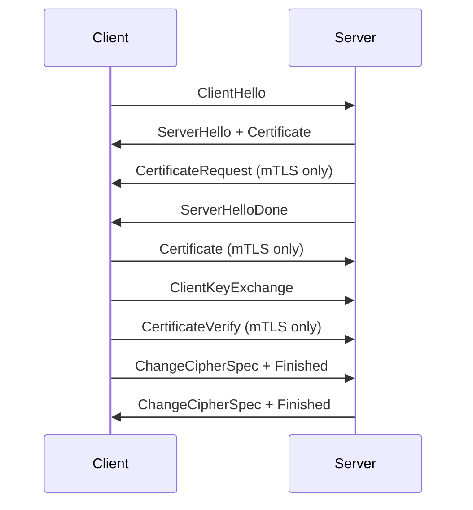
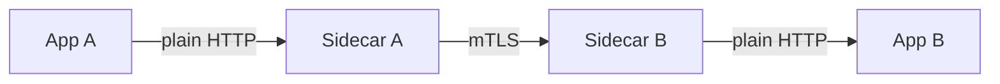
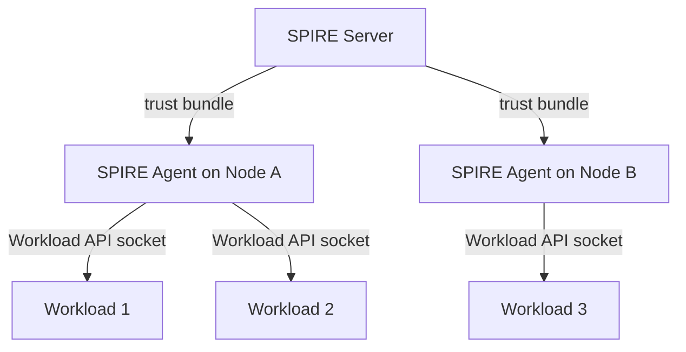

# Mutual TLS (mTLS)

일반적인 HTTPS는 클라이언트가 서버 인증서만 검증한다. 브라우저가 서버의 신원을 확인하지만, 서버는 클라이언트가 누구인지 모른다. 사용자 인증은 그 위에서 동작하는 세션, JWT, OAuth 같은 별도 계층이 담당한다.

mTLS는 TLS 핸드셰이크 단계에서 양쪽이 서로의 인증서를 검증한다. 서버가 클라이언트에게 "너 인증서 내놔"라고 요구하고, 받은 인증서를 자기 신뢰 저장소(CA bundle)로 검증한다. 검증에 실패하면 핸드셰이크 자체가 끊기고 애플리케이션 레이어로 요청이 전달되지 않는다.

이게 왜 의미가 있냐면, 사용자 인증과는 다른 차원의 "워크로드 인증"을 OS/네트워크 레벨에서 강제할 수 있기 때문이다. payment-service가 user-service를 호출할 때, 단순히 같은 VPC에 있다는 이유로 신뢰하는 게 아니라 "너는 진짜 payment-service냐, 인증서로 증명해라"를 요구하는 구조다. 마이크로서비스 환경에서 zero trust 원칙을 실제로 구현할 때 가장 밑단에서 동작하는 메커니즘이다.

## TLS 1.2/1.3 핸드셰이크에서 mTLS의 위치

서버 인증만 하는 일반 TLS와 mTLS의 차이는 핸드셰이크 중 두 메시지에서 갈린다.



서버가 `CertificateRequest`를 보내면 클라이언트는 자기 인증서와 그 인증서에 대응하는 개인키로 서명한 `CertificateVerify`를 함께 보낸다. 서버는 클라이언트 인증서가 신뢰하는 CA로 발급됐는지 확인하고, `CertificateVerify` 서명을 클라이언트 인증서의 공개키로 검증한다. 두 가지가 모두 통과해야 신원이 증명된다.

서명 검증을 빼먹고 인증서 체인만 확인하는 구현이 과거에 있었는데, 그건 반쪽짜리 mTLS다. 인증서는 공개 정보라 누구나 가져올 수 있다. 개인키로 서명된 메시지를 함께 검증해야 "이 인증서를 진짜 소유한 쪽"이 보낸 요청임을 보장한다.

TLS 1.3에서는 메시지 순서가 살짝 다르고 평문 노출이 줄어들지만(특히 인증서가 암호화된 상태로 교환됨) 의미는 동일하다.

## 인증서 발급 모델

### Public CA vs Private CA

mTLS에서 클라이언트 인증서를 Let's Encrypt 같은 public CA로 받는 일은 거의 없다. 발급 비용도 비용이지만 더 큰 문제는 신뢰 모델이다.

서버가 public CA bundle을 신뢰하도록 두면, 그 CA가 발급한 모든 인증서가 잠재적 클라이언트가 된다. 공격자가 자기 도메인으로 정상 발급받은 인증서를 들고 와도 핸드셰이크는 통과한다. 그래서 mTLS의 클라이언트 CA는 거의 항상 조직 내부에서 운영하는 private CA여야 한다.

운영 패턴은 보통 두 가지다.

- **Root CA를 오프라인으로 보관하고 Intermediate CA로 발급**: HSM이나 air-gapped 환경에 root를 두고, 그 root로 서명한 intermediate들을 환경별/팀별로 둔다. intermediate가 털려도 root만 안전하면 해당 intermediate만 폐기하면 된다.
- **단기 인증서 발급기를 두고 동적으로 발급**: HashiCorp Vault PKI, AWS Private CA, cert-manager 같은 도구로 짧은 수명의 인증서를 그때그때 발급한다. 서비스 메시 환경은 거의 이쪽이다.

### 단기 인증서가 표준이 된 이유

전통적으로 인증서는 1년, 2년짜리로 발급해서 만료 직전에 갱신했다. 이 모델은 두 가지 문제가 있다.

첫째, 인증서가 유출됐을 때 폐기 메커니즘(CRL, OCSP)이 실시간이 아니다. CRL은 주기적으로 다운로드하고 OCSP는 응답 캐싱이 일반적이라, 폐기 후 실제 차단까지 시간이 걸린다. OCSP stapling이 도와주지만 stapling을 제대로 검증하는 클라이언트가 적다.

둘째, 갱신 주기가 길수록 갱신 절차가 자동화되지 않은 채로 운영팀에 잊혀진다. 그러다 어느 새벽 2시에 인증서가 만료돼서 전사 장애가 난다. 이런 사례가 너무 많아서 단기 인증서로 발급 주기 자체를 짧게 만드는 쪽으로 흐름이 바뀌었다.

서비스 메시에서는 보통 **24시간 이내**의 인증서를 사용한다. Istio는 기본 24시간, SPIRE는 1시간이 기본값이다. 만료가 짧으니 폐기 메커니즘 자체가 거의 필요 없다. 의심스러우면 새 인증서 발급을 막으면 끝이다.

## Service Mesh와 mTLS

### sidecar 패턴이 mTLS를 가능하게 만든 배경

mTLS를 애플리케이션 코드에 직접 넣으면 언어/프레임워크마다 TLS 라이브러리 설정을 다르게 해야 하고, 인증서 로딩과 갱신 로직을 각 서비스가 들고 있어야 한다. 수십 개 서비스가 있으면 어떤 서비스는 갱신을 깜빡하고, 어떤 서비스는 cipher suite 설정이 약하다. 일관성을 보장하기가 사실상 불가능하다.

서비스 메시는 각 Pod 옆에 sidecar(Envoy 같은 프록시)를 붙이고 모든 트래픽을 sidecar를 통해 흐르게 한다. mTLS 핸드셰이크는 sidecar가 처리하고, 애플리케이션은 평문 HTTP로 localhost에 보낸다. 애플리케이션 코드는 mTLS 존재 자체를 모른다.



이 구조의 장점은 인증서 관리, 갱신, cipher suite 정책, 로깅을 메시 컨트롤 플레인 한 곳에서 통제할 수 있다는 점이다. 단점은 성능 오버헤드(추가 hop, TLS 처리), 메모리 사용량(Pod 하나당 sidecar 하나), 디버깅 복잡도가 올라간다는 점이다.

### Istio

Istio는 컨트롤 플레인의 `istiod`가 인증서를 발급한다. 각 Pod의 Envoy sidecar가 시작될 때 `istiod`로부터 워크로드 인증서를 받아오고, 만료 전에 자동으로 갱신한다.

Istio 인증서의 SAN(Subject Alternative Name)은 SPIFFE ID 형식을 따른다.

```
spiffe://cluster.local/ns/payment/sa/payment-service
```

이 형식은 "어떤 클러스터의 어떤 namespace에 있는 어떤 ServiceAccount인가"를 표현한다. AuthorizationPolicy에서 이 ID로 접근 제어를 한다.

```yaml
apiVersion: security.istio.io/v1
kind: AuthorizationPolicy
metadata:
  name: payment-allow-checkout
  namespace: payment
spec:
  selector:
    matchLabels:
      app: payment-service
  rules:
    - from:
        - source:
            principals:
              - cluster.local/ns/checkout/sa/checkout-service
      to:
        - operation:
            methods: ["POST"]
            paths: ["/charge"]
```

이 정책은 checkout namespace의 checkout-service ServiceAccount만 payment-service의 `POST /charge`를 호출할 수 있게 한다. mTLS로 워크로드가 증명되어 있기 때문에 IP나 헤더로 우회할 수 없다.

Istio mTLS 모드는 세 가지다.

- `STRICT`: mTLS만 받는다. 평문 요청은 거부.
- `PERMISSIVE`: mTLS와 평문 둘 다 받는다. 마이그레이션 중에만 쓴다.
- `DISABLE`: mTLS 끔.

운영 환경은 `STRICT`가 기본이어야 하지만, mesh를 처음 도입할 때는 모든 워크로드가 sidecar를 가지고 있지 않을 수 있어서 `PERMISSIVE`로 시작해서 단계적으로 `STRICT`로 전환한다. 이 전환 과정에서 sidecar가 없는 Pod, mesh 외부에서 직접 호출하는 클라이언트(레거시 cron, 외부 모니터링 도구)를 빠뜨리면 그 시점에 장애가 난다.

### Linkerd

Linkerd는 Istio보다 훨씬 단순한 모델로 mTLS를 구현한다. linkerd-proxy(Rust로 작성된 sidecar)가 자동으로 mTLS를 적용하고 별도 설정이 거의 없다. 메시에 들어온 트래픽은 자동으로 mTLS가 걸리고, identity는 ServiceAccount 기반이다.

Linkerd identity 컨트롤러는 24시간짜리 인증서를 발급하고 만료 전 자동 갱신한다. trust anchor(root CA)는 1년짜리가 기본이고 이건 운영자가 직접 갱신해야 한다.

trust anchor 갱신을 빠뜨리면 어느 날 갑자기 메시 전체가 죽는다. 모든 워크로드 인증서가 이 anchor를 기준으로 검증되기 때문이다. Linkerd 운영 사고의 절반 이상이 trust anchor 만료다.

### Envoy 단독 운영

서비스 메시 컨트롤 플레인 없이 Envoy만 직접 띄워서 mTLS를 처리하는 경우도 있다. 이 경우 인증서 발급/갱신은 cert-manager나 Vault Agent가 파일시스템으로 떨어뜨려주고, Envoy의 SDS(Secret Discovery Service)로 동적으로 로딩한다.

```yaml
transport_socket:
  name: envoy.transport_sockets.tls
  typed_config:
    "@type": type.googleapis.com/envoy.extensions.transport_sockets.tls.v3.DownstreamTlsContext
    require_client_certificate: true
    common_tls_context:
      tls_certificate_sds_secret_configs:
        - name: server_cert
          sds_config:
            path_config_source:
              path: /etc/envoy/sds/server_cert.yaml
      validation_context_sds_secret_config:
        name: trusted_ca
        sds_config:
          path_config_source:
            path: /etc/envoy/sds/ca.yaml
```

`require_client_certificate: true`가 mTLS를 강제하는 핵심 설정이고, `validation_context`로 클라이언트 인증서를 검증할 CA를 지정한다.

## SPIFFE/SPIRE

### SPIFFE의 문제 의식

서비스 메시마다 인증서 발급 방식과 ID 형식이 다르면, 멀티 클러스터/멀티 클라우드 환경에서 서로의 워크로드 신원을 검증하기 어렵다. SPIFFE(Secure Production Identity Framework for Everyone)는 이 신원 표현 방식과 발급 프로토콜을 표준화하려는 CNCF 프로젝트다.

SPIFFE의 핵심은 두 가지다.

- **SPIFFE ID**: `spiffe://trust-domain/path` 형식의 워크로드 식별자. URI SAN으로 X.509 인증서에 박혀있다.
- **Workload API**: 워크로드가 자기 신원을 받아오는 표준 API. Unix domain socket으로 노출되며, 호출한 프로세스의 OS 속성(UID, namespace, container labels 등)을 보고 알맞은 SVID(SPIFFE Verifiable Identity Document)를 돌려준다.

### SPIRE 구조

SPIRE는 SPIFFE 사양의 reference 구현이다.



SPIRE Server는 클러스터당 하나(또는 HA로 여러 개) 있고, 각 노드마다 SPIRE Agent가 DaemonSet으로 떠 있다. 워크로드는 Agent의 Unix socket으로 SVID를 요청하고, Agent는 호출자의 selector(예: Kubernetes ServiceAccount, container image, Linux UID)를 확인해서 등록된 정책과 매칭되면 SVID를 발급한다.

여기서 중요한 게 **attestation**이다. 워크로드는 자기가 누구라고 주장하는 게 아니라, OS와 컨테이너 런타임이 제공하는 정보로 자동 식별된다. payment-service Pod가 떠 있는데 그 안에서 임의의 프로세스가 SVID를 받아가는 게 아니라, 등록된 selector(예: `k8s:ns:payment`, `k8s:sa:payment-service`)에 매칭되는 컨테이너만 받을 수 있다.

이 모델 덕분에 워크로드는 자기 자격증명을 처음부터 알고 있을 필요가 없다. 시크릿을 파일이나 환경변수로 주입할 필요도 없다. "secret zero" 문제(자격증명을 어떻게 처음 안전하게 전달할 것인가)가 OS 레벨 attestation으로 해결된다.

### SPIRE 등록 예시

```bash
spire-server entry create \
    -spiffeID spiffe://example.org/payment-service \
    -parentID spiffe://example.org/spire/agent/k8s_psat/prod-cluster/abc123 \
    -selector k8s:ns:payment \
    -selector k8s:sa:payment-service \
    -selector k8s:container-image:registry.example.com/payment:v1.2.3
```

이 등록은 "prod-cluster의 payment namespace에서 payment-service ServiceAccount로 떠 있고, 컨테이너 이미지가 정확히 v1.2.3인 워크로드만 `spiffe://example.org/payment-service` ID를 받을 수 있다"는 정책이다.

selector를 너무 좁게 잡으면 배포 때마다 등록을 갱신해야 하고, 너무 넓게 잡으면 신원이 약해진다. 이미지 태그를 selector에 넣을지 말지가 자주 논쟁이 되는 부분이다.

## 인증서 로테이션

### 자동 로테이션의 작동 원리

단기 인증서를 쓰면 로테이션이 핵심 운영 항목이 된다. 보통 만료 시간의 절반에서 2/3 지점에 갱신을 시도한다. 24시간 인증서면 12~16시간쯤에 새 인증서를 받는다.

갱신 시점에 새 인증서를 받아서 메모리에 로드하고, 기존 연결은 유지하면서 새 연결부터는 새 인증서로 핸드셰이크한다. Envoy의 SDS, Istio의 istio-agent, SPIRE Agent 모두 이 패턴을 따른다.

문제는 갱신이 실패했을 때다. 컨트롤 플레인이 일시적으로 죽었거나, 네트워크 분단이 일어났거나, CA 자체에 문제가 있으면 갱신이 안 된다. 이때 만료 시점이 다가오는 동안 워크로드는 점점 위험해진다.

대부분의 구현은 이런 경우 retry 간격을 짧게 가져가고, 만료 직전까지 계속 시도한다. 하지만 만료가 지나면 핸드셰이크가 깨지고 트래픽이 끊긴다. 이 fail-closed 동작이 mTLS의 보안 모델 자체이긴 한데, 실수로 컨트롤 플레인을 다운시키면 메시 전체가 죽는 위험이 따라온다.

### 운영자가 챙겨야 할 만료

자동 갱신되는 워크로드 인증서 말고, 사람이 직접 챙겨야 하는 인증서가 있다.

- **Root CA / Trust Anchor**: 보통 5~10년이지만 Linkerd 기본은 1년. 만료되면 메시 전체가 죽는다.
- **Intermediate CA**: 1~5년. 워크로드 인증서를 발급하는 주체.
- **Ingress 인증서**: 외부에 노출되는 게이트웨이. 보통 cert-manager가 처리하지만 webhook이나 발급 조건이 변경되면 갱신 실패.
- **컨트롤 플레인 간 인증서**: SPIRE Server끼리, Istio 컨트롤 플레인 컴포넌트끼리.

이 인증서들은 만료 30일/14일/7일 전에 알람이 와야 한다. Prometheus의 `cert_expiry_seconds` 같은 메트릭을 export하고, 임계값 알람을 PagerDuty로 보내는 게 일반적이다.

```yaml
- alert: CertificateExpiringSoon
  expr: (cert_exporter_not_after - time()) / 86400 < 14
  for: 1h
  labels:
    severity: warning
  annotations:
    summary: "Certificate {{ $labels.cn }} expires in less than 14 days"

- alert: CertificateExpiringCritical
  expr: (cert_exporter_not_after - time()) / 86400 < 3
  for: 5m
  labels:
    severity: critical
```

short-lived 인증서(<24시간)는 이런 알람에 포함하면 안 된다. 정상 동작 중에도 항상 만료 임박 상태이기 때문이다. 단기 인증서는 "갱신 실패 횟수"나 "마지막 성공 갱신 시각"을 추적해야 한다.

## 실제 장애 사례

### 사례 1: 루트 CA 만료로 글로벌 장애

대형 이커머스 회사에서 7년 전 발급한 루트 CA가 만료돼서 결제 시스템이 30분간 멈춘 사례가 있다. 발급 당시 담당자는 이미 퇴사했고, 갱신 절차 문서도 없었다. 만료 한 달 전 메일 알림이 오긴 했지만 일반 메일링 리스트라 아무도 신경 쓰지 않았다.

복구 과정은 새 루트 CA를 발급하고, 모든 intermediate CA를 새 루트로 재발급하고, 모든 워크로드의 trust bundle을 갱신하는 것이었다. 평소 자동화된 적이 없었기 때문에 수동으로 진행됐고 30분이 걸렸다.

이 사례 이후 만든 규칙: 루트 CA 갱신은 만료 1년 전부터 RFC 7030(EST) 같은 자동화된 갱신 프로토콜로 처리하거나, 최소한 2회 이상 dry run한 절차서로 운영한다.

### 사례 2: NTP 시간 동기화 실패로 인한 인증서 거부

쿠버네티스 노드 한 대의 시계가 NTP 동기화 실패로 30분 빨라진 상태였다. 이 노드의 워크로드가 발급받은 인증서는 `notBefore` 시각이 30분 미래로 찍혔다. 다른 노드의 sidecar들이 이 인증서를 검증할 때 "아직 유효하지 않은 인증서"로 거부했다.

증상은 특정 노드에서만 호출이 실패하는 형태로 나타났는데, 처음에는 네트워크 문제로 추정했다. mTLS 도입 환경에서 NTP는 사실상 보안 컴포넌트다. chrony나 systemd-timesyncd가 fail closed로 동작하는지 확인해야 한다.

### 사례 3: PERMISSIVE에서 STRICT 전환 시 누락된 워크로드

Istio mTLS를 PERMISSIVE에서 STRICT로 바꾸는 작업 중, 모니터링 시스템이 클러스터 내부 메트릭 엔드포인트를 sidecar 없이 직접 호출하고 있는 걸 발견하지 못했다. STRICT로 바꾸자마자 메트릭 수집이 끊기고, 그 결과 알람 시스템이 침묵해서 다른 장애를 늦게 발견했다.

전환 전에 Kiali나 Istio access log로 평문 트래픽이 들어오는 워크로드를 모두 식별해야 한다. 보통 이런 워크로드는 다음과 같다.

- 외부 모니터링/probes (Datadog Agent, Prometheus exporter scraping)
- Kubernetes의 readinessProbe / livenessProbe (kubelet은 sidecar 없이 직접 호출)
- 메시 외부에서 들어오는 cron job
- 레거시 헬스체크 스크립트

probes는 Istio의 `holdApplicationUntilProxyStarts`나 sidecar bypass 설정으로 처리할 수 있다. kubelet probe는 mTLS를 적용하지 않는 것이 정상이다.

### 사례 4: SPIRE Agent 재시작 시 cold start 폭발

SPIRE Agent가 노드에서 재시작되면 그 노드의 모든 워크로드가 동시에 새 SVID를 요청한다. SPIRE Server에 한꺼번에 수천 건의 발급 요청이 몰려서 응답이 느려지고, 그 사이 워크로드 인증서가 만료되기 시작한다.

이걸 막으려면 SPIRE Server를 HA로 운영하고, Agent 재시작 시 약간의 jitter를 두는 설정을 추가한다. 또 만료 시간이 너무 짧으면 cold start 윈도우를 못 견디므로, 1시간보다는 4~8시간 정도가 운영상 안전하다.

## 모니터링 핵심 지표

mTLS 환경에서 봐야 할 지표는 일반 TLS와 다른 점이 있다.

- **핸드셰이크 실패율**: TLS handshake error를 sidecar 메트릭으로 확인. 평소 0에 가까워야 하고, 특정 워크로드 쌍에서만 올라가면 인증서 문제 신호다.
- **인증서 만료까지 남은 시간**: 컨트롤 플레인이 발급한 워크로드 인증서, 운영자가 관리하는 root/intermediate, ingress 인증서를 별도 메트릭으로 추적.
- **인증서 발급 latency**: 컨트롤 플레인이 SVID를 발급하는 데 걸리는 시간. 이게 길어지면 갱신이 만료를 못 따라잡는다.
- **rotation 성공/실패 카운터**: 마지막 성공 시각과 연속 실패 횟수.
- **NTP drift**: 노드 시계 편차. 30초 이상 벗어나면 인증서 문제로 직결된다.

핸드셰이크 실패는 TCP 레벨에서 끊기기 때문에 애플리케이션 로그에는 "connection reset" 같은 모호한 에러로만 보인다. sidecar 레벨에서 디버그 로그를 켜야 실제 원인이 드러난다. Envoy는 `--log-level debug`로 켜면 어떤 인증서가 어느 단계에서 거부됐는지 볼 수 있다.

## mTLS를 도입하지 말아야 할 경우

mTLS는 운영 부담이 크다. 도입하기 전에 정말 필요한지 한 번 더 생각해야 한다.

- 단일 VPC 안에서 서비스 두세 개만 있는 환경이라면 보통 IAM 기반 인증과 네트워크 정책으로 충분하다.
- 외부 파트너와 mTLS를 한다면, 파트너 쪽 인증서 만료를 그쪽이 관리해야 하는데 보통 잘 안 된다. API 키나 OAuth client credentials가 운영하기 더 단순하다.
- 메시 컨트롤 플레인을 운영할 사람이 없는데 도입하면 cert 만료로 장애가 난다. SPIRE나 Istio는 조직에 한 명 이상 깊이 이해하는 사람이 있어야 한다.

mTLS는 워크로드 신원이 보안 정책의 1차 단위가 되는 환경, 즉 zero trust를 진지하게 구현하는 환경에서 가치가 있다. 그게 아니면 다른 메커니즘이 더 적합한 경우가 많다.
