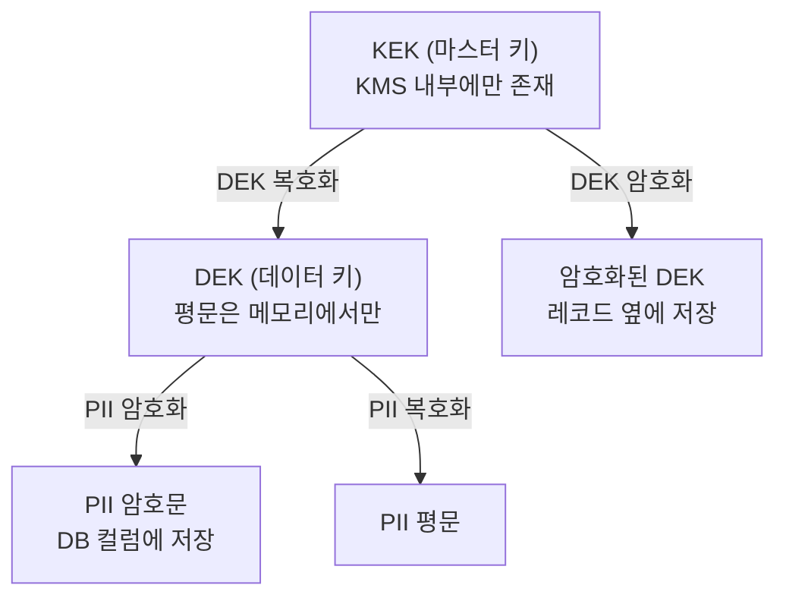

# PII(개인정보) 데이터 보호

개인정보가 어디에 얼마나 들어있는지 정확히 답할 수 있는 회사는 드물다. users 테이블에 이름, 전화번호, 주민등록번호가 있는 건 누구나 안다. 문제는 그게 거기서 끝이 아니라는 점이다. 결제 로그에 카드번호 앞자리가 찍혀 있고, 디버깅 로그에 request body가 통째로 들어가 있고, 3년 전 백업 스냅샷에 탈퇴한 회원 데이터가 평문으로 남아 있고, 테스트 DB는 운영 데이터를 그대로 복제한 거다. 사고가 나서 "유출 범위가 어디까지냐"는 질문을 받는 순간, 이 흩어진 PII를 추적하느라 며칠이 날아간다.

PII 보호는 암호화 알고리즘 하나 적용한다고 끝나지 않는다. 무엇이 PII인지 분류하고, 어디에 있는지 찾고, 용도에 맞는 비식별 기법을 골라 적용하고, 키를 관리하고, 보관 기간이 지나면 파기하는 일련의 과정이다. 이 문서는 그 과정을 데이터 보안 관점에서 다룬다. LLM에 PII가 들어가는 경우(프롬프트 입력, RAG 검색 문서, 파인튜닝 데이터)는 [LLM 보안 문서](../AI/Concepts/LLM_Security.md)에서 따로 다루므로 여기서는 반복하지 않는다.

## PII 분류 — 식별자, 준식별자, 민감정보

PII를 한 덩어리로 보면 보호 수준을 정할 수 없다. 주민등록번호와 우편번호를 같은 강도로 다루면 비용만 늘고, 반대로 둘을 똑같이 느슨하게 다루면 사고가 난다. 데이터 항목을 세 등급으로 나눠야 한다.

**식별자(Identifier)**는 그 값 하나만으로 특정 개인을 가리킨다. 주민등록번호, 여권번호, 휴대폰 번호, 이메일 주소, 계좌번호, 카드번호가 여기 속한다. 이 값들은 그 자체로 누군가를 지목하므로 가장 강하게 보호해야 한다.

**준식별자(Quasi-identifier)**는 하나만으로는 개인을 특정하지 못하지만 여러 개를 조합하면 특정할 수 있다. 성별, 생년월일, 우편번호 같은 것들이다. "1985년 3월생, 강남구 거주, 여성"만으로는 수만 명이지만, 여기에 직업과 회사를 더하면 한 명으로 좁혀진다. 익명화를 했다고 안심했다가 준식별자 조합으로 재식별되는 사고가 실제로 일어난다. 1990년대 미국에서 익명 처리한 의료 데이터를 우편번호·생년월일·성별 조합으로 주지사 개인까지 역추적한 사례가 유명하다.

**민감정보(Sensitive data)**는 법이 특별히 보호하는 범주다. 한국 개인정보보호법은 사상·신념, 정치적 견해, 건강·성생활 정보, 유전정보, 범죄경력, 인종·민족을 민감정보로 규정하고 원칙적으로 처리를 금지한다. GDPR도 거의 같은 범주를 special category로 정해 별도 동의를 요구한다. 주민등록번호 같은 고유식별정보도 법으로 처리가 제한된다.

분류를 코드로 강제하려면 데이터 카탈로그에 등급을 메타데이터로 박아두는 방식이 현실적이다. 컬럼마다 분류 태그를 붙이면 마이그레이션이나 신규 API에서 어떤 컬럼이 PII인지 자동으로 검사할 수 있다.

```sql
-- PostgreSQL: 컬럼 코멘트에 분류 등급을 박아둔다
COMMENT ON COLUMN users.resident_reg_no IS 'pii:identifier:sensitive';
COMMENT ON COLUMN users.phone           IS 'pii:identifier';
COMMENT ON COLUMN users.birth_date      IS 'pii:quasi';
COMMENT ON COLUMN users.zipcode         IS 'pii:quasi';
COMMENT ON COLUMN users.health_note     IS 'pii:sensitive';

-- 분류 태그가 붙은 컬럼을 한 번에 조회
SELECT c.table_name, c.column_name, pgd.description
FROM information_schema.columns c
JOIN pg_catalog.pg_statio_all_tables st ON c.table_name = st.relname
JOIN pg_catalog.pg_description pgd
     ON pgd.objoid = st.relid AND pgd.objsubid = c.ordinal_position
WHERE pgd.description LIKE 'pii:%';
```

이렇게 해두면 신규 테이블에 PII 컬럼을 추가할 때 코멘트 누락을 CI에서 잡을 수 있고, 감사 때 "PII가 어느 컬럼에 있냐"는 질문에 쿼리 한 방으로 답한다.

## 법 관점 — 개인정보보호법과 GDPR이 엔지니어링에 미치는 것

법조문 전체를 외울 필요는 없다. 설계 결정을 바꾸는 핵심 요구사항만 알면 된다.

한국 **개인정보보호법**에서 엔지니어가 직접 부딪히는 건 몇 가지다. 주민등록번호는 법령에 근거가 없으면 수집 자체가 금지다. 수집했다면 암호화 저장이 의무다. 개인정보는 수집 목적이 끝나면 지체 없이 파기해야 한다. 위탁하면 위탁 사실을 공개하고 수탁자를 관리·감독해야 한다. 유출 시 정해진 시간 안에 통지·신고해야 한다.

**GDPR**은 한국 서비스라도 EU 거주자 데이터를 다루면 적용된다. 설계에 직접 영향을 주는 조항이 몇 개 있다.

- **삭제권(제17조, right to be erased)**: 이용자가 삭제를 요청하면 그 사람의 데이터를 전부 지워야 한다. soft delete로 `deleted_at`만 찍는 설계는 이걸 만족하지 못한다. 백업과 로그에 남은 사본까지 고려해야 한다.
- **이동권(제20조, data portability)**: 이용자가 자기 데이터를 기계가 읽을 수 있는 형식으로 내보내 달라고 할 수 있다. 데이터가 여러 마이크로서비스에 흩어져 있으면 이걸 모으는 것 자체가 일이다.
- **가명처리(제4조 5항)**: 추가 정보를 별도로 보관하면 식별이 불가능하도록 처리한 데이터는 가명정보로 인정되어 일부 의무가 완화된다. 이 정의가 뒤에 나오는 비식별 기법 선택의 법적 근거다.
- **설계 단계 보호(제25조, privacy by design)**: 개인정보 보호를 나중에 덧붙이는 게 아니라 처음 설계할 때 넣으라는 요구다. 실무에서는 "수집 안 해도 되는 건 처음부터 수집하지 마라"로 번역된다.

법이 요구하는 건 결국 세 가지로 압축된다. 필요한 만큼만 모으고, 모은 건 보호하고, 목적이 끝나면 지운다. 뒤에 나오는 모든 기술은 이 셋을 구현하는 수단이다.

## PII 탐지와 스캐닝 — 정규식과 NER

"우리 시스템 어디에 PII가 있냐"는 질문에 답하려면 스캔을 돌려야 한다. 탐지 방법은 두 갈래다.

### 정규식 기반 탐지

형식이 정해진 식별자는 정규식으로 잡는다. 주민등록번호, 휴대폰, 카드번호, 이메일은 패턴이 명확하다. 다만 정규식만으로는 오탐(false positive)이 많이 난다는 걸 처음부터 염두에 둬야 한다.

```python
import re
from dataclasses import dataclass

@dataclass
class PIIMatch:
    pii_type: str
    value: str
    start: int

class RegexPIIScanner:
    # 한국 환경 식별자 패턴
    PATTERNS = {
        "rrn":   re.compile(r"\b\d{6}[-\s]?[1-4]\d{6}\b"),       # 주민등록번호
        "phone": re.compile(r"\b01[016789][-\s]?\d{3,4}[-\s]?\d{4}\b"),
        "email": re.compile(r"\b[\w.+-]+@[\w-]+\.[\w.-]+\b"),
        "card":  re.compile(r"\b(?:\d[ -]?){15,16}\b"),         # 카드번호
    }

    def scan(self, text: str) -> list[PIIMatch]:
        found = []
        for pii_type, pattern in self.PATTERNS.items():
            for m in pattern.finditer(text):
                found.append(PIIMatch(pii_type, m.group(), m.start()))
        return found

scanner = RegexPIIScanner()
for hit in scanner.scan("문의자 홍길동 010-1234-5678, 주민 900101-1234567"):
    print(hit.pii_type, hit.value)
```

주민등록번호 정규식은 형식만 보면 실제로 유효한지는 모른다. 뒷자리 첫 숫자(성별·세기 코드)와 검증 숫자(check digit)까지 검사해야 오탐이 줄어든다. 카드번호도 마찬가지로 Luhn 검증을 붙여야 단순 16자리 숫자(주문번호, 트래킹번호)를 카드로 오인하지 않는다.

```python
def is_valid_rrn(digits: str) -> bool:
    d = re.sub(r"\D", "", digits)
    if len(d) != 13:
        return False
    # 뒷자리 첫 숫자는 1~4(내국인)만 본다
    if d[6] not in "1234":
        return False
    weights = [2, 3, 4, 5, 6, 7, 8, 9, 2, 3, 4, 5]
    total = sum(int(d[i]) * weights[i] for i in range(12))
    check = (11 - (total % 11)) % 10
    return check == int(d[12])

def luhn_valid(number: str) -> bool:
    d = [int(c) for c in re.sub(r"\D", "", number)]
    if not 13 <= len(d) <= 19:
        return False
    odd = d[-1::-2]
    even = [sum(divmod(x * 2, 10)) for x in d[-2::-2]]
    return (sum(odd) + sum(even)) % 10 == 0
```

검증 로직을 붙이면 오탐이 크게 줄지만 그래도 완벽하지는 않다. 우연히 검증을 통과하는 숫자열은 존재한다. 스캐너 결과는 "여기 PII가 있을 가능성"으로 받아들이고 사람이 한 번 더 확인하는 흐름으로 운영해야 한다.

### NER 기반 탐지

이름, 주소, 회사명처럼 형식이 정해지지 않은 PII는 정규식으로 못 잡는다. 여기는 NER(Named Entity Recognition, 개체명 인식) 모델을 쓴다. Microsoft Presidio 같은 도구가 정규식과 NER을 결합해 PII를 탐지한다.

```python
from presidio_analyzer import AnalyzerEngine

analyzer = AnalyzerEngine()  # spaCy 기반 NER + 패턴 인식

results = analyzer.analyze(
    text="김철수 고객님이 seoul@example.com 으로 문의하셨습니다.",
    language="en",
    entities=["PERSON", "EMAIL_ADDRESS", "PHONE_NUMBER"],
)
for r in results:
    print(r.entity_type, r.score)  # 신뢰도 점수가 함께 나온다
```

NER은 문맥으로 판단하므로 정규식이 못 잡는 이름·주소를 잡지만, 반대로 신뢰도 점수가 낮은 애매한 경우가 많다. 한국어는 영어보다 NER 정확도가 떨어지므로 한국어 모델을 따로 붙이거나 패턴 인식과 결합해 보완해야 한다.

실무에서 스캐너를 어디에 거느냐가 중요하다. 한 번 돌리고 끝이 아니라 (1) 운영 DB를 주기적으로 샘플 스캔하고, (2) 로그 파이프라인 중간에 인라인으로 걸어 평문 PII가 저장되기 전에 잡고, (3) 코드 머지 전 CI에서 테스트 픽스처나 로그 포맷에 PII 패턴이 들어갔는지 검사하는 식으로 여러 지점에 배치한다.

## 비식별 기법 — 마스킹, 가명처리, 익명화, 토큰화, 포맷보존암호화

여기가 핵심이다. 이 다섯 개는 자주 섞여 쓰이는데, 셋을 가르는 기준은 두 가지다. **되돌릴 수 있는가(reversible)**, 그리고 **되돌리는 비밀이 어디에 있는가**. 이 기준으로 정리하면 헷갈리지 않는다.

| 기법 | 되돌리기 | 비밀의 위치 | 주 용도 |
|------|---------|-------------|---------|
| 마스킹 | 불가 | 없음 (원본 버림) | 화면 표시, 부분 노출 |
| 익명화 | 불가 | 없음 (재식별 불가) | 통계·분석·외부 공유 |
| 가명처리 | 가능 | 별도 매핑 테이블/키 | 내부 분석 (재연결 필요) |
| 토큰화 | 가능 | 토큰 볼트(별도 저장소) | 카드번호 등 PCI 범위 축소 |
| 포맷보존암호화 | 가능 | 암호화 키 | 기존 스키마 유지하며 암호화 |

### 마스킹

원본 값의 일부를 가리고 나머지를 별 문자로 바꾼다. 되돌릴 수 없다 — 마스킹된 값에서 원본을 복원할 방법이 없다. 화면에 전화번호를 `010-****-5678`로 보여주는 것이 전형적이다.

```java
public class Masking {
    public static String maskPhone(String phone) {
        // 010-1234-5678 -> 010-****-5678
        return phone.replaceAll("(\\d{3})-?\\d{3,4}-?(\\d{4})", "$1-****-$2");
    }
    public static String maskEmail(String email) {
        // hong@example.com -> h***@example.com
        int at = email.indexOf('@');
        if (at <= 1) return "***" + email.substring(at);
        return email.charAt(0) + "***" + email.substring(at);
    }
    public static String maskName(String name) {
        // 홍길동 -> 홍*동
        if (name.length() <= 1) return name;
        if (name.length() == 2) return name.charAt(0) + "*";
        return name.charAt(0) + "*".repeat(name.length() - 2)
                + name.charAt(name.length() - 1);
    }
}
```

주의할 점은 마스킹은 표시용이지 저장용 보호가 아니라는 거다. DB에는 원본을 암호화해서 저장하고, 마스킹은 응답을 내보낼 때 적용하는 게 맞다. 마스킹된 값만 저장하면 나중에 본인 확인이나 정정 요청에 대응할 수 없다. 또 마스킹 강도가 약하면 의미가 없다. 카드번호 16자리에서 4자리만 가리면 나머지로 거의 특정되고, 생년월일을 연도만 남기면 준식별자로 재식별에 쓰인다.

### 익명화

재식별이 원천적으로 불가능하도록 처리한다. 식별자는 제거하고, 준식별자는 일반화(generalization)하거나 값을 섞어(perturbation) 특정 개인으로 좁혀지지 않게 만든다. 제대로 익명화되면 그 데이터는 더 이상 개인정보가 아니어서 GDPR 적용 범위 밖으로 나간다. 그만큼 기준이 엄격하다.

대표적인 척도가 k-익명성(k-anonymity)이다. 준식별자 조합이 같은 레코드가 최소 k개 이상 존재하도록 일반화한다. k=1이면 그 조합을 가진 사람이 유일하다는 뜻이라 사실상 식별 가능하다.

```python
# 생년월일을 연 단위로, 우편번호를 앞 2자리로 일반화해 k-익명성을 높인다
def generalize(record):
    return {
        "age_range": f"{(record['age'] // 10) * 10}대",   # 34 -> "30대"
        "region":    record["zipcode"][:2] + "***",        # 06236 -> "06***"
        "gender":    record["gender"],
    }

def k_anonymity(records):
    from collections import Counter
    groups = Counter(
        (r["age_range"], r["region"], r["gender"]) for r in records
    )
    return min(groups.values())  # 가장 작은 동질 그룹 크기 = k
```

익명화의 함정은 "익명화했다"는 착각이다. 식별자만 지우고 준식별자를 그대로 둔 데이터를 익명 데이터라고 부르면 안 된다. 준식별자 조합과 외부 데이터(공개된 명부, 다른 유출 데이터)를 대조하면 재식별된다. 진짜 익명화는 분석 가치와 트레이드오프가 크다 — 일반화를 세게 하면 데이터가 뭉개져 분석에 못 쓰고, 약하게 하면 재식별 위험이 남는다.

### 가명처리

식별자를 다른 값(가명)으로 치환하되, 원본과의 매핑을 별도로 보관해 나중에 다시 연결할 수 있게 한다. GDPR이 정의하는 pseudonymization이 이거다. 매핑 정보를 분리 보관하는 한 가명정보로 인정되고, 매핑이 유출되면 식별정보로 되돌아간다. 그래서 매핑 테이블/키의 접근 통제가 핵심이다.

```python
import hmac, hashlib

class Pseudonymizer:
    """HMAC 기반 결정적 가명처리. 키는 별도 보관한다."""
    def __init__(self, key: bytes):
        self._key = key  # 이 키가 매핑의 비밀. 분석 환경과 분리 저장

    def pseudonymize(self, value: str) -> str:
        # 같은 입력은 항상 같은 가명 -> 분석 시 동일인 추적 가능
        return hmac.new(self._key, value.encode(), hashlib.sha256).hexdigest()[:16]
```

여기서 결정적(deterministic)이라는 게 중요하다. 같은 사람의 식별자가 항상 같은 가명으로 바뀌어야 "이 가명이 여러 테이블에서 같은 사람"이라는 분석이 가능하다. 단순 해시가 아니라 키 있는 HMAC을 쓰는 이유는, 키 없는 해시는 원본 후보가 적을 때(주민번호는 경우의 수가 정해져 있다) 레인보우 테이블로 역산되기 때문이다. 휴대폰 번호 11자리는 전수 해싱이 가능한 범위라 keyless hash로 가명처리하면 사실상 가명이 아니다.

### 토큰화

원본 값을 의미 없는 토큰으로 바꾸고, 원본↔토큰 매핑을 토큰 볼트(token vault)라는 별도 저장소에 둔다. 가명처리와 비슷하지만, 토큰화는 보통 별도 시스템(볼트)이 매핑을 관리하고 원본은 그 볼트 밖으로 나가지 않게 격리하는 데 초점이 있다. 카드번호 처리에서 PCI DSS 적용 범위를 줄이려고 많이 쓴다 — 애플리케이션은 토큰만 다루므로 카드번호를 저장·전송하는 시스템 수가 줄고, 그만큼 PCI 감사 범위가 좁아진다.

```python
import secrets

class TokenVault:
    def __init__(self):
        self._forward = {}   # 원본 -> 토큰
        self._reverse = {}   # 토큰 -> 원본 (볼트 밖으로 나가면 안 됨)

    def tokenize(self, pan: str) -> str:
        if pan in self._forward:
            return self._forward[pan]
        token = "tok_" + secrets.token_hex(8)
        self._forward[pan] = token
        self._reverse[token] = pan
        return token

    def detokenize(self, token: str) -> str:
        return self._reverse[token]  # 결제 게이트웨이 호출 직전에만 사용
```

실무 볼트는 인메모리 dict가 아니라 암호화된 전용 저장소이거나 외부 토큰화 서비스다. 핵심은 애플리케이션 코드와 로그·DB 어디에도 원본 카드번호가 안 남고 토큰만 흐른다는 점이다. detokenize는 결제사로 보낼 때처럼 꼭 필요한 순간에만, 격리된 컴포넌트에서 호출한다.

### 포맷보존암호화(FPE)

암호화하되 결과가 원본과 같은 형식·길이를 유지한다. 16자리 카드번호를 암호화하면 결과도 16자리 숫자가 나오고, 주민번호를 암호화하면 똑같이 `######-#######` 형태가 나온다. NIST가 표준화한 FF1/FF3-1 알고리즘이 이걸 한다.

FPE가 필요한 경우는 정해져 있다. 기존 스키마와 검증 로직을 안 건드리고 암호화를 끼워 넣어야 할 때다. 카드번호 컬럼이 `CHAR(16)`이고 길이·형식 검증이 여기저기 박혀 있는 레거시 시스템에서, 일반 AES로 암호화하면 길이가 늘어 스키마를 못 맞춘다. FPE는 형식을 유지하므로 컬럼 타입을 안 바꿔도 된다.

```
일반 AES:  4111-1111-1111-1111  ->  "k7Fx9aQ...=="  (Base64, 길이 변함)
FPE(FF1):  4111-1111-1111-1111  ->  "8294-6610-3375-9182"  (형식 유지)
```

단점도 명확하다. 형식을 유지하려고 암호 공간을 좁히므로 일반 AES보다 보안 마진이 작고, 같은 입력이 같은 출력으로 나오는 결정적 성질이라 빈도 분석에 약하다. 형식 호환이 꼭 필요한 경우가 아니면 일반 AES 암호화([AES 문서](AES.md))를 쓰는 게 안전하다.

## 필드 단위 암호화와 키 관리

PII 컬럼을 암호화하는 방법은 크게 둘이다. DB가 통째로 암호화하는 TDE(Transparent Data Encryption)와, 애플리케이션이 컬럼 값을 암호화해 넣는 필드(컬럼) 단위 암호화다.

TDE는 디스크에 쓰인 파일을 암호화하므로 디스크를 통째로 훔쳐가는 공격은 막지만, DB에 정상 접근하는 경로(SQL 인젝션, 탈취된 DB 계정, DBA)에는 전부 평문으로 보인다. PII처럼 강하게 보호해야 하는 값은 애플리케이션 단에서 암호화해 DB에는 암호문만 들어가게 하는 게 맞다. DB가 뚫려도, 백업이 새도, 슬로우 쿼리 로그에 값이 찍혀도 암호문이다.

### 봉투 암호화(Envelope Encryption)

필드 암호화의 표준 패턴이다. 데이터마다 쓰는 키(DEK, Data Encryption Key)를 따로 두고, 그 DEK를 다시 마스터 키(KEK, Key Encryption Key)로 암호화해 보관한다. KEK는 KMS(AWS KMS, GCP KMS, HashiCorp Vault) 안에서만 존재하고 절대 밖으로 안 나온다.



```java
// AWS KMS 봉투 암호화 예시
public class EnvelopeCrypto {
    private final AWSKMS kms;
    private final String kekArn; // KMS에 있는 마스터 키 ARN

    public EncryptedField encrypt(byte[] plaintext) {
        // 1. KMS에 DEK 발급 요청 -> 평문 DEK와 암호화된 DEK를 함께 받음
        GenerateDataKeyResult dk = kms.generateDataKey(
            new GenerateDataKeyRequest()
                .withKeyId(kekArn)
                .withKeySpec(DataKeySpec.AES_256));

        SecretKey dek = new SecretKeySpec(dk.getPlaintext().array(), "AES");

        // 2. 평문 DEK로 PII를 AES-GCM 암호화
        byte[] cipher = aesGcmEncrypt(dek, plaintext);

        // 3. 평문 DEK는 즉시 메모리에서 폐기, 암호화된 DEK만 보관
        dk.getPlaintext().clear();

        // 암호문과 암호화된 DEK를 함께 저장한다
        return new EncryptedField(cipher, dk.getCiphertextBlob().array());
    }

    public byte[] decrypt(EncryptedField field) {
        // 1. 암호화된 DEK를 KMS에 보내 평문 DEK를 복원
        DecryptResult dr = kms.decrypt(new DecryptRequest()
            .withCiphertextBlob(ByteBuffer.wrap(field.encryptedDek())));
        SecretKey dek = new SecretKeySpec(dr.getPlaintext().array(), "AES");
        // 2. 평문 DEK로 PII 복호화
        return aesGcmDecrypt(dek, field.ciphertext());
    }
}
```

이 구조의 이점은 키 회전이다. KEK를 회전해도 각 레코드를 재암호화할 필요 없이 암호화된 DEK만 다시 암호화하면 된다. 그리고 KMS가 KEK 사용 내역을 전부 로깅하므로 "언제 누가 어떤 PII를 복호화했냐"는 감사 추적이 남는다.

### 암호화된 필드를 검색하는 문제

PII를 암호화하면 `WHERE email = ?` 같은 검색이 안 된다. AES-GCM은 같은 입력도 매번 다른 암호문(IV가 다르므로)을 만들기 때문이다. 실무에서 매번 부딪히는 문제다.

해결책은 블라인드 인덱스(blind index)다. 검색해야 하는 필드는 암호문과 별개로, 키를 섞은 HMAC 해시를 인덱스 컬럼에 같이 저장한다. 검색할 때는 같은 방식으로 해시한 값으로 조회한다.

```sql
CREATE TABLE users (
    id              BIGSERIAL PRIMARY KEY,
    email_cipher    BYTEA NOT NULL,   -- AES-GCM 암호문 (복호화용)
    email_bidx      BYTEA NOT NULL,   -- HMAC 블라인드 인덱스 (검색용)
    ...
);
CREATE INDEX idx_users_email_bidx ON users(email_bidx);
```

```java
// 가입 시: 암호문과 블라인드 인덱스를 같이 저장
byte[] cipher = envelopeCrypto.encrypt(email.getBytes()).ciphertext();
byte[] bidx   = hmacSha256(blindIndexKey, email.toLowerCase()); // 정규화 후 해시

// 로그인 시: 입력 이메일을 같은 방식으로 해시해 조회
byte[] queryBidx = hmacSha256(blindIndexKey, input.toLowerCase());
// SELECT * FROM users WHERE email_bidx = ?  -> queryBidx 바인딩
```

블라인드 인덱스는 완전 일치 검색만 된다. `LIKE '김%'` 같은 부분 검색은 안 된다. 부분 검색이 필요하면 별도 검토가 필요한데, 결국 검색 가능성과 보안은 트레이드오프다. 검색 편의를 위해 결정적 암호화나 약한 인덱스를 쓰면 빈도 분석으로 정보가 샌다.

## DB, 로그, 백업에 흩어진 PII 처리

PII는 한 군데 모여 있지 않다. 같은 개인정보가 운영 DB, 읽기 복제본, 로그, 백업, 데이터 웨어하우스, 캐시에 사본으로 퍼진다. 운영 DB만 암호화하고 나머지를 방치하면 가장 약한 사본이 유출 경로가 된다.

**DB**: 운영 DB는 앞서 다룬 필드 암호화로 PII 컬럼을 암호화한다. 읽기 복제본도 같은 암호문을 복제하므로 자동으로 보호되지만, 분석용으로 평문을 추출해 별도 웨어하우스에 적재하는 ETL 파이프라인이 구멍인 경우가 많다. ETL 단계에서 가명처리·마스킹을 적용해 웨어하우스에는 식별 불가능한 형태만 들어가게 해야 한다.

**로그**: PII가 가장 많이 새는 곳이다. 구조화 로깅을 쓰고 직렬화 단계에서 PII 필드를 자동 마스킹하는 필터를 건다. 개발자가 매번 신경 쓰는 방식은 반드시 실수가 난다 — 새 필드 추가하면서 마스킹을 빼먹는다. 직렬화 계층에서 강제해야 한다.

```java
// Jackson 직렬화 시 @Pii 필드를 자동 마스킹
@Retention(RetentionPolicy.RUNTIME)
@Target(ElementType.FIELD)
@JacksonAnnotationsInside
@JsonSerialize(using = PiiMaskingSerializer.class)
public @interface Pii {}

public class User {
    private Long id;
    @Pii private String phone;   // 직렬화하면 자동으로 010-****-5678
    @Pii private String email;
}
```

```python
# Python logging 필터로 메시지에 섞인 PII를 출력 직전 마스킹
import logging, re

class PiiMaskingFilter(logging.Filter):
    PATTERNS = [
        (re.compile(r"\b\d{6}-[1-4]\d{6}\b"), "******-*******"),  # 주민번호
        (re.compile(r"\b01[016789]-?\d{3,4}-?\d{4}\b"), "010-****-****"),
    ]
    def filter(self, record):
        msg = record.getMessage()
        for pat, repl in self.PATTERNS:
            msg = pat.sub(repl, msg)
        record.msg, record.args = msg, ()
        return True

logging.getLogger().addFilter(PiiMaskingFilter())
```

request body나 SQL 파라미터를 통째로 로깅하는 디버그 코드가 운영에 남아 있는 게 단골 사고다. 인라인 마스킹 필터는 안전망이고, 애초에 PII가 포함된 객체를 통째로 찍지 않는 게 원칙이다.

**백업**: 백업은 그 시점의 데이터 사본이라 암호화 안 된 평문 PII가 있으면 백업도 평문이다. 운영 DB를 필드 암호화해뒀다면 백업에도 암호문이 들어가므로 별도 처리가 덜 필요하지만, TDE만 쓰는 경우 복원하면 평문이 풀린다. 백업 파일 자체를 암호화하고, 복원 권한을 강하게 통제하고, 백업 보관 기간을 데이터 보관 정책과 맞춰야 한다. 보관 기간이 지난 회원 데이터가 5년 전 백업에 살아있는 게 흔한 함정이다.

## 데이터 최소화, 보관 기간, 파기

가장 확실한 PII 보호는 PII를 안 갖고 있는 거다. 없는 데이터는 샐 수 없다.

**최소화**: 수집 단계에서 정말 필요한 항목만 받는다. "혹시 나중에 쓸지 모르니" 모으는 생년월일, 성별, 주소가 사고 시 유출 범위를 키운다. 결제 후 카드 전체 번호를 보관하지 말고 마지막 4자리와 토큰만 남기는 식으로, 필요한 최소 정보로 줄인다.

**보관 기간**: 항목마다 보관 근거와 기간을 정한다. 법정 보관 의무가 있는 거래 기록(전자상거래법상 5년 등)은 그 기간만, 마케팅 동의 기반 데이터는 동의 철회나 목적 종료 시점까지로 정한다. 보관 기간을 데이터에 메타데이터로 박고 만료된 레코드를 자동으로 파기하는 잡을 돌린다.

```sql
-- 보관 만료된 레코드를 찾는다. retention_until은 수집 시점에 계산해 박아둔다
SELECT id FROM users
WHERE status = 'withdrawn'
  AND retention_until < CURRENT_DATE;
```

**파기**: 진짜 지우는 게 의외로 어렵다. soft delete(`deleted_at` 마킹)는 데이터가 여전히 거기 있으므로 파기가 아니다. GDPR 삭제권에 대응하려면 실제로 지워야 하는데, 운영 DB에서 지워도 백업과 로그에 사본이 남는다.

여기서 쓰는 기법이 크립토 셰레딩(crypto-shredding)이다. PII를 레코드별(또는 사용자별) 키로 암호화해두면, 그 키를 폐기하는 것만으로 해당 PII를 복호화 불가능한 상태로 만든다. 백업에 암호문이 남아 있어도 키가 없으니 영원히 못 푼다. 수백 군데 흩어진 사본을 일일이 못 지워도, 키 하나만 지우면 전부 무력화된다.

```java
// 사용자별 DEK로 PII를 암호화해두고, 파기 시 DEK를 폐기
public void eraseUser(long userId) {
    // 운영 DB의 PII 컬럼은 비우거나 그대로 두되 (어차피 암호문)
    userRepository.scrubPiiColumns(userId);
    // 핵심: 이 사용자의 DEK를 KMS에서 삭제 -> 모든 사본의 PII가 복호화 불가
    kms.scheduleKeyDeletion(userKeyArn(userId));
    auditLog.record("user_erasure", userId);
}
```

크립토 셰레딩을 쓰려면 처음부터 사용자별로 키를 분리하는 설계가 필요하다. 전체를 키 하나로 암호화했으면 한 사람만 지우려고 그 키를 폐기할 수 없다. 삭제권 대응이 중요한 서비스라면 키 분리 단위를 설계 초반에 정해야 한다.

## 실무 사고 사례와 해결

### 디버깅 로그에 평문 PII 저장

운영 장애를 잡으려고 API 핸들러에 request/response 전체를 로깅하는 코드를 넣었다. 급해서 임시로 넣은 건데 그대로 배포에 남았다. 몇 달 뒤 보니 회원가입 API의 request body가 통째로 찍혀 있었고 거기엔 이름·전화번호·주민등록번호가 평문으로 들어 있었다. 로그는 Datadog에 90일 보관 설정이라, 그 기간 내내 로그 접근 권한이 있는 사람 누구나 검색 가능한 상태였다.

해결: 임시 로깅 코드를 제거하고, 로그 파이프라인에 인라인 마스킹 필터를 상시 배치했다. 객체를 통째로 로깅하는 패턴을 CI에서 검사하도록 린트 규칙을 추가했다. 이미 쌓인 로그는 보존 기간 단축과 재인덱싱으로 PII를 제거했다. 근본 원인은 "디버깅 편의를 위해 PII를 본다"는 습관이라, 디버깅용으로도 원본을 안 남기는 걸 원칙으로 못 박았다.

### 백업을 마스킹 없이 복원

운영 이슈 재현을 위해 운영 DB 백업을 스테이징 환경에 복원했다. 스테이징은 접근 통제가 운영보다 느슨해서 개발자 대부분이 DB에 직접 붙을 수 있었다. 결과적으로 운영 회원의 PII가 통제 약한 환경에 평문으로 풀려버렸다. 이걸 인지한 건 한참 뒤였다.

해결: 운영 데이터를 비운영 환경으로 옮길 때는 반드시 가명처리·마스킹을 거치는 파이프라인을 통하게 했다. 백업을 직접 복원하는 경로를 막고, 마스킹된 스냅샷만 비운영에 내려보내도록 절차를 바꿨다. 운영 DB 자체를 필드 암호화로 전환해, 설령 백업이 새도 암호문만 나가게 했다.

### 테스트 DB에 운영 데이터 복제

테스트 데이터를 만드는 게 귀찮아서 운영 DB를 그대로 덤프해 테스트 DB에 넣고 썼다. "테스트하기 편하다"는 이유였지만, 테스트 DB는 보안 통제 대상에서 빠져 있었고 접속 정보가 위키에 공유돼 있었다. 운영 데이터 전체가 사실상 통제 밖에 복사돼 있던 셈이다.

해결: 운영 데이터를 테스트로 복제하는 걸 전면 금지하고, 테스트 데이터는 합성 데이터(synthetic data) 생성기로 만들었다. 실제 분포가 필요한 경우는 운영 데이터를 가명처리·일반화해 통계적 특성만 유지한 형태로 내려보냈다. 비운영 환경도 PII가 있다면 운영과 같은 통제 대상으로 관리 범위에 넣었다.

세 사고의 공통 원인은 같다. "편의를 위해 PII를 통제 밖으로 복사"하는 행동이다. PII는 사본이 늘어날수록 위험이 곱해진다. 운영에서 아무리 잘 암호화해도 로그·백업·테스트에 평문 사본이 하나 있으면 거기가 유출 경로가 된다. 그래서 PII 보호의 핵심은 "사본을 최소화하고, 어쩔 수 없이 만드는 사본은 비식별화한다"로 요약된다.
