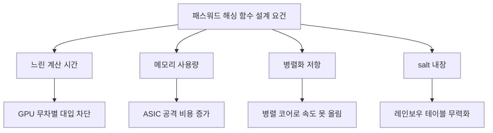
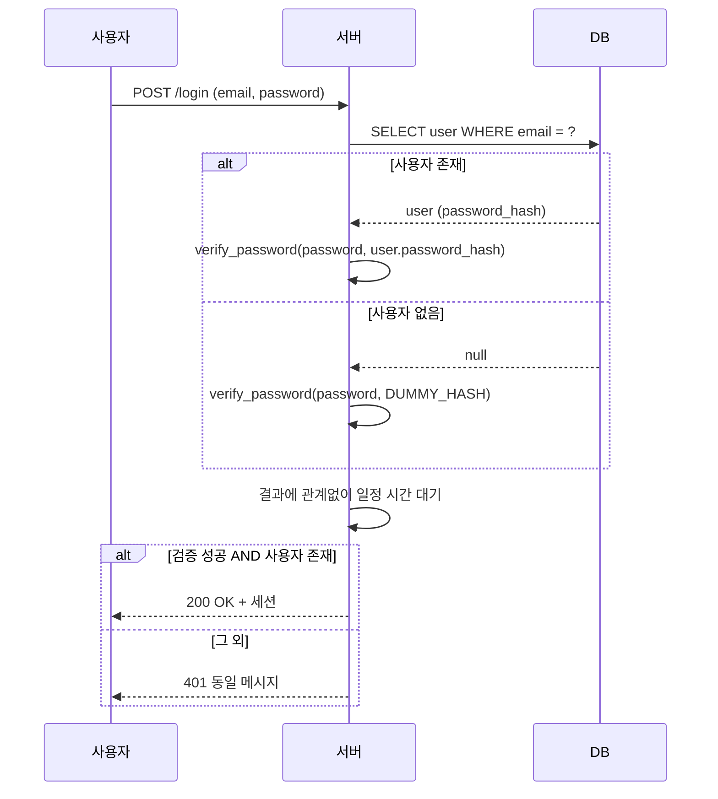
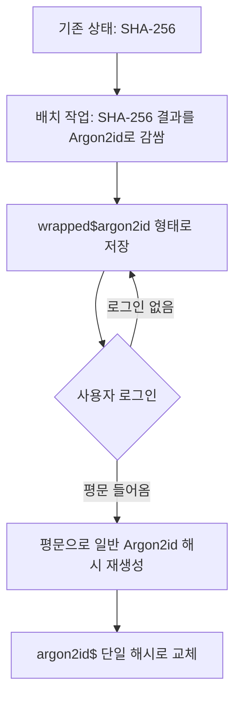

# 패스워드 해싱 (Password Hashing)

## 개요

패스워드를 평문으로 DB에 저장하면 안 된다는 것은 누구나 안다. 그런데 SHA-256으로 한 번 돌려서 저장하는 것도 안 된다. 이 문서는 왜 일반 해시 함수가 패스워드 저장에 부적합한지, bcrypt·scrypt·Argon2id가 어떻게 그 문제를 해결하는지, 실제 서비스에서 어떤 파라미터로 운영해야 하는지 다룬다.

핵심은 두 가지다. 패스워드 해싱은 **느려야 한다**는 점, 그리고 **메모리를 많이 써야 한다**는 점. 일반 해시 함수는 둘 다 만족하지 못한다.

---

## SHA·MD5를 그대로 쓰면 안 되는 이유

### 일반 해시는 너무 빠르다

SHA-256, MD5 같은 해시 함수는 데이터 무결성 검증이나 디지털 서명을 염두에 두고 설계되었다. 즉, **빠를수록 좋다**. 1GB짜리 파일의 무결성을 검증하는 데 30초가 걸린다면 아무도 안 쓸 것이다.

문제는 패스워드 영역에서 이 "빠름"이 정확히 반대로 작용한다는 점이다. 공격자도 빠르게 시도할 수 있다는 뜻이다.

```
GPU 1대 (RTX 4090) 기준 초당 시도 횟수:
- MD5:      ~164,000,000,000 회/초 (1640억)
- SHA-1:    ~50,000,000,000  회/초 (500억)
- SHA-256:  ~22,000,000,000  회/초 (220억)
- bcrypt:   ~200,000          회/초 (cost=12 기준)
- Argon2id: ~3,000            회/초 (m=64MB, t=3 기준)
```

8자리 숫자+영문 소문자(36^8 = 약 2.8조) 패스워드가 SHA-256으로 저장되어 있다면, GPU 1대로 약 2분이면 전수 조사가 끝난다. bcrypt면 같은 작업에 162일, Argon2id면 30년이 넘게 걸린다.

### 레인보우 테이블

패스워드 평문 → SHA-256 해시 매핑을 미리 계산해 둔 거대한 테이블이 인터넷에 떠돌아다닌다. 흔한 패스워드는 이미 모두 해시값까지 알려진 상태다.

`password123`의 SHA-256은 항상 `ef92b778bafe...`다. 사이트 100개에서 같은 사용자가 이 비밀번호를 썼다면, 한 번 유출된 해시 테이블로 100개 사이트를 모두 뚫는다.

이 문제는 **salt**로 해결한다. salt는 사용자마다 랜덤하게 생성한 값을 패스워드에 붙여서 해시하는 방식이다. salt가 다르면 같은 패스워드라도 해시값이 완전히 달라지므로, 미리 계산된 테이블을 무력화한다.

```
salt 없이:
  hash("password123") = ef92b778...
  hash("password123") = ef92b778...   (모든 사용자 동일)

salt 적용:
  hash("password123" + "a3f9...") = 92ab4c01...
  hash("password123" + "7e2c...") = 7c5d3e9f...   (사용자마다 다름)
```

다만 salt만으로는 부족하다. salt는 레인보우 테이블을 막을 뿐, GPU 무차별 대입은 그대로 가능하다. 사용자별로 따로 계산해야 한다는 점만 추가될 뿐이다. **느린 해시**가 함께 필요하다.

---

## 패스워드 해싱 함수의 설계 목표

### 비대칭적 비용

정상적인 사용자가 로그인할 때는 1초도 안 걸려야 한다. 하지만 공격자가 수십억 개의 후보를 시도할 때는 견딜 수 없을 만큼 느려야 한다. 이게 핵심 아이디어다.

서버 입장에서 로그인 1회당 100ms 정도는 부담이 안 된다. 사용자 1명이 매번 100ms를 기다려도 체감하기 힘들다. 그런데 공격자가 패스워드 후보 100억 개를 시도하려면 100ms × 100억 = 32년이 걸린다.

### 메모리 하드니스 (Memory Hardness)

CPU 시간만 늘리는 방식(반복 횟수 증가)에는 한계가 있다. GPU와 ASIC은 단순 계산을 병렬로 어마어마하게 처리한다. SHA-256을 100만 번 반복해도, GPU에서는 1만 코어가 동시에 처리하므로 큰 의미가 없다.

여기서 등장하는 개념이 **메모리 하드니스**다. 계산하는 동안 큰 메모리(예: 64MB)를 사용하도록 강제하면, GPU의 코어당 메모리가 작아서 병렬화가 어려워진다. ASIC도 메모리를 잔뜩 박을수록 단가가 폭증한다.



---

## bcrypt

1999년 Niels Provos와 David Mazières가 OpenBSD를 위해 만들었다. 가장 오래되고 가장 널리 쓰이는 패스워드 해시 함수다.

### Blowfish 기반

bcrypt는 Blowfish 암호의 키 스케줄링 과정을 변형해서 만들었다. Blowfish의 키 스케줄링이 원래도 느린 편인데, 이를 cost factor만큼 반복한다.

### cost factor

bcrypt의 유일한 튜닝 파라미터는 cost factor다. cost가 1 증가하면 계산 시간이 **2배**가 된다.

| cost | 계산 시간 (대략) |
|------|------------------|
| 10   | 100ms            |
| 12   | 400ms            |
| 13   | 800ms            |
| 14   | 1.6s             |
| 15   | 3.2s             |

2026년 기준 권장 cost는 12~13이다. 매년 하드웨어가 빨라지므로 1~2년에 한 번씩 cost를 올려줘야 한다. Moore의 법칙이 둔화되긴 했지만, 그래도 5년 전 cost인 10은 이제 너무 약하다.

### bcrypt의 한계

bcrypt는 **메모리 하드니스가 없다**. 약 4KB의 메모리만 쓴다. 즉, ASIC이나 FPGA로 공격 비용을 낮추기 쉽다. 또한 입력 길이가 **72바이트로 제한**되어 있다. 그 이상은 잘려나간다.

Java나 Node.js의 일부 구현은 패스워드를 SHA-256으로 먼저 해시한 후 bcrypt를 적용해서 길이 제한을 우회한다(이걸 "pre-hashing"이라고 한다). 하지만 이 경우 NULL 바이트가 중간에 들어가면 그 이후가 잘려서 보안이 약해지는 버그가 과거에 있었다(Okta 2024년 사건). 라이브러리를 잘 골라서 쓸 것.

```python
# Python의 bcrypt 사용 예
import bcrypt

# 회원가입 시 해시 생성
password = b"my_secret_password"
salt = bcrypt.gensalt(rounds=12)  # cost factor = 12
hashed = bcrypt.hashpw(password, salt)
# hashed: b'$2b$12$KIXl...'  → DB에 저장

# 로그인 시 검증
if bcrypt.checkpw(password, hashed):
    print("로그인 성공")
```

`gensalt(rounds=12)`로 생성한 salt는 16바이트 랜덤 값이며, 결과 문자열에 cost와 salt가 같이 들어간다. 별도로 salt를 저장할 필요가 없다.

---

## scrypt

2009년 Colin Percival이 Tarsnap 백업 서비스를 위해 만들었다. **메모리 하드니스를 처음 도입**한 패스워드 해시 함수다.

### 메모리·시간 트레이드오프

scrypt는 큰 배열을 메모리에 만들고, 그 배열을 무작위로 접근하면서 해시를 계산한다. 메모리를 줄이려고 하면 같은 값을 다시 계산해야 하므로 시간이 폭증한다. 이걸 **time-memory tradeoff**라고 한다.

ASIC을 만든다고 해도 메모리는 그대로 필요하므로, 칩 크기가 그만큼 커지고 단가가 오른다.

### 파라미터

- **N**: CPU/메모리 비용 (2의 거듭제곱). 2^14 = 16384 정도가 일반적
- **r**: 블록 크기. 보통 8
- **p**: 병렬도. 보통 1

메모리 사용량 ≈ 128 × N × r 바이트. N=16384, r=8이면 약 16MB.

### scrypt의 약점

scrypt는 메모리 접근 패턴이 패스워드에 의존적이다(data-dependent). 이게 **사이드 채널 공격**에 취약할 수 있다. 메모리 접근 타이밍을 관찰해서 패스워드 정보를 일부 추론할 가능성이 있다는 의미다. 실용적인 공격이 알려진 건 아니지만, 이론적 약점으로 지적된다.

또한 N, r, p가 따로 있어서 튜닝이 직관적이지 않다. 이런 점들이 Argon2가 등장한 배경이다.

---

## Argon2id

2015년 Password Hashing Competition(PHC) 우승작이다. 룩셈부르크 대학 연구팀이 만들었다. 현재 **OWASP, IETF(RFC 9106) 권장 표준**이다.

### 세 가지 변형

- **Argon2d**: data-dependent. GPU 저항이 가장 강하지만 사이드 채널에 취약
- **Argon2i**: data-independent. 사이드 채널에 강하지만 GPU 저항이 약함
- **Argon2id**: 앞부분은 i, 뒷부분은 d 방식. **이게 권장 변형**이다

대부분의 라이브러리가 기본값으로 Argon2id를 쓰도록 되어 있다. 특별한 이유가 없다면 그냥 Argon2id를 쓰면 된다.

### 파라미터

세 가지 독립적인 파라미터가 있다.

| 파라미터 | 의미 | 영향 |
|----------|------|------|
| **m (memory)** | 메모리 사용량 (KB)   | 클수록 ASIC 저항 강해짐 |
| **t (iterations)** | 반복 횟수             | 클수록 계산 시간 증가 |
| **p (parallelism)** | 병렬 스레드 수       | CPU 코어 활용도 |

### 권장값 (OWASP 2026)

```
- m = 47104 (46 MiB), t = 1, p = 1   ← 메모리 우선
- m = 19456 (19 MiB), t = 2, p = 1
- m = 12288 (12 MiB), t = 3, p = 1
- m = 9216  (9 MiB),  t = 4, p = 1
- m = 7168  (7 MiB),  t = 5, p = 1   ← 메모리 부족한 환경
```

서비스 환경에 따라 골라 쓰면 된다. 기본은 첫 번째 옵션이다. 메모리가 부족하다면 아래로 내려가되, t를 키워서 보상한다.

### 파라미터 튜닝의 실제

운영 환경에서 가장 많이 묻는 질문이 "어떤 값으로 설정해야 하느냐"다. 정답은 **로그인 1회당 0.5~1초가 걸리도록** 맞추는 것이다.

```python
import argon2
import time

ph = argon2.PasswordHasher(
    time_cost=3,      # t
    memory_cost=65536, # m, 64MB
    parallelism=4,    # p
)

start = time.time()
hashed = ph.hash("test_password")
elapsed = time.time() - start
print(f"{elapsed*1000:.0f}ms")  # 목표: 500~1000ms
```

벤치마크 후 너무 빠르면 m이나 t를 늘리고, 너무 느리면 줄인다. 한 번 설정해 두면 끝나는 게 아니라, **2년마다 재벤치마크**하는 게 좋다. 하드웨어가 빨라지면 같은 파라미터로도 계산 시간이 줄어들기 때문이다.

서비스 트래픽도 고려해야 한다. 로그인 피크 시 초당 100건이 들어오는데 한 건당 1초씩 잡아먹으면 100코어를 풀로 쓴다. 이런 경우엔 m을 키우고 t를 줄이는 쪽이 낫다(메모리는 동시 사용자 수에 비례하므로 캐시 미스가 늘어 결국 비슷해지지만, CPU 점유는 줄어든다).

---

## bcrypt vs scrypt vs Argon2id

| 항목 | bcrypt | scrypt | Argon2id |
|------|--------|--------|----------|
| **출시** | 1999 | 2009 | 2015 |
| **메모리 하드니스** | 없음 (4KB) | 있음 | 있음 (튜닝 가능) |
| **GPU 저항** | 보통 | 강함 | 매우 강함 |
| **ASIC 저항** | 약함 | 강함 | 매우 강함 |
| **사이드 채널** | 안전 | 약함 | id 변형은 안전 |
| **튜닝 직관성** | 매우 쉬움 | 보통 | 유연함 |
| **입력 길이 제한** | 72바이트 | 없음 | 없음 |
| **표준화** | 사실상 표준 | RFC 7914 | RFC 9106 |
| **라이브러리 지원** | 매우 많음 | 많음 | 늘어나는 중 |

### 어떤 걸 골라야 하나

신규 프로젝트라면 **Argon2id**다. 표준이 가장 최신이고, 메모리·시간·병렬도를 독립적으로 조절할 수 있다.

기존 프로젝트가 bcrypt를 쓰고 있다면 굳이 옮길 필요는 없다. cost factor를 12 이상으로 유지하면 충분히 안전하다. 마이그레이션 비용 대비 효용이 크지 않다.

scrypt는 새로 시작할 이유가 거의 없다. 이미 채택했다면 유지해도 되지만, Argon2id 쪽이 더 권장된다.

---

## salt와 pepper

### salt

salt는 **사용자마다 다른 랜덤 값**이다. DB의 같은 컬럼에 해시값과 함께 저장한다. 비공개일 필요는 없다.

salt의 목적은 두 가지다.

1. **레인보우 테이블 무력화**: 미리 계산된 테이블이 무용지물이 됨
2. **같은 패스워드 사용자 식별 차단**: 두 사용자가 같은 비밀번호를 써도 해시값이 다름

salt는 **16바이트 이상의 암호학적 난수**여야 한다. 보통 라이브러리가 알아서 생성해 준다. 직접 생성한다면 `os.urandom(16)`이나 `secrets.token_bytes(16)` 같은 안전한 난수원을 써야 한다. 시간 기반이나 사용자 ID 같은 예측 가능한 값은 절대 안 된다.

### pepper

pepper는 **모든 사용자가 공유하는 비밀 값**이다. 보통 환경 변수나 별도 KMS(Key Management Service)에 저장하고, **DB에는 절대 넣지 않는다**.

```
패스워드 해싱 흐름:
  hash(패스워드 + salt + pepper)

salt:   DB에 저장        → 사용자마다 다름
pepper: 코드/KMS에 저장   → 모든 사용자 공통
```

pepper의 목적은 **DB만 유출되었을 때**의 추가 방어선이다. DB 덤프만 손에 넣은 공격자는 pepper를 모르므로 무차별 대입이 불가능하다. 단, 서버 코드까지 같이 털리면 효과가 없다.

pepper는 약간의 논쟁이 있는 주제다. 적절히 운영하면 분명한 추가 방어선이지만, 키 로테이션이 어렵고(사용자 패스워드를 다 다시 해시해야 함) 운영 복잡도가 올라간다. 작은 서비스라면 굳이 안 써도 된다. 금융이나 의료 같은 고위험 서비스라면 도입을 고려해 볼 만하다.

### HMAC 방식 pepper

pepper를 단순히 패스워드에 이어붙이는 것보다, **HMAC**으로 적용하는 방식이 안전하다.

```python
import hmac
import hashlib

# pepper는 환경변수에서 로드
pepper = os.environ["PASSWORD_PEPPER"].encode()

# HMAC으로 pepper 적용 후 Argon2id로 해싱
def hash_password(password: str) -> str:
    peppered = hmac.new(pepper, password.encode(), hashlib.sha256).digest()
    return ph.hash(peppered)
```

이렇게 하면 Argon2id의 입력 길이가 32바이트(SHA-256 출력 크기)로 고정되므로 길이 제한 문제도 같이 해결된다.

---

## DB 저장 형식

### PHC 문자열 포맷

bcrypt, scrypt, Argon2id 모두 **PHC(Password Hashing Competition) 문자열 포맷**을 따른다. 알고리즘 정보, 파라미터, salt, 해시값을 한 문자열에 모아서 저장한다.

```
bcrypt 예시:
$2b$12$KIXlqVJ8hC0n1gW.WzHj1.zBmZ9JGgQs5O0h5L9YqYqYqYqYqYqYq
 │  │  │                       │
 │  │  │                       └── 해시값 (31자)
 │  │  └── salt (22자, base64)
 │  └── cost factor (12)
 └── 알고리즘 식별자 ($2b = bcrypt)

Argon2id 예시:
$argon2id$v=19$m=65536,t=3,p=4$c29tZXNhbHQ$RdescudvJCsgt3ub+b+dWRWJTmaaJObG
 │         │    │              │            │
 │         │    │              │            └── 해시값
 │         │    │              └── salt
 │         │    └── 파라미터
 │         └── 버전
 └── 알고리즘
```

### 저장 컬럼 설계

```sql
CREATE TABLE users (
    id           BIGINT PRIMARY KEY,
    email        VARCHAR(255) UNIQUE NOT NULL,
    password_hash VARCHAR(255) NOT NULL,  -- PHC 문자열 그대로
    created_at   TIMESTAMP DEFAULT NOW(),
    updated_at   TIMESTAMP DEFAULT NOW()
);
```

알고리즘이나 파라미터를 별도 컬럼으로 분리하지 않는 게 좋다. PHC 문자열에 다 들어 있고, 라이브러리가 알아서 파싱한다. 분리하면 마이그레이션할 때 복잡해진다.

`VARCHAR(255)`로 잡아 두면 어떤 알고리즘이든 들어간다. bcrypt는 60자, Argon2id는 보통 100자 내외다.

---

## 타이밍 공격 방지

### 문자열 비교의 함정

해시값을 비교할 때 일반 문자열 비교(`==`)를 쓰면 안 된다. 보통의 문자열 비교는 첫 글자가 다르면 즉시 false를 반환한다. 이 시간 차이를 측정하면 한 글자씩 맞춰가며 해시값을 알아낼 수 있다.

```python
# 위험: 일반 비교
if stored_hash == computed_hash:  # 절대 이렇게 하지 말 것
    return True

# 안전: 상수 시간 비교
import hmac
if hmac.compare_digest(stored_hash, computed_hash):
    return True
```

`hmac.compare_digest`는 길이가 다르거나 첫 글자가 달라도 항상 같은 시간이 걸린다. bcrypt나 Argon2id 라이브러리의 `verify` 함수는 내부적으로 이걸 쓴다.

### 사용자 존재 여부도 노출되면 안 된다

```python
# 안 좋은 패턴
def login(email, password):
    user = db.find_user(email)
    if not user:
        return "사용자 없음"  # 빠르게 응답 (해시 계산 안 함)
    if not verify(password, user.password_hash):
        return "비밀번호 틀림"  # 느리게 응답 (해시 계산 함)
```

응답 시간 차이로 어떤 이메일이 가입되어 있는지 알 수 있다. 사용자 열거(user enumeration) 공격에 취약하다.

```python
# 개선: 더미 해시로 시간 맞추기
DUMMY_HASH = ph.hash("dummy_password")  # 서버 시작 시 미리 계산

def login(email, password):
    user = db.find_user(email)
    target_hash = user.password_hash if user else DUMMY_HASH
    valid = verify_password(password, target_hash)
    if not user or not valid:
        return "이메일 또는 비밀번호가 틀렸습니다"
    return success_response(user)
```

사용자가 없어도 더미 해시에 대해 검증을 수행하므로, 응답 시간이 비슷해진다. 응답 메시지도 "이메일이 없습니다"와 "비밀번호가 틀립니다"를 구분하지 말고 통일해야 한다.

### 로그인 흐름 전체



---

## 마이그레이션 전략

기존에 SHA-256으로 저장된 패스워드를 bcrypt나 Argon2id로 옮기는 건 흔히 마주치는 상황이다. **사용자 패스워드 평문을 모르므로 일괄 변환이 불가능**하다는 점이 핵심이다.

### 두 가지 접근

#### 1. 점진적 마이그레이션 (느슨한 방식)

사용자가 다음 로그인 시 평문이 들어오면 그때 새 알고리즘으로 다시 해시한다. 기존 해시는 그대로 두고, 사용자가 로그인할 때마다 하나씩 옮긴다.

```python
def login(email, password):
    user = db.find_user(email)
    if not user:
        return error()

    # 새 알고리즘 해시인지 확인
    if user.password_hash.startswith("$argon2id$"):
        if not ph.verify(user.password_hash, password):
            return error()
    elif user.password_hash.startswith("sha256$"):
        # 기존 SHA-256 검증
        old_hash = sha256_with_salt(password, user.salt)
        if old_hash != user.password_hash.split("$")[1]:
            return error()
        # 검증 성공 → 새 해시로 교체
        new_hash = ph.hash(password)
        db.update_password_hash(user.id, new_hash)

    return success(user)
```

장점: 사용자 영향 없음. 점진적이라 부담이 적음.
단점: 비활성 사용자는 영원히 SHA-256으로 남는다. 1년 뒤에도 절반은 미마이그레이션 상태일 수 있다.

#### 2. 즉시 마이그레이션 (강제 방식)

기존 SHA-256 해시 값을 한 번에 bcrypt 같은 새 알고리즘으로 **이중 해시**한다. 즉, 평문 → SHA-256 → bcrypt 형태로 변환한다.

```python
# 마이그레이션 배치 작업 (1회 실행)
for user in db.get_all_users():
    if user.password_hash.startswith("sha256$"):
        old_sha_hash = user.password_hash.split("$")[1]
        new_hash = ph.hash(old_sha_hash)  # SHA-256 해시값을 입력으로
        db.update_password_hash(user.id, "wrapped$" + new_hash)
```

로그인 시에는 평문을 같은 방식으로 처리한다.

```python
def verify_wrapped(password, wrapped_hash):
    sha = hashlib.sha256((password + salt).encode()).hexdigest()
    return ph.verify(wrapped_hash[len("wrapped$"):], sha)
```

장점: 즉시 모든 사용자가 보안 강화됨.
단점: 알고리즘 식별 로직이 복잡해진다. 사용자가 다음에 비밀번호를 변경할 때 일반 Argon2id로 다시 옮기는 후처리가 필요하다.

### 실제로는 둘을 섞어 쓴다

현실적으로는 **즉시 마이그레이션**으로 모든 사용자를 한 번에 bcrypt/Argon2id로 감싸고, 그 후 로그인할 때마다 평문을 직접 새 해시로 교체한다.



3개월 정도 운영하면 활성 사용자 대부분이 단일 Argon2id 해시로 옮겨진다. 비활성 사용자는 wrapped 상태로 남지만, 그래도 SHA-256 단일보다는 훨씬 안전하다.

### 마이그레이션 시 주의사항

- **알고리즘 식별자**를 PHC 포맷으로 통일해 두면 코드가 깔끔해진다. `wrapped$`, `legacy_sha256$` 같은 prefix를 자체 정의하더라도 일관성이 중요하다.
- **로그**에 평문이 찍히지 않도록 한다. 디버깅 중 무심코 패스워드 평문을 로깅하는 사고가 흔하다.
- **비밀번호 변경 강제**는 사용자 경험을 망친다. 정말 필요한 경우(예: SHA-1 + salt 없음 같은 매우 약한 상태)에만 한다.
- **자동 파라미터 업그레이드**를 함께 구현하면 좋다. 라이브러리가 제공하는 `needs_rehash` 같은 함수로 cost가 낮은 해시를 감지해서 자동으로 재해시한다.

```python
def login(email, password):
    user = db.find_user_or_dummy(email)
    if not ph.verify(user.password_hash, password):
        return error()

    # 파라미터가 낮으면 자동 업그레이드
    if ph.check_needs_rehash(user.password_hash):
        new_hash = ph.hash(password)
        db.update_password_hash(user.id, new_hash)

    return success(user)
```

---

## 정리

패스워드 저장은 단순히 해시 함수를 한 번 돌리는 일이 아니다. SHA-256 같은 일반 해시는 너무 빨라서 GPU 무차별 대입에 무력하다. 그래서 일부러 느리게 만든 패스워드 해시 함수가 필요하다.

신규 프로젝트라면 **Argon2id**, 기존에 bcrypt를 쓰고 있다면 cost factor를 12 이상으로 유지하면 된다. salt는 라이브러리가 알아서 처리하지만, pepper는 직접 운영해야 한다(고위험 서비스에 한정).

타이밍 공격을 막으려면 해시 비교에 `compare_digest`를 쓰고, 사용자가 없을 때도 더미 해시로 검증해서 응답 시간을 맞춘다. 마이그레이션은 즉시 wrapping + 점진적 재해싱 조합이 현실적이다.

가장 중요한 건 **2년에 한 번씩 파라미터를 재검토**하는 운영 절차다. 한 번 설정하고 잊어버리면, 5년 뒤엔 cost가 너무 낮아져서 무력해진다. 이게 코드보다 더 자주 놓치는 부분이다.
