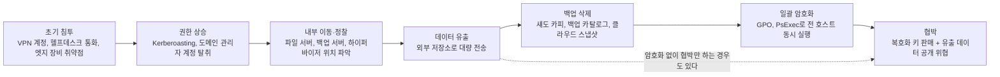
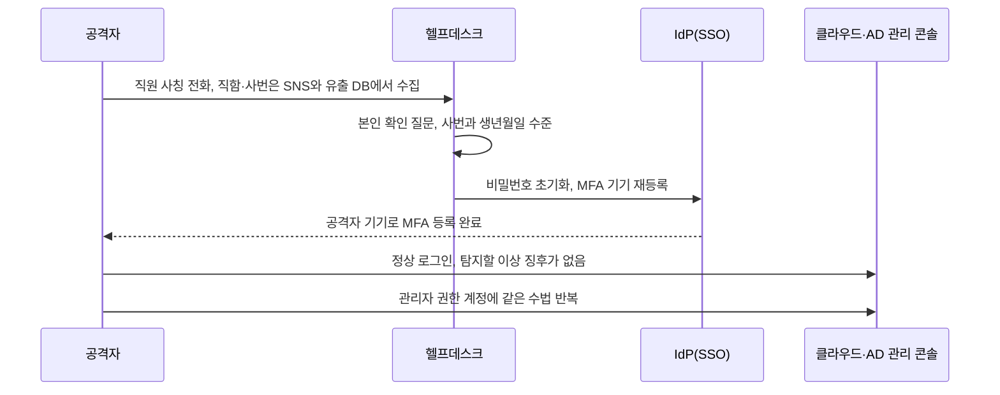
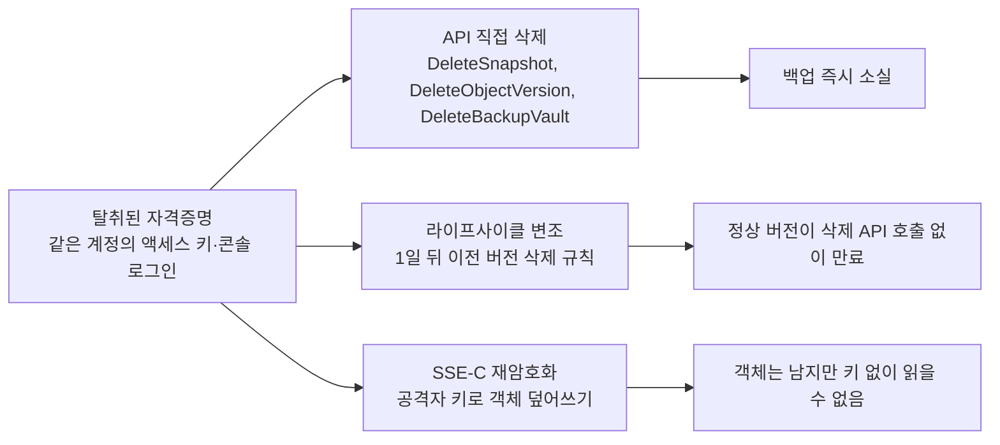
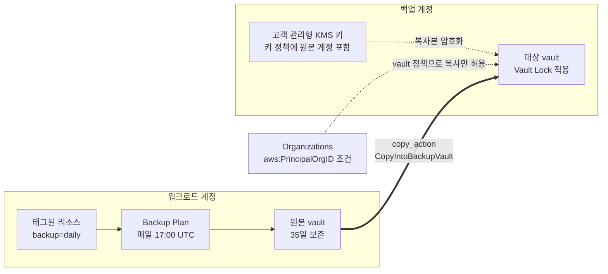
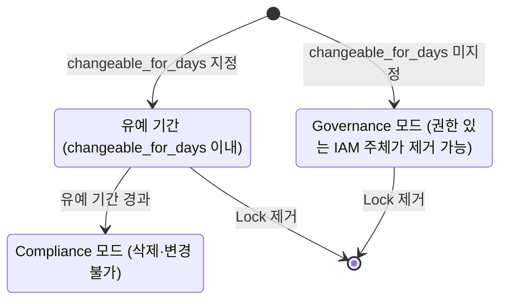
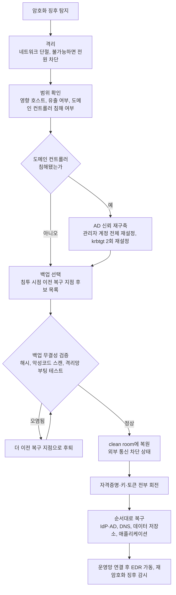
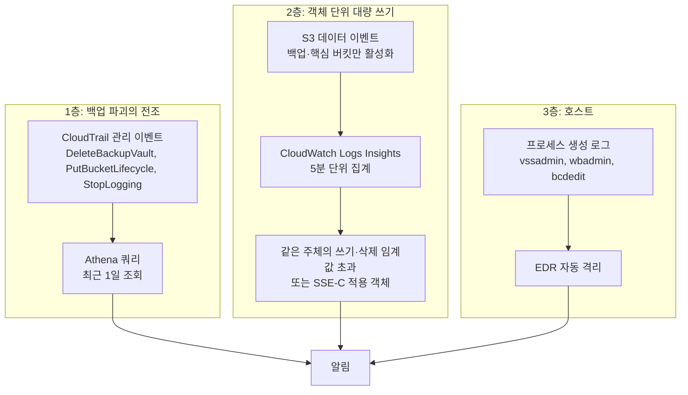
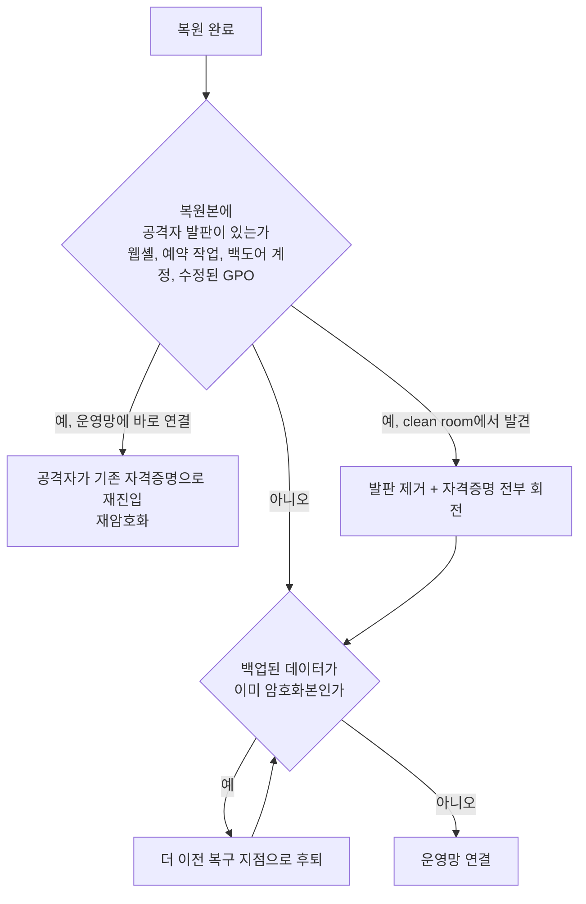

# 랜섬웨어 사고 대응과 복구

랜섬웨어 사고에서 파일 암호화는 마지막 단계다. 그 앞에서 공격자는 며칠에서 몇 주 동안 내부망에 머물며 도메인 관리자 권한을 얻고, 데이터를 빼내고, 백업을 지운다. 암호화 화면이 뜬 시점에 이미 복구 수단의 상당 부분이 사라져 있는 경우가 많다. 그래서 랜섬웨어 대응은 "암호화를 막는 문제"보다 "백업과 신원 시스템을 마지막까지 지키는 문제"에 가깝다.

일반적인 사고 대응 절차는 [보안 사고 대응 절차](Incident_Response.md)에 있고, 사고 연표는 [최근 보안사고 사례 2021~2025](Recent_Security_Incidents.md)에 있다. 이 문서는 랜섬웨어에 한정해서 침투 경로, 백업이 지워지는 방식, 삭제에 버티는 백업 구성, 사고 중 복구 순서, 리허설에서 드러나는 문제를 다룬다.

## 공식 문서로 확인된 침투 경로

사례는 정부 어드바이저리, 의회 증언, 상장사 공시, 피해 회사 공지처럼 출처가 있는 것만 적는다. 침투 경로가 공식적으로 확인되지 않은 부분은 그렇다고 적었다.

| 사고 | 시점 | 확인된 침투 경로 | 확인된 피해 | 출처 |
|---|---|---|---|---|
| Colonial Pipeline | 2021-05 | 사용하지 않던 레거시 VPN 계정의 비밀번호 하나. MFA 없음 | 파이프라인 운영 자진 중단, 75 BTC 지급 | CISA·FBI AA21-131A, 경영진의 의회 청문회 증언 |
| Change Healthcare | 2024-02 | MFA가 없는 Citrix 원격 접속 포털 | 약 2,200만 달러 지급 | CEO의 하원 청문회 서면 증언(2024-05) |
| MGM Resorts | 2023-09 | 공시는 경로를 밝히지 않음. 헬프데스크 통화로 시작됐다는 내용은 사고 후 보도와 CISA의 Scattered Spider 어드바이저리가 설명하는 수법과 일치함 | 3분기 영업이익 약 1억 달러 영향 | MGM 8-K(2023-10), CISA AA23-320A |
| Code Spaces | 2014-06 | AWS 콘솔 계정 접근, 삭제를 전제로 한 협박 | EBS 스냅샷·S3·AMI 일부 삭제, 사업 중단 | 피해 회사 공지 |
| Codefinger | 2025-01 | 유출된 AWS 액세스 키로 S3 객체를 SSE-C로 재암호화 | 고객 버킷 객체 접근 불가 | Halcyon 분석 보고서 |

Code Spaces는 랜섬웨어가 아니라 계정 탈취 후 삭제 협박이지만, 백업이 같은 계정에 있으면 어떻게 되는지를 가장 일찍 보여준 사례라 넣었다. Colonial과 Change Healthcare는 공통점이 뚜렷하다. 둘 다 MFA가 없는 원격 접속 경로 하나가 입구였다. 침투 수법이 정교했다는 이야기가 아니라 인터넷에 열린 인증 지점 하나에 비밀번호 외 방어선이 없었다는 이야기다.

## 침투부터 협박까지

랜섬웨어 그룹은 암호화 이전 단계에서 거의 같은 순서를 밟는다. 단계마다 걸리는 시간은 사고마다 다르다.



도식에서 볼 것은 데이터 유출(D)이 백업 삭제(E)와 암호화(F)보다 앞에 있다는 점이다. 암호화가 시작되기 전에 이미 두 번째 협박 수단이 공격자 손에 들어가 있다. 점선은 아예 암호화를 건너뛰고 유출 데이터만으로 협박하는 경우다. 이 경우 백업이 멀쩡해도 복구가 해결책이 되지 않는다.

### 이중 갈취

암호화만 하던 시절에는 백업이 있으면 몸값을 낼 이유가 없었다. 그래서 공격자는 암호화 전에 데이터를 먼저 가져간다. 백업으로 복구해도 "고객 데이터를 공개하겠다"는 협박이 남는다. CISA·FBI의 DarkSide 어드바이저리(AA21-131A)도 이 방식을 이중 갈취로 기술한다.

이중 갈취가 바꾸는 것은 대응 순서다. 백업 복구가 가능하더라도 법적 통지, 개인정보 유출 신고, 고객 공지가 따로 돌아간다. 복구팀과 별개로 "무엇이 나갔는가"를 확인하는 팀이 필요하다. 이 판단의 근거는 방화벽·프록시·클라우드 flow log의 외부 송신량이고, 사고 전에 이 로그를 보관하고 있지 않으면 유출 범위를 증명하지 못해서 "전체 유출"로 가정하고 통지해야 한다. 로그 보관은 [보안 로깅과 감사](Security_Logging_and_Auditing.md)에서 다룬다.

### 도메인 컨트롤러 장악과 일괄 배포

수백 대 서버를 동시에 암호화하려면 공격자는 각 서버에 파일을 하나씩 올릴 수 없다. 도메인 관리자 권한을 얻은 뒤 그룹 정책(GPO)의 예약 작업, PsExec, 설치 관리 도구(SCCM 등) 중 하나로 실행 파일을 전 호스트에 뿌린다. 예약 시각을 같은 값으로 맞추면 야간이나 주말에 모든 호스트가 같은 순간 암호화를 시작한다. 알림이 울려서 사람이 모이기 전에 끝난다.

권한 상승 단계에서 흔한 길은 서비스 계정의 약한 비밀번호를 Kerberoasting으로 오프라인 크래킹하는 것, 그리고 도메인 관리자가 로그인한 서버에서 메모리의 자격증명을 꺼내는 것이다. 후자는 관리자가 일반 업무용 서버에 도메인 관리자 계정으로 로그인한다는 관행에서 나온다. 도메인 관리자 계정은 도메인 컨트롤러와 전용 관리 단말에서만 로그인하게 하고, 다른 서버에서는 로그인 거부 정책을 걸어야 한다. 이 한 가지 설정이 일괄 배포 단계까지 가는 길을 끊는 경우가 많다.

도메인 컨트롤러가 넘어가면 복구 난이도가 달라진다. 백업이 멀쩡해도 AD 자체를 신뢰할 수 없어서 새 포리스트를 올리거나 AD를 이전 시점으로 복원하고 krbtgt 계정 비밀번호를 두 번 재설정해야 한다. 이 작업이 걸리는 시간은 문서에 적힌 RTO에 대개 들어 있지 않다.

## Scattered Spider 계열의 사회공학 침투

CISA는 Scattered Spider 어드바이저리(AA23-320A)에서 이 그룹이 취약점 대신 사람을 통해 들어온다고 기술한다. 직원을 사칭해 IT 헬프데스크에 전화를 걸고, 비밀번호와 MFA 등록 기기를 재설정하게 만든다. 푸시 승인을 연속으로 보내 피로하게 만드는 MFA fatigue, 통신사 직원을 속여 번호를 옮기는 SIM swap도 같은 문서에 있다. Okta도 2023년에 IT 서비스 데스크 직원을 노린 사회공학 공격이 슈퍼 관리자 권한 탈취로 이어진 사례를 공지했다. 2025년 7월 갱신본에는 VMware ESXi 하이퍼바이저를 겨냥한 랜섬웨어 배포가 언급된다.



시퀀스에서 볼 것은 5번째 줄이다. 공격자가 IdP에 정상 자격증명과 정상 MFA로 로그인하기 때문에 로그인 로그만 보면 이상이 없다. 막을 수 있는 지점은 2~3번째 줄, 헬프데스크의 본인 확인과 재설정 절차밖에 없다.

헬프데스크 절차에서 실제로 고쳐야 하는 것은 세 가지다. 본인 확인 질문이 공개 정보(사번, 생년월일, 입사일)로 답할 수 있는 수준이면 질문이 아니다. 콜백은 통화 상대가 알려준 번호가 아니라 인사 시스템에 등록된 번호로 건다. 관리자 권한 계정의 MFA 재설정은 헬프데스크 단독으로 끝낼 수 없게 하고 상위 승인자와 영상 통화 확인을 요구한다. 개발자 입장에서는 IdP와 클라우드 관리자 계정이 헬프데스크 한 통화로 재설정되는 구조인지 먼저 물어보는 것이 가장 빠른 점검이다. AWS IAM Identity Center나 Okta의 관리자 그룹이 일반 직원과 같은 재설정 경로를 쓰고 있으면 거기가 입구다.

## 백업이 먼저 지워진다

공격자는 복구 수단이 있으면 몸값을 받기 어렵다는 것을 안다. 그래서 암호화 직전에 복구 수단부터 지운다. 호스트 쪽에서는 `vssadmin delete shadows /all /quiet`, `wbadmin delete catalog`, `bcdedit /set {default} recoveryenabled no` 같은 명령이 암호화 직전 몇 초 안에 실행되는 것이 알려진 패턴이다. 백업 소프트웨어 쪽에서는 백업 서버가 도메인에 가입되어 있고 같은 관리자 계정으로 접근되면 백업 저장소와 카탈로그가 같이 지워진다. 가상화 환경에서는 ESXi에 접속해 VM 스냅샷을 삭제하고 VMDK를 직접 암호화한다.

클라우드에서 같은 일이 벌어지는 방식은 세 가지로 갈린다.

첫째는 Code Spaces 식 삭제다. 같은 계정에서 탈취된 자격증명으로 `DeleteSnapshot`, `DeleteObjectVersion`, `DeleteBackupVault`을 호출한다. 둘째는 라이프사이클 변조다. 버킷에 "1일 뒤 이전 버전 삭제" 규칙을 넣으면 삭제 API를 한 번도 부르지 않고 정상 버전이 사라진다. 셋째는 Codefinger 식 재암호화다. 객체를 공격자가 만든 키로 SSE-C 암호화해서 덮어쓰면 AWS 입장에서는 정상 요청이고, 키를 모르면 읽을 수 없다. Halcyon 분석에 따르면 이 경우 라이프사이클로 7일 뒤 삭제를 걸어 시간 압박까지 더했다.



도식에서 볼 것은 세 경로가 모두 같은 입구(탈취된 자격증명)에서 갈라지고, 결과만 즉시 소실·지연 소실·읽기 불가로 다르다는 점이다.

세 방식의 공통점은 공격자가 새 취약점을 쓰지 않았다는 것이다. 정상 API를 정상 자격증명으로 호출했다. 그래서 대응은 권한을 줄이는 것보다 삭제 자체가 시간적으로 불가능하게 만드는 쪽에 무게가 실린다.

### 백업 방식별 삭제 내성

| 방식 | 클라우드 계정 자격증명 탈취 시 | 도메인 관리자·IdP 탈취 시 | 복구 속도 | 남는 약점 |
|---|---|---|---|---|
| 같은 계정의 일반 스냅샷 | 삭제된다. API 한 번이면 끝 | 삭제된다 | 빠르다 | Code Spaces가 이 구조였다 |
| S3 Versioning만 켠 버킷 | 덮어쓰기는 이전 버전이 남지만, `DeleteObjectVersion` 권한이 있으면 영구 삭제된다 | 같다 | 객체 단위 복구가 쉽다 | 라이프사이클 규칙 변조, 버전 영구 삭제 권한 |
| S3 Object Lock Compliance | 보존 기간 동안 삭제도 단축도 안 된다. root도 마찬가지다 | 같다 | 같은 리전이라 빠르다 | 보존 기간이 지나면 지워진다. 정상본과 오염본이 섞여 쌓인다 |
| 오프라인(테이프, 분리 매체) | 네트워크에서 닿지 않아 영향 없다 | 물리 접근이 필요해 영향 없다 | 느리다. 반출과 마운트 시간이 든다 | 갱신 주기가 길어 RPO가 크다. 복원 검증을 안 하면 읽히는지 모른다 |
| 교차 계정 vault + Vault Lock | 원본 계정 키만으로는 삭제할 수 없다 | 조직 관리 계정이나 백업 계정까지 뚫리면 무너진다. Lock이 Compliance로 굳은 뒤에는 삭제 불가 | 리전 간 복사가 끼면 느려진다 | 백업 계정의 분리 수준이 곧 내성이다. KMS 키 접근권한이 복구 병목이 된다 |

표에서 도메인 관리자 탈취까지 버티는 것은 Object Lock Compliance, 오프라인, 굳은 Vault Lock이다. 이 셋이 공통으로 쓰는 원리는 "권한이 있어도 시간이 지나기 전에는 지울 수 없다"와 "네트워크에서 닿지 않는다"이고, 권한 설계에 기대지 않는다. 비용은 보존 기간 동안 용량이 쌓이는 것이다. 30일 보존이면 하루 변경분 30일 치가 항상 남아 있다.

### S3 Object Lock과 Versioning

Object Lock은 버전이 있는 버킷에서만 동작한다. 새 버킷은 생성 시점에 켜고, 기존 버킷은 2023년 말부터 Versioning을 켠 상태에서 `put-object-lock-configuration`으로 켤 수 있다. 기본 보존 설정은 이후에 쓰이는 객체에만 적용되고 이미 있던 객체는 잠기지 않는다. 기존 객체는 `put-object-retention`이나 S3 Batch Operations로 따로 잠가야 한다.

```bash
aws s3api put-bucket-versioning \
  --bucket corp-backup-vault-prod \
  --versioning-configuration Status=Enabled

aws s3api put-object-lock-configuration \
  --bucket corp-backup-vault-prod \
  --object-lock-configuration '{
    "ObjectLockEnabled": "Enabled",
    "Rule": {"DefaultRetention": {"Mode": "GOVERNANCE", "Days": 30}}
  }'
```

처음에는 GOVERNANCE로 시작한다. GOVERNANCE는 `s3:BypassGovernanceRetention` 권한이 있으면 풀 수 있어서 설정 실수를 되돌릴 수 있다. 보존 기간을 잘못 잡고 COMPLIANCE로 걸면 그 기간 동안 요금을 내면서 기다리는 것 말고는 방법이 없다. 운영하면서 라이프사이클 규칙과 복구 절차를 확인한 뒤 COMPLIANCE로 올린다. Terraform으로는 이렇게 쓴다.

```hcl
resource "aws_s3_bucket" "vault" {
  bucket              = "corp-backup-vault-prod"
  object_lock_enabled = true
}

resource "aws_s3_bucket_versioning" "vault" {
  bucket = aws_s3_bucket.vault.id
  versioning_configuration {
    status = "Enabled"
  }
}

resource "aws_s3_bucket_object_lock_configuration" "vault" {
  bucket     = aws_s3_bucket.vault.id
  depends_on = [aws_s3_bucket_versioning.vault]

  rule {
    default_retention {
      mode = "COMPLIANCE"
      days = 30
    }
  }
}

resource "aws_s3_bucket_lifecycle_configuration" "vault" {
  bucket     = aws_s3_bucket.vault.id
  depends_on = [aws_s3_bucket_versioning.vault]

  rule {
    id     = "expire-noncurrent-after-lock"
    status = "Enabled"
    filter {}

    noncurrent_version_expiration {
      noncurrent_days = 45
    }
  }
}

data "aws_iam_policy_document" "deny_ssec" {
  statement {
    sid       = "DenySSEC"
    effect    = "Deny"
    actions   = ["s3:PutObject"]
    resources = ["${aws_s3_bucket.vault.arn}/*"]

    principals {
      type        = "*"
      identifiers = ["*"]
    }

    condition {
      test     = "Null"
      variable = "s3:x-amz-server-side-encryption-customer-algorithm"
      values   = ["false"]
    }
  }
}

resource "aws_s3_bucket_policy" "vault" {
  bucket = aws_s3_bucket.vault.id
  policy = data.aws_iam_policy_document.deny_ssec.json
}
```

라이프사이클의 `noncurrent_days`는 Object Lock 보존 일수보다 크게 잡는다. 반대로 잡으면 만료 규칙이 잠긴 버전을 지우지 못하고 계속 시도하는 상태가 되어 규칙이 의도와 다르게 동작한다. 버킷 정책의 SSE-C 거부는 Codefinger 방식을 막는 조건이다. 헤더가 존재하는 요청, 즉 `Null` 조건이 `false`인 요청을 거부한다. 백업 버킷은 SSE-C를 쓸 이유가 없어서 막아도 정상 동작에 영향이 없다. 조직 전체로 막으려면 같은 조건을 SCP에 넣는다.

### 교차 계정 백업 vault

워크로드 계정과 백업 계정을 AWS Organizations에서 분리하고, 백업은 워크로드 계정에서 만들어 백업 계정의 vault로 복사한다. 백업 계정에는 사람이 일상적으로 로그인하지 않고 워크로드 계정의 자격증명으로는 접근할 수 없다. 복사 대상 vault에는 Vault Lock을 걸어 보존 기간 안에는 삭제할 수 없게 한다. 교차 계정 복사에는 기본 `aws/backup` 키가 아닌 고객 관리형 KMS 키가 필요하고, 키 정책에 원본 계정이 들어 있어야 한다.



도식에서 볼 것은 화살표가 원본 계정에서 백업 계정 쪽으로만 향한다는 점이다. 워크로드 계정의 자격증명은 복사를 밀어 넣을 수는 있어도 대상 vault의 복구 지점을 지우는 방향의 권한은 없다.

```hcl
provider "aws" {
  alias = "backup"
  assume_role {
    role_arn = "arn:aws:iam::${var.backup_account_id}:role/terraform-backup-admin"
  }
}

resource "aws_kms_key" "backup_dest" {
  provider            = aws.backup
  description         = "cross-account backup vault"
  enable_key_rotation = true
  policy = jsonencode({
    Version = "2012-10-17"
    Statement = [
      {
        Sid       = "BackupAccountAdmin"
        Effect    = "Allow"
        Principal = { AWS = "arn:aws:iam::${var.backup_account_id}:root" }
        Action    = "kms:*"
        Resource  = "*"
      },
      {
        Sid       = "SourceAccountCopy"
        Effect    = "Allow"
        Principal = { AWS = "arn:aws:iam::${var.source_account_id}:root" }
        Action    = ["kms:Encrypt", "kms:GenerateDataKey*", "kms:DescribeKey", "kms:ReEncrypt*", "kms:CreateGrant"]
        Resource  = "*"
      }
    ]
  })
}

resource "aws_backup_vault" "dest" {
  provider    = aws.backup
  name        = "cross-account-vault"
  kms_key_arn = aws_kms_key.backup_dest.arn
}

resource "aws_backup_vault_lock_configuration" "dest" {
  provider            = aws.backup
  backup_vault_name   = aws_backup_vault.dest.name
  min_retention_days  = 14
  max_retention_days  = 365
  changeable_for_days = 3
}

resource "aws_backup_vault_policy" "dest" {
  provider          = aws.backup
  backup_vault_name = aws_backup_vault.dest.name
  policy = jsonencode({
    Version = "2012-10-17"
    Statement = [{
      Effect    = "Allow"
      Principal = { AWS = "*" }
      Action    = "backup:CopyIntoBackupVault"
      Resource  = "*"
      Condition = { StringEquals = { "aws:PrincipalOrgID" = var.org_id } }
    }]
  })
}

resource "aws_backup_plan" "daily" {
  name = "daily-with-cross-account-copy"

  rule {
    rule_name         = "daily"
    target_vault_name = aws_backup_vault.src.name
    schedule          = "cron(0 17 * * ? *)"

    lifecycle {
      delete_after = 35
    }

    copy_action {
      destination_vault_arn = aws_backup_vault.dest.arn
      lifecycle {
        delete_after = 35
      }
    }
  }
}

resource "aws_backup_selection" "tagged" {
  name         = "tagged-resources"
  plan_id      = aws_backup_plan.daily.id
  iam_role_arn = var.backup_role_arn

  selection_tag {
    type  = "STRINGEQUALS"
    key   = "backup"
    value = "daily"
  }
}
```

`changeable_for_days`를 지정하면 그 일수 동안은 Lock을 지울 수 있고, 지나면 Compliance 모드로 굳어서 AWS 지원팀도 되돌리지 못한다. 지정하지 않으면 Governance 모드라서 권한 있는 IAM 주체가 Lock을 제거할 수 있다. 처음 적용할 때는 3일 유예를 두고 복사와 복원이 정상인지 확인한 뒤 굳어지게 두는 순서가 안전하다. 복사본의 `delete_after`가 `min_retention_days`보다 작으면 복사 자체가 실패한다. 크론 `0 17 * * ? *`는 UTC라서 KST 새벽 2시다.



상태 전이에서 볼 것은 Compliance로 굳는 경로가 유예 기간 경과 한 가지뿐이고, 한 번 들어가면 나가는 화살표가 없다는 점이다.

AWS Backup에는 논리적 에어갭 vault도 있다. 별도 AWS 소유 계정에 백업을 두고 RAM으로 공유하는 구조라서, 조직 계정이 통째로 탈취된 경우에도 복구 경로가 남는다. 비용과 복사 방식이 다르므로 요구되는 복구 수준에 따라 고른다.

## 사고가 났을 때의 순서

암호화 화면을 본 순간 사람들은 복구부터 시작하려 한다. 복구를 서두르면 공격자가 아직 네트워크 안에 있는 상태에서 새로 복원한 시스템을 다시 암호화당한다. 순서는 격리, 범위 확인, 백업 검증, 복구 환경 구성, 단계별 복구다.



도식에서 분기 두 개를 봐야 한다. 도메인 컨트롤러 침해 여부(DC)가 "예"이면 데이터 복구보다 신원 시스템 재구축이 먼저다. 백업 검증(V)이 "오염됨"으로 나오면 이전 복구 지점으로 후퇴하는 루프가 돈다. 이 루프가 몇 번 도는지는 침투 후 체류 기간에 달려 있다.

격리 단계에서 CISA의 #StopRansomware Ransomware Guide는 네트워크에서 분리할 수 없는 장비는 전원을 끄라고 한다. 확산을 멈추는 것이 우선이라는 뜻이다. 다만 메모리 증거가 필요하면 가능한 호스트에 한해 메모리 덤프와 디스크 이미지를 먼저 확보한다. 재부팅과 전원 차단이 증거를 지운다는 점은 [보안 사고 대응 절차](Incident_Response.md)에 적어 둔 내용과 같다.

복구 순서에서 놓치기 쉬운 것은 의존 관계다. IdP와 AD가 없으면 아무도 로그인하지 못해서 나머지 복구 작업이 시작되지 않는다. DNS가 없으면 서비스 디스커버리가 깨진다. 복구 절차서가 암호화된 사내 위키에만 있는 경우가 실제로 있어서, 복구 절차서와 연락망은 인쇄본이나 사내망 밖의 저장소에도 둔다.

## 대량 파일 변경 탐지

암호화는 짧은 시간에 한 주체가 많은 객체를 덮어쓰는 형태로 나타난다. 클라우드 쪽 탐지는 두 층으로 나눈다. 백업을 지우기 전에 나타나는 관리 API 호출, 그리고 객체 단위의 대량 쓰기다.



도식에서 볼 것은 1층이 암호화보다 앞선 신호이고, 3층이 몇 분밖에 없는 마지막 신호라는 순서다. 아래 문단은 1층과 2층의 쿼리를 다룬다.

백업 파괴의 전조는 CloudTrail 관리 이벤트로 잡는다. 아래 Athena 쿼리는 최근 하루 동안 백업·스냅샷·로그를 건드리는 호출을 모은다. CloudTrail 테이블이 파티션되어 있으면 날짜 파티션 조건을 함께 건다. 안 걸면 전체 스캔이라 비용이 크다.

```sql
SELECT eventtime,
       useridentity.arn AS actor,
       eventname,
       sourceipaddress,
       requestparameters
FROM cloudtrail_logs
WHERE from_iso8601_timestamp(eventtime) > current_timestamp - interval '1' day
  AND eventname IN (
    'DeleteBackupVault', 'DeleteRecoveryPoint', 'DeleteBackupPlan',
    'PutBackupVaultAccessPolicy', 'DeleteBackupVaultAccessPolicy',
    'DeleteSnapshot', 'DeleteDBSnapshot',
    'PutBucketVersioning', 'PutBucketLifecycle', 'PutBucketLifecycleConfiguration',
    'ScheduleKeyDeletion', 'DisableKey',
    'StopLogging', 'DeleteTrail'
  )
ORDER BY eventtime;
```

S3 데이터 이벤트는 CloudWatch Logs로 보내고 Logs Insights로 5분 단위 집계를 건다. 임계값은 평소 트래픽을 먼저 보고 정한다. 배치 작업이 매일 새벽에 수만 건을 쓰는 계정이면 1,000건 기준은 매일 울린다. 아래 쿼리는 같은 주체가 5분 안에 쓰기·삭제를 많이 한 경우를 찾고, 두 번째 쿼리는 SSE-C로 쓰인 객체를 찾는다.

```
fields @timestamp, userIdentity.arn, eventName
| filter eventSource = "s3.amazonaws.com"
  and eventName in ["PutObject", "CopyObject", "DeleteObject", "DeleteObjects"]
| stats count(*) as ops, count_distinct(requestParameters.key) as keys by userIdentity.arn, bin(5m)
| filter ops > 1000
| sort ops desc
```

```
fields @timestamp, userIdentity.arn, requestParameters.bucketName, requestParameters.key
| filter eventSource = "s3.amazonaws.com"
  and additionalEventData.SSEApplied = "SSE_C"
| sort @timestamp desc
| limit 50
```

`DeleteObjects`는 한 이벤트에 여러 키가 들어가서 `ops`만으로는 규모를 과소평가한다. 삭제 규모는 요청 파라미터의 키 개수로 따로 본다. 데이터 이벤트는 CloudTrail에서 기본으로 꺼져 있고 별도 요금이 붙어서, 백업 버킷과 핵심 버킷에만 켜는 경우가 많다. 켜지 않은 버킷은 위 쿼리로 아무것도 안 나오므로 "탐지가 없다"가 아니라 "로그가 없다"는 점을 구분해야 한다.

호스트 쪽 탐지는 프로세스 생성 로그의 명령줄에서 `vssadmin delete shadows`, `wbadmin delete`, `bcdedit` 의 복구 비활성화, 짧은 시간에 같은 확장자로 이름이 바뀐 대량 파일, 모든 디렉터리에 같은 이름으로 생기는 안내 파일을 본다. 이 신호는 암호화 직전이라 대응 시간이 몇 분밖에 없다. 자동 격리(EDR의 호스트 네트워크 차단)와 연결되어 있지 않으면 알림은 기록으로만 남는다.

## 복구 리허설

백업이 있다는 사실과 복구가 된다는 사실은 다르다. 리허설은 격리된 서브넷에 최신 복구 지점을 실제로 복원하고, 걸린 시간과 데이터 시점을 잰다. 아래 스크립트는 RDS PostgreSQL 스냅샷을 복원해서 복원 소요 시간, 첫 쿼리까지의 시간, 실제 데이터 시점(RPO)을 기록한다. 환경 변수로 서브넷 그룹과 보안 그룹을 받고, 종료 시 복원본을 삭제한다.

```bash
#!/usr/bin/env bash
set -euo pipefail

SNAPSHOT_ID="${1:?snapshot id or arn}"
: "${DRILL_SUBNET_GROUP:?}" "${DRILL_SG_ID:?}" "${PGPASSWORD:?}"
MAX_WAIT="${MAX_WAIT:-14400}"
TARGET="restore-drill-$(date +%Y%m%d%H%M)"

cleanup() {
  aws rds delete-db-instance --db-instance-identifier "$TARGET" \
    --skip-final-snapshot --delete-automated-backups >/dev/null 2>&1 || true
}
trap cleanup EXIT

t0=$(date +%s)
aws rds restore-db-instance-from-db-snapshot \
  --db-instance-identifier "$TARGET" \
  --db-snapshot-identifier "$SNAPSHOT_ID" \
  --db-subnet-group-name "$DRILL_SUBNET_GROUP" \
  --vpc-security-group-ids "$DRILL_SG_ID" \
  --db-instance-class "${DRILL_CLASS:-db.r6g.large}" \
  --no-publicly-accessible --no-deletion-protection >/dev/null

while :; do
  status=$(aws rds describe-db-instances --db-instance-identifier "$TARGET" \
    --query 'DBInstances[0].DBInstanceStatus' --output text)
  [[ "$status" == "available" ]] && break
  if (( $(date +%s) - t0 > MAX_WAIT )); then
    echo "FAIL: ${MAX_WAIT}s 안에 available 아님 (status=$status)"; exit 1
  fi
  sleep 30
done
t1=$(date +%s)

host=$(aws rds describe-db-instances --db-instance-identifier "$TARGET" \
  --query 'DBInstances[0].Endpoint.Address' --output text)
data_age=$(psql "host=$host dbname=${DRILL_DB:-app} user=${DRILL_USER:-postgres} sslmode=require" \
  -tAc "select floor(extract(epoch from now() - max(created_at))) from orders")
t2=$(date +%s)

echo "restore_seconds=$((t1 - t0))"
echo "first_query_seconds=$((t2 - t1))"
echo "data_age_seconds=$data_age"
```

`aws rds wait db-instance-available`을 쓰지 않고 직접 폴링하는 이유가 있다. 이 waiter는 30초 간격으로 60번 확인하는 구조라 30분이 넘으면 실패 코드로 끝난다. 용량이 큰 인스턴스는 30분 안에 안 끝나는 경우가 많아서, 리허설이 복구 실패로 기록되는 오탐이 생긴다. `data_age_seconds`는 복원본에서 가장 최근 주문이 몇 초 전 것인지를 보여 주므로 선언한 RPO와 바로 비교된다. 교차 계정으로 공유된 암호화 스냅샷은 대상 계정에서 KMS 키 사용 권한이 없으면 복원 호출 자체가 거부된다. 이것도 리허설에서 처음 알게 되는 경우가 많다.

리허설 결과는 문서 RTO 옆에 날짜와 함께 적는다. 인프라 구성이 바뀌면 이전 측정값은 의미가 없어서 분기마다 다시 돌린다.

## 트러블슈팅

### 문서의 RTO가 실측과 다를 때

복구 계획서에 "RTO 4시간"이라고 적혀 있다. 이 숫자의 출처를 따라가 보면 대개 백업 솔루션 제조사의 처리량 수치나 과거 부분 복원 경험이다. 리허설을 처음 해 보면 숫자가 어긋나는 지점이 몇 개로 정해져 있다.

전송 시간부터 계산이 다르다. 10TB를 1Gbps로 옮기면 이론상 80,000초, 약 22시간이다. 링크가 다른 업무와 공유되거나 실효 처리량이 절반이면 두 배가 된다. 이 계산을 계획서 작성 때 안 해 두면 리허설에서 처음 마주한다. EBS 기반 볼륨은 복원 직후에도 블록을 S3에서 읽어 오는 지연 로딩 때문에 첫 접근이 느리고, `available` 상태가 됐다고 서비스 가능한 성능이 나오는 것이 아니다. 앞의 스크립트에서 `first_query_seconds`를 따로 재는 이유다.

시간 외의 이유로 막히는 경우도 많다. 인스턴스 쿼터가 모자라서 동시에 복원할 수 없거나, 복구 대상 계정의 KMS 키 정책에 복원 주체가 없거나, IaC 저장소가 같은 침해 범위에 있어서 인프라를 재생성할 코드를 못 쓰거나, 복구 절차서가 암호화된 위키에 있는 경우다. 도메인 컨트롤러가 침해된 사고라면 AD 재구축 시간이 데이터 복원 시간보다 길다. 이 중 하나라도 걸리면 RTO가 시간 단위가 아니라 일 단위로 밀린다.

리허설은 전체 복구를 한 번에 해 볼 필요가 없다. 의존 관계의 가장 아래쪽(IdP, DNS, 핵심 DB 하나)만 격리망에서 복원해 봐도 숫자가 크게 달라지는 것을 확인한다.

### 복원했는데 다시 암호화될 때

복원 후 몇 시간 안에 같은 증상이 다시 나오는 사고가 있다. 원인은 둘로 나뉜다.

하나는 백업 자체에 공격자의 발판이 들어 있는 경우다. 침투 후 체류 기간이 길면 웹셸, 예약 작업, 백도어 계정, 수정된 GPO가 그 사이에 찍힌 모든 백업에 들어 있다. 이전 시점으로 복원해도 같은 발판이 같이 살아난다. 복원본을 운영망에 바로 붙이면 공격자가 이미 가진 자격증명으로 다시 들어온다. 복원은 외부 통신이 막힌 clean room에서 하고, 그 안에서 발판을 찾고 자격증명을 전부 바꾼 뒤에 연결한다. IAM 액세스 키, DB 비밀번호, API 토큰, 서비스 계정 비밀번호, 인증서 개인키가 대상이다. 인스턴스 프로파일과 캐시된 세션도 포함한다.

다른 하나는 백업된 데이터가 이미 암호화본인 경우다. 암호화는 며칠에 걸쳐 일부 서버부터 진행되기도 하고, 백업 작업은 그 사이에도 매일 돌아간다. 증분 백업이 암호화된 파일을 "변경된 파일"로 받아 새 버전으로 쌓는다. 보존 기간이 7일이고 암호화가 5일째에 시작됐다면 정상본은 2일 뒤에 만료된다. 사고 인지가 늦으면 정상본이 만료되는 속도와 인지 속도의 경쟁이 된다.



도식에서 볼 것은 두 질문이 직렬이라는 점이다. 발판을 없애도 데이터가 암호화본이면 후퇴 루프를 돌아야 하고, 후퇴할 지점이 보존 기간 안에 남아 있어야 루프가 끝난다.

| 상황 | 증상 | 대응 |
|---|---|---|
| 복원본에 웹셸·예약 작업이 있음 | 복원 후 몇 시간 안에 같은 호스트가 다시 암호화됨 | clean room 복원, 발판 제거, 자격증명 회전 후 연결 |
| 복구 지점이 암호화본으로 채워짐 | 복원은 되는데 파일이 열리지 않음 | 더 이전 지점으로 후퇴. 해시와 파일 시그니처로 사전 검증 |
| 보존 기간이 체류 기간보다 짧음 | 정상본이 만료되어 남은 지점이 전부 오염 | 일 단위 35일에 월 단위 장기 보존을 둔다. Object Lock 보존이 이 속도를 막는다 |

복구 지점이 정상인지 알아보는 가장 단순한 방법은 복원본에서 알려진 파일의 해시와 파일 시그니처(PDF의 `%PDF`, ZIP의 `PK` 같은 매직 바이트)를 샘플링하는 것이다. 암호화된 파일은 시그니처가 깨져 있다. 백업 직후 자동 검증으로 샘플을 확인하고 있으면 오염 지점이 언제부터인지가 바로 보인다.

## 몸값과 신고

몸값을 내도 복호화가 되고 유출 데이터가 삭제된다는 보장은 없다. Change Healthcare는 약 2,200만 달러를 지급했다고 증언했고, 지급은 복구 속도를 높이려는 판단이었다. 반대로 지급이 데이터 삭제를 확인해 주는 수단은 아니다. 삭제를 증명할 방법이 공격자 측 말밖에 없기 때문이다. 제재 대상 단체에 대한 지급은 법적 문제가 생길 수 있어서 지급 여부는 법무와 사고 대응 업체가 같이 판단한다.

국내에서는 침해사고 신고(KISA)와 개인정보 유출 통지·신고(개인정보보호위원회)가 시한이 정해져 있고, 유럽 개인정보가 포함되면 GDPR의 72시간 통지가 별도로 돈다. 시한과 기준은 법령 개정이 잦아서 사고 당시 기준으로 법무가 확인한다. 기술팀이 해야 할 일은 시한 계산의 기점이 되는 "유출 사실을 안 시점"을 로그와 함께 기록하는 것이다. 개인정보 처리 쪽은 [GDPR과 개인정보 컴플라이언스](GDPR_and_Privacy_Compliance.md), 침해 후 자격증명과 비밀 정보 정리는 [시크릿 관리](Secrets_Management.md)에서 이어진다. 엣지 장비 취약점이 입구였다면 패치 이후 점검 항목이 [엣지 장비 제로데이 대응](Edge_Device_Zero_Day_Response.md)에 있다.

