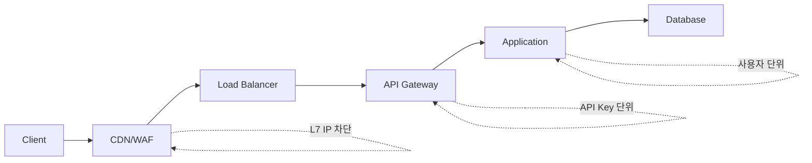

# Rate Limiting

서비스를 운영하다 보면 트래픽을 막아야 할 일이 끊임없이 생긴다. 누군가 로그인 API를 무차별 대입으로 두드리고, 회원가입 폼에 봇이 하루에 만 건씩 가짜 계정을 만들고, 무료 플랜 사용자가 결제 사용자보다 더 많은 요청을 던진다. 이런 상황을 막는 가장 기본적인 도구가 Rate Limiting이다.

DDoS 방어와 헷갈리는 경우가 많은데 결이 다르다. DDoS 방어는 네트워크 대역폭을 채우거나 SYN Flood로 서버를 마비시키는 공격을 막는 일이고, 인프라 계층(CDN, WAF, 라우터)에서 처리한다. Rate Limiting은 트래픽 자체는 정상이지만 비즈니스 정책상 허용 한도를 넘는 요청을 거르는 일이다. "분당 5번까지 비밀번호 시도 가능", "무료 플랜은 일 1000회 호출", "한 IP에서 10초에 100요청 이상 오면 차단" 같은 규칙이 전부 Rate Limiting의 영역이다.

5년차 개발자가 Rate Limiting을 잘못 설계하면 어떤 일이 벌어지는지 보면 이해가 빠르다. 알고리즘을 잘못 골라서 카운터 리셋 직후에 트래픽이 두 배로 들어와 DB가 죽거나, Redis 없이 인스턴스마다 메모리에 카운터를 두는 바람에 오토스케일링 후에 제한이 사실상 무력해지거나, IP 단위로만 제한해서 사내 NAT 뒤에 있는 정상 사용자들이 전부 차단되는 사태가 생긴다. 알고리즘 선택, 저장소, 키 설계 세 가지가 전부 맞아야 한다.

## 어디서 막을 것인가

Rate Limiting을 구현하기 전에 먼저 결정해야 할 것은 "어느 레이어에서 막을 것인가"다. 같은 요청이라도 막는 위치에 따라 비용과 효과가 완전히 다르다.



CDN/WAF 단계에서 막으면 가장 싸다. 트래픽이 우리 인프라에 들어오기도 전에 Cloudflare나 AWS WAF가 거른다. 단순한 IP 기반 제한이면 여기서 끝내는 게 맞다. API Gateway 단계는 인증을 통과한 요청에 대해 API 키나 플랜별 제한을 거는 위치다. 애플리케이션 단계는 비즈니스 로직과 결합된 세밀한 제한을 거는 곳이다. "한 사용자가 게시글을 분당 3개만 올릴 수 있다" 같은 도메인 규칙은 여기서밖에 못 막는다.

여러 레이어에 동시에 거는 게 정석이다. 외부 IP 단위 거친 제한은 WAF에서, 인증된 사용자 단위 정밀 제한은 애플리케이션에서. 한 곳에 다 몰면 그 레이어가 죽었을 때 무방비가 된다.

## 알고리즘 비교

Rate Limiting 알고리즘은 네 가지를 가장 많이 쓴다. Fixed Window, Sliding Window, Token Bucket, Leaky Bucket. 각각의 동작 방식과 트레이드오프를 정확히 알아야 상황에 맞는 걸 고를 수 있다.

### Fixed Window Counter

가장 단순하다. 시간을 고정 구간으로 나누고 각 구간 안에서 카운터를 센다. "1분에 100요청 허용"이라면 매분 0초에 카운터가 0이 된다.

```
00:00:00 ~ 00:00:59 → 100요청까지 OK
00:01:00 ~ 00:01:59 → 다시 100요청까지 OK
```

구현이 쉽고 메모리도 거의 안 쓴다. Redis로 만들면 키 하나에 INCR 한 번이 전부다. 문제는 경계 구간에서 두 배의 트래픽을 허용한다는 점이다. 00:00:59에 100요청 보내고 00:01:00에 또 100요청 보내면 1초 사이에 200요청이 들어온다. 제한 의도와 다르게 순간 트래픽이 두 배로 튄다.

이 특성은 생각보다 자주 문제가 된다. 카운터 리셋 시점을 알고 있는 봇이 일부러 그 타이밍에 몰아서 보내는 경우가 있다. 아주 정밀한 제한이 필요 없고 평균 트래픽만 제어하면 되는 상황이 아니라면 Fixed Window는 추천하지 않는다.

### Sliding Window Log

요청이 들어올 때마다 타임스탬프를 전부 기록하고, 현재 시각 기준 윈도우 안에 들어오는 로그 개수를 센다. "최근 60초간 100요청 미만"이라면 매 요청마다 60초 이전 로그를 지우고 남은 개수를 확인한다.

```
요청 시각: [00:00:05, 00:00:12, 00:00:34, 00:00:55, 00:01:03]
01:03 시점에 60초 윈도우(00:00:03 ~ 00:01:03) 안에 5개
```

가장 정확하다. Fixed Window의 경계 문제가 없고 실제로 "최근 N초" 동안의 요청 수를 정확히 잰다. 단점은 비용이다. 모든 요청의 타임스탬프를 저장해야 하니 트래픽이 많을수록 메모리가 선형으로 늘어난다. 100만 요청/분이 들어오는 API에 적용하면 키 하나에 100만 개 원소가 쌓인다.

Redis Sorted Set으로 구현하는 게 일반적인데, 정확성은 최고지만 메모리 비용 때문에 사용자별로만 쓰고 IP 단위처럼 키 개수가 폭발하는 경우엔 안 쓰는 게 좋다.

### Sliding Window Counter

Fixed Window의 비용과 Sliding Window Log의 정확성을 절충한 방식이다. 현재 윈도우와 직전 윈도우 두 개의 카운터만 유지하고, 현재 시점이 두 윈도우 사이 어디쯤인지 비율로 가중치를 준다.

```
현재 윈도우(00:01:00 ~ 00:01:59) 카운터: 30
직전 윈도우(00:00:00 ~ 00:00:59) 카운터: 80
현재 시각: 00:01:30 (현재 윈도우의 50% 지점)

추정 요청 수 = 80 * (1 - 0.5) + 30 = 70
```

정확하지는 않지만 합리적인 근사치를 준다. 메모리는 키 하나당 두 개의 카운터만 있으면 된다. 실무에서 가장 많이 쓰는 방식이다. Cloudflare가 자사 Rate Limiting에 이걸 쓴다고 공개했고, 대부분의 API Gateway가 이 방식을 채택한다.

근사 방식이라 트래픽이 직전 윈도우 안에서 균등하게 분포했다고 가정한다. 실제로 직전 윈도우 마지막 1초에 80요청이 몰렸다면 추정값이 실제와 차이가 난다. 하지만 일상적인 트래픽 패턴에서는 충분히 정확하다.

### Token Bucket

버킷에 일정 속도로 토큰이 채워지고, 요청이 들어올 때마다 토큰을 하나씩 소비한다. 토큰이 없으면 거절한다. 버킷에는 최대 용량이 있어서 그 이상 채워지지 않는다.

```
용량: 10, 충전 속도: 1초당 1개

t=0  : 토큰 10개, 요청 5개 처리 → 토큰 5개
t=1  : 토큰 6개 (1개 충전), 요청 6개 처리 → 토큰 0개
t=2  : 토큰 1개, 요청 1개 처리 → 토큰 0개
t=10 : 토큰 8개 (8개 충전, 용량 한계 미달)
```

Token Bucket의 핵심 특징은 "버스트 허용"이다. 평소에 요청이 적으면 토큰이 쌓이고, 갑자기 트래픽이 몰려도 쌓인 토큰만큼은 빠르게 처리한다. API의 평균 호출량을 제한하면서 일시적인 폭증은 허용해야 하는 경우에 적합하다. 모바일 앱이 백그라운드에서 일정 시간 후 한 번에 데이터를 동기화하는 패턴 같은 거에 잘 맞는다.

AWS API Gateway, Stripe API, GitHub API가 전부 Token Bucket 기반이다. "초당 100요청, 버스트 200까지" 같은 표현은 Token Bucket의 충전 속도와 버킷 용량을 의미한다.

### Leaky Bucket

요청을 큐에 쌓고 일정 속도로 빼서 처리한다. 큐가 가득 차면 새 요청은 버린다. 출력 속도가 일정하다는 점이 Token Bucket과 다르다.

```
큐 크기: 10, 처리 속도: 1초당 2개

t=0  : 요청 5개 도착 → 큐 [1,2,3,4,5]
t=0.5: 요청 1번 처리 → 큐 [2,3,4,5]
t=1  : 요청 2번 처리, 새 요청 6번 도착 → 큐 [3,4,5,6]
```

Leaky Bucket은 출력이 평탄하다. 트래픽이 아무리 폭증해도 다운스트림에 보내는 속도는 일정하다. 다운스트림 시스템이 일정 RPS만 처리할 수 있는데 그 이상 들어오면 안 되는 경우에 쓴다. 메시지 큐로 백엔드 시스템을 보호하는 패턴과 비슷하다.

API에는 잘 안 쓴다. 사용자 입장에서 요청이 큐에 들어가서 지연되는 것보다 즉시 거절되는 게 보통 더 낫기 때문이다. 트래픽 평탄화가 목적인 내부 파이프라인이나 외부 API 호출 클라이언트 쪽에서 더 자주 본다.

### 비교표

| 알고리즘 | 정확성 | 메모리 | 버스트 허용 | 구현 난이도 |
|---------|-------|-------|-----------|-----------|
| Fixed Window | 낮음 (경계 문제) | 매우 적음 | 우연히 허용 | 매우 쉬움 |
| Sliding Window Log | 매우 높음 | 많음 | 안 함 | 보통 |
| Sliding Window Counter | 높음 | 적음 | 안 함 | 보통 |
| Token Bucket | 높음 | 적음 | 명시적 허용 | 보통 |
| Leaky Bucket | 높음 | 적음 (큐 크기) | 안 함, 평탄화 | 어려움 |

실무에서 가장 자주 쓰는 조합은 이렇다. 일반 API의 사용자/IP 단위 제한에는 Sliding Window Counter, 버스트를 명시적으로 허용해야 하는 외부 API에는 Token Bucket, 정확한 분당 5회 같은 비즈니스 규칙에는 Sliding Window Log를 쓴다.

## Redis 기반 분산 구현

단일 인스턴스 환경이면 메모리 안의 Map 하나로 끝이지만, 실서비스는 보통 여러 인스턴스가 떠 있다. 인스턴스마다 카운터를 따로 관리하면 제한 의미가 없다. 사용자가 인스턴스 A에서 50회, B에서 50회 보내면 각각 50회만 인식한다.

분산 환경에서 카운터를 공유하려면 중앙 저장소가 필요하다. Redis가 표준이다. 빠르고, INCR/EXPIRE/Sorted Set 같은 원자적 연산을 제공하고, Lua 스크립트로 복잡한 로직을 한 번에 실행할 수 있다.

### Fixed Window를 Redis로

가장 단순한 형태다. INCR 한 번으로 끝난다.

```python
def is_allowed(redis_client, key, limit, window_seconds):
    current = redis_client.incr(key)
    if current == 1:
        redis_client.expire(key, window_seconds)
    return current <= limit
```

여기엔 미묘한 race condition이 있다. INCR과 EXPIRE 사이에 다른 프로세스가 INCR를 호출하면 EXPIRE가 늦게 걸릴 수 있다. 만약 EXPIRE를 호출한 프로세스가 그 사이에 죽으면 키가 영원히 살아남는다. SET ... EX NX와 INCR를 조합하거나 Lua 스크립트로 두 명령을 원자적으로 실행해야 안전하다.

```lua
local current = redis.call('INCR', KEYS[1])
if current == 1 then
    redis.call('EXPIRE', KEYS[1], ARGV[1])
end
return current
```

### Sliding Window Log를 Redis로

Sorted Set을 쓴다. 점수와 멤버를 모두 타임스탬프로 넣고, 윈도우 밖의 원소는 ZREMRANGEBYSCORE로 지운 다음 ZCARD로 개수를 센다.

```lua
local key = KEYS[1]
local now = tonumber(ARGV[1])
local window = tonumber(ARGV[2])
local limit = tonumber(ARGV[3])

redis.call('ZREMRANGEBYSCORE', key, 0, now - window * 1000)
local count = redis.call('ZCARD', key)
if count < limit then
    redis.call('ZADD', key, now, now)
    redis.call('EXPIRE', key, window)
    return 1
else
    return 0
end
```

타임스탬프를 멤버로 쓸 때 같은 밀리초에 여러 요청이 들어오면 중복 키가 되어 하나만 저장된다. UUID나 카운터를 붙여서 유니크하게 만들어야 한다.

### Token Bucket을 Redis로

토큰 개수와 마지막 충전 시각 두 값을 저장하고, 요청이 올 때마다 경과 시간만큼 토큰을 보충한 뒤 차감한다.

```lua
local key = KEYS[1]
local capacity = tonumber(ARGV[1])
local refill_rate = tonumber(ARGV[2])
local now = tonumber(ARGV[3])
local requested = tonumber(ARGV[4])

local bucket = redis.call('HMGET', key, 'tokens', 'last_refill')
local tokens = tonumber(bucket[1]) or capacity
local last_refill = tonumber(bucket[2]) or now

local elapsed = (now - last_refill) / 1000
tokens = math.min(capacity, tokens + elapsed * refill_rate)

local allowed = 0
if tokens >= requested then
    tokens = tokens - requested
    allowed = 1
end

redis.call('HMSET', key, 'tokens', tokens, 'last_refill', now)
redis.call('EXPIRE', key, math.ceil(capacity / refill_rate) * 2)
return allowed
```

Lua 스크립트가 길어 보이지만 Redis가 원자적으로 실행하니 race condition은 없다. EXPIRE는 비활성 사용자의 키를 정리하기 위한 것이다. 충분한 시간이 지나면 어차피 토큰이 가득 찰 테니 키를 지워도 동등하다.

### Redis 운영상 주의점

Redis가 단일 장애점(SPOF)이 된다. Redis가 죽으면 Rate Limiting이 동작하지 않는다. 두 가지 선택지가 있다. 보수적으로는 Redis 장애 시 모든 요청을 거절(fail-closed), 가용성 우선이면 모든 요청을 허용(fail-open)한다. 보안 목적의 Rate Limiting은 fail-closed가 맞고, UX 목적의 throttling은 fail-open이 보통 맞다. 그냥 default로 fail-open을 쓰면 공격자가 Redis만 다운시키면 무제한 요청이 가능해진다. 의식적으로 결정해야 한다.

Redis Cluster를 쓰면 키가 샤딩된다. 같은 사용자의 키가 같은 슬롯에 들어가도록 hash tag를 쓰는 게 좋다. `ratelimit:{user:123}:login`처럼 중괄호로 감싸면 그 부분만 해시 대상이 된다. Lua 스크립트는 모든 키가 같은 슬롯에 있어야 동작하므로 hash tag는 필수에 가깝다.

Redis 한 대로 부족하면 알고리즘에 따라 분산 전략이 달라진다. Token Bucket은 사용자별로 키가 분리되니 샤딩이 쉽다. 전역 제한(예: "전체 시스템에서 초당 10000요청")은 단일 키로 몰리니 Redis 한 노드의 처리량이 한계다. 이런 경우는 로컬에서 미리 제한하고 Redis에 보내는 트래픽을 줄이는 식으로 우회한다.

## Nginx limit_req

Nginx는 Leaky Bucket 알고리즘을 내장한 limit_req 모듈을 제공한다. 가장 가벼운 Rate Limiting 수단이고, 애플리케이션에 도달하기 전에 거르므로 비용도 적다.

```nginx
http {
    limit_req_zone $binary_remote_addr zone=api_limit:10m rate=10r/s;
    limit_req_status 429;

    server {
        location /api/ {
            limit_req zone=api_limit burst=20 nodelay;
            proxy_pass http://backend;
        }

        location /api/login {
            limit_req zone=api_limit burst=5;
            proxy_pass http://backend;
        }
    }
}
```

`limit_req_zone`이 카운터를 저장할 공유 메모리 영역을 정의한다. 10m이면 약 16만 개 IP를 추적할 수 있다. `rate=10r/s`는 평균 처리 속도다.

`burst`와 `nodelay`가 헷갈리는 부분이다. `burst=20`만 있으면 초과 요청을 큐에 넣고 정해진 속도로 처리한다(원본 Leaky Bucket). `nodelay`를 추가하면 burst 한도까지는 즉시 처리하고 그 이상만 거절한다. 사용자 경험상 nodelay가 보통 더 낫다. burst만 쓰면 사용자가 빠르게 클릭했을 때 응답이 인위적으로 지연된다.

Nginx limit_req의 한계는 분산이 안 된다는 점이다. 각 Nginx 인스턴스가 자기 메모리에서 카운터를 관리한다. Nginx 인스턴스 5대 앞에 LB가 있으면 실제 제한은 설정값의 5배가 된다. 정확한 제한이 필요하면 Nginx Plus의 `sync` 기능을 쓰거나, Nginx에서는 거친 1차 필터만 하고 정밀 제한은 애플리케이션에서 한다.

`$binary_remote_addr`를 키로 쓰면 IP 단위 제한이다. CDN/프록시 뒤에 있다면 `$http_x_forwarded_for`나 `$realip_remote_addr`을 써야 실제 클라이언트 IP가 잡힌다. 이걸 빠뜨리면 모든 요청이 프록시 IP로 묶여서 정상 사용자가 전부 차단된다.

## API Gateway 레벨 throttling

API Gateway는 인증과 라우팅을 처리하면서 Rate Limiting도 같이 한다. AWS API Gateway, Kong, Apigee, Tyk 같은 제품들이 다 비슷한 모델을 제공한다.

API Gateway 단계의 장점은 인증된 신원 정보를 알고 있다는 점이다. Nginx는 IP만 알지만 API Gateway는 API Key, 사용자 ID, 플랜 등급을 알기 때문에 정밀한 제한을 걸 수 있다.

```yaml
plugins:
  - name: rate-limiting
    config:
      minute: 100
      hour: 1000
      policy: redis
      redis_host: redis.internal
      identifier: consumer
      fault_tolerant: true
```

Kong의 예시다. `identifier: consumer`는 API Key로 식별된 클라이언트별로 카운트한다는 뜻이다. `fault_tolerant: true`는 Redis 장애 시 fail-open으로 동작한다. 보안이 중요하면 false로 바꿔야 한다.

플랜별 차등 제한은 보통 API Gateway에서 처리한다. Free 플랜은 분당 60회, Pro는 600회, Enterprise는 무제한 같은 식이다. 이걸 애플리케이션에서 구현하면 인증/플랜 정보를 매번 조회해야 해서 비효율적이다. Gateway가 토큰 검증과 함께 한 번에 처리하는 게 효율적이다.

API Gateway가 자체적으로 Rate Limiting을 한다고 해서 애플리케이션에서 안 해도 되는 건 아니다. Gateway는 일반적인 정책만 처리한다. "한 사용자가 같은 게시글에 30초 안에 두 번 댓글을 못 단다" 같은 도메인 규칙은 애플리케이션에서 직접 구현해야 한다.

## 키 설계

Rate Limiting의 효과는 "무엇을 키로 쓸 것인가"에 거의 전적으로 달려 있다. 키를 잘못 설계하면 알고리즘이 아무리 정교해도 무용지물이 된다.

### IP 단위

가장 기본이다. 인증 전 단계의 무차별 대입(브루트포스, 회원가입 봇)을 막을 때 IP 외에는 식별 수단이 없다.

문제는 IP 공유다. 사내 NAT 뒤에 있는 회사 사용자 100명이 모두 같은 외부 IP를 쓰는 경우, 학교나 카페 같은 공공 와이파이, 모바일 캐리어 NAT까지 고려하면 IP 단위 제한은 생각보다 거칠다. 너무 빡빡하게 잡으면 정상 사용자가 차단된다.

```
ratelimit:ip:203.0.113.5:login → 분당 10회
```

IP 단위는 보통 느슨하게 잡고, 정확한 제한은 인증 후 사용자 단위로 다시 거는 게 일반적이다. CDN 뒤에 있다면 X-Forwarded-For 헤더를 신뢰할 수 있는지부터 확인해야 한다. 신뢰 못 하면 위조된 헤더로 제한을 우회당한다.

### 사용자 단위

인증된 사용자에 대해서는 사용자 ID를 키로 쓴다. 가장 정확하고 의미 있는 단위다.

```
ratelimit:user:12345:create_post → 시간당 50회
ratelimit:user:12345:api_call → 분당 1000회
```

사용자별로 다른 제한을 걸 수 있다. 신규 가입자는 더 빡빡하게, 인증 완료 사용자는 느슨하게, 의심 활동이 감지된 계정은 임시로 더 빡빡하게.

### API 키 단위

외부 API를 제공하는 경우 API Key가 키 식별자다. 보통 키 자체가 아니라 키의 해시나 키에 매핑된 ID를 쓴다. 키가 로그에 남으면 안 되니까.

```
ratelimit:apikey:hash_abc123:requests → 분당 1000회
```

API 키 단위는 플랜과 결합된다. 키마다 어떤 플랜에 속하는지 확인해서 그 플랜의 제한값을 적용한다. DB 조회를 매번 하면 느리니까 캐시한다.

### 복합 키

엔드포인트별, 액션별로 다른 제한을 걸 때 키를 조합한다.

```
ratelimit:user:12345:endpoint:/api/messages:POST → 분당 30회
ratelimit:user:12345:action:password_change → 일 5회
```

이게 너무 늘어나면 관리가 어려워진다. 어디서 제한이 걸리는지 추적이 안 되고, 새 엔드포인트 추가할 때 제한 설정을 빠뜨린다. 카테고리화해서 "쓰기 작업", "조회 작업", "민감 작업" 같은 그룹 단위로 묶는 게 현실적이다.

## 응답과 사용자 경험

제한에 걸린 요청을 어떻게 응답하느냐도 중요하다. HTTP 표준은 429 Too Many Requests를 쓰라고 정의한다. Retry-After 헤더로 언제 다시 시도할 수 있는지 알려준다.

```http
HTTP/1.1 429 Too Many Requests
Retry-After: 60
X-RateLimit-Limit: 100
X-RateLimit-Remaining: 0
X-RateLimit-Reset: 1714723200
Content-Type: application/json

{
    "error": "rate_limit_exceeded",
    "message": "분당 요청 한도를 초과했습니다",
    "retry_after": 60
}
```

`X-RateLimit-*` 헤더는 표준은 아니지만 사실상 표준이다. 모든 요청에 현재 한도와 남은 횟수를 실어주면 클라이언트가 미리 속도 조절을 할 수 있다. GitHub, Stripe 같은 곳이 이 패턴을 쓴다.

실수로 자주 하는 것 중 하나가 401(인증 실패)과 429를 같이 쓰는 경우다. 로그인 무차별 대입을 막는다고 비밀번호 틀린 요청에 401 대신 429를 주면 안 된다. 의미가 다르다. 401은 자격 증명 문제, 429는 요청 빈도 문제다. 정상 사용자가 비밀번호 한 번 틀렸을 때 429가 나오면 헷갈린다. 비밀번호 5번 틀린 후에는 계정 잠금(423 Locked)을 쓰는 게 맞다.

조용히 거절하는 방식도 있다. 봇이라고 확신되는 요청에 대해 429를 주면 봇이 백오프 로직을 작동시켜서 더 정교해진다. 차라리 200을 주고 응답을 가짜로 만들거나 의도적으로 응답을 지연시키는 "tarpit" 방식을 쓰는 곳도 있다. 이건 합법적인 사용자에게는 절대 쓰면 안 되고, 명확한 악성 트래픽에만 쓴다.

## 비즈니스 레벨 abuse 시나리오

Rate Limiting의 실제 가치는 정량적인 트래픽 제한보다 비즈니스 abuse 방지에 있다. DDoS는 인프라가 막지만, 비즈니스 abuse는 정상 트래픽 안에 숨어있어서 애플리케이션이 직접 막아야 한다.

### 회원가입 봇

가입 폼에 봇이 들어와서 가짜 계정을 양산한다. IP 단위로 분당 1회로 제한해도 IP 풀이 있는 봇은 막기 어렵다. 이런 경우 IP + User-Agent 조합, IP 대역 단위 제한, CAPTCHA, 가입 후 이메일 인증까지 다층으로 걸어야 한다. Rate Limiting만으로는 부족하다.

### 로그인 무차별 대입

가장 자주 보는 abuse다. IP별 + 사용자 ID별 두 가지 단위로 거는 게 정석이다. IP 단위만 걸면 봇넷에서 IP를 분산해 우회한다. 사용자 ID 단위만 걸면 공격자가 일부러 누군가의 계정을 잠궈서 서비스 거부 공격에 쓴다. 두 개를 다 걸어야 한다.

```
ratelimit:login:ip:203.0.113.5 → 분당 20회 (IP 보호)
ratelimit:login:user:victim_id → 분당 5회 (계정 보호)
```

### API 무료 플랜 남용

무료 사용자가 결제 사용자보다 더 많이 호출하는 상황이다. API 키 단위 + 플랜별 차등 제한이 답이다. 더 정교하게는 비싼 엔드포인트에는 별도 비용을 매기는 token cost 모델을 쓴다. 단순 조회는 1토큰, 무거운 분석은 100토큰 식으로.

### 콘텐츠 스팸

게시글, 댓글, 메시지 같은 사용자 생성 콘텐츠에 도배하는 abuse다. 시간당 N개 같은 단순 제한 외에 "같은 내용을 반복 게시하면 즉시 차단" 같은 콘텐츠 기반 규칙도 같이 걸어야 한다. Rate Limiting은 빈도만 보지 내용을 보지 않으니 한계가 있다.

### 결제 시도 abuse

도용된 카드로 무차별 결제를 시도하는 abuse다. 사용자 단위 + IP 단위 + 카드 BIN 단위로 제한을 거는 게 일반적이다. 결제 실패가 N번 반복되면 점진적으로 지연을 늘리는 exponential backoff를 적용한다.

## 실무에서 자주 놓치는 것

Rate Limiting을 처음 도입하면 단순히 "몇 회 제한" 숫자에만 집중하는데, 실제로는 운영 측면이 더 중요하다.

제한값은 처음에 보수적으로 잡고 모니터링하면서 조정해야 한다. 처음부터 정확한 값을 알 방법이 없다. 정상 사용자의 95백분위 트래픽을 측정한 다음 그 값의 2배 정도부터 시작하고, 차단 로그를 보면서 점진적으로 조정한다.

차단된 요청을 로그로 남겨야 한다. 누가, 언제, 어떤 키로 막혔는지 기록해야 abuse 패턴을 분석하고 정상 사용자의 오탐을 찾아낼 수 있다. 막혔다는 사실만 기록하지 말고 막힌 요청 내용까지 (개인정보 마스킹해서) 남겨야 한다.

Rate Limiting을 우회하는 가장 흔한 방법은 다중 IP나 다중 계정을 쓰는 것이다. 단일 키 단위 제한만 보지 말고 행동 패턴을 같이 봐야 한다. 신규 가입한 100개 계정이 같은 IP 대역에서 비슷한 시간에 같은 행동을 하면 거의 확실히 abuse다. 이런 패턴을 잡으려면 Rate Limiting 외에 별도의 abuse detection 시스템이 필요하다.

내부 시스템 간 호출에도 Rate Limiting이 필요하다. 마이크로서비스 환경에서 한 서비스가 버그로 다른 서비스를 무한 호출하는 사고가 생긴다. 외부 호출만 막고 내부는 안 막으면 한 서비스의 버그가 전체 시스템을 마비시킬 수 있다.

마지막으로, Rate Limiting은 보안의 한 층일 뿐 단독 방어선이 아니다. WAF, 인증, 권한 관리, abuse detection이 같이 동작해야 한다. Rate Limiting만 믿고 다른 방어를 소홀히 하면 우회당했을 때 무방비가 된다.
