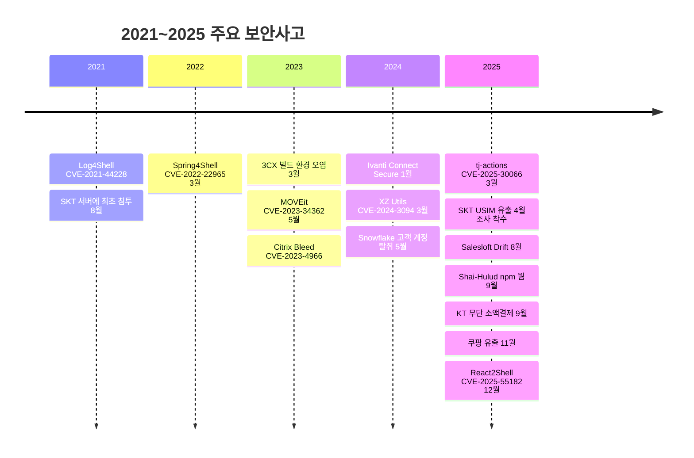
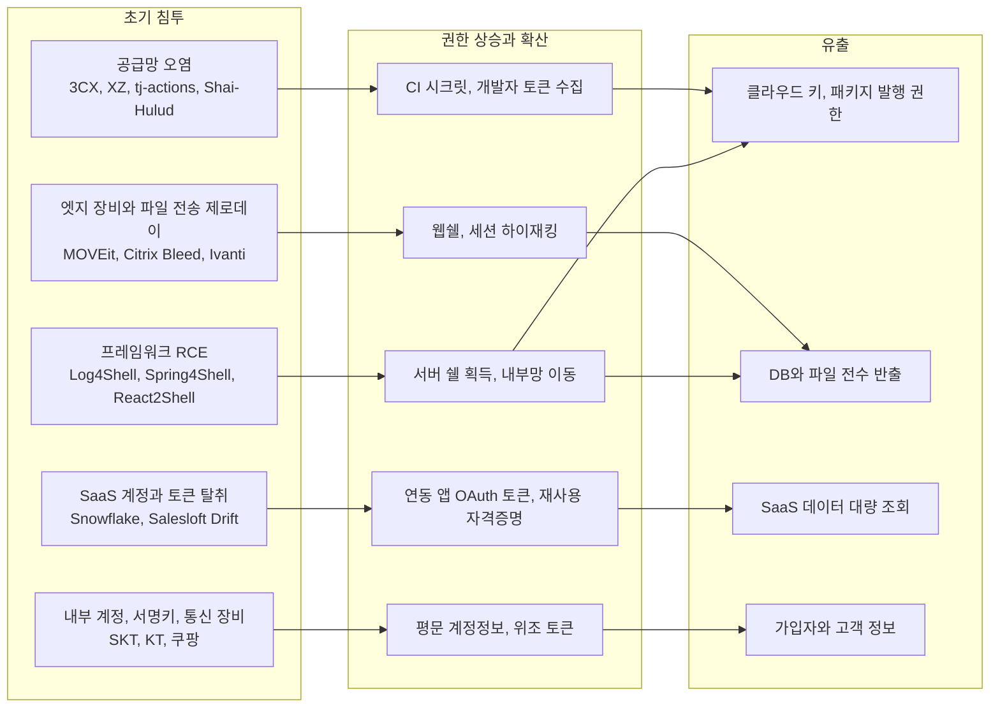
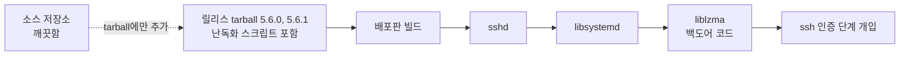
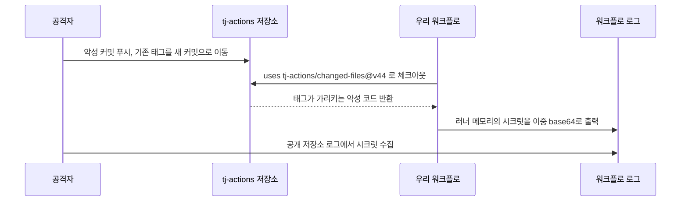
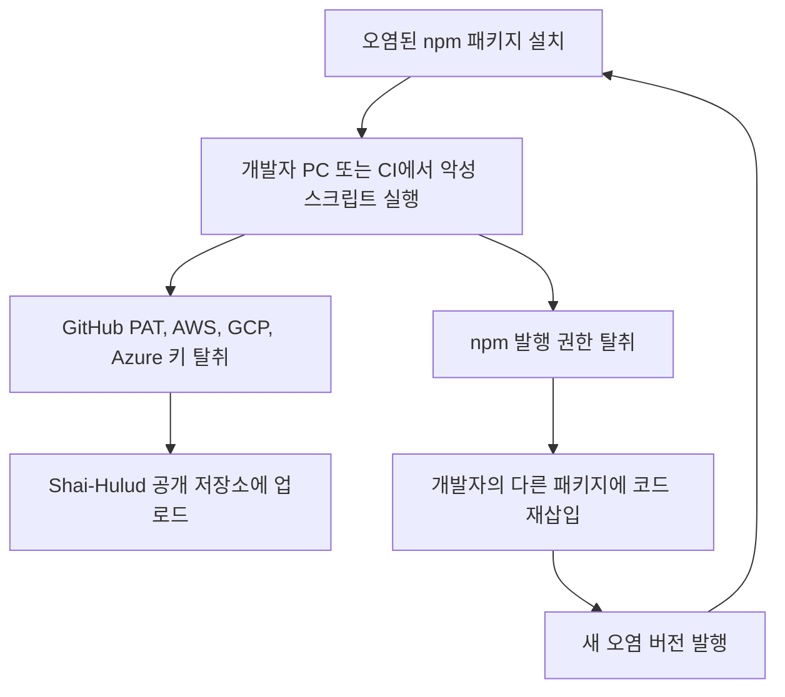
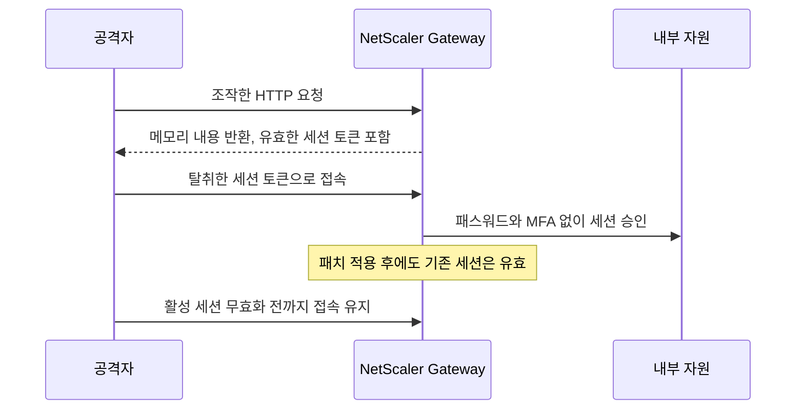
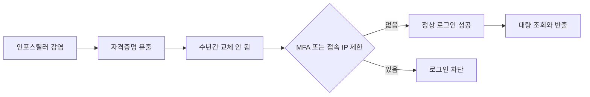
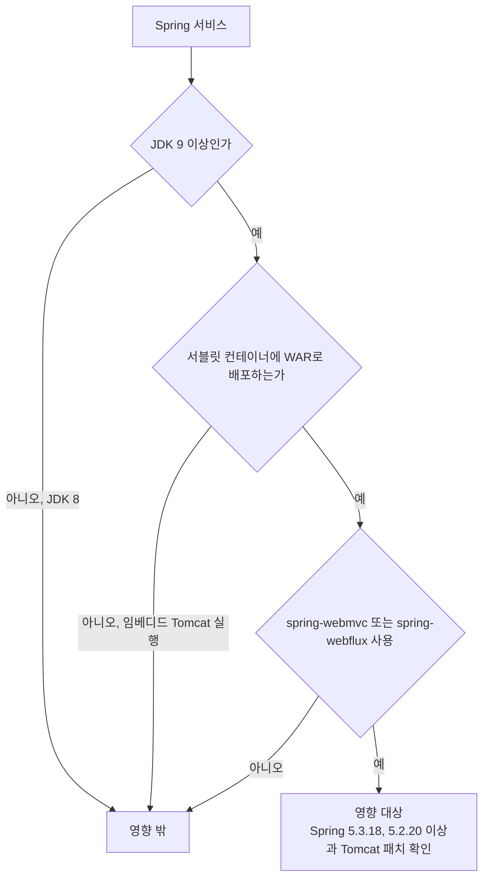
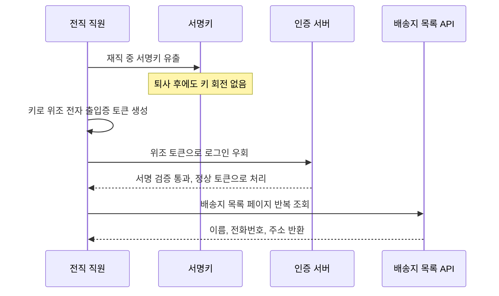

# 최근 보안사고 사례 2021~2025

보안 사고 뉴스는 보통 아침에 슬랙으로 들어온다. "우리 서비스에 영향 있나요?"라는 질문이 개발팀에 내려오고, 그 질문에 한 시간 안에 답하지 못하면 그날은 사고 대응이 아니라 사실 확인으로 끝난다. 영향 여부를 빨리 답하려면 사고마다 무엇이 뚫렸는지를 알고 있어야 하고, 우리 쪽에서 어디를 grep 하면 되는지도 정해 두어야 한다.

이 문서는 2021년부터 2025년까지의 사고를 공격 경로별로 묶었다. 사고마다 무엇이 뚫렸는지, 왜 늦게 알았는지, 서버 개발자가 당일 확인할 것을 적었다. 날짜, CVE 번호, 피해 규모는 벤더 어드바이저리, CISA, 정부 발표에서 확인한 것만 썼고 확인하지 못한 수치는 뺐다. MOVEit 피해 기업 수나 tj-actions 영향 저장소 수가 문서에 없는 이유다. 사고별 대응 절차 자체는 [보안 사고 대응 절차](Incident_Response.md), 공급망 방어 일반론은 [공급망 공격 방어](Supply_Chain_Security.md)에 있다.

## 연도별 흐름

연도별로 놓고 보면 2021~2022년은 라이브러리 취약점 하나가 전 세계 서버를 한꺼번에 흔든 시기고, 2023년부터는 공급망과 인터넷에 노출된 장비로 공격이 옮겨 간다. 2024년 이후에는 취약점 없이 탈취한 자격증명과 토큰으로 들어오는 사고가 눈에 띄게 늘어난다. 타임라인에서 월 단위로만 적은 항목은 해당 월까지만 확인한 것이다.



SKT는 2021년에 들어왔는데 발표는 2025년이다. 이 4년의 간격이 뒤에서 계속 나오는 "왜 늦게 알았나"의 가장 극단적인 사례다.

## 공격 경로 다섯 갈래

사고를 하나씩 보면 제각각 같지만 초기 침투, 권한 상승과 확산, 유출 세 단계로 나누면 다섯 갈래로 정리된다. 아래 다이어그램은 이 문서에서 다루는 사고를 같은 틀에 놓은 것이다. 초기 침투가 서로 다르다는 점보다 가운데 단계에서 무엇을 건졌는지가 더 중요하다. 공급망은 CI 시크릿과 개발자 토큰을, 엣지 장비는 웹쉘과 세션을, SaaS 사고는 연동 앱 토큰을 잡았다.



## 공급망 오염

### 3CX, 2023년 3월

뚫린 곳은 3CX 자신의 빌드 환경이다. Mandiant 조사에서 시작점은 3CX 직원이 개인 PC에 설치한 Trading Technologies의 X_TRADER 설치 프로그램이었고, 거기에 악성코드가 들어 있었다. 공격자는 그 PC에서 회사 자격증명을 얻어 내부로 이동했고 Windows와 macOS 빌드 환경을 모두 장악했다. 공급망 공격의 원료가 다른 공급망 공격이었던 셈이다. 조사 결과는 북한 연계 그룹 UNC4736으로 평가했다. [Mandiant 조사 결과 (3CX)](https://www.3cx.com/blog/news/mandiant-security-update2/)

늦게 안 이유는 배포된 것이 3CX가 직접 빌드한 앱이라서 업데이트 경로 자체가 정상이었기 때문이다. 시작점은 2022년이었으니 감염에서 발견까지 시간 차도 컸다. 서버 개발자가 당일 볼 것은 두 가지다. 3CX 같은 외부 제품의 데스크톱 클라이언트가 개발자 PC나 빌드 서버에 설치돼 있는지, 그리고 업무 PC에서 받은 서드파티 설치 파일이 사내 자격증명이 오가는 환경에서 실행됐는지다.

### XZ Utils, 2024년 3월

XZ Utils 5.6.0과 5.6.1의 릴리스 tarball에 백도어가 들어 있었다. CVE-2024-3094다. 저장소 소스가 아니라 배포용 tarball에 난독화된 스크립트가 숨어 있었고, sshd가 libsystemd를 거쳐 liblzma를 불러오는 연결을 타고 인증 단계에 개입했다. 2024년 3월 29일 Andres Freund가 ssh 로그인에서 CPU가 평소보다 많이 쓰이고 valgrind 오류가 나는 것을 이상하게 여겨 파고들면서 발견했다. [oss-security 공지](https://www.openwall.com/lists/oss-security/2024/03/29/4)

아래 도식은 소스 저장소와 배포 tarball이 갈라지는 지점, 그리고 sshd에서 liblzma까지 이어지는 로드 경로를 보여준다. 저장소만 감사해서는 이 경로가 보이지 않는다.



늦게 안 이유를 보면 이 사고는 보안 도구가 아니라 로그인이 조금 느리다는 위화감 하나로 잡혔다. 배포판에 널리 퍼지기 전에 발견된 것은 운이 컸다. 당일에는 서버와 컨테이너 이미지에서 xz 버전을 직접 확인하면 된다. 명령은 뒤의 확인 절차에 모았다.

### tj-actions/changed-files, 2025년 3월

GitHub Actions의 인기 액션 tj-actions/changed-files가 침해돼 CI 러너 메모리의 시크릿이 워크플로 로그로 출력됐다. CVE-2025-30066이다. CISA는 노출된 것으로 액세스 키, GitHub PAT, npm 토큰, 개인 RSA 키를 꼽았고, 시크릿이 이중 base64로 인코딩돼 있어 로그에서 눈으로 알아보기 어렵다고 경고했다. 수정은 v46.0.1이다. 연관된 reviewdog/action-setup@v1 침해는 CVE-2025-30154로 분류됐고 두 건 모두 3월 26일 CISA KEV에 올랐다. [CISA 경보](https://www.cisa.gov/news-events/alerts/2025/03/18/supply-chain-compromise-third-party-github-action-cve-2025-30066)

태그로 참조한 워크플로가 아무 변경 없이 악성 코드를 받아 오는 순서를 시퀀스로 그리면 다음과 같다.



영향 기간은 출처마다 표기가 다르다. CISA는 3월 12일부터 15일 사이로 적었고 GitHub 어드바이저리 요약은 14일과 15일로 적는다. 로그를 볼 때는 넓은 쪽인 12일부터 잡는 것이 안전하다. 늦게 안 이유는 `uses: tj-actions/changed-files@v44`처럼 태그로 참조한 워크플로가 태그를 새 악성 커밋으로 옮기는 순간 아무 변경 없이 악성 코드를 받아 왔기 때문이다. 공개 저장소라면 로그가 누구에게나 보이므로 그 기간에 워크플로가 돌았다는 사실만으로 시크릿 폐기 대상이 된다.

### Shai-Hulud, 2025년 9월

npm에서 퍼진 자기 복제 웜이다. CISA는 2025년 9월 23일 경보에서 500개가 넘는 패키지가 오염됐다고 밝혔다. 웜은 개발자의 GitHub PAT와 AWS, GCP, Azure 키를 훔쳐 `Shai-Hulud`라는 이름의 공개 저장소로 올리고, 훔친 npm 권한으로 그 개발자의 다른 패키지에 코드를 다시 심어 확산됐다. CISA는 2025년 9월 16일 이전에 나온 릴리스로 고정하고, 개발자 자격증명을 전부 교체하고, webhook.site 도메인 접속을 막으라고 권고했다. [CISA 경보](https://www.cisa.gov/news-events/alerts/2025/09/23/widespread-supply-chain-compromise-impacting-npm-ecosystem)

웜이 한 바퀴 도는 구조는 아래와 같다. 훔친 npm 권한이 다시 다른 패키지의 오염으로 이어지는 되먹임 고리를 보면 된다.



이 사고의 특징은 감염된 패키지 목록이 계속 늘어난다는 점이었다. 그래서 당일에는 락파일 비교만으로 끝낼 수 없다. 개발자 노트북이 감염됐을 수 있으므로 조직 GitHub에 `Shai-Hulud`라는 이름의 저장소가 생겼는지부터 본다.

## 엣지 장비와 파일 전송 서버

### MOVEit Transfer, 2023년 5월

MOVEit Transfer 웹 애플리케이션의 SQL 인젝션이다. CVE-2023-34362이고 CL0P(TA505)가 악용했다. CISA 어드바이저리에 따르면 악용은 2023년 5월 27일에 시작됐고 Progress가 취약점을 공개한 날은 5월 31일이다. 공개 전에 4일이 비어 있다. CISA는 6월 2일 이 CVE를 KEV에 올렸다. 공격자는 SQL 인젝션으로 들어와 `human2.aspx`라는 이름의 웹쉘을 심었다. 정상 파일인 `human.aspx`로 위장한 이름이다. [CISA AA23-158A](https://www.cisa.gov/news-events/cybersecurity-advisories/aa23-158a)

늦게 안 이유는 파일 전송 서버가 인터넷에 열려 있고, 공급자가 패치를 내놓기 전에 이미 데이터가 나가고 있었기 때문이다. 당일에는 웹쉘 파일 존재 여부, 관리자 권한 계정이 새로 생겼는지, 웹쉘이 인증에 쓰는 `X-siLock-Comment` 헤더가 요청에 찍혔는지를 본다. IIS는 요청 헤더를 기본으로 기록하지 않으므로 앞단 프록시나 WAF 로그가 있어야 이 헤더를 찾을 수 있다.

### Citrix Bleed, 2023년

NetScaler ADC와 Gateway의 CVE-2023-4966이다. 조작한 HTTP 요청에 장비가 메모리 내용을 그대로 돌려주고, 그 안에 유효한 세션 토큰이 들어 있어 패스워드와 MFA를 모두 건너뛰고 세션을 가로챌 수 있었다. CISA와 FBI는 2023년 11월 21일 어드바이저리에서 LockBit 3.0 계열이 이를 악용했고 악용이 2023년 8월부터 확인됐다고 밝혔다. [CISA AA23-325A](https://www.cisa.gov/news-events/cybersecurity-advisories/aa23-325a)

이 사고가 서버 개발자에게 주는 교훈은 패치와 침해 여부가 별개라는 것이다. 8월부터 악용됐다면 패치 시점에 이미 토큰이 빠져나갔을 수 있다. CISA는 침해된 호스트를 격리하고 재이미징하고 계정 자격증명을 새로 만들라고 안내한다. 활성 세션 무효화도 따로 해야 한다는 점은 [Tenable 정리](https://www.tenable.com/blog/cve-2023-4966-citrixbleed-invalidate-sessions-to-prevent-compromise)에 있다. 내가 NetScaler 운영자가 아니어도 사내 VPN 게이트웨이나 앞단 장비 제품명은 알고 있어야 영향 여부를 답할 수 있다.

패치만 하고 끝내면 왜 부족한지 순서로 보면 분명하다. 패치 이전에 빠져나간 세션 토큰은 패치 후에도 유효하다.



### Ivanti Connect Secure, 2024년 1월

CVE-2023-46805(인증 우회)와 CVE-2024-21887(명령 주입)이 함께 쓰였다. CISA는 긴급 지침 ED 24-01에서 연방 기관이 2024년 2월 2일까지 장비를 네트워크에서 분리하고, 공장 초기화한 뒤, 관리자 비밀번호와 API 키와 로컬 계정을 교체하고, Ivanti 무결성 검사 도구를 돌리고, 도메인 계정은 침해된 것으로 가정해 두 번 재설정하라고 요구했다. 같은 문서에서 CISA는 공장 초기화를 견디는 루트킷 수준의 지속성 사례를 언급했다. 이후 2월 8일에는 CVE-2024-22024가 추가로 공개됐다. [CISA ED 24-01](https://www.cisa.gov/news-events/directives/ed-24-01-mitigate-ivanti-connect-secure-and-ivanti-policy-secure-vulnerabilities)

늦게 안 이유는 VPN 장비가 EDR을 올릴 수 없는 폐쇄형 어플라이언스라는 점이다. 장비 안에서 벌어지는 일은 장비 벤더의 무결성 검사 도구가 아니면 볼 수 없다. 서버 개발자가 당일 확인할 것은 이 장비를 통해 접근 가능한 내부 자원 목록과, 그 장비 뒤에 있는 서비스가 쓰는 계정이 무엇인지다. 장비가 뚫리면 그 계정들이 다음 후보가 된다.

## SaaS 계정과 토큰 탈취

### Snowflake 고객 계정, 2024년 5월

취약점이 아니라 고객 계정의 자격증명이 문제였다. Mandiant 분석에서 UNC5537은 인포스틸러 악성코드가 훔친 자격증명으로 Snowflake 고객 계정에 로그인했다. 대상 계정에는 MFA가 없었고, 접속 허용 IP 목록도 없었고, 유출된 자격증명이 수년 지나도록 교체되지 않은 경우가 있었다. 가장 오래된 인포스틸러 감염은 2020년 11월이다. Mandiant는 2024년 5월 22일 Snowflake에 연락하고 피해 가능 조직에 통지를 시작했으며, 6월 11일 기준 잠재 노출 조직이 165곳이라고 밝혔다. 악용된 계정의 79.7%가 이전에 자격증명 노출 이력이 있었다. [Google Cloud 블로그 UNC5537](https://cloud.google.com/blog/topics/threat-intelligence/unc5537-snowflake-data-theft-extortion)

아래 도식은 취약점 없이 데이터가 나가는 경로다. 어느 단계에서도 침투 흔적이 남지 않는다.



늦게 안 이유는 공격자가 정상 로그인으로 들어왔기 때문이다. 침투 흔적이 없고 로그인 성공만 남는다. 당일에는 로그인 이력에서 두 번째 인증 요소 없이 성공한 로그인을 뽑아 보고, 계정에 네트워크 정책이 걸려 있는지 확인한다. 쿼리는 뒤에 있다. 관련해서 [크리덴션 스터핑](Credential_Stuffing.md) 문서의 방어도 참고할 만하다.

### Salesloft Drift, 2025년 8월

Salesloft Drift와 Salesforce를 연결해 둔 OAuth 토큰이 도난당했다. Google Threat Intelligence에 따르면 UNC6395의 활동 기간은 2025년 8월 8일부터 18일이고, Drift Email 연동의 Google Workspace 토큰도 영향을 받았다. 공격자는 Salesforce에서 사용자 목록을 쿼리하고 AWS 액세스 키(AKIA), 비밀번호, Snowflake 토큰 같은 문자열을 데이터에서 찾았다. Salesloft와 Salesforce는 8월 20일 Drift 관련 토큰을 전부 폐기했다. [Google Cloud 블로그 Drift](https://cloud.google.com/blog/topics/threat-intelligence/data-theft-salesforce-instances-via-salesloft-drift)

이 사고가 개발자에게 특히 아픈 이유는 도난 대상이 고객 데이터가 아니라 그 안에 들어 있던 우리 시스템의 키였다는 점이다. CRM 고객 지원 티켓에 사람들이 붙여 넣은 AWS 키가 그 예다. 늦게 안 이유는 토큰이 정상 연동 앱의 것이어서 Salesforce 쪽에서는 평소 연동 호출처럼 보였기 때문이다. 당일에는 Salesforce Event Monitoring에서 Drift 접속 이력을 보고, CRM·지원 도구에 저장된 텍스트에서 키 패턴을 검색하고, 발견된 키의 CloudTrail 사용 이력을 8월 8일부터 대조한다.

## 프레임워크 RCE

### Log4Shell, 2021년 12월

Log4j 2의 CVE-2021-44228이다. 로그 메시지와 파라미터에 들어간 JNDI 조회가 공격자가 지정한 LDAP 서버의 코드를 실행했다. CVSS 10.0이고 Alibaba Cloud 보안 팀의 Chen Zhaojun이 보고했다. 수정은 Java 버전별로 2.3.1(Java 6), 2.12.2(Java 7), 2.15.0(Java 8 이상)이다. 2.15.0으로 끝나지 않았다. 불완전한 수정이던 CVE-2021-45046(CVSS 9.0), 서비스 거부인 CVE-2021-45105(CVSS 5.9), JDBC appender를 통한 CVE-2021-44832(CVSS 6.6)가 뒤따랐다. [Apache Log4j 보안 페이지](https://logging.apache.org/log4j/2.x/security.html)

늦게 안 이유는 Log4j가 직접 의존성이 아니라 다른 라이브러리 안에 들어 있는 간접 의존성이었기 때문이다. `pom.xml`을 열어도 안 보이고 fat jar 안에 묻혀 있는 경우도 있었다. 이 사고 후 SBOM이 필요하다는 이야기가 실제 업무가 됐다. 대응 회고는 [공급망 공격 방어](Supply_Chain_Security.md)의 log4shell 절에 있다.

### Spring4Shell, 2022년 3월

Spring Framework의 CVE-2022-22965다. 2022년 3월 31일 Spring 팀은 공식 CVE가 나오기 전에 세부 내용이 먼저 유출돼 조기 공지를 냈다. 영향 조건이 좁았다. JDK 9 이상, Tomcat 같은 서블릿 컨테이너에 WAR로 배포, spring-webmvc 또는 spring-webflux 사용이 모두 겹쳐야 했다. 수정은 Spring Framework 5.3.18과 5.2.20, Spring Boot 2.6.6과 2.5.12이고 Tomcat은 10.0.20, 9.0.62, 8.5.78에서 고쳤다. [Spring 블로그](https://spring.io/blog/2022/03/31/spring-framework-rce-early-announcement)

Spring Boot의 기본 임베디드 Tomcat 실행 방식은 이 조건에 들지 않는다고 공지에 적혀 있다. 당일 확인에서 무엇을 보지 않아도 되는지 빨리 가려내는 것이 핵심이었다. JDK 8로 돌리는 서비스는 영향 밖이므로 JDK 버전과 배포 방식 두 가지로 먼저 분류하면 대상이 크게 줄어든다.

세 조건을 순서대로 걸러내는 분류 절차를 그리면 다음과 같다. 위에서부터 하나라도 아니면 영향 대상에서 빠진다.



### React2Shell, 2025년 12월

React Server Components의 CVE-2025-55182다. 인증 없이 서버 함수 엔드포인트로 조작된 HTTP 요청을 보내면 역직렬화 과정에서 RCE가 발생하고 CVSS는 10.0이다. 보고는 2025년 11월 29일, 공개는 12월 3일이다. 영향 패키지는 react-server-dom-webpack, react-server-dom-parcel, react-server-dom-turbopack의 19.0, 19.1.0, 19.1.1, 19.2.0이고 수정은 19.0.1, 19.1.2, 19.2.1이다. React 팀은 서버 함수를 직접 쓰지 않아도 RSC를 지원하는 앱이면 영향권이라고 밝혔다. 프레임워크 쪽에서는 Next.js, React Router, Waku 등이 거론됐다. [React 블로그](https://react.dev/blog/2025/12/03/critical-security-vulnerability-in-react-server-components)

늦게 알아채기 쉬운 지점은 `react-server-dom-*` 패키지를 `package.json`에 직접 적지 않는 프로젝트가 많다는 점이다. 프레임워크가 끌어오는 경우에는 `npm ls`로 간접 의존성을 봐야 나온다. 서버 함수를 안 쓴다고 안전하다고 판단한 팀이 여기서 틀린다. 사용하는 프레임워크의 해당 어드바이저리에 적힌 고정 버전은 프레임워크마다 다르므로 본인 버전 라인에 맞는 숫자를 그쪽 공지에서 확인해야 한다.

## 통신사와 이커머스의 내부 계정과 장비

### SK텔레콤, 2021년 침투와 2025년 발표

과학기술정보통신부 민관합동조사단은 2025년 7월 4일 최종 결과를 냈다. 공격자는 2021년 8월 6일 외부에서 접근 가능한 서버로 처음 들어와 CrossC2를 설치하고, 평문으로 저장된 계정정보를 이용해 다른 시스템으로 옮겨 갔다. 조사단은 4월 23일부터 6월 27일까지 서버 42,605대를 6차례 점검했고 28대에서 악성코드 33종(BPFDoor 27종 등)을 확인했다. 유출된 USIM 정보는 25종, 가입자 식별번호 기준 약 2,696만 건, 9.82GB다. 원인으로 계정정보 관리 부실, 과거 침해 대응 미흡, 주요 정보 암호화 미흡을 꼽았고, 2022년의 악성코드 감염 서버 발견 건을 법정 기한 내 신고하지 않은 점도 지적했다. 인증키를 암호화하지 않고 저장한 점은 다른 통신사와 달랐다고 한다. [과기정통부 최종 조사결과](https://www.korea.kr/news/policyNewsView.do?newsId=156721622)

왜 4년이 걸렸는가에는 구조가 있다. BPFDoor는 네트워크 인터페이스에 BPF 필터를 걸어 숨는 백도어라 평소 프로세스나 포트 점검에 안 걸린다. 한편 평문 계정정보가 서버 곳곳에 있어서 한 대를 잡으면 다음 대로 건너가기가 쉬웠다. 서버 개발자 입장에서 당일 확인할 것은 서비스 설정 파일, 배포 스크립트, 환경 변수에 평문 자격증명이 남아 있는지, 외부에서 접근 가능한 서버의 수가 몇 대인지다.

### KT 무단 소액결제, 2025년 하반기

불법 펨토셀(초소형 기지국)이 이용자와 KT 내부 설비 사이의 암호화되지 않은 통신을 가로챘다. 2025년 12월 29일 조사단 발표에 따르면 22,227명의 가입자 식별번호(IMSI), 단말 식별번호(IMEI), 전화번호가 유출됐고, 368명이 777건, 합계 2억 4,300만 원의 무단 소액결제 피해를 입었다. 서버 94대에서 BPFDoor와 루트킷을 포함한 악성코드 103종도 확인됐다. 과기정통부는 KT의 과실을 인정하고 위약금 면제 규정을 전체 이용자에게 적용할 수 있다고 판단했다. [과기정통부 조사결과](https://www.korea.kr/news/policyNewsView.do?newsId=148957231)

이 사고는 웹 서버 개발자와 거리가 멀어 보이지만 소액결제 쪽에서는 닿는다. 통신사 인증으로 결제를 승인하는 서비스를 운영한다면 통신사가 보내 주는 인증 값을 한 번 더 믿어도 되는지 점검해야 하는 사고다. 휴대폰 번호와 가입자 정보가 한 번 유출되면 SMS 인증은 신원 증명으로 약해진다.

### 쿠팡, 2025년 11월

과기정통부 민관합동조사단 결과를 보면 이름과 이메일이 노출된 계정이 약 3,367만 개이고, 배송지 목록 페이지는 1억 4천만 회 이상 조회됐다. 그 목록에는 수령인 이름, 전화번호, 주소, 마스킹된 공동현관 비밀번호가 들어 있었고 계정 소유자뿐 아니라 제3자 정보도 포함됐다. 공격 방식은 서명키 관리를 맡았던 전직 직원이 재직 중 키를 빼돌려 위조한 전자 출입증(인증 토큰)으로 정상 로그인 절차를 우회한 것이다. 조사단은 키 관리 체계와 비정상 접근 감시가 부족했다고 지적했다. 집중 조회는 2025년 4월 14일부터 11월 8일까지 IP 2,313개로 이뤄졌고 쿠팡은 11월 16일 고객 신고를 받고 19일에 신고했다. 법정 신고 시한을 약 48시간 넘겼다는 것이 조사단 설명이다. [과기정통부 조사결과 브리핑](https://www.korea.kr/briefing/policyBriefingView.do?newsId=156744092)

서버 쪽에서 무엇이 정상으로 판정됐는지가 이 사고의 핵심이라 흐름을 시퀀스로 옮겼다.



이 사고는 취약점이 없고 서명 검증이 정상 동작하는 상태에서 터졌다는 점이 중요하다. 서버는 서명이 맞는 토큰을 의심할 이유가 없다. 서명키가 퇴사 처리 때 회전되지 않았다면 그 키로 만든 토큰은 계속 유효하다. 조사단이 확인한 집중 조회는 7개월 가까이 이어졌고, 그 사이 걸러지지 않았다는 사실은 조회 총량이나 토큰의 발급 계통을 기준으로 한 탐지가 없었다는 뜻으로 읽힌다. [JWT](JWT.md)와 [JWKS URL](JWKS_Endpoint.md) 문서에서 서명키 회전과 `kid` 운영 방식을 다룬다. 서명키 보관은 [시크릿 관리](Secrets_Management.md)와 맞물린다.

## 사고별 원인과 방어 계층

같은 사고를 어느 계층에서 막을 수 있었는지 한 장에 모았다. 한 열은 원인이고 다음 열은 그 계층에서 실제로 효과를 냈을 통제다. 한 사고에 계층이 여러 개 걸리는 경우가 많아서 대표 하나만 골랐다.

| 사고 | 뚫린 계층 | 탐지가 늦은 이유 | 효과가 있었을 통제 |
|---|---|---|---|
| 3CX | 서드파티 설치 파일, 빌드 환경 | 정상 빌드 산출물이 배포 경로를 탐 | 빌드 서버와 업무 PC 분리, 외부 설치 파일 실행 통제 |
| XZ Utils | 릴리스 tarball | 소스와 tarball의 불일치를 안 봄 | 배포판 패키지 버전 고정, 신규 릴리스 지연 도입 |
| tj-actions | CI 서드파티 액션 | 태그가 악성 커밋으로 이동 | 액션을 커밋 SHA로 고정, CI 시크릿 최소화 |
| Shai-Hulud | npm 패키지와 개발자 토큰 | 감염 패키지가 계속 늘어남 | 락파일 고정, 발행 토큰 단기화와 MFA |
| MOVEit | 인터넷 노출 앱의 SQL 인젝션 | 공개 4일 전에 이미 악용 | 관리 화면 접근 제한, 웹쉘 파일 감시 |
| Citrix Bleed | 엣지 장비 메모리 노출 | 패치 이전 8월부터 악용 | 패치 후 세션 무효화, 장비 침해 가정 대응 |
| Ivanti | VPN 어플라이언스 | 장비 내부를 볼 수 없음 | 벤더 무결성 도구, 장비 뒤 계정 분리 |
| Snowflake | 고객 계정 자격증명 | 정상 로그인으로 보임 | MFA 필수, 접속 IP 제한, 유출 자격증명 교체 |
| Salesloft Drift | 연동 앱 OAuth 토큰 | 정상 연동 호출과 구분 안 됨 | 연동 앱 범위 최소화, CRM에 비밀 저장 금지 |
| Log4Shell, Spring4Shell, React2Shell | 라이브러리와 프레임워크 | 간접 의존성이라 목록에 없음 | SBOM, 이그레스 제한, 빠른 영향도 분류 |
| SKT | 평문 계정정보, 인터넷 노출 서버 | 4년간 은닉형 백도어 | 계정정보 암호화·분리, 외부 노출 서버 축소 |
| KT | 통신 구간 암호화, 장비 관리 | 불법 펨토셀 식별 어려움 | 장비 인증, 구간 암호화 |
| 쿠팡 | 서명키 관리와 퇴사자 처리 | 정상 서명 토큰이라 인증 통과 | 서명키 회전, 총량 기반 이상 탐지 |

표를 가로로 읽으면 방어 계층이 겹치지 않는다는 사실이 보인다. WAF가 막을 수 있는 사고는 MOVEit 정도고, 나머지는 WAF 앞이나 뒤, 혹은 밖에서 일어났다.

## 사고 당일에 돌려볼 확인 명령

영향 여부 확인은 세 종류로 나뉜다. 소스와 설정에서 문자열을 찾는 grep, 이미지와 의존성에서 버전을 찾는 SBOM 조회, 로그에서 침해 흔적을 찾는 쿼리다. 아래 명령은 이 문서에서 다룬 사고에 맞춘 것이고, 어느 하나도 침해가 없다는 증명이 아니라 영향 후보를 좁히는 용도다.

CI 설정에서 침해된 액션을 쓰는지, 태그로만 참조하는지 찾는다. tj-actions와 reviewdog 두 개만 확인했으므로 목록은 사고 때마다 갱신해야 한다.

```bash
grep -rnE 'tj-actions/changed-files|reviewdog/action-setup' .github/workflows

# 커밋 SHA가 아니라 태그나 브랜치로 참조한 액션 전부
grep -rnE 'uses: [^#[:space:]]+@(v[0-9]|main|master)' .github/workflows

# 조직 전체에서 Shai-Hulud 저장소가 생겼는지
gh repo list "$ORG" --limit 1000 --json name -q '.[].name' | grep -i 'shai-hulud'
```

서버와 컨테이너 이미지에서 xz와 Log4j를 찾는다. Log4j는 fat jar 안에 묻혀 있는 경우가 있어 클래스 이름으로 찾는 편이 확실하다.

```bash
xz --version
dpkg -l xz-utils liblzma5 2>/dev/null | tail -n +6
ldd "$(command -v sshd)" | grep -E 'lzma|systemd'
docker run --rm --entrypoint xz "$IMAGE" --version

# JndiLookup 클래스가 들어 있는 jar (중첩 jar는 따로 풀어야 한다)
find / -name '*.jar' -print0 2>/dev/null \
  | xargs -0 -I{} sh -c 'unzip -l "{}" 2>/dev/null | grep -q JndiLookup && echo "{}"'

# Log4Shell 시도 흔적. 난독화한 변형이 많아서 일부만 걸린다
zgrep -hE '\$\{[^}]*(jndi|lower:|upper:)' /var/log/nginx/access.log* | head
```

SBOM이 있으면 위 작업은 쿼리 한 번으로 끝난다. syft로 이미지에서 CycloneDX를 뽑아 두고 사고 때마다 jq로 찾는다.

```bash
syft "$IMAGE" -o cyclonedx-json > sbom.cdx.json

jq -r '.components[]
  | select(.name | test("^(log4j-core|spring-beans|spring-webmvc|xz|xz-utils|liblzma5?|react-server-dom-(webpack|parcel|turbopack))$"))
  | "\(.name)\t\(.version)"' sbom.cdx.json

# 알려진 취약점과 대조
grype sbom:./sbom.cdx.json --fail-on high

# Node 프로젝트의 간접 의존성
npm ls react-server-dom-webpack react-server-dom-parcel react-server-dom-turbopack
```

MOVEit은 CISA 어드바이저리에 적힌 웹쉘 파일명과 관리자 계정 조회를 그대로 쓴다. 헤더는 IIS 기본 로그에 없으므로 앞단 프록시 로그에서 찾는다.

```powershell
Get-ChildItem -Path C:\ -Recurse -Filter human2.aspx -ErrorAction SilentlyContinue
```

```sql
SELECT * FROM [<database name>].[dbo].[users]
WHERE Permission=30 AND Status='active' AND Deleted='0';
```

Snowflake는 두 번째 인증 요소 없이 성공한 로그인을 뽑는다. 컬럼명은 계정에서 `DESC VIEW`로 한 번 확인하고 쓴다.

```sql
SELECT user_name, client_ip, reported_client_type, event_timestamp
FROM snowflake.account_usage.login_history
WHERE is_success = 'YES'
  AND second_authentication_factor IS NULL
  AND event_timestamp > DATEADD(day, -90, CURRENT_TIMESTAMP())
ORDER BY event_timestamp DESC;
```

Drift처럼 훔친 AWS 키가 의심되면 CloudTrail에서 해당 액세스 키가 사고 기간 이후 어디서 쓰였는지 본다. Athena 기준이다.

```sql
SELECT eventtime, useridentity.accesskeyid AS access_key, sourceipaddress, eventname
FROM cloudtrail_logs
WHERE useridentity.accesskeyid IN ('AKIA_REPLACE_ME')
  AND eventtime >= '2025-08-08T00:00:00Z'
ORDER BY eventtime;
```

## 반복되는 패턴

열다섯 건을 늘어놓으면 새로운 기법은 거의 없다. 같은 일이 계속 되풀이된다.

첫째는 간접 의존성이다. Log4Shell, XZ, React2Shell은 모두 우리가 직접 고른 것이 아닌 곳에서 왔다. 누가 무엇을 쓰는지 즉시 조회할 수 있는 SBOM이 없으면 사고 당일은 사람이 저장소를 돌아다니는 시간이 된다.

둘째는 패치와 침해를 같은 일로 취급하는 것이다. Citrix Bleed는 패치 전 몇 달 동안 악용됐고, Ivanti는 공장 초기화를 견디는 지속성이 보고됐다. 패치는 앞으로를 막을 뿐이며 이미 있었던 일을 지우지 못한다. 사고 대응 절차에 패치 이후 침해 여부 조사 단계를 따로 두는 이유다.

셋째는 정상으로 보이는 인증이다. Snowflake의 유출 자격증명, Drift의 연동 토큰, 쿠팡의 서명 토큰은 시스템 입장에서 전부 올바른 인증이었다. 탐지 기준은 인증 성공 여부가 아니라 누가 어디서 얼마나 가져갔는지로 옮겨 가야 한다. 로그인 성공 로그만 남기는 서비스는 이 부류 사고를 사후에도 설명하지 못한다.

넷째는 늦게 안 시간이다. SKT는 4년, 쿠팡은 조사단이 확인한 집중 조회만 7개월이었다. 둘 다 취약점의 문제가 아니라 평소 기준선이 없어서 이상이 이상으로 안 보인 경우다. 서비스별로 한 계정, 한 토큰, 한 IP가 하루에 읽는 정상 총량을 한 번이라도 숫자로 적어 둔 팀이 이런 사고에서 먼저 알아챈다.
