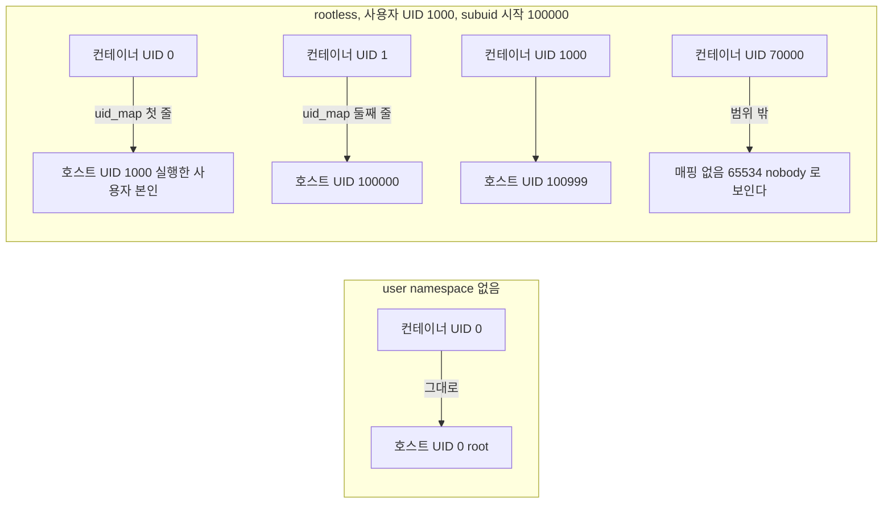
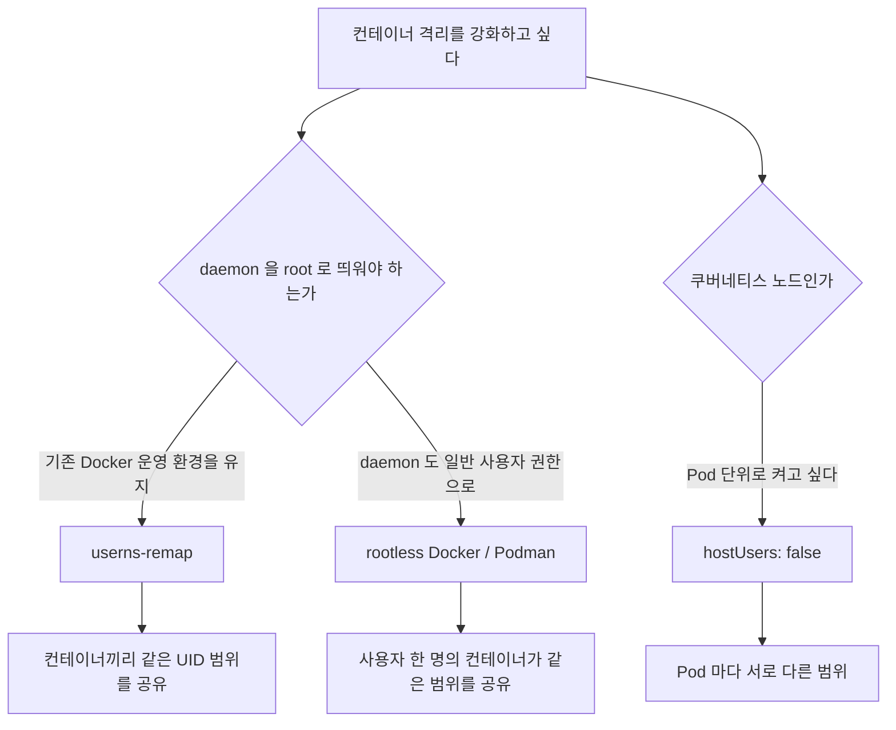
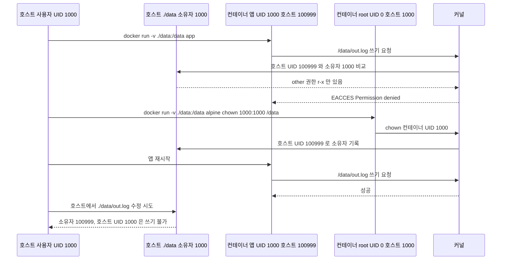
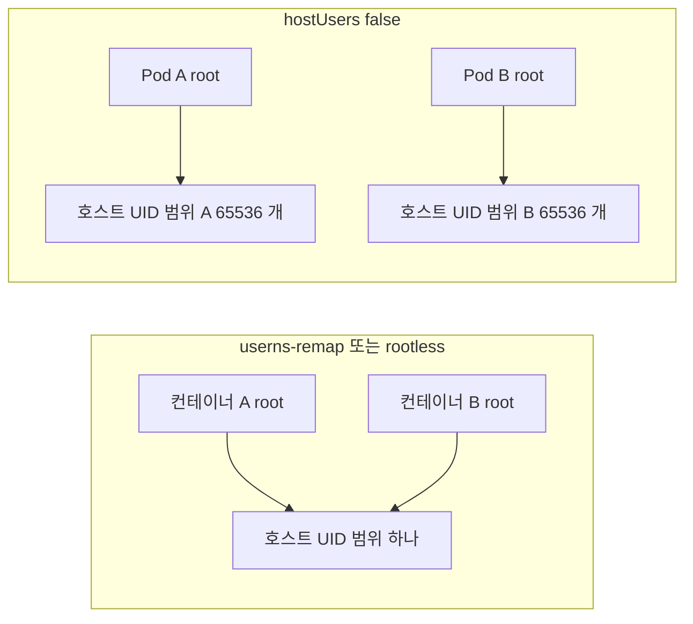
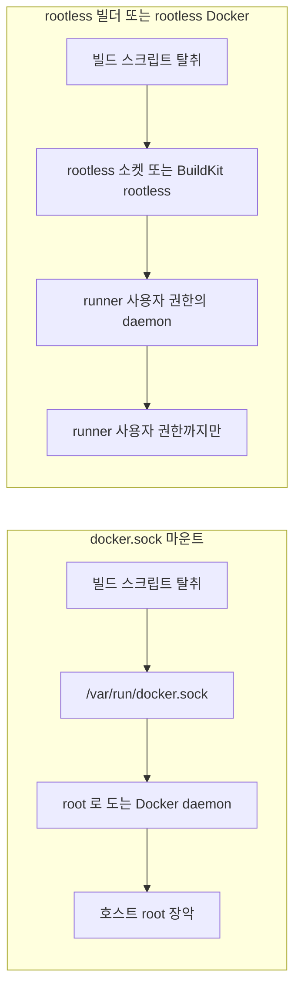

# Rootless 컨테이너와 User Namespace

[Docker 컨테이너 보안](Container_Security.md)의 non-root 절은 `Dockerfile` 에 `USER app` 을 넣으라고 한다. 이건 필요한 조치지만 컨테이너 안 root 가 호스트 root 와 같은 사람이라는 문제는 건드리지 못한다. 이미지에 `USER` 를 안 넣은 컨테이너, 서드파티 이미지, `docker run --user root` 로 뜬 컨테이너는 여전히 호스트 UID 0 이다. 이 문서는 그 구멍을 막는 user namespace 쪽을 다룬다. 방식은 세 가지다. Docker daemon 의 `userns-remap`, rootless Docker/Podman, 쿠버네티스의 `hostUsers: false`.

## USER 지시어와 userns 가 막는 대상은 다르다

`USER app` 은 컨테이너 안 프로세스의 UID 를 1000 으로 바꾼다. 이 UID 1000 은 호스트의 UID 1000 과 같은 숫자고, 커널은 둘을 구별하지 않는다. 호스트에 UID 1000 사용자의 홈 디렉토리가 있으면 그 컨테이너 프로세스는 그 파일에 접근할 권한이 있다. 반대로 `USER` 를 안 쓴 컨테이너의 root 는 호스트 UID 0 이다. 파일 접근 검사에서 커널은 UID 숫자만 본다.

user namespace 는 UID 숫자의 의미를 바꾼다. 컨테이너 안에서 UID 0 으로 보이는 프로세스가 호스트 커널에서는 UID 100000 같은 권한 없는 숫자로 취급된다. 컨테이너 안에서는 root 라서 패키지를 설치하고 파일 소유자를 바꾸지만, 컨테이너 밖 자원에는 일반 사용자 권한만 가진다.

| | USER 지시어 | user namespace |
|---|---|---|
| 바꾸는 것 | 컨테이너 프로세스의 UID | UID 의 호스트 쪽 해석 |
| 컨테이너 안 root | 없앤다 (root 로 안 뜬다) | 남기되 호스트에서는 무권한 |
| 이미지가 root 로 뜨도록 만들어진 경우 | 막지 못한다 | 막는다 |
| 호스트의 UID 1000 파일 | 접근 가능 | UID 가 안 맞으면 접근 불가 |
| 설정 위치 | 이미지 | 런타임 (daemon, 사용자, Pod) |

2019년 runc 의 CVE-2019-5736 은 컨테이너 안 root 가 호스트의 runc 바이너리를 덮어쓰는 취약점이었다. 호스트 UID 0 과 같은 사람이라서 성립한 공격이다. 컨테이너 root 가 호스트 UID 100000 으로 매핑돼 있으면 호스트의 root 소유 파일에 쓰기 권한이 없어 덮어쓰기 자체가 실패한다. `USER` 지시어는 이 이미지가 루트로 뜨지 않게 만들 뿐이고, 공격자가 컨테이너 안에서 root 를 얻는 경로(이미지 취약점, `--user root` 로 실행하는 디버깅 습관)는 남아 있다. 두 방어는 서로 대체 관계가 아니다.

## 컨테이너 UID 가 호스트 UID 로 바뀌는 과정

매핑 규칙은 두 곳에 적혀 있다. 하나는 사용자가 쓸 수 있는 호스트 UID 범위를 선언한 `/etc/subuid`, `/etc/subgid` 이고, 다른 하나는 실제로 적용된 매핑인 `/proc/<PID>/uid_map` 이다.



왼쪽 상자가 `USER` 만 쓰는 기존 방식이다. 오른쪽 상자의 첫 줄을 보면 rootless 에서는 컨테이너 root 가 호스트에서 컨테이너를 띄운 사용자 본인이 된다. 컨테이너 root 가 별도의 가짜 UID 가 아니라 사용자 계정이라는 점이 뒤의 볼륨 소유권 문제의 출발점이다.

### /etc/subuid 와 /etc/subgid

형식은 `사용자:시작UID:개수` 다.

```text
$ cat /etc/subuid
deploy:100000:65536
ci-runner:165536:65536
```

`deploy` 는 호스트 UID 100000~165535 를 자기 user namespace 안에서 쓸 수 있다. 이 파일을 직접 읽는 건 `newuidmap`, `newgidmap` 이다. 일반 사용자는 자기 user namespace 에 UID 를 한 개(자기 자신)밖에 매핑할 수 없고, 범위를 매핑하려면 setuid 바이너리인 이 두 명령이 `/etc/subuid` 를 보고 대신 써 준다. 그래서 `uidmap` 패키지가 설치돼 있어야 한다.

범위가 겹치지 않아야 한다. 사용자 A 와 B 의 subuid 범위가 겹치면 A 의 컨테이너 UID 와 B 의 컨테이너 UID 가 같은 호스트 UID 가 되고, 서로의 파일을 읽고 쓴다. `useradd` 로 만든 일반 사용자는 배포판 기본 설정(`/etc/login.defs` 의 `SUB_UID_COUNT`)에 따라 자동으로 범위를 받지만, 시스템 계정(`useradd -r`)이나 기존에 만든 계정, LDAP/SSSD 로 들어온 계정은 항목이 없는 경우가 많다. 항목이 없으면 이런 에러가 난다.

```text
newuidmap: write to uid_map failed: Operation not permitted
```

또 하나, 사내 LDAP 에서 UID 를 100000 번대로 발급하는 환경이면 기본 subuid 범위가 실제 사용자 UID 와 겹친다. 컨테이너 안 프로세스가 호스트의 실제 사용자 UID 를 갖게 되므로, 범위를 사내 UID 대역 밖으로 따로 잡아야 한다.

### uid_map 읽는 법

`/proc/<PID>/uid_map` 의 각 줄은 세 칸이다. `컨테이너 안 시작 UID`, `호스트 시작 UID`, `길이`.

```text
# 호스트의 init (user namespace 없음)
$ cat /proc/1/uid_map
         0          0 4294967295

# rootless Docker 컨테이너 안에서 (값은 머신마다 다르다)
$ docker run --rm alpine cat /proc/self/uid_map
         0       1000          1
         1     100000      65536
```

두 번째 출력의 해석은 이렇다. 컨테이너 UID 0 한 개가 호스트 1000 이 되고, 컨테이너 UID 1~65536 이 호스트 100000~165535 가 된다. 컨테이너 UID n(n≥1)의 호스트 UID 는 `100000 + (n - 1)` 이라서 컨테이너 UID 1000 은 호스트 100999 다. `userns-remap` 에서는 보통 `0 165536 65536` 처럼 한 줄이고 컨테이너 root 가 호스트 UID 165536 이 된다. 첫 줄이 `0 0 4294967295` 면 user namespace 가 없는 것이다.

호스트에서 확인하려면 컨테이너 프로세스의 호스트 PID 로 본다.

```bash
PID=$(docker inspect -f '{{.State.Pid}}' mycontainer)
cat /proc/$PID/uid_map
ps -o user:12,pid,cmd -p $PID      # 호스트가 보는 소유자
```

rootless 에서 `ps` 로 호스트의 프로세스를 보면 컨테이너 root 는 사용자 본인(`deploy`)으로, 컨테이너 UID 1000 프로세스는 `100999` 숫자 그대로 나온다. 이 숫자가 `/etc/passwd` 에 없어서 사용자 이름 대신 숫자로 찍힌다. 보안 도구가 "알 수 없는 UID 의 프로세스"로 경보를 내는 경우가 있어서, 모니터링 룰에 subuid 범위를 예외로 넣어야 한다.

컨테이너 안에서 매핑 범위 밖 UID 의 파일을 보면 소유자가 `65534`(`nobody`)로 나온다. `/proc/sys/kernel/overflowuid` 값이다. 호스트 root 소유 파일이 컨테이너 안에서 `nobody:nogroup` 으로 보이면 정상이다.

## 세 가지 방식 비교



| | rootful (기본) | userns-remap | rootless |
|---|---|---|---|
| daemon 실행 UID | 호스트 root | 호스트 root | 일반 사용자 |
| 컨테이너 root 의 호스트 UID | 0 | 100000 같은 고정 범위 | 실행한 사용자 본인 |
| daemon 탈취 시 | 호스트 root | 호스트 root | 해당 사용자 권한까지 |
| 컨테이너 간 UID 분리 | 없음 | 없음 (daemon 전체가 한 범위) | 없음 (사용자 한 명이 한 범위) |
| 1024 미만 포트 | 된다 | 된다 | sysctl 또는 capability 필요 |
| `--privileged`, `--network=host` | 된다 | 컨테이너별로 `--userns=host` 로 빼야 한다 | 의미가 다르다 (호스트가 아니라 user namespace 의 root) |
| cgroup 자원 제한 | 된다 | 된다 | cgroup v2 + systemd 위임 필요 |
| 스토리지 | overlay2 | overlay2 | 커널/배포판에 따라 native overlay 또는 fuse-overlayfs |
| 네트워크 | bridge | bridge | slirp4netns 또는 pasta (사용자 공간 NAT) |
| 도입 비용 | 없음 | daemon 재시작, 기존 이미지/컨테이너 안 보임 | 설치 방식과 CI 구성 전체 변경 |

userns-remap 과 rootless 는 daemon 이 누구냐에서 갈린다. userns-remap 은 root daemon 이 그대로고 컨테이너 프로세스만 매핑된다. daemon 이나 runc 자체에 취약점이 있으면 userns-remap 은 막아 주지 못한다. rootless 는 daemon 도 일반 사용자로 떠서 그 취약점까지 사용자 권한 안에 갇힌다. 대신 제약이 많다.

두 방식 모두 컨테이너 사이의 분리는 안 된다. userns-remap 에서는 daemon 이 띄우는 모든 컨테이너가 같은 100000 범위를 공유하고, rootless 에서도 한 사용자의 컨테이너는 전부 같은 범위다. 컨테이너 A 의 root 와 B 의 root 는 같은 호스트 UID 다. 이 부분은 쿠버네티스 `hostUsers: false` 가 낫다. Pod 마다 다른 범위를 받는다.

## userns-remap 을 켜면 생기는 일

```json
{
  "userns-remap": "default"
}
```

`/etc/docker/daemon.json` 에 위 설정을 넣고 daemon 을 재시작하면 Docker 가 `dockremap` 사용자를 만들고 `/etc/subuid` 에 범위를 넣는다. 직접 범위를 정하고 싶으면 `"userns-remap": "deploy"` 처럼 기존 사용자를 지정한다.

켜자마자 부딪히는 것들이 있다.

**기존 이미지와 컨테이너가 사라진 것처럼 보인다.** daemon 데이터 디렉토리가 `/var/lib/docker/165536.165536/` 처럼 매핑된 UID.GID 이름의 하위 디렉토리로 바뀌기 때문이다. 지워진 게 아니다. 옵션을 끄면 원래 디렉토리가 다시 보인다. 켠 직후 `docker images` 가 비어서 당황하고 이미지를 다시 pull 하는 경우가 많은데, 운영 노드라면 레지스트리 장애 시 기동이 안 되는 상황이 될 수 있어서 미리 알아야 한다.

**호스트 네임스페이스를 공유하는 옵션이 안 먹는다.** `--privileged`, `--pid=host`, `--network=host`, 호스트와 공유하는 `--ipc` 는 user namespace 와 같이 쓸 수 없다. 모니터링 에이전트, CNI, 노드 익스포터처럼 이런 옵션이 필요한 컨테이너는 `--userns=host` 로 해당 컨테이너만 매핑에서 뺀다.

```bash
docker run --userns=host --pid=host --privileged mynodeagent
```

**바인드 마운트 소유권이 어긋난다.** 호스트 디렉토리가 root 소유면 컨테이너 root(호스트 165536)는 "other" 권한으로만 접근한다. 읽기는 되고 쓰기는 `Permission denied` 가 난다. 이 문제는 뒤의 볼륨 절에서 따로 다룬다.

## rootless Docker 와 Podman 에서 막히는 것들

Docker 는 `dockerd-rootless-setuptool.sh install` 로 사용자 단위 systemd 서비스를 만든다. 소켓은 `/run/user/<UID>/docker.sock` 이고 `DOCKER_HOST` 를 그쪽으로 지정해야 한다. 로그아웃하면 사용자 세션과 함께 daemon 이 죽기 때문에 서버에서는 `loginctl enable-linger <사용자>` 가 필요하다. CI runner 용 계정에서 이걸 빼먹으면 작업이 없는 새벽에 daemon 이 내려가 있다가 첫 빌드가 `Cannot connect to the Docker daemon` 으로 실패한다. Podman 은 daemon 이 없어서 이 문제가 없다.

Podman 에서 `/etc/subuid` 를 고친 뒤에는 `podman system migrate` 를 실행해야 새 범위로 pause 프로세스가 다시 뜬다. 안 하면 파일을 고쳤는데 `uid_map` 이 그대로다.

### 1024 미만 포트

일반 사용자는 1024 미만 포트에 bind 할 수 없다. 컨테이너를 `-p 80:8080` 으로 띄우면 rootless 에서는 실패한다. 방법은 세 가지다.

```bash
# 1. 호스트 전체에서 허용 (재부팅 후 유지하려면 /etc/sysctl.d/ 에 둔다)
sudo sysctl net.ipv4.ip_unprivileged_port_start=80

# 2. rootless Docker 의 rootlesskit 바이너리에만 capability 를 준다
sudo setcap cap_net_bind_service=ep $(which rootlesskit)
systemctl --user restart docker

# 3. 80 은 앞단 프록시/방화벽 리다이렉트가 받고, 컨테이너는 8080 에 둔다
```

1번은 그 호스트의 모든 일반 사용자 프로세스가 낮은 포트를 열 수 있게 한다. 공유 서버에서는 같은 호스트의 다른 사용자가 443 을 먼저 잡아 서비스를 가로채는 일이 가능해진다. 전용 노드가 아니면 3번이 안전하다. 쿠버네티스에서는 `net.ipv4.ip_unprivileged_port_start` 가 Pod 단위로 설정할 수 있는 안전한 sysctl 이라서, 호스트 설정을 건드릴 필요 없이 `securityContext.sysctls` 로 해결된다.

### ping

컨테이너 안에서 `ping` 이 `Operation not permitted` 로 실패한다. rootful Docker 는 컨테이너에 `CAP_NET_RAW` 를 줘서 raw 소켓으로 ping 을 보낸다. rootless 에서는 ICMP echo 전용 소켓을 쓰는 경로를 타야 하고, 이 소켓은 `net.ipv4.ping_group_range` 에 프로세스의 GID 가 들어 있어야 열린다.

```bash
sysctl net.ipv4.ping_group_range
sudo sysctl -w net.ipv4.ping_group_range="0 2147483647"
```

헬스체크를 ping 에 의존하는 컨테이너가 아니면 신경 쓸 일이 적은데, 네트워크 장애를 추적하려고 컨테이너 안에서 ping 부터 치는 습관 때문에 "컨테이너 네트워크가 막혔다"로 오진하기 쉽다. ping 만 막히고 TCP 는 정상인 경우 이 설정부터 본다.

### cgroup 위임

rootless 에서 `--memory`, `--cpus` 가 무시되거나 경고가 뜬다. 일반 사용자는 cgroup 을 직접 만들 권한이 없고, cgroup v2 에서 systemd 가 사용자 단위에 컨트롤러를 위임해 줘야 한다. 기본 위임 목록에는 cpu, io 같은 컨트롤러가 빠져 있는 배포판이 있다.

```ini
# /etc/systemd/system/user@.service.d/delegate.conf
[Service]
Delegate=cpu cpuset io memory pids
```

적용 후 `systemctl daemon-reload` 와 사용자 세션 재시작이 필요하다. 확인은 `cat /sys/fs/cgroup/user.slice/user-1000.slice/user@1000.service/cgroup.controllers` 에 원하는 컨트롤러가 있는지 본다. cgroup v1 호스트에서는 rootless 자원 제한이 지원되지 않는다. 메모리 제한이 안 걸린 채로 운영에 나가면 한 컨테이너의 누수가 호스트 OOM 으로 번진다. `docker stats` 의 LIMIT 칸이 호스트 전체 메모리로 나오는지 배포 전에 본다.

### 스토리지

rootless 에서 이미지 레이어를 겹치는 방법은 세 가지다. 커널의 overlayfs 를 그대로 쓰는 native overlay, 사용자 공간 파일시스템인 fuse-overlayfs, 겹치지 않고 레이어마다 통째로 복사하는 vfs.

native overlay 는 일반 사용자가 user namespace 안에서 overlayfs 를 마운트할 수 있어야 하고, 이게 커널 5.11 부터 되는 것으로 알려져 있다. Ubuntu 등 일부 배포판은 그 전에도 자체 패치로 지원했다. 오래된 커널이면 fuse-overlayfs 로 떨어지는데, 파일 I/O 가 FUSE 를 거쳐 사용자 공간 프로세스를 왕복하므로 `npm install` 처럼 작은 파일을 많이 쓰는 빌드에서 차이가 난다. vfs 는 레이어를 통째로 복사해서 디스크를 많이 쓰고 이미지 pull 도 눈에 띄게 느려서 마지막 수단이다.

```bash
docker info --format '{{.Driver}}'
podman info --format '{{.Store.GraphDriverName}}'
```

`vfs` 가 찍히면 빌드가 느린 원인이 거기 있다. 로컬에서는 괜찮다가 CI runner 컨테이너 안에서 갑자기 vfs 가 되는 경우도 있다. 컨테이너의 쓰기 레이어(이미 overlayfs) 위에 다시 overlayfs 를 올릴 수 없기 때문이고, 이 경우 스토리지 경로를 `emptyDir` 이나 호스트 볼륨으로 빼야 한다.

## 네트워크

rootless 컨테이너는 호스트에 veth 와 bridge 를 만들 권한이 없다. 대신 user namespace 안의 network namespace 와 호스트를 사용자 공간 프로그램이 이어 준다. 패킷이 커널 → TAP 장치 → 사용자 공간 프로세스 → 다시 커널 소켓 순서로 지나간다.


위 그림에서 볼 점은 패킷이 사용자 공간 프로세스를 한 번 거친다는 것이고, 아래 두 목록이 그 프로세스의 구현 차이다.

- slirp4netns: 오래된 기본값. 패킷을 사용자 공간 TCP/IP 스택이 다시 조립한다.
- pasta (passt 프로젝트): 패킷을 재조립하지 않고 호스트 소켓으로 전달한다. Podman 5.0 부터 기본이다.

컨테이너 → 외부 요청의 지연과 처리량이 rootful bridge 보다 나쁘다. 내부 API 호출 위주의 서비스는 체감이 적지만, 컨테이너가 큰 이미지를 pull 하거나 DB 로 대량 쿼리를 보내는 경우 차이가 난다. 실제 수치는 호스트와 kernel 에 따라 달라서 문서에 못 박을 수 없고, 이전하기 전에 같은 워크로드를 rootful 과 rootless 에서 돌려 비교해야 한다.

들어오는 요청이 더 문제다. 포트 퍼블리시를 처리하는 방식에 따라 컨테이너가 보는 클라이언트 IP 가 달라진다. rootless Docker 기본 포트 드라이버(builtin)에서는 접속 로그의 출발지 IP 가 실제 클라이언트가 아니라 내부 주소(`172.x` 또는 `127.0.0.1`)로 찍히는 경우가 있다. 접근 제어나 rate limit 이 IP 를 기준으로 하면 모든 요청이 같은 주소로 보여 한 번에 차단된다. slirp4netns 포트 드라이버로 바꾸면 출발지 IP 가 보존되지만 처리량이 떨어진다. 클라이언트 IP 가 중요한 서비스는 앞단 로드밸런서가 `X-Forwarded-For` 나 PROXY protocol 로 넘기게 하고, 컨테이너 쪽에서 포트 드라이버에 의존하지 않는 게 낫다.

## 볼륨 마운트에서 소유권이 꼬이는 문제

rootless 에서 가장 자주 겪는 문제다. 호스트 사용자 UID 1000 이 `./data` 를 만들고 컨테이너에 마운트한다. 이미지에는 `USER 1000` 이 있다.



위쪽 절반은 쓰기가 막히는 과정이고, 아래쪽 절반은 `chown` 으로 풀었더니 이번엔 호스트 사용자가 자기 디렉토리를 못 쓰게 되는 반전이다.

앱은 컨테이너 안에서는 UID 1000 이지만 호스트 커널은 100999 로 본다. `./data` 의 소유자는 호스트 1000 이라서 100999 는 소유자도 그룹도 아닌 other 다. 컨테이너 root 는 호스트 1000 이라서 소유자 권한을 가지고, 그래서 root 로 뜬 컨테이너는 멀쩡히 쓴다. "root 로 하면 되는데 USER 를 붙이니 안 된다"는 증상이 이 구조 때문에 생긴다. 이것 때문에 권한을 `chmod 777` 로 열어 버리는 사람이 많다. user namespace 의 이점을 스스로 없애는 선택이다.

해결 방법은 상황별로 나뉜다.

**Podman: `--userns=keep-id`.** 호스트 사용자의 UID 를 컨테이너 안에서도 같은 숫자로 보이게 매핑한다. 호스트 1000 이 컨테이너 1000 이 되므로 `USER 1000` 인 앱이 바로 호스트 사용자 소유 파일에 접근한다.

```bash
podman run --userns=keep-id --user 1000:1000 -v ./data:/data:Z app
```

**Podman: `:U` 옵션.** 컨테이너 시작 시 마운트한 디렉토리를 컨테이너 안 사용자 소유로 `chown` 한다. 호스트에서는 그 디렉토리가 subuid 대역 소유로 바뀌어 호스트 사용자가 건드리기 어려워진다. 개발 중 쓰고 버리는 데이터에 적합하다. 소스 코드를 마운트하면 안 된다. git 작업 트리의 소유권이 통째로 바뀐다.

**명시적 chown.** 위 시퀀스 다이어그램처럼 컨테이너 root 로 `chown` 하는 방법이다. Podman 에는 이를 호스트에서 바로 하는 `podman unshare chown -R 1000:1000 ./data` 가 있다. user namespace 안에 들어가서 실행하므로 숫자 1000 이 호스트 100999 로 기록된다.

**ACL.** 호스트 사용자와 컨테이너 UID 가 둘 다 쓰게 하려면 가장 덜 침습적이다.

```bash
setfacl -R -m u:100999:rwX ./data
setfacl -R -d -m u:100999:rwX ./data    # 앞으로 생기는 파일에도
```

**named volume.** 데이터를 호스트에서 직접 볼 필요가 없으면 named volume 이 문제가 없다. rootless Docker 는 사용자 홈 아래(`~/.local/share/docker/volumes`)에 만들고 소유권을 알아서 맞춘다.

userns-remap 에서도 같은 문제가 생긴다. 컨테이너 root 가 호스트 UID 165536 이니 root 소유 호스트 디렉토리에 쓰려면 `chown 165536:165536` 이 필요하다. 이때 숫자를 하드코딩한 스크립트를 만들면 범위를 바꾸는 순간 깨진다. `/etc/subuid` 에서 값을 읽어 계산하게 해야 한다.

### 이미지 빌드 중 lchown 에러

rootless 에서 이미지를 pull 하거나 빌드하다 이런 에러가 나는 경우가 있다.

```text
potentially insufficient UIDs or GIDs available in user namespace
(requested 0:42 for /etc/shadow): Check /etc/subuid and /etc/subgid
```

이미지 레이어 안에 `shadow` 그룹(GID 42) 소유 파일이 있는데, 사용자가 쓸 수 있는 GID 범위에 42 가 매핑돼 있지 않은 경우다. `/etc/subgid` 항목이 없거나, `newuidmap` 이 setuid 가 아니라서 UID 한 개만 매핑된 상태에서 나온다. `uidmap` 패키지 설치와 `/etc/subuid`, `/etc/subgid` 항목을 확인하고, Podman 은 `podman system migrate` 로 설정을 다시 읽힌다.

## 쿠버네티스에서 hostUsers: false

Pod 스펙에 `hostUsers: false` 를 넣으면 kubelet 과 런타임이 Pod 마다 user namespace 를 만든다.

```yaml
apiVersion: v1
kind: Pod
metadata:
  name: api
spec:
  hostUsers: false
  containers:
    - name: api
      image: registry.example.com/api:1.4.2
      securityContext:
        runAsUser: 1000
```

도커의 두 방식과 다른 점은 Pod 마다 서로 다른 호스트 UID 범위를 받는다는 점이다. Pod A 의 root 와 Pod B 의 root 가 호스트에서 다른 UID 라서, 한 Pod 이 탈출해도 이웃 Pod 의 파일에 접근하지 못한다. 컨테이너 UID 범위는 Pod 당 65536 개 단위로 할당된다.

아래 그림은 앞의 두 방식과 Pod 단위 매핑을 나란히 놓은 것이다. 왼쪽은 컨테이너가 하나의 호스트 범위를 공유하고, 오른쪽은 Pod 마다 호스트 범위가 갈린다.



기능이 켜져 있는지는 버전에 따라 다르다. 알파로 시작해 1.30 부터 베타(`UserNamespacesSupport` feature gate)가 됐고 이후 버전에서 기본 활성화 쪽으로 가고 있어서, 클러스터 버전의 릴리스 노트를 확인해야 한다. 요구 조건은 많다.

- 노드 커널이 idmapped mount 를 지원해야 한다 (공식 문서는 리눅스 6.3 이상을 요구하는 것으로 안내한다).
- 컨테이너 런타임이 지원해야 한다 (containerd 2.0 이상, CRI-O 최신 버전). runc 나 crun 도 일정 버전 이상이어야 한다.
- 노드의 `/etc/subuid`, `/etc/subgid` 에 `kubelet` 사용자 항목이 있어야 하고, 범위가 `65536 × 노드 최대 Pod 수` 이상이어야 한다.
- `hostNetwork`, `hostPID`, `hostIPC` 를 쓰는 Pod 은 `hostUsers: false` 를 함께 쓸 수 없다.

켜는 순간 부딪히는 것은 볼륨이다. Pod 이 쓰는 PV 의 파일 소유자는 호스트 UID 기준이고 Pod 의 UID 범위는 그것과 어긋난다. 쿠버네티스는 이를 idmapped mount 로 풀어 호스트의 소유자를 Pod 의 UID 로 바꿔 보여 주는데, 모든 볼륨 타입이 지원하는 것은 아니다. 스토리지 드라이버, 파일시스템, 커널 조합에서 마운트가 실패하는 경우가 있어서 상태를 가진 워크로드(DB, 큐)는 스테이징 클러스터에서 먼저 PV 를 붙여 본다.

확인은 Pod 안에서 `uid_map` 을 보면 된다.

```bash
kubectl exec api -- cat /proc/self/uid_map
```

두 번째 칸이 `0` 이 아닌 큰 숫자면 적용된 것이다. `hostUsers` 필드를 넣었는데도 첫 줄이 `0 0 4294967295` 면 노드가 필드를 무시한 것이다. 이전 버전의 kubelet 이 알 수 없는 필드를 조용히 버리거나, 런타임이 지원하지 않는 경우다. 이 확인을 배포 후에 안 하면 보호가 켜졌다고 믿고 있는 채로 아무 효과가 없는 상태가 된다.

## CI runner 를 docker.sock 에서 옮길 때

CI 에서 이미지 빌드를 위해 `/var/run/docker.sock` 을 마운트하면 빌드 스크립트 하나가 호스트 root 를 가진 것과 같다. PR 의 빌드 스크립트를 외부 기여자가 수정할 수 있는 저장소라면 그대로 호스트 장악 경로다. 대안은 rootless Docker 를 runner 호스트에 두거나, 컨테이너 안에서 도는 rootless 빌더(BuildKit rootless, Podman/Buildah)로 바꾸는 것이다.

두 경로에서 빌드 스크립트가 탈취됐을 때 어디까지 열리는지 비교한 그림이다. 소켓 뒤의 daemon 이 누구 권한이냐가 갈림길이다.



[Container Security](Container_Security.md) 의 마지막 절에는 "kaniko 같은 rootless 빌드 도구"라고 적혀 있는데 정확히는 다르다. kaniko 는 Docker daemon 이 필요 없는(daemonless) 빌더이지 rootless 가 아니다. 공식 executor 이미지는 컨테이너 안에서 UID 0 으로 돌면서 자기 루트 파일시스템 위에 이미지를 푼다. docker.sock 은 없앴지만 컨테이너 root 는 그대로이므로, 이 Pod 에 `hostUsers: false` 를 붙이거나 노드를 격리해서 쓰는 식으로 같이 막아야 한다. 또 kaniko 의 업스트림 저장소는 유지보수 상태가 바뀌었다는 안내가 있어서, 새로 도입하기 전에 현재 상태를 확인해야 한다.

### 옮기면서 겪는 일

**BuildKit rootless 는 /proc 마운트 때문에 보안 프로파일을 풀어야 한다.** `moby/buildkit:rootless` 이미지는 UID 1000 으로 돌고, 빌드 단계마다 새 `/proc` 을 마운트한다. 쿠버네티스 기본 seccomp, AppArmor 프로파일은 이 마운트를 막는다. 그래서 공식 예제가 Pod 에 `seccompProfile: Unconfined` 와 AppArmor unconfined 를 쓴다. 프로파일을 푸는 대신 `--oci-worker-no-process-sandbox` 를 쓰는 방법이 있는데, 빌드 컨테이너가 서로의 프로세스를 볼 수 있게 되는 대가가 있다. 보안 때문에 옮겼는데 프로파일을 푼 컨테이너가 남는 셈이라, 어느 쪽을 택해도 빌드 전용 노드 풀에서 돌린다. `hostUsers: false` 를 쓸 수 있는 클러스터면 프로세스 샌드박스를 끄지 않아도 되는 경로가 열린다.

**스토리지 경로가 overlay 위의 overlay 가 된다.** 컨테이너 쓰기 레이어에서 BuildKit 이 overlayfs 를 쓰려 하면 실패하고 느린 snapshotter 로 떨어진다. BuildKit 데이터 디렉토리(`~/.local/share/buildkit`)에 `emptyDir` 를 마운트한다. 이걸 빼먹으면 빌드가 되긴 하지만 평소보다 훨씬 오래 걸리는 형태로 나타나서 원인을 찾기 어렵다.

**빌드 캐시가 사라진다.** docker.sock 방식은 호스트 daemon 이 캐시를 쥐고 있어서 작업 사이에 레이어 캐시가 유지됐다. 매 작업이 새 Pod 에서 뜨는 rootless 빌더에서는 캐시가 없다. 레지스트리를 캐시 저장소로 쓰는 `--export-cache type=registry`, `--import-cache type=registry` 로 옮기는 작업이 같이 따라온다. 이걸 안 하고 옮기면 파이프라인 시간이 갑자기 눈에 띄게 늘어난다.

**러너 계정의 subuid.** 호스트에 rootless Docker 를 두는 방식에서는 runner 를 돌리는 서비스 계정에 `/etc/subuid`, `/etc/subgid` 항목과 `loginctl enable-linger` 가 필요하다. 시스템 계정(`useradd -r`)으로 만들어 둔 runner 계정은 항목이 없다. 새 계정을 일반 사용자로 만드는 쪽이 간단하다.

**빌드 스크립트의 가정이 깨진다.** `docker run -v $PWD:/src` 로 소스를 마운트해 테스트를 도는 단계가 있으면 앞의 볼륨 소유권 문제가 그대로 나온다. 산출물(`dist/`, 커버리지 리포트)이 컨테이너 UID 로 만들어져서 다음 단계에서 호스트 사용자가 못 지우는 경우도 있다. runner 워크스페이스 정리가 `Permission denied` 로 실패하는 증상이면 이것이다. 정리 단계를 `podman unshare rm -rf` 또는 컨테이너 안 `rm` 으로 바꿔야 한다.

**docker-in-docker 를 쓰는 테스트.** Testcontainers 처럼 테스트가 컨테이너를 직접 띄우는 경우가 가장 큰 변경이다. docker.sock 이 없으면 테스트 코드가 `unix:///var/run/docker.sock` 을 못 찾는다. rootless 소켓 경로를 `DOCKER_HOST` 로 넘기고 소켓을 마운트해야 하는데, 그러면 소켓을 마운트하는 구조가 남는다. 다만 이 소켓은 rootless daemon 의 것이라서 뚫려도 호스트 root 가 아니라 runner 사용자 권한까지만 열린다. 보안 목표가 호스트 root 차단이라면 달성한 것이고, runner 사용자의 자격증명(레지스트리 토큰 등)까지 막는 것이 목표라면 그 계정에 비밀을 두지 않는 별도 설계가 필요하다.

이전 순서는 영향이 작은 쪽부터 잡는다. 이미지만 빌드하는 파이프라인을 BuildKit rootless 로 먼저 옮기고, 소켓에 의존하는 통합 테스트 파이프라인은 전용 runner 로 격리한 뒤에 마지막으로 처리한다. 전 파이프라인을 한 번에 옮기면 어느 단계가 어떤 가정을 깼는지 분리해서 보기 어렵다.
