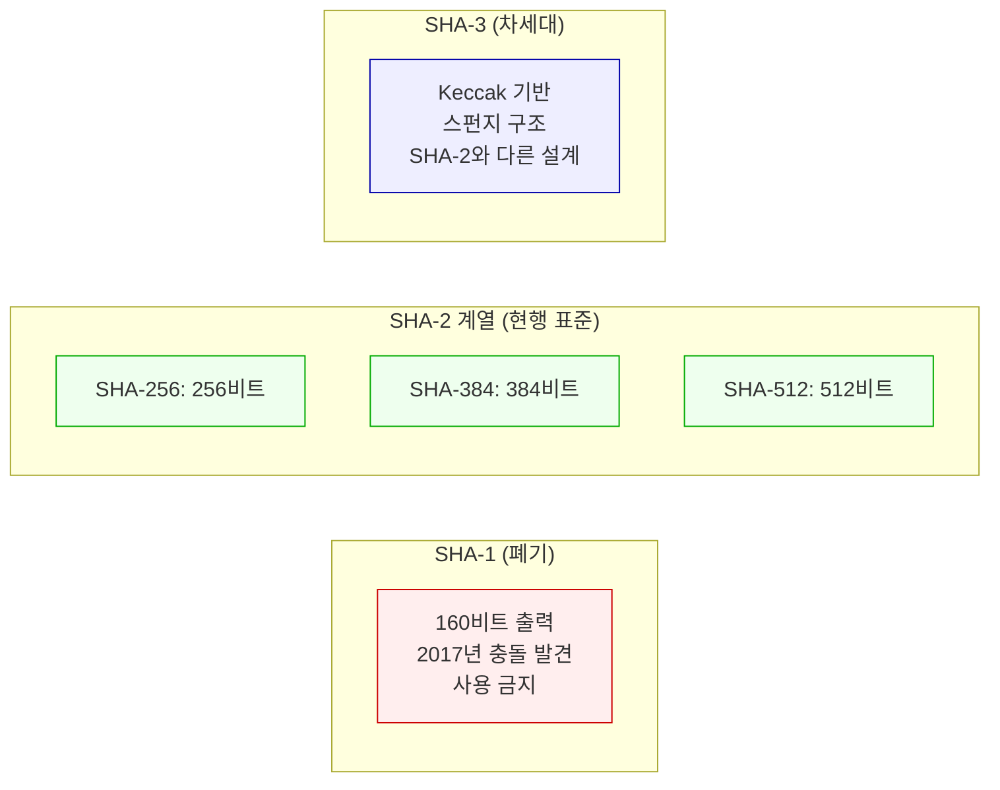
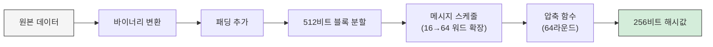
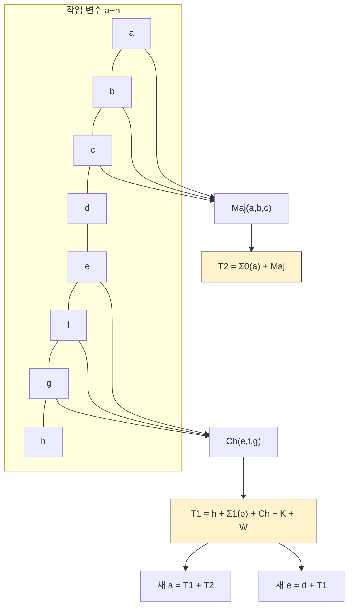
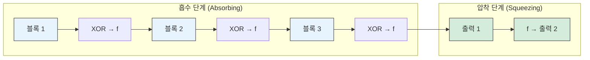

# SHA (Secure Hash Algorithm)

## 개요

SHA는 미국 NSA가 설계하고 NIST가 표준화한 **암호학적 해시 함수** 군이다. 임의 길이의 데이터를 **고정 길이의 해시값**으로 변환한다. 일방향 함수이므로 해시값에서 원본 데이터를 역산할 수 없다.

### 해시 함수의 핵심 성질

| 성질 | 설명 |
|------|------|
| **결정성** | 같은 입력이면 항상 같은 출력이 나온다 |
| **고정 길이 출력** | 입력 크기와 무관하게 일정한 길이 |
| **눈사태 효과** | 입력이 1비트만 변해도 출력이 완전히 달라진다 |
| **역상 저항성** | 해시값으로부터 원본을 찾을 수 없다 |
| **충돌 저항성** | 같은 해시를 만드는 두 입력을 찾을 수 없다 |

```
입력: "hello world"  →  SHA-256  →  b94d27b9934d3e08...  (64자 16진수)
입력: "hello worle"  →  SHA-256  →  3f2e7d95b319a14b...  (완전히 다름)
```

---

## SHA 계열 비교



| 알고리즘 | 출력 크기 | 블록 크기 | 라운드 수 | 상태 | 주요 용도 |
|---------|----------|----------|----------|------|----------|
| **SHA-1** | 160비트 | 512비트 | 80 | 취약 (2017년 충돌 발견) | 사용 금지 |
| **SHA-256** | 256비트 | 512비트 | 64 | 안전 | 일반 해싱, 블록체인, JWT |
| **SHA-384** | 384비트 | 1024비트 | 80 | 안전 | TLS 인증서 |
| **SHA-512** | 512비트 | 1024비트 | 80 | 안전 | 높은 보안 요구 환경 |
| **SHA-3-256** | 256비트 | 1088비트 | 24 | 안전 (최신) | SHA-2 대안, 다중 해시 필요 시 |

실무에서는 대부분 **SHA-256**이면 충분하다. SHA-1은 절대 사용하지 않는다.

---

## SHA-256 동작 원리

### 블록 처리 과정



**각 단계 설명:**

1. **바이너리 변환**: 문자열을 ASCII 코드 → 이진수로 변환한다
2. **패딩**: 데이터 끝에 `1`을 추가하고 `0`으로 채워 448비트로 맞춘다. 마지막 64비트에 원본 데이터의 길이를 기록한다
3. **블록 분할**: 전체 데이터를 512비트 단위로 나눈다
4. **메시지 스케줄**: 블록의 16개 32비트 워드를 시그마 함수로 64개 워드로 확장한다
5. **압축 함수**: 초기 해시값(H0~H7, 소수의 제곱근에서 유도)에 대해 64라운드 압축을 수행한다. 각 라운드에서 Ch, Maj, 시그마 연산과 상수 K를 적용한다
6. **최종 해시**: 8개의 32비트 워드를 연결하여 256비트(32바이트) 해시값을 출력한다

### 압축 함수 1라운드 구조



각 라운드에서 8개 작업 변수(a~h)가 시프트되면서 갱신된다. 64라운드가 끝나면 초기값에 결과를 더해 다음 블록의 입력으로 사용한다.

---

## SHA-3 (Keccak) 스펀지 구조

SHA-3는 SHA-2와 완전히 다른 내부 구조를 쓴다. Merkle-Damgård 구조 대신 **스펀지 구조(Sponge Construction)**를 사용한다.

### 스펀지 구조 동작



스펀지 구조의 내부 상태는 **r(rate) + c(capacity)** 비트로 구성된다.

- **r (rate)**: 외부 입출력과 직접 XOR되는 영역. 클수록 처리 속도가 빠르다
- **c (capacity)**: 외부에 노출되지 않는 영역. 클수록 보안 수준이 높다
- **f (순열 함수)**: Keccak-f[1600]. 1600비트 상태에 대해 24라운드 순열을 수행한다

**흡수 단계**: 입력 메시지를 r비트 블록으로 나눠서 내부 상태에 XOR한 뒤 f를 적용한다. 모든 블록을 처리할 때까지 반복한다.

**압착 단계**: 내부 상태에서 r비트씩 꺼내 출력한다. 원하는 길이만큼 출력이 나올 때까지 f를 적용하며 반복한다.

SHA-2와의 차이점:

- SHA-2는 Merkle-Damgård 구조로, 길이 확장 공격(Length Extension Attack)에 노출될 수 있다. HMAC으로 감싸서 방어한다
- SHA-3는 스펀지 구조 자체가 길이 확장 공격에 면역이다. HMAC 없이 단순 키 프리픽스만으로도 MAC을 구성할 수 있다
- SHA-3는 출력 길이를 자유롭게 지정할 수 있는 SHAKE128, SHAKE256 같은 XOF(Extendable Output Function)도 제공한다

---

## 실무 사용 예시

### 데이터 무결성 검증

```java
import java.security.MessageDigest;
import java.nio.charset.StandardCharsets;

public class HashUtil {

    public static String sha256(String data) {
        MessageDigest digest = MessageDigest.getInstance("SHA-256");
        byte[] hash = digest.digest(data.getBytes(StandardCharsets.UTF_8));

        // 바이트 배열 → 16진수 문자열
        StringBuilder hexString = new StringBuilder();
        for (byte b : hash) {
            hexString.append(String.format("%02x", b));
        }
        return hexString.toString();
    }
}
```

```javascript
// Node.js
const crypto = require('crypto');

function sha256(data) {
    return crypto.createHash('sha256').update(data, 'utf8').digest('hex');
}

// 파일 무결성 검증
const fs = require('fs');
function fileHash(filePath) {
    const data = fs.readFileSync(filePath);
    return crypto.createHash('sha256').update(data).digest('hex');
}
```

### sha256sum CLI 사용법

서버에서 파일 무결성을 확인할 때 자주 쓴다.

```bash
# 파일의 SHA-256 해시 계산
sha256sum myfile.tar.gz
# 출력: e3b0c44298fc1c14...  myfile.tar.gz

# macOS에서는 shasum 사용
shasum -a 256 myfile.tar.gz

# 체크섬 파일로 일괄 검증
sha256sum -c checksums.txt
# 출력: myfile.tar.gz: OK

# 문자열의 해시값 확인 (파이프 사용)
echo -n "hello" | sha256sum
# 주의: echo -n 없이 하면 개행 문자가 포함되어 해시값이 달라진다

# openssl로도 가능
openssl dgst -sha256 myfile.tar.gz
```

`-n` 옵션 빠뜨리는 실수가 많다. `echo "hello"`와 `echo -n "hello"`의 해시값은 완전히 다르다. `echo`는 기본적으로 끝에 `\n`을 붙이기 때문이다.

---

## HMAC (Hash-based Message Authentication Code)

SHA에 **비밀 키**를 결합하여 메시지의 무결성과 인증을 동시에 수행한다. 단순 SHA 해시는 누구나 계산할 수 있지만, HMAC은 키를 알아야만 같은 값을 만들 수 있다.

```
SHA-256:       hash(message)                → 무결성 검증만 가능
HMAC-SHA-256:  hash(key ⊕ opad || hash(key ⊕ ipad || message))  → 무결성 + 인증
```

### Webhook 서명 검증

외부 서비스(GitHub, Stripe, Slack 등)에서 Webhook을 보낼 때 HMAC 서명을 함께 전송한다. 수신 측에서 같은 키로 서명을 재계산하여 요청이 위조되지 않았는지 확인한다.

```java
import javax.crypto.Mac;
import javax.crypto.spec.SecretKeySpec;
import java.nio.charset.StandardCharsets;

public class WebhookVerifier {

    /**
     * GitHub Webhook 서명 검증 예시
     * GitHub은 X-Hub-Signature-256 헤더에 sha256=... 형식으로 서명을 보낸다
     */
    public static boolean verifyGitHubWebhook(String payload, String signature, String secret) {
        String computed = "sha256=" + hmacSha256(payload, secret);
        // 타이밍 공격 방지를 위해 MessageDigest.isEqual 사용
        return MessageDigest.isEqual(
            computed.getBytes(StandardCharsets.UTF_8),
            signature.getBytes(StandardCharsets.UTF_8)
        );
    }

    public static String hmacSha256(String data, String secret) {
        Mac mac = Mac.getInstance("HmacSHA256");
        mac.init(new SecretKeySpec(
            secret.getBytes(StandardCharsets.UTF_8), "HmacSHA256"
        ));
        byte[] hash = mac.doFinal(data.getBytes(StandardCharsets.UTF_8));
        StringBuilder sb = new StringBuilder();
        for (byte b : hash) {
            sb.append(String.format("%02x", b));
        }
        return sb.toString();
    }
}
```

Webhook 서명 검증에서 흔한 실수:

- **문자열 비교에 `equals()` 사용**: 타이밍 공격에 노출된다. `MessageDigest.isEqual()`이나 상수 시간 비교 함수를 써야 한다
- **payload를 파싱한 후 재직렬화**: 원본 바이트 그대로 검증해야 한다. JSON 파싱 후 다시 직렬화하면 키 순서나 공백이 달라져서 서명이 불일치한다
- **인코딩 미지정**: `getBytes()` 대신 `getBytes(StandardCharsets.UTF_8)`을 명시해야 한다

### Stripe Webhook 검증 (Node.js)

```javascript
const crypto = require('crypto');

function verifyStripeWebhook(payload, sigHeader, secret) {
    const elements = sigHeader.split(',');
    const timestamp = elements.find(e => e.startsWith('t=')).substring(2);
    const signature = elements.find(e => e.startsWith('v1=')).substring(3);

    // Stripe은 timestamp.payload 형식으로 서명한다
    const signedPayload = `${timestamp}.${payload}`;
    const expected = crypto
        .createHmac('sha256', secret)
        .update(signedPayload, 'utf8')
        .digest('hex');

    // 타이밍 공격 방지
    return crypto.timingSafeEqual(
        Buffer.from(signature, 'hex'),
        Buffer.from(expected, 'hex')
    );
}
```

---

## 트러블슈팅: 인코딩 차이로 해시값이 안 맞는 경우

실무에서 가장 자주 겪는 문제다. 같은 문자열인데 해시값이 다르게 나오는 상황.

### 원인 1: 문자 인코딩 차이

```java
// 이렇게 하면 시스템 기본 인코딩을 사용한다 (환경마다 다를 수 있다)
byte[] bytes = "안녕".getBytes();  // 위험

// UTF-8을 명시해야 한다
byte[] bytes = "안녕".getBytes(StandardCharsets.UTF_8);  // 안전
```

로컬 개발 환경은 UTF-8인데, 운영 서버가 EUC-KR이나 ISO-8859-1이면 같은 문자열이라도 바이트 배열이 달라진다. **인코딩은 반드시 명시한다.**

### 원인 2: 개행 문자 차이 (CRLF vs LF)

```bash
# Windows에서 생성한 파일 (CRLF: \r\n)
echo "hello" > file_win.txt    # 0x68 0x65 0x6c 0x6c 0x6f 0x0d 0x0a

# Linux에서 생성한 파일 (LF: \n)
echo "hello" > file_linux.txt  # 0x68 0x65 0x6c 0x6c 0x6f 0x0a
```

Git에서 `core.autocrlf` 설정에 따라 체크아웃 시 개행 문자가 변환되기도 한다. 파일 해시를 비교할 때는 개행 문자 처리를 통일해야 한다.

### 원인 3: BOM (Byte Order Mark)

UTF-8 BOM이 붙은 파일은 앞에 `0xEF 0xBB 0xBF` 3바이트가 추가된다. 텍스트 편집기에서는 보이지 않지만 해시 계산에는 포함된다.

```bash
# BOM 확인
xxd file.txt | head -1
# BOM 있는 경우: 00000000: efbb bf48 656c 6c6f  ...Hello

# BOM 제거
sed -i '1s/^\xEF\xBB\xBF//' file.txt
```

### 원인 4: 후행 공백이나 개행

API 응답 본문을 해싱할 때 앞뒤 공백을 trim하고 해싱하는 쪽과 원본 그대로 해싱하는 쪽이 다르면 값이 달라진다. 서명 검증에서는 원본 바이트를 그대로 사용하는 것이 원칙이다.

### 디버깅 방법

```bash
# 두 파일의 바이트 레벨 차이 확인
xxd file1.txt > /tmp/hex1.txt
xxd file2.txt > /tmp/hex2.txt
diff /tmp/hex1.txt /tmp/hex2.txt

# 문자열의 정확한 바이트 확인
echo -n "test" | xxd
```

---

## 비밀번호 해싱은 SHA가 아니다

**SHA-256은 비밀번호 해싱에 부적합**하다. SHA는 빠른 속도로 설계되었기 때문에 GPU 기반 brute force 공격에 취약하다.

| 알고리즘 | 용도 | 속도 | 비밀번호 해싱 |
|---------|------|------|-------------|
| **SHA-256** | 데이터 무결성 | 매우 빠름 | 부적합 |
| **BCrypt** | 비밀번호 해싱 | 의도적으로 느림 | 권장 |
| **Argon2** | 비밀번호 해싱 | 의도적으로 느림 + 메모리 사용 | 최신 권장 |
| **PBKDF2** | 비밀번호 해싱 | 반복으로 느리게 | FIPS 호환 필요 시 |

```java
// SHA로 비밀번호를 저장하면 안 된다
String hashed = sha256(password);  // brute force에 취약

// BCrypt 사용 (Spring Security)
String hashed = new BCryptPasswordEncoder().encode(password);

// Argon2 사용
String hashed = new Argon2PasswordEncoder(16, 32, 1, 65536, 3).encode(password);
```

---

## SHA 용도 정리

| 용도 | 적합한 알고리즘 |
|------|---------------|
| **파일 무결성** | SHA-256 |
| **API 서명 검증** | HMAC-SHA-256 |
| **디지털 인증서** | SHA-256, SHA-384 |
| **블록체인** | SHA-256 (Bitcoin) |
| **비밀번호 저장** | BCrypt, Argon2 (SHA 사용 금지) |
| **JWT 서명** | HMAC-SHA-256, RS256 |
| **Git 커밋 해시** | SHA-1에서 SHA-256으로 전환 중 |

---

## 참고

- [NIST FIPS 180-4 (SHA-2 표준)](https://csrc.nist.gov/publications/detail/fips/180/4/final)
- [NIST FIPS 202 (SHA-3 표준)](https://csrc.nist.gov/publications/detail/fips/202/final)
- [AES 암호화](AES.md) — 대칭키 암호화
- [RSA 암호화](RSA.md) — 비대칭키 암호화
