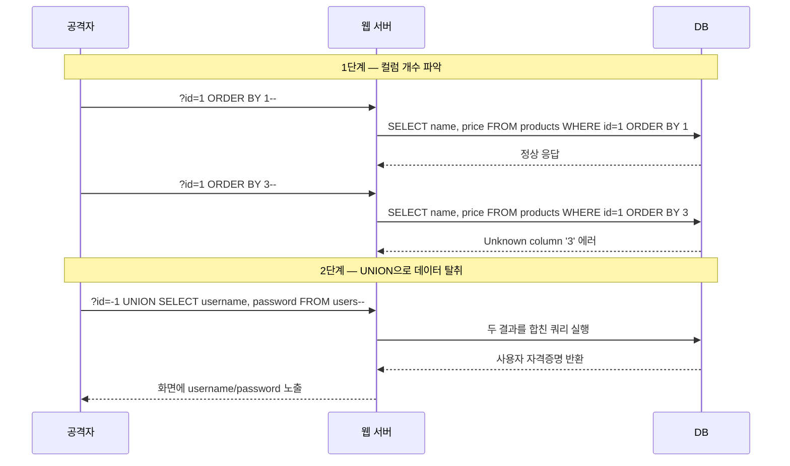
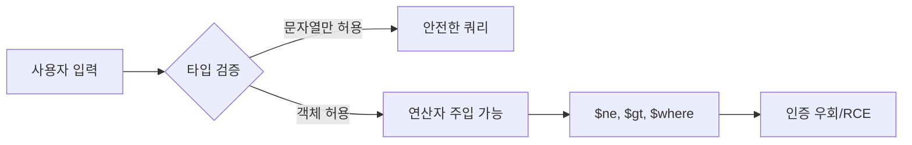
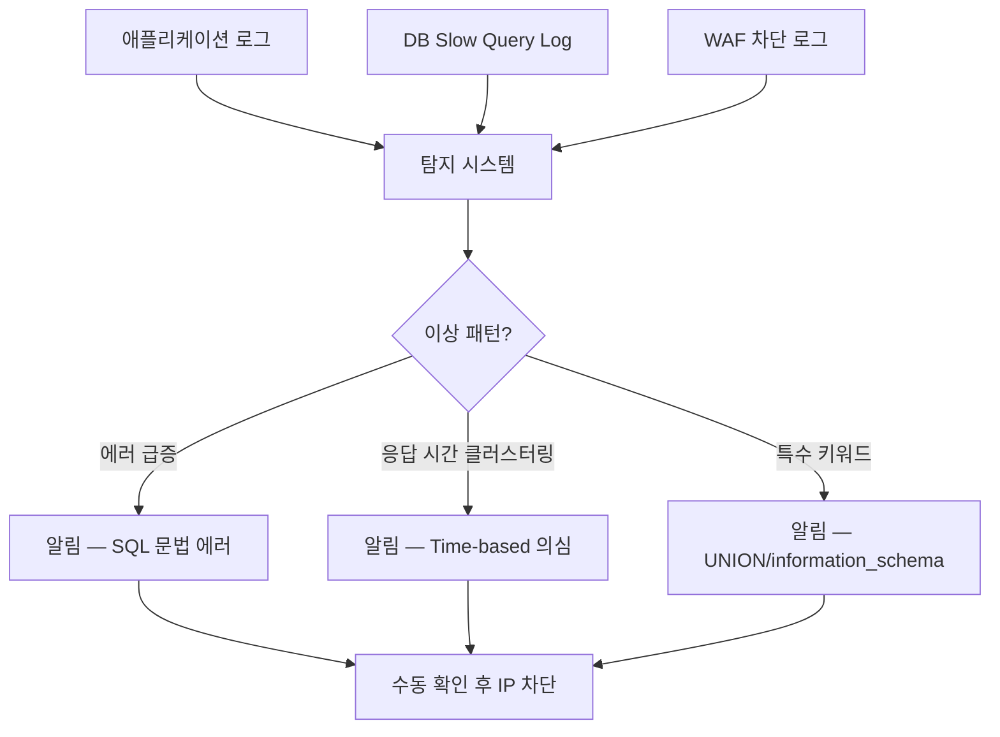

# SQL Injection

사용자 입력을 SQL 쿼리에 그대로 끼워 넣어 의도하지 않은 쿼리가 실행되는 공격이다. 1998년 Phrack 매거진에서 처음 공개적으로 다뤄진 이후 30년 가까이 OWASP Top 10 상위권에 있다. 오래된 공격이라 이제 안 통할 것 같지만, 매년 신규 보고가 끊이지 않는다. 프레임워크가 막아준다고 안심하다가 동적 컬럼명 한 줄에 뚫리는 경우가 가장 흔하다.

핵심 원리는 단순하다. 데이터로 다뤄야 할 사용자 입력이 SQL 문법의 일부로 해석되는 순간 모든 것이 무너진다. 따옴표 하나, 세미콜론 하나만 잘못 처리해도 DB 전체가 노출된다.

---

## 공격이 성립하는 근본 원인

```sql
-- 개발자가 작성한 코드
String sql = "SELECT * FROM users WHERE id = '" + userId + "'";

-- userId = "admin"  →  정상
SELECT * FROM users WHERE id = 'admin'

-- userId = "admin' OR '1'='1"  →  공격
SELECT * FROM users WHERE id = 'admin' OR '1'='1'
```

문제는 문자열 결합이다. 사용자 입력이 SQL 텍스트의 일부가 되는 순간, 입력 안에 들어있던 따옴표가 SQL 파서에게 "여기서 문자열 리터럴이 끝났다"고 알려준다. 그 뒤에 오는 모든 것은 SQL 코드로 해석된다.

DBMS는 자기에게 들어온 SQL을 충실히 실행할 뿐이다. 어디까지가 개발자가 의도한 쿼리고 어디부터가 공격자의 입력인지 구분할 방법이 없다. 이걸 구분해주는 게 파라미터 바인딩이다.

---

## 공격 유형별 동작 원리

### UNION 기반 SQL Injection

가장 고전적이고 데이터를 직접 빼낼 때 쓰는 기법이다. `UNION SELECT`로 다른 테이블의 데이터를 원래 결과에 붙여서 화면에 노출시킨다.



UNION 공격이 성립하려면 두 SELECT의 컬럼 개수와 타입이 호환돼야 한다. 그래서 공격자는 먼저 `ORDER BY` 숫자를 늘려가며 컬럼 개수를 알아낸다. 컬럼 개수를 알아내면 `NULL`을 채워 타입을 맞춘다.

```sql
-- 공격 페이로드 예시 (id 파라미터)
1 UNION SELECT NULL, NULL, NULL--
1 UNION SELECT NULL, table_name, NULL FROM information_schema.tables--
1 UNION SELECT NULL, CONCAT(username, ':', password), NULL FROM users--
```

`information_schema`는 DBMS가 자체적으로 가지고 있는 메타 테이블이다. MySQL, PostgreSQL, MS SQL Server 모두 비슷한 메타 정보를 제공한다. 공격자는 이걸로 테이블 구조를 파악한 뒤 진짜 데이터를 빼낸다.

### Error-based SQL Injection

DB가 뱉는 에러 메시지에 데이터를 실어서 빼내는 기법이다. 화면에 쿼리 결과가 직접 안 나와도, 에러 메시지가 그대로 노출되는 환경이라면 가능하다.

```sql
-- MySQL의 EXTRACTVALUE 함수 악용
?id=1 AND EXTRACTVALUE(1, CONCAT(0x7e, (SELECT password FROM users LIMIT 1)))

-- 응답으로 다음 같은 에러가 노출됨
XPATH syntax error: '~admin_hashed_password_value'
```

DB 에러를 페이지에 그대로 출력하는 환경은 의외로 많다. 개발 단계에서 디버깅용으로 켜둔 게 그대로 운영에 올라간 경우, Spring의 `WhitelabelErrorPage`가 스택 트레이스를 노출하는 경우, PHP의 `mysqli_error()`를 그대로 echo하는 경우 등이다.

### Boolean-based Blind SQL Injection

화면에 데이터도 안 나오고 에러도 안 나오는 경우, 쿼리의 참/거짓 여부에 따라 페이지 응답이 달라지는 점을 이용한다. 한 비트씩 뽑아내는 느린 공격이지만 자동화 도구로 충분히 실행 가능하다.

```sql
-- 첫 번째 사용자의 비밀번호 첫 글자가 'a'인지 확인
?id=1 AND SUBSTRING((SELECT password FROM users LIMIT 1), 1, 1) = 'a'
-- 참이면 정상 페이지, 거짓이면 빈 페이지 또는 다른 응답

-- 이진 탐색으로 ASCII 값을 좁혀간다
?id=1 AND ASCII(SUBSTRING((SELECT password FROM users LIMIT 1), 1, 1)) > 96
?id=1 AND ASCII(SUBSTRING((SELECT password FROM users LIMIT 1), 1, 1)) > 112
```

sqlmap 같은 도구를 쓰면 한 글자에 평균 7~8번의 요청으로 알아낼 수 있다. 비밀번호 해시 64자라면 약 500번 요청이면 전체를 빼낼 수 있다. WAF가 요청 횟수 제한을 안 걸어두면 몇 분 만에 끝난다.

### Time-based Blind SQL Injection

응답 내용이 항상 똑같아서 참/거짓 구분이 안 될 때 사용한다. 쿼리가 참일 때만 일부러 시간을 지연시키는 함수를 호출해서 응답 시간으로 정보를 뽑는다.

```sql
-- MySQL
?id=1 AND IF((SELECT SUBSTRING(password,1,1) FROM users LIMIT 1)='a', SLEEP(5), 0)

-- PostgreSQL
?id=1; SELECT CASE WHEN (SELECT SUBSTRING(password,1,1) FROM users LIMIT 1)='a' THEN pg_sleep(5) ELSE pg_sleep(0) END--

-- MS SQL Server
?id=1; IF (SELECT SUBSTRING(password,1,1) FROM users WHERE id=1)='a' WAITFOR DELAY '0:0:5'--
```

가장 느리고 가장 탐지하기 어려운 형태다. 5초씩 지연되는 요청이 반복되면 평균 응답 시간이 흔들리지만, 공격자가 초당 1건씩만 보내면 일반적인 모니터링으로는 잘 안 잡힌다.

### Stacked Queries

세미콜론으로 여러 쿼리를 이어 붙여 실행하는 기법이다. SELECT 인젝션 자리에서 INSERT, UPDATE, DELETE까지 실행할 수 있다.

```sql
?id=1; DROP TABLE users--
?id=1; UPDATE users SET role='admin' WHERE username='attacker'--
```

다행히 모든 DB가 stacked query를 허용하지는 않는다. MySQL은 기본 드라이버 설정으로는 한 번에 하나만 실행한다(JDBC의 `allowMultiQueries=true`를 켜면 가능해진다). PostgreSQL, MS SQL Server는 기본적으로 허용한다. 운영 DB 커넥션 옵션을 한 번 점검해야 한다.

---

## ORM을 써도 발생하는 케이스

"우리는 JPA(Hibernate)/MyBatis 쓰니까 안전합니다"라는 말을 들으면 일단 의심해야 한다. ORM은 단순 CRUD에서만 안전하고, 그 바깥에는 함정이 많다.

### MyBatis의 `${}` vs `#{}`

MyBatis에서 가장 흔한 사고 원인이다.

```xml
<!-- 안전 — 파라미터 바인딩 사용 -->
<select id="findUser">
  SELECT * FROM users WHERE id = #{userId}
</select>

<!-- 위험 — 문자열 치환 -->
<select id="findUser">
  SELECT * FROM users WHERE id = '${userId}'
</select>
```

`#{}`는 PreparedStatement의 `?`로 변환되어 바인딩된다. `${}`는 그냥 문자열 치환이다. 정렬 컬럼이나 동적 테이블명이 필요할 때 어쩔 수 없이 `${}`를 쓰는데, 여기서 사용자 입력을 그대로 받으면 끝이다.

```xml
<!-- 운영에서 자주 보는 위험 코드 -->
<select id="findOrders">
  SELECT * FROM orders
  ORDER BY ${sortColumn} ${sortOrder}
</select>
```

`sortColumn`이 화면의 정렬 버튼에서 오는 값이라면, 공격자는 다음과 같이 보낸다.

```
sortColumn=(CASE WHEN (SELECT password FROM users WHERE id=1) LIKE 'a%' THEN id ELSE name END)
```

ORDER BY는 표현식이 들어갈 수 있어서 서브쿼리도 동작한다. 조건 결과에 따라 정렬 기준이 바뀌면서 결과 순서가 바뀌고, 그걸로 비밀번호 첫 글자를 추론할 수 있다.

### JPA Native Query

JPQL은 엔티티 기반이라 비교적 안전하지만, `createNativeQuery`를 쓰는 순간 다시 문자열 결합 영역으로 들어간다.

```java
// 위험
String jpql = "SELECT u FROM User u WHERE u.name LIKE '" + name + "%'";
em.createQuery(jpql);

// Native Query에서 문자열 결합
String sql = "SELECT * FROM users WHERE role = '" + role + "'";
em.createNativeQuery(sql);

// 안전
em.createNativeQuery("SELECT * FROM users WHERE role = :role")
  .setParameter("role", role);
```

`@Query` 어노테이션을 쓰더라도 SpEL 표현식 `?#{...}` 안에 사용자 입력이 들어가면 위험하다. 특히 `LIKE` 패턴을 만들 때 `'%' + :name + '%'`처럼 조립한 다음 `setParameter`로 넘기는 방식이 안전하다. 쿼리 텍스트 안에서 결합하지 말고, 항상 파라미터 단위로 넘겨야 한다.

### 동적 컬럼명/테이블명

ORM의 한계가 가장 명확한 영역이다. SQL 문법상 컬럼명과 테이블명은 파라미터 바인딩이 안 된다. 그래서 동적으로 컬럼명을 정해야 하는 화면에서는 무조건 문자열 결합으로 갈 수밖에 없다.

```java
// 잘못된 방어 — 따옴표 escape는 컬럼명에는 안 통한다
String safeColumn = column.replace("'", "''");
String sql = "SELECT " + safeColumn + " FROM users";

// 올바른 방어 — 화이트리스트
private static final Set<String> ALLOWED_COLUMNS =
    Set.of("id", "name", "email", "created_at");

if (!ALLOWED_COLUMNS.contains(column)) {
    throw new IllegalArgumentException("invalid column");
}
String sql = "SELECT " + column + " FROM users";
```

화이트리스트 외에는 답이 없다. 정규식으로 영문/숫자만 허용하는 것도 부족하다. `id; DROP TABLE--` 같은 페이로드는 막히겠지만, `password` 같은 정상 컬럼명을 통해 의도하지 않은 데이터가 노출될 수 있다.

### ORDER BY 인젝션

ORDER BY 뒤에 오는 컬럼은 바인딩이 안 되기 때문에, 정렬 기능을 만드는 거의 모든 화면이 잠재적 공격 지점이다.

```java
// Spring Data JPA의 Sort 객체 사용
Sort sort = Sort.by(Direction.fromString(direction), column);
Page<User> users = userRepository.findAll(PageRequest.of(page, size, sort));
```

Spring Data JPA의 `Sort.by`도 컬럼명에 사용자 입력을 그대로 넘기면 위험하다. Spring 내부에서는 컬럼명을 검증하지 않는다. 엔티티에 정의된 필드명만 허용하는 추가 검증이 필요하다.

---

## 파라미터 바인딩 우회 시나리오

PreparedStatement를 쓰면 안전하다는 게 일반론이지만, 우회되는 사례가 있다.

### LIKE 절의 와일드카드 자체 인젝션

```java
String sql = "SELECT * FROM users WHERE name LIKE ?";
ps.setString(1, "%" + searchTerm + "%");
```

문법적으로는 안전하지만, 공격자가 `searchTerm`에 `%` 100개를 넣으면 인덱스 무효화로 DB가 마비된다. 이걸 ReDoS와 비슷한 형태의 DoS로 분류해야 한다. `%`, `_`를 사전에 escape하거나, 검색어 길이/특수문자 비율을 제한해야 한다.

### 캐릭터 셋 차이를 이용한 우회

JDBC URL의 `characterEncoding`과 DB의 캐릭터셋이 다를 때, 멀티바이트 문자가 따옴표로 변환되는 사례가 과거에 있었다(GBK 인코딩의 `%bf%27` 등). 요즘은 거의 안 보이지만, 레거시 시스템이나 특정 한자/일본어 처리가 필요한 환경에서는 점검해야 한다. JDBC URL에 항상 `useUnicode=true&characterEncoding=UTF-8`을 명시하는 게 안전하다.

### 동적 IN 절

```java
// 안전하지 않은 방식
String inClause = String.join(",", ids);
String sql = "SELECT * FROM users WHERE id IN (" + inClause + ")";

// 안전한 방식 — 물음표를 동적으로 생성
String placeholders = String.join(",", Collections.nCopies(ids.size(), "?"));
String sql = "SELECT * FROM users WHERE id IN (" + placeholders + ")";
PreparedStatement ps = conn.prepareStatement(sql);
for (int i = 0; i < ids.size(); i++) {
    ps.setLong(i + 1, ids.get(i));
}
```

IN 절의 항목 개수가 가변일 때 `?`를 동적으로 만들어야 하는데, 게으름 때문에 그냥 join하는 코드를 자주 본다. `ids`가 다른 PreparedStatement 결과에서 왔다고 안심해도, 어느 시점에 사용자 입력이 섞이는지 추적하기 어려워진다. 무조건 `?` 바인딩으로 가야 한다.

---

## DBMS별 차이

같은 SQL Injection이라도 DB마다 페이로드와 방어가 다르다.

### MySQL

```sql
-- 주석 — 두 가지 모두 사용 가능
-- 한 줄 주석 (뒤에 공백 필수)
# 한 줄 주석
/* 블록 주석 */

-- 시간 지연
SLEEP(5)
BENCHMARK(10000000, MD5('a'))

-- 정보 수집
SELECT @@version
SELECT user(), database()
SELECT * FROM information_schema.tables
```

MySQL은 주석에 공백 처리가 까다롭다. `--` 뒤에 공백이 없으면 주석으로 인식 안 한다. 공격자는 `-- -`나 `--%20`처럼 공백을 명시적으로 넣는다.

### PostgreSQL

```sql
-- 시간 지연
SELECT pg_sleep(5)

-- stacked query 기본 허용
'; DROP TABLE users; --

-- 문자열 함수
SELECT current_database(), current_user
SELECT * FROM pg_tables
```

PostgreSQL은 stacked query를 기본 허용하기 때문에 더 위험하다. 또 `||` 문자열 결합 연산자를 지원해서 페이로드 변형이 다양하다. JSON/JSONB 타입에 대한 인젝션도 별도로 신경 써야 한다.

### MongoDB (NoSQL Injection)

NoSQL이라고 인젝션이 없는 게 아니다. 형태가 다를 뿐이다.

```javascript
// 위험한 코드 — JSON body를 그대로 쿼리에 사용
db.users.find({ username: req.body.username, password: req.body.password })

// 공격자가 보내는 JSON
{
  "username": "admin",
  "password": { "$ne": null }
}

// 실제 실행되는 쿼리
db.users.find({ username: "admin", password: { $ne: null } })
// admin의 password가 null만 아니면 통과
```

`$ne`, `$gt`, `$where` 같은 연산자가 사용자 입력으로 들어가는 게 핵심 공격이다. Express에서는 `req.body`가 자동으로 JSON 파싱되기 때문에 문자열로 받은 줄 알았던 값이 객체일 수 있다. `mongo-sanitize` 같은 라이브러리로 `$`, `.`을 제거하거나, 입력 타입을 명시적으로 검증해야 한다.

`$where` 연산자는 더 위험하다. JavaScript 코드를 받아서 서버에서 실행한다. SQL의 stacked query보다 위험도가 높다. 운영 환경에서는 `setParameter('javascriptEnabled', false)`로 아예 막는 게 안전하다.



---

## 방어 코드

### JDBC PreparedStatement

```java
// 잘못된 코드
Statement stmt = conn.createStatement();
ResultSet rs = stmt.executeQuery(
    "SELECT * FROM users WHERE id = '" + userId + "'"
);

// 올바른 코드
PreparedStatement ps = conn.prepareStatement(
    "SELECT * FROM users WHERE id = ?"
);
ps.setString(1, userId);
ResultSet rs = ps.executeQuery();
```

PreparedStatement는 쿼리 구조를 먼저 DB에 보내고 파라미터는 별도로 전송한다. DB는 파라미터를 절대 SQL 코드로 해석하지 않는다. 따옴표가 들어와도, 세미콜론이 들어와도, 다 데이터로 처리된다.

이게 단순 escape와 다른 점이다. escape는 따옴표를 `\'`로 바꾸는 식의 문자열 변환인데, escape 우회 페이로드(`\\'`로 escape를 무력화하는 것 등)가 존재한다. PreparedStatement는 아예 다른 채널로 데이터를 보내기 때문에 우회 자체가 불가능하다.

### MyBatis 안전 패턴

```xml
<!-- 동적 정렬을 안전하게 처리 -->
<select id="findOrders" resultType="Order">
  SELECT * FROM orders
  WHERE user_id = #{userId}
  <choose>
    <when test="sortColumn == 'created_at'">ORDER BY created_at</when>
    <when test="sortColumn == 'amount'">ORDER BY amount</when>
    <otherwise>ORDER BY id</otherwise>
  </choose>
  <if test="sortOrder == 'desc'">DESC</if>
</select>
```

`<choose>`로 화이트리스트를 강제한다. 사용자가 어떤 값을 보내도 미리 정의된 컬럼만 사용된다.

### JPA Native Query 안전 패턴

```java
// 명명 파라미터 사용
@Query(value = "SELECT * FROM users WHERE email = :email", nativeQuery = true)
User findByEmail(@Param("email") String email);

// LIKE 검색 시 와일드카드는 파라미터에 포함
@Query(value = "SELECT * FROM users WHERE name LIKE :pattern", nativeQuery = true)
List<User> searchByName(@Param("pattern") String pattern);

// 호출 측
userRepository.searchByName("%" + sanitize(name) + "%");
```

쿼리 텍스트 자체에는 사용자 입력이 들어가지 않는다. 모든 가변 데이터는 파라미터로 분리한다.

---

## WAF로는 못 막는 케이스

WAF는 시그니처 기반 탐지가 주력이라 알려진 패턴은 잘 막는다. 하지만 다음 케이스는 한계가 있다.

```sql
-- 1. 인코딩 우회
?id=1%2520UNION%2520SELECT  (이중 URL 인코딩)
?id=1/**/UNION/**/SELECT    (인라인 주석으로 공백 대체)
?id=1%0aUNION%0aSELECT       (개행 문자로 공백 대체)

-- 2. 케이스 변형과 키워드 분할
?id=1 UnIoN SeLeCt
?id=1 UN/**/ION SE/**/LECT

-- 3. 정상 구문으로 위장한 Time-based Blind
?id=1 AND CASE WHEN (...) THEN BENCHMARK(...) ELSE 0 END

-- 4. JSON Body 안의 인젝션
POST /api/search
{ "filter": "1' OR '1'='1" }
```

WAF는 트래픽을 본다. 하지만 애플리케이션 내부에서 어떻게 쿼리가 조립되는지는 모른다. 화이트리스트 검증이 부족한 동적 컬럼명, JSON 깊숙이 들어가는 NoSQL 연산자, 두 단계 인젝션(저장된 데이터가 나중에 쿼리에 사용되는 Second-order Injection) 등은 트래픽만 봐서는 판단할 수 없다.

Second-order Injection은 특히 함정이 많다. 회원가입 시 username을 `admin'--`로 등록하면, 그 자체는 단순 문자열로 잘 저장된다. 나중에 어떤 코드가 이 username을 다른 쿼리에 문자열 결합으로 사용하는 순간 공격이 발동한다. WAF는 회원가입 요청에서 의심 패턴을 못 잡고, 실제 인젝션이 발생하는 시점에는 트래픽이 평범해 보인다.

---

## 운영 중 탐지 방법

### 에러 로그 패턴

DB 드라이버가 던지는 예외를 모니터링한다. 다음 키워드가 평소보다 많이 보이면 의심해야 한다.

```
java.sql.SQLSyntaxErrorException
ORA-00933: SQL command not properly ended
PSQLException: ERROR: syntax error at or near
MySQLSyntaxErrorException
You have an error in your SQL syntax
```

정상 운영 중에 SQL 문법 에러가 자주 발생할 일은 거의 없다. 코드를 한 번 배포하고 나면 문법 에러는 0에 수렴한다. 갑자기 시간당 수십 건씩 올라온다면 누군가 페이로드를 뿌리고 있을 가능성이 높다.

### 응답 시간 이상 탐지

Time-based Blind를 탐지하는 데 효과적이다. 같은 엔드포인트의 응답 시간 분포가 평소와 달리 5초/10초 단위로 클러스터링된다면 의심해야 한다.

APM(Application Performance Monitoring)에서 P99 응답 시간보다는 응답 시간의 히스토그램을 봐야 한다. 평균은 정상인데 일부 요청이 정확히 5초씩 걸린다면 `SLEEP(5)` 페이로드가 들어왔을 가능성이 있다.

### 쿼리 패턴 탐지

DB 측에서 슬로우 쿼리 로그나 General Log를 활용한다.

```sql
-- 의심 패턴
SELECT ... UNION SELECT
SELECT ... FROM information_schema
SELECT ... SLEEP(
SELECT ... BENCHMARK(
ORDER BY (CASE WHEN
```

정상 애플리케이션 코드에서는 `information_schema` 조회가 거의 없다. 운영 DB에서 이런 쿼리가 잡히면 공격이거나, 백오피스의 검증되지 않은 쿼리거나, 둘 중 하나다.



### 한계 인정

탐지는 보조 수단일 뿐이다. 진짜 방어는 코드 단계에서 이뤄진다. 모든 사용자 입력이 PreparedStatement로 들어가고, 동적 컬럼명은 화이트리스트로 처리되고, NoSQL 입력은 타입 검증을 거쳐야 한다. 탐지가 잡아내는 건 이미 시도가 들어왔다는 사실뿐이고, 코드가 취약하면 탐지 알람이 울리기 전에 데이터가 빠져나간다.

코드 리뷰 시 SQL 문자열 결합(`+`, `||`, f-string, 템플릿 리터럴)을 발견하면 무조건 검토 대상에 올려야 한다. 정적 분석 도구(SonarQube, Semgrep)에 SQL Injection 룰을 활성화하고, CI에서 새로운 위반이 추가되지 않게 차단하는 것이 가장 확실한 방어다.
