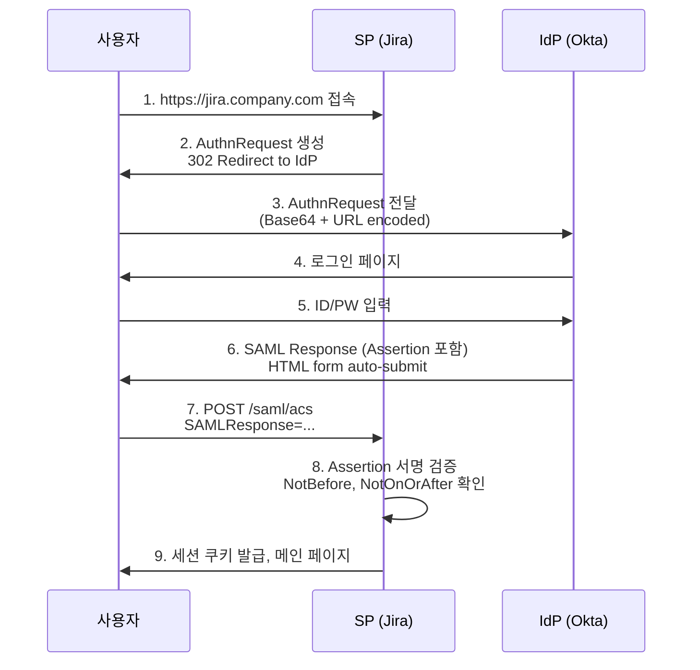

# SSO - SAML 2.0과 OIDC

## SSO와 OAuth, 무엇이 다른가

OAuth 2.0 문서가 따로 있어 헷갈리기 쉬운데, 엔터프라이즈 환경에서 말하는 SSO(Single Sign-On)는 결이 다르다. OAuth는 본래 **권한 위임(authorization delegation)** 프로토콜이다. "이 앱이 내 Google Drive 읽도록 허락한다"가 OAuth의 본질이다. 거기에 사용자 식별이라는 인증(authentication) 의미가 얹혀서 "Google 로그인" 같은 소셜 로그인이 만들어졌다.

엔터프라이즈 SSO는 다르다. 회사 직원 1만 명이 Slack, Jira, Confluence, Workday, Salesforce, GitHub Enterprise를 쓴다고 하자. 직원 입사하면 6곳에 계정 만들고, 퇴사하면 6곳에서 지운다. 비밀번호 정책도 따로 관리해야 한다. 이걸 한 곳(IdP, Identity Provider)에서 통제하고, 각 SaaS(SP, Service Provider)는 IdP의 인증 결과만 받아 신뢰하는 구조가 SSO다.

여기서 쓰는 프로토콜이 **SAML 2.0**과 **OIDC(OpenID Connect)** 두 가지다.

| 항목 | SAML 2.0 | OIDC |
|------|----------|------|
| 발표 시점 | 2005년 | 2014년 |
| 토큰 형식 | XML (SAML Assertion) | JWT (ID Token) |
| 전송 방식 | HTTP-POST, HTTP-Redirect | HTTPS + JSON |
| 기반 프로토콜 | 자체 명세 | OAuth 2.0 위에 인증 레이어 추가 |
| 주 사용처 | 엔터프라이즈 SaaS, 정부/금융 | 모바일, SPA, 마이크로서비스 |
| 모바일 친화도 | 떨어진다 (XML, redirect 흐름) | 좋다 (JSON, REST 친화) |
| 디버깅 난이도 | 높다 (XML 서명 검증) | 낮다 (JWT 디코더로 즉시 확인) |

실무에서 보면 Workday, Salesforce, ServiceNow 같은 옛날 SaaS는 SAML이 1차 시민이고, Auth0, Firebase, AWS Cognito, GitHub Apps 같은 최신 플랫폼은 OIDC를 우선 지원한다. Okta, Azure AD, Keycloak 같은 IdP는 둘 다 동시에 지원한다. 회사에서 둘 다 다뤄야 하는 경우가 흔하다.

## SAML 2.0의 동작 방식

### IdP-initiated와 SP-initiated의 차이

SAML 흐름에는 두 가지가 있다. 어디서 시작하느냐의 차이다.

**SP-initiated**: 사용자가 SP(예: Jira) URL에 접속한다. SP는 인증 안 된 사용자를 IdP로 리다이렉트한다. IdP에서 로그인 후 SP로 다시 리다이렉트되며 Assertion이 전달된다. 가장 일반적이다.

**IdP-initiated**: 사용자가 IdP 포털(예: Okta 대시보드)에 먼저 로그인한다. 거기서 "Jira" 타일을 클릭하면 IdP가 Assertion을 만들어서 Jira로 POST한다. 사용자 입장에서 편하지만 보안상 문제가 있다. **IdP-initiated 흐름은 RelayState 검증이 약하고, 공격자가 Assertion을 가로채 다른 SP에 재사용할 여지가 있다.** OWASP에서도 SP-initiated를 권장한다.



여기서 8번 단계가 핵심이고 가장 많이 깨진다.

### Assertion 검증, 빠뜨리면 안 되는 항목

SAML Response에 들어오는 Assertion은 XML이고 서명이 붙어있다. 검증해야 할 것이 한두 개가 아니다.

```xml
<saml:Assertion ID="_abc123" IssueInstant="2026-05-06T10:00:00Z">
  <saml:Issuer>https://idp.company.com</saml:Issuer>
  <ds:Signature>...</ds:Signature>
  <saml:Subject>
    <saml:NameID Format="...emailAddress">user@company.com</saml:NameID>
    <saml:SubjectConfirmation Method="...bearer">
      <saml:SubjectConfirmationData
        NotOnOrAfter="2026-05-06T10:05:00Z"
        Recipient="https://jira.company.com/saml/acs"
        InResponseTo="_xyz789"/>
    </saml:SubjectConfirmation>
  </saml:Subject>
  <saml:Conditions
    NotBefore="2026-05-06T09:55:00Z"
    NotOnOrAfter="2026-05-06T10:05:00Z">
    <saml:AudienceRestriction>
      <saml:Audience>https://jira.company.com</saml:Audience>
    </saml:AudienceRestriction>
  </saml:Conditions>
  <saml:AttributeStatement>
    <saml:Attribute Name="email">
      <saml:AttributeValue>user@company.com</saml:AttributeValue>
    </saml:Attribute>
    <saml:Attribute Name="groups">
      <saml:AttributeValue>engineering</saml:AttributeValue>
      <saml:AttributeValue>admin</saml:AttributeValue>
    </saml:Attribute>
  </saml:AttributeStatement>
</saml:Assertion>
```

검증 체크포인트:

1. **Signature**: IdP의 공개키(보통 IdP 메타데이터의 X.509 인증서)로 서명 검증. **Assertion 자체에 서명이 있는지, 아니면 Response 전체에만 있는지 확인.** Response 서명만 검증하고 Assertion 서명을 안 보면 XSW(XML Signature Wrapping) 공격에 당한다.
2. **Issuer**: 등록된 IdP의 entityID와 일치하는지
3. **Audience**: 우리 SP의 entityID와 일치하는지. 다르면 다른 SP용 Assertion을 가로챈 것이다.
4. **NotBefore / NotOnOrAfter**: 현재 시각이 유효 구간 안에 있는지. **시간 동기화가 안 되면 운영 환경에서 간헐적으로 인증이 깨진다.** NTP 필수.
5. **InResponseTo**: SP-initiated일 때 우리가 보낸 AuthnRequest ID와 일치하는지. IdP-initiated에서는 이 필드가 없다.
6. **Recipient**: 우리 ACS(Assertion Consumer Service) URL과 일치하는지

라이브러리 선택할 때도 이걸 다 검증하는지 확인해야 한다. Java면 OpenSAML, Node면 `passport-saml` 또는 `node-saml`, Python이면 `python3-saml`. 직접 구현하지 말 것. XML 서명은 직접 구현하면 거의 100% 깨진다.

### XML Signature Wrapping(XSW) 공격

SAML 보안 사고의 절반은 XSW다. 공격자가 합법 Assertion을 가져와서 XML 구조를 살짝 바꿔, 서명된 부분과 실제 SP가 읽는 부분을 다르게 만드는 공격이다. 예를 들어 서명된 원본 Assertion 옆에 새로운 Assertion을 끼워 넣고, SP의 파서가 새 Assertion을 읽도록 유도한다.

방어책은 단순하다. XML 파서가 **서명된 노드 자체에서 데이터를 추출**하도록 라이브러리가 강제해야 한다. 검증 따로, 데이터 추출 따로 하면 안 된다. `python3-saml`, OpenSAML 같은 검증된 라이브러리는 이걸 알아서 처리한다.

## OIDC의 동작 방식

### OIDC = OAuth 2.0 + ID Token

OIDC는 OAuth 2.0 위에 얹은 **인증 레이어**다. OAuth가 access_token만 발급한다면, OIDC는 거기에 **ID Token**(JWT)을 추가로 발급한다. 이 ID Token이 "이 사용자는 누구다"라는 인증 결과다.

```
OAuth 2.0:    Authorization Code → access_token (권한)
OIDC:         Authorization Code → access_token + id_token (권한 + 신원)
```

대부분 흐름은 OAuth Authorization Code Flow와 동일하다. 차이는 `scope`에 `openid`가 들어간다는 것과, 토큰 응답에 `id_token`이 추가된다는 것뿐이다.

```http
GET /authorize?
  response_type=code&
  client_id=my-client&
  redirect_uri=https://app.company.com/callback&
  scope=openid+profile+email&
  state=xyz123&
  nonce=abc456
```

`scope=openid`가 빠지면 OIDC가 아니라 그냥 OAuth다. `nonce`는 ID Token에 그대로 박혀 돌아오는데, 토큰 재사용 공격을 막는 용도다. SP-initiated SAML의 InResponseTo와 같은 역할이다.

### Discovery 엔드포인트

OIDC는 **Discovery**라는 표준 엔드포인트를 정의한다. `https://idp.example.com/.well-known/openid-configuration` 한 번 호출하면 이런 JSON이 돌아온다.

```json
{
  "issuer": "https://idp.example.com",
  "authorization_endpoint": "https://idp.example.com/oauth2/authorize",
  "token_endpoint": "https://idp.example.com/oauth2/token",
  "userinfo_endpoint": "https://idp.example.com/oauth2/userinfo",
  "jwks_uri": "https://idp.example.com/.well-known/jwks.json",
  "end_session_endpoint": "https://idp.example.com/oauth2/logout",
  "response_types_supported": ["code", "id_token", "code id_token"],
  "subject_types_supported": ["public"],
  "id_token_signing_alg_values_supported": ["RS256", "ES256"],
  "scopes_supported": ["openid", "profile", "email", "groups"]
}
```

SAML에서는 IdP 메타데이터 XML을 받아서 직접 파싱하고, 인증서 갱신될 때마다 다시 임포트해야 했다. OIDC는 Discovery 한 번이면 끝나고, `jwks_uri`로 키도 동적으로 가져온다. **운영 편의성이 SAML 대비 압도적이다.** 새 SaaS 연동할 때 SAML은 메타데이터 XML 주고받고 ACS URL 등록하고 인증서 핑거프린트 맞추느라 반나절 걸리는데, OIDC는 client_id/secret과 redirect_uri만 등록하면 끝난다.

### ID Token 검증

ID Token은 그냥 JWT다. `header.payload.signature` 형식이고 Base64 디코드하면 내용이 보인다.

```json
{
  "iss": "https://idp.example.com",
  "sub": "user-uuid-12345",
  "aud": "my-client-id",
  "exp": 1746522000,
  "iat": 1746521700,
  "nonce": "abc456",
  "auth_time": 1746521700,
  "email": "user@company.com",
  "email_verified": true,
  "groups": ["engineering", "admin"]
}
```

검증 항목은 SAML과 비슷하지만 훨씬 깔끔하다.

1. **Signature**: JWKS 엔드포인트에서 가져온 공개키로 서명 검증. JWKS는 캐시하되 `kid` 변경 감지해서 갱신.
2. **iss(issuer)**: Discovery의 `issuer`와 일치
3. **aud(audience)**: 내 client_id가 들어있는지
4. **exp / iat**: 만료 안 됐는지, 발급 시점이 너무 미래가 아닌지
5. **nonce**: 우리가 보낸 nonce와 일치
6. **azp**: 토큰을 위해 발급된 클라이언트(다중 audience일 때만)

JWT 라이브러리는 Java면 `nimbus-jose-jwt`, Node면 `jose`, Python이면 `python-jose`나 `authlib`. 마찬가지로 직접 구현하지 말 것.

```javascript
// Node.js, jose 라이브러리
import { jwtVerify, createRemoteJWKSet } from 'jose';

const JWKS = createRemoteJWKSet(
  new URL('https://idp.example.com/.well-known/jwks.json')
);

async function verifyIdToken(idToken, expectedNonce) {
  const { payload } = await jwtVerify(idToken, JWKS, {
    issuer: 'https://idp.example.com',
    audience: 'my-client-id',
  });

  if (payload.nonce !== expectedNonce) {
    throw new Error('nonce mismatch');
  }

  return payload;
}
```

## Just-In-Time Provisioning

엔터프라이즈 SSO에서 자주 묻는 질문. "직원이 입사하면 IdP(Okta)에는 등록하는데, Jira 같은 SP의 사용자 테이블은 누가 채우나?"

답은 **JIT(Just-In-Time) Provisioning**이다. 사용자가 SAML/OIDC로 처음 로그인하는 순간, SP가 Assertion/ID Token의 attribute를 보고 사용자 레코드를 자동 생성하는 패턴이다.

```python
# Django 의사 코드
def saml_acs_view(request):
    assertion = parse_and_verify(request.POST['SAMLResponse'])

    email = assertion.attributes.get('email')
    name = assertion.attributes.get('displayName')
    groups = assertion.attributes.get('groups', [])

    user, created = User.objects.get_or_create(
        email=email,
        defaults={
            'name': name,
            'is_sso_user': True,
        }
    )

    if not created:
        user.name = name
        user.save()

    sync_user_groups(user, groups)

    login(request, user)
    return redirect('/')
```

JIT 구현할 때 자주 빠뜨리는 것들:

- **속성 매핑 표준이 다르다.** SAML은 `http://schemas.xmlsoap.org/claims/EmailAddress` 같은 긴 URN을, OIDC는 `email` 같은 짧은 클레임을 쓴다. IdP마다 기본값이 또 다르다. Azure AD는 `http://schemas.xmlsoap.org/ws/2005/05/identity/claims/emailaddress`, Okta는 `email`로 보낸다. 매핑을 명시적으로 설정해야 한다.
- **그룹 동기화**: SP에서 권한을 그룹으로 관리한다면, 매 로그인마다 IdP의 `groups` 클레임을 보고 동기화해야 한다. 그룹에서 빼는 처리도 잊지 말 것. 안 하면 권한 회수가 안 된다.
- **SCIM과의 차이**: JIT는 첫 로그인 시점에 동기화되지만, **로그인하지 않은 사용자는 SP에 존재하지 않는다.** 인사팀이 "신입 입사자에게 Jira 미리 권한 부여해두기" 같은 걸 원하면 JIT만으로는 안 된다. SCIM(System for Cross-domain Identity Management) 프로토콜로 IdP가 SP에게 사용자 변경 사항을 푸시해야 한다. 사용자 비활성화도 SCIM 쪽이 깔끔하다. JIT만 쓰면 퇴사자가 SP에 계속 남아있는다.

## Logout - 가장 까다로운 부분

SSO에서 가장 잘 깨지는 게 **Single Logout(SLO)**이다. "한 곳에서 로그아웃하면 모든 SP에서 로그아웃" 동작인데, 표준은 있어도 현실은 험난하다.

### Front-channel Logout

브라우저를 매개로 IdP가 모든 SP에 로그아웃 요청을 보낸다. 보통 IdP가 보내는 페이지에 각 SP의 logout 엔드포인트를 가리키는 `<iframe>`을 잔뜩 박아넣는다.

```html
<!-- IdP가 반환하는 logout 페이지 -->
<html>
  <body>
    <iframe src="https://jira.company.com/oidc/logout?sid=abc"></iframe>
    <iframe src="https://confluence.company.com/oidc/logout?sid=abc"></iframe>
    <iframe src="https://slack.company.com/oidc/logout?sid=abc"></iframe>
  </body>
</html>
```

문제는 third-party cookie 차단이다. Safari ITP(Intelligent Tracking Prevention)와 Chrome Privacy Sandbox가 cross-site iframe의 쿠키를 막는다. 그러면 SP는 iframe 요청을 받아도 어떤 사용자의 세션인지 식별을 못 한다. **2024년 이후 Front-channel logout은 사실상 깨졌다.**

### Back-channel Logout

OIDC가 추가한 방식이다. IdP가 브라우저를 거치지 않고 SP의 백엔드에 직접 HTTP POST로 로그아웃 토큰을 보낸다.

```http
POST /oidc/backchannel-logout HTTP/1.1
Host: jira.company.com
Content-Type: application/x-www-form-urlencoded

logout_token=eyJhbGc...
```

logout_token도 JWT다.

```json
{
  "iss": "https://idp.example.com",
  "aud": "jira-client-id",
  "iat": 1746522000,
  "jti": "logout-event-uuid",
  "events": {
    "http://schemas.openid.net/event/backchannel-logout": {}
  },
  "sub": "user-uuid-12345",
  "sid": "session-id-from-id-token"
}
```

SP는 이 토큰의 `sub`나 `sid`를 보고 해당 사용자/세션을 강제 종료한다. 브라우저 쿠키와 무관하게 동작하므로 third-party cookie 이슈가 없다. **OIDC SSO 통합한다면 Back-channel logout을 1차 선택지로 잡아야 한다.**

다만 SP 쪽에 세션을 어떻게 무효화할지가 과제다. 세션 스토어가 Redis라면 `sid`로 키를 만들어두고 Back-channel 호출 시 `DEL`. JWT만 쓰는 stateless 구조면 logout 이벤트를 별도 블랙리스트에 기록하고 매 요청마다 검사. 어느 쪽이든 인프라 부담이 늘어난다.

### SAML SLO

SAML도 SLO 명세가 있긴 하다. `<samlp:LogoutRequest>`를 IdP가 각 SP에 보내고 `<samlp:LogoutResponse>`를 받는다. **현실에서는 거의 안 쓴다.** 구현 복잡도가 높고, SP 한 곳이라도 응답 안 하면 전체가 멈춘다. 대부분 회사는 "IdP에서만 로그아웃 처리, SP 세션은 짧게(5~30분) 유지하다 자연 만료"로 타협한다.

## IdP별 실무 이슈

### Keycloak

오픈소스 IdP. SaaS IdP 비용을 안 내려는 회사에서 자주 쓴다.

자주 만나는 문제:

- **realm 설정 누락**: Keycloak은 `master` realm을 관리용으로 두고, 실제 사용자는 별도 realm에 둔다. Discovery URL이 `https://kc.example.com/realms/{realm}/.well-known/openid-configuration`이다. realm 이름 빠뜨리면 404가 아니라 master realm으로 붙어버려서 디버깅이 꼬인다.
- **frontend URL 설정**: Keycloak이 컨테이너 안에서 동작하면 `iss` 클레임이 내부 URL(`http://keycloak:8080`)로 나가서 SP가 검증에 실패한다. `KC_HOSTNAME`, `KC_HOSTNAME_URL` 환경변수를 명확히 잡아야 한다.
- **Client Authentication 모드**: `confidential` vs `public` 구분. SPA는 public, 백엔드는 confidential. 잘못 잡으면 client_secret 요청 단계에서 막힌다.
- **Group Mapper 추가 필요**: 기본 토큰에는 그룹 정보가 안 들어간다. Client > Mappers에서 Group Membership Mapper를 명시적으로 추가해야 `groups` 클레임이 ID Token에 박힌다.

### Okta

엔터프라이즈에서 가장 흔하다. UI가 깔끔하고 기능이 많다.

자주 만나는 문제:

- **Okta Org URL과 Auth Server URL 혼동**: Org는 `https://company.okta.com`, Auth Server는 `https://company.okta.com/oauth2/default` 또는 `https://company.okta.com/oauth2/{authServerId}`. issuer 검증이 안 되면 90%는 이 차이다.
- **Custom Authorization Server 라이선스**: 기본 `default` Auth Server 외에 추가 Auth Server를 만들려면 별도 라이선스. 무료 개발자 계정에서 되던 게 운영에서 안 되는 경우가 있다.
- **API Access Management**: Okta가 issuer로 들어가는 ID Token이 아니라 access_token까지 검증하려면 API Access Management 기능이 켜져 있어야 한다.

### Azure AD (Microsoft Entra ID)

마이크로소프트가 2024년경 Entra ID로 리브랜딩했다. M365 쓰는 회사면 자동으로 따라온다.

자주 만나는 문제:

- **v1 vs v2 endpoint**: `/oauth2/authorize`(v1)와 `/oauth2/v2.0/authorize`(v2)가 다른 동작을 한다. v2가 표준 OIDC고, v1은 MS 자체 확장. 새로 만들면 무조건 v2로.
- **tenant ID**: `https://login.microsoftonline.com/{tenant-id}/v2.0` 형식. `common`이나 `organizations` 같은 멀티 테넌트 endpoint를 쓰면 issuer 검증이 까다롭다. issuer가 매 요청마다 달라지므로 issuer 검증을 tenant 단위로 분기해야 한다.
- **groups overage claim**: 사용자가 속한 그룹이 200개(SAML) / 150개(JWT)를 넘으면 토큰에 그룹 ID가 안 들어가고 `_claim_names`라는 우회 클레임이 들어온다. Microsoft Graph API를 호출해서 그룹을 별도 조회해야 한다. 큰 회사에서 흔하다.
- **SAML과 OIDC의 NameID 차이**: SAML SSO에서 NameID 형식을 `EmailAddress`로 잡는 게 일반적인데, AAD는 기본이 persistent ID(GUID 같은 형태)다. 매핑을 명시적으로 바꿔야 한다.

## 디버깅 도구

SSO는 흐름이 브라우저-IdP-SP를 오가서 일반 디버거로는 잘 안 보인다. 전용 도구가 있다.

### SAML-tracer (Firefox/Chrome 확장)

브라우저에서 일어나는 SAML 흐름을 캡처해서 AuthnRequest, Response, Assertion XML을 보여준다. 평소엔 Base64 인코딩된 채로 네트워크에 흘러가서 DevTools만으로는 못 본다. SAML-tracer는 자동으로 디코드해주고 XML 구조도 색칠해서 보여준다. SAML 다룰 일이 있다면 무조건 깔아야 한다.

### jwt.io

OIDC ID Token 디코드용. JWT를 붙여넣으면 header, payload, signature를 보여준다. 단순하지만 95% 디버깅이 여기서 끝난다. **단, 운영 토큰을 붙여넣지 말 것.** jwt.io는 서버 전송이 아니라 클라이언트 사이드 디코드라 안전하다고 하지만, 사용자가 입력한 값을 어떻게 처리하는지는 정책이 바뀔 수 있다. 운영 토큰은 로컬 도구(`jwt-cli`, Node REPL의 `jose`)로 디코드.

### oidcdebugger.com

OIDC Authorization Code/Implicit/Hybrid flow를 단계별로 시뮬레이션해주는 사이트. IdP 등록할 때 redirect_uri로 `https://oidcdebugger.com/debug`를 추가해두면, 실제 SP 코드 없이도 IdP 응답을 확인할 수 있다. 신규 IdP 연동 시 첫 단계로 쓴다.

### Burp Suite / mitmproxy

프록시 도구. 브라우저-SP 사이의 raw HTTP를 보고 싶을 때. 특히 Back-channel logout 같은 서버 간 통신은 SAML-tracer로 안 보이므로 프록시가 필요하다.

### IdP 자체 로그

가장 정확한 정보는 IdP 로그에 있다. Okta는 System Log, Azure AD는 Sign-in logs, Keycloak은 Events 탭. **IdP가 "왜 거부했는지" 가장 직접적으로 알려주는 곳이고, SP 쪽에서 보이는 "그냥 redirect 안 옴" 같은 증상의 원인이 여기 다 있다.** SSO 디버깅의 50%는 IdP 로그 보는 데서 끝난다.

## 클럭 스큐(Clock Skew) 문제

SAML/OIDC 모두 시간 기반 검증이 있다(`NotBefore`, `NotOnOrAfter`, `iat`, `exp`). 운영 환경에서 간헐적으로 인증이 깨지는 가장 흔한 원인은 시계 차이다.

- IdP는 정확하지만 SP 컨테이너의 시계가 30초 어긋난 경우, `NotBefore` 검증에서 토큰이 "아직 유효하지 않음"으로 떨어진다.
- 모바일 앱이 IdP 역할을 한다면 사용자 디바이스 시계가 틀어진 케이스도 본다.

방어책:

1. 모든 서버 NTP 동기화. 컨테이너도 호스트 시계 따라가는지 확인.
2. 라이브러리에 clock skew 허용치 설정. 보통 `60초` 잡는다. 너무 크게 잡으면 보안 위험.

```python
# python-jose 예시
jwt.decode(token, key, audience='my-client', options={
    'verify_signature': True,
    'verify_aud': True,
    'verify_exp': True,
    'leeway': 60,  # 60초 허용
})
```

## 어떤 걸 골라야 하나

신규 SaaS를 통합한다면 OIDC를 1순위로 잡으면 된다. 라이브러리도 많고 디버깅도 쉽고 운영도 간편하다.

SAML이 강제되는 경우는 다음과 같다.

- 회사 IdP가 SAML만 지원 (구형 ADFS 등)
- 통합하려는 SaaS가 SAML만 지원 (Workday 일부 모듈, 옛날 SaaS)
- 정부/금융/의료 같이 인증 표준에 SAML이 박혀있는 환경

둘 다 지원해야 하면 IdP 쪽에서 같은 사용자를 SAML/OIDC 양쪽으로 발급할 수 있게 설정하고, SP는 자기 입맛에 맞는 걸 고르는 식이 된다. Keycloak/Okta/Azure AD 모두 이게 가능하다.

마지막으로 한 가지. **SSO를 직접 구현하지 마라.** 검증된 라이브러리와 검증된 IdP를 쓰고, 라이브러리 업데이트를 미루지 않으면 80% 이상의 보안 이슈가 자동 해결된다. SSO 구현 코드를 직접 짜는 것은 암호화 알고리즘을 직접 짜는 것과 같다.
