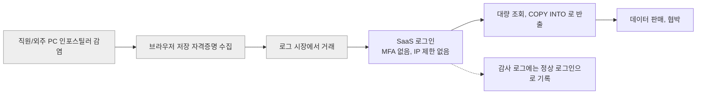
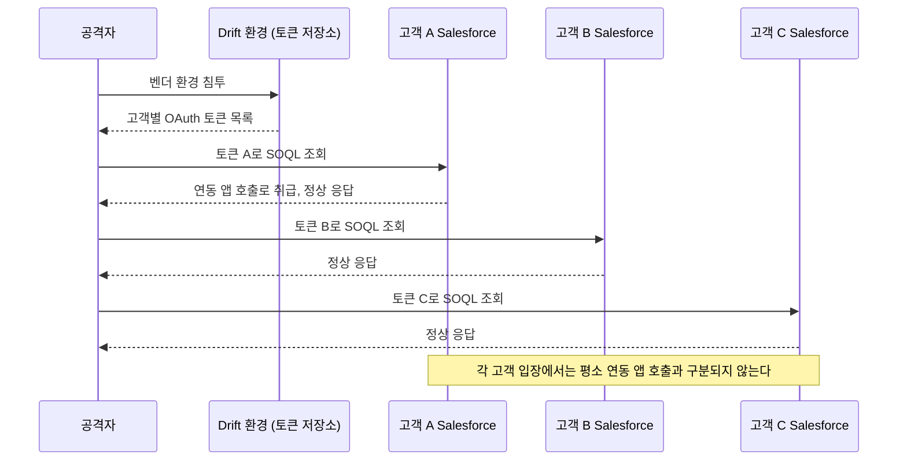
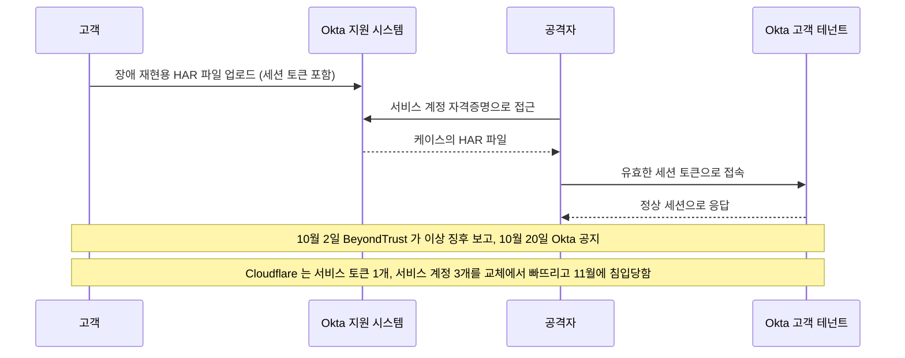
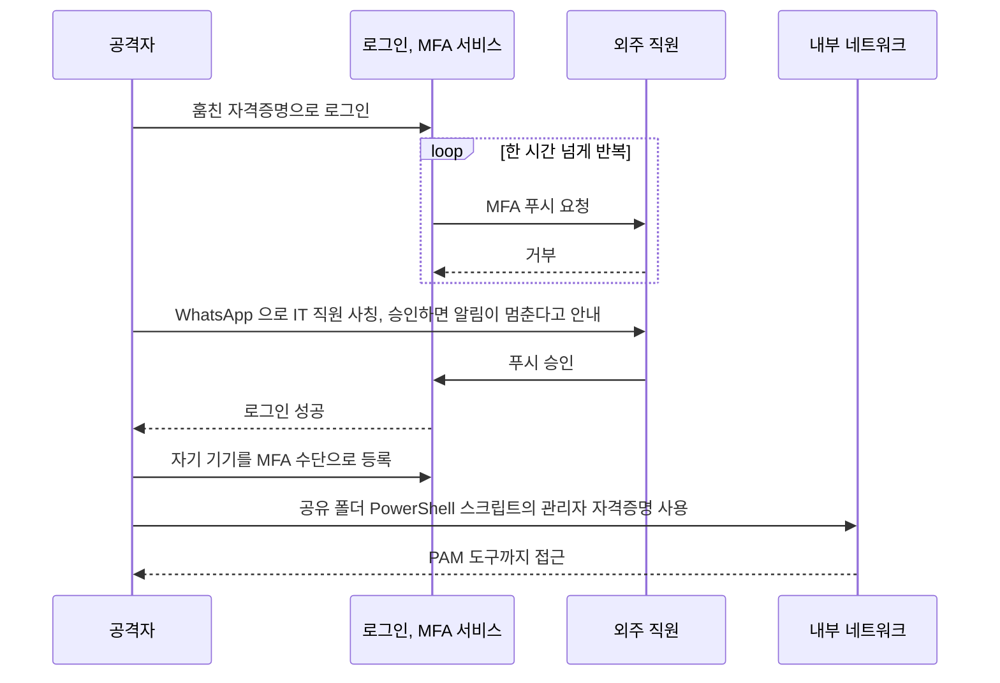
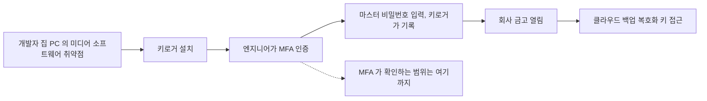
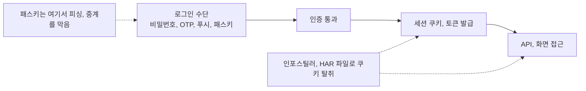
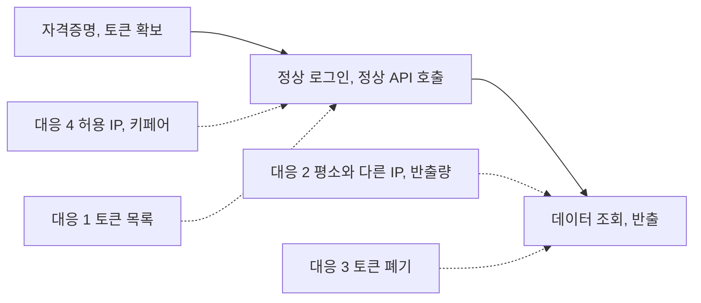
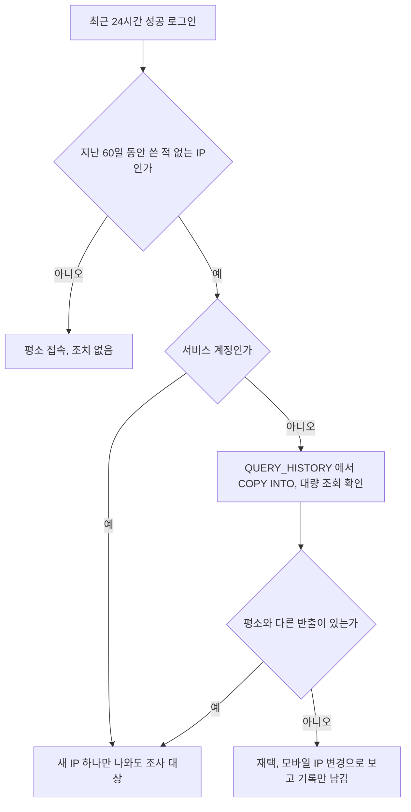
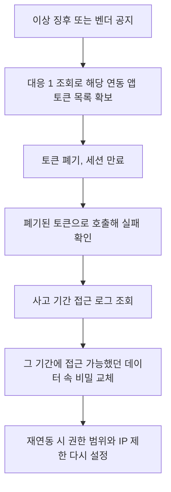

# SaaS 자격증명과 토큰 탈취 사고

2024년 5월 Snowflake 고객 계정 사고를 처음 읽었을 때 가장 먼저 찾은 것은 CVE 번호였다. 없었다. 2025년 8월 Salesloft Drift 사고에서도 같은 것을 찾았고, 역시 없었다. 두 사고 모두 공격자는 취약점을 쓰지 않았다. 로그인 화면에서 올바른 자격증명을 냈고, API에 유효한 토큰을 냈다. 서버 입장에서는 정상 사용자의 정상 요청이었다.

이 문서는 자격증명과 토큰을 훔쳐서 정상 인증으로 들어온 사고 다섯 건(Snowflake, Salesloft Drift, Okta 지원 시스템, Uber, LastPass)을 입구별로 나눠 보고, 이런 사고에서 실제로 효과가 있었던 대응을 정리한다. 사고별 연표와 다른 유형(공급망, 엣지 장비 RCE)은 [최근 보안사고 사례 2021~2025](Recent_Security_Incidents.md)에 있고, 여기서는 인증이 어떻게 우회됐는지와 우리 쪽에서 무엇을 조회하고 막을지에 집중한다. 비밀번호 재사용 공격 자체의 방어는 [크리덴션 스터핑](Credential_Stuffing.md), MFA 방식의 상세는 [MFA와 패스키](../Backend/Authentication/MFA_Passkey.md), SSO 프로토콜은 [SSO (SAML · OIDC)](SSO_SAML_OIDC.md)를 본다.

## 다섯 사고의 입구

| 사고 | 훔친 것 | 훔친 경로 | 서버가 본 것 |
|---|---|---|---|
| Snowflake 고객 계정 (2024.5) | 사용자 ID, 비밀번호 | 직원·외주 PC의 인포스틸러 | MFA 없는 정상 로그인 |
| Salesloft Drift (2025.8) | 연동 앱 OAuth 토큰 | Drift 쪽 환경 침투 | 연동 앱의 정상 API 호출 |
| Okta 지원 시스템 (2023.10) | 고객이 올린 HAR 파일 속 세션 토큰 | 지원 시스템 서비스 계정 | 유효한 세션 쿠키 |
| Uber (2022.9) | 외주 직원의 자격증명과 MFA 승인 | 개인 기기 악성코드, 푸시 폭탄 | MFA까지 통과한 로그인 |
| LastPass (2022.8~11) | 개발자 마스터 비밀번호 | 개발자 집 PC의 키로거 | MFA 통과 후 열린 금고 |

취약한 코드가 하나도 없다. 패치할 대상도 없고, WAF가 볼 요청에 공격 페이로드도 없다. 요청 본문은 평범한 `SELECT`이거나 평범한 `GET /services/data/...`였다.

## Snowflake, 비밀번호 한 줄과 MFA 부재

Mandiant 분석(UNC5537)에서 공격자는 인포스틸러 로그에서 Snowflake 로그인 정보를 모았다. 인포스틸러는 감염된 PC의 브라우저 저장 비밀번호와 쿠키를 긁어 가는 악성코드다. 가장 오래된 감염은 2020년 11월이고, 사고 시점까지 비밀번호가 바뀌지 않은 계정이 있었다. 잠재 노출 조직은 165곳, 악용된 계정의 79.7%에 이전 자격증명 노출 이력이 있었다. 대상 계정에는 MFA도, 접속 IP 제한도 없었다. 근거는 [Google Cloud 블로그 UNC5537](https://cloud.google.com/blog/topics/threat-intelligence/unc5537-snowflake-data-theft-extortion)이다.

흐름을 한 장으로 놓으면 침투 이후 단계에서 막을 수 있는 지점이 드러난다. 노드 중 감염과 시장 거래는 우리가 통제할 수 없고, 로그인 단계부터가 우리 영역이다.



회색 세 단계는 외부에서 일어난다. D에서 막지 못하면 E는 정상 쿼리라 막을 근거가 없다. 그래서 D에서 요구할 것(MFA, 허용 IP)과 E에서 볼 것(평소와 다른 양)을 나눠서 둔다.

실무에서 이 사고가 남긴 교훈은 두 가지다. 서비스 계정이 사람 계정처럼 비밀번호로 로그인하고 있었다는 것, 그리고 한 번 만든 자격증명이 수년간 교체되지 않았다는 것이다. 서비스 계정에는 MFA를 붙일 수 없으니 비밀번호 대신 키페어 인증과 접속 IP 제한을 쓴다. 이 부분 설정은 아래 대응 절에 있다.

## Salesloft Drift, 연동 앱 토큰 하나로 여러 테넌트

Drift는 Salesforce 같은 SaaS와 OAuth로 연결되는 챗봇 서비스다. 고객이 Drift를 연결하면 Drift는 고객 Salesforce 테넌트마다 액세스 토큰과 리프레시 토큰을 받아 자기 쪽에 저장한다. Google Threat Intelligence에 따르면 UNC6395는 2025년 8월 8일부터 18일 사이 이 토큰들로 Salesforce 인스턴스에서 데이터를 조회했다. 8월 20일 Salesloft와 Salesforce가 Drift 관련 토큰을 전부 폐기했다. 근거는 [Google Cloud 블로그 Drift](https://cloud.google.com/blog/topics/threat-intelligence/data-theft-salesforce-instances-via-salesloft-drift)다. Salesloft의 후속 조사 발표에는 그보다 앞서 Salesloft의 GitHub 계정이 침해됐고, 그 경로로 Drift 클라우드 환경에 들어가 토큰을 가져갔다는 내용이 있다.

핵심은 토큰 저장소가 한 곳이라는 구조다. 고객 수백 곳의 토큰이 연동 앱 벤더 한 곳의 저장소에 모여 있으면, 그곳이 뚫린 순간 고객 수만큼 침해가 동시에 일어난다.



세 고객 사이에는 아무 연결도 없다. 연결 고리는 벤더 저장소 하나뿐이고, 고객이 자기 테넌트 로그만 보면 이상 징후가 약하다. 이 사고가 늦게 알려진 이유다.

공격자가 가져간 데이터에서 노린 것은 고객 정보보다 그 안의 비밀이었다. 지원 티켓과 CRM 메모에 사람들이 붙여 넣은 AWS 액세스 키, 비밀번호, Snowflake 토큰이 검색 대상이었다. 외부 SaaS에 쌓인 텍스트는 비밀 저장소가 아니지만 실제로는 그렇게 쓰이고 있다. 이 연결로 한 사고가 다음 사고의 입구가 된다. Snowflake 토큰이 Drift 사고의 검색 키워드에 들어 있었다는 점이 그 예다.

## Okta 지원 시스템, HAR 파일 속 세션 토큰

2023년 10월 Okta는 고객 지원 시스템(케이스 관리)이 침해됐다고 공지했다. 지원 케이스에 고객이 올려둔 HAR 파일이 문제였다. HAR는 브라우저가 기록한 HTTP 요청·응답 전체이고, 여기에 `Cookie`, `Set-Cookie`, `Authorization` 헤더가 그대로 들어 있다. 고객이 장애 재현용으로 올린 HAR 안의 유효한 Okta 세션 토큰이 공격자 손에 넘어갔다. Okta는 이후 영향받은 고객이 134곳(1% 미만)이고 그중 5곳에서 세션 토큰이 실제 탈취에 쓰였다고 밝혔다. 5곳에는 1Password, BeyondTrust, Cloudflare가 포함된다. 초기 접근은 지원 시스템 서비스 계정 자격증명이었고, 그 자격증명이 직원의 개인 Google 계정에 동기화된 브라우저 프로필에 저장돼 있었다고 Okta가 이후 밝혔다.

이 사고에서 인상 깊은 건 대응의 어긋남이다. BeyondTrust는 10월 2일에 이상 징후를 잡아 Okta에 보고했지만, Okta가 공지한 것은 10월 20일이다. 그 사이 Cloudflare는 Okta 사고 후 자격증명을 전부 교체했는데, 서비스 토큰 1개와 서비스 계정 3개를 빠뜨렸고, 11월에 그 토큰으로 침입당했다. 교체 대상은 목록에 있는 것이 전부가 아니라 토큰이 존재할 수 있는 모든 곳이다. 이 내용은 Cloudflare 블로그 "Thanksgiving 2023 security incident"에 정리돼 있다.

아래 시퀀스는 HAR 파일이 침해 경로가 되는 순서와, 대응이 어긋난 구간(보고와 공지 사이 18일, 교체에서 빠진 토큰)을 보여준다.



HAR를 외부에 보낼 일이 있으면 민감 헤더를 지우고 보낸다. 아래는 jq로 쿠키와 인증 헤더를 제거하는 예이다.

```bash
jq '
  .log.entries |= map(
    del(.request.cookies, .response.cookies)
    | .request.headers  |= map(select(.name | ascii_downcase | IN("cookie","authorization","x-csrf-token") | not))
    | .response.headers |= map(select(.name | ascii_downcase | IN("set-cookie") | not))
  )
' repro.har > repro.sanitized.har
```

URL의 쿼리 파라미터(`?token=`, `?code=`)와 요청 본문(`postData`)에도 토큰이 들어가는 경우가 있어서, 지운 뒤 `grep -iE 'token|session|bearer' repro.sanitized.har`로 한 번 더 본다. 지원 담당자가 받는 쪽이라면, HAR를 받으면 그 세션을 만료시키도록 고객에게 안내한다. 업로드를 받는 서비스를 운영한다면 업로드 시점에 걸러서 저장하는 것이 낫다.

## Uber, MFA 피로와 사회공학

2022년 9월 Uber에서 외주 직원의 개인 기기가 악성코드에 감염됐고, 그 자격증명이 다크웹에서 팔렸다. 공격자는 그 계정으로 로그인했고, MFA 푸시 요청을 한 시간 넘게 반복해서 보냈다. 사용자가 거부했는데도 계속 왔다. 이어서 공격자는 WhatsApp으로 Uber IT 직원이라고 사칭해 "승인하면 알림이 멈춘다"고 말했고, 사용자가 승인했다. 승인 직후 공격자는 자기 기기를 MFA 수단으로 등록했다. 이후 보도에 따르면 내부 네트워크 공유 폴더의 PowerShell 스크립트에 하드코딩된 관리자 자격증명이 있었고, 그것으로 PAM 도구(Thycotic)까지 접근했다.

실패는 세 층에서 일어났다. 푸시 승인이 단순 승인 버튼이었다는 것, 승인 뒤 새 MFA 기기 등록에 추가 검증이 없었다는 것, 스크립트 안에 관리자 비밀번호가 있었다는 것이다. 앞의 두 가지는 번호 일치(number matching)와 새 기기 등록 시 재인증으로 막는다. 마지막은 [시크릿 관리](Secrets_Management.md)의 문제다.

아래 시퀀스에서 푸시 폭탄 이후 사칭 메시지로 승인을 받고, 곧바로 자기 기기를 MFA 수단으로 등록하는 부분을 본다. 이 등록 단계에 추가 검증이 없어서 공격자가 정식 사용자가 됐다.



## LastPass, 개발자 개인 PC가 입구

LastPass는 2022년 8월 개발 환경이 침해돼 소스 코드가 유출됐고, 그 정보로 같은 해 후반 두 번째 침투가 이어졌다. 공개된 조사 결과에서 두 번째 침투 대상은 DevOps 엔지니어 4명 중 한 명이었다. 공격자는 그 엔지니어의 집 PC에 설치된 서드파티 미디어 소프트웨어의 취약점으로 들어가 키로거를 심었다(보도에서는 Plex로 알려졌다). 엔지니어가 MFA로 인증한 뒤 마스터 비밀번호를 입력하는 순간이 기록됐고, 공격자는 그 엔지니어의 회사 금고를 열어 클라우드 백업의 복호화 키에 접근했다. 근거는 [LastPass 공식 블로그](https://blog.lastpass.com/posts/2023/03/security-incident-update-recommended-actions)의 2023년 3월 업데이트다.

MFA는 로그인 시점에만 확인한다. 로그인 이후 그 PC 안에서 일어나는 일은 MFA가 보지 못한다. 이 사고는 회사 자산이 아닌 개인 PC가 회사 비밀의 입구가 되는 순간 통제할 수단이 없다는 사실을 보여줬다. 대응 방향은 접근 가능한 기기를 관리 기기로 제한하고, 프로덕션 비밀을 개인이 복호화된 상태로 들고 있지 않게 하는 것이다.

아래 도식에서 MFA는 로그인 한 지점에만 걸리고, 키로거는 그 뒤에 입력되는 마스터 비밀번호를 가져간다.



## 인증 수단별 우회 가능성

다섯 사고에 나온 우회 방법을 인증 수단과 교차해 본다. 칸 안의 표시는 해당 수단이 그 공격을 막는가를 나타낸다.

| 인증 수단 | 인포스틸러로 저장 값 탈취 | 피싱 프록시 (AiTM) | 푸시 피로 | SIM 스와핑 | 탈취한 세션 쿠키 재사용 |
|---|---|---|---|---|---|
| 비밀번호만 | 뚫림 | 뚫림 | 해당 없음 | 해당 없음 | 뚫림 |
| SMS OTP | 막힘 (저장 안 됨) | 뚫림 (코드를 중계) | 해당 없음 | 뚫림 | 뚫림 |
| TOTP 앱 | 막힘 (시드가 PC에 없으면) | 뚫림 (코드를 중계) | 해당 없음 | 막힘 | 뚫림 |
| 푸시 승인 (단순) | 막힘 | 뚫림 | 뚫림 | 막힘 | 뚫림 |
| 푸시 승인 (번호 일치) | 막힘 | 뚫림 (번호를 중계) | 대체로 막힘 | 막힘 | 뚫림 |
| 패스키 (WebAuthn) | 막힘 | 막힘 (도메인에 묶임) | 해당 없음 | 막힘 | 뚫림 |

마지막 열이 이 문서의 요점이다. 패스키까지 포함해 모든 수단이 탈취한 세션 쿠키에는 뚫린다. 세션 토큰은 로그인 이후에 발급되므로 로그인 수단이 아무리 강해도 그 뒤를 지키지 못한다. Okta HAR 사고와 인포스틸러 쿠키 탈취가 이 열에 해당한다. 그래서 MFA를 걸었는데도 뚫렸다는 사고가 계속 나온다.

아래 흐름에서 로그인 수단은 첫 번째 관문만 지킨다. 관문을 통과해 세션이 발급된 뒤에는 쿠키를 훔친 쪽이 그대로 이어받는다.



패스키가 실제로 막는 것은 입력 단계의 피싱과 중계다. 패스키 서명에는 접속한 도메인이 포함되므로 가짜 도메인에서는 서명이 유효하지 않다. 동작 원리는 [WebAuthn·Passkeys](Web_Authn_Passkeys.md)에 있다. 세션 쿠키 쪽은 수명 단축, 기기 바인딩(DPoP 같은 방식), 그리고 평소와 다른 환경에서의 재인증으로 막는다.

## WAF와 패치로는 못 막는 이유

WAF는 요청 안의 공격 패턴을 보고, 패치는 코드의 결함을 없앤다. 이 사고들에는 그 둘이 작용할 곳이 없었다.

- 로그인 요청은 올바른 ID와 비밀번호가 든 평범한 POST다. 패턴이 없다.
- 조회 쿼리는 해당 계정에 허용된 권한 안의 `SELECT`다. 인가 결함이 아니다.
- 토큰은 서명도 만료도 올바르다. 토큰을 발급받은 쪽이 달라졌을 뿐이다.
- 공격 트래픽의 출발지가 상용 VPN이나 임대 서버 대역이라도, IP 제한을 걸어두지 않았다면 차단할 근거가 없다.

방어 기준이 인증이 맞는가에서 인증한 주체가 평소 그 행동을 하는가로 바뀐다. 비정상 행동 기준으로 보는 계층을 따로 둬야 한다. 아래 대응은 세 부분이다. 토큰을 목록으로 관리하는 것, 로그인과 조회에서 평소와 다른 것을 찾는 것, 의심되면 바로 폐기하는 것. 그리고 서비스 계정이 들어올 수 있는 길을 처음부터 좁혀 놓는 것.

아래 그림은 네 가지 대응이 공격 흐름의 어느 지점에 걸리는지 보여준다. 공격자가 올바른 자격증명을 내는 단계까지는 막을 수 없고, 대응은 모두 그 이후에 걸린다.



## 대응 1, 연동 앱 토큰 목록과 마지막 사용 시각

Drift 같은 사고가 터졌을 때 "우리 테넌트에 Drift 토큰이 있는가"를 5분 안에 답할 수 있어야 한다. Salesforce라면 `OauthToken` 객체에 연동 앱별 토큰과 마지막 사용 시각이 있다. 아래는 Salesforce CLI로 조회하는 예다.

```bash
sf data query --target-org prod --json --query "
  SELECT Id, AppName, UserId, CreatedDate, LastUsedDate, UseCount
  FROM OauthToken
  ORDER BY LastUsedDate ASC NULLS FIRST
" > oauth_tokens.json
```

결과를 사람이 눈으로 보기 어려우니 승인된 앱 목록과 비교해서 걸러낸다. 아래 스크립트는 허용 목록에 없는 앱과 90일 넘게 안 쓴 토큰을 따로 뽑는다.

```python
import json, sys
from datetime import datetime, timedelta, timezone

APPROVED = {"Slack", "Zoom for Salesforce", "Our Billing Sync"}
STALE_DAYS = 90

def parse(ts):
    if not ts:
        return None
    return datetime.strptime(ts, "%Y-%m-%dT%H:%M:%S.%f%z")

records = json.load(open(sys.argv[1]))["result"]["records"]
now = datetime.now(timezone.utc)

unknown, stale = [], []
for r in records:
    last = parse(r["LastUsedDate"])
    if r["AppName"] not in APPROVED:
        unknown.append(r)
    if last is None or now - last > timedelta(days=STALE_DAYS):
        stale.append(r)

print("== 허용 목록에 없는 앱")
for r in unknown:
    print(f'{r["AppName"]:30} user={r["UserId"]} last={r["LastUsedDate"]} uses={r["UseCount"]}')
print("== 90일 넘게 안 쓴 토큰 (폐기 후보)")
for r in stale:
    print(f'{r["AppName"]:30} user={r["UserId"]} last={r["LastUsedDate"]}')
```

연동 앱이 갱신 토큰으로 계속 접근하는 경우 `LastUsedDate`는 최신이다. 마지막 사용 시각이 최근이라는 사실은 안전하다는 근거가 아니다. 이 목록은 우리가 쓰는 줄 모르는 앱을 찾는 용도다. Google Workspace는 관리 콘솔의 API 제어에서, GitHub는 조직 설정의 설치된 앱과 OAuth 앱 목록에서 같은 질문에 답한다.

## 대응 2, 평소와 다른 IP의 로그인

Snowflake라면 `ACCOUNT_USAGE.LOGIN_HISTORY`가 소스다. 최근 24시간 성공 로그인 중 지난 60일 동안 그 사용자가 쓴 적 없는 IP를 뽑는다. `ACCOUNT_USAGE` 뷰는 최대 2시간 정도 지연되므로 사고 대응 중 실시간이 필요하면 `INFORMATION_SCHEMA.LOGIN_HISTORY()` 함수를 쓴다.

```sql
WITH recent AS (
  SELECT user_name, client_ip,
         MIN(event_timestamp) AS first_seen,
         COUNT(*)             AS logins,
         MAX(reported_client_type) AS client_type
  FROM snowflake.account_usage.login_history
  WHERE is_success = 'YES'
    AND event_timestamp >= DATEADD('hour', -24, CURRENT_TIMESTAMP())
  GROUP BY user_name, client_ip
),
baseline AS (
  SELECT DISTINCT user_name, client_ip
  FROM snowflake.account_usage.login_history
  WHERE is_success = 'YES'
    AND event_timestamp >= DATEADD('day', -60, CURRENT_TIMESTAMP())
    AND event_timestamp <  DATEADD('hour', -24, CURRENT_TIMESTAMP())
)
SELECT r.*
FROM recent r
LEFT JOIN baseline b
  ON r.user_name = b.user_name AND r.client_ip = b.client_ip
WHERE b.client_ip IS NULL
ORDER BY r.logins DESC;
```

재택 근무자와 모바일 사용자의 IP는 계속 바뀌어서 사람 계정에는 오탐이 많다. 이 쿼리는 서비스 계정에서 의미가 크다. 서비스 계정은 고정 IP에서만 접근하는 게 정상이므로 새 IP가 하나만 나와도 조사 대상이다. 사람 계정은 새 IP 이후 데이터가 얼마나 나갔는지를 같이 본다.

계정 종류에 따라 같은 탐지 결과를 다르게 다룬다. 아래 분기에서 서비스 계정은 새 IP 하나로 곧바로 조사에 들어가고, 사람 계정은 데이터 반출량을 확인한 뒤에야 조사로 넘어간다.



```sql
SELECT user_name, start_time, rows_produced, bytes_scanned,
       LEFT(query_text, 120) AS query_head
FROM snowflake.account_usage.query_history
WHERE user_name = 'SVC_REPORTING'
  AND start_time >= DATEADD('day', -2, CURRENT_TIMESTAMP())
  AND (query_text ILIKE 'copy into @%' OR rows_produced > 10000000)
ORDER BY start_time DESC;
```

앞의 쿼리에서 걸린 `user_name`을 넣어서 돌린다. `COPY INTO @스테이지`는 Snowflake에서 데이터를 밖으로 내보내는 대표적인 방법이다. 평소에 이 쿼리를 쓰지 않는 계정이 쓰기 시작했다면 그 자체로 신호다. 컬럼명은 계정에서 `DESC VIEW`로 한 번 확인하고 쓴다.

## 대응 3, 토큰 폐기

의심되는 토큰은 쓰는 쪽에서 바로 폐기한다. 벤더가 공지할 때까지 기다리면 Okta 사례처럼 18일이 걸릴 수 있다. 폐기 엔드포인트는 OAuth 서비스마다 있다.

```bash
# Salesforce: 액세스 토큰 또는 리프레시 토큰을 폐기 (리프레시 토큰을 폐기하면 파생 액세스 토큰도 같이 무효)
curl -s -X POST https://login.salesforce.com/services/oauth2/revoke \
  -d "token=${REFRESH_TOKEN}"

# Google: 같은 방식
curl -s -X POST https://oauth2.googleapis.com/revoke \
  -H "Content-Type: application/x-www-form-urlencoded" \
  -d "token=${REFRESH_TOKEN}"

# Okta: 사용자 세션과 해당 사용자에게 발급된 OAuth 토큰을 함께 폐기
curl -s -X DELETE "https://${OKTA_DOMAIN}/api/v1/users/${USER_ID}/sessions?oauthTokens=true" \
  -H "Authorization: SSWS ${OKTA_API_TOKEN}"
```

폐기 호출이 성공하는지 확인하고, 폐기 후 해당 토큰으로 호출이 실패하는지 한 번 더 본다. 폐기보다 중요한 것이 폐기 대상 파악이다. Cloudflare는 목록에서 빠진 서비스 토큰 때문에 두 번째 침입을 당했다. 토큰 목록이 없으면 폐기 명령을 알고 있어도 소용이 없고, 그래서 대응 1의 조회를 정기 작업으로 돌려 두는 게 폐기 속도를 결정한다.

공통 폐기 순서는 이렇다.



K 단계가 빠지는 일이 가장 많다. 토큰만 폐기하고 끝내면 Drift 사고에서 노출된 AWS 키 같은 것이 그대로 남는다. 노출 기간에 접근 가능했던 SaaS 내 텍스트를 검색해서 키 패턴(`AKIA`로 시작하는 AWS 액세스 키 등)이 있는지 보고, 있으면 해당 키를 교체한다.

## 대응 4, 서비스 계정이 들어올 수 있는 길을 좁히기

Snowflake 사고가 가장 크게 남긴 설정 교훈은 서비스 계정의 허용 IP다. 서비스 계정은 비밀번호 대신 키페어를 쓰고, 고정 IP에서만 접속하게 한다.

```sql
-- 허용할 출발지를 규칙으로 정의 (NAT 게이트웨이, 배치 서버의 고정 IP)
CREATE NETWORK RULE reporting_egress
  MODE = INGRESS
  TYPE = IPV4
  VALUE_LIST = ('203.0.113.10/32', '203.0.113.11/32');

CREATE NETWORK POLICY reporting_only
  ALLOWED_NETWORK_RULE_LIST = ('reporting_egress');

-- 서비스 계정에 적용. 정책은 사용자 단위로 계정 정책보다 우선한다
ALTER USER svc_reporting SET
  NETWORK_POLICY = reporting_only,
  TYPE = SERVICE;
```

`TYPE = SERVICE`는 사람이 대화형으로 로그인하는 계정이 아니라 프로그램용 계정이라고 표시하는 설정이고, 이 유형은 비밀번호 로그인을 쓰지 않고 키페어로 인증한다. 사람이 쓰던 계정을 서비스 계정으로 돌려서 쓰고 있다면 이 시점에 분리한다. 공유 계정은 로그인 이력만으로 누가 썼는지 알 수 없어서 사고 때 조사가 막힌다. 사람 계정은 계정 수준 네트워크 정책과 MFA 필수를 별도로 둔다.

연동 앱 쪽에도 같은 원칙을 적용한다. Salesforce Connected App은 "IP Relaxation"을 "Enforce IP restrictions"로 두고 허용 IP 범위를 넣으면 토큰을 훔쳐도 다른 IP에서는 호출이 거부된다. Drift처럼 벤더 한 곳이 고정 출발지를 제공하는 연동이면 이 설정 한 줄이 사고 범위를 정한다. 출발지를 공개하지 않는 벤더는 연동 앱에 쓰는 토큰 권한을 읽기 전용, 필요한 객체만으로 줄인다.

## 사고 후 확인 순서

사고 소식을 접했을 때 우리 쪽에서 돌리는 순서는 정해 두는 게 낫다. 인증이 정상이었기 때문에 로그에서 찾는 기준이 달라진다.

1. 연동 앱 토큰 목록에서 해당 벤더가 있는지 확인한다(대응 1)
2. 벤더 접속 IP나 사고 기간의 접속 이력을 조회한다. 이 이력은 SaaS의 감사 로그(Salesforce Event Monitoring, Snowflake `LOGIN_HISTORY`, Okta System Log)에 있다
3. 토큰을 폐기하고 해당 SaaS 안에 저장된 비밀을 교체한다
4. 같은 자격증명 재사용 여부를 확인한다. 유출 DB와 대조하는 방법은 [크리덴션 스터핑](Credential_Stuffing.md)에 있다

SaaS 감사 로그를 평소에 수집하고 있지 않으면 3번 이후를 진행할 근거가 없다. Salesforce Event Monitoring처럼 유료 옵션이거나 보관 기간이 짧은 로그는 사고 전에 보관 설정을 확인해 둔다. 로그 설계는 [보안 로깅과 감사](Security_Logging_and_Auditing.md), 대응 절차 전체는 [보안 사고 대응 절차](Incident_Response.md)를 본다.

## 정리해 둘 것

인증이 통과되면 서버는 요청을 믿는다. 훔친 자격증명이든 훔친 토큰이든 마찬가지다. 다섯 사고에서 공통으로 효과가 있었던 통제는 새로운 방어 장비가 아니었다. 서비스 계정의 접속 IP 제한, 사람 계정의 MFA(가능하면 패스키), 연동 앱 토큰의 목록 관리, 로그인 이후 행동 감시다. 어느 것도 구현이 어렵지 않다. 사고 전에 안 해 두었다는 점만 다르다.
