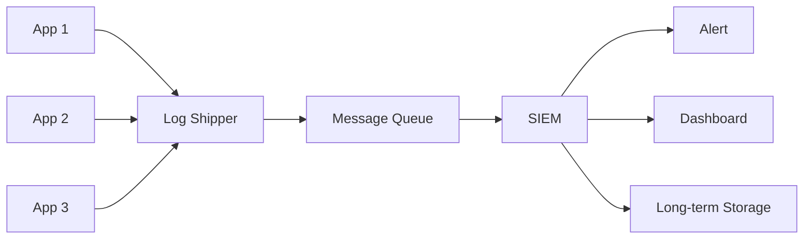

# 보안 로깅과 감사

사고가 터지고 나서 가장 먼저 듣는 질문은 정해져 있다. "언제부터 들어왔냐", "어떤 계정으로 뭘 만졌냐", "데이터 얼마나 빠져나갔냐". 답을 못 하면 그 다음은 추측이고 추측은 곧 과대 신고로 이어진다. 개인정보 1000건 유출인지 100만 건 유출인지를 로그가 가른다. 평소에 무엇을 로그로 남기고 어떻게 보관하느냐가 사고 났을 때 회사 운명을 결정한다는 뜻이다.

보안 로깅은 일반 애플리케이션 로깅과 목적이 다르다. 일반 로그는 디버깅이 주 목적이라 남길 정보를 개발자가 그때그때 정한다. 보안 로그는 누가 무엇을 했는지를 사후에 증명하기 위한 증거다. 무엇을 남길지가 법과 규정으로 정해져 있고, 위변조를 막아야 하고, 일정 기간 보존해야 한다. 이 두 가지를 같은 로깅 파이프라인으로 처리하려고 하면 둘 다 망가진다.

## 일반 로그와 감사 로그의 분리

처음 시스템을 만들 때 가장 흔한 실수가 모든 로그를 한 곳에 몰아넣는 것이다. `application.log`에 디버그, 에러, 인증 실패, 결제 처리, 관리자 권한 변경이 다 섞여서 들어간다. 그러다 사고가 나면 grep으로 뒤지는데 노이즈가 너무 많아서 진짜 신호를 못 찾는다.

감사 로그는 별도 파이프라인으로 빼야 한다. 일반 로그는 INFO/WARN/ERROR 레벨로 찍히고 며칠 보관하면 끝이지만, 감사 로그는 구조화된 포맷으로 별도 저장소에 들어가고 몇 년씩 보관된다. 둘은 보존 정책이 다르고 접근 권한도 달라야 한다. 개발자가 디버깅 로그는 자유롭게 읽어도 감사 로그는 보안팀만 읽을 수 있어야 한다.

```
[일반 로그]                       [감사 로그]
- application.log                  - audit.log (또는 별도 인덱스)
- 자유 형식 텍스트                  - JSON 구조화 필수
- 보존 7~30일                      - 보존 1~5년
- 개발자 모두 접근                  - 보안팀/감사팀만 접근
- 손실 허용                        - 손실 불가 (전송 실패 시 큐에 보관)
```

이 분리가 안 되어 있으면 로그 보존 기간을 늘릴 때 비용이 폭증하고, 디스크가 차서 일반 로그를 지울 때 감사 로그까지 같이 날아가는 사고가 생긴다.

## 무엇을 남겨야 하는가

ISMS-P, PCI DSS, SOX, GDPR 모두 감사 로그 항목을 명시하고 있는데, 공통으로 요구하는 카테고리는 다음과 같다.

### 인증 관련 이벤트

로그인 성공과 실패 모두 남긴다. 실패만 남기면 된다고 생각하기 쉬운데, 성공 로그가 있어야 비정상 시간대 로그인이나 비정상 위치에서의 로그인 같은 패턴을 잡을 수 있다.

남겨야 할 항목은 사용자 ID, 시각, 출발 IP, User-Agent, 인증 방식(비밀번호/OTP/SSO), 결과(성공/실패), 실패 사유다. 실패 사유는 "비밀번호 불일치", "계정 잠금", "MFA 실패"를 구분해야 한다. 같은 IP에서 여러 계정으로 비밀번호 불일치가 반복되면 크리덴셜 스터핑이고, 한 계정에 여러 비밀번호 시도가 오면 무차별 대입이다. 결과만 봐서는 구분이 안 된다.

로그아웃, 세션 만료, 강제 로그아웃도 같이 남긴다. 사고 분석할 때 "이 시각에 이 세션이 살아있었는가"를 판단하는 근거가 된다.

### 권한 변경 이벤트

권한이 바뀌는 모든 순간을 기록한다. 사용자 역할 부여/회수, 그룹 추가/제거, IAM 정책 수정, API 키 발급/폐기, 관리자 페이지 접근. 누가 누구의 권한을 언제 어떻게 바꿨는지가 핵심이다. 이건 사고 시 가장 먼저 의심받는 영역이다.

특히 권한 상승은 별도 이벤트로 분리해서 남기고 알람까지 걸어둔다. 일반 사용자가 관리자 권한을 받는 순간, 시스템 계정이 sudo를 쓰는 순간은 정상 운영에서도 흔치 않은 일이라 SIEM에서 즉시 트리거되어야 한다.

### 민감 데이터 접근

개인정보, 결제 정보, 의료 정보 같은 민감 데이터는 SELECT 한 번까지도 다 남긴다. "조회한 사람, 조회한 시각, 조회한 대상자, 조회한 항목" 이 네 개가 최소 단위다. 한국 개인정보보호법 28조의 안전성 확보 조치 기준을 보면 개인정보처리시스템 접근 기록을 1년(또는 2년) 이상 보관하라고 명시되어 있다.

여기서 자주 빠뜨리는 게 대량 조회다. 한 번에 한 명 조회는 잘 남기는데, 관리자가 엑셀로 내려받기 위해 1만 명을 조회하면 같은 트랜잭션 안에서 처리되니까 로그가 한 줄밖에 안 남는 경우가 있다. 대량 조회는 별도 이벤트 타입으로 "다운로드, 건수, 필터 조건"을 함께 남겨야 한다. 사고 후 "어떤 데이터가 어디까지 빠져나갔는가" 추적의 핵심 단서다.

### 데이터 변경 이벤트

CRUD 중에 R을 제외한 C/U/D는 가능하면 다 남긴다. 특히 U(Update)는 "변경 전 값과 변경 후 값"을 함께 남겨야 의미가 있다. "주소를 변경했다"가 아니라 "서울에서 부산으로 변경했다"가 감사 로그다.

전체 테이블의 모든 컬럼을 다 남기면 양이 폭발하니 컬럼 단위로 감사 대상을 지정한다. 회원의 이메일, 휴대폰, 결제 계좌 같은 컬럼은 변경 이력 필수, 마지막 로그인 시각 같은 시스템 컬럼은 제외.

### 시스템 이벤트

서비스 시작/종료, 설정 변경, 보안 모듈 비활성화, 로그 시스템 자체의 장애. 마지막 항목이 중요한데, 로그 시스템이 죽었다는 사실 자체를 다른 곳에 남겨야 한다. 그렇지 않으면 공격자가 로그 시스템부터 죽이고 작업하면 흔적이 안 남는다.

## 절대 남기면 안 되는 것

이게 더 중요하다. 로그에 들어간 순간 그 데이터는 로그가 보관되는 모든 곳에 복사된다. CloudWatch, S3 백업, Elasticsearch 인덱스, 개발자 노트북에 받아둔 로그 덤프까지 전부. 한 번 들어가면 회수가 사실상 불가능하다.

### 비밀번호와 인증 정보

평문 비밀번호는 당연히 안 되고, 비밀번호 입력 폼의 request body 자체를 통째로 로깅하면 안 된다. 디버깅한답시고 `logger.info("login request: {}", requestBody)` 한 줄 넣었다가 비밀번호가 평문으로 6개월치 쌓여있는 경우를 본 적이 있다. 발견되면 전수 비밀번호 재설정에 사고 보고에, 회사 신뢰도까지 흔들린다.

세션 토큰, JWT, API 키, OAuth access token, refresh token도 마찬가지다. 토큰을 로그에 남기면 그 토큰의 유효 기간 동안 누구든 그 사용자로 위장할 수 있다. JWT는 특히 디코드해보면 페이로드까지 다 보이니 토큰 자체뿐 아니라 디코드 결과도 남기면 안 된다.

OTP, 인증 코드, 비밀번호 재설정 토큰. 이건 짧게 살아있는 값이라 안전하다고 착각하기 쉬운데, 만료 전에 로그에 남으면 그 시간 안에 가로채기 가능하다. 메일/SMS로 보낸 인증 코드를 발송 로그에 같이 남기는 경우가 흔한 실수다.

### 결제 및 금융 정보

카드번호 전체(PAN), CVC, 카드 비밀번호, 계좌 비밀번호. PCI DSS는 PAN을 저장할 때 마스킹하거나 토큰화하라고 요구한다. 첫 6자리와 마지막 4자리만 남기고 나머지는 마스킹하는 게 표준이다.

```
원본: 4532-1234-5678-9012
허용: 4532-12**-****-9012
```

CVC는 어떤 경우에도 저장하면 안 된다. 결제 처리 직후 메모리에서도 즉시 소거해야 하고 로그는 당연히 안 된다.

### 주민등록번호와 식별 정보

한국에서는 주민등록번호 처리가 특히 까다롭다. 개인정보보호법상 법령 근거 없이 수집/이용 자체가 금지되어 있고, 저장 시 암호화 의무가 있다. 로그에 평문으로 들어가면 그 시점에 이미 위반이다.

여권번호, 운전면허번호, 외국인등록번호도 같은 카테고리로 본다. 의료 정보(질병, 처방), 생체 정보(지문, 홍채) 역시 민감정보로 분류되어 별도 동의와 별도 보호 조치가 필요하다.

### 일반 PII

이메일, 휴대폰, 주소, 생년월일은 민감정보는 아니지만 개인정보다. 운영 로그에 남길 때는 마스킹이 원칙이다. 마스킹 규칙은 회사마다 다르지만 보통 다음과 같다.

```
이메일: hong****@example.com
휴대폰: 010-****-1234
이름: 홍*동
```

다만 감사 로그에서는 마스킹 없이 원본을 남겨야 하는 경우가 있다. "어떤 사용자가 누구의 데이터를 봤는가"가 핵심인데 마스킹된 ID로는 추적이 안 되기 때문이다. 이 경우는 일반 로그와 감사 로그를 분리하고 감사 로그의 접근 권한을 강하게 거는 방식으로 해결한다.

## 로깅 라이브러리 레벨에서 막기

"비밀번호 로그에 남기지 말자"는 약속만으로는 절대 안 지켜진다. 라이브러리 레벨에서 자동으로 마스킹되어야 한다.

### Node.js 예제

```javascript
const pino = require('pino');

const SENSITIVE_KEYS = [
  'password', 'passwd', 'pwd',
  'token', 'accessToken', 'refreshToken', 'authorization',
  'cardNumber', 'pan', 'cvc', 'cvv',
  'ssn', 'rrn', 'jumin',
  'apiKey', 'secret', 'privateKey'
];

const logger = pino({
  redact: {
    paths: [
      ...SENSITIVE_KEYS,
      ...SENSITIVE_KEYS.map(k => `*.${k}`),
      ...SENSITIVE_KEYS.map(k => `*.*.${k}`),
      'req.headers.authorization',
      'req.headers.cookie',
      'req.body.password',
      'res.headers["set-cookie"]'
    ],
    censor: '[REDACTED]'
  }
});

// 사용
logger.info({ user: { email: 'hong@example.com', password: 'secret123' } }, 'login attempt');
// 출력: {"user":{"email":"hong@example.com","password":"[REDACTED]"}}
```

pino의 `redact` 옵션은 JSON 직렬화 단계에서 키를 검사해서 자동 마스킹한다. 개발자가 실수로 비밀번호가 든 객체를 통째로 로깅해도 출력 단에서 걸러진다. 다만 깊은 중첩 경로를 일일이 등록해야 하는 한계가 있어서 객체 직렬화 전에 한 번 sanitize 함수를 거치는 게 더 확실하다.

```javascript
function sanitize(obj, depth = 0) {
  if (depth > 5 || obj === null || typeof obj !== 'object') return obj;

  if (Array.isArray(obj)) {
    return obj.map(item => sanitize(item, depth + 1));
  }

  const result = {};
  for (const [key, value] of Object.entries(obj)) {
    const lowerKey = key.toLowerCase();
    const isSensitive = SENSITIVE_KEYS.some(k => lowerKey.includes(k.toLowerCase()));

    if (isSensitive) {
      result[key] = '[REDACTED]';
    } else if (typeof value === 'string' && /^Bearer\s+/i.test(value)) {
      result[key] = '[REDACTED-TOKEN]';
    } else {
      result[key] = sanitize(value, depth + 1);
    }
  }
  return result;
}
```

키 이름 매칭만으로는 잡기 어려운 패턴(Bearer 토큰, 카드번호 형식)은 정규식으로 추가 검사한다. depth 제한을 두는 이유는 순환 참조나 깊은 객체에서 무한 루프를 막기 위해서다.

### Java 예제 (Logback + Spring)

Logback에는 PatternLayout에서 마스킹할 수 있는 기능이 있는데, 보통 ConverterClass를 직접 만들어서 쓴다.

```java
public class MaskingConverter extends ClassicConverter {
    private static final Pattern CARD_PATTERN =
        Pattern.compile("\\b(\\d{4})[- ]?(\\d{4})[- ]?(\\d{4})[- ]?(\\d{4})\\b");
    private static final Pattern RRN_PATTERN =
        Pattern.compile("\\b(\\d{6})[- ]?([1-4]\\d{6})\\b");
    private static final Pattern JWT_PATTERN =
        Pattern.compile("eyJ[A-Za-z0-9_-]+\\.eyJ[A-Za-z0-9_-]+\\.[A-Za-z0-9_-]+");

    @Override
    public String convert(ILoggingEvent event) {
        String message = event.getFormattedMessage();
        message = CARD_PATTERN.matcher(message).replaceAll("$1-****-****-$4");
        message = RRN_PATTERN.matcher(message).replaceAll("$1-*******");
        message = JWT_PATTERN.matcher(message).replaceAll("[REDACTED-JWT]");
        return message;
    }
}
```

logback.xml에서 등록하고 패턴에 적용한다.

```xml
<configuration>
    <conversionRule conversionWord="msg" converterClass="com.example.MaskingConverter"/>

    <appender name="CONSOLE" class="ch.qos.logback.core.ConsoleAppender">
        <encoder>
            <pattern>%d{HH:mm:ss.SSS} [%thread] %-5level %logger - %msg%n</pattern>
        </encoder>
    </appender>
</configuration>
```

이 방식은 어떤 로그에 어떤 형태로 들어와도 전부 검사하는 게 장점이다. 단점은 정규식 비용이 모든 로그에 발생한다는 점이라 트래픽 큰 서비스는 측정해보고 도입해야 한다.

Spring Boot에서 request body를 로깅할 때는 `CommonsRequestLoggingFilter`를 그대로 쓰면 비밀번호가 들어간 폼 데이터까지 다 찍힌다. 커스텀 필터를 만들어서 비밀번호 필드를 걸러야 한다.

```java
@Component
public class AuditLoggingFilter extends OncePerRequestFilter {
    private static final Logger auditLog = LoggerFactory.getLogger("AUDIT");
    private static final Set<String> SENSITIVE_FIELDS =
        Set.of("password", "pwd", "cvc", "rrn", "ssn");

    @Override
    protected void doFilterInternal(HttpServletRequest request,
                                     HttpServletResponse response,
                                     FilterChain chain) throws IOException, ServletException {
        ContentCachingRequestWrapper wrapped = new ContentCachingRequestWrapper(request);
        long start = System.currentTimeMillis();

        try {
            chain.doFilter(wrapped, response);
        } finally {
            if (shouldAudit(request)) {
                Map<String, Object> entry = Map.of(
                    "timestamp", Instant.now().toString(),
                    "userId", getCurrentUserId(),
                    "method", request.getMethod(),
                    "path", request.getRequestURI(),
                    "ip", extractClientIp(request),
                    "userAgent", request.getHeader("User-Agent"),
                    "status", response.getStatus(),
                    "durationMs", System.currentTimeMillis() - start
                );
                auditLog.info(toJson(entry));
            }
        }
    }

    private boolean shouldAudit(HttpServletRequest request) {
        String path = request.getRequestURI();
        return path.startsWith("/api/admin") ||
               path.startsWith("/api/users") ||
               path.contains("/login") ||
               path.contains("/payment");
    }
}
```

여기서 핵심은 감사 대상 경로만 골라서 로깅하는 것과, request body 자체는 남기지 않고 메타데이터만 남기는 것이다. body까지 남겨야 하는 경우는 별도 토글로 켜고 필요할 때만 활성화한다.

## 로그 무결성

감사 로그는 사후에 누가 무엇을 했는지를 증명하는 증거다. 그런데 사고를 친 본인이 자기 흔적을 지울 수 있다면 증거 가치가 없다. 그래서 무결성 보장이 필수다.

### Append-Only

로그 파일은 추가만 가능하고 수정/삭제는 불가능해야 한다. Linux에서는 chattr로 append-only 속성을 줄 수 있다.

```bash
chattr +a /var/log/audit/audit.log
# 이제 이 파일은 root조차 추가만 할 수 있고 수정/삭제 불가
# 해제는 -a로 (root만 가능)
```

이걸 켜두면 fail2ban이나 logrotate 같은 도구가 동작 안 하니까 운영 정책과 같이 설계해야 한다. 보통은 활성 로그는 일반 파일로 두고 rotate된 archived 파일에만 chattr +a를 거는 방식을 쓴다.

### WORM 스토리지

Write Once Read Many. AWS S3 Object Lock, Azure Immutable Blob Storage가 대표적이다. 한 번 기록하면 지정한 보존 기간이 끝나기 전까지 누구도 삭제/수정할 수 없다. 루트 계정이라도 못 지운다.

```bash
# S3 버킷에 Object Lock 활성화 (생성 시점에만 가능)
aws s3api create-bucket \
  --bucket audit-logs-prod \
  --object-lock-enabled-for-bucket

# 객체에 보존 기간 설정 (5년)
aws s3api put-object-retention \
  --bucket audit-logs-prod \
  --key 2026/05/04/audit.log \
  --retention 'Mode=COMPLIANCE,RetainUntilDate=2031-05-04T00:00:00Z'
```

Mode가 두 가지다. GOVERNANCE는 특정 권한을 가진 사용자가 우회 가능하고, COMPLIANCE는 어떤 권한으로도 우회 불가능하다. 진짜 감사용이라면 COMPLIANCE를 써야 한다. 다만 한 번 걸면 정말로 못 지우니 보존 기간을 신중하게 정해야 한다. 5년으로 걸어놓고 비용 이슈로 지우고 싶어도 5년간 지우지 못한다.

### 해시 체인

로그 파일 자체의 무결성을 검증하기 위해 각 로그 줄에 직전 줄의 해시를 포함시키는 방식이다. 누가 중간 한 줄을 수정/삭제하면 그 이후의 해시 체인이 전부 깨져서 변조 사실이 드러난다.

```
line 1: { ..., "prevHash": "GENESIS", "hash": "a1b2c3..." }
line 2: { ..., "prevHash": "a1b2c3...", "hash": "d4e5f6..." }
line 3: { ..., "prevHash": "d4e5f6...", "hash": "g7h8i9..." }
```

블록체인의 가장 단순한 형태다. 직접 구현해도 되고, AWS CloudTrail이나 Google Cloud Audit Logs는 내부적으로 이런 무결성 검증 메커니즘을 제공한다. CloudTrail의 log file integrity validation 기능을 켜두면 디지털 서명까지 함께 저장해서 사후 검증할 수 있다.

### 외부 시스템으로 즉시 전송

가장 실용적인 방어다. 로그가 로컬 디스크에 남기를 기다리지 말고 생성되는 즉시 외부 SIEM이나 로그 수집 시스템으로 보낸다. 공격자가 서버에 들어와서 로컬 로그를 지워도 외부에 이미 사본이 있다.

전송 실패 시 큐잉도 같이 설계한다. 네트워크가 끊겼다고 로그를 버리면 안 된다. 디스크 큐에 쌓아뒀다가 복구되면 보내는 방식이다. Fluent Bit, Vector, Filebeat 같은 도구들이 이걸 처리한다.

## SIEM 연동

SIEM(Security Information and Event Management)은 여러 소스의 로그를 한 곳에 모아서 상관관계 분석과 알람을 처리하는 시스템이다. Splunk, IBM QRadar, ArcSight가 전통적인 상용 SIEM이고, 오픈소스로는 Elastic Stack의 SIEM 모듈, Wazuh, Graylog가 있다. 클라우드 네이티브로는 AWS Security Hub, Azure Sentinel, Google Chronicle이 있다.

SIEM이 잘 동작하려면 로그가 정규화된 형태로 들어와야 한다. 각 시스템의 로그 포맷이 제각각이면 상관관계 분석이 안 된다. 그래서 로그를 보낼 때 공통 스키마를 따른다. ECS(Elastic Common Schema), CEF(Common Event Format), LEEF(Log Event Extended Format)가 표준이다.

ECS 형식 예시:

```json
{
  "@timestamp": "2026-05-04T10:23:45.123Z",
  "event": {
    "category": ["authentication"],
    "type": ["start"],
    "outcome": "failure",
    "action": "user-login",
    "reason": "invalid-password"
  },
  "user": {
    "id": "user-12345",
    "email": "hong@example.com"
  },
  "source": {
    "ip": "203.0.113.45",
    "geo": {
      "country_iso_code": "KR",
      "city_name": "Seoul"
    }
  },
  "user_agent": {
    "original": "Mozilla/5.0 ..."
  },
  "service": {
    "name": "auth-api",
    "version": "1.4.2"
  }
}
```

이 형태로 보내면 SIEM에서 "최근 5분간 같은 IP에서 다섯 계정 이상 인증 실패" 같은 룰을 만들 수 있다. 자체 형식으로 보내면 룰을 만들 때마다 파싱부터 다시 짜야 한다.



중간에 메시지 큐(Kafka가 일반적)를 두는 이유가 있다. SIEM이 잠깐 죽거나 처리량을 못 따라잡을 때 로그가 유실되는 걸 막는다. 또 SIEM 외에 다른 분석 시스템(데이터 레이크, 컴플라이언스 아카이브)에도 같은 로그를 분기해서 보내기 쉬워진다.

## 보존 기간

법적 요구사항에 따라 결정된다. 한국 기준으로 정리하면 다음과 같다.

| 종류 | 근거 | 보존 기간 |
| --- | --- | --- |
| 개인정보처리시스템 접근 기록 | 개인정보보호법 안전성 확보조치 기준 | 1년 (5만명 이상 또는 민감정보 처리 시 2년) |
| 정보통신서비스 접속 기록 | 통신비밀보호법 시행령 | 3개월 (위치정보 30일) |
| 전자금융거래 기록 | 전자금융거래법 | 5년 |
| 신용정보 처리내역 | 신용정보법 | 3년 |
| 의료정보 접근 기록 | 의료법 시행규칙 | 의무기록은 종류별로 5~10년 |

GDPR은 보존 기간을 명시하지 않고 "처리 목적에 필요한 최소 기간"이라는 원칙을 제시한다. 실무에서는 보안 사고 분석에 필요한 기간을 6개월에서 2년으로 잡는 게 일반적이다. 다만 "더 오래 보관할 정당한 사유"가 있어야 한다. 사유 없이 그냥 영구 보관하면 GDPR 위반이다.

여기서 자주 놓치는 게 보존 기간이 끝났을 때의 삭제 의무다. 법으로 정해진 기간이 지나면 삭제해야지 그냥 가지고 있으면 안 된다. 한국 개인정보보호법은 보유 기간 경과 시 지체 없이 파기하라고 명시한다. WORM으로 잠가놓은 로그가 보존 기간 끝나면 자동으로 만료되도록 라이프사이클 정책을 같이 걸어둬야 한다.

```bash
# S3 라이프사이클로 2년 후 자동 삭제
aws s3api put-bucket-lifecycle-configuration \
  --bucket audit-logs-prod \
  --lifecycle-configuration '{
    "Rules": [{
      "Id": "expire-after-2y",
      "Status": "Enabled",
      "Filter": { "Prefix": "audit/" },
      "Expiration": { "Days": 730 }
    }]
  }'
```

## IP와 User-Agent: 마스킹할 것인가 보존할 것인가

이게 실무에서 가장 헷갈리는 지점이다. GDPR은 IP 주소를 개인정보로 본다. 동적 IP라도 ISP가 보유한 정보와 결합하면 개인을 식별할 수 있기 때문이다. 한국 개인정보보호법도 "다른 정보와 쉽게 결합하여 알아볼 수 있는 정보"는 개인정보로 분류한다. 그러면 IP를 마스킹해야 하는가, 보존해야 하는가.

답은 "용도에 따라 다르다"다.

### 보안/감사 목적

원본 그대로 남긴다. 사고 발생 시 공격 출발지 추적이 필요하고, 법 집행 기관 요청에도 대응해야 한다. IP를 마스킹하면 이게 다 불가능해진다. 한국 정보통신망법도 보안 사고 대응을 위한 처리는 별도 동의 없이 가능하도록 하고 있다. 단, 이 로그는 보안팀만 접근 가능하도록 ACL을 강하게 걸고, 보존 기간이 끝나면 즉시 삭제한다.

### 분석/통계 목적

마스킹하거나 익명화한다. 어떤 지역에서 트래픽이 많이 오는지, 어떤 브라우저 비율이 높은지를 분석할 때는 개별 IP가 필요 없다. IPv4의 마지막 옥텟을 0으로 만드는 정도가 일반적이다.

```javascript
function maskIp(ip) {
  if (ip.includes(':')) {
    // IPv6: 마지막 80비트 제거
    return ip.split(':').slice(0, 3).join(':') + '::';
  }
  // IPv4: 마지막 옥텟 제거
  const parts = ip.split('.');
  parts[3] = '0';
  return parts.join('.');
}

// 203.0.113.45 → 203.0.113.0
// 2001:db8:abcd:1234:5678::1 → 2001:db8:abcd::
```

User-Agent는 IP보다 식별성이 약하지만, 희귀한 조합(특정 OS + 특정 확장 + 특정 폰트 등)은 디바이스 핑거프린팅으로 개인 식별이 가능하다. 분석 목적이라면 OS와 브라우저 메이저 버전 정도만 추출해서 저장한다.

### 두 가지 로그를 같이 운영

같은 이벤트를 두 가지 형태로 분리해서 저장하는 게 정석이다.

- 감사 로그: 원본 IP/UA, 보안팀만 접근, 짧은 보존 기간(법적 최소)
- 분석 로그: 마스킹된 IP/UA, 분석팀 접근 가능, 긴 보존 기간

이 분리가 GDPR 데이터 최소화 원칙과도 맞고, 실용성도 잃지 않는다. 한 곳에 다 넣고 "필요할 때만 보안팀이 보면 된다"고 하는 게 가장 위험하다. 접근 통제가 제대로 안 되면 분석가가 IP까지 보게 되고, 법적 위반이 된다.

## 실무에서 자주 놓치는 포인트

오랜 시간 운영하면서 사고와 점검을 통해 드러나는 패턴들이다.

### 시간 동기화

각 서버 시각이 안 맞으면 사고 분석이 망가진다. 서버 A의 11:00:23 이벤트와 서버 B의 11:00:21 이벤트의 선후 관계를 판단해야 하는데, 두 서버의 시계가 5초씩 차이 나면 분석이 무의미해진다. NTP 동기화는 기본이고, 로그 시각은 가능한 한 UTC로 통일하고 마이크로초 단위까지 기록한다.

### 사용자 식별의 일관성

같은 사용자가 어떤 로그에서는 이메일로, 어떤 로그에서는 user_id로, 어떤 로그에서는 닉네임으로 기록되면 SIEM에서 상관관계 분석이 안 된다. 모든 감사 로그에 동일한 user_id를 필수로 넣는다. 익명 사용자의 경우는 세션 ID나 디바이스 ID로라도 추적 단위를 만든다.

### 비동기 작업의 추적

API 요청이 들어와서 메시지 큐로 던지고, 워커가 처리하고, 다시 알림을 발송하는 흐름에서 각 단계의 로그가 따로 남으면 한 흐름을 추적할 수 없다. 요청 시작 시점에 trace_id를 생성해서 모든 후속 로그에 포함시킨다. OpenTelemetry의 trace context를 그대로 쓰면 분산 추적과 감사 로그가 한 번에 해결된다.

### 로그 시스템 자체에 대한 감사

감사 로그를 누가 조회했는지도 로그를 남겨야 한다. "관리자 김아무개가 2026-05-04 14:30에 사용자 홍길동의 로그를 조회함" 같은 메타-감사 로그다. 이게 없으면 내부자가 다른 사람의 활동을 몰래 들여다봐도 흔적이 안 남는다.

### 알람 피로도

모든 인증 실패에 알람을 걸면 며칠 만에 무시 모드가 된다. 임계값을 단순한 횟수가 아니라 패턴 기반으로 설계해야 한다. "한 IP에서 다섯 계정 이상 인증 실패", "정상 시간대 외 관리자 로그인", "한 사용자가 평소 접근하지 않던 데이터 대량 조회" 같은 식이다. 알람이 울리면 진짜 사람이 봐야 하는 상황이어야 한다.

### 개발/스테이징 환경의 로그

운영 데이터가 개발 환경으로 흘러들어가는 경우가 의외로 많다. DB dump를 떠서 테스트하다가 그 안의 실 사용자 정보가 개발 환경 로그로 찍힌다. 운영 데이터를 비-운영 환경으로 가져갈 때는 마스킹 또는 합성 데이터로 대체하는 프로세스가 필요하다.

### 로그가 너무 비싸지면 무엇을 자르는가

CloudWatch나 Datadog 청구서를 보고 "로그 비용 줄이자"는 얘기가 나오면 가장 먼저 잘리는 게 디버그 로그인데, 가끔 감사 로그까지 같이 잘리는 경우가 있다. 비용 최적화 회의에서 "이건 법적 의무 보존 대상"이라는 카테고리를 명확히 표시해두지 않으면 위험하다. 감사 로그는 별도 인덱스/버킷으로 분리하고, 압축 + 콜드 스토리지 + 라이프사이클 정책으로 비용을 낮추되 보존 기간 자체는 줄이지 않는다.
