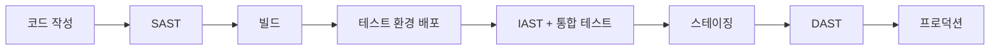
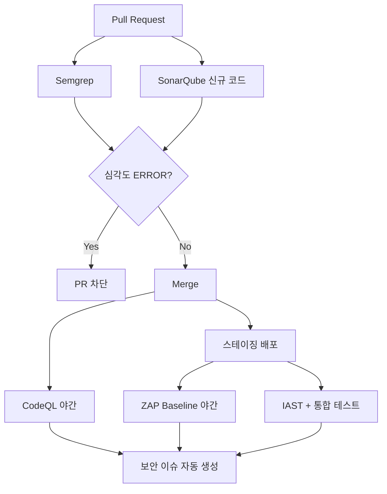

# SAST / DAST / IAST 보안 테스팅

## 세 가지 테스팅이 보는 것

보안 테스팅 도구를 도입할 때 첫 번째로 정리해야 하는 건 어떤 도구가 코드의 어느 시점을 보는가다. 이걸 헷갈리면 도구를 잘못 도입하거나 같은 영역을 중복으로 검사하게 된다.

SAST(Static Application Security Testing)는 소스코드를 실행하지 않고 본다. 컴파일 전 또는 컴파일 직후 단계에서 코드 패턴, AST(Abstract Syntax Tree), 데이터 흐름을 분석한다. 개발자가 IDE에서 저장하는 순간이나 PR을 올리는 순간 동작한다. 가장 빠르게 피드백을 주지만 런타임 컨텍스트가 없으니 false positive가 가장 많다.

DAST(Dynamic Application Security Testing)는 실행 중인 애플리케이션을 외부에서 두드린다. HTTP 요청을 보내고 응답을 분석해 SQL Injection, XSS, 인증 우회 같은 취약점을 찾는다. 소스코드 접근 없이 동작하니 블랙박스에 가깝다. false positive는 SAST보다 적지만 커버리지가 낮다. 도구가 도달하지 못한 페이지나 API는 검사 자체가 안 된다.

IAST(Interactive Application Security Testing)는 SAST와 DAST의 중간이다. 애플리케이션 안에 에이전트를 심어서 실제 요청이 들어왔을 때 코드 실행 경로를 추적한다. QA 테스트나 통합 테스트가 돌 때 함께 동작하면서 어떤 입력이 어떤 sink까지 도달했는지를 본다. 정확도는 가장 높지만 에이전트가 성능에 영향을 주고, 도달하지 않은 경로는 못 본다.



이 흐름이 핵심이다. SAST는 가장 왼쪽, DAST는 가장 오른쪽, IAST는 중간이다. 셋 중 하나만 쓴다면 SAST를 먼저 도입하는 게 ROI가 높다. 코드 작성 단계에서 잡으면 수정 비용이 가장 싸기 때문이다.

## SAST 도구 비교: SonarQube, Semgrep, CodeQL

세 도구는 같은 SAST지만 성격이 다르다. 실제로 도입해보면 차이가 명확하다.

### SonarQube

기업 환경에서 가장 많이 보는 도구다. 코드 품질, 커버리지, 보안 핫스팟을 한 화면에서 본다. Quality Gate 개념이 강력해서 PR이 일정 기준 미달이면 자동 차단할 수 있다. Community 에디션은 보안 룰이 빈약하다는 함정이 있다. SAST 용도로 쓰려면 Developer 에디션 이상을 사야 taint analysis 같은 기능이 켜진다. 라이선스 비용이 LOC 기준이라 코드베이스가 커지면 빠르게 비싸진다.

SonarQube가 잡는 패턴 중 노이즈가 많은 게 "Cognitive Complexity"나 "코드 중복" 같은 코드 품질 룰이다. 보안 리뷰만 하고 싶다면 보안 카테고리만 Quality Gate에 넣고 나머지는 정보성으로만 본다.

### Semgrep

오픈소스 진영의 사실상 표준이다. 룰을 YAML로 직접 쓸 수 있고 문법이 간단하다. 사내에서 자주 발생하는 안티패턴을 룰로 만들어서 공유하기 좋다.

```yaml
rules:
  - id: hardcoded-jwt-secret
    pattern: |
      jwt.sign($PAYLOAD, "...")
    message: JWT 시크릿이 하드코딩되어 있다
    severity: ERROR
    languages: [javascript, typescript]
```

이런 룰을 사내 모노레포 전체에 한 줄 명령으로 돌릴 수 있다. SonarQube 룰을 작성하려면 Java 플러그인을 만들어야 하는 것과 비교하면 진입장벽이 다르다. 단점은 데이터 흐름 분석이 약하다. 단순 패턴 매칭은 잘하지만 "이 변수가 사용자 입력에서 시작되어 SQL 쿼리까지 흐른다"를 추적하는 능력은 CodeQL보다 떨어진다. Semgrep Pro 버전을 쓰면 cross-file taint analysis가 되는데 유료다.

### CodeQL

GitHub가 만든 도구로 GitHub Advanced Security 라이선스가 있으면 무료다. Public 저장소는 그냥 무료다. 코드를 데이터베이스로 변환한 뒤 SQL 비슷한 QL 언어로 쿼리를 던진다. 데이터 흐름 분석이 가장 정밀하다. 대신 분석 시간이 길다. 중간 규모 모노레포에서 10~30분이 걸리는 건 흔하다.

CodeQL의 함정은 빌드 시스템에 결합된다는 점이다. 컴파일 언어(Java, C#, C++)는 CodeQL이 빌드 과정을 가로채서 분석 DB를 만든다. 빌드가 깨지면 CodeQL도 안 돈다. 멀티모듈 Gradle 프로젝트에서 한 모듈이 빌드 실패하면 전체 분석이 안 되는 케이스를 자주 본다.

### 어떻게 조합하는가

실무에서 셋 다 쓰는 경우가 많다. 역할 분담이 가능하기 때문이다.

- Semgrep: PR마다 빠른 피드백. 사내 룰 위주. 30초 내에 결과를 본다.
- CodeQL: 매일 야간 빌드 또는 main 머지 시. 정밀한 데이터 흐름 분석.
- SonarQube: 코드 품질 통합 대시보드. 비-보안 메트릭과 함께 본다.

이렇게 분리하면 PR 사이클이 느려지지 않으면서 정밀도도 챙긴다.

## DAST 도구: OWASP ZAP, Burp Suite

DAST는 SAST보다 도입이 까다롭다. 실행 중인 환경이 필요하고, 인증을 처리해야 하고, 어디까지 스캔할지를 정해야 한다.

### OWASP ZAP

오픈소스 DAST의 표준이다. CI에 넣기 좋은 이유는 헤드리스 모드와 Docker 이미지가 잘 정리되어 있기 때문이다. baseline scan, full scan, API scan 세 가지 모드가 있다.

```bash
docker run -v $(pwd):/zap/wrk/:rw -t zaproxy/zap-stable \
  zap-baseline.py -t https://staging.example.com -r zap-report.html
```

baseline은 약 1분 안에 끝난다. 사이트 맵을 따라가면서 수동적으로 응답을 분석할 뿐이라 실제 공격을 시도하지는 않는다. full scan은 active scan을 포함해서 SQL Injection, XSS 페이로드를 실제로 넣어본다. 시간이 오래 걸리고 사이트에 부하를 준다.

ZAP을 도입할 때 가장 자주 빠지는 함정은 인증이다. 로그인이 필요한 페이지는 ZAP이 못 들어간다. context 파일을 만들어서 인증 스크립트를 등록해야 하는데 SPA처럼 토큰 기반 인증을 쓰면 설정이 복잡해진다. 자동 로그인이 잘 안 되면 인증된 세션 쿠키나 Authorization 헤더를 직접 ZAP에 주입하는 방식이 더 간단하다.

### Burp Suite

수동 침투 테스트의 사실상 표준이다. Pro 버전은 라이선스가 비싸지만(연 $449) 개별 보안 엔지니어가 쓰는 도구로는 가성비가 좋다. CI 통합용으로는 Burp Suite Enterprise Edition이 따로 있는데 가격이 ZAP과 비교가 안 되게 비싸다.

실무에서 Burp는 자동화보다 수동 검토용으로 쓴다. 분기에 한 번 보안팀이 핵심 API를 Burp으로 본다. 자동화 파이프라인에는 ZAP을 넣고, Burp은 사람이 깊이 들어가는 용도로 분리한다.

### DAST의 한계

DAST는 도달하지 못한 곳을 못 본다. 관리자 페이지, 특정 권한이 필요한 API, 비정상 흐름으로만 도달하는 엔드포인트는 자동 크롤링으로 안 잡힌다. OpenAPI(Swagger) 스펙을 ZAP에 직접 먹이는 방식(`zap-api-scan.py`)이 그나마 커버리지를 끌어올리는 방법이다. 스펙이 없으면 DAST 효과가 절반 이하로 떨어진다.

## IAST 도구: Contrast Security

Contrast가 IAST 시장의 대표 주자다. 동작 방식은 JVM agent, .NET profiler, Node.js 모듈 같은 형태로 애플리케이션 프로세스에 붙는다. 실제 요청이 들어오면 어떤 컨트롤러를 거쳐 어떤 SQL을 만들고 어떤 외부 호출이 일어나는지를 따라간다.

IAST의 진짜 가치는 "false positive가 거의 없다"는 점이다. SAST가 "여기서 SQL Injection이 가능할 수 있다"고 경고하는 지점을, IAST는 "이 요청에서 실제로 사용자 입력이 prepared statement 없이 들어갔다"고 확정한다. 추적 정보가 있으니 우선순위 판단이 쉽다.

단점은 명확하다. 에이전트가 성능에 영향을 준다. JVM 기준 5~15% 정도 느려진다. 프로덕션에는 잘 안 넣고 QA/스테이징 환경에 넣는다. 그리고 통합 테스트나 QA 시나리오가 충실하지 않으면 IAST가 못 보는 영역이 그대로 남는다. "테스트가 안 도는 코드는 IAST도 못 본다"는 게 핵심이다.

Contrast 외에 Seeker(Synopsys)도 있고, Datadog ASM이 IAST 비슷한 기능을 RASP와 함께 제공한다. 도입 시점에는 가격이 가장 큰 변수다. 라이선스가 호스트당 또는 애플리케이션당 청구되니 마이크로서비스가 많으면 비용이 폭증한다.

## False Positive 다루는 법

세 도구 다 false positive를 만든다. 운영하다 보면 이걸 처리하는 방식이 도구 가치의 절반 이상을 결정한다.

### 첫 도입 시 노이즈 처리

새 도구를 코드베이스에 처음 돌리면 수백 개에서 수천 개의 알림이 쏟아진다. 이걸 그대로 PR 차단 룰로 묶으면 개발자가 도구를 우회하기 시작한다. 첫 단계는 baseline을 만드는 거다.

```bash
# Semgrep 예시: 기존 이슈를 baseline으로 등록
semgrep ci --baseline-ref=main
```

baseline 이후에 발생하는 이슈만 PR에서 막고, 기존 이슈는 별도 백로그로 빼서 정리한다. CodeQL도 비슷하게 동작한다. SonarQube는 "new code"라는 개념으로 같은 일을 한다.

### 룰 단위 disable는 최후의 수단

특정 룰이 노이즈가 많다고 전체 disable하면 그 룰이 잡아주던 진짜 취약점도 놓친다. 대신 다음 순서로 처리한다.

1. 해당 룰의 patten을 좁혀서 사내 코드 패턴에 맞게 튜닝
2. 그래도 노이즈면 특정 디렉토리만 제외
3. 마지막으로 룰 자체 disable

Semgrep은 `.semgrepignore` 파일이나 룰 안에 `paths` 필드로 제어한다. SonarQube는 프로파일에서 룰을 끈다. CodeQL은 `paths-ignore`를 워크플로 설정에 둔다.

### 인라인 suppression의 함정

코드에 직접 `// nosem` 이나 `// codeql[js/sql-injection]` 같은 주석으로 무시 표시를 넣는 방식이 있다. 편하지만 남용하면 코드베이스에 보안 무시 주석이 흩뿌려진다. 룰 하나는 무시하면서 의도치 않게 다른 룰까지 함께 무시하는 케이스도 발생한다.

운영 룰: suppression 주석에는 반드시 이유를 적는다. 그리고 분기마다 grep으로 모아서 검토한다.

```bash
git grep -n "nosem\|codeql\[" -- '*.ts' '*.java'
```

이렇게 모인 suppression이 100건을 넘기면 정리할 시점이다.

### DAST의 false positive 처리

DAST는 응답 본문 패턴에 의존하다 보니 오탐이 더 심하다. ZAP이 "Reflected XSS"라고 보고했지만 실제로는 Content-Security-Policy로 차단되는 케이스, 응답에 입력값이 그대로 노출되지만 컨텍스트 상 안전한 케이스가 흔하다.

ZAP의 `-z` 옵션으로 특정 룰 ID를 끄거나, `.zap/rules.tsv` 파일로 지속 관리한다. baseline scan을 자주 돌리고 새 alert만 트래킹하는 방식이 현실적이다.

## CI 파이프라인 통합

GitHub Actions 기준으로 실제 동작하는 워크플로를 정리한다.

### Semgrep + CodeQL 결합

```yaml
name: security-scan

on:
  pull_request:
    branches: [main]
  push:
    branches: [main]

jobs:
  semgrep:
    runs-on: ubuntu-latest
    container: returntocorp/semgrep
    steps:
      - uses: actions/checkout@v4
        with:
          fetch-depth: 0
      - run: semgrep ci --config=p/owasp-top-ten --config=./.semgrep/
        env:
          SEMGREP_APP_TOKEN: ${{ secrets.SEMGREP_APP_TOKEN }}

  codeql:
    runs-on: ubuntu-latest
    permissions:
      security-events: write
      contents: read
    if: github.event_name == 'push'
    strategy:
      matrix:
        language: [javascript, java]
    steps:
      - uses: actions/checkout@v4
      - uses: github/codeql-action/init@v3
        with:
          languages: ${{ matrix.language }}
          queries: security-extended
      - uses: github/codeql-action/autobuild@v3
      - uses: github/codeql-action/analyze@v3
```

Semgrep은 PR마다 돌고 CodeQL은 main 푸시에만 돈다. 이렇게 분리하는 이유는 CodeQL이 느려서 PR 피드백 루프를 망가뜨리기 때문이다. 평균 분석 시간이 5분을 넘으면 개발자가 CI 결과를 안 본다.

### ZAP DAST 통합

스테이징 배포가 끝난 뒤에 따로 도는 잡으로 분리한다.

```yaml
name: zap-baseline

on:
  schedule:
    - cron: '0 18 * * *'  # 매일 18시
  workflow_dispatch:

jobs:
  zap:
    runs-on: ubuntu-latest
    steps:
      - uses: actions/checkout@v4
      - uses: zaproxy/action-baseline@v0.12.0
        with:
          target: https://staging.example.com
          rules_file_name: '.zap/rules.tsv'
          cmd_options: '-a -j'
          fail_action: false
```

`fail_action: false`로 둔 이유는 DAST 결과로 PR을 막지 않기 위해서다. ZAP은 일정 시간이 걸리니 PR 차단 게이트로 쓰면 개발 속도가 느려진다. 대신 새 alert가 발생하면 보안 이슈를 자동 생성하는 식으로 운영한다.

### SonarQube 통합

```yaml
- uses: SonarSource/sonarqube-scan-action@v2
  env:
    SONAR_TOKEN: ${{ secrets.SONAR_TOKEN }}
    SONAR_HOST_URL: https://sonar.example.com

- uses: SonarSource/sonarqube-quality-gate-action@v1
  timeout-minutes: 5
  env:
    SONAR_TOKEN: ${{ secrets.SONAR_TOKEN }}
```

Quality Gate가 실패하면 PR이 막힌다. 단, 처음에는 "신규 코드"에만 게이트를 걸어야 기존 코드 부채로 인한 차단이 안 생긴다. SonarQube에서 "Clean as You Code" 모드로 설정한다.

### 전체 흐름



PR 단계는 빠른 도구만 두고, 무거운 도구는 비동기로 돌린다. 이게 깨지면 개발자가 CI를 우회하기 시작한다.

## 단계별로 어떤 도구를 쓸 것인가

상황에 따라 다르지만 5년차 입장에서 정리한 우선순위는 이렇다.

**소규모 스타트업**: Semgrep + ZAP baseline. 둘 다 무료. 사내 룰 1~2개부터 시작해서 점진적으로 늘린다. SonarQube나 CodeQL은 운영 부담이 크다.

**중규모 (개발자 30~100명)**: Semgrep + CodeQL + ZAP. SonarQube는 코드 품질용으로 추가하면 좋다. 보안팀이 별도로 있으면 Burp Suite Pro 라이선스 몇 개를 산다.

**대규모 (개발자 100명+)**: 위에 더해서 IAST 도입을 검토한다. 마이크로서비스 환경에서 SAST/DAST만으로는 정밀도가 떨어진다. Contrast나 Seeker를 핵심 서비스부터 단계적으로 넣는다.

**컴플라이언스 요구사항이 있는 경우**: PCI DSS, ISMS, SOC 2 같은 인증을 받아야 하면 SonarQube 같은 통합 대시보드가 감사 대응에 유리하다. 감사관이 "보안 테스팅을 어떻게 하는가"를 물을 때 화면 하나로 보여줄 수 있어야 한다.

## 테스트 환경 분리할 때 주의점

DAST와 IAST는 실행 환경이 필요하니 환경 분리가 중요하다. 실수하면 사고가 난다.

### 프로덕션 데이터를 쓰지 않는다

DAST는 active scan에서 실제 페이로드를 보낸다. 프로덕션 DB에 SQL Injection 페이로드가 들어가면 데이터가 망가질 수 있다. ZAP을 프로덕션에 직접 돌리는 건 금기다. 스테이징도 프로덕션 DB와 공유하면 위험하다.

운영 원칙: DAST 대상 환경은 데이터를 언제든 초기화해도 되는 상태로 둔다. 매 스캔 전 DB 스냅샷을 복구하는 식이 안전하다.

### 외부 시스템 호출 차단

스테이징 환경이 외부 결제 게이트웨이, 이메일 서버, SMS 게이트웨이를 진짜로 호출하면 DAST 스캔 중에 수천 건의 결제 시도, 메일 발송이 일어날 수 있다. 스테이징에서는 이런 외부 호출을 모두 mock으로 돌리거나 sandbox 엔드포인트로 라우팅한다.

회원가입 폼에 ZAP이 페이로드를 넣고 SMS 인증을 트리거해서 통신사 비용이 수백만 원 나온 사례가 실제로 있다.

### Rate limiting 비활성화

스테이징에서 rate limiting이 켜져 있으면 DAST가 절반쯤 진행되다 차단된다. 그렇다고 끄면 진짜 rate limit 취약점은 못 본다. 답은 두 환경을 나누는 거다. rate limit이 켜진 환경에서는 인증 우회 같은 로직 검사를, 꺼진 환경에서는 활성 스캔을 돌린다.

### IAST 에이전트는 프로덕션에 넣지 않는다

Contrast 에이전트가 프로덕션 트래픽까지 추적하면 성능 영향이 크고 민감한 정보가 에이전트 서버로 전송될 수 있다. 라이선스가 호스트당 부과되는 것도 비용 문제다. IAST는 QA, 통합 테스트 환경에 한정한다.

다만 RASP(Runtime Application Self-Protection)는 다른 이야기다. RASP는 공격을 차단하는 게 목적이고 프로덕션에 의도적으로 넣는다. Contrast Protect 같은 제품이 RASP다. IAST와 RASP는 같은 회사가 같은 에이전트로 제공하는 경우가 많아서 헷갈리기 쉽다.

### 시크릿 관리

SAST는 코드만 보니 비교적 안전하지만 DAST/IAST는 인증 토큰을 다룬다. ZAP context 파일에 운영 계정 토큰이 그대로 들어있으면 위험하다. CI에서는 GitHub Secrets로 주입하고, 로컬에서는 1Password CLI 같은 시크릿 매니저로 가져온다. ZAP 리포트 HTML에 응답 본문이 그대로 담기니 리포트 자체도 시크릿 취급해서 아티팩트 보존 기간을 짧게 둔다.

## 도입 후 살아남기

도구를 도입하는 것보다 살려두는 게 어렵다. 6개월쯤 지나면 노이즈가 쌓여서 아무도 결과를 안 보는 상태가 된다. 이걸 막으려면 두 가지가 필요하다.

첫째, 결과를 사람이 본다. 자동 차단은 한계가 있다. 보안 엔지니어 또는 시니어 개발자가 매주 한 번씩 새 alert를 검토하는 시간을 잡는다. 30분이면 충분하다. 안 하면 도구가 죽는다.

둘째, 룰을 자체 관리한다. 외부 룰셋만 쓰면 사내 코드 패턴에 안 맞는다. Semgrep 사내 룰 저장소를 만들고, 사고가 났을 때마다 룰을 추가한다. 이게 쌓이면 사내 보안 표준이 코드로 만들어진다.

도구는 사람을 대체하지 않는다. 사람이 못 보는 부분을 빠르게 보여주는 도구일 뿐이다. 이걸 잊으면 대시보드만 화려해지고 실제 보안은 그대로다.
