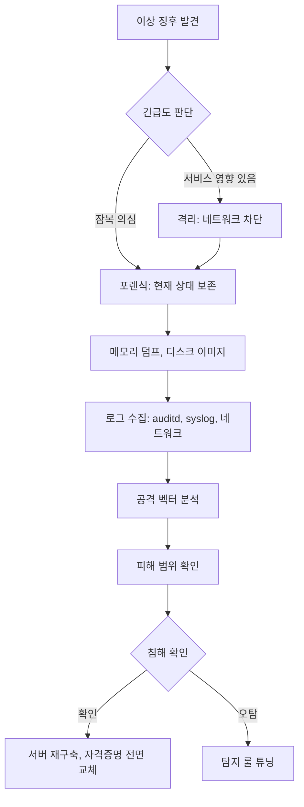

# 서버 취약점 공격 방어

퍼블릭 IP 하나만 열려 있으면 공격은 자동으로 들어온다. AWS나 GCP에 인스턴스를 띄우고 10분 정도만 놔둬도 SSH 22번 포트로 초당 수십 건의 브루트포스 시도가 쌓이기 시작한다. 봇넷이 IP 대역을 통째로 스캔하면서 취약한 호스트를 찾고 있기 때문이다. 서버 취약점 공격은 대부분 특정 회사를 노린 것이 아니라 자동화된 대량 공격이다. 방어도 자동화된 기본기가 잘 깔려 있어야 막힌다.

이 문서는 웹 애플리케이션 레벨(XSS, SQL Injection)이나 컨테이너 레벨이 아니라, 서버 인프라 자체에 대한 공격과 방어를 다룬다. OS, 네트워크, 프로세스, 로그 레벨에서의 하드닝이 주제다.

---

## 공격 유형별 실무 사례

### 포트 스캔

포트 스캔은 공격의 출발점이다. `nmap`이나 `masscan` 같은 툴로 서버의 열린 포트를 조사해서 어떤 서비스가 돌아가는지 파악한다. 공격자는 포트 스캔 결과에서 오래된 MySQL 3306, Redis 6379, Elasticsearch 9200 같은 포트가 열려 있으면 바로 공격을 시도한다.

실제로 겪은 사례: 개발자가 디버깅하려고 Redis 포트를 임시로 0.0.0.0으로 열어뒀다가 다음 날 `flushall`로 전체 데이터가 날아가고 암호화폐 채굴기가 설치된 경우가 있다. Redis는 기본 인증이 없고, `config set dir /root/.ssh/ && config set dbfilename authorized_keys` 같은 명령으로 공격자 공개키를 authorized_keys에 써넣을 수 있다.

포트 스캔 자체는 막을 수 없다. 대신 노출되는 포트를 최소화하고, 스캔 시도를 로깅해서 이상 징후를 탐지한다.

```bash
# 현재 열린 포트 확인
ss -tlnp

# 외부에서 보이는 포트 확인 (nmap 역할)
nmap -sT -p- localhost

# 포트 스캔 탐지 룰 (psad 사용)
apt install psad
# /etc/psad/psad.conf에서 DANGER_LEVEL과 EMAIL_ALERT 설정
```

실무에서 포트 스캔에 대응할 때 가장 먼저 해야 할 일은 보안 그룹(AWS SG, GCP 방화벽 규칙)에서 화이트리스트 기반으로 인바운드를 제한하는 것이다. 호스트 내부의 iptables는 2차 방어선이다.

### SSH 브루트포스

SSH 22번 포트를 열어두면 즉시 `root/123456`, `admin/admin`, `ubuntu/ubuntu` 같은 사전 공격이 들어온다. `/var/log/auth.log`를 보면 초당 수십 건의 `Failed password` 로그가 쌓인다. 계정 잠금 정책이 없으면 언젠가는 뚫린다.

```bash
# 브루트포스 시도 로그 확인
grep "Failed password" /var/log/auth.log | awk '{print $(NF-3)}' | sort | uniq -c | sort -rn | head

# 결과 예시 — 특정 IP에서 수천 번 시도
#   3421 61.177.173.45
#   2156 222.186.180.17
#   1893 45.227.255.4
```

실제로 본 사례: 스테이징 서버가 약한 패스워드(`dev123`)를 사용하고 있었는데, 브루트포스로 뚫린 뒤 공격자가 AWS 자격증명 환경변수를 덤프해서 그 계정으로 EC2 인스턴스 100개를 채굴용으로 띄운 일이 있었다. AWS 청구서로 2,000달러 날아가고 끝났다. 브루트포스는 패스워드 인증을 아예 끄지 않는 한 계속 시도된다.

### DDoS와 SYN Flood

DDoS는 여러 층위가 있다. L3/L4 볼륨 공격(대역폭 고갈)은 ISP나 클라우드 프로바이더 레벨에서 막아야 하고 서버 단에서는 대응이 불가능하다. 서버에서 막을 수 있는 건 L7 애플리케이션 계층 공격과 SYN flood 정도다.

SYN flood는 TCP 3-way handshake를 악용한다. 공격자가 SYN만 보내고 ACK는 보내지 않으면, 서버는 half-open 연결을 유지하느라 메모리와 연결 테이블을 소모한다. 기본 설정으로는 수천 개의 SYN만으로도 정상 접속이 막힌다.

```bash
# 현재 SYN_RECV 상태 연결 수 확인 — SYN flood 의심
ss -tan state syn-recv | wc -l

# conntrack 테이블 사용률 확인
cat /proc/sys/net/netfilter/nf_conntrack_count
cat /proc/sys/net/netfilter/nf_conntrack_max
```

실제로 겪은 사례: 이벤트 페이지가 트위터에서 화제가 된 직후 정상 트래픽인 줄 알았는데, Cloudflare 뒤에 있지 않은 API 서버가 SYN flood에 가까운 커넥션을 받아서 conntrack 테이블이 가득 차고 모든 신규 연결이 거부된 적이 있다. 커널 파라미터 조정으로 복구했다.

### 서비스 배너 노출

서비스가 버전 정보를 응답 헤더나 초기 배너에 그대로 노출하면, 공격자는 해당 버전의 알려진 CVE를 바로 찾아서 익스플로잇한다.

```bash
# nginx 버전 노출 확인
curl -I http://example.com
# Server: nginx/1.18.0  ← 이런 식으로 버전이 드러나면 위험

# SSH 배너 확인
nc example.com 22
# SSH-2.0-OpenSSH_7.6p1 Ubuntu-4ubuntu0.3  ← Ubuntu 18.04 쓰는 거 다 보임
```

SSH_7.6p1은 CVE-2018-15473 같은 사용자 열거 취약점이 있다. 버전 정보만으로도 공격 벡터가 좁혀진다. nginx는 `server_tokens off;`로, SSH는 `DebianBanner no`나 배너 파일 수정으로 노출을 줄일 수 있지만, 근본적인 해결은 최신 버전 유지다.

### 알려진 CVE 익스플로잇

공격자는 새로운 CVE가 공개되면 즉시 대량 스캔을 시작한다. 2021년 log4shell(CVE-2021-44228)이 터졌을 때 공개 24시간 안에 인터넷 전체가 스캔됐다. 패치되지 않은 서버는 거의 예외 없이 뚫렸다.

CVE 익스플로잇은 두 가지 관점에서 막는다. 하나는 패치를 빠르게 적용하는 것이고, 다른 하나는 익스플로잇 페이로드가 서버에 도달하기 전에 차단하는 것이다(WAF/IPS). 패치만으로는 한계가 있다. 커널이나 시스템 라이브러리 패치는 재부팅이 필요하고, 운영 중인 서비스를 재부팅하려면 조율이 필요해서 실제 패치 적용까지 며칠에서 몇 주가 걸린다.

---

## 방화벽 구성

### iptables와 ufw

iptables는 리눅스 커널의 netfilter 프레임워크를 제어하는 툴이다. 문법이 복잡해서 ufw(Uncomplicated Firewall) 같은 래퍼를 쓰는 경우가 많다. 내부 동작은 같다.

```bash
# ufw 기본 정책 — 인바운드 차단, 아웃바운드 허용
ufw default deny incoming
ufw default allow outgoing

# 필요한 포트만 허용
ufw allow 22/tcp     # SSH
ufw allow 80/tcp     # HTTP
ufw allow 443/tcp    # HTTPS

# 특정 IP만 SSH 허용 — 사무실 IP 대역으로 제한
ufw allow from 203.0.113.0/24 to any port 22

# rate limiting — 분당 6회 이상 연결 시도 시 차단
ufw limit 22/tcp

ufw enable
```

`ufw limit`은 내부적으로 iptables의 `recent` 모듈을 써서, 30초 안에 6회 이상 같은 IP에서 접속 시도가 있으면 차단한다. 이것만으로도 단순 브루트포스의 상당수는 걸러진다. 다만 여러 IP에서 분산 공격이 들어오면 효과가 없다.

iptables 직접 사용 예시도 알아둬야 한다. 컨테이너 환경이나 스크립트로 룰을 자동화할 때 ufw보다 세밀한 제어가 필요하다.

```bash
# SYN flood 완화 — SYN 패킷 초당 1개로 제한, 버스트 3까지 허용
iptables -A INPUT -p tcp --syn -m limit --limit 1/s --limit-burst 3 -j ACCEPT

# 비정상 패킷 드롭 — 잘못된 플래그 조합
iptables -A INPUT -p tcp ! --syn -m state --state NEW -j DROP
iptables -A INPUT -p tcp --tcp-flags ALL NONE -j DROP
iptables -A INPUT -p tcp --tcp-flags ALL ALL -j DROP

# 포트 스캔 탐지 — 같은 IP가 여러 포트에 연결 시도
iptables -A INPUT -m recent --name portscan --rcheck --seconds 86400 -j DROP
iptables -A INPUT -p tcp -m multiport --dports 23,25,135,139,445,1433,3306,3389 -m recent --name portscan --set -j DROP
```

iptables 룰은 순서가 중요하다. 먼저 매칭된 룰이 적용되기 때문에, 특정 IP 허용 같은 세부 룰을 위에 두고, 전체 차단 룰은 아래에 둔다. 룰이 100개 넘어가면 nftables로 옮기는 것도 고려한다. nftables는 iptables의 후속으로, 룰 조회 성능이 훨씬 낫다.

### 상태 추적(stateful) 방화벽

conntrack은 커널이 연결 상태를 추적하는 모듈이다. 방화벽 룰에서 `ESTABLISHED,RELATED` 상태의 패킷을 허용하면, 이미 내부에서 시작한 연결의 응답 패킷은 별도 룰 없이 통과된다. 이걸 활용해서 아웃바운드만 시작 가능하게 만들 수 있다.

```bash
# 응답 트래픽 허용
iptables -A INPUT -m state --state ESTABLISHED,RELATED -j ACCEPT

# 이후 신규 인바운드는 명시적으로 허용된 포트만
```

문제는 conntrack 테이블이 가득 차면 신규 연결이 모두 거부된다는 점이다. 트래픽 많은 서버는 기본값 65,536으로는 부족하다.

```bash
# conntrack 테이블 크기 확인
sysctl net.netfilter.nf_conntrack_max

# 부족하면 증가
sysctl -w net.netfilter.nf_conntrack_max=524288

# /etc/sysctl.conf에 영구 반영
echo "net.netfilter.nf_conntrack_max = 524288" >> /etc/sysctl.conf
```

---

## fail2ban

fail2ban은 로그를 감시해서 공격 패턴이 보이면 iptables 룰로 해당 IP를 차단하는 툴이다. SSH 브루트포스뿐 아니라 nginx, postfix, vsftpd 등 로그가 있는 서비스라면 대부분 적용할 수 있다.

### 기본 동작 원리

fail2ban은 세 가지 요소로 동작한다. filter(로그 패턴 매칭), jail(어떤 로그를 감시하고 몇 번 매칭되면 어떻게 대응할지), action(어떤 조치를 취할지). 기본 action은 iptables에 DROP 룰을 추가하는 것이다.

```ini
# /etc/fail2ban/jail.d/sshd.conf
[sshd]
enabled = true
port = 22
filter = sshd
logpath = /var/log/auth.log
maxretry = 3        # 3회 실패 시
findtime = 600      # 10분 이내에
bantime = 3600      # 1시간 차단
ignoreip = 127.0.0.1/8 203.0.113.0/24  # 사무실 IP는 제외
```

`maxretry=3`, `findtime=600`이면 10분 안에 3번 실패한 IP를 차단한다는 뜻이다. `bantime=-1`로 설정하면 영구 차단이 된다.

### recidive jail — 반복 차단자

fail2ban의 기본 jail은 일시적으로 차단한다. 차단 시간이 풀리면 같은 IP가 다시 공격을 시도하고, 다시 차단되는 사이클이 반복된다. recidive jail은 fail2ban 자체의 로그를 감시해서, 여러 번 차단된 IP를 더 오래 차단한다.

```ini
# /etc/fail2ban/jail.d/recidive.conf
[recidive]
enabled = true
filter = recidive
logpath = /var/log/fail2ban.log
bantime = 604800    # 1주일
findtime = 86400    # 하루 동안
maxretry = 3        # 3번 차단된 IP는
action = iptables-allports[name=recidive]
```

실무에서 fail2ban을 운영하다 보면 차단된 IP가 수천 개까지 늘어난다. iptables 룰이 너무 많아지면 성능 저하가 생기므로, ipset을 활용하는 action을 쓰는 것이 좋다. ipset은 해시 기반이라서 룰이 10만 개여도 O(1)에 조회된다.

```bash
# ipset 기반 action 사용 — fail2ban.conf
banaction = iptables-ipset-proto6-allports
```

### 오탐 이슈

fail2ban을 운영하다 보면 오탐으로 정상 사용자가 차단되는 일이 생긴다. 가장 흔한 케이스는 회사 전체가 NAT 뒤에 있어서 같은 외부 IP로 나오는 경우다. 누군가 SSH 비밀번호를 몇 번 틀리면 회사 전체가 차단된다.

대응 방법:

- `ignoreip`에 회사 IP 대역 추가
- maxretry를 서비스별로 조정 — 공개 서비스는 엄격하게, 내부용은 느슨하게
- 차단 전 알림 단계 추가 — 첫 감지는 경고만, 두 번째부터 차단
- 차단 해제 명령어를 팀에 공유 — `fail2ban-client set sshd unbanip 1.2.3.4`

---

## SSH 하드닝

SSH 키 관리는 별도 문서에서 다루므로, 여기서는 서버 측 sshd 설정 하드닝에 집중한다.

### 핵심 sshd_config 설정

```
# /etc/ssh/sshd_config
Port 2222                       # 기본 22 대신 임의 포트 사용
PermitRootLogin no              # root 직접 로그인 금지
PasswordAuthentication no       # 패스워드 인증 비활성화
PubkeyAuthentication yes        # 공개키 인증만 허용
PermitEmptyPasswords no         # 빈 패스워드 금지
ChallengeResponseAuthentication no
UsePAM yes

# 접속 가능한 사용자/그룹 화이트리스트
AllowUsers deploy admin
AllowGroups sshusers

# 동시 연결 제한
MaxAuthTries 3
MaxSessions 5
LoginGraceTime 30

# 유휴 세션 종료
ClientAliveInterval 300
ClientAliveCountMax 2

# 호스트키 알고리즘 — 오래된 알고리즘 제외
HostKeyAlgorithms ssh-ed25519,rsa-sha2-512,rsa-sha2-256
KexAlgorithms curve25519-sha256,curve25519-sha256@libssh.org
Ciphers chacha20-poly1305@openssh.com,aes256-gcm@openssh.com
MACs hmac-sha2-512-etm@openssh.com,hmac-sha2-256-etm@openssh.com

# 배너 최소화
DebianBanner no
```

### Port 변경에 대한 오해

SSH 포트를 22에서 2222로 바꾸는 것만으로 보안이 올라가지는 않는다. 이는 "security through obscurity"에 불과하고, `masscan`으로 전체 포트 스캔하면 금방 찾아진다. 다만 22번에 쏟아지는 무차별 브루트포스 로그는 줄어들어서, `auth.log`에서 의미 있는 공격 시도를 찾기 쉬워진다. 로그 노이즈를 줄이는 용도로는 유용하다.

더 중요한 것은 패스워드 인증을 완전히 비활성화하는 것이다. `PasswordAuthentication no`와 `ChallengeResponseAuthentication no`를 둘 다 설정해야 한다. 하나만 꺼두면 다른 쪽으로 우회될 수 있다.

### PermitRootLogin

`PermitRootLogin no`가 기본이지만, `prohibit-password`라는 옵션도 있다. 이건 키 기반 인증으로는 root 로그인을 허용하는 설정이다. 자동화 스크립트에서 root 접근이 필요한 경우에 쓰지만, 가급적 일반 사용자로 접속한 뒤 sudo로 전환하는 방식이 감사 로그 측면에서 낫다. 누가 root로 무엇을 했는지 추적하려면 root 직접 로그인은 꺼야 한다.

### 2FA 추가

SSH에 TOTP 기반 2FA를 추가하려면 `libpam-google-authenticator`를 쓴다. 키 파일 유출 시 추가 방어선이 된다.

```bash
apt install libpam-google-authenticator
google-authenticator  # 사용자별로 실행, QR 코드로 앱에 등록

# /etc/pam.d/sshd 맨 위에 추가
# auth required pam_google_authenticator.so

# /etc/ssh/sshd_config
# ChallengeResponseAuthentication yes
# AuthenticationMethods publickey,keyboard-interactive
```

`AuthenticationMethods publickey,keyboard-interactive`는 키 + OTP 둘 다 통과해야 접속 가능하다는 의미다. 하나만 뚫려서는 들어올 수 없다.

---

## sysctl 커널 파라미터 튜닝

커널 레벨에서 네트워크 공격에 대한 방어선을 설정한다. `/etc/sysctl.conf`나 `/etc/sysctl.d/`에 파일을 만들어 반영한다.

### SYN flood 대응

```
# SYN cookies 활성화 — SYN flood 공격 완화
net.ipv4.tcp_syncookies = 1

# SYN backlog 크기 증가
net.ipv4.tcp_max_syn_backlog = 4096

# SYN-ACK 재전송 횟수 감소 — 기본 5, half-open 연결을 빨리 정리
net.ipv4.tcp_synack_retries = 2

# TIME_WAIT 재사용
net.ipv4.tcp_tw_reuse = 1
```

SYN cookies는 SYN flood 공격 시 커널이 상태를 저장하지 않고 쿠키를 응답으로 보내는 기법이다. 쿠키가 다시 돌아오면 그때 실제 연결을 만든다. 정상 환경에서는 기본 3-way handshake가 동작하고, SYN backlog가 가득 찼을 때만 쿠키 모드로 폴백한다.

### ICMP 관련

```
# ICMP redirect 무시 — MITM 공격 벡터
net.ipv4.conf.all.accept_redirects = 0
net.ipv4.conf.default.accept_redirects = 0

# Source routing 비활성화
net.ipv4.conf.all.accept_source_route = 0
net.ipv4.conf.default.accept_source_route = 0

# ICMP broadcast 응답 차단 — Smurf 공격 방어
net.ipv4.icmp_echo_ignore_broadcasts = 1

# 잘못된 ICMP 응답 무시
net.ipv4.icmp_ignore_bogus_error_responses = 1

# Reverse path filtering — 스푸핑된 패킷 드롭
net.ipv4.conf.all.rp_filter = 1
net.ipv4.conf.default.rp_filter = 1
```

### IP spoofing과 로깅

```
# 스푸핑된 패킷 로그 기록
net.ipv4.conf.all.log_martians = 1

# IP forwarding 비활성화 — 라우터/게이트웨이가 아니라면
net.ipv4.ip_forward = 0

# 커널 포인터 노출 제한
kernel.kptr_restrict = 2
kernel.dmesg_restrict = 1
```

### 적용과 검증

```bash
# 설정 반영
sysctl -p /etc/sysctl.d/99-hardening.conf

# 현재 값 확인
sysctl net.ipv4.tcp_syncookies
```

주의: `tcp_tw_recycle`은 커널 4.12부터 제거됐다. 오래된 가이드에서 이걸 추천하면 무시해야 한다. NAT 환경에서 문제를 일으킨다.

---

## 불필요한 서비스 비활성화

공격 표면을 줄이는 가장 확실한 방법은 쓰지 않는 서비스를 아예 없애는 것이다. Ubuntu 서버 기본 설치에도 `cups-browsed`, `avahi-daemon`, `snapd` 같은 데스크톱 용도 서비스가 켜져 있는 경우가 있다.

```bash
# 현재 돌아가는 서비스 목록
systemctl list-unit-files --type=service --state=enabled

# 리스닝 중인 프로세스 확인
ss -tlnp

# 불필요한 서비스 비활성화
systemctl disable --now cups
systemctl disable --now avahi-daemon
systemctl disable --now bluetooth
```

리스닝 포트를 기준으로 점검하는 것이 확실하다. `ss -tlnp` 결과에서 의도하지 않은 포트가 열려 있다면 그 프로세스가 왜 돌아가는지 파악해야 한다. 설치할 때 의존성으로 딸려온 서비스일 수도 있고, 침해의 흔적일 수도 있다.

실제 사례: Elasticsearch를 설치하면서 x-pack이 기본으로 포함됐는데 9300번 transport 포트가 외부에 열려 있던 경우가 있다. HTTP는 9200에 인증 걸어뒀지만 transport 포트로 클러스터 조인이 시도됐다. 리스닝 포트 전수조사를 하지 않으면 발견하기 어렵다.

---

## 자동 패키지 업데이트

패치가 느려지는 이유의 대부분은 "언젠가 해야지"가 미뤄지기 때문이다. 보안 패치만이라도 자동 적용하면 CVE 노출 시간이 크게 줄어든다. Debian/Ubuntu 계열은 `unattended-upgrades`를 쓴다.

```bash
apt install unattended-upgrades
dpkg-reconfigure --priority=low unattended-upgrades
```

설정 파일 `/etc/apt/apt.conf.d/50unattended-upgrades`:

```
Unattended-Upgrade::Allowed-Origins {
    "${distro_id}:${distro_codename}-security";
    // "${distro_id}:${distro_codename}-updates";  // 일반 업데이트도 원하면 주석 해제
};

Unattended-Upgrade::Package-Blacklist {
    "mysql-server";  // DB처럼 재시작 민감한 것은 제외
    "nginx";
};

Unattended-Upgrade::Automatic-Reboot "true";
Unattended-Upgrade::Automatic-Reboot-Time "04:00";
Unattended-Upgrade::Mail "ops@example.com";
Unattended-Upgrade::MailReport "on-change";
```

`Allowed-Origins`에서 security 저장소만 허용하면 보안 패치만 받는다. DB나 웹서버처럼 재시작하면 서비스 중단이 생기는 패키지는 블랙리스트에 넣고 수동으로 관리한다.

주의할 점: 자동 재부팅은 저녁/새벽 시간에만 돌아가도록 설정하고, 클러스터 환경에서는 절대 모든 노드가 동시에 재부팅되지 않도록 노드마다 시간을 분산시켜야 한다. 실제로 Ansible로 동일한 unattended-upgrades 설정을 배포했다가 모든 노드가 새벽 4시에 동시 재부팅되면서 5분간 서비스가 내려간 적이 있다.

RHEL/CentOS 계열은 `dnf-automatic`을 쓴다. 설정은 비슷한 개념이다.

---

## 루트킷 탐지

루트킷은 공격자가 침투한 뒤 장기적으로 숨어있기 위해 설치하는 악성 소프트웨어다. 커널 모듈 형태로 시스템 콜을 후킹해서 `ps`, `ls`, `netstat` 같은 명령에서 자기 프로세스와 파일을 숨긴다. 일반 모니터링으로는 탐지가 어렵다.

### rkhunter

rkhunter는 알려진 루트킷의 시그니처와 시스템 파일 변조를 검사한다.

```bash
apt install rkhunter

# 시스템 파일 기준선 생성 — 최초 1회
rkhunter --propupd

# 검사 실행
rkhunter --check --skip-keypress

# cron으로 일 1회 실행, 이상 시 메일
# /etc/cron.daily/rkhunter
```

### chkrootkit

chkrootkit은 rkhunter와 비슷하지만 검사 방식이 다르다. 두 툴을 같이 쓰면 상호 검증이 된다.

```bash
apt install chkrootkit
chkrootkit -q    # quiet 모드, 문제 있는 것만 출력
```

### 오탐과 한계

루트킷 탐지 툴은 오탐이 많다. rkhunter는 SSH 설정에서 `AllowRootLogin` 관련 경고를 계속 띄우거나, 정상적으로 설치된 패키지를 의심스러운 파일로 마킹하는 경우가 있다. 처음 도입할 때 한 번 전체 훑어보고 화이트리스트를 정리해야 운영 가능한 수준이 된다.

그리고 루트킷 탐지는 사후 대응 성격이 강하다. 이미 침투가 일어난 뒤에 발견하는 것이다. 침투 자체를 막는 것이 훨씬 중요하다. 또한 커널 자체에 심어진 루트킷은 해당 커널로 부팅된 상태에서는 탐지하기 거의 불가능하다. 의심스러우면 라이브 USB로 부팅해서 오프라인 분석하거나, 이미지를 떠서 다른 시스템에서 검사해야 한다.

---

## auditd 로그 감사

auditd는 리눅스 커널의 감사 서브시스템 프론트엔드다. 시스템 콜 레벨에서 누가 어떤 파일에 접근하고, 어떤 명령을 실행했는지 기록한다. 침해 사고 분석과 규제 대응(PCI-DSS, HIPAA)에서 핵심이 되는 도구다.

```bash
apt install auditd

# 규칙 파일: /etc/audit/rules.d/audit.rules

# 민감한 파일 변경 감시
-w /etc/passwd -p wa -k identity
-w /etc/shadow -p wa -k identity
-w /etc/sudoers -p wa -k identity
-w /etc/sudoers.d/ -p wa -k identity

# SSH 설정 변경
-w /etc/ssh/sshd_config -p wa -k sshd

# 사용자별 명령 실행 추적
-a always,exit -F arch=b64 -S execve -F uid>=1000 -F auid!=unset -k user_commands

# 권한 상승 추적
-a always,exit -F arch=b64 -S setuid -S setgid -k privilege_escalation

# 규칙 적용
augenrules --load
```

로그 조회:

```bash
# sshd_config 변경 기록
ausearch -k sshd

# 특정 사용자 활동
ausearch -ua deploy | aureport -x

# 특정 IP에서의 활동
aureport --summary
```

### 운영상 주의사항

auditd는 로그 볼륨이 어마어마하다. `execve` 시스템 콜을 모두 기록하면 하루에 수 GB가 쌓이는 서버도 있다. 디스크 용량이 부족해지면 `-f 2` 옵션이 기본일 때 시스템이 panic 상태가 될 수 있다. 프로덕션에서는 `max_log_file_action = rotate`와 적절한 rotate 설정이 필수다.

그리고 auditd 로그는 로컬에만 남기면 공격자가 지울 수 있다. syslog나 Wazuh/Graylog 같은 중앙 로그 서버로 실시간 전송해야 의미가 있다. 침해 사고가 나면 가장 먼저 지우는 것이 로그다.

---

## HIDS — OSSEC과 Wazuh

HIDS(Host-based Intrusion Detection System)는 호스트 내부에서 로그, 파일 무결성, 프로세스를 모니터링하는 도구다. 네트워크 기반 IDS가 외부 트래픽을 감시하는 반면, HIDS는 호스트 내부 상태 변화를 본다.

### OSSEC과 Wazuh 관계

OSSEC은 오픈소스 HIDS의 원조격이다. Wazuh는 OSSEC에서 포크된 프로젝트로, ELK 스택과 통합된 대시보드와 더 활발한 커뮤니티를 갖고 있다. 현재 실무에서는 Wazuh 쪽이 더 많이 쓰인다.

### Wazuh 주요 기능

- **로그 분석**: 다양한 로그를 파싱해서 공격 시그니처 매칭
- **파일 무결성 모니터링(FIM)**: `/etc`, `/bin` 등의 파일 해시를 주기적으로 계산해서 변조 탐지
- **루트킷 탐지**: rkhunter와 비슷한 기능 내장
- **취약한 패키지 탐지**: 설치된 패키지의 버전을 NVD와 비교
- **MITRE ATT&CK 매핑**: 탐지된 이벤트를 ATT&CK 프레임워크에 매핑

```yaml
# Wazuh 에이전트 설정 예시 — /var/ossec/etc/ossec.conf 일부
<syscheck>
  <frequency>43200</frequency>
  <directories check_all="yes" realtime="yes">/etc,/usr/bin,/usr/sbin</directories>
  <directories check_all="yes" realtime="yes">/bin,/sbin</directories>
  <nodiff>/etc/ssl/private</nodiff>
  <ignore>/etc/mtab</ignore>
  <ignore>/etc/hosts.deny</ignore>
  <ignore>/etc/mail/statistics</ignore>
</syscheck>
```

### 실무 배치 구조

에이전트는 모든 서버에 설치하고, 매니저 서버(중앙)에서 이벤트를 수집한다. 매니저는 보통 전용 서버에 두고, Kibana 대시보드를 통해 보안팀이 모니터링한다. 규모가 커지면 매니저 클러스터링이 필요하다.

에이전트 하나당 매니저 CPU를 약간씩 소모한다. 1,000대 이상의 대규모 환경에서는 에이전트가 보내는 이벤트를 필터링해서 중요한 것만 매니저로 보내도록 에이전트 설정을 최적화해야 한다. 모든 로그 라인을 다 올리면 매니저가 먼저 죽는다.

---

## 취약점 스캐너

취약점 스캐너는 서버를 외부에서 스캔해서 알려진 CVE에 해당하는 서비스가 노출돼 있는지 점검하는 도구다. 주기적으로 돌려서 패치 누락이나 설정 오류를 찾는다.

### Nessus vs OpenVAS

- **Nessus**: Tenable의 상용 제품. Nessus Professional은 연 3,000달러 정도. 스캔 정확도와 리포트 품질이 업계 표준이다. 컴플라이언스 스캔(PCI-DSS, CIS 벤치마크) 템플릿이 잘 갖춰져 있다.
- **OpenVAS (Greenbone)**: 오픈소스. NVT(Network Vulnerability Tests)라는 자체 플러그인을 쓴다. 탐지 범위는 Nessus보다 좁지만 무료라서 많이 쓰인다.

### 스캔 유형

- **외부 스캔**: 인터넷에서 보이는 관점으로 스캔. 방화벽, 노출 서비스, SSL 설정 점검
- **인증 스캔(credentialed scan)**: 서버에 SSH나 WinRM으로 로그인해서 내부까지 점검. 설치된 패키지 버전, 설정 파일, 커널 버전 등 상세 정보 수집. 외부 스캔보다 정확도가 훨씬 높다.

### 오탐과 운영

취약점 스캐너는 오탐이 흔하다. 예를 들어 Apache 2.4.41에 CVE-2021-XXXX가 있다고 뜨지만, 실제로는 Ubuntu가 백포트 패치를 적용해서 이미 수정된 경우가 있다. 배포판이 관리하는 패키지는 버전 문자열만 보면 취약해 보여도 내부적으로 패치된 경우가 많다.

스캔 결과는 그대로 받아들이지 말고, CVSS 점수와 실제 exploitability(이 서버가 실제로 공격자에게 노출되는가, 공격이 가능한가)를 고려해서 우선순위를 매겨야 한다. 모든 "high" 항목을 해결하려고 하다 보면 운영이 마비된다.

스캔 부하에도 주의해야 한다. credentialed scan은 서버에 SSH로 접속해서 수백 개의 명령을 실행한다. 피크 타임에 돌리면 영향이 있을 수 있다. 저녁 시간대에 스케줄링하는 것이 일반적이다.

---

## WAF / IDS / IPS 배치

### 각 도구의 역할

- **WAF (Web Application Firewall)**: L7 레이어, 주로 HTTP/HTTPS 트래픽을 검사. SQL injection, XSS, path traversal 같은 웹 공격 패턴을 차단한다. ModSecurity, Cloudflare WAF, AWS WAF가 대표적이다.
- **IDS (Intrusion Detection System)**: 네트워크 또는 호스트 레벨에서 공격 시그니처를 탐지. 감지만 하고 차단은 하지 않는다. Snort, Suricata가 대표적 NIDS.
- **IPS (Intrusion Prevention System)**: IDS + 차단 기능. 탐지된 공격을 실시간으로 드롭한다.

### 배치 전략

전형적인 구조는 다음과 같다:

```
인터넷 
  → CDN/DDoS 방어(Cloudflare, AWS Shield)
  → WAF (L7)
  → Load Balancer
  → IDS/IPS (L3-L7)
  → 웹 서버 / API 서버
  → 내부망 (HIDS 설치)
```

각 계층마다 역할이 다르다. CDN은 L3/L4 볼륨 공격을 막고, WAF는 L7 애플리케이션 공격을 막고, IDS/IPS는 광범위한 네트워크 공격을 탐지하고, HIDS는 호스트 내부 이상 행위를 감시한다.

### ModSecurity — 오픈소스 WAF

nginx나 Apache에 ModSecurity 모듈로 얹는다. OWASP Core Rule Set(CRS)을 적용하면 일반적인 웹 공격 패턴이 대부분 커버된다.

```nginx
# nginx with ModSecurity
load_module modules/ngx_http_modsecurity_module.so;

http {
    modsecurity on;
    modsecurity_rules_file /etc/nginx/modsec/main.conf;
}
```

ModSecurity CRS는 paranoia level 1~4가 있다. 1은 확실한 공격만 차단, 4는 의심만 돼도 차단한다. 프로덕션에서는 보통 1 또는 2에서 시작해서, 오탐을 화이트리스트로 정리하면서 수준을 높인다. 처음부터 paranoia 4를 켜면 정상 요청까지 막혀서 서비스가 망가진다.

### Suricata — IDS/IPS

Suricata는 멀티스레드 기반 오픈소스 NIDS/NIPS다. Snort 룰 포맷과 호환된다.

```
# /etc/suricata/suricata.yaml 일부
af-packet:
  - interface: eth0
    threads: 4
    cluster-id: 99
    cluster-type: cluster_flow
    defrag: yes
```

룰셋은 Emerging Threats(ET Open)가 무료로 제공된다. 주간 업데이트를 받아서 최신 공격 시그니처에 대응한다. `suricata-update` 명령으로 자동화할 수 있다.

### 오탐과 성능 저하

WAF/IDS 도입 시 현실적인 이슈:

- **오탐 폭풍**: 처음 켜면 수천 건의 알림이 쏟아진다. 진짜 공격과 정상 요청의 오탐을 구분하려면 일주일 이상 로그를 분석하면서 룰을 튜닝해야 한다. 이 기간 없이 바로 차단 모드(IPS)로 돌리면 서비스 장애가 난다.
- **성능 저하**: L7 검사는 CPU를 많이 쓴다. ModSecurity를 켜면 응답 시간이 10~30% 늘어날 수 있다. Suricata도 10Gbps 이상 트래픽에서는 튜닝이 필요하다.
- **SSL 검사의 딜레마**: 암호화된 트래픽은 WAF/IDS가 검사할 수 없다. SSL termination을 WAF 앞에서 하거나, TLS 트래픽 복호화를 지원하는 솔루션이 필요한데 비용과 복잡도가 올라간다.

실무에서는 "detection only" 모드로 먼저 운영해서 오탐을 모두 정리한 뒤, 블로킹 모드로 전환하는 것이 일반적이다. 급한 환경에서는 차단 리스트를 상위 N개 공격 패턴만으로 좁히고 점진적으로 확대한다.

---

## 침해 의심 시 초기 대응

하드닝과 탐지를 잘 했어도 결국 뚫릴 수 있다. 의심 정황이 생겼을 때 초기 대응 절차를 정리해둔다.



가장 중요한 두 가지:

1. **즉시 재부팅하지 않는다**: 메모리에 있는 악성 프로세스와 네트워크 연결 정보가 다 날아간다. 포렌식 관점에서 치명적이다. 먼저 `ps auxf`, `netstat -anp`, `/proc/*/exe` 정보를 수집하고, 필요하면 `LiME` 같은 도구로 메모리를 덤프한다.
2. **침해된 서버는 수리하지 않는다**: 루트킷이나 백도어가 어디에 심어졌는지 완벽히 추적하기 어렵다. 데이터만 건지고 서버는 새로 구축하는 것이 안전하다. 공격자가 남긴 SSH 키, cron 작업, systemd 유닛, 커널 모듈이 한두 개가 아닐 수 있다.

그리고 해당 서버에서 접근 가능했던 자격증명(AWS 키, DB 패스워드, API 토큰)은 모두 폐기하고 재발급한다. 서버가 뚫린 시점에 공격자가 환경변수를 덤프했다고 가정해야 한다.

---

## 정리

서버 공격 방어는 하나의 은탄환이 아니라 여러 계층의 방어선을 쌓는 것이다. 각 계층이 완벽하지 않아도, 여러 계층이 겹쳐 있으면 공격자가 뚫기 어려워진다.

- **네트워크 계층**: 클라우드 SG/방화벽 → 호스트 iptables → fail2ban
- **서비스 계층**: 불필요한 서비스 제거 → 서비스별 하드닝 → SSH 2FA
- **커널 계층**: sysctl 튜닝 → auditd → 최신 패치 유지
- **탐지 계층**: 취약점 스캐너(예방) → HIDS/NIDS(실시간) → 루트킷 탐지(사후)
- **대응 계층**: 로그 중앙 집중 → 침해 대응 절차 문서화 → 정기 훈련

완벽한 하드닝을 한 번에 하려고 하면 실패한다. 가장 리스크가 큰 것부터(SSH 브루트포스, 공개된 관리 포트, 오래된 패키지) 하나씩 처리하고, 탐지 체계를 붙이고, 자동화로 확장하는 순서가 현실적이다.
