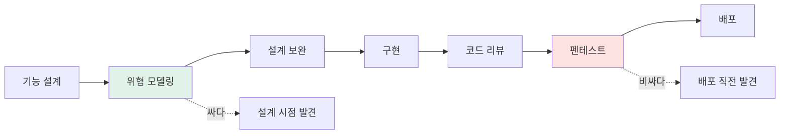
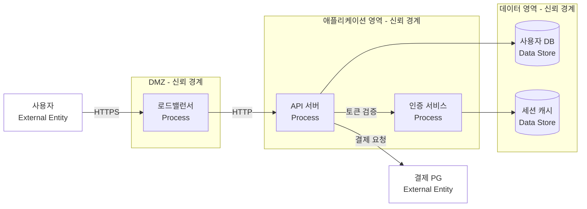
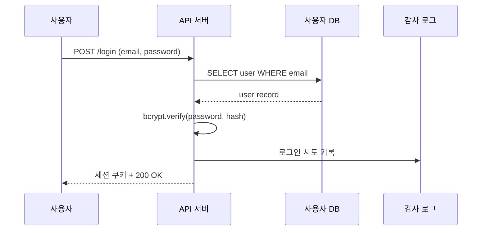
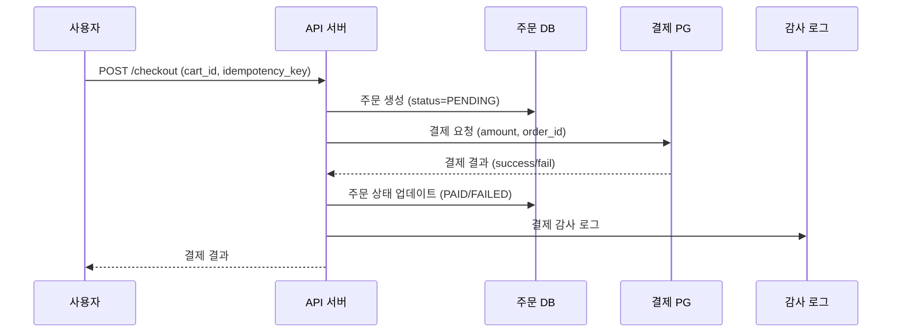

# 위협 모델링

설계 단계에서 "여기서 뭐가 잘못될 수 있을까"를 미리 따져보는 작업이다. 코드를 다 짜고 나서 펜테스트로 구멍을 찾는 것보다 훨씬 싸게 먹힌다. 실무에서 위협 모델링은 거창한 보안 회의가 아니라, 신규 기능 설계 회의에 30분 추가하는 정도로 시작한다.

처음 시작할 때 가장 많이 하는 실수가 "모든 위협을 다 찾자"는 욕심이다. 그러면 끝이 안 난다. STRIDE 같은 프레임워크를 쓰는 이유도 위협을 카테고리로 좁혀서, 빠짐없이 보되 한 번에 한 카테고리만 보기 위함이다.

## 왜 위협 모델링이 필요한가

펜테스트나 보안 점검은 이미 만들어진 시스템의 구멍을 찾는 작업이다. 발견된 취약점을 고치려면 코드뿐 아니라 설계까지 바꿔야 하는 경우가 많은데, 이 시점에 와서는 일정이 안 나온다. 결제 흐름에서 idempotency key를 빠뜨렸다는 사실을 출시 후에 알게 되면, 이미 이중 결제가 발생한 사용자에게 환불을 해야 하고 데이터 정합성도 깨진 상태다.

위협 모델링은 설계 시점에 한다. "사용자가 비밀번호를 잊었을 때 이메일로 재설정 링크를 보낸다"는 흐름을 그리면서, "이 링크가 가로채지면? 토큰이 추측되면? 만료가 안 되면?" 같은 질문을 던진다. 이 단계에서 발견한 위협은 설계 변경으로 막을 수 있고, 설계 변경은 코드 변경보다 싸다.



설계 시점 결함과 배포 직전 결함의 비용 차이는 보통 10배 이상이다. 결제 흐름에서 race condition을 설계 시점에 발견하면 트랜잭션 격리 수준 한 줄 바꾸면 되지만, 배포 후에 발견하면 이미 잘못된 데이터를 마이그레이션해야 한다.

## STRIDE 모델

마이크로소프트가 1999년에 만든 위협 분류 체계다. 머리글자를 따서 STRIDE라고 부르고, 6가지 카테고리로 위협을 분류한다.

| 카테고리 | 의미 | 위반하는 보안 속성 |
|---------|------|------------------|
| Spoofing | 신원 위조 | 인증 (Authentication) |
| Tampering | 데이터 변조 | 무결성 (Integrity) |
| Repudiation | 부인 (한 일을 안 했다고 우김) | 부인 방지 (Non-repudiation) |
| Information Disclosure | 정보 노출 | 기밀성 (Confidentiality) |
| Denial of Service | 서비스 거부 | 가용성 (Availability) |
| Elevation of Privilege | 권한 상승 | 인가 (Authorization) |

### Spoofing — 신원 위조

다른 사람인 척하는 위협이다. 비밀번호 도용, 세션 토큰 탈취, JWT 위조, IP 스푸핑이 여기 속한다. 실무에서 가장 자주 다루는 게 세션 관련 Spoofing이다.

```python
# 잘못된 예 — 세션 ID만으로 인증
def get_user_orders(session_id):
    user = session_store.get(session_id)
    return db.query("SELECT * FROM orders WHERE user_id = ?", user.id)

# 세션 ID가 유출되면 그 사용자의 모든 주문을 볼 수 있다
# fixation 공격, XSS로 쿠키 탈취 등으로 세션 ID는 의외로 잘 새어나간다
```

방어책은 다층으로 간다. HttpOnly + Secure + SameSite 쿠키, 짧은 세션 만료, 민감 작업(결제, 비밀번호 변경) 시 재인증, 디바이스 핑거프린트나 IP 변경 감지.

### Tampering — 데이터 변조

요청 파라미터, 쿠키, 헤더, DB 레코드를 바꾸는 위협이다. 클라이언트가 보낸 값을 그대로 믿으면 거의 다 Tampering 취약점이 된다.

```python
# 잘못된 예 — 클라이언트가 보낸 가격으로 결제
@app.route("/checkout", methods=["POST"])
def checkout():
    item_id = request.json["item_id"]
    price = request.json["price"]  # 절대 믿으면 안 된다
    charge(user, price)

# 공격자가 price=1로 보내면 1원에 결제된다
# 실제로 e커머스 초기 단계에서 이런 사고가 종종 일어난다
```

서버에서 가격을 다시 조회하거나, 클라이언트가 보낸 값에 서버 서명을 붙여서 검증해야 한다. JWT의 서명 검증을 빠뜨리는 것도 Tampering 취약점이다.

### Repudiation — 부인

"나는 그 거래를 안 했다", "나는 그 글을 안 썼다"고 사용자가 부인할 수 있는 상황이다. 결제, 송금, 계약 같은 도메인에서 중요하다. 감사 로그(audit log)가 이를 막는 핵심 수단이다.

로그가 없으면 분쟁이 났을 때 누가 뭘 했는지 증명할 수 없다. 로그가 있어도 변조 가능하면 의미가 없다. 그래서 감사 로그는 별도 스토리지에, 가능하면 append-only로 저장한다.

### Information Disclosure — 정보 노출

권한 없는 사용자에게 데이터가 새어나가는 위협이다. 직접 노출(API 응답에 비밀번호 해시 포함)뿐 아니라 간접 노출(에러 메시지로 DB 구조 추측, timing attack으로 사용자 존재 여부 확인)도 포함된다.

```python
# 잘못된 예 — 사용자 존재 여부가 응답에 드러남
@app.route("/login", methods=["POST"])
def login():
    user = User.find_by_email(email)
    if not user:
        return {"error": "존재하지 않는 사용자"}, 404
    if not check_password(user, password):
        return {"error": "비밀번호가 틀렸습니다"}, 401

# 공격자는 어떤 이메일이 가입되어 있는지 알아낼 수 있다
# 메시지를 통일해야 한다 — "이메일 또는 비밀번호가 일치하지 않습니다"
```

Stack trace를 그대로 응답에 노출하는 것, S3 버킷을 public으로 열어두는 것, GitHub에 .env 파일을 올리는 것 모두 여기에 해당한다.

### Denial of Service — 서비스 거부

서비스를 못 쓰게 만드는 위협이다. 네트워크 레벨 공격(SYN flood, UDP flood)뿐 아니라 애플리케이션 레벨 DoS도 흔하다.

```python
# 잘못된 예 — 페이지 크기 제한 없음
@app.route("/users")
def list_users():
    page_size = int(request.args.get("page_size", 20))
    return User.query.limit(page_size).all()

# page_size=10000000을 보내면 메모리가 터진다
# 특히 N+1 쿼리가 있으면 한 요청으로 DB가 죽을 수도 있다
```

정규식 백트래킹(ReDoS), 압축 폭탄(zip bomb), 느린 HTTP 공격(Slowloris)도 애플리케이션 레벨 DoS다. 입력 크기 제한, 정규식 timeout, rate limiting, circuit breaker 같은 방어가 필요하다.

### Elevation of Privilege — 권한 상승

일반 사용자가 관리자 권한을 얻거나, 다른 사용자의 데이터에 접근하는 위협이다. IDOR(Insecure Direct Object Reference)가 대표적이다.

```python
# 잘못된 예 — 인가 검사 누락
@app.route("/orders/<int:order_id>")
def get_order(order_id):
    order = Order.find(order_id)
    return order.to_json()

# 다른 사용자의 주문 ID를 알면 그 주문을 볼 수 있다
# /orders/12345에서 ID만 바꾸면서 시도하는 공격이 일상적이다
```

리소스를 조회할 때 항상 "이 사용자가 이 리소스에 접근할 권한이 있는가"를 확인해야 한다.

## DREAD 평가 모델

STRIDE로 위협을 찾았으면, 어떤 위협부터 처리할지 우선순위를 정해야 한다. DREAD는 5가지 항목으로 위험도를 점수화한다.

| 항목 | 의미 | 질문 |
|------|------|------|
| Damage | 피해 정도 | 공격이 성공하면 얼마나 큰 피해가 발생하나 |
| Reproducibility | 재현 가능성 | 공격을 재현하기 얼마나 쉬운가 |
| Exploitability | 공격 용이성 | 공격에 어떤 도구·지식이 필요한가 |
| Affected users | 영향받는 사용자 | 몇 명이 영향을 받나 |
| Discoverability | 발견 가능성 | 공격자가 이 취약점을 얼마나 쉽게 찾을까 |

각 항목을 1~10점으로 매기고, 평균을 내거나 합산해서 우선순위를 정한다. 마이크로소프트가 2008년경 공식적으로는 더 이상 권장하지 않는 모델이지만, 실무에서는 여전히 직관적이라 많이 쓴다.

DREAD가 욕먹는 이유는 점수가 주관적이라는 점이다. 같은 취약점에 대해 사람마다 다른 점수를 매긴다. 그래서 절대값보다 상대 비교에 쓴다. "이 위협은 6점이고 저 위협은 8점이니까 저것부터 처리한다" 같은 식이다.

CVSS(Common Vulnerability Scoring System)가 더 표준화된 대안이지만, 설계 단계의 가상 위협을 평가하기엔 무겁다. 내부 설계 회의에서는 DREAD 정도의 가벼운 도구가 적합하다.

```python
# DREAD 점수 산정 예제 — 결제 페이지 IDOR
threats = {
    "결제 IDOR": {
        "damage": 9,           # 다른 사용자 결제 정보 노출
        "reproducibility": 9,  # 매번 재현 가능
        "exploitability": 8,   # ID만 바꾸면 됨
        "affected_users": 10,  # 모든 사용자
        "discoverability": 7,  # API 호출만 보면 추측 가능
    },
    "관리자 페이지 brute force": {
        "damage": 10,
        "reproducibility": 5,  # rate limit 있으면 어렵다
        "exploitability": 4,   # 비밀번호 추측 필요
        "affected_users": 3,   # 관리자 계정만
        "discoverability": 6,
    },
}

for name, scores in threats.items():
    avg = sum(scores.values()) / len(scores)
    print(f"{name}: {avg:.1f}")

# 결제 IDOR: 8.6 — 먼저 해결
# 관리자 페이지 brute force: 5.6
```

## 데이터 흐름도(DFD)

위협 모델링의 시작점은 시스템을 그림으로 그리는 것이다. DFD는 4가지 요소로 구성된다.

| 요소 | 표기 | 의미 |
|------|------|------|
| External Entity | 사각형 | 시스템 외부 행위자(사용자, 외부 API) |
| Process | 원 또는 둥근 사각형 | 데이터를 처리하는 컴포넌트(서비스, 함수) |
| Data Store | 평행선 | 데이터 저장소(DB, S3, 캐시) |
| Data Flow | 화살표 | 컴포넌트 간 데이터 이동 |

여기에 신뢰 경계(Trust Boundary)를 점선으로 표시한다. 신뢰 경계를 넘는 모든 데이터 흐름이 위협 분석의 대상이다.



이 그림에서 위협 분석 대상이 되는 흐름은 신뢰 경계를 넘는 화살표들이다. 사용자→LB(외부에서 DMZ), LB→API(DMZ에서 애플리케이션), API→DB(애플리케이션에서 데이터), API→결제 PG(애플리케이션에서 외부).

같은 신뢰 영역 안의 흐름은 보통 분석 우선순위가 낮다. API 서버끼리의 통신은 같은 VPC 안이라면 우선순위가 낮지만, 다른 팀이 운영하는 서비스라면 신뢰 경계로 봐야 한다.

### DFD 작성 실수

처음 그릴 때 가장 흔한 실수는 너무 자세히 그리는 것이다. "사용자 인증 흐름"을 그리는데 모든 함수 호출을 화살표로 그리면 50개 박스가 나오고, 위협 분석을 시작도 못한다. 한 페이지(노트북 화면 한 번에 보일 정도)에 들어갈 수준으로 추상화한다.

다른 실수는 신뢰 경계를 안 그리는 것이다. 박스만 그리고 화살표만 연결하면 어디가 위험한 지점인지 안 보인다. 신뢰 경계는 권한이 바뀌는 지점, 네트워크가 바뀌는 지점, 운영 주체가 바뀌는 지점에 그린다.

세 번째 실수는 데이터 저장소를 빠뜨리는 것이다. 캐시, 로그, S3, 임시 파일도 다 데이터 저장소다. "Redis에 토큰을 캐시한다"는 흐름을 빠뜨리면, Redis가 평문으로 토큰을 저장하는 위협을 못 찾는다.

## 신뢰 경계(Trust Boundary)

신뢰 경계는 권한이나 신뢰 수준이 바뀌는 지점이다. 경계를 넘어 들어오는 데이터는 검증해야 하고, 경계를 넘어 나가는 데이터는 인가를 확인해야 한다.

전형적인 신뢰 경계 위치는 다음과 같다.

- 인터넷 → DMZ (외부 사용자 입력)
- DMZ → 내부 네트워크 (방화벽)
- 애플리케이션 → 데이터베이스 (SQL injection 방어선)
- 우리 서비스 → 외부 API (외부 의존성)
- 사용자 권한 → 관리자 권한 (인가 경계)
- 프로세스 간 IPC (권한 분리)

신뢰 경계를 식별하면 "여기서 무엇을 검증해야 하나"가 자연스럽게 나온다. 인터넷에서 DMZ로 들어오는 입력은 인증·인가·입력 검증 모두 필요하고, 애플리케이션에서 DB로 가는 쿼리는 prepared statement를 써야 한다.

```python
# 신뢰 경계를 인식한 코드 구조
class OrderService:
    def get_order(self, current_user_id, order_id):
        # 신뢰 경계 1: API 입력 검증
        if not isinstance(order_id, int) or order_id <= 0:
            raise InvalidInput("order_id")

        # 신뢰 경계 2: DB 조회 시 인가 검사
        order = self.db.query(
            "SELECT * FROM orders WHERE id = %s AND user_id = %s",
            (order_id, current_user_id)
        )
        if not order:
            # 존재하지 않는지, 권한 없는지 구분하지 않는다 (Information Disclosure 방어)
            raise NotFound("order")

        return order
```

WHERE 조건에 `user_id = current_user_id`를 넣는 것은 단순히 필터링이 아니라 신뢰 경계를 넘는 인가 검사다. ORM의 `find_by_id(order_id)` 같은 메서드를 그대로 쓰면 이 경계를 넘기 쉽다.

## 위협 모델링 절차

언제, 누구와, 얼마나 자세히 해야 하는지가 실무에서 가장 어렵다.

### 언제 하는가

설계가 어느 정도 형태를 갖췄을 때 한다. 너무 일찍 하면 분석할 대상이 모호하고, 너무 늦게 하면 발견된 위협을 반영하기 어렵다. 보통 다음 시점이 적절하다.

- 신규 기능 설계 문서가 1차 완성됐을 때
- 기존 기능에 큰 변경이 있을 때 (인증 방식 변경, 결제 흐름 변경)
- 새 외부 시스템과 통합할 때
- 사고가 났을 때 같은 영역의 다른 흐름도 점검

매 스프린트마다 모든 기능에 대해 할 필요는 없다. 위험도가 높은 영역(인증, 결제, 권한 관리, 외부 노출 API)에 집중한다.

### 누구와 하는가

최소 3명이 좋다. 설계자(기능을 가장 잘 안다), 보안 담당자(위협 카탈로그를 안다), 운영자(실제 사고 경험을 안다). 한 명이 다 하면 사각지대가 생긴다.

보안 전담 인력이 없는 조직에서는 시니어 백엔드 개발자가 보안 역할을 겸한다. 이때 OWASP Top 10이나 CWE Top 25 같은 위협 카탈로그를 옆에 두고 봐야 사각지대가 줄어든다.

### 얼마나 자세히 하는가

위험도에 따라 다르게 한다. 사내 관리 도구의 통계 페이지는 30분짜리 가벼운 리뷰로 충분하지만, 결제 흐름은 며칠에 걸쳐 자세히 본다.

가벼운 리뷰는 다음 흐름이다.

1. 흐름을 화이트보드에 그린다 (10분)
2. 신뢰 경계를 표시한다 (5분)
3. 각 경계마다 STRIDE 6가지를 묻는다 (15분)
4. 발견된 위협을 티켓으로 만든다

자세한 리뷰는 DFD를 정식 문서로 작성하고, DREAD로 점수를 매기고, 각 위협에 대한 mitigation을 명시하고, 회의록을 남긴다. 결제·인증 같은 영역은 이 정도로 한다.

### 흔한 실수

위협을 찾고 끝내는 것이 가장 흔한 실수다. 회의에서 30개 위협을 찾았는데, 티켓이 안 만들어지거나 만들어져도 후순위로 밀리면 의미가 없다. 발견 시점에 책임자와 마감일을 정한다.

두 번째 실수는 "이건 가능성이 낮다"고 무시하는 것이다. DREAD의 Reproducibility가 낮아도 Damage가 크면 처리해야 한다. 핵발전소 사고는 가능성이 낮지만 발생하면 끝이다. 결제 시스템 침해, 개인정보 유출 같은 위협은 가능성이 낮아도 처리한다.

세 번째 실수는 외부 라이브러리를 무조건 신뢰하는 것이다. 인증 라이브러리, 결제 SDK도 위협 분석 대상이다. 라이브러리가 입력을 어떻게 검증하는지, 에러를 어떻게 노출하는지, 로그에 무엇을 남기는지 봐야 한다.

네 번째 실수는 한 번 하고 끝내는 것이다. 시스템이 진화하면 위협도 바뀐다. 1년 전에 만든 위협 모델은 현재 시스템과 맞지 않을 가능성이 높다. 큰 변경이 있을 때마다 업데이트한다.

## 위협별 대응 매핑 — 로그인 흐름

이메일/비밀번호 로그인을 예로 들어보자. DFD를 단순화하면 다음과 같다.



### Spoofing — 신원 위조

위협: 비밀번호 brute force, credential stuffing(다른 사이트에서 유출된 비밀번호 재사용).

대응: rate limiting(IP별, 계정별), 비밀번호 강도 정책, 유출된 비밀번호 차단(haveibeenpwned API), MFA, 의심스러운 로그인 차단(평소와 다른 IP/디바이스).

### Tampering — 데이터 변조

위협: 요청 본문의 email/password 변조 (TLS로 막힘), 세션 쿠키 변조.

대응: TLS 1.2 이상 강제, 세션 쿠키에 서명 또는 서버 사이드 세션 사용, HttpOnly + Secure + SameSite 설정.

### Repudiation — 부인

위협: "내가 로그인 안 했다"고 부인.

대응: 감사 로그에 시각, IP, User-Agent, 디바이스 핑거프린트 기록. 로그는 별도 스토리지에 append-only로 저장.

### Information Disclosure — 정보 노출

위협: 에러 메시지로 사용자 존재 여부 누출, timing attack으로 존재 여부 추측.

대응: 에러 메시지 통일, 사용자가 없을 때도 dummy bcrypt 검증을 수행해서 응답 시간을 비슷하게 만든다.

### Denial of Service — 서비스 거부

위협: 무수한 로그인 요청으로 bcrypt CPU 소진.

대응: rate limiting, bcrypt cost 적정 수준 유지(보통 10~12), 비동기 로그인 큐는 피한다(공격자가 큐를 채울 수 있다).

### Elevation of Privilege — 권한 상승

위협: 일반 사용자가 관리자 계정으로 로그인 후 권한 상승, 세션 fixation 공격.

대응: 로그인 성공 시 세션 ID 재발급, 권한별로 별도 세션 검증, 관리자 계정은 별도 도메인이나 별도 인증(MFA 강제).

```python
# 로그인 구현 예제 — STRIDE 대응 반영
import time
import bcrypt
from datetime import datetime

DUMMY_HASH = bcrypt.hashpw(b"dummy", bcrypt.gensalt(rounds=10))

def login(email: str, password: str, ip: str, user_agent: str) -> dict:
    # DoS 대응: rate limiting (외부에서 처리)
    if rate_limiter.is_blocked(ip) or rate_limiter.is_blocked(email):
        raise TooManyRequests()

    user = db.query("SELECT id, password_hash, role FROM users WHERE email = %s", email)

    # Information Disclosure 대응: 사용자가 없어도 검증 시간을 맞춘다
    if not user:
        bcrypt.checkpw(password.encode(), DUMMY_HASH)  # timing 일치
        log_auth_event(None, email, ip, user_agent, "login_failed", "user_not_found")
        raise InvalidCredentials("이메일 또는 비밀번호가 일치하지 않습니다")

    if not bcrypt.checkpw(password.encode(), user.password_hash):
        log_auth_event(user.id, email, ip, user_agent, "login_failed", "wrong_password")
        rate_limiter.record_failure(ip, email)
        raise InvalidCredentials("이메일 또는 비밀번호가 일치하지 않습니다")

    # Spoofing 대응: 의심스러운 로그인 추가 검증
    if is_suspicious_login(user.id, ip, user_agent):
        send_mfa_challenge(user.id)
        log_auth_event(user.id, email, ip, user_agent, "mfa_required", "suspicious")
        return {"status": "mfa_required"}

    # Elevation 대응: 세션 재발급(fixation 방지)
    session_id = session_store.create(user.id, role=user.role)

    # Repudiation 대응: 성공 로그
    log_auth_event(user.id, email, ip, user_agent, "login_success", None)

    return {"status": "ok", "session_id": session_id}


def log_auth_event(user_id, email, ip, user_agent, event_type, reason):
    audit_db.insert({
        "ts": datetime.utcnow().isoformat(),
        "user_id": user_id,
        "email": email,
        "ip": ip,
        "user_agent": user_agent,
        "event": event_type,
        "reason": reason,
    })
```

## 위협별 대응 매핑 — 결제 흐름

결제는 위협 모델링이 가장 빛나는 영역이다. 사고가 나면 돈으로 직결되고, 한번 잘못된 데이터는 되돌리기 어렵다.



### Tampering — 데이터 변조

위협: 클라이언트가 amount를 조작해서 보냄. 결제 콜백을 위조.

대응: 서버에서 cart_id로 amount를 다시 계산. PG 콜백은 서명 검증(HMAC) 필수. 콜백 IP whitelist.

### Repudiation — 부인

위협: 사용자가 "결제 안 했다"고 주장. 가맹점이 "주문 안 받았다"고 주장.

대응: 모든 결제 단계를 감사 로그에 기록. 로그는 변경 불가능하게 저장(append-only, S3 Object Lock 등). PG 응답 원문도 그대로 저장.

### Information Disclosure — 정보 노출

위협: 결제 실패 시 카드사 응답 코드를 그대로 노출 (카드 한도, 카드 종류 등 정보 누출).

대응: 사용자 응답에는 일반화된 메시지("결제가 실패했습니다"), 상세 코드는 내부 로그에만 기록.

### Elevation of Privilege — 권한 상승 (IDOR)

위협: 다른 사용자의 주문을 결제하거나 조회.

대응: 주문 조회·결제 시 user_id 검증.

### 추가 위협: race condition / double charge

위협 모델링에서 STRIDE 외에 도메인별 위협을 따로 본다. 결제는 동시성 문제가 큰 위협이다.

대응: idempotency key로 중복 요청 차단, 주문 상태를 DB에서 atomic하게 변경(SELECT FOR UPDATE 또는 낙관적 락), PG는 멱등성을 보장하는 API를 쓴다.

```python
# 결제 처리 — 위협 모델링 반영
from contextlib import contextmanager

class CheckoutService:
    def checkout(self, current_user_id: int, cart_id: int, idempotency_key: str):
        # Tampering 대응: 클라이언트 amount 무시, 서버에서 재계산
        cart = self.db.query(
            "SELECT * FROM carts WHERE id = %s AND user_id = %s",
            (cart_id, current_user_id)
        )
        if not cart:
            raise NotFound("cart")  # IDOR 방어 (Elevation)

        # 멱등성: 같은 idempotency_key 재요청 차단
        existing = self.db.query(
            "SELECT * FROM orders WHERE idempotency_key = %s",
            (idempotency_key,)
        )
        if existing:
            return existing  # 같은 결과 반환, 중복 결제 안 함

        amount = self.calculate_amount(cart)  # 서버 신뢰 데이터로 계산

        with self.db.transaction():
            # 트랜잭션 무결성: 주문 생성과 결제가 분리되지 않게 한다
            order = self.db.insert("orders", {
                "user_id": current_user_id,
                "cart_id": cart_id,
                "amount": amount,
                "status": "PENDING",
                "idempotency_key": idempotency_key,
            })

            try:
                pg_response = self.pg.charge(
                    order_id=order.id,
                    amount=amount,
                    idempotency_key=idempotency_key,  # PG에도 멱등성 키 전달
                )
            except PGError as e:
                self.db.update("orders", order.id, {"status": "FAILED"})
                self.audit_log(order.id, "payment_failed", str(e))
                # Information Disclosure: 사용자에게는 일반 메시지
                raise PaymentFailed("결제가 실패했습니다")

            # PG 응답 무결성 검증
            if not self.pg.verify_signature(pg_response):
                self.db.update("orders", order.id, {"status": "SUSPICIOUS"})
                self.audit_log(order.id, "signature_invalid", pg_response.raw)
                raise PaymentFailed("결제가 실패했습니다")

            self.db.update("orders", order.id, {
                "status": "PAID",
                "pg_transaction_id": pg_response.transaction_id,
            })

            # Repudiation 대응: 모든 단계 기록
            self.audit_log(order.id, "payment_success", pg_response.raw)

        return order

    def audit_log(self, order_id, event, detail):
        # 감사 로그는 별도 DB에 append-only로
        self.audit_db.insert({
            "order_id": order_id,
            "event": event,
            "detail": detail,
            "ts": datetime.utcnow().isoformat(),
        })
```

## 인가 검사 패턴

위협 모델링에서 가장 자주 발견되는 위협이 인가 누락이다. 일관된 패턴으로 처리한다.

```python
# 패턴 1: 리포지토리 레벨에서 user_id 강제
class OrderRepository:
    def find(self, order_id: int, user_id: int):
        # 항상 user_id를 받는다. 시그니처 자체가 인가를 강제한다
        return self.db.query(
            "SELECT * FROM orders WHERE id = %s AND user_id = %s",
            (order_id, user_id)
        )

    def find_admin(self, order_id: int):
        # 관리자용은 명시적으로 별도 메서드
        # 호출하는 곳에서 admin 권한을 확인했다는 뜻
        return self.db.query("SELECT * FROM orders WHERE id = %s", (order_id,))


# 패턴 2: 데코레이터로 권한 검사
def require_role(*roles):
    def decorator(func):
        def wrapper(self, current_user, *args, **kwargs):
            if current_user.role not in roles:
                raise Forbidden()
            return func(self, current_user, *args, **kwargs)
        return wrapper
    return decorator

class AdminService:
    @require_role("admin", "super_admin")
    def list_all_orders(self, current_user):
        return self.repo.find_admin_all()


# 패턴 3: 정책 기반 인가 (복잡한 규칙)
class OrderPolicy:
    @staticmethod
    def can_view(user, order):
        if user.id == order.user_id:
            return True
        if user.role == "admin":
            return True
        if user.role == "support" and order.has_support_ticket:
            return True
        return False

    @staticmethod
    def can_refund(user, order):
        if user.role != "admin":
            return False
        if order.status != "PAID":
            return False
        if (datetime.utcnow() - order.created_at).days > 30:
            return False
        return True
```

## 감사 로깅 구현

Repudiation 방어의 핵심이다. 무엇을, 어떻게, 어디에 남길지가 중요하다.

```python
# 감사 로그 스키마 예제
class AuditLog:
    """
    민감 작업의 감사 로그.
    - 별도 DB 또는 별도 테이블에 저장
    - 애플리케이션 사용자에게 INSERT 권한만 부여, UPDATE/DELETE 권한 없음
    - 정기적으로 별도 스토리지(S3 Object Lock 등)로 백업
    """
    id: int
    ts: datetime          # UTC 시각
    actor_user_id: int    # 행위자 (NULL 가능 — 비로그인 시도)
    actor_ip: str
    actor_user_agent: str
    target_type: str      # "order", "user", "payment"
    target_id: str
    action: str           # "view", "create", "update", "delete", "refund"
    before_state: dict    # 변경 전 상태 (JSON)
    after_state: dict     # 변경 후 상태 (JSON)
    result: str           # "success", "failure", "denied"
    reason: str           # 실패·거부 사유
    request_id: str       # 분산 추적용
```

로그를 적게 남겨서 못 보는 것보다, 너무 많이 남겨서 노이즈에 묻히는 경우가 더 많다. 모든 GET 요청을 로그에 남기면 결제 환불 같은 핵심 이벤트가 묻힌다. 감사 로그는 "법적 분쟁이 났을 때 증거가 될 수 있는 이벤트"에 집중한다.

민감 정보(비밀번호, 카드번호, 주민번호)는 로그에 절대 안 남긴다. before/after 상태를 기록할 때 마스킹 처리가 필요하다. PG 응답 원문을 저장할 때도 카드번호 일부는 마스킹된 상태로 받는지 확인한다.

## 트랜잭션 무결성

Tampering과 race condition을 동시에 막는 영역이다. 결제, 송금, 재고 관리 같은 도메인에서 핵심이다.

```python
# 재고 차감 — 위협 모델링 반영
class InventoryService:
    def decrement(self, product_id: int, quantity: int, order_id: int):
        with self.db.transaction(isolation_level="REPEATABLE_READ"):
            # SELECT FOR UPDATE — 동시 차감 방지
            row = self.db.query(
                "SELECT stock, version FROM inventory WHERE product_id = %s FOR UPDATE",
                (product_id,)
            )
            if row.stock < quantity:
                raise OutOfStock()

            # 차감 시도 — version 체크로 다중 안전장치
            updated = self.db.execute(
                """UPDATE inventory
                   SET stock = stock - %s, version = version + 1
                   WHERE product_id = %s AND version = %s""",
                (quantity, product_id, row.version)
            )
            if updated.rowcount == 0:
                raise ConcurrencyError("inventory updated concurrently")

            # 감사: 어떤 주문이 얼마나 차감했는지 기록
            self.db.insert("inventory_log", {
                "product_id": product_id,
                "order_id": order_id,
                "delta": -quantity,
                "ts": datetime.utcnow(),
            })
```

`SELECT FOR UPDATE`만으로 충분한 경우가 많지만, 여러 트랜잭션이 같은 행을 읽고 쓰는 상황에서는 version 컬럼을 함께 써서 낙관적 락을 추가한다. 이중 안전장치가 있으면 격리 수준이 약하게 설정되어도 데이터 무결성이 깨지지 않는다.

## 위협 모델링을 일상에 녹이기

거창하게 시작하면 부담스러워서 안 한다. PR 리뷰 템플릿에 STRIDE 6가지 질문을 추가하는 것부터 시작한다.

```markdown
## 보안 체크 (PR 작성자가 답변)
- 이 변경이 외부에서 들어오는 입력을 처리하는가? 검증은 어떻게 하나?
- 이 변경이 새로운 인가 경계를 만드는가? 어떻게 검사하나?
- 이 변경이 새로운 데이터를 저장하는가? 누가 볼 수 있어야 하나?
- 이 변경이 외부 시스템과 통신하는가? 응답을 신뢰할 수 있나?
- 이 변경이 race condition을 만들 수 있나? 트랜잭션 처리는?
- 이 변경이 새로운 감사 로그가 필요한가?
```

설계 회의록 템플릿에 "보안 고려사항" 섹션을 추가하는 것도 효과가 있다. 처음에는 한두 줄로 시작하고, 영역이 익숙해지면 STRIDE 카테고리별로 정리한다.

위협 모델링이 가장 빨리 자리 잡는 조직은 사고를 한 번 겪은 조직이다. 사고 회고에서 "이걸 설계 단계에서 봤다면 막을 수 있었을까"를 물으면, 거의 모든 사고가 위협 모델링으로 발견 가능했다는 결론이 나온다. 거기서부터 자연스럽게 절차가 만들어진다.

## 참고

- Microsoft Threat Modeling Tool (무료, Windows 전용)
- OWASP Threat Dragon (오픈소스, 크로스플랫폼)
- pytm (Python으로 위협 모델을 코드로 작성)
- STRIDE 카탈로그: Microsoft "Threats Manifest"
- 위협 카탈로그 참고: OWASP Top 10, CWE Top 25, MITRE ATT&CK
