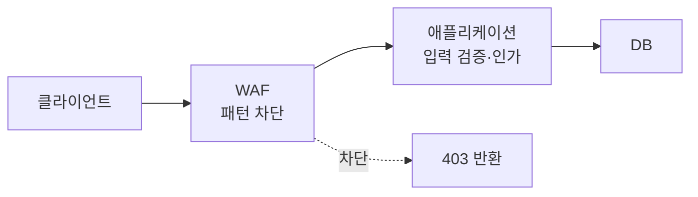
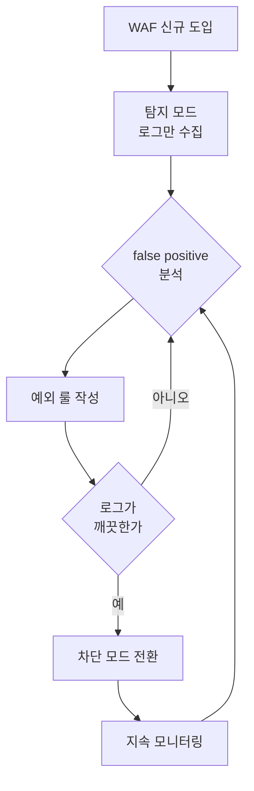

# 웹 애플리케이션 방화벽 (WAF) 운영

WAF는 HTTP 요청을 보고 SQL Injection, XSS, Path Traversal 같은 패턴을 차단하는 계층이다. 네트워크 방화벽이 IP·포트 단위로 막는다면 WAF는 요청 바디·헤더·쿼리스트링까지 들여다본다. L7에서 동작한다는 게 핵심이다.

실무에서 WAF를 처음 붙일 때 가장 많이 하는 착각이 "이거 켜면 보안 끝"이라는 생각이다. 그렇지 않다. WAF는 정규식과 패턴 매칭으로 동작하기 때문에 우회가 가능하고, 정상 요청을 막는 false positive가 반드시 생긴다. WAF를 코드 레벨 입력 검증의 대체재로 보면 운영 중에 크게 데인다. 보완 계층으로 봐야 한다. 이 글은 그 관점에서 ModSecurity, AWS WAF, Cloudflare를 실제로 굴리면서 겪는 문제와 처리 방법을 정리한다.

## WAF가 막는 것과 못 막는 것

WAF는 요청 문자열에서 알려진 공격 패턴을 찾는다. `' OR 1=1--` 같은 SQL Injection 시그니처, `<script>` 같은 XSS 페이로드, `../../etc/passwd` 같은 경로 조작 문자열을 룰로 잡는다.

반대로 WAF가 못 잡는 영역이 분명하다. 비즈니스 로직 취약점은 패턴이 아니라 흐름의 문제라 WAF가 모른다. 예를 들어 사용자 A가 `/api/orders/123`을 조회할 때 그 주문이 A의 것인지 검증하는 건 애플리케이션 코드의 몫이다. WAF 입장에서는 그냥 정상적인 GET 요청이다. IDOR(Insecure Direct Object Reference), 권한 상승, 결제 금액 조작 같은 건 WAF로 못 막는다.

그래서 WAF 도입을 검토할 때 기대치를 먼저 정해야 한다. WAF는 알려진 자동화 공격과 스캐너 트래픽을 걸러내는 1차 필터다. 패턴화되지 않는 로직 결함은 코드에서 막는 거고, WAF는 그 앞단에서 노이즈를 줄여주는 역할이다.



## ModSecurity + OWASP CRS

자체 인프라에서 WAF를 운영한다면 ModSecurity가 사실상 표준이다. Apache 모듈로 시작했지만 지금은 Nginx, IIS에서도 동작하고, libmodsecurity(v3)부터는 엔진이 분리돼서 `ModSecurity-nginx` 커넥터로 붙인다.

ModSecurity 자체는 룰을 실행하는 엔진일 뿐 룰이 없으면 아무것도 안 막는다. 룰셋으로 OWASP Core Rule Set(CRS)을 쓴다. CRS는 SQLi, XSS, RCE, LFI 같은 공격 카테고리별 룰을 묶어둔 오픈소스 룰셋이다.

### 기본 구성

ModSecurity 설정에서 가장 먼저 정해야 하는 게 엔진 모드다.

```nginx
# /etc/nginx/modsec/modsecurity.conf

# On: 차단, DetectionOnly: 탐지만, Off: 비활성
SecRuleEngine DetectionOnly

# 요청 바디 검사 활성화
SecRequestBodyAccess On

# 바디 크기 제한 (이 이상은 검사 안 하거나 차단)
SecRequestBodyLimit 13107200
SecRequestBodyNoFilesLimit 131072

# 응답 바디 검사 (데이터 유출 탐지용, 성능 부담 큼)
SecResponseBodyAccess Off

# 감사 로그
SecAuditEngine RelevantOnly
SecAuditLogParts ABIJDEFHZ
SecAuditLog /var/log/modsec/audit.log
```

처음 붙일 때는 반드시 `SecRuleEngine DetectionOnly`로 시작한다. 바로 `On`으로 켜면 정상 트래픽이 무더기로 막히는 사고가 난다. 이 얘기는 뒤에서 다시 한다.

CRS는 보통 이렇게 포함한다.

```nginx
# CRS 설정 파일과 룰 로드
Include /etc/nginx/modsec/crs/crs-setup.conf
Include /etc/nginx/modsec/crs/rules/*.conf
```

### Paranoia Level과 Anomaly Scoring

CRS를 굴릴 때 알아야 하는 두 개념이 Paranoia Level(PL)과 anomaly scoring이다.

CRS는 룰 하나가 매칭됐다고 바로 차단하지 않는다. 각 룰이 점수를 더하고, 누적 점수가 임계값을 넘으면 차단한다. 이걸 anomaly scoring mode라고 한다. `crs-setup.conf`에서 임계값을 조정한다.

```nginx
# 인바운드 차단 임계값 (기본 5)
SecAction "id:900110, phase:1, pass, nolog, \
  setvar:tx.inbound_anomaly_score_threshold=5, \
  setvar:tx.outbound_anomaly_score_threshold=4"

# Paranoia Level (1~4, 높을수록 엄격하고 false positive 증가)
SecAction "id:900000, phase:1, pass, nolog, \
  setvar:tx.paranoia_level=1"
```

PL은 1부터 4까지 있다. PL1은 명백한 공격만 잡고 false positive가 적다. PL이 올라갈수록 의심스러운 패턴까지 잡지만 정상 요청도 같이 걸린다. 운영 시작은 PL1으로 하고, 트래픽 성격을 파악한 뒤에 특정 경로만 PL을 올리는 식으로 가는 게 안전하다. PL4를 전역으로 켜면 튜닝하다가 일주일이 간다.

임계값도 마찬가지다. 기본값 5는 룰 하나당 보통 5점(critical)을 더하므로 critical 룰 하나만 맞아도 차단된다는 뜻이다. 이걸 7이나 10으로 올리면 단일 룰 매칭은 통과시키고 여러 개가 겹칠 때만 막는다. 처음에는 임계값을 약간 높여서 false positive를 줄이고, 로그를 보며 조이는 방향이 현실적이다.

## False Positive 튜닝과 룰 예외 처리

WAF 운영의 90%는 false positive 튜닝이다. 룰을 켜는 건 한순간이고, 정상 트래픽이 막히는 걸 하나씩 풀어주는 게 본 업무다.

### 어떤 게 막혔는지부터 본다

감사 로그에서 차단된 요청과 매칭된 룰 ID를 확인한다. ModSecurity 감사 로그에는 어떤 룰(`id`)이 무슨 이유(`msg`)로 걸렸는지 다 남는다.

```
ModSecurity: Warning. Matched "Operator `Rx' with parameter ..."
[file "REQUEST-942-APPLICATION-ATTACK-SQLI.conf"] [id "942100"]
[msg "SQL Injection Attack Detected via libinjection"]
[data "Matched Data: ..."] [uri "/api/search"] ...
```

여기서 룰 ID(942100), 매칭된 데이터, URI를 보고 진짜 공격인지 정상 요청인지 판단한다. `/api/search`에 사용자가 `O'Brien` 같은 이름을 검색했는데 작은따옴표 때문에 SQLi 룰에 걸렸다면 전형적인 false positive다.

### 예외 처리 방법

예외를 거는 방법이 몇 가지 있다. 무작정 룰을 끄지 말고 범위를 좁혀서 푸는 게 원칙이다.

특정 경로에서 특정 룰만 끄기:

```nginx
# /api/search 경로에서 942100 룰만 제거
SecRule REQUEST_URI "@beginsWith /api/search" \
  "id:1001, phase:1, pass, nolog, \
   ctl:ruleRemoveById=942100"
```

특정 파라미터를 룰 검사에서 제외(가장 자주 쓰는 방식):

```nginx
# comment 파라미터는 942100 룰의 검사 대상에서 제외
SecRuleUpdateTargetById 942100 "!ARGS:comment"
```

CRS에는 이런 튜닝을 모아두는 곳이 정해져 있다. `crs-setup.conf` 로드 전에 `REQUEST-900-EXCLUSION-RULES-BEFORE-CRS.conf`, 후에 `RESPONSE-999-EXCLUSION-RULES-AFTER-CRS.conf`를 두고 여기에 예외를 모은다. CRS를 업데이트해도 예외가 날아가지 않게 하려는 구조다. 룰 파일 본체를 직접 수정하면 업데이트할 때 충돌나고 변경 추적이 안 된다.

예외를 걸 때 주의할 점은 범위다. "이 룰이 자꾸 걸리니 전역에서 끈다"가 가장 위험하다. 942100을 전역으로 끄면 모든 경로에서 SQLi 탐지가 사라진다. 문제가 된 그 경로, 그 파라미터에서만 끄는 게 맞다. 예외 하나하나에 왜 풀었는지 주석을 남겨두면 나중에 본인이 본다.

## 차단 모드 vs 탐지 모드

WAF에는 두 가지 운영 모드가 있다. 요청을 막는 차단 모드(prevention/blocking)와, 막지 않고 로그만 남기는 탐지 모드(detection/audit-only)다.

ModSecurity에서는 `SecRuleEngine On`이 차단, `DetectionOnly`가 탐지다. AWS WAF는 룰 액션을 `Block`과 `Count`로 나누고, Cloudflare는 `Block`과 `Log`로 나눈다. 이름만 다르지 개념은 같다.

신규 도입이나 룰셋 대규모 변경 시에는 반드시 탐지 모드로 먼저 돌린다. 며칠에서 몇 주간 탐지 모드로 운영하면서 감사 로그를 본다. 어떤 정상 트래픽이 룰에 걸리는지 파악하고 예외를 다 걸어둔 다음에 차단 모드로 전환한다. 이 과정을 건너뛰고 처음부터 차단으로 켜면 배포 직후 정상 사용자가 403을 받는다.



전환 후에도 모니터링은 끝나지 않는다. 새 기능을 배포하면 새로운 요청 패턴이 생기고, 그게 기존 룰에 걸릴 수 있다. 배포 후 한동안 차단 로그를 지켜보는 습관이 필요하다.

한 가지 현실적인 팁은 모드를 전역으로만 두지 말고 룰 단위로 섞는 거다. AWS WAF에서는 신뢰도 높은 룰만 `Block`으로 두고 새로 추가한 룰은 `Count`로 두면서 데이터를 모은다. 충분히 검증되면 `Block`으로 올린다. 이렇게 하면 전체를 탐지 모드로 되돌리지 않고도 개별 룰을 점진적으로 적용할 수 있다.

## AWS WAF 매니지드 룰

직접 ModSecurity를 운영하기 부담스러우면 클라우드 매니지드 WAF를 쓴다. AWS WAF는 CloudFront, ALB, API Gateway 앞에 붙는다.

AWS WAF는 Web ACL 안에 룰을 넣고, 룰은 매니지드 룰 그룹이나 직접 만든 룰로 구성한다. AWS가 제공하는 `AWSManagedRulesCommonRuleSet`, `AWSManagedRulesSQLiRuleSet`, `AWSManagedRulesKnownBadInputsRuleSet` 같은 그룹이 CRS와 비슷한 역할을 한다.

Terraform으로 구성하면 이런 모양이다.

```hcl
resource "aws_wafv2_web_acl" "main" {
  name  = "app-waf"
  scope = "REGIONAL"  # CloudFront면 CLOUDFRONT

  default_action {
    allow {}
  }

  rule {
    name     = "AWSManagedCommon"
    priority = 1

    override_action {
      none {}  # count {} 로 두면 그룹 전체를 Count 모드로
    }

    statement {
      managed_rule_group_statement {
        name        = "AWSManagedRulesCommonRuleSet"
        vendor_name = "AWS"

        # 특정 룰만 Count로 빼서 false positive 회피
        rule_action_override {
          name = "SizeRestrictions_BODY"
          action_to_use {
            count {}
          }
        }
      }
    }

    visibility_config {
      cloudwatch_metrics_enabled = true
      metric_name                = "AWSManagedCommon"
      sampled_requests_enabled   = true
    }
  }

  visibility_config {
    cloudwatch_metrics_enabled = true
    metric_name                = "app-waf"
    sampled_requests_enabled   = true
  }
}
```

AWS WAF에서 false positive 튜닝은 `rule_action_override`로 한다. 매니지드 룰 그룹 전체를 끄지 않고 문제되는 개별 룰만 `count`로 빼는 방식이다. 위 예시의 `SizeRestrictions_BODY`는 바디 크기 제한 룰인데, 파일 업로드나 큰 JSON을 받는 API에서 자주 걸린다.

`sampled_requests_enabled`를 켜두면 콘솔에서 실제로 어떤 요청이 룰에 걸렸는지 샘플을 본다. 튜닝할 때 이게 없으면 깜깜이라 반드시 켠다.

AWS WAF의 제약도 알아야 한다. Web ACL 하나의 용량 단위(WCU)에 상한이 있어서 룰을 무한정 넣지 못한다. 기본 1500 WCU이고 매니지드 룰 그룹마다 WCU를 먹는다. 룰을 많이 붙이면 한도에 걸리니 정말 필요한 그룹만 넣는다.

## Cloudflare 매니지드 룰

Cloudflare는 DNS 프록시 앞단에서 WAF가 동작한다. Managed Ruleset(Cloudflare가 자체 관리하는 룰)과 OWASP Core Ruleset을 제공하고, 직접 만드는 Custom Rules를 추가할 수 있다.

Cloudflare WAF의 특징은 룰을 표현식으로 쓴다는 점이다. 특정 조건에 맞는 요청만 골라서 액션을 거는 게 직관적이다.

```
# 특정 경로 + 특정 국가 외 차단 (Custom Rule 표현식)
(http.request.uri.path contains "/admin" and ip.geoip.country ne "KR")
```

매니지드 룰의 false positive 처리는 두 가지로 한다. 하나는 특정 룰을 끄는 것(rule override), 다른 하나는 특정 요청을 룰 평가에서 제외하는 Exception(skip rule)이다. 관리자 IP나 내부 모니터링 봇이 룰에 걸리면 그 트래픽을 skip으로 빼는 식이다.

Cloudflare의 OWASP Core Ruleset도 ModSecurity의 CRS와 같은 anomaly scoring을 쓴다. Paranoia Level에 해당하는 민감도와 차단 임계값(score threshold)을 대시보드에서 조정한다. 개념이 ModSecurity CRS와 동일해서 한쪽을 이해하면 다른 쪽도 금방 적응한다.

## 정규식 룰의 한계와 우회

WAF의 근본 한계는 대부분의 룰이 정규식 기반이라는 점이다. 정규식은 "알려진 형태"만 잡는다. 공격자가 같은 의미를 다른 형태로 표현하면 룰을 빠져나간다. 이걸 WAF bypass라고 한다.

### 인코딩과 변형

가장 흔한 우회가 인코딩이다. `<script>`를 막는 룰이 있어도 다음은 다 같은 의미인데 형태가 다르다.

```
<script>           # 원본
%3Cscript%3E       # URL 인코딩
&#60;script&#62;    # HTML 엔티티
<ScRiPt>           # 대소문자 섞기
<scr<script>ipt>   # 부분 제거 우회
```

CRS는 이런 변형을 정규화(normalization)해서 잡으려고 transformation 함수(`t:urlDecode`, `t:lowercase`, `t:htmlEntityDecode` 등)를 룰에 건다. 하지만 정규화 순서나 다중 인코딩(이중 URL 인코딩 등)을 다 커버하지 못하는 경우가 있다. SQLi 쪽은 libinjection이라는 별도 라이브러리로 토큰 단위 분석을 해서 단순 정규식보다 우회에 강하지만, 그래도 완벽하지 않다.

### 실제 우회 사례 유형

운영하면서 보는 우회는 대략 이런 패턴이다.

SQL 주석과 공백 변형. `UNION SELECT` 대신 `UNION/**/SELECT`, `UNION%0aSELECT`처럼 공백을 주석이나 개행으로 바꾼다. CRS가 많이 커버하지만 DB별 특수 문법까지는 못 따라가는 경우가 있다.

청크 인코딩과 콘텐츠 타입 조작. `Content-Type`을 바꾸거나 요청 바디를 청크로 쪼개서 WAF의 바디 파싱을 흔든다. WAF가 파싱한 결과와 애플리케이션이 파싱한 결과가 달라지면(parser differential) 그 틈으로 페이로드가 들어간다.

크기 제한 악용. WAF가 검사하는 바디 크기에 상한이 있다(`SecRequestBodyLimit`). 그 한도를 넘는 바디는 검사를 못 하거나 통째로 통과시킨다. 공격자가 페이로드 앞에 의미 없는 데이터를 잔뜩 채워서 한도를 넘기면 정작 뒤에 붙은 공격 코드는 검사를 안 받는다.

이 모든 우회 사례가 말하는 결론은 하나다. WAF만 믿으면 안 된다. WAF를 뚫는 페이로드는 계속 나온다. 그래서 코드 레벨 방어가 본진이고 WAF는 외곽 방어선이다.

## 코드 레벨 검증의 보완 계층으로서의 WAF

여기가 이 글의 핵심이다. WAF는 입력 검증을 대체하지 않는다.

SQL Injection을 예로 들면, 진짜 방어는 Prepared Statement(파라미터 바인딩)다. 쿼리 구조와 데이터를 분리하면 사용자 입력이 무슨 문자든 SQL 문법으로 해석되지 않는다. WAF가 `' OR 1=1`을 못 잡아도 Prepared Statement를 쓰면 공격이 성립하지 않는다.

```java
// WAF가 뚫려도 이건 안전하다 - 구조와 데이터 분리
String sql = "SELECT * FROM users WHERE email = ?";
PreparedStatement ps = conn.prepareStatement(sql);
ps.setString(1, userEmail);  // userEmail이 무슨 값이든 데이터로만 취급
```

XSS도 마찬가지다. 출력 시 컨텍스트에 맞는 이스케이프(HTML, JS, URL)와 CSP(Content Security Policy)가 본진 방어다. WAF는 명백한 `<script>` 페이로드를 걸러주지만 그게 전부다.

그러면 WAF는 왜 두는가. 세 가지 이유가 있다.

첫째, 알려지지 않은 코드 취약점에 대한 시간 벌이다. 라이브러리에 0-day가 터졌을 때(Log4Shell 같은) 코드 패치를 배포하기 전에 WAF에 임시 룰을 넣어 막을 수 있다. 실제로 Log4Shell 때 많은 조직이 `${jndi:` 패턴을 WAF로 긴급 차단하고 그 사이에 패치를 했다. 이걸 가상 패치(virtual patching)라고 부른다.

둘째, 스캐너와 자동화 공격 노이즈 감소다. 인터넷에 서비스를 열면 끊임없이 자동 스캐너가 알려진 취약점을 찔러본다. WAF가 이 트래픽을 1차로 걷어내면 애플리케이션 로그와 모니터링이 깨끗해진다.

셋째, 심층 방어다. 코드에 실수로 검증이 빠진 엔드포인트가 생겨도 WAF가 한 겹 더 막아준다. 사람이 짜는 코드에는 빈틈이 생기기 마련이고 WAF는 그 빈틈을 일부 메운다.

정리하면 방어는 계층이다. WAF(외곽) → 입력 검증·인가(애플리케이션) → Prepared Statement·이스케이프(데이터 접근)로 겹친다. 어느 한 층도 단독으로 완전하지 않고, 그래서 겹쳐 쌓는다.

## WAF 로그 연동

WAF는 차단만 하고 끝나면 반쪽이다. 로그를 모아서 봐야 공격 추세도 보이고 false positive도 잡는다.

ModSecurity 감사 로그는 기본적으로 텍스트 포맷이지만 JSON으로 뽑을 수 있다(`SecAuditLogFormat JSON`). JSON으로 뽑아서 Fluent Bit이나 Filebeat로 수집하고 ELK나 OpenSearch로 보낸다. 룰 ID별 매칭 빈도, 차단된 URI 분포, 출발지 IP 분포를 대시보드로 만들면 운영이 편하다.

```
# ModSecurity JSON 로그 형태 (일부)
{
  "transaction": {
    "client_ip": "203.0.113.10",
    "request": { "uri": "/api/search", "method": "GET" },
    "messages": [
      {
        "message": "SQL Injection Attack Detected",
        "details": { "ruleId": "942100", "severity": "CRITICAL" }
      }
    ]
  }
}
```

AWS WAF는 로그를 Kinesis Data Firehose를 거쳐 S3나 CloudWatch Logs, OpenSearch로 보낸다. Cloudflare는 Logpush로 로그를 S3, GCS, 또는 SIEM으로 내보낸다. 어느 쪽이든 WAF 로그를 SIEM에 모으는 게 목표다.

로그를 SIEM에 연동하면 두 가지를 한다. 하나는 false positive 탐지다. 특정 룰 ID가 정상 사용자 IP에서 반복 매칭되면 false positive 의심 신호다. 다른 하나는 공격 탐지와 상관 분석이다. 한 IP가 여러 룰에 연속으로 걸리거나, 짧은 시간에 다양한 페이로드를 시도하면 표적 공격일 가능성이 높다. 이런 패턴은 단일 로그가 아니라 모아서 봐야 보인다.

로그 자체의 보안과 보존에 대해서는 [Security_Logging_and_Auditing](Security_Logging_and_Auditing.md)에서 다룬다. WAF 로그도 그 로깅 체계의 한 소스로 들어간다.

## 운영하면서 정리한 것들

WAF를 몇 번 붙여보고 남는 감각은 이렇다.

탐지 모드 없이 차단부터 켜면 사고난다. 신규 도입이든 룰셋 변경이든 탐지 모드로 데이터를 먼저 모은다.

예외는 좁게 건다. 룰을 전역으로 끄는 건 마지막 수단이다. 경로와 파라미터 단위로 푸는 게 기본이고, 왜 풀었는지 기록을 남긴다.

WAF는 코드 검증을 대체하지 않는다. Prepared Statement, 출력 이스케이프, 인가 로직이 본진이고 WAF는 보완이다. 이 순서를 뒤집으면 안 된다.

정규식 룰은 우회된다. 새 우회 기법은 계속 나온다는 걸 전제로 운영하고, 0-day 대응 같은 명확한 가치에 WAF를 활용한다.

로그를 안 보면 WAF가 아니라 그냥 가끔 사용자를 막는 장애물이다. SIEM 연동과 정기적인 룰 매칭 리뷰가 있어야 WAF가 제 역할을 한다.
