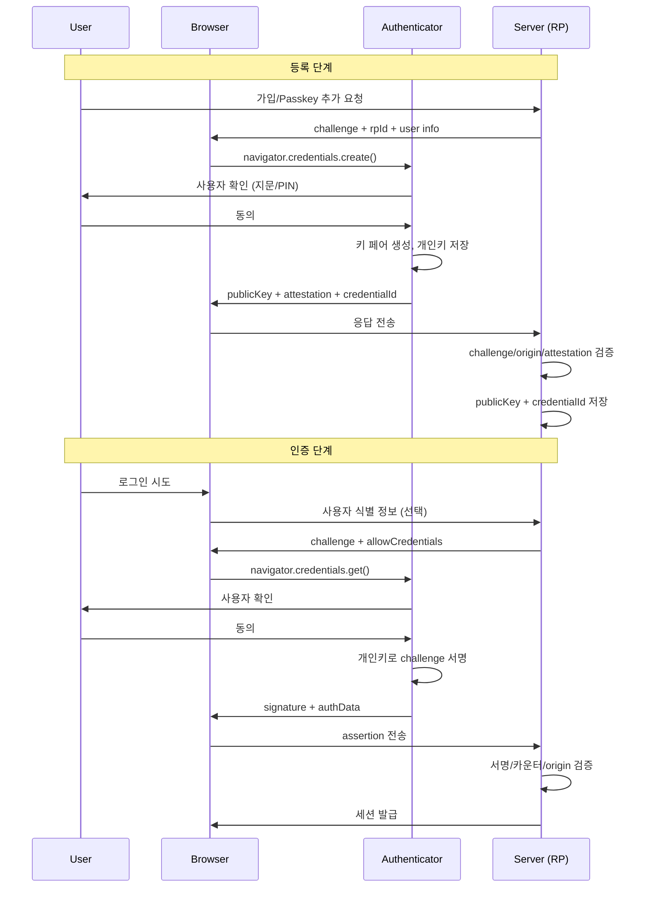

# WebAuthn / FIDO2 / Passkeys

## 비밀번호가 사라지는 이유

비밀번호 인증은 30년 넘게 표준이었지만 구조적으로 깨져 있다. 사용자는 같은 비밀번호를 여러 사이트에 돌려쓰고, 피싱 사이트에 그대로 입력하고, 서버는 그걸 해시로 저장하지만 정기적으로 유출된다. 비밀번호 하나가 털리면 다른 서비스까지 연쇄로 뚫린다. 거기에 2FA를 붙여도 SMS는 SIM 스왑으로 가로채지고, TOTP는 피싱 프록시(예: Evilginx)로 실시간 중계당한다.

WebAuthn(Web Authentication API)은 이 구조를 바꿔버린다. 핵심은 두 가지다. 첫째, 사용자는 비밀번호를 모르고 서버도 비밀번호를 저장하지 않는다. 둘째, 인증 과정이 origin에 묶여 있어서 피싱 사이트에서는 애초에 동작하지 않는다. FIDO Alliance가 만든 FIDO2 표준의 클라이언트측 API가 WebAuthn이고, 인증기와 통신하는 프로토콜이 CTAP2다. Passkey는 그 위에 올라간 사용자 친화적인 브랜드 이름이라고 보면 된다.

5년 전엔 YubiKey 꽂는 개발자들 장난감 정도였는데, 지금은 Apple, Google, Microsoft가 OS 레벨에서 동기화 Passkey를 밀고 있어서 일반 사용자도 쓸 수 있게 됐다. 새로 인증 시스템을 짜는 거라면 비밀번호 + Passkey를 동시에 지원하고, 점진적으로 Passkey로 마이그레이션하는 그림을 그리는 게 맞다.

## 동작 원리: 공개키 암호 기반

WebAuthn은 공개키 암호 위에서 돌아간다. 비밀번호처럼 "공유 비밀"을 주고받는 게 아니라, 인증기가 개인키를 보관하고 서버는 공개키만 가진다.

흐름은 두 단계다.

1. **등록(Registration)**: 사용자가 처음 가입하거나 Passkey를 추가할 때, 인증기가 그 사이트 전용 키 페어를 새로 만든다. 공개키를 서버로 올리고, 개인키는 인증기 안에 갇힌다.
2. **인증(Authentication)**: 로그인할 때 서버가 랜덤 챌린지를 보낸다. 인증기가 개인키로 챌린지를 서명해 돌려준다. 서버는 등록 때 받았던 공개키로 서명을 검증한다.



이 구조에서 키 페어는 사이트(=RP, Relying Party)별로 다르다. 같은 인증기로 100개 사이트에 가입하면 키 페어가 100개 만들어진다. RP가 자기 키만 받기 때문에 사이트끼리 사용자 추적이 불가능하다.

서버가 저장하는 건 사용자 ID, credentialId, publicKey, signCount 정도다. 이게 유출돼도 큰 문제가 없다. 공격자가 publicKey를 가져가도 서명을 못 만든다. 비밀번호 해시 데이터베이스 유출이 악몽이었다면, WebAuthn 크리덴셜 데이터베이스 유출은 그냥 사고일 뿐이다.

## Authenticator 종류

인증기(Authenticator)가 실제로 키를 보관하는 주체인데, 형태가 두 가지다.

### Platform Authenticator

기기 안에 내장된 인증기. 브라우저나 OS가 키를 관리한다.

- macOS/iOS: Touch ID, Face ID → Keychain
- Windows: Windows Hello → TPM
- Android: Screen lock + StrongBox/TEE
- ChromeOS: 내장 보안 칩

사용자 입장에선 추가 기기를 사야 할 필요가 없다. 노트북 지문 센서로 그냥 로그인하면 된다. 이게 Passkey 대중화의 핵심이다. 다만 기기를 잃어버리거나 망가뜨리면 그 인증기에 있던 키도 사라진다. 그래서 동기화 Passkey 개념이 나왔다 (뒤에서 다룬다).

### Roaming Authenticator (Cross-Platform)

기기에 꽂거나 무선으로 연결하는 외장 인증기. USB-C, NFC, BLE로 연결한다.

- YubiKey (Yubico)
- Google Titan
- Feitian, SoloKeys 같은 오픈소스 계열

이건 사용자가 들고 다니는 물리적 키다. 노트북을 바꿔도 같은 키를 쓸 수 있다. 보통 보안에 민감한 환경 — 관리자 계정, 클라우드 콘솔, 코드 서명 같은 데 쓴다. 잃어버리면 끝이라서 보통 두 개를 등록해놓고 하나는 금고에 둔다.

회사 보안팀이 강제 정책을 걸 때는 attestation으로 어떤 모델의 인증기인지 검증해서 화이트리스트에 있는 것만 통과시킨다. 일반 컨슈머 서비스에선 attestation을 보통 안 본다. 모델 식별이 추적 우려가 있어서 브라우저가 기본적으로 anonymized하기도 한다.

### 어떤 걸 등록하게 할 것인가

`authenticatorSelection.authenticatorAttachment`로 제어한다.

```js
// Platform만 (Passkey 등록 UX)
{ authenticatorAttachment: "platform" }

// Roaming만 (보안 키 등록)
{ authenticatorAttachment: "cross-platform" }

// 둘 다 허용 (기본)
// 옵션 자체를 빼면 됨
```

일반 서비스는 비워두고 사용자가 선택하게 하는 게 낫다. 관리자 계정처럼 정책이 강한 곳만 cross-platform 강제를 걸면 된다.

## Resident Key / Discoverable Credential

이 개념을 모르고 WebAuthn을 짜면 UX가 이상해진다.

기존 비-residnet 방식은 서버가 로그인 시점에 "이 사용자의 credentialId 목록은 이거다" 하고 `allowCredentials`에 넣어 내려보낸다. 그러려면 사용자가 누군지 먼저 알아야 한다 → 아이디 입력 화면이 필요하다.

Resident Key(또는 Discoverable Credential, 명세상 같은 의미)는 인증기가 사용자 정보까지 같이 저장한다. 서버는 `allowCredentials`를 비우고 챌린지만 던진다. 인증기가 자기 안에 그 RP의 크리덴셜이 있는지 알아서 찾아주고, 사용자 식별 정보도 같이 반환한다. 이게 진정한 의미의 "username-less" 로그인이다.

Passkey라고 부르는 건 사실상 이 Resident Key + 동기화의 조합이다.

```js
// 서버가 등록 옵션 만들 때
{
  authenticatorSelection: {
    residentKey: "required",       // 또는 "preferred"
    userVerification: "required"
  }
}
```

`residentKey` 값:

- `required`: 무조건 resident key로 만든다. Passkey UX 강제.
- `preferred`: 가능하면 만든다. 인증기가 지원 안 하면 일반 키로.
- `discouraged`: 굳이 안 만든다. 저장 공간이 빠듯한 외장 키일 때 의미가 있다.

YubiKey 5 같은 외장 키는 resident key 슬롯이 25~50개 정도로 제한된다. 100개 사이트에 등록하려고 하면 꽉 찬다. 반면 Platform Authenticator는 사실상 무제한이다.

## 등록 흐름과 서버 검증

브라우저 측 코드는 단순하다.

```js
const publicKeyCredentialCreationOptions = await fetch('/webauthn/register/begin', {
  method: 'POST',
  credentials: 'include'
}).then(r => r.json());

// challenge, user.id 같은 base64 → ArrayBuffer 변환 필요
publicKeyCredentialCreationOptions.challenge =
  base64urlToBuffer(publicKeyCredentialCreationOptions.challenge);
publicKeyCredentialCreationOptions.user.id =
  base64urlToBuffer(publicKeyCredentialCreationOptions.user.id);

const credential = await navigator.credentials.create({
  publicKey: publicKeyCredentialCreationOptions
});

await fetch('/webauthn/register/finish', {
  method: 'POST',
  headers: { 'Content-Type': 'application/json' },
  body: JSON.stringify({
    id: credential.id,
    rawId: bufferToBase64url(credential.rawId),
    type: credential.type,
    response: {
      clientDataJSON: bufferToBase64url(credential.response.clientDataJSON),
      attestationObject: bufferToBase64url(credential.response.attestationObject)
    }
  })
});
```

핵심은 서버 측 검증이다. 클라이언트가 보내준 걸 그대로 믿으면 안 된다. 검증 항목이 꽤 많은데, 직접 짜지 말고 검증된 라이브러리를 써라. Java는 yubico/java-webauthn-server, Node는 SimpleWebAuthn, Go는 go-webauthn, Python은 py_webauthn이 사실상 표준이다.

라이브러리가 내부적으로 하는 검증 항목:

1. **clientDataJSON 파싱**: type이 `webauthn.create`인지, challenge가 서버가 발급한 값과 일치하는지, origin이 등록된 RP origin과 일치하는지.
2. **attestationObject 파싱**: CBOR 디코딩해서 authData와 attStmt를 꺼낸다.
3. **rpIdHash 검증**: authData 앞 32바이트가 RP ID(보통 도메인)의 SHA-256과 일치해야 한다.
4. **Flags 검증**: UP(User Present) 비트는 무조건 1, UV(User Verified) 비트는 정책에 따라 1 요구.
5. **공개키 추출**: COSE_Key 포맷에서 알고리즘과 좌표를 꺼낸다.
6. **Attestation 검증**: 정책상 필요하면 인증기 제조사 인증서 체인을 검증한다.
7. **credentialId 중복 체크**: 다른 사용자가 이미 등록한 credentialId면 거부.

저장하는 건 보통 이 정도다.

```sql
CREATE TABLE webauthn_credential (
  id              BIGSERIAL PRIMARY KEY,
  user_id         BIGINT NOT NULL,
  credential_id   BYTEA NOT NULL UNIQUE,
  public_key      BYTEA NOT NULL,
  sign_count      BIGINT NOT NULL DEFAULT 0,
  transports      TEXT[],
  aaguid          UUID,
  backup_eligible BOOLEAN NOT NULL,
  backup_state    BOOLEAN NOT NULL,
  nickname        TEXT,
  created_at      TIMESTAMPTZ NOT NULL DEFAULT now(),
  last_used_at    TIMESTAMPTZ
);
```

`backup_eligible`/`backup_state`는 동기화 Passkey인지 구분할 때 본다. `transports`는 다음 인증 시 `allowCredentials`에 힌트로 넣어주면 UX가 매끄러워진다.

## 인증 흐름과 검증

```js
const options = await fetch('/webauthn/login/begin', {
  method: 'POST',
  body: JSON.stringify({ username }),  // username-less면 생략
  headers: { 'Content-Type': 'application/json' }
}).then(r => r.json());

options.challenge = base64urlToBuffer(options.challenge);
options.allowCredentials = (options.allowCredentials || []).map(c => ({
  ...c,
  id: base64urlToBuffer(c.id)
}));

const assertion = await navigator.credentials.get({ publicKey: options });

await fetch('/webauthn/login/finish', {
  method: 'POST',
  headers: { 'Content-Type': 'application/json' },
  body: JSON.stringify({
    id: assertion.id,
    rawId: bufferToBase64url(assertion.rawId),
    type: assertion.type,
    response: {
      clientDataJSON: bufferToBase64url(assertion.response.clientDataJSON),
      authenticatorData: bufferToBase64url(assertion.response.authenticatorData),
      signature: bufferToBase64url(assertion.response.signature),
      userHandle: assertion.response.userHandle
        ? bufferToBase64url(assertion.response.userHandle)
        : null
    }
  })
});
```

서버 검증 포인트:

1. **challenge 일치**: 그 세션에서 발급한 challenge가 맞는지. challenge는 일회성이고 5분 정도 TTL을 둔다. 서버 메모리/Redis에 저장해두고 쓰면 폐기.
2. **origin 일치**: clientDataJSON의 origin이 등록된 RP origin과 정확히 같은가. `https://example.com`과 `https://www.example.com`은 다르다. RP ID는 도메인 단위, origin은 스킴+호스트+포트 단위라는 걸 헷갈리면 안 된다.
3. **rpIdHash 일치**: authData의 rpIdHash가 SHA-256(rpId)와 같은가.
4. **UP/UV flag**: 정책에 따라 검증.
5. **서명 검증**: `authenticatorData || SHA-256(clientDataJSON)`을 등록 때 받은 publicKey로 검증.
6. **signCount 검증**: 이게 미묘하다.

### Signature Counter

authData에 4바이트 카운터가 들어 있다. 인증기가 서명할 때마다 증가시킨다(또는 0 고정). 서버는 직전 signCount보다 큰 값이 와야 한다고 본다. 작거나 같으면 인증기가 복제됐을 가능성이 있다 → 거부하거나 경보.

문제는 동기화 Passkey는 카운터가 보통 0으로 고정이라는 점이다. 디바이스 간 동기화 때문에 카운터를 일관되게 유지할 수가 없다. 그래서 양쪽이 0이면 카운터 검증을 스킵해야 한다. 라이브러리가 알아서 처리하지만, 직접 짤 거면 알고 있어야 한다.

```python
# 의사 코드
if stored_count == 0 and received_count == 0:
    pass  # 동기화 Passkey, 검증 스킵
elif received_count <= stored_count:
    raise CloneSuspectedError()
else:
    update_count(received_count)
```

## Attestation: 알고 가야 할 함정

Attestation은 "이 키를 만든 인증기가 진짜 어떤 모델인지" 증명하는 메커니즘이다. 등록 시 attestationObject에 인증기 제조사가 서명한 인증서가 들어 있다.

종류:

- `none`: attestation 없음. 기본값. 일반 서비스는 거의 다 이거.
- `indirect`: 브라우저가 익명화한 attestation을 전달.
- `direct`: 인증기의 원본 attestation 그대로.
- `enterprise`: AAGUID + 시리얼까지 포함한 풀 정보 (특정 환경에서만 가능).

일반 컨슈머 서비스가 attestation을 검증하는 건 보통 과잉이다. 이유:

1. 사용자 추적 우려가 있어서 OS/브라우저가 attestation을 막거나 변조한다 (특히 iCloud Keychain Passkey).
2. 신뢰할 만한 root CA 목록을 직접 관리해야 하는데, 이게 만만치 않다. FIDO MDS(Metadata Service)를 받아 와서 매일 갱신하는 식이다.
3. 사용자 등록 실패율이 올라간다.

기업 환경이라면 다르다. 정책상 "회사가 발급한 YubiKey만 등록 가능" 같은 게 필요하면 attestation으로 AAGUID 화이트리스트를 만든다. AAGUID는 인증기 모델별 UUID다.

## Passkey 동기화

기존 WebAuthn 크리덴셜은 디바이스에 묶여 있었다. 노트북이 망가지면 그 크리덴셜도 같이 사라졌다. 이걸 해결한 게 동기화 Passkey다.

- **Apple**: iCloud Keychain으로 동기화. End-to-end 암호화. macOS, iOS, iPadOS 사이에서 자동 공유. Apple ID 한 개에 묶임.
- **Google Password Manager**: Android, ChromeOS, Chrome(데스크탑) 사이 동기화. 마찬가지로 E2EE.
- **Microsoft**: Windows 11 일부 빌드부터 Microsoft Account 연동.
- **1Password / Dashlane / Bitwarden**: 서드파티 패스워드 매니저도 Passkey vault를 지원한다. OS 종속을 깰 수 있다.

크로스 플랫폼(예: Mac에서 등록한 Passkey를 Windows에서 사용)은 보통 QR 코드 + BLE로 한다. CTAP2의 hybrid transport(예전 caBLE)다. PC 화면에 QR이 뜨고, 폰으로 찍으면 폰의 Passkey로 PC 로그인이 된다. 폰과 PC가 BLE로 근접 검증을 하기 때문에 원격 피싱이 안 된다.

서버 입장에서 동기화 Passkey와 디바이스 바운드 Passkey 구분은 authData의 BE(Backup Eligible), BS(Backup State) 비트로 한다.

- BE=0: 동기화 불가 (외장 키, 일부 platform 인증기)
- BE=1, BS=0: 동기화 가능하지만 아직 백업 안 됨
- BE=1, BS=1: 동기화 중 (다른 기기에서도 쓰일 수 있음)

이걸 보고 정책을 다르게 할 수 있다. 예: 관리자 계정은 BE=0인 인증기만 허용. 일반 사용자는 BE=1 허용.

## 패스워드/2FA와의 공존

현실적으로 처음부터 Passkey만 쓰는 신규 서비스는 드물다. 보통 단계적으로 간다.

### 1단계: Passkey를 2FA 대체로

기존 비밀번호 + OTP 구조에서 OTP 자리에 WebAuthn을 끼운다. 가장 안전한 2FA가 된다. 사용자가 Passkey를 등록하면 OTP 옵션을 숨겨도 된다.

### 2단계: Passkey를 1차 인증으로

비밀번호 입력 화면에 "Passkey로 로그인" 버튼을 붙인다. 사용자가 Passkey를 가지고 있으면 그걸로 끝. 없으면 비밀번호로 fallback.

### 3단계: Passkey-first

가입 흐름에서 Passkey를 기본으로 권한다. 비밀번호는 옵션으로. 계정 복구는 이메일 + Passkey 재등록 흐름.

### 4단계: Passwordless

비밀번호 자체를 제거. 분실 대비로 백업 Passkey 등록을 강제하거나, 복구 코드를 발급한다.

여기서 함정 하나: Passkey 등록은 사용자에게 부담이다. 가입 직후에 강요하면 이탈한다. 등록은 로그인 후 적당한 타이밍 — 결제 직전, 보안 페이지 진입 시 — 에 권유하는 게 낫다. "다음에 더 빠르게 로그인하시겠어요?" 같은 문구로.

또 하나, 한 사용자가 여러 Passkey를 등록할 수 있게 해야 한다. 폰 하나, 노트북 하나, 백업용 YubiKey 하나. 이걸 못 하게 막아두면 디바이스 분실 시 계정이 잠긴다. 계정 설정 페이지에 등록된 인증기 목록을 보여주고, 닉네임을 붙이고, 개별로 삭제할 수 있게 해야 한다.

## Conditional UI (Autofill)

비밀번호 매니저처럼 Passkey가 자동완성으로 뜨게 하는 기능이다. 사용자가 username 필드를 클릭하면 OS가 등록된 Passkey 목록을 띄워준다. 별도 버튼 안 눌러도 된다.

지원 여부 체크부터 한다.

```js
if (PublicKeyCredential.isConditionalMediationAvailable &&
    await PublicKeyCredential.isConditionalMediationAvailable()) {

  // 페이지 로드 시 미리 백그라운드 get() 호출
  navigator.credentials.get({
    publicKey: {
      challenge: challengeFromServer,
      allowCredentials: [],     // 비워야 discoverable credential을 찾는다
      userVerification: 'preferred'
    },
    mediation: 'conditional'    // 이게 핵심
  }).then(handleAssertion);
}
```

HTML 쪽에서 input에 힌트를 줘야 한다.

```html
<input type="text" name="username" autocomplete="username webauthn">
```

이렇게 하면 사용자가 ID 필드를 누를 때 비밀번호 매니저 자동완성이 뜨면서 동시에 등록된 Passkey도 같이 뜬다. 사용자가 Passkey를 선택하면 위에서 호출한 `get()`이 resolve된다. UX적으로 가장 매끄러운 형태다.

`mediation: 'conditional'`을 안 쓰고 그냥 `get()`을 호출하면 강제로 모달이 뜬다. Conditional UI가 안 되는 브라우저(아직도 좀 있다)면 fallback으로 일반 버튼을 두는 게 맞다.

## 운영하면서 부딪히는 것들

**RP ID 변경**: 도메인을 바꾸면 기존 등록된 모든 Passkey가 무효가 된다. RP ID는 등록 시점에 박힌다. `example.com`에서 등록한 Passkey는 `example.io`에서 못 쓴다. 서브도메인 단위로 RP ID를 잘게 쪼개면 마찬가지로 문제. 보통 루트 도메인(`example.com`)을 RP ID로 잡고, 서브도메인 어디서든 쓸 수 있게 한다.

**iframe**: 기본적으로 iframe에서 WebAuthn 호출은 막혀 있다. 결제 위젯 같은 게 iframe인 경우 `Permissions-Policy: publickey-credentials-get=*` 헤더가 필요하다.

**Localhost 개발**: `localhost`는 예외적으로 HTTPS 없이도 WebAuthn이 동작한다. 단, IP 주소(127.0.0.1)는 안 된다. 모바일 디바이스에서 테스트하려면 ngrok 같은 걸로 HTTPS 터널 만들어야 한다.

**계정 복구**: Passkey를 다 잃어버린 사용자는 어떻게 복구할까. 이메일 인증으로 새 Passkey를 등록하게 하면 이메일 계정만 털리면 끝이다. 그래서 보통 신원 확인을 한 단계 더 끼운다 — 등록된 결제 수단 last-4, 가입 시점, 보안 질문, 신분증 OCR 같은 것. 이건 서비스 특성에 따라 다르다.

**서명 알고리즘**: ES256(P-256 ECDSA)이 사실상 표준이다. RS256도 받지만 이미 거의 안 쓴다. EdDSA(Ed25519)는 일부 인증기만 지원. 등록 옵션에서 `pubKeyCredParams`로 지원 알고리즘을 선언하는데, 그냥 `[-7, -257]`(ES256, RS256) 정도로 두면 된다.

**시간 동기화**: WebAuthn 자체는 timestamp를 안 쓰지만, attestation 인증서 검증에서 만료 체크가 들어간다. 서버 시계가 어긋나면 검증 실패가 난다. 흔하진 않은데 한 번 발생하면 디버깅이 까다로우니 NTP 동기화는 확인해 둘 것.

**라이브러리 선택**: 직접 CBOR 디코더부터 짜지 마라. 시간 낭비고 보안 버그 만들기 좋다. 위에서 말한 yubico, SimpleWebAuthn, go-webauthn 같은 메인스트림 라이브러리만 써도 충분하다. 이슈 트래커 활발한 거 골라라.
