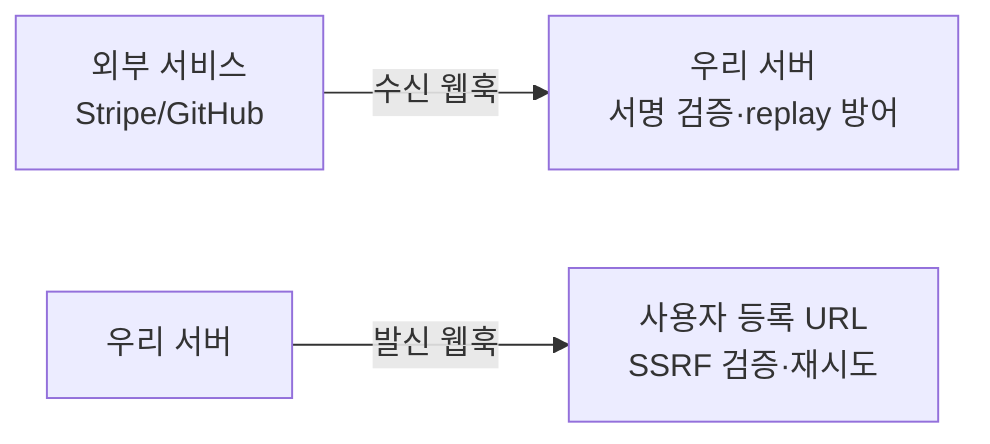
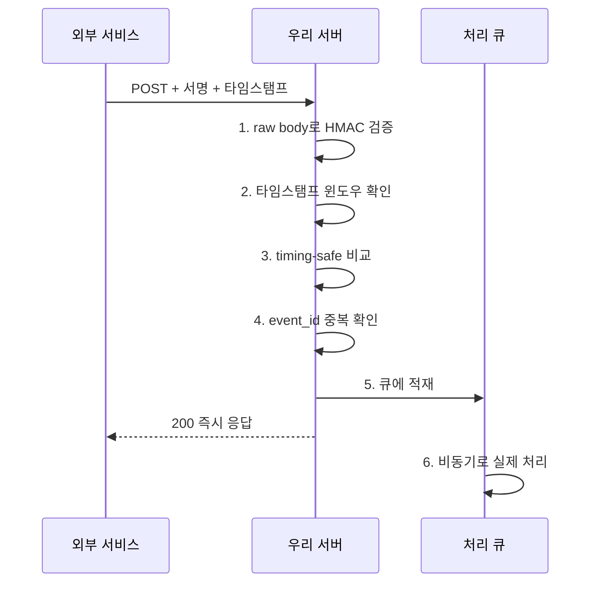

# 웹훅 보안

웹훅은 결국 "외부에서 우리 서버로 들어오는 HTTP 요청"이거나 "우리가 외부로 쏘는 HTTP 요청"이다. 평범한 POST 요청이라 가볍게 보다가 사고 나는 경우가 많다. 수신 쪽은 누가 보냈는지 검증을 안 해서 위조 요청에 당하고, 발신 쪽은 사용자가 등록한 URL로 무지성으로 요청을 날리다가 내부망을 긁히는 SSRF로 이어진다.

5년 동안 결제 연동(PG, Stripe), GitHub App, 사내 이벤트 버스를 붙이면서 겪은 패턴은 거의 정해져 있다. 서명 검증을 안 하거나, 서명 비교를 `==`로 하거나, 타임스탬프를 안 봐서 같은 요청이 재생(replay)되거나, 발신 URL을 검증 안 해서 `http://169.254.169.254`로 메타데이터를 빨아가거나. 이 문서는 그 사고들을 막는 실제 코드 위주로 정리한다.

---

## 수신 웹훅과 발신 웹훅은 위협 모델이 다르다

방향에 따라 막아야 하는 게 완전히 다르다. 한쪽 기준으로만 짜면 반대쪽이 뚫린다.



수신 웹훅에서 막아야 하는 것:

- 위조 요청(서명 검증)
- 같은 요청 재생(타임스탬프 + 멱등성)
- 본문 변조(서명에 본문 포함)

발신 웹훅에서 막아야 하는 것:

- 내부망 접근(SSRF 검증)
- 무한 재시도로 인한 우리 쪽 자원 고갈
- 시크릿 유출

같은 "웹훅 보안"이라도 이 둘을 섞어서 생각하면 안 된다.

---

## HMAC 서명 검증 — 누가 보냈는지 확인하는 기본

수신 웹훅의 첫 관문은 서명 검증이다. 보낸 쪽과 우리가 공유하는 시크릿으로 본문 전체를 HMAC 해싱한 값을 헤더에 담아 보내고, 우리는 같은 시크릿으로 다시 계산해서 일치하는지 본다. 시크릿을 모르면 올바른 서명을 만들 수 없으니, 서명이 맞으면 "이 시크릿을 아는 쪽이 보냈고 본문이 변조되지 않았다"가 보장된다.

핵심은 **서명 대상이 raw body**라는 점이다. JSON으로 파싱한 뒤 다시 직렬화한 문자열로 검증하면 안 된다. 키 순서, 공백, 유니코드 이스케이프가 바뀌어서 서명이 깨진다. 받은 바이트 그대로를 검증해야 한다.

### GitHub 방식

GitHub은 `X-Hub-Signature-256` 헤더에 `sha256=` 접두사를 붙여서 보낸다.

```javascript
const crypto = require('crypto');

function verifyGithubSignature(rawBody, signatureHeader, secret) {
  if (!signatureHeader) return false;

  // "sha256=abc123..." 형태
  const expected =
    'sha256=' +
    crypto.createHmac('sha256', secret).update(rawBody).digest('hex');

  // 길이가 다르면 timingSafeEqual이 예외를 던지므로 먼저 막는다
  const a = Buffer.from(signatureHeader);
  const b = Buffer.from(expected);
  if (a.length !== b.length) return false;

  return crypto.timingSafeEqual(a, b);
}
```

여기서 `rawBody`를 어떻게 확보하느냐가 실무에서 제일 자주 막히는 부분이다. Express에서 `express.json()`을 먼저 태우면 `req.body`는 이미 파싱된 객체라 원본 바이트가 사라진다. raw body를 따로 보관해야 한다.

```javascript
const express = require('express');
const app = express();

// 웹훅 경로만 raw로 받는다. verify 콜백에서 원본 버퍼를 보관
app.use(
  '/webhooks/github',
  express.json({
    verify: (req, res, buf) => {
      req.rawBody = buf; // Buffer 그대로
    },
  })
);

app.post('/webhooks/github', (req, res) => {
  const ok = verifyGithubSignature(
    req.rawBody,
    req.get('X-Hub-Signature-256'),
    process.env.GITHUB_WEBHOOK_SECRET
  );
  if (!ok) return res.status(401).send('invalid signature');

  // 여기서부터 req.body(파싱된 객체) 사용
  res.sendStatus(200);
});
```

### Stripe 방식

Stripe은 한 단계 더 들어간다. `Stripe-Signature` 헤더에 타임스탬프와 서명을 같이 담고, 서명 대상도 `타임스탬프.본문`을 합친 문자열이다. 타임스탬프를 서명에 포함시켜서 replay까지 한 번에 막는 구조다.

헤더 형태: `t=1733740800,v1=5257a8...`

```javascript
function verifyStripeSignature(rawBody, sigHeader, secret, toleranceSec = 300) {
  // 헤더 파싱: t=..., v1=...
  const parts = {};
  for (const item of sigHeader.split(',')) {
    const [k, v] = item.split('=');
    parts[k] = v;
  }
  const timestamp = parts.t;
  const signature = parts.v1;
  if (!timestamp || !signature) return false;

  // 타임스탬프 허용 범위 검사 (replay 방어)
  const now = Math.floor(Date.now() / 1000);
  if (Math.abs(now - Number(timestamp)) > toleranceSec) return false;

  // 서명 대상은 "timestamp.rawBody"
  const signedPayload = `${timestamp}.${rawBody}`;
  const expected = crypto
    .createHmac('sha256', secret)
    .update(signedPayload, 'utf8')
    .digest('hex');

  const a = Buffer.from(signature);
  const b = Buffer.from(expected);
  if (a.length !== b.length) return false;
  return crypto.timingSafeEqual(a, b);
}
```

실무에서는 Stripe SDK의 `stripe.webhooks.constructEvent()`를 쓰면 이 과정을 다 해준다. 그래도 내부 동작을 알아야 디버깅이 된다. 서명이 자꾸 깨지면 십중팔구 raw body가 아니라 파싱된 body로 검증하고 있거나, 프록시(nginx, 로드밸런서)가 본문을 재인코딩하고 있다.

---

## 타임스탬프 기반 replay 방어

서명만 검증하면 한 가지 구멍이 남는다. 공격자가 **유효한 요청을 그대로 가로채서 다시 보내는** replay다. 서명이 진짜라서 검증을 통과한다. 결제 완료 웹훅을 10번 재생하면 잔액이 10번 충전되는 식의 사고가 난다.

방어는 두 겹이다.

첫째, 타임스탬프 윈도우. Stripe처럼 서명에 타임스탬프가 포함돼 있으면 일정 시간(보통 5분)이 지난 요청은 거부한다. 타임스탬프가 서명에 묶여 있으니 공격자가 시간만 바꿔 끼울 수 없다.

```javascript
const now = Math.floor(Date.now() / 1000);
if (Math.abs(now - Number(timestamp)) > 300) {
  return res.status(401).send('timestamp out of tolerance');
}
```

윈도우를 너무 좁게(예: 30초) 잡으면 보낸 쪽 재시도나 우리 쪽 시계 오차로 정상 요청이 떨어진다. 너무 넓게(예: 1시간) 잡으면 replay 가능 시간이 길어진다. 5분이 무난하다. 서버 시계는 NTP로 맞춰둬야 한다. 시계가 틀어지면 멀쩡한 웹훅이 전부 거부된다.

둘째, 타임스탬프 윈도우만으로는 5분 안에서의 재생은 못 막는다. 그래서 **이벤트 ID 기반 멱등성**을 같이 쓴다. 이건 아래 멱등성 절에서 다룬다. 타임스탬프는 오래된 replay를 1차로 걸러내고, 멱등성은 윈도우 안에서의 중복을 막는 역할 분담이다.

---

## 서명 비교는 반드시 timing-safe하게

이건 놓치기 쉬운데 실제로 악용 가능한 구멍이다. 서명을 `signature === expected`나 `signature == expected`로 비교하면 안 된다.

일반 문자열 비교는 첫 글자가 다르면 그 자리에서 바로 false를 반환한다. 즉 일치하는 앞부분이 길수록 비교에 걸리는 시간이 미세하게 길어진다. 공격자가 서명을 한 바이트씩 바꿔가며 응답 시간을 수만 번 측정하면, 시간이 가장 오래 걸리는 값이 올바른 바이트다. 이렇게 한 바이트씩 맞춰서 전체 서명을 복원하는 게 timing attack이다.

`crypto.timingSafeEqual`은 길이가 같은 두 버퍼를 **항상 끝까지** 비교해서 비교 시간이 입력 내용과 무관하게 일정하다.

```javascript
// 이렇게 하면 안 된다 — timing attack에 노출
if (signature === expected) { /* ... */ }

// 이렇게 해야 한다
const a = Buffer.from(signature);
const b = Buffer.from(expected);
if (a.length !== b.length) return false; // 길이 다르면 예외 던지므로 선처리
const ok = crypto.timingSafeEqual(a, b);
```

주의할 점이 두 개 있다.

`timingSafeEqual`은 두 버퍼 길이가 다르면 예외를 던진다. 그래서 길이를 먼저 비교해야 하는데, 길이 비교 자체는 정보를 거의 안 흘린다(서명 길이는 어차피 고정). 대신 길이가 다른 입력에 try/catch 없이 호출하면 500 에러가 나니 길이 가드를 꼭 둔다.

언어별로 함수가 다르다. 파이썬은 `hmac.compare_digest`, Go는 `hmac.Equal`, Java는 `MessageDigest.isEqual`(JDK 6u17 이후 constant-time). 다 같은 목적이다.

```python
import hmac, hashlib

def verify(raw_body: bytes, signature: str, secret: str) -> bool:
    expected = hmac.new(
        secret.encode(), raw_body, hashlib.sha256
    ).hexdigest()
    # compare_digest가 constant-time 비교를 해준다
    return hmac.compare_digest(expected, signature)
```

---

## 발신 웹훅과 SSRF — 사용자가 등록한 URL을 그대로 믿으면 안 된다

발신 웹훅은 보통 사용자가 "이벤트 생기면 이 URL로 알려줘"라고 URL을 등록하는 구조다. 그 URL로 우리 서버가 직접 HTTP 요청을 보낸다. 여기가 SSRF(Server-Side Request Forgery)의 전형적인 진입점이다.

사용자가 `http://169.254.169.254/latest/meta-data/iam/security-credentials/`를 등록하면, 우리 서버는 AWS 메타데이터 엔드포인트로 요청을 보내서 IAM 임시 자격증명을 받아온다. 그 응답이 웹훅 로그나 응답 처리 과정에서 노출되면 클라우드 계정이 통째로 털린다. `http://localhost:8080/admin`, `http://10.0.0.5:6379`(내부 Redis) 같은 내부 자원도 마찬가지다.

상세한 SSRF 방어는 [SSRF](SSRF.md) 문서에 있고, 여기서는 웹훅 발신에 특화된 검증만 본다.

### URL 등록 시점과 요청 시점 둘 다 검증

등록할 때 한 번 검증하고 끝내면 안 된다. DNS는 나중에 바뀔 수 있다. 등록 시점엔 공개 IP를 가리키던 도메인이, 실제 요청 시점엔 `127.0.0.1`을 가리키도록 DNS 레코드를 바꾸는 DNS rebinding 공격이 가능하다. 그래서 **실제 요청 직전에 해석된 IP를 검증**해야 한다.

```javascript
const dns = require('dns').promises;
const net = require('net');
const ipaddr = require('ipaddr.js');

function isBlockedIp(ip) {
  const addr = ipaddr.parse(ip);
  const range = addr.range();
  // private, loopback, linkLocal(169.254.x), uniqueLocal 등 차단
  const blocked = [
    'private',
    'loopback',
    'linkLocal',
    'uniqueLocal',
    'reserved',
    'unspecified',
  ];
  return blocked.includes(range);
}

async function assertSafeWebhookUrl(rawUrl) {
  const url = new URL(rawUrl);

  // 스킴 제한 — http/https만. file://, gopher://, ftp:// 차단
  if (url.protocol !== 'http:' && url.protocol !== 'https:') {
    throw new Error('only http/https allowed');
  }

  // 포트 제한 — 내부 서비스 포트로의 접근 차단
  const port = url.port || (url.protocol === 'https:' ? '443' : '80');
  if (!['80', '443', '8080', '8443'].includes(port)) {
    throw new Error('port not allowed');
  }

  // 호스트네임을 직접 해석해서 모든 A/AAAA 레코드 검사
  const records = await dns.lookup(url.hostname, { all: true });
  for (const r of records) {
    if (isBlockedIp(r.address)) {
      throw new Error(`resolved to blocked ip: ${r.address}`);
    }
  }
  return records.map((r) => r.address);
}
```

### DNS rebinding을 진짜로 막으려면 해석한 IP로 직접 연결

위 코드에도 빈틈이 있다. `dns.lookup`으로 검증한 다음 HTTP 클라이언트가 다시 DNS를 조회하면, 그 사이에 레코드가 바뀌어서 검증한 IP와 실제 연결 IP가 달라질 수 있다(TOCTOU). 확실하게 막으려면 검증에서 얻은 안전한 IP로 직접 소켓을 연결하고, Host 헤더와 TLS SNI만 원래 도메인으로 둔다.

```javascript
const http = require('http');

async function safeWebhookPost(rawUrl, body, headers) {
  const safeIps = await assertSafeWebhookUrl(rawUrl);
  const url = new URL(rawUrl);
  const targetIp = safeIps[0];

  return new Promise((resolve, reject) => {
    const req = http.request(
      {
        host: targetIp, // 검증한 IP로 직접 연결 — 재조회 방지
        port: url.port || 80,
        path: url.pathname + url.search,
        method: 'POST',
        headers: {
          ...headers,
          Host: url.hostname, // 가상호스팅을 위해 원래 도메인 유지
        },
        timeout: 5000, // 타임아웃 필수 — 느린 응답으로 커넥션 점유 방지
      },
      (res) => {
        // 리다이렉트를 따라가면 안 된다. 따라갈 거면 Location도 재검증
        resolve(res.statusCode);
      }
    );
    req.on('error', reject);
    req.on('timeout', () => req.destroy(new Error('timeout')));
    req.write(body);
    req.end();
  });
}
```

발신 웹훅에서 빠뜨리기 쉬운 것들:

- **리다이렉트 자동 추적 금지.** `http://safe.com`이 302로 `http://169.254.169.254`로 보내면 검증이 무력화된다. 리다이렉트를 따라갈 거면 Location URL도 똑같이 검증한다.
- **타임아웃 필수.** 등록된 URL이 응답을 안 주면 커넥션이 쌓여 우리 쪽 자원이 고갈된다.
- **응답 본문 크기 제한.** 악의적 서버가 수 GB를 흘려보내면 메모리가 터진다.

---

## 재시도와 멱등성

발신 쪽은 받는 서버가 잠깐 죽을 수 있으니 재시도가 필요하다. 수신 쪽은 보낸 쪽이 재시도하므로 같은 이벤트를 여러 번 받을 수 있다는 걸 전제해야 한다. 둘 다 멱등성이 핵심이다.

### 수신 쪽 — 이벤트 ID로 중복 처리 차단

웹훅 제공자는 보통 이벤트마다 고유 ID를 준다(Stripe는 `evt_...`, GitHub은 `X-GitHub-Delivery`). 이 ID를 키로 "이미 처리한 이벤트면 스킵"하면 멱등성이 보장된다. 동시에 같은 ID가 두 번 들어오는 경쟁 조건까지 막으려면 DB 유니크 제약을 쓰는 게 안전하다.

```javascript
async function handleWebhook(event) {
  try {
    // event_id에 UNIQUE 제약 — 중복이면 insert가 실패
    await db.query(
      'INSERT INTO processed_webhooks (event_id, received_at) VALUES ($1, NOW())',
      [event.id]
    );
  } catch (e) {
    if (e.code === '23505') {
      // unique_violation — 이미 처리한 이벤트, 200으로 응답하고 끝
      return { status: 'duplicate' };
    }
    throw e;
  }

  // 여기는 이벤트당 한 번만 도달한다
  await processEvent(event);
  return { status: 'processed' };
}
```

INSERT를 먼저 하고 처리하는 순서가 중요하다. 처리 먼저 하고 INSERT하면, 처리 중에 죽었을 때 재시도가 들어와도 INSERT 기록이 없어서 또 처리된다. 다만 INSERT 후 처리 중 실패하면 그 이벤트는 영영 처리 안 되는 문제가 생기므로, 처리까지 한 트랜잭션으로 묶거나 상태 컬럼(`pending`/`done`)을 둬서 관리한다.

응답 코드도 신경 써야 한다. 처리에 성공했거나 중복이면 2xx를 빨리 돌려준다. 보낸 쪽은 2xx가 아니면 재시도하므로, 무거운 처리를 동기로 다 끝내고 응답하면 타임아웃이 나서 불필요한 재시도가 쌓인다. 웹훅은 검증·기록만 동기로 하고 실제 처리는 큐에 넣고 바로 200을 주는 패턴이 안전하다.

### 발신 쪽 — 지수 백오프와 재시도 한계

발신 재시도는 즉시 반복하면 받는 쪽이 죽어있을 때 트래픽 폭증을 일으킨다. 지수 백오프에 약간의 지터를 섞는다.

```javascript
async function deliverWithRetry(url, payload, maxAttempts = 5) {
  for (let attempt = 0; attempt < maxAttempts; attempt++) {
    try {
      const status = await safeWebhookPost(url, payload, signHeaders(payload));
      if (status >= 200 && status < 300) return true;
      // 4xx는 받는 쪽 문제라 재시도해도 의미 없는 경우가 많다
      if (status >= 400 && status < 500 && status !== 429) return false;
    } catch (e) {
      // 네트워크 오류는 재시도 대상
    }
    // 1s, 2s, 4s, 8s ... + 지터
    const base = 1000 * 2 ** attempt;
    const jitter = base * 0.2 * Math.random();
    await sleep(base + jitter);
  }
  return false; // 최종 실패 — dead letter로 보내거나 사용자에게 알림
}
```

재시도 횟수에 상한을 둬야 한다. 무한 재시도는 죽은 URL을 향해 영원히 자원을 쓴다. 일정 횟수 실패하면 해당 엔드포인트를 비활성화하거나 사용자에게 알린다. 발신 페이로드에도 매 재시도마다 같은 이벤트 ID를 실어서, 받는 쪽이 멱등 처리를 할 수 있게 한다.

---

## 시크릿 회전

웹훅 시크릿도 결국 비밀번호다. 유출되면 누구나 유효한 서명을 만들어서 위조 요청을 보낼 수 있다. 주기적으로 회전해야 하고, 유출 정황이 있으면 즉시 교체해야 한다. 문제는 회전하는 순간 기존 시크릿으로 서명된 요청이 다 깨진다는 점이다.

해법은 **시크릿을 여러 개 동시에 유효하게 두는** 것이다. 새 시크릿을 추가하고, 검증할 때 등록된 모든 시크릿 중 하나라도 통과하면 OK로 본다. 보낸 쪽이 새 시크릿으로 완전히 넘어간 걸 확인한 뒤 옛 시크릿을 제거한다.

```javascript
function verifyWithRotation(rawBody, signature, secrets) {
  // secrets = [현재 시크릿, 이전 시크릿] — 회전 기간 동안 둘 다 유효
  for (const secret of secrets) {
    const expected = crypto
      .createHmac('sha256', secret)
      .update(rawBody)
      .digest('hex');
    const a = Buffer.from(signature);
    const b = Buffer.from(expected);
    if (a.length === b.length && crypto.timingSafeEqual(a, b)) {
      return true;
    }
  }
  return false;
}
```

Stripe도 시크릿 롤링 시 두 개를 동시에 활성화하는 기간을 준다. 회전 절차는 대략 이렇다. 새 시크릿 발급 → 검증 로직에 추가(둘 다 허용) → 보낸 쪽 설정 변경 → 새 시크릿으로 들어오는 게 확인되면 옛 시크릿 제거. 시크릿 저장은 환경변수나 코드가 아니라 비밀 관리 시스템(Vault, AWS Secrets Manager 등)에 둔다. 자세한 건 [Secrets Management](Secrets_Management.md) 참고.

---

## IP allowlist의 한계

"웹훅 보내는 쪽 IP만 허용하면 되지 않나"라고 생각하기 쉽다. 보조 수단으로는 쓸 만하지만 이걸 **주된 방어로 삼으면 안 된다.**

이유가 몇 가지 있다.

제공자의 IP가 바뀐다. GitHub, Stripe 같은 곳은 IP 대역을 공개하지만 수시로 바뀐다. allowlist를 하드코딩하면 어느 날 갑자기 웹훅이 다 막힌다. IP 목록을 주기적으로 동기화하는 운영 부담이 생긴다.

같은 IP 대역을 다른 고객도 쓴다. 제공자가 클라우드(AWS, GCP)에서 웹훅을 보내면, 그 IP 대역은 같은 클라우드의 다른 모든 사용자와 공유된다. IP만 보면 "Stripe가 보냈다"가 아니라 "어떤 클라우드에서 왔다"까지밖에 보장 못 한다.

프록시·로드밸런서 뒤에서 클라이언트 IP를 신뢰하기 어렵다. `X-Forwarded-For`는 위조 가능하고, 중간 인프라 설정에 따라 실제 소스 IP가 가려진다.

결론은 IP allowlist는 거들 뿐이고, **신원 검증의 본체는 HMAC 서명**이어야 한다. IP는 1차 필터(명백히 엉뚱한 곳에서 오는 트래픽 차단)나 심층 방어의 한 겹으로만 쓴다.

---

## 정리

수신 웹훅 처리 순서를 코드 흐름으로 다시 보면:



발신 웹훅은 SSRF 검증(요청 직전 IP 재확인) → 해석한 IP로 직접 연결 → 타임아웃·리다이렉트 차단 → 지수 백오프 재시도 → 최종 실패 시 dead letter 순으로 짠다.

웹훅이 평범한 POST라고 방심하면 위조·replay·SSRF 세 방향에서 동시에 뚫린다. 서명 검증은 raw body로, 비교는 timing-safe로, 발신 URL은 요청 직전에 IP까지 검증하는 것. 이 세 개만 지켜도 흔한 사고는 거의 막는다.
