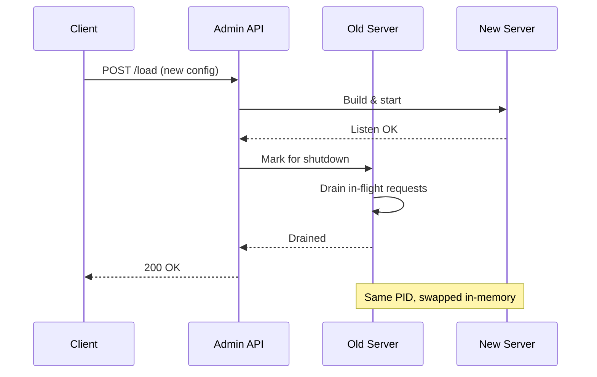

# Caddy Admin API와 JSON 설정

Caddy를 처음 쓸 때는 대부분 Caddyfile로 시작한다. 짧고 읽기 좋아서 좋지만, 운영하다 보면 Caddyfile만으로는 답이 안 나오는 순간이 온다. 라우트 하나만 동적으로 바꾸고 싶거나, 외부 컨트롤 플레인에서 설정을 주입하고 싶거나, A/B 테스트용으로 업스트림 비율을 실시간 조정하고 싶을 때다. 이런 경우 Caddy의 진짜 인터페이스는 Caddyfile이 아니라 Admin API라는 사실을 알게 된다.

이 문서는 Admin API를 운영 관점에서 정리한다. JSON 설정의 구조, Caddyfile이 내부적으로 변환되는 과정, 런타임 reload 동작, 그리고 admin 엔드포인트를 외부에 노출시켰을 때 어떤 일이 벌어지는지까지 다룬다.

## Caddyfile은 결국 JSON으로 변환된다

Caddy의 본체는 JSON 설정을 받아들이는 엔진이다. Caddyfile은 그 위에 얹은 어댑터(adapter)일 뿐이다. `caddy run`을 실행하면 내부적으로 Caddyfile을 파싱해서 JSON으로 바꾼 다음, 그 JSON을 Admin API의 `/load` 엔드포인트로 POST 한다. 즉 우리가 Caddyfile에 쓴 한 줄짜리 `reverse_proxy`는 결국 수십 줄짜리 JSON 객체로 펼쳐진다.

이걸 직접 확인해 보면 Caddy의 동작을 이해하기 훨씬 쉽다.

```bash
# Caddyfile을 JSON으로 변환만 하고 출력
caddy adapt --config Caddyfile --pretty
```

예를 들어 다음과 같은 단순한 Caddyfile을 변환하면

```caddyfile
example.com {
    reverse_proxy localhost:8080
}
```

다음과 같은 JSON이 나온다.

```json
{
  "apps": {
    "http": {
      "servers": {
        "srv0": {
          "listen": [":443"],
          "routes": [
            {
              "match": [{"host": ["example.com"]}],
              "handle": [
                {
                  "handler": "subroute",
                  "routes": [
                    {
                      "handle": [
                        {
                          "handler": "reverse_proxy",
                          "upstreams": [{"dial": "localhost:8080"}]
                        }
                      ]
                    }
                  ]
                }
              ],
              "terminal": true
            }
          ]
        }
      }
    }
  }
}
```

Caddyfile은 이런 구조를 사람이 쓰기 편하게 압축한 표기법이라고 생각하면 된다. 모든 기능은 결국 JSON 어딘가에 매핑된다. Caddyfile에는 없지만 JSON에는 있는 기능도 꽤 있어서, 복잡한 라우팅이나 조건부 매칭이 필요해지면 결국 JSON을 직접 만져야 하는 시점이 온다.

이 변환 과정의 중요한 의미는 두 가지다. 첫째, Caddyfile로 한 모든 작업은 본질적으로 JSON 설정에 대한 작업이다. 둘째, Caddy의 정체성은 "설정을 받아 즉시 적용하는 HTTP 서버"이지 "Caddyfile을 읽는 서버"가 아니다.

## Admin 엔드포인트의 기본 동작

Caddy를 실행하면 별도 설정 없이도 `localhost:2019`에 Admin API가 뜬다. 처음 보면 "이게 왜 켜져 있지?" 싶지만, Caddy의 모든 reload, 상태 조회, 동적 변경이 이 API를 통해 이루어지기 때문에 끄면 운영이 사실상 불가능해진다. `caddy reload`라는 CLI 명령조차 내부적으로는 Admin API의 `/load`를 호출하는 래퍼다.

엔드포인트는 크게 세 종류로 나뉜다.

`/load`는 전체 설정을 한 번에 교체한다. POST 본문으로 JSON을 보내면 기존 설정을 통째로 갈아엎고 새 설정으로 reload 한다. Caddyfile을 쓰는 경우 `caddy reload`가 이걸 호출한다.

`/config/...`는 설정 트리의 특정 경로에 대해 부분 조작이 가능하다. 예를 들어 `GET /config/apps/http/servers/srv0`은 srv0 서버의 현재 설정을 반환하고, `PATCH /config/apps/http/servers/srv0/routes/0`은 첫 번째 라우트만 교체한다. JSON Pointer 방식으로 트리의 임의 노드를 다룰 수 있어서, 전체 reload 없이 라우트 한 줄만 바꾸는 게 가능하다.

`/id/...`는 `@id` 태그를 붙인 노드에 직접 접근하는 단축 경로다. 트리 구조가 복잡하면 `/config/apps/http/servers/srv0/routes/3/handle/0/upstreams` 같은 길이로 늘어나는데, `@id`를 쓰면 그 노드에 임의의 이름을 붙여서 `/id/my-upstream`처럼 짧게 호출할 수 있다.

```bash
# 현재 전체 설정 조회
curl localhost:2019/config/

# 특정 경로의 설정만 조회
curl localhost:2019/config/apps/http/servers/srv0/routes

# 전체 설정 교체
curl -X POST localhost:2019/load \
    -H "Content-Type: application/json" \
    -d @new-config.json
```

## 무중단 reload의 실체

Caddy의 reload는 SIGHUP을 받거나 마스터 프로세스를 재시작하는 방식이 아니다. Admin API로 새 설정을 받으면, Caddy는 새 설정으로 새 서버 인스턴스를 만들어 메모리상에서 구동한다. 새 서버가 정상적으로 listen에 성공하면 그 시점부터 트래픽을 새 서버가 받기 시작하고, 기존 서버는 진행 중이던 요청을 다 처리한 뒤 graceful shutdown 한다. 프로세스는 같은 PID를 유지한다.

이 방식 때문에 reload 중에 connection refused가 나는 일이 거의 없다. 단, 주의해야 할 케이스가 몇 가지 있다.

새 설정이 invalid 하거나 listen 포트가 점유되어 있어서 새 서버 구동에 실패하면, Caddy는 그 reload를 거부하고 기존 설정을 그대로 유지한다. 이건 안전한 동작인데, 문제는 외부에서 "성공했나?" 확인을 안 하고 다음 작업을 진행하면 의도와 다른 상태로 운영될 수 있다는 점이다. CI/CD 파이프라인에서 `caddy reload`의 exit code를 반드시 체크해야 하고, HTTP API로 호출할 때도 200 응답을 확인해야 한다.

또 하나 자주 놓치는 부분은 TLS 인증서다. 새 설정에서 새로운 도메인이 추가되면 Caddy가 ACME challenge를 시도하는데, DNS가 아직 전파 안 됐거나 방화벽이 막혀 있으면 그 도메인의 인증서 발급에 실패한다. 이 경우 reload 자체는 성공하지만 해당 도메인은 한동안 TLS handshake 에러가 난다. 새 도메인을 추가할 때는 reload 직후 인증서 발급 로그를 확인하는 습관을 들이는 게 좋다.



## @id로 특정 라우트만 패치하기

운영 중에 흔히 마주치는 시나리오 하나. 마이크로서비스 중 하나의 업스트림 주소가 바뀌었다. 전체 설정을 reload 하기는 부담스럽고, 해당 라우트만 갱신하고 싶다. 이럴 때 `@id` 태그가 유용하다.

JSON 설정 어디에든 `@id` 필드를 붙일 수 있다. 예를 들어 reverse_proxy 핸들러에 id를 붙이면

```json
{
  "handler": "reverse_proxy",
  "@id": "user-service-upstream",
  "upstreams": [{"dial": "10.0.1.5:8080"}]
}
```

이후로는 이 노드를 `/id/user-service-upstream`으로 직접 접근할 수 있다.

```bash
# 업스트림 주소만 갱신
curl -X PATCH localhost:2019/id/user-service-upstream \
    -H "Content-Type: application/json" \
    -d '{
      "handler": "reverse_proxy",
      "@id": "user-service-upstream",
      "upstreams": [{"dial": "10.0.1.6:8080"}]
    }'
```

이 호출은 해당 노드만 교체하고 나머지 설정은 건드리지 않는다. reload는 똑같이 무중단으로 일어나지만 영향 범위가 좁아서 안전하다. 예전에 운영하던 서비스에서 deploy 마다 풀 reload를 돌렸더니 ACME 모듈이 매번 인증서 상태를 재검증하면서 이상한 에지 케이스가 발생한 적이 있는데, `@id` 패치로 바꾼 뒤로는 이런 문제가 사라졌다.

다만 `@id`는 같은 트리 안에서 유일해야 한다. 중복되면 어느 노드를 가리키는지 결정할 수 없어서 reload 자체가 거부된다. 또 `@id`로 PATCH/DELETE 한 변경 사항은 어디까지나 메모리상의 변경이라, Caddy를 재시작하면 원본 설정 파일의 내용으로 돌아간다. 영구 적용이 필요하면 외부 스토리지(예: Consul, etcd)에서 설정을 관리하면서 변경 시 원본도 함께 갱신하는 구조를 만들어야 한다.

## Admin 엔드포인트 보안

Caddy의 Admin API는 인증이 없다. 일부러 그렇게 설계됐다. 기본 바인딩이 `localhost:2019`인 것도 같은 이유다. 같은 머신에서 접근할 수 있는 사람은 이미 신뢰된 사용자라는 가정을 깔고 있다.

문제는 이 가정이 깨지는 순간이다. Admin API는 `/load`로 전체 설정을 교체할 수 있고, 이는 곧 Caddy를 임의의 백엔드로 프록시 시킬 수 있다는 의미다. Admin API에 외부에서 접근 가능해지면 그 Caddy 인스턴스는 사실상 공격자에게 점유된 것과 같다. 임의의 도메인 인증서를 발급받게 만들거나, 내부 네트워크의 다른 서비스로 트래픽을 우회시키거나, 자기 자신을 죽이는 설정을 주입하는 것 모두 가능하다.

설정에서 admin을 명시적으로 다루는 방법은 두 가지다. Caddyfile의 글로벌 옵션으로 지정하거나

```caddyfile
{
    admin localhost:2019
    # 또는 완전히 끄려면
    # admin off
}
```

JSON에서 직접 지정한다.

```json
{
  "admin": {
    "listen": "unix//run/caddy/admin.sock"
  },
  "apps": { ... }
}
```

운영 환경에서는 Unix 도메인 소켓 바인딩을 권장한다. TCP 바인딩보다 권한 제어가 명확하고, 실수로 외부 인터페이스에 노출될 위험이 없다. 소켓 파일의 권한을 0600으로 두면 root나 caddy 유저만 접근할 수 있다.

```caddyfile
{
    admin unix//run/caddy/admin.sock
}
```

만약 원격에서 admin 접근이 꼭 필요한 상황(예: 외부 컨트롤 플레인에서 동적 설정 주입)이라면, admin 자체를 노출하지 말고 별도의 인증/인가 레이어를 앞단에 두는 구조를 만들어야 한다. 또 다른 Caddy 인스턴스를 앞에 세워서 mTLS와 ACL을 거친 요청만 admin 소켓으로 프록시하는 패턴이 자주 쓰인다. 이걸 admin 자체에 인증 모듈을 끼우는 식으로 해결하려는 시도를 본 적 있는데, 결국 같은 문제를 두 번 푸는 셈이라 권장하지 않는다.

## Docker 환경에서의 admin 노출 주의

Docker로 Caddy를 띄우는 경우 admin 노출 사고가 가장 많이 발생한다. 가장 흔한 실수는 Docker Compose 파일에서 별 생각 없이 다음과 같이 쓰는 것이다.

```yaml
services:
  caddy:
    image: caddy:2
    ports:
      - "80:80"
      - "443:443"
      - "2019:2019"  # 이게 문제다
```

2019 포트를 호스트로 매핑하면 호스트의 모든 인터페이스에 admin이 노출된다. 호스트가 클라우드 인스턴스고 보안 그룹이 잘못 열려 있으면 인터넷에 admin이 노출된다. 컨테이너 내부에서만 admin을 쓸 거면 포트 매핑을 아예 하지 않는 게 맞다.

또 다른 함정은 Docker의 기본 admin 바인딩이다. 공식 caddy 이미지에서는 admin이 `0.0.0.0:2019`로 listen 한다. 호스트 포트 매핑을 안 해도, 같은 Docker 네트워크에 있는 다른 컨테이너에서는 접근이 가능하다. 멀티테넌트 환경이거나 신뢰할 수 없는 컨테이너가 같은 네트워크에 있다면 이것 자체가 문제가 된다.

이 경우 Caddyfile에 명시적으로 listen 주소를 제한해야 한다.

```caddyfile
{
    admin 127.0.0.1:2019
}
```

또는 컨테이너 간 통신 없이 외부 도구만 admin을 써야 한다면, Unix 소켓을 호스트로 마운트하는 방식이 가장 안전하다.

```yaml
services:
  caddy:
    image: caddy:2
    volumes:
      - /run/caddy:/run/caddy
    # 포트 매핑 없음

  controller:
    image: my-controller
    volumes:
      - /run/caddy:/run/caddy:ro  # 소켓만 공유
```

소켓 파일을 통한 통신은 네트워크 레이어를 거치지 않아서 외부 노출 위험이 원천 차단된다.

## 실제로 admin이 노출됐을 때 벌어지는 일

운영하면서 admin이 외부 노출된 사례를 두 번 본 적이 있다. 한 번은 개발 단계에서 디버깅용으로 2019 포트를 잠깐 열어둔 게 그대로 production까지 올라간 경우였고, 다른 한 번은 Kubernetes에서 Service의 type을 LoadBalancer로 잘못 설정한 경우였다.

후자의 경우, 노출된 지 약 3시간 만에 admin이 누군가에게 발견됐다. 공격 패턴은 단순했다. `/load`로 새 설정을 주입해서 모든 트래픽을 자기네 서버로 프록시 시키고, 클라이언트가 보낸 헤더(쿠키 포함)를 자기네 로그로 수집하는 구조였다. 인증서는 Caddy가 자동으로 발급해 주니 TLS도 정상이었고, 사용자 입장에서는 평소처럼 우리 도메인에 접속했지만 데이터는 전부 가로채지고 있었다. 발견된 게 늦었다면 인증 토큰이 대량 유출됐을 상황이었다.

복구도 까다로웠다. 공격자가 admin을 다시 잠그도록 설정을 주입해 둬서, 우리가 다시 admin에 접근하려면 컨테이너를 강제 재시작해야 했다. 재시작 후에도 발급된 인증서들이 공격자 손에 있을 가능성이 있어서 모두 revoke하고 재발급해야 했다.

이 경험으로 두 가지 운영 원칙을 세웠다. 첫째, admin은 기본적으로 Unix 소켓 바인딩으로 두고, TCP 바인딩이 필요한 경우 의식적으로 결정하고 문서화한다. 둘째, 인프라 코드 레벨(Terraform, Helm, Compose)에서 2019 포트가 외부 노출되지 않도록 lint 룰을 만들어서 PR 시점에 차단한다. 사람의 주의력에만 의존하면 결국 한 번은 뚫린다.

## 정리

Admin API는 Caddy의 본체이고, Caddyfile은 그 위에 얹은 편의 레이어다. 운영 규모가 커지면 결국 JSON과 Admin API를 직접 다루게 되는데, 이때 가장 신경 써야 할 부분은 기능보다 보안이다. `@id`로 부분 패치하는 동적 설정이 강력한 만큼, 그 권한이 외부로 새는 순간의 피해도 즉각적이고 광범위하다. admin 바인딩은 항상 명시적으로 결정하고, 의심스러우면 Unix 소켓을 쓰는 쪽으로 기우는 게 안전하다.
