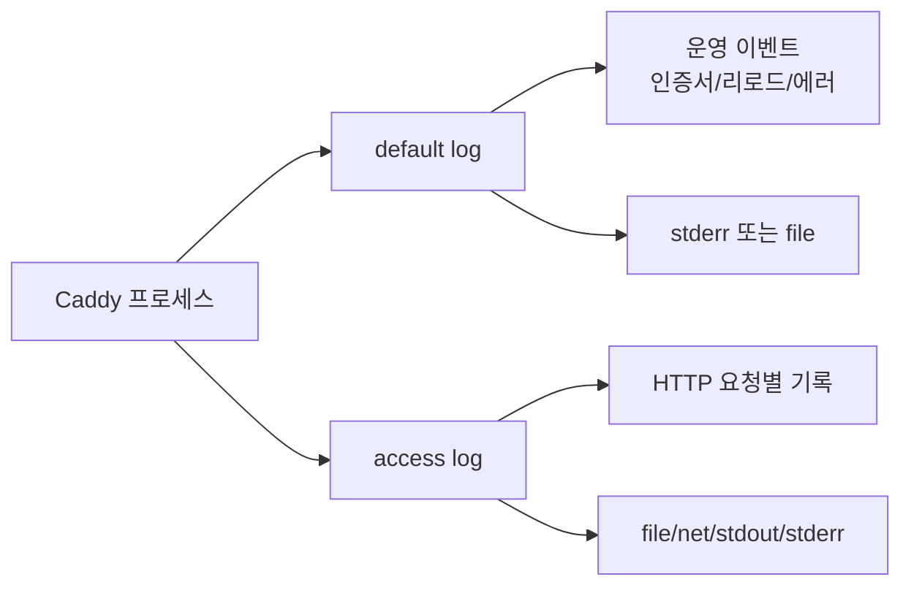

# Caddy 로깅과 관찰성

Caddy의 로깅 시스템은 zap 기반으로 동작한다. Nginx 시절에는 access.log와 error.log가 텍스트로 쌓이는 게 당연했는데, Caddy는 처음부터 구조화 로그를 염두에 두고 설계되어서 JSON 출력이 기본이다. 처음 옮겨온 사람들이 가장 헷갈려하는 부분이 이 지점이라, 어떤 로그가 어디로 흘러가는지부터 잡고 가야 한다.

운영하면서 가장 뼈아프게 배운 건 로그 자체가 시스템을 죽일 수 있다는 점이다. 트래픽이 평소의 10배 들어오는 이벤트 날, access log가 디스크를 채워서 Caddy 프로세스가 멈춘 적이 있다. 그 뒤로는 로그 설정을 단순히 "켜둔다"가 아니라 "어디에, 얼마나, 언제까지" 쌓을지 매번 따져보게 됐다.

## Caddy 로그의 두 가지 흐름

Caddy 로그는 크게 두 갈래로 나뉜다. 이 구분을 헷갈리면 access log를 켰는데 왜 안 나오지 하고 한참 헤맨다.

- **default log**: Caddy 자체의 동작 로그. 시작/종료, 인증서 갱신, 모듈 로드 실패, 설정 리로드 같은 운영 이벤트가 여기로 간다. `caddy run`을 실행하면 stderr로 쏟아지는 그 메시지들이다.
- **access log**: HTTP 요청별 로그. 요청 메서드, 경로, 응답 코드, 처리 시간 등이 들어간다. 이건 명시적으로 `log` 디렉티브를 켜야만 나온다.



처음 운영할 때 흔히 하는 실수가 default log만 보고 "요청은 왜 안 찍히지?" 하는 것이다. 별도로 `log` 디렉티브를 켜야 access log가 활성화된다는 점을 기억해야 한다.

## log 디렉티브로 access log 켜기

Caddyfile에서 access log를 켜는 가장 단순한 형태는 다음과 같다.

```caddyfile
example.com {
    log
    reverse_proxy localhost:3000
}
```

이렇게 하면 stdout으로 JSON 로그가 흘러나온다. 도커로 띄우면 `docker logs`에서 그대로 확인할 수 있다는 장점이 있지만, 운영 환경에서는 보통 파일로 떨어뜨린다.

```caddyfile
example.com {
    log {
        output file /var/log/caddy/example.com.access.log
        format json
        level INFO
    }
    reverse_proxy localhost:3000
}
```

`output`, `format`, `level`은 각각 별도의 하위 디렉티브다. 처음에는 한 줄에 다 쓰려고 하다가 파싱 에러를 만나기 쉽다.

## output 옵션 비교

`output`은 로그를 어디로 보낼지 결정한다. 실무에서 자주 쓰는 옵션은 네 가지다.

### file

가장 흔하게 쓰는 형태다. 로그 로테이션이 내장되어 있어서 logrotate를 따로 걸 필요가 없다.

```caddyfile
log {
    output file /var/log/caddy/access.log {
        roll_size 100MiB
        roll_keep 10
        roll_keep_for 720h
    }
}
```

`roll_size`는 파일 하나의 최대 크기, `roll_keep`은 보관할 압축 파일 개수, `roll_keep_for`는 보관 기간이다. 운영하면서 한 가지 주의할 점이 있는데, Caddy의 내장 로테이션은 lumberjack 라이브러리 기반이라 외부에서 파일을 mv해버리면 동작이 꼬인다. logrotate랑 같이 쓰면 안 된다.

### net

원격 서버(syslog, fluentd 같은)로 직접 전송한다.

```caddyfile
log {
    output net tcp/log-collector.internal:514 {
        dial_timeout 5s
    }
    format json
}
```

겉으로 보면 깔끔하지만 실제로 운영하면 권장하지 않는다. 수신 서버가 죽으면 Caddy 자체에 백프레셔가 걸린다. 로그 수집 서버 장애가 웹 서버 장애로 번지는 셈이다. 보통은 file로 떨어뜨린 뒤 별도 에이전트(Promtail, Filebeat, Fluent Bit)가 읽어가는 구조를 선호한다.

### stdout / stderr

컨테이너 환경에서 표준 출력으로 보내는 형태다. Kubernetes에서는 이게 사실상 기본이다. 노드의 로그 드라이버가 알아서 수집해주기 때문에 Caddy는 그냥 stdout으로만 뱉으면 된다.

```caddyfile
log {
    output stdout
    format json
}
```

### discard

로그를 버린다. 헬스체크 경로처럼 의미 없는 요청을 빼고 싶을 때 매처와 조합해 쓴다.

## format: json vs console

`format`은 로그의 표현 방식을 정한다.

```caddyfile
log {
    output file /var/log/caddy/access.log
    format json
}
```

`json`은 기본값이고 한 줄당 하나의 JSON 객체로 떨어진다. 필드는 다음과 같이 생겼다.

```json
{
  "level": "info",
  "ts": 1714720000.123,
  "logger": "http.log.access",
  "msg": "handled request",
  "request": {
    "remote_ip": "1.2.3.4",
    "method": "GET",
    "host": "example.com",
    "uri": "/api/users",
    "headers": {"User-Agent": ["curl/7.84.0"]}
  },
  "duration": 0.0123,
  "status": 200,
  "size": 1234
}
```

`console`은 사람이 읽기 좋게 색상이 들어간 텍스트 형태로 출력된다.

```caddyfile
log {
    format console
}
```

운영 환경에서는 거의 항상 json을 쓴다. console은 로컬 개발이나 임시 디버깅용이다. JSON으로 떨어진 로그는 Loki, Elasticsearch, BigQuery 어디로 보내든 그대로 파싱이 되는데 console은 그게 안 된다.

JSON 포맷은 추가 옵션도 받는다.

```caddyfile
log {
    format json {
        time_format iso8601
        time_key timestamp
        message_key message
    }
}
```

`time_format`을 `iso8601`로 바꾸면 Unix timestamp 대신 사람이 읽을 수 있는 형태가 된다. Loki 같은 데서는 어차피 ts 필드를 따로 다루지만, 텍스트 검색할 때는 iso8601이 훨씬 편하다.

## 로그 레벨과 sampling

`level`은 어느 수준 이상의 로그를 출력할지 정한다.

```caddyfile
log {
    level INFO
}
```

선택지는 `DEBUG`, `INFO`, `WARN`, `ERROR`, `PANIC`, `FATAL`이다. access log는 보통 INFO로 찍히고, 4xx는 INFO, 5xx는 ERROR로 분류된다. DEBUG로 떨어뜨리면 헤더 전체나 매칭 과정 같은 상세한 정보가 나오는데, 트래픽 많은 서비스에서 켜두면 디스크가 폭발한다.

특정 로거만 레벨을 다르게 주는 것도 가능하다. global 옵션에서 설정한다.

```caddyfile
{
    log default {
        level WARN
    }
    log access_log_only {
        include http.log.access
        output file /var/log/caddy/access.log
        level INFO
    }
}
```

이렇게 하면 default 로거는 WARN 이상만 찍고, access log는 별도 파일로 INFO부터 찍는 구조가 된다.

### Sampling

요청량이 많을 때는 sampling을 걸어서 일부만 기록할 수 있다. 정확히 표현하면 zap의 sampling 메커니즘인데, 같은 메시지가 짧은 시간 안에 반복될 때 일정 개수 이후로는 버린다.

```caddyfile
log {
    output file /var/log/caddy/access.log
    format json
    level INFO
    sampling {
        interval 1s
        first 100
        thereafter 10
    }
}
```

`interval` 동안 처음 `first`개는 모두 찍고, 그 이후로는 `thereafter`개마다 하나씩만 찍는다. 위 예시는 1초당 처음 100개는 그대로 찍고, 이후엔 10개당 1개꼴로 찍는다.

운영하면서 sampling을 쓸 때 주의할 점이 있다. 에러 로그까지 sampling되면 디버깅이 어려워진다. 가능하면 access log와 error log를 분리해서 access만 sampling하는 게 안전하다.

## 매처로 특정 host/path만 로깅

전부 다 로깅하면 disk usage가 부담스러울 때가 있다. 헬스체크처럼 의미 없는 요청은 빼고, 특정 경로만 별도 파일로 떨어뜨리는 식의 분기가 자주 필요하다.

```caddyfile
example.com {
    @healthcheck path /healthz /readyz
    log @healthcheck {
        output discard
    }
    
    @api path /api/*
    log @api {
        output file /var/log/caddy/api.access.log
        format json
    }
    
    log {
        output file /var/log/caddy/general.access.log
        format json
    }
    
    reverse_proxy localhost:3000
}
```

매처는 위에서 아래로 평가되는 게 아니라, 매처별로 별도 로거가 만들어진다. 그래서 위 예시처럼 헬스체크는 discard, API는 별도 파일, 나머지는 일반 로그로 가는 분기가 가능하다.

다만 동일 요청이 여러 매처에 걸리면 여러 로그에 다 찍힌다. `/api/healthz`로 들어오면 @healthcheck도 매칭되고 @api도 매칭된다. 이런 경우는 매처 우선순위를 코드에서 따로 신경 써야 한다.

## errors 로그 분리

운영하면서 access log와 error 상황 로그를 한 파일에 섞으면 알림 걸기가 까다로워진다. 5xx만 따로 떨어뜨리는 게 좋다.

```caddyfile
example.com {
    log access {
        output file /var/log/caddy/access.log
        format json
        level INFO
    }
    
    @errors expression {http.response.status_code} >= 500
    log @errors errors_only {
        output file /var/log/caddy/errors.log
        format json
        level INFO
    }
    
    reverse_proxy localhost:3000 {
        @backend_down status 502 503 504
        handle_response @backend_down {
            respond "Backend unavailable" 503
        }
    }
}
```

5xx 응답만 별도 파일로 빼두면 알림 시스템(예: 파일을 tail해서 Slack으로 보내는 스크립트)을 단순하게 짤 수 있다.

Caddy 자체의 default log(인증서 갱신 실패, 설정 에러 등)도 별도로 분리한다.

```caddyfile
{
    log default {
        output file /var/log/caddy/caddy.log {
            roll_size 50MiB
            roll_keep 5
        }
        format json
        level WARN
    }
}
```

이걸 모니터링하면 Let's Encrypt 갱신 실패 같은 이벤트를 놓치지 않는다. 인증서 갱신은 만료 30일 전부터 시도하니까, 한 번 실패해도 여유는 있는데 그래도 알림은 받아야 한다.

## Prometheus 메트릭 노출

Caddy 2.x에는 `metrics` 디렉티브가 내장되어 있다. caddy-prometheus 같은 외부 모듈을 따로 설치할 필요가 없다.

```caddyfile
{
    servers {
        metrics
    }
}

example.com {
    reverse_proxy localhost:3000
}

:9090 {
    metrics /metrics
}
```

global 옵션의 `servers > metrics`를 켜면 요청 메트릭 수집이 활성화되고, 별도 서버 블록에서 `/metrics` 엔드포인트로 노출한다. 운영 환경에서는 이 9090 포트를 외부에 노출하면 안 된다. VPC 내부나 localhost로만 바인딩하고, Prometheus는 같은 네트워크에서 스크랩한다.

`:9090`은 어드민 API와 같은 머신에서 실행되니까 네트워크 정책으로 차단해줘야 한다. 메트릭 엔드포인트가 의도치 않게 외부에 열려서 정찰당한 사례가 실제로 있다.

노출되는 주요 메트릭은 다음과 같다.

- `caddy_http_requests_in_flight`: 현재 처리 중인 요청 수
- `caddy_http_request_duration_seconds`: 요청 처리 시간 히스토그램
- `caddy_http_request_size_bytes`: 요청 크기
- `caddy_http_response_size_bytes`: 응답 크기
- `caddy_http_requests_total`: 누적 요청 수 (status, method 라벨 포함)

인증서 관련 메트릭은 별도다.

- `caddy_certificates_managed`: 관리 중인 인증서 수
- `caddy_certificates_obtained_total`: 발급된 인증서 누적 수

레이턴시 SLO를 거는 식으로 활용하면 좋다.

```promql
histogram_quantile(0.99,
  sum(rate(caddy_http_request_duration_seconds_bucket[5m])) by (le, handler)
) > 1
```

99퍼센타일 응답이 1초를 넘으면 알림. handler 라벨로 reverse_proxy인지 file_server인지 구분된다.

## Loki/Grafana 연동

JSON 로그는 Loki와 잘 어울린다. Promtail 설정의 핵심은 JSON 파싱 단계다.

```yaml
scrape_configs:
  - job_name: caddy
    static_configs:
      - targets:
          - localhost
        labels:
          job: caddy
          __path__: /var/log/caddy/*.log
    pipeline_stages:
      - json:
          expressions:
            level: level
            status: 'request.host'
            method: 'request.method'
            host: 'request.host'
            uri: 'request.uri'
            duration: duration
            response_status: status
      - labels:
          level:
          method:
          host:
          response_status:
      - timestamp:
          source: ts
          format: Unix
```

여기서 주의할 점은 라벨 카디널리티다. `uri`나 `remote_ip`를 라벨로 빼면 카디널리티가 폭발해서 Loki가 죽는다. 라벨에는 method, status, host처럼 값이 제한된 것만 넣고, uri나 ip는 line 안에서 LogQL로 검색한다.

Grafana 대시보드에서는 보통 다음 쿼리들이 베이스가 된다.

```logql
# 5xx 비율
sum(rate({job="caddy"} | json | response_status >= 500 [1m]))
/
sum(rate({job="caddy"} | json [1m]))

# 특정 host의 요청 수
sum by (host) (rate({job="caddy"} | json [5m]))

# 특정 IP의 요청 추적
{job="caddy"} | json | request_remote_ip = "1.2.3.4"
```

JSON 파싱 stage가 매번 도는 게 부담이라면, structured_metadata로 한번에 추출하는 방식도 있다. Loki 3.x 이상에서 가능하다.

## 사고 사례: 디스크가 차서 로그가 멈춘 날

이게 진짜 운영하면 한 번씩 겪는 일이다. 어떤 서비스에서 트래픽 이벤트가 있었는데, 평소 1GB/일 정도 쌓이던 access log가 그날 50GB가 쌓였다. 디스크는 100GB짜리였고, 다른 로그도 같이 쓰고 있어서 90% 차고 있었던 상태였다.

증상은 이랬다.

1. 03:00경 디스크 사용률 99% 도달
2. Caddy의 lumberjack 라이브러리가 새 로그 파일 생성 실패
3. zap의 buffer가 차기 시작
4. 로그 쓰기가 블로킹되면서 일부 워커가 멈춤
5. 응답 지연 증가 → 헬스체크 실패 → ALB가 인스턴스 빼버림
6. 결국 5분 정도 사이트가 다운

원인을 정리하면 이렇다.

- `roll_keep_for`만 설정하고 `roll_size`를 설정하지 않아서 파일 하나가 무한정 커짐
- 디스크 사용률 알림은 80%에 걸려 있었는데, 폭증 속도가 빨라서 알림 받고 대응할 시간이 없었음
- 모니터링 시스템이 같은 디스크에 로그를 쌓고 있어서 알림조차 늦게 발사됨

이후로는 다음 원칙을 지킨다.

**로그는 별도 디스크/볼륨에 격리한다.** root 디스크에 로그를 쌓으면 디스크 풀일 때 OS 자체가 흔들린다. /var/log/caddy를 별도 EBS 볼륨이나 별도 파티션으로 분리한다.

**roll_size를 반드시 명시한다.** 단일 파일 크기는 100MiB~500MiB 사이로 제한한다. 파일이 너무 작으면 파일 수가 폭발하고, 너무 크면 grep 같은 도구가 느려진다.

**디스크 알림은 절대량과 증가율 둘 다 본다.** 사용률 80%만 보면 폭증 시 못 잡는다. "1시간에 5GB 이상 증가"같은 rate 기반 알림을 같이 건다.

**고트래픽 경로는 sampling을 건다.** 로그인 안 한 사용자가 보는 페이지처럼 패턴이 정해진 요청은 100% 다 찍을 필요 없다. 1/10이나 1/100만 찍어도 충분하다.

**로그 수집기까지 포함해서 backpressure를 검증한다.** Promtail이 못 읽어가면 파일이 쌓인다는 점을 잊지 말아야 한다. Caddy의 로테이션은 시간/크기 기반인데, 수집이 느리면 rotated 파일이 삭제되기 전까지 버틸 수 있는 디스크 여유가 있어야 한다.

```caddyfile
log {
    output file /var/log/caddy/access.log {
        roll_size 200MiB
        roll_keep 20
        roll_keep_for 168h
    }
    format json
    level INFO
    sampling {
        interval 1s
        first 200
        thereafter 50
    }
}
```

이 설정 기준으로 보면 access log는 최대 4GB(200MiB × 20)에서 잘리고, 168시간(7일)이 지나면 자동 삭제된다. sampling으로 폭증 시에도 디스크 증가율이 통제된다.

## 정리

Caddy 로깅은 처음에는 단순해 보이는데 운영하면 신경 쓸 게 꽤 많다. JSON 기본 출력, 매처 기반 분기, 내장 로테이션, sampling 같은 기능이 다 있어서 별도 미들웨어 없이도 쓸 만하다. 다만 default log와 access log의 구분, 디스크 격리, sampling 기준 같은 것들은 구축 단계에서 잡아두지 않으면 사고로 이어진다.

메트릭 쪽도 metrics 디렉티브로 충분히 노출되니까 별도 exporter를 띄울 필요가 없다. Loki와 Grafana로 연결할 때는 라벨 카디널리티를 신경 써야 한다는 점만 기억하면 된다.
