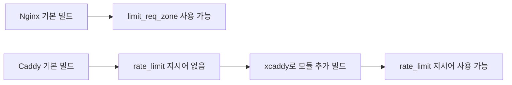

## Caddy가 자동으로 해주는 것과 안 해주는 것

Caddy를 쓰다 보면 HTTPS가 자동으로 붙는 게 인상적이라 "rate limiting도 알아서 해주겠지" 하고 넘어가는 경우가 많다. 결론부터 말하면 Caddy는 rate limiting을 자동으로 처리해주지 않는다. 기본 바이너리에 포함된 것과 아닌 것을 헷갈리면 운영 환경에서 예상치 못한 트래픽 폭주를 그대로 맞게 된다.

Caddy가 기본 설치만으로 처리해주는 항목은 다음 세 가지다.

- **Let's Encrypt를 통한 인증서 자동 발급 및 갱신** — `tls` 지시어 없이도 도메인만 맞으면 된다
- **HTTP → HTTPS 자동 리다이렉트** — 80번 포트 요청을 443으로 돌려준다
- **HSTS 헤더 자동 설정** — `Strict-Transport-Security`를 기본으로 붙여준다

반면 다음 기능들은 "웹서버니까 당연히 되겠지" 싶은데 기본 빌드에 들어있지 않다.

- **Rate limiting (429 Too Many Requests)** — 별도 모듈 빌드 필요
- **WAF (Web Application Firewall)** — coraza-caddy 같은 모듈 추가 필요
- **DDoS 방어** — L7 레벨 기본 보호 없음. Cloudflare 같은 앞단 서비스나 별도 모듈 필요
- **IP geo-blocking** — geoip 모듈 별도 빌드
- **bot 차단** — 커스텀 matcher나 모듈 구성 필요

이 구분이 명확하지 않으면 "HTTPS가 되니까 나머지도 되겠지" 하고 프로덕션에 올렸다가 단일 클라이언트가 초당 수천 요청을 때려도 아무런 제한이 걸리지 않는 상황을 맞는다.

## Nginx와의 근본적인 차이

Nginx는 rate limiting이 코어에 내장돼 있다. `limit_req_zone`, `limit_req`, `limit_conn` 지시어가 기본 빌드에 포함되어 있어 `apt install nginx` 직후 설정 파일만 수정하면 바로 쓸 수 있다.

Caddy의 공식 rate limiting 모듈은 `github.com/mholt/caddy-ratelimit`이라는 커뮤니티(Matt Holt 본인이 관리) 모듈로 존재한다. 공식 빌드에는 들어있지 않다. 이 철학적 차이는 Caddy의 설계 방향과 맞물려 있다. Caddy는 코어를 작게 유지하고 필요한 기능은 xcaddy로 빌드해서 쓰는 구조다. 플러그인 시스템이 정적 컴파일 기반이라 동적 로딩이 아니라는 점도 중요하다.



실무 관점에서 이 차이가 의미하는 것은 세 가지다. 첫째, Caddy를 패키지 매니저로 설치한 상태에서는 rate limiting을 쓸 수 없다. 둘째, Docker 이미지를 쓴다면 공식 이미지를 그대로 못 쓰고 커스텀 빌드 이미지가 필요하다. 셋째, CI/CD 파이프라인에 xcaddy 빌드 단계가 추가되어야 한다.

## xcaddy로 rate limit 모듈 빌드

xcaddy는 Caddy 공식 빌드 도구로, 원하는 플러그인을 포함한 커스텀 바이너리를 만들어준다.

```bash
# xcaddy 설치
go install github.com/caddyserver/xcaddy/cmd/xcaddy@latest

# rate limit 모듈 포함 빌드
xcaddy build \
  --with github.com/mholt/caddy-ratelimit

# 여러 모듈 동시 추가
xcaddy build \
  --with github.com/mholt/caddy-ratelimit \
  --with github.com/caddy-dns/cloudflare \
  --with github.com/WeidiDeng/caddy-cloudflare-ip
```

빌드가 끝나면 현재 디렉토리에 `caddy` 바이너리가 생긴다. 이 바이너리가 rate limiting 지시어를 인식한다. 기존 `/usr/bin/caddy`를 덮어쓰거나 별도 경로에 두고 systemd 서비스 파일의 `ExecStart`를 수정해서 쓴다.

빌드 시 주의할 점이 있다. Go 버전이 모듈 요구 버전과 맞아야 한다. 최근 caddy-ratelimit은 Go 1.21 이상을 요구한다. 낡은 빌드 환경에서 xcaddy를 돌리면 원인 모를 컴파일 오류가 나는데, 대부분 Go 버전 문제다.

## Caddyfile에서 rate_limit 설정

가장 단순한 IP 기반 설정은 다음과 같다.

```caddyfile
{
    order rate_limit before basicauth
}

example.com {
    rate_limit {
        zone dynamic_ip {
            key {remote_host}
            events 100
            window 1m
        }
    }

    reverse_proxy backend:3000
}
```

`order rate_limit before basicauth`는 전역 옵션으로, 지시어 실행 순서를 지정한다. Caddy는 일부 지시어만 기본 순서가 정의되어 있고, 외부 모듈은 직접 순서를 지정해야 한다. 이걸 빼먹으면 "directive order not defined" 에러가 나면서 Caddy가 시작조차 안 된다.

`zone`은 rate limit을 적용할 단위 구간이다. 여러 zone을 정의해서 각기 다른 정책을 둘 수 있다. `key`는 카운팅 기준이다. `{remote_host}`는 클라이언트 IP, `{header.X-API-Key}`는 헤더 값, `{query.token}`은 쿼리 파라미터를 기준으로 삼는다. `events`는 윈도우 내 허용 요청 수, `window`는 시간 구간이다.

### API 키 기반 제한

```caddyfile
api.example.com {
    rate_limit {
        zone per_api_key {
            key {header.X-API-Key}
            events 1000
            window 1h
        }
        
        zone per_ip {
            key {remote_host}
            events 10000
            window 1h
        }
    }

    reverse_proxy api_backend:8080
}
```

두 zone이 동시에 적용되어 둘 중 하나라도 초과하면 429를 반환한다. API 키가 없는 요청은 `per_api_key` zone의 key가 빈 문자열이 되어 모두 같은 카운터를 공유하게 되는데, 이게 문제가 될 수 있다. 키가 없으면 제한을 걸지 않거나 별도 처리하려면 matcher를 쓴다.

```caddyfile
api.example.com {
    @has_key header X-API-Key *
    
    rate_limit @has_key {
        zone per_api_key {
            key {header.X-API-Key}
            events 1000
            window 1h
        }
    }

    reverse_proxy api_backend:8080
}
```

### 엔드포인트별 세분화

로그인 같은 민감한 엔드포인트는 더 엄격한 제한이 필요하다.

```caddyfile
example.com {
    @login path /api/auth/login
    
    rate_limit @login {
        zone login_attempts {
            key {remote_host}
            events 5
            window 1m
        }
    }

    rate_limit {
        zone general {
            key {remote_host}
            events 600
            window 1m
        }
    }

    reverse_proxy backend:3000
}
```

## 429 응답 커스터마이징

기본 동작은 제한 초과 시 HTTP 429와 `Retry-After` 헤더를 반환한다. `Retry-After` 값은 윈도우가 리셋될 때까지 남은 초다. 응답 본문이나 헤더를 바꾸려면 `handle_errors` 블록을 쓴다.

```caddyfile
example.com {
    rate_limit {
        zone api {
            key {remote_host}
            events 100
            window 1m
        }
    }

    handle_errors {
        @ratelimited expression `{err.status_code} == 429`
        
        handle @ratelimited {
            header Content-Type "application/json"
            header X-RateLimit-Policy "100 requests per minute"
            respond `{"error": "rate_limit_exceeded", "retry_after": {http.response.header.Retry-After}}` 429
        }
    }

    reverse_proxy backend:3000
}
```

JSON API라면 이런 식으로 구조화된 에러 응답을 내보내는 게 클라이언트 처리에 편하다. Nginx의 `limit_req_status`와 유사한 역할이다.

## 분산 환경과 스토리지

기본 rate limit 스토리지는 메모리 기반이다. 프로세스가 재시작되면 카운터가 전부 초기화된다. 단일 인스턴스 환경에서는 문제가 없지만, 다음 상황에서는 골치 아픈 이슈가 된다.

- **Caddy를 여러 인스턴스로 띄운 경우** — 각 인스턴스가 독립 카운터를 가진다. 로드밸런서가 라운드로빈으로 분배하면 N개 인스턴스일 때 실질 허용 요청 수가 N배가 된다
- **무중단 배포 시 프로세스 재시작** — 카운터가 초기화되어 차단됐던 IP가 다시 풀려난다
- **systemd 재시작이나 Docker 컨테이너 재생성** — 동일한 문제

caddy-ratelimit 모듈은 분산 스토리지를 Redis로 지원한다. 설정은 다음과 같다.

```caddyfile
{
    order rate_limit before basicauth
    
    storage redis {
        address redis:6379
        password "${REDIS_PASSWORD}"
        db 0
    }
}

example.com {
    rate_limit {
        distributed {
            read_interval 5s
            write_interval 5s
        }
        
        zone api {
            key {remote_host}
            events 100
            window 1m
        }
    }

    reverse_proxy backend:3000
}
```

`distributed` 블록은 인스턴스 간 카운터 동기화 간격을 지정한다. `read_interval`은 다른 인스턴스의 카운터를 읽어오는 주기, `write_interval`은 자신의 카운터를 쓰는 주기다. 간격이 짧을수록 정확하지만 Redis 부하가 커진다. 실무에서는 5~10초 정도가 무난하다.

주의할 점은 이 동기화가 완벽한 atomic이 아니라는 것이다. `write_interval` 사이에 각 인스턴스가 로컬에서 카운팅하다가 주기마다 병합하는 방식이라, 순간적인 버스트는 N배까지 허용될 수 있다. 엄격한 글로벌 카운팅이 필요하면 애플리케이션 레벨에서 처리하거나 별도 API Gateway를 앞에 두는 편이 낫다.

## Docker 환경에서 커스텀 빌드

공식 Caddy Docker 이미지에는 rate limit 모듈이 없다. Dockerfile에서 multi-stage build로 커스텀 이미지를 만든다.

```dockerfile
FROM caddy:2.7-builder AS builder

RUN xcaddy build \
    --with github.com/mholt/caddy-ratelimit \
    --with github.com/caddy-dns/cloudflare

FROM caddy:2.7-alpine

COPY --from=builder /usr/bin/caddy /usr/bin/caddy
```

`caddy:2.7-builder` 이미지에는 xcaddy와 Go 빌드 환경이 포함되어 있어 별도 설정 없이 `xcaddy build`를 실행할 수 있다. 최종 이미지는 가벼운 alpine 기반으로 바이너리만 복사한다.

빌드 시간이 길면 CI가 느려진다. docker buildx의 cache-to/cache-from을 활용하거나, 모듈 조합이 자주 바뀌지 않는다면 빌드된 이미지를 내부 레지스트리에 올려두고 재사용하는 방식이 낫다.

## 프록시 뒤에서 실제 클라이언트 IP 추출

Caddy 앞에 Cloudflare나 AWS ALB, 사내 리버스 프록시가 있으면 `{remote_host}`는 프록시 IP가 된다. 모든 요청이 같은 IP로 인식되어 rate limit이 무의미해진다.

`trusted_proxies`를 설정해서 `X-Forwarded-For` 헤더를 신뢰하도록 해야 한다.

```caddyfile
{
    servers {
        trusted_proxies static 10.0.0.0/8 172.16.0.0/12 192.168.0.0/16
        client_ip_headers X-Forwarded-For
    }
}

example.com {
    rate_limit {
        zone api {
            key {client_ip}
            events 100
            window 1m
        }
    }

    reverse_proxy backend:3000
}
```

`{remote_host}` 대신 `{client_ip}`를 쓴다. `trusted_proxies`에 등록된 IP에서 오는 요청만 `X-Forwarded-For`를 파싱해 실제 클라이언트 IP를 추출한다. 신뢰하지 않는 IP에서 온 헤더는 무시한다. 이걸 제대로 설정하지 않으면 헤더 스푸핑으로 rate limit 우회가 가능하다.

Cloudflare 뒤에 있다면 `caddy-cloudflare-ip` 모듈을 써서 CF IP 대역을 자동으로 가져올 수 있다.

```caddyfile
{
    servers {
        trusted_proxies cloudflare {
            interval 12h
            timeout 15s
        }
        client_ip_headers CF-Connecting-IP
    }
}
```

## 화이트리스트와 예외 처리

특정 IP나 API 키는 rate limit에서 제외하고 싶은 경우가 많다. 사내 IP, 모니터링 봇, 프리미엄 고객 등이 해당한다.

```caddyfile
example.com {
    @internal {
        remote_ip 10.0.0.0/8 192.168.0.0/16
    }
    
    @premium {
        header X-Plan premium
    }
    
    @limited {
        not remote_ip 10.0.0.0/8 192.168.0.0/16
        not header X-Plan premium
    }
    
    rate_limit @limited {
        zone api {
            key {client_ip}
            events 100
            window 1m
        }
    }

    reverse_proxy backend:3000
}
```

matcher 조합으로 화이트리스트를 처리한다. `@limited` matcher에 해당하는 요청에만 rate limit을 적용하고, 나머지는 그대로 통과시킨다.

## 운영하면서 자주 마주치는 문제

**메모리 기반 카운터 초기화 문제** — 앞서 말한 대로 재시작하면 카운터가 날아간다. 공격 IP를 차단한 상태에서 배포하면 차단이 풀린다. 단기 차단은 Caddy로, 장기 차단(예: 24시간 이상)은 fail2ban이나 별도 스토리지에 IP를 기록하는 방식으로 이원화하는 게 현실적이다.

**멀티 인스턴스 카운터 동기화 지연** — Redis 기반 distributed mode를 쓰더라도 완벽한 동기화는 아니다. 글로벌 강제가 필요한 결제 API 같은 민감 엔드포인트는 애플리케이션 레벨이나 Redis의 `INCR`을 직접 쓰는 미들웨어로 처리한다.

**window 경계에서의 버스트** — `window 1m, events 100` 설정이면 이론상 59.99초에 100개, 60.01초에 또 100개를 쏘는 게 가능하다. 슬라이딩 윈도우가 아니라 고정 윈도우 동작이기 때문이다. 엄격한 제한이 필요하면 작은 window를 여러 개 겹쳐 쓰거나, token bucket 기반 모듈을 검토한다.

**proxy 헤더 누락으로 모든 요청이 같은 IP로 집계** — 앞단 프록시를 바꾸거나 구조가 변경될 때 자주 터진다. 배포 후 `/debug/client-ip` 같은 디버그 엔드포인트로 실제 IP가 잡히는지 확인하는 절차가 있어야 한다.

**xcaddy 빌드 환경 불일치** — 로컬에서는 되는데 CI에서 안 되는 경우가 많다. Go 버전, 모듈 버전, 네트워크 접근 등이 원인이다. Dockerfile에 빌드를 포함시켜 환경을 고정하는 게 재현성 측면에서 낫다.

## Nginx와의 지시어 비교

| 기능 | Nginx | Caddy (with caddy-ratelimit) |
|------|-------|------------------------------|
| 기본 제공 | O (코어 내장) | X (xcaddy 빌드 필요) |
| IP 기반 제한 | `limit_req_zone $binary_remote_addr` | `key {client_ip}` |
| 키 기반 제한 | `limit_req_zone $http_x_api_key` | `key {header.X-API-Key}` |
| zone 공유 메모리 | `zone=name:10m` | 메모리 기본, Redis 선택 |
| burst 허용 | `burst=20 nodelay` | 고정 윈도우 방식, burst 개념 없음 |
| 응답 코드 변경 | `limit_req_status 429` | `handle_errors` 블록 |
| 분산 카운터 | 기본 미지원 (모듈 필요) | `distributed` + Redis |
| 연결 수 제한 | `limit_conn` 별도 제공 | rate_limit 모듈 안에서 처리 불가, 별도 방식 |

Nginx의 `burst`와 `nodelay` 조합은 Caddy에 직접 대응되는 개념이 없다. Nginx는 token bucket 기반이라 순간적인 burst를 허용하면서 평균 rate를 유지할 수 있는데, caddy-ratelimit은 고정 윈도우 카운팅이라 이런 세밀한 제어가 어렵다. 세밀한 제어가 필요하면 Nginx가 여전히 유리한 영역이다.

## 무엇을 언제 쓸 것인가

Caddy의 rate limiting은 "단순한 IP 기반 제한이면 충분하고, HTTPS 자동화의 이점을 포기하고 싶지 않다" 정도의 요구에 맞다. 분산 환경에서 정밀한 제어, 복잡한 burst 정책, 연결 수 제한 등을 섞어야 하는 경우에는 Nginx나 전용 API Gateway(Kong, Tyk, Envoy 기반)를 쓰는 편이 낫다.

HTTPS와 rate limiting을 동시에 자동으로 처리해주는 웹서버를 찾는다면 아직 존재하지 않는다. Caddy는 전자는 해주지만 후자는 모듈 빌드라는 수동 단계가 필요하다는 점만 명확히 인식하면 된다.
