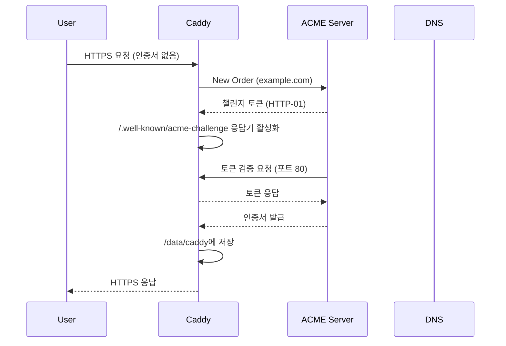

# Caddy SSL/TLS 심화

Caddy를 처음 띄우면 가장 놀라운 부분이 인증서 자동 발급이다. `example.com { respond "hi" }` 한 줄만 적고 80/443을 열어두면, 몇 초 뒤에 브라우저에서 자물쇠가 보인다. Nginx에서 certbot을 cron에 박아두던 시절을 생각하면 마법 같지만, 그 마법은 내부에서 ACME 프로토콜과 챌린지 응답기, 인증서 저장소, 자동 갱신 스케줄러가 맞물려 돌아간 결과다.

운영에 들어가면 이 마법이 실패하는 순간이 온다. 도메인 수백 개를 받는 멀티테넌트 서비스, 와일드카드가 필요한 사내 도메인, 외부 PKI에서 발급한 인증서를 그대로 써야 하는 케이스, 80번 포트가 막힌 환경. 이때 Caddy의 TLS 동작을 모르면 한 줄짜리 `tls` 디렉티브가 왜 안 먹는지 한참을 헤맨다. 이 문서는 그 내부 동작과 운영 시나리오를 정리한다.

## 자동 HTTPS의 내부 동작

Caddy가 `example.com`처럼 도메인 형태의 사이트 주소를 만나면 자동 HTTPS가 켜진다. 이때 일어나는 일은 대략 다음 순서다.

1. 시작 시점에 인증서 저장소(`$XDG_DATA_HOME/caddy` 또는 `/data/caddy`)에서 해당 도메인의 인증서를 찾는다.
2. 없으면 ACME 디렉터리(기본은 Let's Encrypt 운영망)에서 계정을 만들고 주문(order)을 생성한다.
3. ACME 서버가 챌린지 토큰을 내려주면 Caddy는 자기가 직접 챌린지 응답기를 띄워서 응답한다.
4. 검증이 끝나면 CSR을 만들어 인증서를 받아오고, 디스크에 저장한 뒤 메모리에 로드한다.
5. 만료 30일 전부터 백그라운드에서 갱신을 시도한다. 실패하면 백오프하면서 재시도한다.

여기서 중요한 점은 Caddy가 80번과 443번 포트를 자기가 직접 들고 있다는 사실이다. 챌린지 응답을 위해 별도 프로세스를 띄우거나 디렉토리에 파일을 떨구는 방식이 아니라, 자기 서버 안에서 라우팅으로 처리한다. 그래서 챌린지 시점에 포트 충돌이 나면 발급이 통째로 실패한다.



### ACME 챌린지 세 가지 비교

ACME에는 챌린지 방식이 여러 개 있고, Caddy는 HTTP-01, TLS-ALPN-01, DNS-01을 지원한다. 어떤 챌린지가 쓰이는지에 따라 운영 환경의 제약이 달라진다.

HTTP-01은 가장 흔하다. ACME 서버가 `http://도메인/.well-known/acme-challenge/토큰`을 GET 해서 응답을 본다. 즉 80번 포트가 외부에서 열려 있어야 한다. 사내망 뒤에 있거나 80번이 차단된 환경에서는 이 챌린지가 통과하지 못한다.

TLS-ALPN-01은 443번 포트로 TLS 핸드셰이크를 하면서 ALPN 확장에 `acme-tls/1`을 실어 보낸다. Caddy는 그 핸드셰이크를 가로채서 챌린지 응답을 인증서 형태로 내려준다. 80번이 막혀 있어도 443만 열려 있으면 동작한다. HTTP-01이 실패하면 Caddy는 자동으로 TLS-ALPN-01도 시도한다.

DNS-01은 도메인의 TXT 레코드에 토큰을 넣는 방식이다. 포트와 무관하게 동작하므로 사내 도메인이나 와일드카드 인증서에 필수다. 와일드카드(`*.example.com`)는 HTTP-01과 TLS-ALPN-01로는 발급이 안 된다. 무조건 DNS-01을 써야 한다. 단점은 DNS 제공자별로 API가 다르기 때문에 Caddy 본체에는 들어 있지 않고 플러그인을 따로 빌드해야 한다는 점이다.

선택 기준은 단순하다. 80번이 외부에 열려 있고 도메인 하나씩 발급받으면 HTTP-01, 80번이 막혔거나 LB 뒤에 있으면 TLS-ALPN-01, 와일드카드나 DNS만 통제 가능한 환경이면 DNS-01이다.

```caddy
example.com {
    tls {
        # DNS-01 강제 (와일드카드용)
        dns cloudflare {env.CLOUDFLARE_API_TOKEN}

        # 또는 특정 챌린지만 비활성화
        # issuer acme {
        #     disable_http_challenge
        # }
    }
}
```

### Let's Encrypt와 ZeroSSL 폴백

Caddy 2.0부터는 Let's Encrypt가 실패하면 ZeroSSL로 자동 폴백한다. 두 issuer가 기본값으로 등록돼 있어서, Let's Encrypt 쪽에서 rate limit에 걸리거나 일시적으로 응답이 느릴 때 ZeroSSL이 받아준다. ZeroSSL은 EAB(External Account Binding)가 필요한데, Caddy가 처음 시도할 때 자동으로 계정을 만들어 EAB credential을 받아오는 구조라 사용자가 따로 설정하지 않아도 된다.

운영에서 이 폴백이 의외로 중요하다. Let's Encrypt는 동일 도메인당 주당 50개 인증서, 동일 등록 도메인당 시간당 5개 실패 같은 rate limit이 있는데, CI/CD에서 같은 환경을 자주 띄우다 보면 의도치 않게 limit에 걸린다. 그러면 Caddy는 ZeroSSL로 넘어가서 발급을 끝낸다. 단, ZeroSSL도 자체 rate limit이 있고 발급 속도가 살짝 느리다. 두 issuer 모두 막히면 인증서가 안 나온다.

폴백 순서를 바꾸거나 한쪽만 쓰고 싶으면 `issuer`를 명시한다.

```caddy
{
    email admin@example.com
    acme_ca https://acme-v02.api.letsencrypt.org/directory
    # 또는 ZeroSSL만:
    # acme_ca https://acme.zerossl.com/v2/DV90
}
```

`email` 디렉티브는 Let's Encrypt 계정에 등록되는 연락처다. 만료 임박 알림이 여기로 오는데, Caddy가 자동 갱신하니 사실상 그 알림을 볼 일은 없다. 하지만 갱신이 30일 동안 실패하면 이메일이 오기 시작하므로 모니터링 채널로 받아두는 게 좋다.

## 인증서 저장소 구조와 백업

Caddy는 인증서, 계정 키, 메타데이터를 모두 한 디렉토리에 저장한다. 리눅스에서 systemd로 띄우면 보통 `/var/lib/caddy/.local/share/caddy/`이고, Docker 공식 이미지에서는 `/data/caddy/`다. 환경변수 `XDG_DATA_HOME`을 잡으면 위치를 옮길 수 있다.

구조는 대략 이렇다.

```
/data/caddy/
├── acme/
│   └── acme-v02.api.letsencrypt.org-directory/
│       ├── users/
│       │   └── default/
│       │       ├── default.key      # ACME 계정 키
│       │       └── default.json     # 계정 메타데이터
│       └── sites/
│           └── example.com/
│               ├── example.com.key  # 인증서 개인키
│               ├── example.com.crt  # 인증서 (체인 포함)
│               └── example.com.json # 메타데이터
├── locks/
└── ocsp/
```

이 디렉토리를 통째로 백업해두면 재설치할 때 인증서를 다시 발급받지 않아도 된다. 더 중요한 건 ACME 계정 키다. 계정 키가 있으면 인증서를 잃어버려도 같은 계정으로 다시 발급받을 수 있고, 계정에 묶인 rate limit 카운터도 유지된다. 계정 키를 잃어버리면 새 계정을 만들어야 하는데, 새 계정은 신규로 취급돼 rate limit이 처음부터 시작된다.

운영에서 가장 흔한 실수가 컨테이너로 띄우면서 `/data`를 볼륨으로 마운트하지 않는 것이다. 컨테이너를 재시작할 때마다 인증서를 다시 발급받게 되고, 그러다 rate limit에 걸린다. Docker로 띄울 때는 반드시 다음처럼 한다.

```bash
docker run -d --name caddy \
  -p 80:80 -p 443:443 \
  -v caddy_data:/data \
  -v caddy_config:/config \
  -v $PWD/Caddyfile:/etc/caddy/Caddyfile \
  caddy:2-alpine
```

`/data`와 `/config`는 분리돼 있다. `/data`가 인증서와 ACME 상태이고, `/config`는 자동 저장된 JSON 설정이다. 인증서 백업 관점에서는 `/data`만 챙기면 된다.

백업 주기는 도메인 수와 발급 빈도에 따라 다른데, 보통 매일 한 번 스냅샷 정도면 충분하다. 인증서는 90일짜리이고 30일 전부터 갱신되므로, 며칠 전 백업으로 복구해도 자동 갱신이 메워준다.

## 와일드카드 인증서와 DNS 플러그인

와일드카드 인증서(`*.example.com`)는 무조건 DNS-01 챌린지로만 발급된다. Caddy 본체에는 DNS 플러그인이 들어 있지 않으므로 `xcaddy`로 직접 빌드해야 한다.

```bash
# xcaddy 설치
go install github.com/caddyserver/xcaddy/cmd/xcaddy@latest

# Cloudflare 플러그인 포함해서 빌드
xcaddy build \
  --with github.com/caddy-dns/cloudflare

# 결과물: ./caddy 바이너리
./caddy version
```

Route53, Google Cloud DNS, Azure DNS, NS1, DigitalOcean 등 주요 제공자 모두 `caddy-dns/제공자명` 형태로 플러그인이 있다. 여러 개 동시에 넣어도 된다.

```bash
xcaddy build \
  --with github.com/caddy-dns/cloudflare \
  --with github.com/caddy-dns/route53
```

빌드한 바이너리를 `/usr/bin/caddy`에 덮어쓰면 systemd 서비스에서 그대로 쓸 수 있다. 패키지 매니저로 설치한 Caddy를 갱신하면 다시 본체로 돌아가버리니까, apt-mark hold 같은 걸로 패키지 업데이트를 막거나 빌드 스크립트를 별도 경로에 두고 PATH로 우선순위를 잡는다.

Caddyfile 설정은 다음과 같다.

```caddy
*.example.com {
    tls {
        dns cloudflare {env.CLOUDFLARE_API_TOKEN}
        propagation_timeout 2m
        propagation_delay 30s
    }

    @app1 host app1.example.com
    handle @app1 {
        reverse_proxy localhost:8001
    }

    @app2 host app2.example.com
    handle @app2 {
        reverse_proxy localhost:8002
    }
}
```

`propagation_timeout`은 DNS 레코드가 전파되기를 기다리는 최대 시간이고, `propagation_delay`는 레코드를 만든 뒤 검증을 시도하기 전 대기하는 시간이다. Cloudflare처럼 anycast로 빠르게 전파되는 곳은 30초면 충분하지만, 자체 DNS나 전파 느린 제공자는 1~2분으로 늘려야 한다. 여기서 timeout이 너무 짧으면 발급이 자꾸 실패한다.

API 토큰은 환경변수로 넣는 게 안전하다. systemd 서비스 파일의 `Environment=`나 `EnvironmentFile=`로 주입하고, 토큰 권한은 해당 zone의 DNS 편집 권한만 줘서 최소화한다.

## On-Demand TLS

멀티테넌트 SaaS처럼 사용자가 자기 도메인을 가져오는 경우(custom domain), 도메인 리스트가 동적으로 바뀐다. Caddyfile에 도메인을 미리 적어둘 수가 없으니 On-Demand TLS를 쓴다. 첫 요청이 들어올 때 TLS handshake 시점에 인증서를 발급한다.

```caddy
{
    on_demand_tls {
        ask http://localhost:9000/check
        interval 2m
        burst 5
    }
}

https:// {
    tls {
        on_demand
    }
    reverse_proxy localhost:8080
}
```

`ask` 엔드포인트가 핵심이다. Caddy는 새 도메인으로 발급을 시도하기 전에 이 엔드포인트로 GET 요청을 보낸다. URL 쿼리 `?domain=customer1.com` 형태로 도메인이 실리고, 응답 코드가 200이면 발급을 진행하고 그 외면 거부한다. 이게 없으면 임의의 호스트헤더로 들어오는 요청 모두에 대해 발급을 시도하게 되고, 공격자가 무작위 도메인을 던지면 ACME rate limit이 순식간에 소진된다.

ask 엔드포인트는 보통 자체 DB에서 "이 도메인이 우리 고객이 등록한 도메인인가"를 확인한다. Node.js로 간단히 만들면 다음과 같다.

```javascript
const express = require('express');
const app = express();

app.get('/check', async (req, res) => {
    const domain = req.query.domain;
    if (!domain) return res.status(400).end();

    // DB에서 customer_domains 테이블 조회
    const allowed = await db.query(
        'SELECT 1 FROM customer_domains WHERE domain = $1 AND status = $2',
        [domain, 'verified']
    );

    if (allowed.rowCount > 0) {
        res.status(200).end();
    } else {
        res.status(404).end();
    }
});

app.listen(9000);
```

쿼리는 가벼워야 한다. ask 엔드포인트가 느리면 핸드셰이크 자체가 늦어진다. 캐시를 한 단 두는 게 안전하다. 한 번 거부된 도메인을 잠깐 캐싱해서 같은 도메인이 반복 요청 와도 DB 부담을 안 주게 한다.

`interval`과 `burst`는 rate limit이다. 위 설정은 2분에 5개까지 새 인증서 발급을 허용한다는 뜻이다. 이게 ACME의 rate limit이 아니라 Caddy 자체의 throttle이다. 갑자기 트래픽이 폭주해서 동시에 많은 도메인이 발급을 시도하면 ACME 쪽에서 차단되니까, Caddy 단에서 한 번 더 막아준다. 신규 도메인 등록이 많은 서비스라면 burst를 올리고 interval을 줄여야 한다.

On-Demand TLS는 SNI 기반이라 클라이언트가 SNI를 보내지 않으면 동작하지 않는다. 요즘은 거의 모든 클라이언트가 SNI를 보내지만, 아주 오래된 클라이언트나 특정 라이브러리는 빼먹기도 한다. 그런 케이스는 인증서 자체가 매칭되지 않아 핸드셰이크가 실패한다.

## 내부 CA(tls internal)와 mkcert 비교

개발 환경이나 사내 서비스에서는 공인 인증서가 필요 없다. Caddy는 자체 CA를 띄워서 내부용 인증서를 발급할 수 있다.

```caddy
internal.local {
    tls internal
    respond "internal service"
}
```

이러면 Caddy가 루트 CA를 만들고, 그걸로 사이트 인증서에 서명한다. 루트 CA 인증서는 `/data/caddy/pki/authorities/local/root.crt`에 저장된다. 이 인증서를 OS 신뢰 저장소에 추가하면 브라우저가 자물쇠를 인정한다. Linux에서 Caddy를 root로 실행하면 자동으로 시스템 신뢰 저장소에 추가하려 시도한다.

mkcert와 비교하면 역할이 비슷하지만 사용 시점이 다르다. mkcert는 로컬 머신에서 인증서 파일을 미리 만들고, 그 파일을 nginx든 뭐든 갖다 쓰는 도구다. Caddy의 internal CA는 런타임에 자동으로 발급하고 갱신까지 처리한다. 개발자 머신 한 대에서 정적인 인증서 몇 개만 필요하면 mkcert가 편하고, 사내 서비스 여러 개를 동적으로 띄우는 환경이라면 Caddy의 internal CA가 운영이 단순하다.

내부 CA로 발급된 인증서는 기본 만료가 12시간이다. 짧지만 자동 갱신이 돌기 때문에 실제로는 문제가 안 된다. CI/CD에서 컨테이너를 매번 새로 띄우는 환경에 적합한 설정이다.

## 커스텀 CA 인증서 (사내 PKI)

사내 PKI가 따로 있고 거기서 발급한 ACME 호환 CA를 쓰는 경우가 있다. 예를 들어 step-ca나 Smallstep, HashiCorp Vault PKI, 사내에서 직접 운영하는 ACME 서버 같은 것들이다. 이 경우 `acme_ca`로 해당 CA의 ACME 디렉터리 URL을 지정한다.

```caddy
{
    acme_ca https://internal-ca.corp.example.com/acme/directory
    acme_ca_root /etc/ssl/certs/corp-root.pem
}

internal.corp {
    reverse_proxy localhost:8080
}
```

`acme_ca_root`는 사내 CA의 루트 인증서 PEM 파일 경로다. 이게 없으면 Caddy가 사내 ACME 서버에 TLS로 접속할 때 신뢰하지 못해서 실패한다.

CA에 EAB가 필요하면 `external_account` 블록을 추가한다.

```caddy
{
    acme_ca https://internal-ca.corp.example.com/acme/directory
    acme_eab {
        key_id ABCD1234
        mac_key base64encodedkey==
    }
}
```

## mTLS 클라이언트 인증

서버에 클라이언트 인증서를 요구하는 mTLS는 백오피스나 내부 API에서 자주 쓴다. Caddy는 `tls` 블록 안에서 `client_auth`로 설정한다.

```caddy
api.internal.example.com {
    tls {
        client_auth {
            mode require_and_verify
            trusted_ca_cert_file /etc/caddy/client-ca.pem
        }
    }
    reverse_proxy localhost:8080
}
```

`mode`는 다섯 가지가 있다.

- `request`: 클라이언트 인증서를 요청하지만 안 줘도 통과
- `require`: 인증서를 반드시 줘야 함, 검증은 안 함
- `verify_if_given`: 줬으면 검증, 안 줘도 통과
- `require_and_verify`: 인증서 필수 + 검증
- `require_and_verify`가 사실상 운영에서 쓰는 유일한 모드다

`trusted_ca_cert_file`은 클라이언트 인증서를 발급한 CA의 인증서다. 여기 있는 CA로 서명된 클라이언트 인증서만 허용된다. 여러 CA를 신뢰하려면 PEM 파일에 인증서를 이어붙이거나 `trusted_ca_cert` 블록을 여러 개 쓴다.

특정 인증서만 허용하려면 leaf 인증서 fingerprint로 화이트리스트할 수 있다.

```caddy
tls {
    client_auth {
        mode require_and_verify
        trusted_ca_cert_file /etc/caddy/client-ca.pem
        trusted_leaf_cert_file /etc/caddy/allowed-clients.pem
    }
}
```

mTLS 적용 후 백엔드 애플리케이션에서 누가 접속했는지 알아야 하면 reverse_proxy에서 헤더로 넘긴다.

```caddy
reverse_proxy localhost:8080 {
    header_up X-Client-Cert-CN {tls_client_subject}
    header_up X-Client-Cert-Serial {tls_client_serial}
}
```

Caddy 플레이스홀더에 클라이언트 인증서 정보가 노출돼 있다. 단, 백엔드가 이 헤더를 신뢰하려면 외부에서 직접 같은 헤더를 못 넣게 차단해야 한다. `header_up`은 기존 헤더를 덮어쓰지만, 잘못 설정하면 우회될 수 있으니 명시적으로 `header_up -X-Client-Cert-CN`으로 한 번 지운 뒤 다시 세팅하는 게 안전하다.

## OCSP Stapling과 must-staple

Caddy는 OCSP stapling을 기본으로 켜둔다. 인증서 발급 직후 CA의 OCSP 응답을 받아와 캐싱하고, TLS 핸드셰이크 때 인증서와 함께 전달한다. 클라이언트가 매번 CA에 OCSP 조회를 안 해도 되니 핸드셰이크가 빨라지고 프라이버시도 좋아진다.

OCSP 응답은 `/data/caddy/ocsp/`에 저장되고 만료 전에 자동 갱신된다. 갱신이 실패하면 stapling 없이 핸드셰이크는 계속 동작하지만, 클라이언트가 직접 OCSP 조회를 시도하게 된다.

Stapling을 끄고 싶으면 (보통 그럴 일은 없지만) 다음과 같이 한다.

```caddy
example.com {
    tls {
        issuer acme {
            disable_http_challenge
        }
    }
    # OCSP stapling 비활성화는 글로벌 옵션
}
```

```caddy
{
    ocsp_stapling off
}
```

must-staple 인증서는 인증서에 "이 인증서를 쓰려면 반드시 stapled OCSP 응답이 있어야 한다"는 확장이 박힌 인증서다. 보안적으로 강하지만 운영 리스크가 크다. OCSP 응답을 못 가져오는 순간 사이트가 통째로 안 열린다. Let's Encrypt는 must-staple 발급을 2024년에 deprecated했고, 일반 운영 환경에서는 거의 쓸 일이 없다. 켜고 싶으면 issuer 옵션에서 `must_staple`을 명시한다.

## TLS 버전과 cipher suite

기본값으로도 운영에 문제없는 수준이지만, 컴플라이언스 요구나 클라이언트 호환성 때문에 강제해야 할 때가 있다. `tls` 블록에서 protocol과 cipher suite를 지정한다.

```caddy
example.com {
    tls {
        protocols tls1.2 tls1.3
        ciphers TLS_AES_256_GCM_SHA384 TLS_CHACHA20_POLY1305_SHA256 TLS_AES_128_GCM_SHA256
        curves x25519 secp256r1
    }
}
```

`protocols`는 최소-최대 범위로도 지정할 수 있다. `protocols tls1.2`만 적으면 1.2만 허용한다. PCI-DSS나 HIPAA 같은 컴플라이언스에서 TLS 1.0/1.1을 금지하는데, Caddy는 기본적으로 1.2 이상만 허용한다. TLS 1.3은 기본 활성화돼 있고 끄려면 명시적으로 빼야 한다.

cipher suite는 TLS 1.2까지만 의미가 있다. TLS 1.3은 cipher suite가 5개로 표준화돼 있고 협상 방식이 달라서 `ciphers` 디렉티브로 제어되지 않는 부분이 있다. 그래서 보통은 TLS 1.2 호환성을 위해 수동으로 지정하고, TLS 1.3은 기본값을 그대로 쓴다.

오래된 클라이언트(예: Java 7, Android 4)를 지원해야 한다면 약한 cipher를 추가해야 하는데, 이때는 보안 점수가 떨어진다. Mozilla의 SSL Configuration Generator에서 "Intermediate" 프로필을 참고하면 호환성과 보안의 균형이 맞다.

ECDSA와 RSA 인증서를 동시에 운영해서 클라이언트 호환성을 늘리는 dual-cert 구성도 가능하다. Caddy는 발급 시점에 두 종류 모두 받아오는 게 기본 동작이고, 클라이언트가 지원하는 알고리즘에 맞춰 적절한 인증서를 내려준다.

```caddy
example.com {
    tls {
        key_type rsa2048   # 또는 p256, p384, ed25519
    }
}
```

명시적으로 한쪽만 발급받으려면 `key_type`을 지정한다. 명시 안 하면 기본은 `p256` (ECDSA P-256)이다.

## HSTS 설정

HTTPS만 받겠다고 결정했으면 HSTS를 켜야 한다. Caddy는 자동으로 HTTPS 리다이렉트는 해주지만 HSTS 헤더는 자동으로 안 넣는다. `header` 디렉티브로 직접 추가한다.

```caddy
example.com {
    header {
        Strict-Transport-Security "max-age=31536000; includeSubDomains; preload"
    }
    reverse_proxy localhost:8080
}
```

`max-age`는 초 단위로 1년(31536000)이 일반적이다. `includeSubDomains`는 서브도메인 전체에 HSTS를 적용한다는 뜻이라 모든 서브도메인이 HTTPS여야 한다. 한 군데라도 HTTP가 필요하면 빼야 한다. `preload`는 브라우저의 HSTS preload list에 등재되기를 원할 때 붙이는데, 등재되면 첫 방문부터 HTTPS가 강제된다. 등재 후 빼는 게 매우 어렵기 때문에 신중하게 결정해야 한다.

HSTS를 잘못 켜면 만료 전까지 클라이언트가 강제로 HTTPS만 시도하게 된다. 인증서가 만료됐거나 도메인을 다른 데서 쓰게 됐을 때 사용자가 사이트에 접근하지 못한다. 사내 도메인이나 임시 환경에서는 `max-age`를 짧게(예: 300초) 잡고 시작해서 안정화된 뒤 늘리는 게 안전하다.

## 인증서 발급 실패 트러블슈팅

자동 발급은 잘 동작하다가도 어느 날 갑자기 실패한다. 로그를 봐야 한다.

```bash
journalctl -u caddy -f | grep -i "tls\|acme\|certificate"
```

자주 만나는 실패 케이스를 정리한다.

### Rate limit 초과

Let's Encrypt는 등록 도메인당 주당 50개 인증서, 동일한 인증서 재발급은 주당 5개로 제한한다. CI에서 컨테이너를 자주 띄우면서 매번 발급받게 되면 며칠 만에 도달한다. 에러 로그에 `too many certificates already issued` 또는 `urn:ietf:params:acme:error:rateLimited`가 보이면 이 케이스다.

해결은 두 가지다. 첫째, 인증서 디렉토리를 볼륨으로 영속화해서 재발급 자체를 막는다. 둘째, 개발/스테이징은 Let's Encrypt 스테이징 환경(`acme-staging-v02.api.letsencrypt.org`)을 쓴다. 스테이징은 rate limit이 훨씬 관대하고 인증서가 신뢰되지 않는 자체 CA로 서명되지만, 발급 흐름 테스트에는 충분하다.

```caddy
{
    acme_ca https://acme-staging-v02.api.letsencrypt.org/directory
}
```

### 80/443 포트 차단

HTTP-01과 TLS-ALPN-01 챌린지는 외부에서 80 또는 443으로 접근이 가능해야 한다. AWS Security Group, GCP firewall, 사내 방화벽에서 막혀 있으면 발급이 실패한다. 로그에 `connection refused` 또는 `i/o timeout`이 보이면 외부 접근이 안 되는 거다.

체크는 외부 네트워크에서 직접 해본다.

```bash
curl -v http://example.com/.well-known/acme-challenge/test
```

200이든 404든 응답이 와야 한다. timeout이 나면 포트가 막혀 있다. LB나 CDN 뒤에 있으면 80번을 origin까지 통과시켜야 한다. CDN이 80을 안 받으면 DNS-01로 챌린지를 바꿔야 한다.

### DNS 전파 지연

DNS-01 챌린지에서 자주 본다. Caddy가 TXT 레코드를 만들고 ACME 서버가 검증할 때, DNS 전파가 안 끝나서 ACME 서버 쪽 resolver는 아직 옛 응답을 캐싱하고 있는 경우다. 로그에 `unauthorized: incorrect TXT record` 같은 게 뜬다.

`propagation_delay`를 늘려서 검증을 시도하기 전 대기 시간을 길게 잡는다. 30초로 시작해서 안 되면 60초, 120초까지 늘린다. 자체 DNS 서버를 운영하면서 zone transfer가 느리다면 더 길게 잡아야 한다.

### CAA 레코드

도메인에 CAA 레코드가 설정돼 있으면 그 레코드에 명시된 CA만 인증서를 발급할 수 있다. CAA가 `0 issue "digicert.com"`으로 돼 있는데 Caddy가 Let's Encrypt로 발급하려 하면 `CAA record prevents issuance` 에러가 난다.

확인은 dig로 한다.

```bash
dig CAA example.com
```

레코드를 수정해서 Let's Encrypt와 ZeroSSL을 추가하거나, 아예 없애야 한다.

```
example.com. 300 IN CAA 0 issue "letsencrypt.org"
example.com. 300 IN CAA 0 issue "sectigo.com"
```

### 인증서 발급 직후 잘못된 인증서 캐싱

브라우저가 옛 자체서명 인증서나 staging 인증서를 캐싱해서 발급 성공 후에도 경고가 뜨는 경우가 있다. 시크릿 창에서 다시 시도해보고, 그래도 같으면 `openssl s_client`로 실제로 어떤 인증서가 내려오는지 확인한다.

```bash
openssl s_client -connect example.com:443 -servername example.com < /dev/null 2>/dev/null | openssl x509 -noout -issuer -subject -dates
```

issuer가 Let's Encrypt면 정상이고, `Caddy Local Authority`면 자동 HTTPS가 어떤 이유로 외부 발급을 못 하고 internal로 폴백한 거다. 로그를 다시 봐야 한다.

## 멀티 도메인과 SAN 인증서

한 사이트 블록에 여러 도메인을 넣으면 모든 도메인이 한 인증서의 SAN에 들어간다.

```caddy
example.com, www.example.com, api.example.com {
    reverse_proxy localhost:8080
}
```

이러면 인증서 하나에 세 도메인이 SAN으로 들어간다. 갱신도 한 번에 끝난다. 단, 한 도메인이라도 검증에 실패하면 전체 인증서 발급이 실패한다는 게 함정이다. `api.example.com`이 아직 DNS가 안 잡혀 있으면 `example.com`까지 발급이 안 된다.

도메인을 분리해서 별도 사이트 블록으로 만들면 인증서도 따로 발급된다.

```caddy
example.com, www.example.com {
    reverse_proxy localhost:8080
}

api.example.com {
    reverse_proxy localhost:8081
}
```

이쪽이 운영상 더 안전하다. 한 도메인 발급이 실패해도 다른 도메인은 영향받지 않는다.

SAN 인증서는 한 인증서에 도메인이 많을수록 갱신이 누적되는 부담이 있다. Let's Encrypt는 인증서당 SAN 100개까지 허용하지만, 실무에서는 20~30개 정도가 관리하기 편한 한도다. 그 이상이면 도메인 그룹을 나눠서 인증서를 분리한다.

## 외부 인증서 수동 가져오기

Caddy가 자동으로 발급하는 게 싫거나, 외부 PKI에서 받은 인증서를 그대로 써야 할 때가 있다. `tls` 디렉티브에 인증서와 키 파일 경로를 직접 지정한다.

```caddy
example.com {
    tls /etc/ssl/example.com.crt /etc/ssl/example.com.key
    reverse_proxy localhost:8080
}
```

이러면 Caddy는 ACME를 시도하지 않고 그 파일을 그대로 사용한다. 자동 갱신도 안 한다. 만료 관리는 운영자가 직접 해야 한다.

여러 인증서를 한 번에 가져오려면 `load` 디렉티브를 쓴다.

```caddy
{
    storage file_system /data/caddy
}

example.com {
    tls {
        load /etc/ssl/certs/
    }
    reverse_proxy localhost:8080
}
```

`load`는 디렉토리에서 `.pem` 또는 `.crt`/`.key` 쌍을 모두 읽어 메모리에 올린다. SNI에 따라 매칭되는 인증서를 자동으로 선택한다. 외부 PKI에서 매번 인증서를 갱신해서 디렉토리에 떨어뜨리는 파이프라인이 있다면 이 방식이 잘 맞는다.

외부 인증서를 쓸 때 주의할 점은 Caddy가 변경을 자동 감지하지 않는다는 점이다. 인증서 파일을 갱신해도 Caddy는 메모리에 올린 옛 인증서를 계속 쓴다. `caddy reload`나 Admin API의 `/load` 엔드포인트를 호출해야 새 인증서가 로드된다.

```bash
caddy reload --config /etc/caddy/Caddyfile
```

reload는 무중단이다. 새 설정으로 새 핸들러가 만들어지고 기존 연결은 옛 핸들러에서 끝까지 처리된 뒤 정리된다. 인증서 갱신 시점에 짧은 다운타임도 없다.

외부 인증서와 자동 발급을 한 사이트에서 섞어 쓸 수도 있다. 일부 도메인은 자체 PKI에서, 일부는 Let's Encrypt에서 발급받는 식이다. 이 경우 `tls` 블록 안에 `issuer`를 명시하거나, `load`로 가져온 인증서가 우선 매칭되도록 설정한다. 매칭 우선순위가 헷갈리면 의도와 다르게 자동 발급이 트리거되니까, 운영 전에 staging에서 동작을 확인해야 한다.
