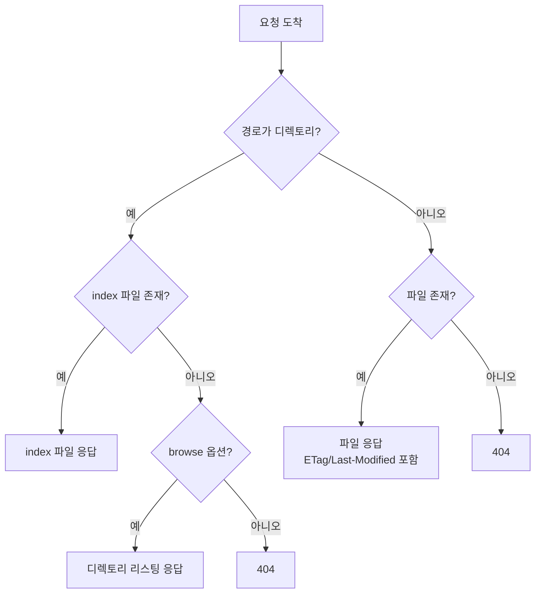

# Caddy 정적 파일 서빙

정적 파일 서빙은 Caddy가 가장 잘 하는 일 중 하나다. `file_server` 한 줄만 켜도 디렉토리 인덱스부터 ETag, 조건부 GET까지 알아서 처리한다. 그런데 막상 React 빌드물을 올리거나, API 서버 앞에 자산을 같이 붙이거나, 큰 영상 파일을 스트리밍하기 시작하면 잘 모르고 넘어갔던 디테일이 한꺼번에 튀어나온다. SPA 새로고침 시 404가 뜨고, 빌드한 `.js.gz` 파일이 엉뚱한 Content-Type으로 내려가고, 바이트 레인지 요청이 안 먹어서 비디오 플레이어가 멈춘다.

이 문서는 `file_server` 디렉티브를 중심으로 운영에서 자주 마주치는 상황을 정리한다. 단순히 옵션 나열이 아니라, 어떤 옵션이 어떤 문제를 해결하기 위해 존재하는지 맥락 위주로 본다.

## file_server 디렉티브의 동작 원리

`file_server`는 요청 경로를 파일 시스템 경로로 매핑해서 파일이 있으면 응답으로 내려보내는 디렉티브다. 매핑의 시작점이 되는 디스크 위치는 `root` 디렉티브가 결정한다.

```caddy
example.com {
    root * /var/www/html
    file_server
}
```

`root *` 의 `*`는 경로 매처다. 모든 경로에 대해 `/var/www/html`을 루트로 쓴다는 뜻이다. 만약 `/api/*`만 다른 루트를 쓰고 싶다면 매처를 분리한다.

```caddy
example.com {
    root /api/* /var/www/api-docs
    root * /var/www/html
    file_server
}
```

여기서 흔히 헷갈리는 게, `root` 디렉티브 자체는 파일을 서빙하지 않는다. 단지 "다른 디렉티브들이 디스크에서 파일을 찾을 때 어디부터 볼지"를 알려주는 환경 변수에 가깝다. `file_server`, `try_files`, `templates`, `php_fastcgi` 같은 디렉티브들이 모두 이 값을 본다. 그래서 `root`만 적고 `file_server`를 안 쓰면 아무것도 안 내려간다.

요청이 들어오면 `file_server`는 대략 이런 순서로 동작한다.



ETag는 파일의 ModTime과 Size를 조합해서 자동 생성한다. 그래서 별도 설정 없이도 클라이언트가 `If-None-Match`를 보내면 304를 돌려준다. 이건 정적 파일 서빙에서 굉장히 중요한 부분인데, 캐시 헤더만 잘 설정해두면 트래픽이 크게 줄어든다.

## file_server 옵션들

`file_server` 뒤에 중괄호를 열면 세부 옵션을 넣을 수 있다.

```caddy
example.com {
    root * /var/www/html
    file_server {
        root /var/www/html
        hide .git .env *.md
        index index.html index.htm
        browse
        precompressed gzip br zstd
    }
}
```

각 옵션이 실제로 뭘 하는지 하나씩 본다.

### root (파일 서빙 전용)

`file_server` 블록 안의 `root`는 디렉티브 차원의 `root`를 덮어쓴다. 위 예시처럼 똑같이 적으면 의미가 없지만, 특정 경로 그룹만 다른 디스크 위치에서 서빙하고 싶을 때 쓴다. 보통은 바깥 `root` 디렉티브를 쓰는 게 더 명확해서, 이 옵션은 잘 안 쓰게 된다.

### hide

특정 파일이나 디렉토리를 응답에서 가린다. 단순한 권한 거부가 아니라, 마치 존재하지 않는 것처럼 404를 돌려준다.

```caddy
file_server {
    hide .git .env *.bak /private/*
}
```

`.git`이나 `.env`는 디스크에 있어도 외부에서 절대 보여서는 안 되는 파일들이다. 가끔 deploy 스크립트가 `.git` 디렉토리를 그대로 푸시해버리는 경우가 있는데, 이때 `hide` 없으면 누군가 `https://example.com/.git/config`로 접근해서 리포지토리 내용을 통째로 긁어갈 수 있다. 디렉토리 구조에 의존하지 말고 명시적으로 가리는 게 안전하다.

`hide`는 와일드카드를 지원하지만 정규식은 안 된다. 글로브 패턴 정도까지만 된다고 보면 된다.

### index

디렉토리에 접근했을 때 자동으로 보여줄 파일 이름이다. 기본값은 `index.html index.htm`인데, SPA를 서빙한다면 보통 그대로 둔다. 다만 정적 사이트 생성기 중에 다른 이름을 쓰는 경우가 있어서, 그럴 때만 명시한다.

```caddy
file_server {
    index index.html default.html
}
```

위에서부터 순서대로 찾는다. 첫 번째 매칭되는 파일이 응답된다. `index off` 처럼 끄면 디렉토리 인덱스 자동 응답을 비활성화할 수 있고, 이러면 `browse` 옵션이 없는 한 디렉토리 요청은 404가 된다.

### browse

`browse`를 켜면 디렉토리에 인덱스 파일이 없을 때 디렉토리 리스팅을 보여준다. 기본 템플릿이 꽤 깔끔하게 나오긴 하는데, 운영 환경에서는 거의 안 켠다. 파일 이름이 노출되는 것 자체가 정보 누출이고, 누군가 의도치 않은 파일을 발견할 위험이 있다.

내부 파일 공유나 디버깅용 임시 호스트라면 켜도 괜찮다. 커스텀 템플릿을 줄 수도 있다.

```caddy
file_server browse {
    browse /etc/caddy/browse.html
}
```

### precompressed

이게 의외로 모르고 지나치는 옵션이다. 빌드 시점에 미리 만들어둔 `.gz`, `.br`, `.zst` 파일이 같은 디렉토리에 있으면, 클라이언트의 `Accept-Encoding`에 맞춰 압축본을 바로 내려준다. 런타임 압축보다 CPU를 거의 안 쓰면서도 압축률은 빌드 시점에 더 강하게 잡을 수 있다 (brotli 11 같은 건 런타임에는 못 쓴다).

```caddy
file_server {
    precompressed br zstd gzip
}
```

순서가 우선순위다. brotli를 우선 시도하고, 없으면 zstd, 그래도 없으면 gzip을 본다. 이름 매칭은 `app.js`에 대해 `app.js.br`, `app.js.zst`, `app.js.gz`를 찾는 식이다.

webpack이나 vite로 빌드할 때 `compression-webpack-plugin` 같은 걸 붙여서 `.br`/`.gz`를 같이 만들어두는 패턴이 흔한데, 이걸 안 쓰면 빌드 산출물이 그냥 디스크 공간만 차지한다.

## try_files로 SPA 라우팅 처리

React Router나 Vue Router로 만든 SPA는 클라이언트 측에서 라우팅을 처리한다. `/about`이라는 경로가 실제 디스크에는 없고, 브라우저가 `index.html`을 받은 다음 JavaScript가 그 경로를 보고 화면을 그린다.

문제는 사용자가 `/about` 페이지에서 새로고침을 누르거나, 그 URL을 직접 주소창에 쳐서 들어왔을 때다. Caddy가 `/about`이라는 파일을 디스크에서 찾으려 하다가 실패하고 404를 돌려준다. 사용자 입장에선 갑자기 페이지가 깨진 것처럼 보인다.

해결책은 디스크에 없는 경로는 모두 `index.html`로 보내주는 것이다. `try_files`가 이 일을 한다.

```caddy
example.com {
    root * /var/www/spa
    try_files {path} /index.html
    file_server
}
```

`try_files`는 인자로 받은 후보들을 순서대로 시도해서, 처음 발견된 파일로 내부 재작성을 한다. `{path}` 는 현재 요청 경로다. 그러니까 위 설정의 의미는 "현재 경로의 파일이 있으면 그대로 쓰고, 없으면 `/index.html`로 재작성한다"는 것이다.

여기서 중요한 건, 재작성이지 리다이렉트가 아니다. 브라우저 주소창의 `/about`은 그대로 유지되고, 응답 본문만 `/index.html` 내용이 내려간다. 그래야 SPA의 라우터가 `/about`을 보고 올바른 화면을 그릴 수 있다.

파일 외에 디렉토리도 후보에 넣을 수 있다.

```caddy
try_files {path} {path}/ /index.html
```

이렇게 하면 `/docs/` 같은 디렉토리 경로도 우선 시도하고, 그래도 없으면 SPA fallback으로 간다.

API 라우트와 SPA를 같이 서빙할 때는 try_files가 API 경로까지 잡아먹지 않도록 매처를 잘 써야 한다. 이건 뒤에 reverse_proxy 혼용 패턴에서 다시 본다.

## encode로 응답 압축

`precompressed`가 빌드 시점에 만들어둔 파일을 쓰는 거라면, `encode`는 런타임에 응답을 압축한다. JSON API 응답이나 HTML 템플릿처럼 동적으로 생성되는 콘텐츠는 미리 압축할 수 없으니 `encode`를 써야 한다.

```caddy
example.com {
    encode zstd gzip
    root * /var/www/html
    file_server
}
```

브라우저의 `Accept-Encoding` 헤더를 보고 우선순위에 맞는 알고리즘을 고른다. zstd를 모르는 클라이언트라면 gzip으로 떨어진다.

`encode`에는 매처를 붙여서 압축 대상을 좁힐 수 있다. 이미 압축된 이미지나 비디오를 다시 압축하면 CPU만 낭비하고 크기는 거의 안 줄어든다.

```caddy
@compressible {
    not path *.jpg *.jpeg *.png *.gif *.webp *.mp4 *.webm *.zip
}
encode @compressible zstd gzip
```

작은 응답을 압축하면 오히려 오버헤드가 더 클 수 있다. Caddy는 기본적으로 응답이 일정 크기 이상일 때만 압축하는데, 명시적으로 `minimum_length`를 지정할 수도 있다.

```caddy
encode {
    zstd
    gzip
    minimum_length 1024
}
```

`precompressed`와 `encode`를 같이 써도 된다. 미리 만들어둔 파일이 있으면 그걸 쓰고, 없으면 런타임 압축으로 떨어진다.

## Content-Type 자동 감지와 수동 오버라이드

Caddy는 파일 확장자를 보고 Content-Type을 자동으로 붙인다. `.html`은 `text/html`, `.js`는 `text/javascript`, `.css`는 `text/css` 같은 식이다. 내부적으로 Go의 `mime` 패키지와 추가 매핑 테이블을 쓰는데, 대부분의 일반적인 확장자는 알고 있다.

문제는 잘 알려지지 않은 확장자거나, 같은 확장자라도 다른 타입으로 보내야 할 때다. WebAssembly 파일(`.wasm`)이 `application/wasm`으로 안 나가면 브라우저가 컴파일을 거부한다. 폰트 파일(`.woff2`)이 잘못된 타입으로 나가면 일부 환경에서 로딩이 실패한다.

수동 오버라이드는 `header` 디렉티브로 한다.

```caddy
example.com {
    root * /var/www/html

    @wasm path *.wasm
    header @wasm Content-Type application/wasm

    @woff2 path *.woff2
    header @woff2 Content-Type font/woff2

    file_server
}
```

전역적으로 MIME 타입을 추가하고 싶다면 `file_server`의 형제 디렉티브로 더 깔끔한 방법이 있다. 하지만 보통 케이스 단위로 `header`를 쓰는 게 명시적이라 디버깅하기 좋다.

또 하나 자주 마주치는 건, 컴파일 결과물의 Content-Type이다. `.js` 파일을 ESM으로 쓰는데 일부 옛날 브라우저는 `application/javascript`를 기대하고, 어떤 도구는 `text/javascript`를 기대한다. Caddy 기본값은 RFC 9239에 맞춰 `text/javascript`로 내려가는데, 도구가 까탈스러우면 오버라이드한다.

## 캐시 헤더 제어

정적 파일 서빙에서 캐시 헤더는 트래픽 비용과 직결된다. 잘 설정해두면 같은 파일을 두 번 받지 않는다. 잘못 설정하면 사용자가 새 버전을 못 보거나, 반대로 매번 풀 리퀘스트가 일어난다.

기본 전략은 두 가지다.

첫째, 파일 이름에 해시가 들어간 빌드 산출물(`app.a1b2c3.js` 같은)은 길게 캐시한다. 내용이 바뀌면 파일 이름도 바뀌니 캐시 무효화 걱정이 없다.

```caddy
@hashed path_regexp \.[a-f0-9]{8,}\.(js|css|woff2|png|svg)$
header @hashed Cache-Control "public, max-age=31536000, immutable"
```

`immutable`이 붙으면 사용자가 새로고침을 눌러도 브라우저가 검증 요청조차 안 보낸다. 1년짜리 max-age와 짝을 이루는 게 보통이다.

둘째, `index.html`처럼 항상 최신을 받아야 하는 파일은 캐시를 짧게 잡거나 아예 안 잡는다.

```caddy
@html path *.html /
header @html Cache-Control "no-cache, must-revalidate"
header @html Pragma "no-cache"
```

`no-cache`는 "캐시는 해도 되는데 쓰기 전엔 반드시 검증해라"는 의미다. ETag가 있으니 검증 요청은 304로 끝나서 본문 다운로드는 안 일어난다. `no-store`는 "아예 저장하지 마라"는 더 강한 지시인데, 이건 민감한 페이지에만 쓴다.

이미지나 폰트 같은 자산이 해시 없이 파일명을 그대로 쓰고 있다면 어쩔 수 없이 중간 정도로 잡는다.

```caddy
@assets path /assets/* /img/*
header @assets Cache-Control "public, max-age=86400"
```

하루 정도 캐시하고 ETag로 검증하는 식이다. 이상적으론 빌드 파이프라인에 해시를 도입하는 게 답이지만, 레거시 자산에는 종종 이 방식을 쓴다.

## 큰 파일 스트리밍과 sendfile

비디오나 큰 다운로드 파일을 서빙할 때는 메모리에 통째로 안 올리는 게 중요하다. Caddy는 기본적으로 `io.Copy`를 통해 청크 단위로 보내는데, Linux에서는 내부적으로 `sendfile(2)` 시스템 콜을 활용한다. 커널이 디스크의 페이지 캐시에서 직접 소켓으로 데이터를 옮기기 때문에 유저스페이스 메모리 복사가 없다.

이 동작은 자동이라 별도 설정이 없다. 다만 큰 파일을 다룰 때 신경 써야 할 건 따로 있다.

먼저 Range 요청 처리다. 비디오 플레이어는 `Range: bytes=0-1023` 같은 헤더로 파일의 일부만 요청한다. `file_server`는 Range를 그대로 받아서 206 Partial Content로 응답한다. 이게 안 되면 사용자가 비디오 중간으로 점프할 때마다 처음부터 다시 받아야 한다. 기본으로 잘 동작하니 보통 신경 쓸 일은 없는데, 앞단에 다른 프록시나 CDN이 끼어 있을 때 Range가 망가지는 경우가 있다. 디버깅할 때는 `curl -r 0-100 -v https://example.com/big.mp4`로 직접 확인한다.

다음은 timeout이다. 큰 파일을 다운로드하다가 끊기는 경우, 보통 Caddy 자체보다는 그 앞단(LB, CDN)이나 클라이언트 쪽 timeout이 짧아서 그렇다. Caddy의 `servers > timeouts > write`를 너무 짧게 잡으면 큰 파일이 다 못 내려간다.

```caddy
{
    servers {
        timeouts {
            read_body 30s
            read_header 10s
            write 0
            idle 2m
        }
    }
}
```

`write 0`은 쓰기 timeout 비활성화다. 큰 파일을 서빙하는 호스트에선 이렇게 두는 경우가 많다. 다만 슬로우 클라이언트 공격에 취약해질 수 있어서, 트래픽 패턴 보고 결정한다.

압축과 sendfile은 같이 못 쓴다. `encode`로 런타임 압축이 켜진 파일은 sendfile 경로를 안 타고 메모리를 거친다. 그래서 비디오 같은 큰 바이너리에는 압축을 안 붙이는 게 좋다 (어차피 압축 효과도 없다).

## file_server와 reverse_proxy 혼용

실무에서 가장 많이 쓰는 패턴이 한 호스트에서 정적 자산과 API를 같이 서빙하는 거다. 같은 도메인을 쓰면 CORS 걱정도 없고, 쿠키 공유도 자연스럽다.

매처로 분기하는 게 핵심이다.

```caddy
example.com {
    root * /var/www/spa

    @api path /api/* /auth/*
    handle @api {
        reverse_proxy localhost:8080
    }

    handle {
        try_files {path} /index.html
        file_server
    }
}
```

`handle` 디렉티브는 첫 번째 매칭에서 멈춘다. `/api/...`로 들어온 요청은 `@api` 블록만 처리하고 끝난다. 그렇지 않은 요청은 다음 `handle`(매처 없음 = catch-all)로 떨어져서 SPA fallback이 동작한다.

`route` 와 `handle`을 헷갈리는 경우가 있는데, `route`는 안에 적힌 모든 디렉티브를 순서대로 다 실행한다. `handle`은 매칭된 하나만 실행한다. 이런 분기 패턴에는 `handle`이 맞다.

업로드 엔드포인트가 있다면 그쪽만 따로 처리해주는 게 좋다.

```caddy
example.com {
    root * /var/www/spa

    @upload {
        path /api/upload/*
        method POST PUT
    }
    handle @upload {
        request_body {
            max_size 100MB
        }
        reverse_proxy localhost:8080 {
            transport http {
                read_timeout 5m
                write_timeout 5m
            }
        }
    }

    @api path /api/*
    handle @api {
        reverse_proxy localhost:8080
    }

    handle {
        try_files {path} /index.html
        file_server
    }
}
```

업로드는 timeout과 max_size를 따로 잡고, 나머지 API는 기본값으로 둔다. SPA fallback은 마지막에 둬서 모든 미매칭 요청을 받아낸다.

WebSocket도 같은 백엔드를 쓴다면 별도 처리는 필요 없다. `reverse_proxy`가 자동으로 Upgrade 헤더를 처리한다. 다만 WebSocket 경로가 정적 파일 매칭과 겹치지 않도록 매처를 명확히 한다.

## MIME sniff와 보안 헤더

브라우저는 응답의 Content-Type이 명확하지 않거나 본문이 헤더와 안 맞아 보이면, 본문 앞부분을 보고 타입을 추측한다. 이걸 MIME sniffing이라고 한다. 편리한 기능이지만 보안 관점에선 위험하다.

사용자가 업로드한 `image.jpg` 파일에 사실은 HTML/JavaScript가 들어 있다고 해보자. 서버는 `Content-Type: image/jpeg`로 내려보내지만, 브라우저가 sniffing으로 `text/html`로 해석하면 그 페이지에서 스크립트가 실행될 수 있다. XSS 공격 벡터가 된다.

이걸 막는 게 `X-Content-Type-Options: nosniff` 헤더다. 브라우저에게 "내가 보낸 Content-Type 그대로 써, sniffing하지 마"라고 알리는 것이다.

```caddy
example.com {
    header {
        X-Content-Type-Options nosniff
        X-Frame-Options DENY
        Referrer-Policy strict-origin-when-cross-origin
        Content-Security-Policy "default-src 'self'"
    }

    root * /var/www/html
    file_server
}
```

`X-Frame-Options`는 클릭재킹 방지용이다. 다른 사이트가 iframe으로 우리 페이지를 감싸는 걸 막는다. 대부분의 사이트는 `DENY` 또는 `SAMEORIGIN`으로 설정한다.

`Referrer-Policy`는 이 페이지에서 다른 사이트로 이동할 때 Referer 헤더에 얼마나 정보를 담을지 결정한다. `strict-origin-when-cross-origin`이 무난한 기본값이다.

`Content-Security-Policy`는 가장 강력하면서도 까다로운 헤더다. 잘 짜면 거의 모든 XSS를 막을 수 있지만, 인라인 스크립트나 외부 CDN을 쓰는 사이트는 처음 적용할 때 페이지가 깨지는 경우가 흔하다. 처음에는 `Content-Security-Policy-Report-Only`로 시작해서 위반 사항을 모니터링하고, 안정화된 후에 enforce 모드로 바꾸는 게 안전하다.

`Strict-Transport-Security`(HSTS)는 HTTPS를 강제한다. Caddy는 자동으로 HTTPS로 리다이렉트하지만, HSTS를 명시적으로 박아두면 브라우저가 다음부터 아예 HTTP로 시도조차 안 한다.

```caddy
header Strict-Transport-Security "max-age=31536000; includeSubDomains; preload"
```

`preload`는 브라우저 빌트인 HSTS 리스트에 등록 신청할 때 쓴다. 한번 등록되면 되돌리기 어려우니 도메인이 안정화된 후에만 붙인다.

## 자주 빠지는 함정

`root` 경로 끝에 `/`를 붙이는지 말지로 헷갈리는 경우가 있는데, Caddy는 양쪽 다 받는다. 대신 절대 경로를 써라. 상대 경로를 쓰면 Caddy 프로세스의 작업 디렉토리 기준이 되는데, 이건 systemd 유닛 설정이나 docker WORKDIR에 따라 달라져서 환경마다 동작이 달라진다.

심볼릭 링크는 기본적으로 따라간다. 보안상 문제가 될 수 있어서, 신뢰할 수 없는 사용자가 파일을 넣을 수 있는 디렉토리라면 심볼릭 링크가 루트 밖을 가리키지 않는지 주의해야 한다.

대소문자 처리가 파일 시스템에 따라 다르다. macOS/Windows는 보통 대소문자 무시고, Linux는 구분한다. 개발 환경이 macOS인데 배포는 Linux라면, `Image.PNG`로 참조하는 코드가 로컬에선 되고 운영에선 404가 나는 황당한 상황이 생긴다. Caddy 자체는 운영체제 동작을 그대로 따른다.

`.well-known` 경로는 가리지 마라. ACME 챌린지나 다양한 표준 메타데이터 위치다. `hide` 패턴에 `.*`처럼 광범위하게 잡으면 인증서 갱신이 깨진다.

마지막으로, 디스크 권한이다. Caddy 프로세스 사용자(보통 `caddy` 유저)가 해당 파일을 읽을 권한이 있어야 한다. systemd로 돌릴 때 `ProtectSystem=strict` 같은 옵션이 있으면 의도치 않은 디렉토리는 read-only로도 안 보인다. 권한 문제는 로그에 명확히 안 찍힐 수 있어서 디버깅이 까다롭다. `sudo -u caddy cat /var/www/html/index.html` 같은 식으로 직접 확인하는 게 빠르다.
