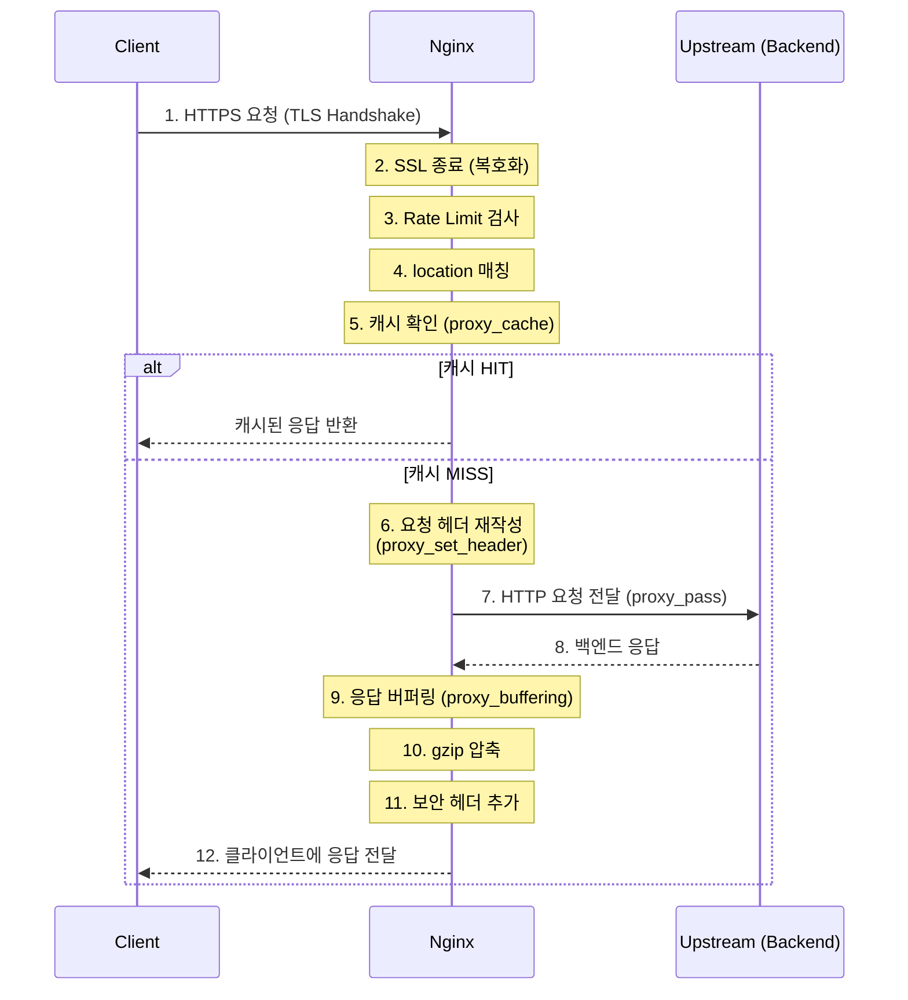
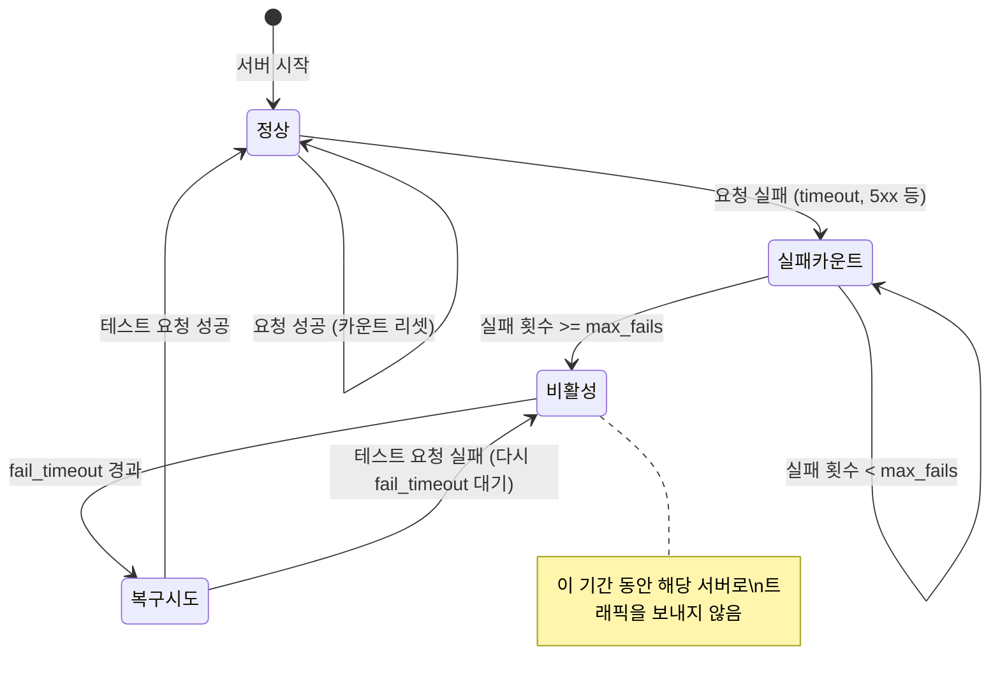
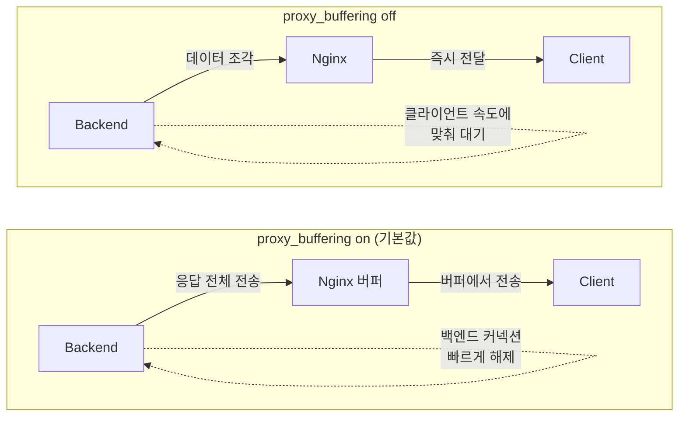
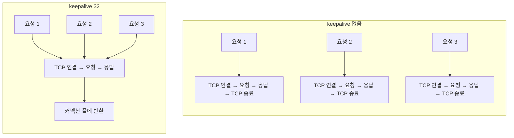

# Nginx 리버스 프록시 & 로드밸런싱

## 배경

백엔드 서버를 직접 외부에 노출하는 대신 **Nginx를 리버스 프록시**로 앞에 두면 보안, 성능, 확장성에서 큰 이점을 얻는다. 프로덕션 환경에서 Nginx는 거의 필수적인 인프라 구성 요소이다.

### 리버스 프록시란

```
포워드 프록시 (클라이언트 측):
  Client → Proxy → Internet → Server
  (클라이언트를 숨김)

리버스 프록시 (서버 측):
  Client → Internet → Nginx → Backend Server
  (백엔드 서버를 숨김)
```

### 리버스 프록시 요청 흐름

클라이언트 요청이 Nginx를 거쳐 백엔드로 전달되는 전체 과정이다. 각 단계에서 Nginx가 어떤 처리를 하는지 파악해야 트러블슈팅할 때 원인을 빨리 찾는다.



실무에서 자주 겪는 상황: `proxy_set_header`를 빠뜨리면 백엔드에서 클라이언트 IP를 알 수 없다. 로그를 보면 전부 `127.0.0.1`로 찍히는 경우가 이 문제다.

### Nginx가 리버스 프록시로 하는 일

| 역할 | 설명 |
|------|------|
| **SSL 종료** | HTTPS를 Nginx에서 처리, 백엔드는 HTTP |
| **로드밸런싱** | 여러 백엔드 서버에 트래픽 분배 |
| **정적 파일 서빙** | HTML, CSS, JS, 이미지를 Nginx가 직접 전달 |
| **캐싱** | 응답을 캐시하여 백엔드 부하 감소 |
| **요청 제한** | Rate Limiting으로 DDoS/과도한 요청 방어 |
| **보안 헤더** | HSTS, X-Frame-Options 등 보안 헤더 추가 |
| **압축** | gzip/brotli 압축으로 응답 크기 감소 |

## 핵심

### 1. 리버스 프록시 기본 설정

#### 단일 백엔드 서버

```nginx
server {
    listen 80;
    server_name api.example.com;

    location / {
        proxy_pass http://localhost:8080;   # 백엔드 서버

        # 필수 프록시 헤더
        proxy_set_header Host $host;
        proxy_set_header X-Real-IP $remote_addr;
        proxy_set_header X-Forwarded-For $proxy_add_x_forwarded_for;
        proxy_set_header X-Forwarded-Proto $scheme;

        # 타임아웃 설정
        proxy_connect_timeout 60s;
        proxy_send_timeout 60s;
        proxy_read_timeout 60s;
    }
}
```

**프록시 헤더 설명:**

| 헤더 | 용도 |
|------|------|
| `Host` | 원본 요청의 호스트명 전달 |
| `X-Real-IP` | 실제 클라이언트 IP 전달 |
| `X-Forwarded-For` | 프록시 체인의 IP 목록 |
| `X-Forwarded-Proto` | 원본 프로토콜 (http/https) |

Spring Boot에서 이 헤더를 인식하려면 `server.forward-headers-strategy=native` 설정이 필요하다. 이걸 안 하면 `HttpServletRequest.getRemoteAddr()`가 Nginx IP를 반환한다.

#### 경로별 라우팅

```nginx
server {
    listen 80;
    server_name example.com;

    # 프론트엔드 (React/Vue SPA)
    location / {
        root /var/www/frontend/dist;
        index index.html;
        try_files $uri $uri/ /index.html;   # SPA 라우팅
    }

    # API 서버
    location /api/ {
        proxy_pass http://localhost:8080;
        proxy_set_header Host $host;
        proxy_set_header X-Real-IP $remote_addr;
        proxy_set_header X-Forwarded-For $proxy_add_x_forwarded_for;
    }

    # WebSocket
    location /ws/ {
        proxy_pass http://localhost:8080;
        proxy_http_version 1.1;
        proxy_set_header Upgrade $http_upgrade;
        proxy_set_header Connection "upgrade";
        proxy_set_header Host $host;
    }

    # 정적 파일 (Nginx가 직접 서빙)
    location /static/ {
        alias /var/www/static/;
        expires 30d;
        add_header Cache-Control "public, immutable";
    }
}
```

### 2. 로드밸런싱

여러 백엔드 서버에 트래픽을 분산한다.

#### upstream 블록

```nginx
# 백엔드 서버 그룹 정의
upstream backend {
    server 10.0.1.10:8080;
    server 10.0.1.11:8080;
    server 10.0.1.12:8080;
}

server {
    listen 80;
    server_name api.example.com;

    location / {
        proxy_pass http://backend;   # upstream 이름 사용
        proxy_set_header Host $host;
        proxy_set_header X-Real-IP $remote_addr;
        proxy_set_header X-Forwarded-For $proxy_add_x_forwarded_for;
    }
}
```

#### 로드밸런싱 알고리즘

| 알고리즘 | 설정 | 동작 | 사용 상황 |
|---------|------|------|----------|
| **Round Robin** | (기본값) | 순서대로 분배 | 서버 성능 동일 |
| **Weighted** | `weight=3` | 가중치 기반 분배 | 서버 성능 차이 |
| **Least Connections** | `least_conn` | 연결 수 적은 서버 우선 | 요청 처리 시간 불균일 |
| **IP Hash** | `ip_hash` | 클라이언트 IP 기반 고정 | 세션 유지 필요 |
| **Hash** | `hash $request_uri` | 커스텀 키 기반 | 캐시 효율 극대화 |

```nginx
# Weighted Round Robin
upstream backend {
    server 10.0.1.10:8080 weight=3;   # 트래픽 60%
    server 10.0.1.11:8080 weight=2;   # 트래픽 40%
}

# Least Connections
upstream backend {
    least_conn;
    server 10.0.1.10:8080;
    server 10.0.1.11:8080;
    server 10.0.1.12:8080;
}

# IP Hash (세션 고정)
upstream backend {
    ip_hash;
    server 10.0.1.10:8080;
    server 10.0.1.11:8080;
}
```

#### 헬스 체크 및 장애 대응

```nginx
upstream backend {
    server 10.0.1.10:8080 max_fails=3 fail_timeout=30s;   # 3번 실패 → 30초 제외
    server 10.0.1.11:8080 max_fails=3 fail_timeout=30s;
    server 10.0.1.12:8080 backup;                          # 다른 서버 모두 실패 시 사용
}
```

| 파라미터 | 기본값 | 설명 |
|---------|--------|------|
| `max_fails` | 1 | 실패 허용 횟수 |
| `fail_timeout` | 10s | 실패 후 제외 시간 (이 시간이 지나면 다시 요청을 보내본다) |
| `backup` | - | 백업 서버 (평상시 미사용) |
| `down` | - | 서버를 수동으로 비활성화 |

**패시브 헬스체크 동작 구조**

Nginx OSS는 패시브(passive) 헬스체크만 지원한다. 실제 사용자 요청에 대한 응답으로 서버 상태를 판단한다. 별도의 헬스체크 요청을 보내는 액티브 방식은 Nginx Plus에서만 쓸 수 있다.



여기서 주의할 점: `fail_timeout`은 두 가지 의미를 동시에 가진다.

1. 실패 횟수를 세는 시간 윈도우 — 이 시간 안에 `max_fails`만큼 실패해야 비활성 처리된다
2. 비활성 상태 유지 시간 — 이 시간이 지나면 다시 요청을 보내서 살아있는지 확인한다

`fail_timeout=30s`, `max_fails=3`이면 "30초 안에 3번 실패하면 30초 동안 제외"라는 뜻이다. 실패 카운트 윈도우와 제외 시간을 따로 설정할 수 없어서, 세밀한 제어가 필요하면 Nginx Plus의 액티브 헬스체크를 검토해야 한다.

#### proxy_next_upstream으로 자동 재시도

백엔드가 에러를 반환했을 때 다른 서버로 자동 재시도할 수 있다.

```nginx
location /api/ {
    proxy_pass http://backend;
    proxy_next_upstream error timeout http_502 http_503;
    proxy_next_upstream_tries 2;       # 최대 2번까지 재시도
    proxy_next_upstream_timeout 10s;   # 재시도 전체 시간 제한
}
```

POST 요청에 대해 `proxy_next_upstream`이 걸리면 같은 요청이 두 번 전달될 수 있다. 멱등하지 않은 API(결제, 주문 생성 등)에서는 `proxy_next_upstream off;`로 비활성화하거나, `non_idempotent` 플래그를 확인해야 한다.

### 3. proxy_buffering 설정과 성능 차이

`proxy_buffering`은 Nginx가 백엔드 응답을 어떻게 클라이언트에 전달하는지 결정한다. 기본값은 `on`이고, 대부분의 경우 켜둬야 한다.



**on일 때 (기본값, 대부분의 API에 적합)**

```nginx
location /api/ {
    proxy_pass http://backend;
    proxy_buffering on;

    # 버퍼 크기 설정
    proxy_buffer_size 4k;         # 응답 헤더용 버퍼
    proxy_buffers 8 8k;           # 응답 본문용 버퍼 (8개 × 8KB = 64KB)
    proxy_busy_buffers_size 16k;  # 클라이언트 전송 중 사용할 버퍼
}
```

- Nginx가 백엔드 응답을 전부 받은 뒤 클라이언트에 전달한다
- 백엔드 커넥션을 빨리 반환하기 때문에 백엔드 리소스 점유 시간이 짧다
- 느린 클라이언트(모바일, 저대역폭)가 있어도 백엔드에 영향을 주지 않는다
- 응답이 버퍼보다 크면 디스크에 임시 파일을 쓰는데, 이건 `proxy_max_temp_file_size`로 제한한다

**off일 때 (SSE, 스트리밍에 필요)**

```nginx
# Server-Sent Events
location /api/events {
    proxy_pass http://backend;
    proxy_buffering off;

    # SSE에 필요한 설정
    proxy_http_version 1.1;
    proxy_set_header Connection "";
    proxy_read_timeout 86400s;     # 장시간 연결 유지
    proxy_cache off;
}

# 대용량 파일 다운로드 (스트리밍)
location /download/ {
    proxy_pass http://backend;
    proxy_buffering off;
    proxy_max_temp_file_size 0;    # 디스크 임시 파일 비활성화
}
```

- 백엔드 응답을 받는 즉시 클라이언트에 전달한다
- SSE(Server-Sent Events), 스트리밍, 장시간 응답에서 반드시 꺼야 한다
- 문제는 클라이언트가 느리면 백엔드 프로세스가 그만큼 오래 붙잡힌다는 점이다

**성능 차이 정리**

| 항목 | `on` | `off` |
|------|------|-------|
| 백엔드 커넥션 점유 시간 | 짧다 (응답 크기에 비례) | 길다 (클라이언트 속도에 비례) |
| 느린 클라이언트 영향 | 없음 (Nginx가 흡수) | 백엔드까지 전파 |
| TTFB (첫 바이트 도달) | 약간 느림 | 빠름 |
| 메모리 사용 | 버퍼만큼 사용 | 최소 |
| SSE/스트리밍 | 동작 안 함 | 필수 |

실무에서는 기본 API 엔드포인트는 `on`, SSE나 파일 스트리밍 엔드포인트만 `off`로 설정하는 것이 일반적이다. 전역 설정을 건드리지 말고 location 블록 단위로 제어한다.

### 4. upstream 커넥션 재사용 (keepalive)

upstream에 `keepalive` 설정이 없으면 Nginx는 백엔드로 요청을 보낼 때마다 TCP 커넥션을 새로 맺는다. 요청량이 많으면 이 오버헤드가 상당하다.



```nginx
upstream api_backend {
    least_conn;
    server 10.0.1.10:8080;
    server 10.0.1.11:8080;

    keepalive 32;                  # 워커당 유지할 유휴 커넥션 수
    keepalive_timeout 60s;         # 유휴 커넥션 유지 시간
    keepalive_requests 1000;       # 커넥션 하나로 보낼 최대 요청 수
}

server {
    location /api/ {
        proxy_pass http://api_backend;

        # keepalive 사용 시 반드시 필요한 설정
        proxy_http_version 1.1;            # HTTP/1.0은 keepalive 미지원
        proxy_set_header Connection "";    # "close" 헤더 제거
    }
}
```

`proxy_http_version 1.1`과 `proxy_set_header Connection ""`은 반드시 같이 설정해야 한다. 빠뜨리면 Nginx가 `Connection: close`를 보내서 매번 커넥션을 끊는다. 설정은 했는데 실제로 keepalive가 동작하지 않는 문제 대부분이 이 두 줄 누락이다.

**keepalive 파라미터 설정 기준**

| 파라미터 | 설명 | 설정 기준 |
|---------|------|----------|
| `keepalive N` | 워커당 유지할 유휴 커넥션 수 | 피크 타임 동시 요청수 / worker_processes 수 기준으로 잡는다 |
| `keepalive_timeout` | 유휴 커넥션 유지 시간 | 백엔드의 keepalive timeout보다 짧게 설정해야 한다 |
| `keepalive_requests` | 커넥션당 최대 요청 수 | 기본값 1000이면 대부분 충분하다 |

`keepalive` 값이 너무 크면 유휴 커넥션이 백엔드 리소스를 잡아먹고, 너무 작으면 커넥션을 자주 새로 맺게 된다. 워커 프로세스마다 이 수만큼 유휴 커넥션을 유지하므로, `worker_processes` × `keepalive` = 전체 유휴 커넥션 수다. 백엔드의 `max-connections` 설정과 맞춰야 한다.

**keepalive_timeout 주의사항**

Nginx의 `keepalive_timeout`과 백엔드(Spring Boot의 `server.tomcat.keep-alive-timeout` 등)의 timeout 값 관계가 중요하다. 백엔드가 먼저 커넥션을 끊으면 Nginx는 이미 끊긴 커넥션에 요청을 보내게 되고, 502 에러가 발생한다.

```
# 올바른 설정
Nginx keepalive_timeout (60s) < Backend keep-alive-timeout (65s)

# 잘못된 설정 (간헐적 502 발생)
Nginx keepalive_timeout (60s) > Backend keep-alive-timeout (30s)
```

이 502 에러는 간헐적으로 발생해서 원인 파악이 어렵다. 부하가 낮을 때 유휴 커넥션이 오래 남아있다가 타이밍이 맞으면 터지는 식이라, 재현도 잘 안 된다. Nginx 에러 로그에 `upstream prematurely closed connection`이 보이면 이 문제를 의심해야 한다.

### 5. SSL/TLS (HTTPS) 설정

#### Let's Encrypt 인증서

```bash
# Certbot으로 무료 SSL 인증서 발급
sudo apt install certbot python3-certbot-nginx
sudo certbot --nginx -d example.com -d www.example.com

# 자동 갱신 (cron)
sudo certbot renew --dry-run
```

#### HTTPS 설정

```nginx
# HTTP → HTTPS 리다이렉트
server {
    listen 80;
    server_name example.com www.example.com;
    return 301 https://$host$request_uri;
}

# HTTPS 서버
server {
    listen 443 ssl http2;
    server_name example.com;

    # SSL 인증서
    ssl_certificate /etc/letsencrypt/live/example.com/fullchain.pem;
    ssl_certificate_key /etc/letsencrypt/live/example.com/privkey.pem;

    # SSL 보안 설정
    ssl_protocols TLSv1.2 TLSv1.3;
    ssl_ciphers ECDHE-ECDSA-AES128-GCM-SHA256:ECDHE-RSA-AES128-GCM-SHA256;
    ssl_prefer_server_ciphers off;

    # HSTS (Strict Transport Security)
    add_header Strict-Transport-Security "max-age=31536000; includeSubDomains" always;

    # OCSP Stapling (인증서 검증 가속)
    ssl_stapling on;
    ssl_stapling_verify on;

    location / {
        proxy_pass http://backend;
        proxy_set_header Host $host;
        proxy_set_header X-Real-IP $remote_addr;
        proxy_set_header X-Forwarded-For $proxy_add_x_forwarded_for;
        proxy_set_header X-Forwarded-Proto $scheme;
    }
}
```

### 6. 캐싱

Nginx에서 백엔드 응답을 캐시하면 서버 부하를 줄인다.

```nginx
# 캐시 영역 정의 (http 블록)
proxy_cache_path /var/cache/nginx levels=1:2
                 keys_zone=api_cache:10m    # 캐시 키 메모리 10MB
                 max_size=1g                # 디스크 최대 1GB
                 inactive=60m               # 60분 미사용 시 삭제
                 use_temp_path=off;

server {
    listen 443 ssl http2;
    server_name api.example.com;

    # API 응답 캐싱
    location /api/products {
        proxy_pass http://backend;
        proxy_cache api_cache;
        proxy_cache_valid 200 10m;           # 200 응답: 10분 캐시
        proxy_cache_valid 404 1m;            # 404 응답: 1분 캐시
        proxy_cache_key "$request_method$request_uri";

        add_header X-Cache-Status $upstream_cache_status;   # 캐시 HIT/MISS 확인
    }

    # 인증 API는 캐시하지 않음
    location /api/auth {
        proxy_pass http://backend;
        proxy_no_cache 1;
        proxy_cache_bypass 1;
    }
}
```

### 7. Rate Limiting

과도한 요청이나 DDoS 공격을 방어한다.

```nginx
# 요청 제한 영역 정의 (http 블록)
limit_req_zone $binary_remote_addr zone=api_limit:10m rate=10r/s;    # IP당 초당 10회
limit_req_zone $binary_remote_addr zone=login_limit:10m rate=5r/m;   # 로그인: 분당 5회

server {
    # 일반 API
    location /api/ {
        limit_req zone=api_limit burst=20 nodelay;
        # burst=20: 순간 20개까지 허용
        # nodelay: 대기 없이 즉시 처리 (초과 시 503)

        proxy_pass http://backend;
    }

    # 로그인 API (더 엄격)
    location /api/auth/login {
        limit_req zone=login_limit burst=3;

        proxy_pass http://backend;
    }
}
```

### 8. 보안 헤더

```nginx
# 보안 헤더 모음 (include로 재사용)
add_header X-Frame-Options "SAMEORIGIN" always;           # 클릭재킹 방지
add_header X-Content-Type-Options "nosniff" always;       # MIME 스니핑 방지
add_header X-XSS-Protection "1; mode=block" always;       # XSS 필터
add_header Referrer-Policy "strict-origin-when-cross-origin" always;
add_header Content-Security-Policy "default-src 'self'" always;
add_header Permissions-Policy "camera=(), microphone=(), geolocation=()" always;
```

### 9. Gzip 압축

```nginx
# http 블록에 설정
gzip on;
gzip_vary on;
gzip_proxied any;
gzip_comp_level 6;                    # 압축 레벨 (1-9, 6이 균형)
gzip_min_length 1024;                 # 1KB 이상만 압축
gzip_types
    text/plain
    text/css
    text/javascript
    application/json
    application/javascript
    application/xml
    image/svg+xml;
```

## 예시

### 1. 프로덕션 전체 구성 예시

Spring Boot + React SPA를 Nginx로 서빙하는 실전 설정이다.

```nginx
# /etc/nginx/nginx.conf

user nginx;
worker_processes auto;                  # CPU 코어 수에 맞춤
worker_rlimit_nofile 65535;

events {
    worker_connections 4096;
    multi_accept on;
}

http {
    include mime.types;
    default_type application/octet-stream;

    # 로그 포맷
    log_format main '$remote_addr - $remote_user [$time_local] '
                    '"$request" $status $body_bytes_sent '
                    '"$http_referer" "$http_user_agent" '
                    '$request_time $upstream_response_time';

    access_log /var/log/nginx/access.log main;
    error_log /var/log/nginx/error.log warn;

    # 성능
    sendfile on;
    tcp_nopush on;
    tcp_nodelay on;
    keepalive_timeout 65;
    keepalive_requests 1000;

    # 버퍼
    client_max_body_size 10m;           # 업로드 최대 크기
    client_body_buffer_size 128k;
    proxy_buffer_size 128k;
    proxy_buffers 4 256k;

    # Gzip
    gzip on;
    gzip_vary on;
    gzip_comp_level 6;
    gzip_min_length 1024;
    gzip_types text/plain text/css application/json application/javascript
               text/xml application/xml image/svg+xml;

    # Rate Limiting
    limit_req_zone $binary_remote_addr zone=api:10m rate=10r/s;
    limit_req_zone $binary_remote_addr zone=login:10m rate=5r/m;

    # 캐시
    proxy_cache_path /var/cache/nginx levels=1:2
                     keys_zone=static_cache:10m max_size=1g inactive=7d;

    # 업스트림
    upstream api_backend {
        least_conn;
        server 10.0.1.10:8080 max_fails=3 fail_timeout=30s;
        server 10.0.1.11:8080 max_fails=3 fail_timeout=30s;
        keepalive 32;              # 워커당 유휴 커넥션 32개 유지
        keepalive_timeout 60s;     # 백엔드 timeout(65s)보다 짧게
        keepalive_requests 1000;
    }

    # HTTP → HTTPS 리다이렉트
    server {
        listen 80;
        server_name example.com www.example.com;
        return 301 https://example.com$request_uri;
    }

    # HTTPS 메인 서버
    server {
        listen 443 ssl http2;
        server_name example.com;

        # SSL
        ssl_certificate /etc/letsencrypt/live/example.com/fullchain.pem;
        ssl_certificate_key /etc/letsencrypt/live/example.com/privkey.pem;
        ssl_protocols TLSv1.2 TLSv1.3;
        ssl_prefer_server_ciphers off;
        ssl_session_cache shared:SSL:10m;
        ssl_session_timeout 1d;

        # 보안 헤더
        add_header Strict-Transport-Security "max-age=31536000; includeSubDomains" always;
        add_header X-Frame-Options "SAMEORIGIN" always;
        add_header X-Content-Type-Options "nosniff" always;

        # 프론트엔드 SPA
        location / {
            root /var/www/frontend/dist;
            index index.html;
            try_files $uri $uri/ /index.html;

            # 정적 파일 캐시
            location ~* \.(js|css|png|jpg|jpeg|gif|ico|svg|woff2)$ {
                expires 30d;
                add_header Cache-Control "public, immutable";
            }
        }

        # API
        location /api/ {
            limit_req zone=api burst=20 nodelay;

            proxy_pass http://api_backend;
            proxy_set_header Host $host;
            proxy_set_header X-Real-IP $remote_addr;
            proxy_set_header X-Forwarded-For $proxy_add_x_forwarded_for;
            proxy_set_header X-Forwarded-Proto $scheme;
            proxy_http_version 1.1;
            proxy_set_header Connection "";
        }

        # 로그인 (엄격한 Rate Limit)
        location /api/auth/login {
            limit_req zone=login burst=3;

            proxy_pass http://api_backend;
            proxy_set_header Host $host;
            proxy_set_header X-Real-IP $remote_addr;
            proxy_set_header X-Forwarded-For $proxy_add_x_forwarded_for;
            proxy_set_header X-Forwarded-Proto $scheme;
        }

        # WebSocket
        location /ws/ {
            proxy_pass http://api_backend;
            proxy_http_version 1.1;
            proxy_set_header Upgrade $http_upgrade;
            proxy_set_header Connection "upgrade";
            proxy_set_header Host $host;
            proxy_read_timeout 86400s;
        }

        # 헬스 체크 (외부 접근 차단)
        location /actuator/ {
            deny all;
        }
    }
}
```

### 2. Docker Compose와 Nginx

```yaml
# docker-compose.yml
services:
  nginx:
    image: nginx:alpine
    ports:
      - "80:80"
      - "443:443"
    volumes:
      - ./nginx/nginx.conf:/etc/nginx/nginx.conf:ro
      - ./nginx/ssl:/etc/nginx/ssl:ro
      - ./frontend/dist:/var/www/frontend/dist:ro
    depends_on:
      - api
    restart: unless-stopped

  api:
    image: my-api:latest
    expose:
      - "8080"            # 외부 미노출, Nginx에서만 접근
    environment:
      - SPRING_PROFILES_ACTIVE=prod
    restart: unless-stopped
```

```nginx
# Docker 환경에서의 upstream (서비스 이름 사용)
upstream api_backend {
    server api:8080;      # Docker 서비스 이름으로 접근
}
```

## 운영 팁

### 설정 검증 및 관리

```bash
# 설정 문법 검사 (반드시 reload 전에 실행)
sudo nginx -t

# 설정 리로드 (무중단)
sudo nginx -s reload

# 상태 확인
sudo systemctl status nginx

# 로그 실시간 확인
sudo tail -f /var/log/nginx/access.log
sudo tail -f /var/log/nginx/error.log
```

### 성능 관련 설정 요약

| 항목 | 설정 | 효과 |
|------|------|------|
| `worker_processes auto` | CPU 코어 수 자동 | CPU 활용 |
| `worker_connections 4096` | 워커당 연결 수 | 동시 처리 능력 |
| `keepalive 32` | upstream keepalive | 커넥션 재사용으로 TCP 오버헤드 감소 |
| `proxy_buffering on` | 응답 버퍼링 | 백엔드 커넥션 점유 시간 감소 |
| `gzip on` | 응답 압축 | 전송량 60~80% 감소 |
| `proxy_cache` | 응답 캐싱 | 백엔드 요청 자체를 줄임 |
| `sendfile on` | 커널 레벨 파일 전송 | 정적 파일 성능 향상 |

### Nginx vs Apache 비교

| 항목 | Nginx | Apache |
|------|-------|--------|
| **아키텍처** | 이벤트 기반, 비동기 | 프로세스/스레드 기반 |
| **동시 연결** | 수만 개 | 수천 개 |
| **메모리** | 매우 효율적 | 연결당 메모리 소비 |
| **정적 파일** | 매우 빠름 | 보통 |
| **동적 컨텐츠** | 외부 프로세서 필요 | mod_php 내장 가능 |
| **설정** | 중앙 집중식 | .htaccess 분산 가능 |
| **사용 추세** | 증가 중 | 감소 중 |

리버스 프록시/로드밸런서로는 Nginx가 사실상 표준이다. 레거시 PHP 호스팅 외에는 Nginx를 선택하는 경우가 대부분이다.

## 참고

- [Nginx 공식 문서](https://nginx.org/en/docs/)
- [Nginx 리버스 프록시 가이드](https://docs.nginx.com/nginx/admin-guide/web-server/reverse-proxy/)
- [Let's Encrypt](https://letsencrypt.org/)
- [Mozilla SSL Configuration Generator](https://ssl-config.mozilla.org/)
- [Nginx 기본 개념](Definition.md)
- [CORS 설정](CORS.md)
