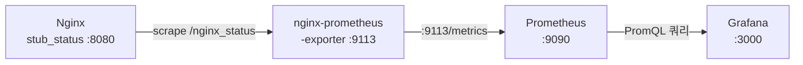
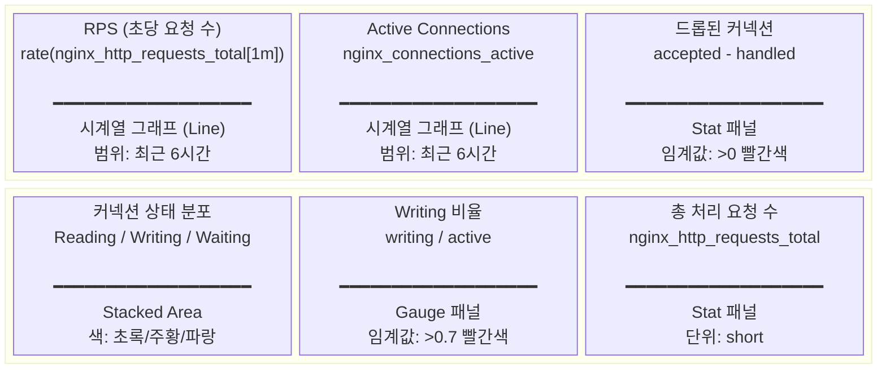
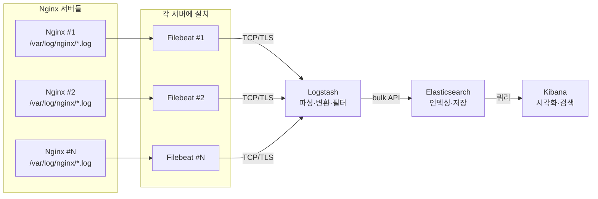
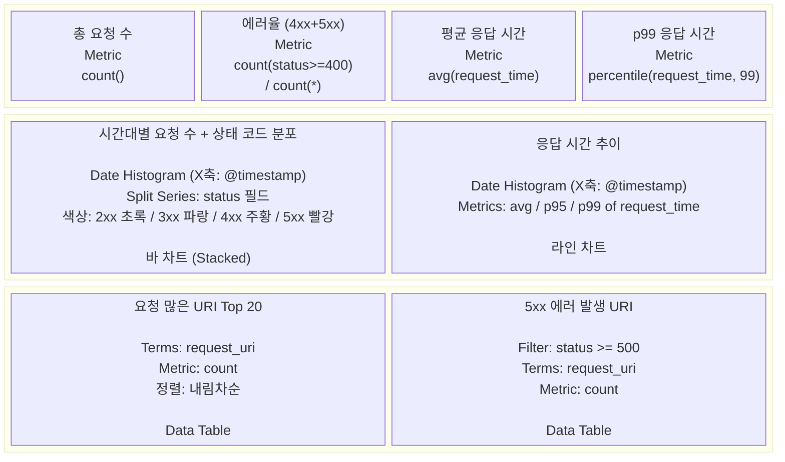
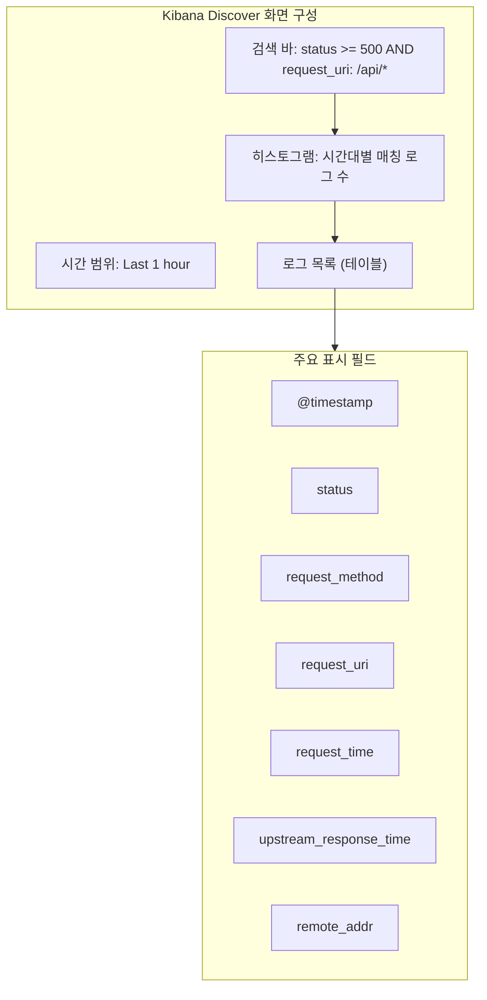
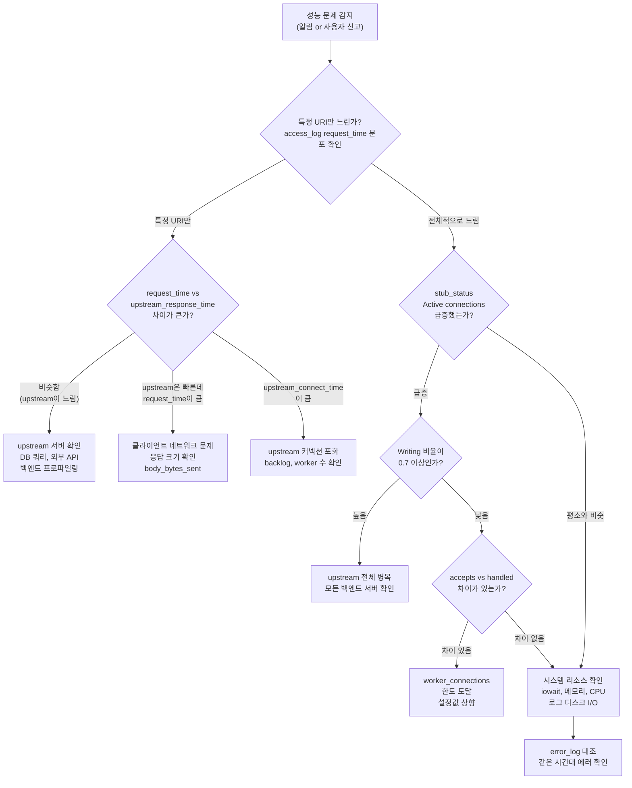

# Nginx 로그 설정과 모니터링

## 기본 로그 구조

Nginx는 두 종류의 로그를 남긴다.

- **access_log**: 클라이언트 요청이 처리될 때마다 한 줄씩 기록
- **error_log**: Nginx 내부 오류, upstream 연결 실패, 설정 문법 에러 등을 기록

기본 설정은 이렇다.

```nginx
http {
    access_log /var/log/nginx/access.log;
    error_log  /var/log/nginx/error.log;
}
```

`access_log`는 `http`, `server`, `location` 블록 어디든 넣을 수 있다. 하위 블록에서 `access_log`를 선언하면 상위 설정을 덮어쓴다. "상속"이 아니라 "교체"다.

```nginx
server {
    access_log /var/log/nginx/main.log;

    location /api/ {
        # 여기서 별도로 선언하면 main.log에는 /api/ 요청이 안 남는다
        access_log /var/log/nginx/api.log;
    }
}
```

`error_log`는 동작이 다르다. 하위 블록에서 선언해도 상위 로그에도 같이 기록된다. 그래서 error_log는 보통 `http` 블록에 한 번만 선언하고 건드리지 않는다.

### error_log 레벨

```nginx
error_log /var/log/nginx/error.log warn;
```

레벨은 `debug`, `info`, `notice`, `warn`, `error`, `crit`, `alert`, `emerg` 순서다. `warn`으로 설정하면 `warn` 이상만 기록한다. 운영 환경에서는 `warn`이나 `error`를 쓰고, 문제 추적할 때만 `info`로 낮춘다. `debug`는 `--with-debug` 옵션으로 컴파일한 Nginx에서만 동작한다.

## 커스텀 로그 포맷

기본 `combined` 포맷은 이렇게 생겼다.

```nginx
log_format combined '$remote_addr - $remote_user [$time_local] '
                    '"$request" $status $body_bytes_sent '
                    '"$http_referer" "$http_user_agent"';
```

실무에서는 이 정보만으로 부족하다. 응답 시간, upstream 처리 시간, 요청 ID 같은 것들이 빠져 있다.

### 실무용 커스텀 포맷

```nginx
log_format main_ext '$remote_addr - $remote_user [$time_local] '
                    '"$request" $status $body_bytes_sent '
                    '"$http_referer" "$http_user_agent" '
                    'rt=$request_time uct=$upstream_connect_time '
                    'uht=$upstream_header_time urt=$upstream_response_time '
                    'rid=$request_id';
```

각 변수 의미:

| 변수 | 설명 |
|------|------|
| `$request_time` | 클라이언트 요청 수신부터 응답 완료까지 걸린 전체 시간(초) |
| `$upstream_connect_time` | upstream 서버에 TCP 연결 맺는 데 걸린 시간 |
| `$upstream_header_time` | upstream에서 응답 헤더 받기까지 걸린 시간 |
| `$upstream_response_time` | upstream 응답 전체를 받는 데 걸린 시간 |
| `$request_id` | Nginx가 요청마다 자동 생성하는 고유 ID (1.11.0+) |

`$request_time`과 `$upstream_response_time`의 차이가 크면 Nginx와 클라이언트 사이 네트워크가 느린 것이다. `$upstream_connect_time`이 크면 upstream 서버가 커넥션 수용을 못 하고 있는 것이다.

## JSON 구조화 로깅

ELK, Loki, Datadog 같은 로그 수집 시스템을 쓴다면 JSON 포맷이 파싱하기 편하다.

```nginx
log_format json_log escape=json
    '{'
        '"time": "$time_iso8601",'
        '"remote_addr": "$remote_addr",'
        '"request_method": "$request_method",'
        '"request_uri": "$request_uri",'
        '"status": $status,'
        '"body_bytes_sent": $body_bytes_sent,'
        '"request_time": $request_time,'
        '"upstream_response_time": "$upstream_response_time",'
        '"http_referer": "$http_referer",'
        '"http_user_agent": "$http_user_agent",'
        '"request_id": "$request_id"'
    '}';

access_log /var/log/nginx/access.json.log json_log;
```

`escape=json`을 빼먹으면 User-Agent나 Referer에 따옴표가 들어올 때 JSON이 깨진다. 1.11.8 이상에서 지원한다.

주의할 점: `$upstream_response_time`은 upstream이 없는 요청(정적 파일 직접 서빙)에서 `-`가 된다. 숫자 필드로 넣으면 JSON 파싱이 실패하므로, 문자열(`"$upstream_response_time"`)로 감싸야 한다. `$status`나 `$body_bytes_sent`는 항상 숫자가 보장되므로 따옴표 없이 써도 된다.

## 조건부 로깅 (map)

헬스체크 요청이 초당 수십 번 들어오면 로그가 빠르게 쌓인다. `map`을 써서 특정 요청을 로그에서 제외한다.

```nginx
map $request_uri $loggable {
    ~^/health   0;
    ~^/ping     0;
    default     1;
}

access_log /var/log/nginx/access.log main_ext if=$loggable;
```

`if=$loggable`에서 값이 `0`이거나 빈 문자열이면 로그를 남기지 않는다.

### 특정 상태 코드만 별도 로그로 분리

에러 응답만 따로 모아서 보고 싶을 때:

```nginx
map $status $is_error {
    ~^[45]  1;
    default 0;
}

access_log /var/log/nginx/error_requests.log main_ext if=$is_error;
access_log /var/log/nginx/access.log main_ext;
```

`access_log`를 여러 개 선언할 수 있다. 같은 블록에 두 줄 넣으면 조건에 맞는 로그 파일에 각각 기록된다.

### 내부 트래픽 제외

모니터링 시스템이나 로드밸런서에서 오는 요청을 제외하려면:

```nginx
geo $is_internal {
    default        0;
    10.0.0.0/8     1;
    172.16.0.0/12  1;
    192.168.0.0/16 1;
}

map $is_internal $log_external {
    1 0;
    0 1;
}

access_log /var/log/nginx/access.log main_ext if=$log_external;
```

## 로그 로테이션

Nginx 로그 파일은 자동으로 로테이션되지 않는다. 방치하면 디스크를 다 채운다. 대부분의 리눅스 배포판에서 `nginx` 패키지를 설치하면 logrotate 설정이 같이 들어가지만, 직접 컴파일했거나 Docker 이미지를 쓰면 수동으로 설정해야 한다.

### logrotate 설정

```
# /etc/logrotate.d/nginx
/var/log/nginx/*.log {
    daily
    missingok
    rotate 14
    compress
    delaycompress
    notifempty
    sharedscripts
    postrotate
        if [ -f /var/run/nginx.pid ]; then
            kill -USR1 $(cat /var/run/nginx.pid)
        fi
    endscript
}
```

핵심은 `postrotate`의 `kill -USR1`이다. Nginx는 로그 파일을 열어둔 채로 계속 쓰기 때문에, 파일을 rename한 뒤에 USR1 시그널을 보내야 새 파일을 열고 기록한다. 이걸 빼먹으면 로테이션 후에도 이전(rename된) 파일에 계속 기록된다.

`delaycompress`는 바로 직전 로테이션 파일은 압축하지 않는다는 뜻이다. 로테이션 직후에 이전 로그를 바로 확인해야 할 때가 있어서 넣는다.

### Docker 환경에서의 로그

공식 Nginx Docker 이미지는 `access_log`과 `error_log`을 각각 `/dev/stdout`과 `/dev/stderr`로 심볼릭 링크해놨다. `docker logs`로 바로 확인 가능하다.

파일로 남기고 싶으면 볼륨을 마운트하고 로그 경로를 직접 지정한다.

```nginx
access_log /var/log/nginx/access.log json_log;
error_log  /var/log/nginx/error.log warn;
```

```bash
docker run -v /host/nginx-logs:/var/log/nginx nginx
```

이 경우 컨테이너 안에는 logrotate가 없으므로, 호스트에서 로테이션을 돌리거나 사이드카 컨테이너를 쓴다.

## stub_status 모듈

Nginx의 실시간 상태를 확인하는 내장 모듈이다. 컴파일 시 `--with-http_stub_status_module` 옵션이 필요하지만, 대부분의 패키지 배포판에는 기본 포함되어 있다.

```nginx
server {
    listen 8080;

    location /nginx_status {
        stub_status;
        allow 127.0.0.1;
        allow 10.0.0.0/8;
        deny all;
    }
}
```

반드시 접근 제한을 건다. 외부에 노출하면 서버 상태 정보가 그대로 드러난다.

응답 예시:

```
Active connections: 291
server accepts handled requests
 16630948 16630948 31070465
Reading: 6 Writing: 179 Waiting: 106
```

| 항목 | 의미 |
|------|------|
| Active connections | 현재 열려 있는 클라이언트 연결 수 (Reading + Writing + Waiting) |
| accepts | 총 수락한 연결 수 |
| handled | 총 처리한 연결 수 (accepts와 다르면 리소스 부족) |
| requests | 총 처리한 요청 수 (keep-alive로 연결당 여러 요청 가능) |
| Reading | 요청 헤더를 읽고 있는 연결 수 |
| Writing | 응답을 쓰고 있는 연결 수 |
| Waiting | keep-alive 상태로 대기 중인 연결 수 |

`accepts`와 `handled`가 차이 나면 worker_connections 한도에 걸린 것이다. `worker_connections` 값을 올리거나 worker 수를 늘려야 한다.

Prometheus로 수집하려면 `nginx-prometheus-exporter`를 띄우고 stub_status 엔드포인트를 가리키면 된다.

```bash
nginx-prometheus-exporter -nginx.scrape-uri=http://127.0.0.1:8080/nginx_status
```

### stub_status 모니터링 구성

stub_status 데이터를 Prometheus로 수집하고 Grafana에서 시각화하는 구조는 이렇다.



exporter가 stub_status 응답을 파싱해서 Prometheus 메트릭으로 변환한다. 주요 메트릭은 다음과 같다.

| Prometheus 메트릭 | stub_status 원본 | 타입 |
|---|---|---|
| `nginx_connections_active` | Active connections | gauge |
| `nginx_connections_reading` | Reading | gauge |
| `nginx_connections_writing` | Writing | gauge |
| `nginx_connections_waiting` | Waiting | gauge |
| `nginx_http_requests_total` | requests | counter |
| `nginx_connections_accepted` | accepts | counter |
| `nginx_connections_handled` | handled | counter |

Grafana 대시보드를 만들 때 쓸 만한 PromQL 쿼리 몇 가지:

```promql
# 초당 요청 수 (RPS)
rate(nginx_http_requests_total[1m])

# Active 커넥션 추이
nginx_connections_active

# 드롭된 커넥션 비율 (accepts - handled)
rate(nginx_connections_accepted[5m]) - rate(nginx_connections_handled[5m])

# Writing 비율이 높으면 upstream 응답이 느린 것
nginx_connections_writing / nginx_connections_active
```

알림 조건을 걸 때는 `nginx_connections_accepted - nginx_connections_handled > 0` 상태가 5분 이상 지속되면 worker_connections 한도 문제다. `nginx_connections_writing / nginx_connections_active > 0.7`이면 upstream 병목을 의심한다.

### Grafana 대시보드 패널 구성

Nginx 모니터링용 Grafana 대시보드를 만들 때, 패널을 아래처럼 배치하면 운영 중 문제 파악이 빠르다.



각 패널 설정 시 주의할 점:

- **RPS 패널**: `rate()` 함수의 범위(`[1m]` vs `[5m]`)에 따라 그래프 모양이 달라진다. 1분이면 순간 스파이크가 잘 보이고, 5분이면 평활화된다. 알림 설정 시에는 5분 범위를 쓰는 게 오탐이 적다.
- **커넥션 상태 분포 패널**: Stacked Area 차트로 구성한다. Waiting이 대부분이면 정상이다. Writing 비율이 갑자기 높아지면 upstream 응답이 느려지고 있다는 신호다.
- **드롭된 커넥션 패널**: 이 값이 0이 아니면 `worker_connections` 한도에 걸린 것이므로, Grafana Alert을 걸어둔다. `for: 5m` 조건을 넣어서 일시적 스파이크에 알림이 울리지 않게 한다.

Grafana에서 Nginx 대시보드를 처음 만들 때는 [Grafana Dashboard ID 12708](https://grafana.com/grafana/dashboards/12708)을 import하고 거기서 커스터마이징하는 게 빠르다. 직접 만들면 변수 설정(`$instance`, `$job`)부터 잡아야 해서 시간이 걸린다.

## 로그 수집 파이프라인 (Nginx → Filebeat → ELK)

운영 환경에서 Nginx 서버가 여러 대면 각 서버에 접속해서 로그를 확인하는 건 현실적이지 않다. 중앙 집중식 로그 수집이 필요하다.

### 아키텍처 구조



각 컴포넌트의 역할:

- **Filebeat**: 각 Nginx 서버에 설치. 로그 파일을 tail하면서 새로 추가되는 라인을 수집한다. 메모리 사용량이 적어서 운영 서버에 부담을 주지 않는다.
- **Logstash**: 로그를 파싱하고 필드를 변환한다. JSON 포맷 로그라면 파싱이 간단하고, combined 포맷이면 grok 패턴으로 분해한다.
- **Elasticsearch**: 파싱된 로그를 인덱싱하고 저장한다. 전문 검색과 집계 쿼리를 지원한다.
- **Kibana**: 저장된 로그를 검색하고 대시보드를 만든다.

### Filebeat 설정 예시

```yaml
# /etc/filebeat/filebeat.yml
filebeat.inputs:
  - type: log
    enabled: true
    paths:
      - /var/log/nginx/access.json.log
    json.keys_under_root: true
    json.add_error_key: true
    fields:
      service: nginx
      env: production
    fields_under_root: true

output.logstash:
  hosts: ["logstash.internal:5044"]
  ssl.certificate_authorities: ["/etc/pki/tls/certs/ca.crt"]
```

`json.keys_under_root: true`를 설정하면 Nginx JSON 로그의 각 필드가 최상위에 올라온다. 이게 없으면 `json.remote_addr` 같은 중첩 구조가 된다.

Filebeat는 각 파일의 읽은 위치(offset)를 registry 파일에 기록한다. Filebeat 프로세스가 재시작되어도 마지막 읽은 지점부터 이어서 수집한다. 로그가 유실되는 경우는 Filebeat가 죽어 있는 동안 로테이션으로 파일이 삭제될 때다. `close_inactive`와 `clean_inactive` 설정으로 이 간격을 조절한다.

### Logstash 파이프라인 설정

JSON 포맷 로그를 쓰면 Logstash 설정이 간단하다.

```ruby
# /etc/logstash/conf.d/nginx.conf
input {
  beats {
    port => 5044
    ssl => true
    ssl_certificate => "/etc/pki/tls/certs/logstash.crt"
    ssl_key => "/etc/pki/tls/private/logstash.key"
  }
}

filter {
  # upstream_response_time이 "-"인 경우 처리
  if [upstream_response_time] == "-" {
    mutate {
      replace => { "upstream_response_time" => "0" }
    }
  }
  mutate {
    convert => {
      "request_time" => "float"
      "upstream_response_time" => "float"
      "status" => "integer"
      "body_bytes_sent" => "integer"
    }
  }

  # GeoIP 추가 (IP 기반 접속 지역 확인)
  geoip {
    source => "remote_addr"
  }

  # User-Agent 파싱
  useragent {
    source => "http_user_agent"
    target => "ua"
  }
}

output {
  elasticsearch {
    hosts => ["http://elasticsearch.internal:9200"]
    index => "nginx-access-%{+YYYY.MM.dd}"
  }
}
```

combined 포맷 로그를 쓰고 있다면 filter에 grok 패턴을 넣어야 한다.

```ruby
filter {
  grok {
    match => {
      "message" => '%{IPORHOST:remote_addr} - %{DATA:remote_user} \[%{HTTPDATE:time_local}\] "%{WORD:request_method} %{DATA:request_uri} HTTP/%{NUMBER:http_version}" %{NUMBER:status:int} %{NUMBER:body_bytes_sent:int} "%{DATA:http_referer}" "%{DATA:http_user_agent}"'
    }
  }
}
```

JSON 포맷이 grok 파싱보다 CPU를 적게 먹고 필드명 불일치 문제도 없다. Nginx 설정을 바꿀 수 있는 상황이면 JSON 로그로 전환하는 게 낫다.

### Kibana 대시보드 구성

ELK로 Nginx 로그를 수집했으면 Kibana에서 대시보드를 구성한다. 운영에 쓸 만한 패널 구성은 아래와 같다.



Kibana 대시보드 설정 시 실무에서 신경 쓸 부분:

- **Index Pattern**: `nginx-access-*`로 잡는다. Logstash에서 `nginx-access-%{+YYYY.MM.dd}`로 인덱스를 만들었으므로 와일드카드로 전체 날짜를 커버한다.
- **Time Field**: `@timestamp` 기준으로 설정한다. Nginx의 `$time_iso8601`은 Filebeat가 `@timestamp`로 매핑한다.
- **상태 코드 분포 패널**: Terms aggregation으로 `status` 필드를 split하되, `status`를 keyword 타입으로 매핑해야 한다. integer 타입 그대로 쓰면 200, 201, 204가 전부 따로 나온다. 200번대를 하나로 묶으려면 Logstash에서 `status_class` 필드를 추가하거나, Kibana의 Scripted Field로 `doc['status'].value / 100`을 만든다.
- **응답 시간 패널**: `request_time`이 float 타입으로 매핑되어 있어야 percentile 집계가 된다. Logstash에서 `convert => { "request_time" => "float" }` 빠뜨리면 text 타입으로 들어가서 집계가 안 된다.

### Kibana Discover 활용

대시보드보다 더 자주 쓰는 건 Discover 화면이다. 장애가 터졌을 때 실시간으로 로그를 검색하는 용도다.



Discover에서 필드를 미리 선택해두면 로그 한 줄씩 펼칠 필요 없이 테이블로 바로 확인 가능하다. 자주 쓰는 검색 조건은 Saved Search로 저장해둔다. 장애 때 검색 쿼리를 타이핑하는 건 시간 낭비다.

KQL(Kibana Query Language)로 자주 쓰는 검색 패턴:

```
# 5xx 에러만
status >= 500

# 특정 URI의 느린 요청
request_uri: "/api/orders*" and request_time > 2

# 특정 IP에서 오는 요청
remote_addr: "10.0.1.50"

# upstream 타임아웃 의심 (upstream 응답이 30초 이상)
upstream_response_time > 30
```

## 로그 기반 성능 병목 진단

로그 수집 시스템이 갖춰져 있으면 성능 문제를 체계적으로 추적할 수 있다. 실무에서 자주 마주치는 패턴별로 정리한다.

### 사례 1: 특정 API에서 간헐적으로 응답이 느려지는 현상

증상: `/api/search` 엔드포인트의 p99 응답 시간이 평소 200ms인데, 오후 2~4시에 3초까지 치솟는다.

분석 순서:

**1단계 — 시간대별 응답 시간 분포 확인**

Kibana에서 다음 조건으로 필터링한다.

```
request_uri: "/api/search*" AND request_time: > 1
```

시계열 차트로 시간대별 느린 요청 수를 확인한다. 특정 시간대에 집중되는지, 산발적인지를 먼저 구분한다.

**2단계 — upstream 시간 분석**

느린 요청들의 `upstream_response_time`과 `request_time` 차이를 본다.

```bash
# JSON 로그에서 request_time과 upstream_response_time 차이가 큰 요청
cat /var/log/nginx/access.json.log | \
  jq -r 'select(.request_uri | startswith("/api/search")) |
    select(.request_time > 1) |
    "\(.time) rt=\(.request_time) urt=\(.upstream_response_time) \(.request_uri)"'
```

- `upstream_response_time`이 `request_time`과 비슷하다 → upstream(백엔드) 자체가 느린 것. DB 쿼리나 외부 API 호출을 확인한다.
- `upstream_response_time`은 짧은데 `request_time`이 크다 → 클라이언트로 응답을 보내는 데 시간이 걸린 것. 응답 크기가 크거나 클라이언트 네트워크가 느린 경우다.
- `upstream_connect_time`이 크다 → upstream 서버가 커넥션을 수용 못 하는 상태. upstream의 backlog나 worker 수를 확인한다.

**3단계 — 동시 접속 패턴 확인**

같은 시간대의 Active connections 수를 stub_status 메트릭으로 확인한다. 동시 접속이 급증하면서 느려지는 건지, 접속 수는 비슷한데 특정 요청만 느린 건지를 구분한다.

### 사례 2: 502 Bad Gateway가 새벽에 터지는 현상

증상: 새벽 3~4시에 502 에러가 수십 건 발생하고, 5분 후 자동 복구된다.

```bash
# 502 에러 시간대 분포 확인
cat /var/log/nginx/access.json.log | \
  jq -r 'select(.status == 502) | .time' | \
  cut -dT -f1,2 | cut -d: -f1,2 | sort | uniq -c
```

error_log도 같이 본다.

```bash
grep "upstream" /var/log/nginx/error.log | grep "502" | tail -30
```

자주 나오는 패턴:

- `connect() failed (111: Connection refused)` → upstream 프로세스가 죽어 있다. 배포 스크립트가 새벽에 돌면서 재시작하는 동안 발생하는 경우가 많다.
- `upstream timed out (110: Connection timed out)` → upstream은 살아 있지만 응답을 못 하는 상태. 새벽 배치 작업으로 DB 부하가 높아진 경우다.
- `no live upstreams` → upstream 그룹의 모든 서버가 헬스체크에 실패한 것.

새벽 배포 때문이면 `proxy_next_upstream`과 `proxy_connect_timeout` 설정으로 failover를 빠르게 하고, 배포 방식을 rolling으로 바꾼다.

### 사례 3: 디스크 I/O 급증으로 전체 응답이 느려지는 현상

증상: 서버 전체 응답이 느려지면서 `iowait`이 치솟는다. 로그를 보면 모든 엔드포인트에서 `request_time`이 균등하게 증가한다.

원인 확인:

```bash
# 초당 로그 라인 수 확인
wc -l /var/log/nginx/access.log
# 잠시 후 다시 확인해서 차이를 구한다

# 로그 파일 크기 증가 속도
ls -la /var/log/nginx/
```

로그 자체가 디스크 I/O 병목의 원인인 경우가 있다. 특히 access_log에 버퍼링을 안 걸었을 때 RPS가 높으면 매 요청마다 디스크 write가 발생한다.

대응:

```nginx
# 로그 버퍼링으로 I/O 줄이기
access_log /var/log/nginx/access.log main_ext buffer=256k flush=5s;

# 또는 로그를 별도 디스크로 분리
access_log /mnt/logs/nginx/access.log main_ext buffer=256k flush=5s;
```

로그 디스크를 분리하는 게 근본적인 해결이다. 로그 쓰기가 데이터 디스크 I/O와 경합하면 애플리케이션 성능에 직접 영향을 준다.

### 로그 기반 진단 흐름

성능 문제가 발생했을 때 로그를 어떤 순서로 확인하는지 정리한다.



이 흐름을 따라가면 문제 원인을 빠르게 좁힐 수 있다. 중요한 건 access_log와 error_log를 같은 시간대로 놓고 대조하는 것이다. access_log에서 느린 요청의 타임스탬프를 뽑아서 error_log를 grep하면 대부분 원인이 나온다.

## 로그 분석 명령어

로그 파일이 있으면 별도 도구 없이 쉘 명령어로 바로 분석할 수 있다. 아래 예제는 기본 combined 포맷 기준이다.

### 상태 코드별 요청 수

```bash
awk '{print $9}' /var/log/nginx/access.log | sort | uniq -c | sort -rn
```

출력 예시:

```
  45231 200
   3892 304
   1204 404
    387 502
     52 403
```

### 요청이 많은 IP 상위 20개

```bash
awk '{print $1}' /var/log/nginx/access.log | sort | uniq -c | sort -rn | head -20
```

특정 IP가 비정상적으로 많으면 DDoS이거나 크롤러다.

### 5xx 에러가 발생한 요청 확인

```bash
awk '$9 ~ /^5/ {print $7, $9}' /var/log/nginx/access.log | sort | uniq -c | sort -rn | head -20
```

어떤 URI에서 5xx가 집중되는지 바로 보인다.

### 시간대별 요청 수

```bash
awk '{print $4}' /var/log/nginx/access.log | cut -d: -f1,2 | uniq -c
```

`[25/Mar/2026:14` 형태로 시간대별 분포를 확인한다.

### 느린 요청 찾기 (커스텀 포맷에 request_time 포함 시)

`rt=`로 기록한 경우:

```bash
grep -oP 'rt=\K[0-9.]+' /var/log/nginx/access.log | awk '$1 > 1.0' | wc -l
```

1초 이상 걸린 요청 수를 센다. 구체적인 요청 내용을 보려면:

```bash
awk -F'"' '/rt=/{split($0,a,"rt="); split(a[2],b," "); if(b[1]+0 > 1.0) print b[1], $2}' \
    /var/log/nginx/access.log | sort -rn | head -20
```

### JSON 로그 분석 (jq)

JSON 포맷 로그를 쓰고 있다면 `jq`가 훨씬 편하다.

```bash
# 5xx 에러만 추출
cat /var/log/nginx/access.json.log | jq -r 'select(.status >= 500) | "\(.status) \(.request_uri)"'

# 평균 응답 시간
cat /var/log/nginx/access.json.log | jq -s '[.[].request_time] | add / length'

# 특정 URI의 응답 시간 분포
cat /var/log/nginx/access.json.log | jq -r 'select(.request_uri | startswith("/api/")) | .request_time' \
    | sort -n | awk '{a[NR]=$1} END {print "p50:", a[int(NR*0.5)], "p95:", a[int(NR*0.95)], "p99:", a[int(NR*0.99)]}'
```

## 실무에서 자주 겪는 문제

### 로그 파일이 안 생긴다

로그 디렉토리가 없으면 Nginx가 시작 자체를 거부한다. 설정 테스트(`nginx -t`)에서 잡히므로 reload 전에 반드시 확인한다.

```bash
mkdir -p /var/log/nginx
nginx -t
nginx -s reload
```

### 로그에 upstream 관련 변수가 `-`로 나온다

정적 파일 요청처럼 upstream으로 프록시하지 않은 요청은 `$upstream_*` 변수가 전부 `-`다. JSON 포맷에서 이걸 숫자 타입으로 선언하면 파싱 에러가 난다. 문자열로 감싸야 한다.

### 로테이션 후 로그가 안 쌓인다

USR1 시그널을 안 보낸 것이다. Nginx는 파일 디스크립터를 잡고 있기 때문에 rename만 하면 이전 파일에 계속 쓴다. `kill -USR1 $(cat /var/run/nginx.pid)`를 postrotate에 넣어야 한다.

### 로그 버퍼링

기본적으로 Nginx는 매 요청마다 로그를 쓴다. 트래픽이 많으면 디스크 I/O가 병목이 된다. 버퍼링을 켜면 메모리에 모았다가 한 번에 쓴다.

```nginx
access_log /var/log/nginx/access.log main_ext buffer=64k flush=5s;
```

`buffer=64k`: 64KB가 차면 디스크에 쓴다. `flush=5s`: 버퍼가 안 찼어도 5초마다 쓴다. 장애 상황에서 마지막 몇 초 로그가 유실될 수 있으므로, error_log에는 버퍼링을 걸지 않는다.

### 로그 끄기

특정 location에서 로그를 아예 남기지 않으려면:

```nginx
location /favicon.ico {
    access_log off;
}
```

정적 리소스나 헬스체크 엔드포인트에서 쓴다. 다만 `map`으로 조건부 제외하는 것이 더 유연하다.
