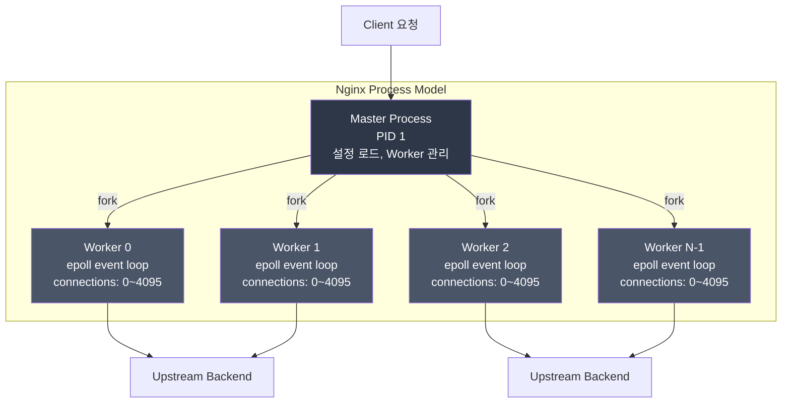
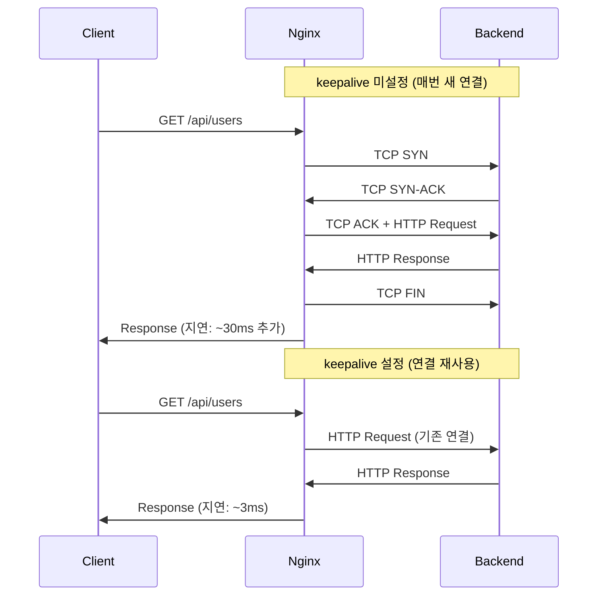
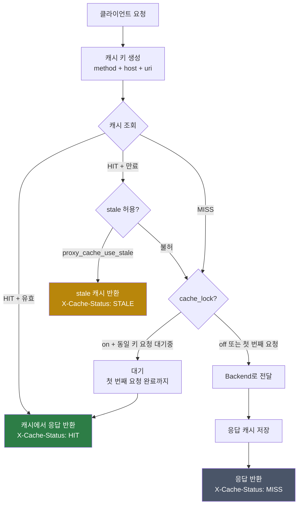
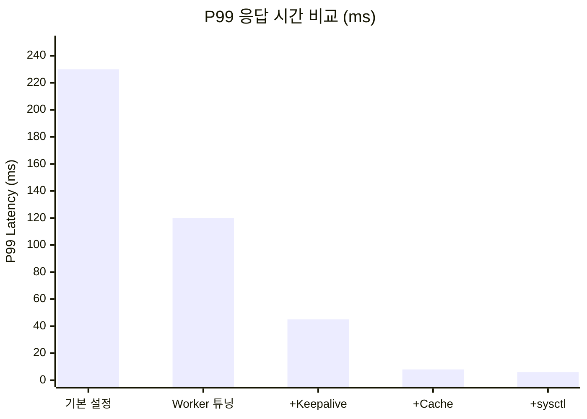

# Nginx 성능 튜닝

## 개요

기본 Nginx 설정은 보수적인 값으로 되어 있다. 서버 사양과 트래픽 패턴에 맞게 튜닝하면 처리량을 수 배 높이고 응답 시간을 크게 줄일 수 있다.

```
성능 튜닝 영역:
  Worker 설정  — CPU 코어 활용 극대화
  연결 관리    — keepalive, 버퍼, 커넥션 풀링
  Gzip 압축   — 전송량 60~80% 감소
  캐싱         — 백엔드 요청 수 감소
  정적 파일    — sendfile, 브라우저 캐시
  프로토콜     — HTTP/2, HTTP/3(QUIC) 적용
  커널 튜닝    — sysctl 파라미터 연동
```

---

## Worker 프로세스 구조

Nginx는 Master-Worker 모델로 동작한다. Master 프로세스가 설정을 읽고 Worker 프로세스를 fork한다. 각 Worker는 독립적으로 요청을 처리하며, 이벤트 루프 기반이라 하나의 Worker가 수천 개의 동시 연결을 처리한다.



Worker 수가 CPU 코어 수보다 많으면 컨텍스트 스위칭 비용이 생기고, 적으면 코어가 놀게 된다.

```nginx
# /etc/nginx/nginx.conf
user nginx;

# CPU 코어 수에 맞춰 자동 설정 (auto 권장)
worker_processes auto;

# 워커당 최대 파일 디스크립터 수 (ulimit -n 값 이하로 설정)
worker_rlimit_nofile 65535;

events {
    # 워커당 최대 동시 연결 수
    # worker_processes * worker_connections = 최대 동시 연결
    worker_connections 4096;

    # 한 번에 가능한 많은 연결을 수락 (Linux 권장)
    multi_accept on;

    # 이벤트 처리 방식 (Linux: epoll이 최고 성능)
    use epoll;
}
```

### Worker CPU 바인딩

Worker 프로세스를 특정 CPU 코어에 고정하면 캐시 미스가 줄어든다. 코어 간 Worker가 옮겨 다니면 L1/L2 캐시를 다시 채워야 해서 성능 손실이 생긴다.

```nginx
# 4코어 서버: 각 Worker를 코어에 1:1 바인딩
worker_processes 4;
worker_cpu_affinity 0001 0010 0100 1000;

# auto로 자동 바인딩 (1.9.10+)
worker_processes auto;
worker_cpu_affinity auto;
```

| 설정 | 기본값 | 권장값 | 설명 |
|------|--------|--------|------|
| `worker_processes` | 1 | `auto` | CPU 코어 수만큼 |
| `worker_connections` | 512 | 4096~16384 | 코어당 처리 연결 수 |
| `worker_rlimit_nofile` | OS 기본 | 65535 | 파일 디스크립터 한도 |
| `multi_accept` | off | on | 한 번에 여러 연결 수락 |
| `worker_cpu_affinity` | 없음 | auto | CPU 캐시 히트율 향상 |

---

## 연결 유지 (Keepalive)

### 클라이언트 Keepalive

```nginx
http {
    # 클라이언트 keepalive 유지 시간
    keepalive_timeout 65;

    # keepalive로 처리할 최대 요청 수 (이후 연결 종료)
    keepalive_requests 1000;
}
```

### 업스트림 Keepalive 커넥션 풀링

Nginx → Backend 구간에서 매 요청마다 TCP 핸드셰이크를 하면 수십ms 지연이 추가된다. upstream keepalive를 설정하면 연결을 재사용한다.



```nginx
upstream backend {
    server 10.0.1.10:8080;
    server 10.0.1.11:8080;

    # 커넥션 풀 설정
    keepalive 32;              # Worker당 유휴 연결 유지 수
    keepalive_timeout 60s;     # 유휴 연결 유지 시간
    keepalive_requests 1000;   # 연결당 최대 요청 수 (기본 1000)
}

server {
    location /api/ {
        proxy_pass http://backend;

        # keepalive 사용 시 필수 — HTTP/1.0은 keepalive를 지원하지 않는다
        proxy_http_version 1.1;
        proxy_set_header Connection "";
    }
}
```

**keepalive 값 산정 방법:**

실제 운영에서 `keepalive` 값을 너무 크게 잡으면 유휴 연결이 메모리를 잡아먹고, 너무 작으면 연결을 자주 맺게 된다.

```bash
# 현재 Nginx → Backend 연결 수 확인
ss -tn state established | grep ":8080" | wc -l

# Worker 수로 나누면 Worker당 평균 연결 수가 나온다
# keepalive 값은 이 값의 1.5~2배 정도로 설정
```

| 트래픽 패턴 | keepalive 권장값 | keepalive_requests |
|------------|-----------------|-------------------|
| 저트래픽 (RPS < 100) | 8~16 | 100 |
| 중간 (RPS 100~1000) | 32~64 | 1000 |
| 고트래픽 (RPS > 1000) | 64~128 | 10000 |

---

## 버퍼 설정

```nginx
http {
    # 클라이언트 요청 버퍼
    client_body_buffer_size    128k;  # 요청 본문 버퍼 (기본 8k/16k)
    client_max_body_size       10m;   # 최대 업로드 크기
    client_header_buffer_size  1k;    # 요청 헤더 버퍼
    large_client_header_buffers 4 8k; # 큰 헤더 처리 (JWT 토큰 등)

    # 프록시 응답 버퍼
    proxy_buffer_size     128k;   # 응답 첫 번째 청크 버퍼
    proxy_buffers         4 256k; # 응답 본문 버퍼 (4개 * 256k)
    proxy_busy_buffers_size 256k; # 전송 중 버퍼

    # 타임아웃
    proxy_connect_timeout 60s;
    proxy_send_timeout    60s;
    proxy_read_timeout    60s;
}
```

---

## Gzip 압축

```nginx
http {
    gzip on;

    # 프록시 응답도 압축 (any: 모든 요청 포함)
    gzip_proxied any;

    # Vary: Accept-Encoding 헤더 추가 — CDN 캐시 호환성
    gzip_vary on;

    # 압축 레벨 (1~9, 6이 속도/압축률 균형)
    gzip_comp_level 6;

    # 최소 압축 대상 크기 (1KB 미만은 압축 효율 낮음)
    gzip_min_length 1024;

    # 압축할 MIME 타입
    gzip_types
        text/plain
        text/css
        text/xml
        text/javascript
        application/json
        application/javascript
        application/xml
        application/xml+rss
        application/atom+xml
        image/svg+xml
        font/otf
        font/ttf
        font/woff
        font/woff2;

    # 구형 브라우저(IE6) 제외
    gzip_disable "msie6";
}
```

### Gzip 효과 확인

```bash
# 압축 응답 확인
curl -I -H "Accept-Encoding: gzip" https://example.com/api/products
# Content-Encoding: gzip 헤더가 있으면 압축 적용됨

# 압축 전후 크기 비교
curl -s https://example.com/api/products | wc -c
curl -s --compressed https://example.com/api/products | wc -c
```

---

## 프록시 캐싱

### 캐시 히트/미스 흐름



### 캐시 설정

```nginx
http {
    # 캐시 저장소 정의
    proxy_cache_path /var/cache/nginx
                     levels=1:2              # 디렉토리 구조
                     keys_zone=api_cache:10m # 키 인덱스 메모리
                     max_size=1g             # 디스크 최대 크기
                     inactive=60m            # 60분 미사용 시 삭제
                     use_temp_path=off;      # 임시 경로 없이 직접 저장

    proxy_cache_path /var/cache/nginx/static
                     levels=1:2
                     keys_zone=static_cache:10m
                     max_size=5g
                     inactive=7d;            # 정적 파일: 7일
}

server {
    # API 응답 캐싱
    location /api/products {
        proxy_pass http://backend;
        proxy_cache api_cache;

        proxy_cache_valid 200 10m;  # 200: 10분
        proxy_cache_valid 404  1m;  # 404:  1분
        proxy_cache_valid any   1m; # 나머지:  1분

        proxy_cache_key "$request_method$host$request_uri";

        # 캐시 상태 헤더 (HIT/MISS/BYPASS/EXPIRED)
        add_header X-Cache-Status $upstream_cache_status;

        # 캐시 중 업스트림 장애 시 stale 캐시 사용
        proxy_cache_use_stale error timeout updating;

        # 동일 캐시 키 요청이 동시에 올 때 하나만 통과
        proxy_cache_lock on;
    }

    # 캐시 무효화 조건
    location /api/auth {
        proxy_pass http://backend;
        proxy_no_cache 1;       # 캐시 저장 안 함
        proxy_cache_bypass 1;   # 캐시 조회 안 함
    }
}
```

---

## 정적 파일 서빙

```nginx
http {
    # 커널 레벨 파일 전송 (기본 on, 정적 파일 서빙 시 필수)
    sendfile on;

    # sendfile + TCP 패킷 묶어서 전송
    tcp_nopush on;
    # keepalive 연결에서 지연 제거
    tcp_nodelay on;
}

server {
    # 정적 파일 브라우저 캐시
    location /static/ {
        alias /var/www/static/;

        # 변경 빈도에 따라 TTL 설정
        location ~* \.(jpg|jpeg|png|gif|ico|webp|avif)$ {
            expires 30d;
            add_header Cache-Control "public, immutable";
        }

        location ~* \.(css|js)$ {
            expires 1y;
            add_header Cache-Control "public, immutable";
            # 참고: 파일명에 해시 포함(bundle.a3f9c1.js)하면 immutable 가능
        }

        location ~* \.(woff|woff2|ttf|eot|otf)$ {
            expires 1y;
            add_header Cache-Control "public, immutable";
            add_header Access-Control-Allow-Origin "*";  # 폰트 CORS
        }
    }

    # SPA (React/Vue) 라우팅
    location / {
        root /var/www/frontend/dist;
        index index.html;
        try_files $uri $uri/ /index.html;

        # HTML은 캐시 금지 (항상 최신 버전 확인)
        location = /index.html {
            add_header Cache-Control "no-cache, no-store, must-revalidate";
        }
    }
}
```

---

## Open File Cache

```nginx
http {
    # 자주 접근하는 파일의 메타데이터를 캐시 (inode, 크기, 수정 시간)
    open_file_cache max=10000 inactive=20s;
    open_file_cache_valid    30s;  # 캐시 유효성 재검사 주기
    open_file_cache_min_uses 2;    # 2회 이상 접근 시 캐시
    open_file_cache_errors   on;   # 파일 없음(404)도 캐시
}
```

---

## HTTP/2 설정

HTTP/2는 하나의 TCP 연결에서 여러 요청을 동시에 처리한다. HTTP/1.1에서는 브라우저가 도메인당 6~8개 연결을 열어야 했지만, HTTP/2에서는 하나로 충분하다.

```nginx
server {
    listen 443 ssl http2;
    listen [::]:443 ssl http2;

    ssl_certificate     /etc/ssl/certs/example.com.crt;
    ssl_certificate_key /etc/ssl/private/example.com.key;

    # HTTP/2 관련 튜닝
    http2_max_concurrent_streams 128;  # 동시 스트림 수 (기본 128)

    # HTTP/2 Server Push (1.13.9+)
    # 브라우저가 HTML을 요청할 때 CSS/JS를 미리 전송
    location = /index.html {
        http2_push /static/css/main.css;
        http2_push /static/js/app.js;
    }

    # 자동 Server Push — 백엔드의 Link 헤더 기반
    location /app/ {
        proxy_pass http://backend;
        http2_push_preload on;
        # 백엔드가 Link: </style.css>; rel=preload 헤더를 보내면
        # Nginx가 자동으로 push 한다
    }
}
```

### HTTP/2 적용 시 달라지는 점

HTTP/1.1에서 쓰던 성능 핵(도메인 샤딩, 스프라이트 이미지, CSS/JS 번들링)이 HTTP/2에서는 오히려 역효과를 낸다.

| HTTP/1.1 기법 | HTTP/2에서 | 이유 |
|--------------|-----------|------|
| 도메인 샤딩 (cdn1, cdn2...) | 불필요 | 멀티플렉싱으로 하나의 연결이면 충분 |
| 이미지 스프라이트 | 불필요 | 개별 요청 오버헤드가 거의 없다 |
| CSS/JS 합치기 | 상황에 따라 | 작은 파일을 개별 전송해도 성능 차이 없음 |
| 인라인 CSS/JS | 불필요 | Server Push로 대체 가능 |

---

## HTTP/3 (QUIC) 설정

HTTP/3는 TCP 대신 UDP 기반의 QUIC 프로토콜을 사용한다. TCP의 Head-of-Line Blocking 문제를 해결하고, 연결 수립 시간이 0-RTT까지 줄어든다. Nginx 1.25.0부터 기본 포함 (이전에는 별도 빌드 필요).

```nginx
server {
    # HTTP/3 + HTTP/2 동시 리스닝
    listen 443 ssl;
    listen 443 quic reuseport;
    listen [::]:443 ssl;
    listen [::]:443 quic reuseport;

    ssl_certificate     /etc/ssl/certs/example.com.crt;
    ssl_certificate_key /etc/ssl/private/example.com.key;

    # HTTP/3에서는 TLS 1.3이 필수
    ssl_protocols TLSv1.2 TLSv1.3;

    # 브라우저에게 HTTP/3 사용 가능 알림
    add_header Alt-Svc 'h3=":443"; ma=86400';

    # QUIC 관련 설정
    quic_retry on;            # 주소 검증으로 DDoS 방어
    ssl_early_data on;        # 0-RTT 지원 (재연결 시 빠름)

    # 0-RTT 사용 시 리플레이 공격 대비 — 멱등하지 않은 요청에서 주의
    proxy_set_header Early-Data $ssl_early_data;
}
```

### HTTP/3 사용 시 확인 사항

```bash
# 서버의 HTTP/3 지원 확인
curl --http3-only https://example.com -I
# alt-svc: h3=":443" 헤더가 보이면 지원

# UDP 443 포트가 열려 있어야 한다
# 방화벽에서 UDP 443을 별도로 허용해야 하는 경우가 많다
sudo ufw allow 443/udp
# 또는
sudo iptables -A INPUT -p udp --dport 443 -j ACCEPT
```

---

## 커널 파라미터 (sysctl) 튜닝

Nginx 설정만 바꿔서는 한계가 있다. OS 커널 레벨의 네트워크 스택 설정이 병목이 되는 경우가 많다.

```bash
# /etc/sysctl.d/99-nginx-tuning.conf

# --- 파일 디스크립터 ---
fs.file-max = 2097152                     # 시스템 전체 최대 fd 수

# --- TCP 연결 관리 ---
net.core.somaxconn = 65535               # listen() backlog 최대값
net.ipv4.tcp_max_syn_backlog = 65535     # SYN 큐 크기
net.core.netdev_max_backlog = 65535      # 네트워크 디바이스 큐

# --- TIME_WAIT 관리 ---
# 고트래픽 서버에서 TIME_WAIT 소켓이 포트를 다 차지하는 경우가 있다
net.ipv4.tcp_tw_reuse = 1               # TIME_WAIT 소켓 재사용
net.ipv4.tcp_fin_timeout = 15           # FIN_WAIT2 타임아웃 (기본 60s)
net.ipv4.ip_local_port_range = 1024 65535  # 사용 가능 포트 범위

# --- TCP 버퍼 ---
net.core.rmem_max = 16777216             # 수신 버퍼 최대 (16MB)
net.core.wmem_max = 16777216             # 송신 버퍼 최대 (16MB)
net.ipv4.tcp_rmem = 4096 87380 16777216  # TCP 수신 버퍼 (min/default/max)
net.ipv4.tcp_wmem = 4096 65536 16777216  # TCP 송신 버퍼 (min/default/max)

# --- TCP 최적화 ---
net.ipv4.tcp_fastopen = 3               # TFO 활성화 (클라이언트+서버)
net.ipv4.tcp_slow_start_after_idle = 0   # idle 후 slow start 비활성화
net.ipv4.tcp_mtu_probing = 1            # MTU 자동 탐색

# --- keepalive ---
net.ipv4.tcp_keepalive_time = 600        # keepalive 시작 시간 (기본 7200s)
net.ipv4.tcp_keepalive_intvl = 30        # keepalive 재시도 간격
net.ipv4.tcp_keepalive_probes = 3        # keepalive 최대 재시도 횟수
```

```bash
# 적용
sudo sysctl -p /etc/sysctl.d/99-nginx-tuning.conf

# 현재 값 확인
sysctl net.core.somaxconn
sysctl net.ipv4.ip_local_port_range
```

### Nginx와 sysctl 연동 시 주의 사항

Nginx `listen` 디렉티브의 `backlog` 파라미터는 `net.core.somaxconn` 값을 넘을 수 없다. Nginx에서 `backlog=4096`으로 설정해도 커널 값이 128이면 128로 잘린다.

```nginx
server {
    # backlog를 sysctl의 somaxconn 이하로 설정
    listen 80 backlog=4096;
}
```

```bash
# somaxconn이 backlog보다 크거나 같은지 확인
sysctl net.core.somaxconn
# 128이 나오면 Nginx의 backlog=4096은 의미가 없다
```

---

## 벤치마크

### wrk 시나리오별 실행

wrk는 가볍고 빠른 HTTP 벤치마크 도구다. 스레드와 연결 수를 조절해서 다양한 부하 패턴을 만들 수 있다.

```bash
# 기본 — 정적 파일 서빙 성능 측정
wrk -t4 -c100 -d30s http://localhost/static/index.html

# 높은 동시 연결 — keepalive 효과 확인
wrk -t8 -c1000 -d30s http://localhost/api/products

# 긴 요청 — 타임아웃 설정 검증
wrk -t2 -c50 -d60s --timeout 10s http://localhost/api/heavy-query
```

#### wrk Lua 스크립트로 POST 요청 테스트

```lua
-- post_test.lua
wrk.method = "POST"
wrk.headers["Content-Type"] = "application/json"
wrk.body = '{"page": 1, "size": 20}'

-- 응답 코드별 카운트
done = function(summary, latency, requests)
    io.write("Latency Avg: " .. latency.mean / 1000 .. "ms\n")
    io.write("Latency Max: " .. latency.max / 1000 .. "ms\n")
    io.write("Requests/sec: " .. summary.requests / (summary.duration / 1000000) .. "\n")
end
```

```bash
wrk -t4 -c200 -d30s -s post_test.lua http://localhost/api/products
```

#### wrk 결과 해석

```
Running 30s test @ http://localhost/api/products
  8 threads and 1000 connections
  Thread Stats   Avg      Stdev     Max   +/- Stdev
    Latency    12.34ms   5.67ms  234.56ms   89.12%
    Req/Sec     9.87k     1.23k   15.43k    72.34%
  2367890 requests in 30.00s, 1.23GB read
Requests/sec:  78929.67
Transfer/sec:     42.01MB
```

- **Latency Avg**: 평균 응답 시간. API 서버라면 50ms 이하가 목표다.
- **Latency Max**: 최대 응답 시간. 이 값이 Avg의 10배 이상이면 간헐적 지연이 있다는 뜻이다.
- **+/- Stdev**: 응답 시간 분포. 이 값이 낮을수록 일관된 성능이다.
- **Req/Sec**: Worker 스레드당 초당 처리량.

### vegeta 시나리오별 실행

vegeta는 일정한 RPS(Requests Per Second)를 유지하면서 테스트하는 도구다. wrk가 "최대한 빠르게" 요청을 보내는 반면, vegeta는 지정한 속도로 보낸다. 실제 트래픽 패턴을 재현하기에 좋다.

```bash
# 설치
go install github.com/tsenart/vegeta@latest
# 또는 brew install vegeta

# 기본 — 초당 200 요청으로 30초 테스트
echo "GET http://localhost/api/products" | \
  vegeta attack -rate=200/s -duration=30s | \
  vegeta report

# 점진적 부하 증가 — 초당 50에서 500까지
echo "GET http://localhost/api/products" | \
  vegeta attack -rate=50/s -duration=10s > result1.bin
echo "GET http://localhost/api/products" | \
  vegeta attack -rate=200/s -duration=10s > result2.bin
echo "GET http://localhost/api/products" | \
  vegeta attack -rate=500/s -duration=10s > result3.bin

# 결과 합쳐서 리포트
cat result1.bin result2.bin result3.bin | vegeta report
```

#### vegeta 다중 엔드포인트 테스트

```bash
# targets.txt — 여러 엔드포인트를 동시에 테스트
cat > targets.txt << 'EOF'
GET http://localhost/api/products
GET http://localhost/api/users
POST http://localhost/api/orders
Content-Type: application/json
@order_body.json
EOF

vegeta attack -targets=targets.txt -rate=100/s -duration=60s | vegeta report
```

#### vegeta 결과를 히스토그램으로 확인

```bash
# 텍스트 히스토그램
echo "GET http://localhost/api/products" | \
  vegeta attack -rate=300/s -duration=30s | \
  vegeta report -type=hist[0,5ms,10ms,25ms,50ms,100ms,500ms]

# 결과 예시:
# Bucket         #      %       Histogram
# [0,     5ms]   6234   69.27%  ###################################
# [5ms,   10ms]  1823   20.26%  ##########
# [10ms,  25ms]  567    6.30%   ###
# [25ms,  50ms]  234    2.60%   #
# [50ms,  100ms] 98     1.09%
# [100ms, 500ms] 44     0.49%

# HTML 그래프 생성
echo "GET http://localhost/api/products" | \
  vegeta attack -rate=300/s -duration=30s | \
  vegeta plot > benchmark.html
```

---

## 튜닝 전후 비교

### 기본 설정 대비 튜닝 효과

```mermaid
xychart-beta
    title "튜닝 전후 Requests/sec 비교"
    x-axis ["정적 파일", "API (캐시 미적용)", "API (캐시 적용)", "Gzip 적용"]
    y-axis "Requests/sec" 0 --> 50000
    bar [5200, 1800, 1800, 1800]
    bar [38000, 8500, 28000, 7200]
```



| 설정 항목 | 기본값 | 튜닝 후 | 효과 |
|---------|--------|---------|------|
| `worker_processes` | 1 | auto (8) | CPU 8배 활용 |
| `worker_connections` | 512 | 4096 | 8배 더 많은 연결 |
| `gzip` | off | on | 응답 크기 70% 감소 |
| `keepalive` (upstream) | 없음 | 32 | 연결 재사용, 지연 수십ms 감소 |
| `proxy_cache` | 없음 | on | 캐시 히트 시 백엔드 요청 0 |
| `open_file_cache` | off | on | 정적 파일 stat() 호출 제거 |
| `tcp_fastopen` | off | on | 연결 수립 1-RTT 절약 |
| `HTTP/2` | 미적용 | 적용 | 멀티플렉싱으로 연결 수 1/6 감소 |

### 응답 시간 분포 비교



---

## 성능 측정

```bash
# wrk — HTTP 벤치마크
wrk -t12 -c400 -d30s https://example.com/api/products

# ab (Apache Bench) — 간단한 벤치마크
ab -n 10000 -c 100 https://example.com/api/products

# Nginx 상태 페이지 (stub_status 모듈)
location /nginx_status {
    stub_status;
    allow 127.0.0.1;
    deny all;
}
# Active connections, accepts, handled, requests 확인 가능

# 실시간 연결 수 확인
ss -s
netstat -an | grep ESTABLISHED | wc -l
```

---

## 튜닝 시 빠뜨리기 쉬운 항목

| 영역 | 설정 | 놓치면 생기는 문제 |
|------|------|-------------------|
| Worker | `worker_processes auto` | CPU 코어 1개만 사용해서 나머지 코어가 놀게 된다 |
| Worker | `worker_connections` 4096 이상 | 동시 접속이 몰릴 때 연결 거부(502) 발생 |
| Worker | `worker_rlimit_nofile` 65535 | 파일 디스크립터 부족으로 "Too many open files" 에러 |
| 압축 | `gzip on` + MIME 타입 지정 | JSON, CSS, JS 응답이 압축 없이 전송되어 대역폭 낭비 |
| 연결 | upstream `keepalive` + `proxy_http_version 1.1` | 매 요청마다 TCP 핸드셰이크 반복, 수십ms 지연 추가 |
| 캐시 | 정적 파일 `expires` + `Cache-Control: immutable` | 브라우저가 매번 서버에 재검증 요청을 보낸다 |
| 전송 | `sendfile`, `tcp_nopush`, `tcp_nodelay` 활성화 | 정적 파일 서빙 시 불필요한 커널-유저 공간 복사 발생 |
| 캐시 | `proxy_cache` (읽기 많은 API) | 동일 요청이 반복적으로 백엔드까지 도달 |
| 캐시 | `open_file_cache` (정적 파일 서빙) | 매 요청마다 디스크 stat() 시스템콜 호출 |
| 업로드 | `client_max_body_size` 조정 | 기본값 1MB라 파일 업로드 시 413 에러 발생 |
| 커널 | `net.core.somaxconn` 65535 | Nginx의 backlog 설정이 커널에서 잘린다 |
| 커널 | `net.ipv4.tcp_tw_reuse` 1 | TIME_WAIT 소켓이 포트를 다 차지해서 연결 실패 |
| 프로토콜 | HTTP/2 적용 후 도메인 샤딩 제거 | 오히려 연결이 늘어나서 성능 저하 |
| HTTP/3 | UDP 443 방화벽 허용 | QUIC 패킷이 방화벽에서 차단되어 HTTP/2로 폴백 |
