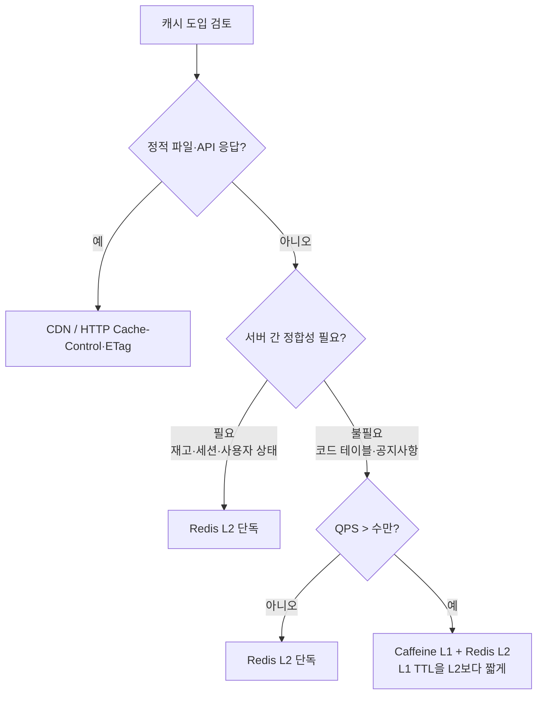

# 캐싱 허브

## 이 주제를 언제 찾게 되는가

- 동일 데이터를 반복 조회하는 DB 부하를 줄이기 위해 캐시 레이어를 처음 도입할 때
- 캐시와 DB 사이의 데이터 불일치(Cache Invalidation) 문제를 해결해야 할 때
- Redis를 캐시로 쓸 때 TTL·Eviction Policy를 어떻게 설정해야 할지 고민될 때
- MSA 환경에서 서비스가 여럿일 때 캐시 일관성을 어떻게 유지할지 설계할 때
- Spring `@Cacheable` 도입 후 캐시 무효화 타이밍이 맞지 않는 문제가 발생할 때
- 트래픽 급증 시 Redis에 없는 키를 동시에 수백 개 요청이 몰리는 Cache Stampede를 경험했을 때
- NestJS Cache Module이나 Node.js 멀티레벨 캐시를 구성할 때
- 배포 후 CloudFront에 구버전 콘텐츠가 남아 Invalidation 방법을 찾아야 할 때
- CDN 캐시 히트율이 갑자기 떨어지거나, 캐시 키 설계를 처음 잡을 때
- CDN 앞에서 캐시가 다른 사용자의 응답을 반환하는 데이터 혼용 사고를 조사할 때

## 어떤 캐시 레이어를 써야 하는가



레이어 선택에서 가장 흔한 실수는 로컬 캐시(L1)의 인스턴스 격리를 간과하는 것이다. 서버 2대가 각자 다른 값을 캐싱하면 배포 직후 사용자마다 다른 데이터를 보게 된다. 재고·세션·사용자 상태처럼 서버 간 정합성이 필요한 데이터는 처음부터 Redis(L2)를 써야 한다.

L1+L2 조합은 Redis 왕복 레이턴시(~1ms)가 병목이 되는 초당 수만 QPS 환경에서 쓴다. L1 TTL을 L2보다 짧게 잡아야 정합성 손실 구간을 줄일 수 있다.

```java
// Spring Boot: Caffeine(L1) + Redis(L2) 2단 구성
@Configuration
@EnableCaching
public class CacheConfig {

    // L1: 30초 TTL. 코드 테이블·공지사항 전용
    @Bean("caffeineCacheManager")
    public CacheManager caffeineCacheManager() {
        CaffeineCacheManager manager = new CaffeineCacheManager("product-local");
        manager.setCaffeine(
            Caffeine.newBuilder()
                .expireAfterWrite(30, TimeUnit.SECONDS)
                .maximumSize(500)
        );
        return manager;
    }

    // L2: Redis. 정합성이 필요한 데이터
    @Bean("redisCacheManager")
    @Primary
    public CacheManager redisCacheManager(RedisConnectionFactory cf) {
        RedisCacheConfiguration config = RedisCacheConfiguration.defaultCacheConfig()
            .entryTtl(Duration.ofMinutes(10))
            .disableCachingNullValues();
        return RedisCacheManager.builder(cf).cacheDefaults(config).build();
    }
}

// @Qualifier로 레이어를 명시해야 한다
@Cacheable(cacheManager = "caffeineCacheManager", value = "product-local", key = "#id")
public Product getProductLocal(Long id) { ... }
```

## 캐시 무효화 타이밍 문제

캐시 도입 후 가장 많이 마주치는 문제다. 무효화 방식마다 트레이드오프가 다르다.

**TTL 기반**: 구현이 단순하다. 무효화 누락이 없는 대신 만료 전까지 오래된 데이터가 노출된다. 재고·가격처럼 정확도가 중요한 데이터에는 맞지 않는다.

**이벤트 기반 (`@CacheEvict`)**: 데이터 변경 즉시 무효화한다. Spring에서 `@CacheEvict(allEntries = true)`를 남발하면 캐시가 통째로 날아가 직후 트래픽이 DB로 몰린다. 변경된 키만 지우는 것이 원칙이다.

```java
// 잘못된 패턴: 상품 하나 수정에 전체 무효화 → DB 부하 폭발
@CacheEvict(value = "products", allEntries = true)
public void updateProduct(Product product) { ... }

// 올바른 패턴: 해당 키만 무효화
@CacheEvict(value = "products", key = "#product.id")
public void updateProduct(Product product) { ... }
```

MSA 환경에서는 서비스 A가 데이터를 수정하고 서비스 B가 그 데이터를 캐싱하고 있을 때 이벤트 기반 무효화가 복잡해진다. 메시지 브로커를 통해 캐시 무효화 이벤트를 발행하는 패턴이 필요하다. 구체적인 설계는 [분산 캐싱 패턴](../Architecture/MSA/분산_캐싱_패턴.md)에 있다.

## Cache Stampede

TTL 만료 직후 동시에 수백 개 요청이 DB를 찌르는 현상이다. Redis `SETNX`(SET if Not eXists)로 분산 락을 걸어 하나의 요청만 DB를 조회하게 한다.

```java
// 값 비교 후 삭제를 원자적으로 처리한다.
// 두 단계로 나누면 비교와 삭제 사이에 TTL 이 만료돼 남의 락을 지울 수 있다.
private static final RedisScript<Long> UNLOCK = RedisScript.of("""
    if redis.call('get', KEYS[1]) == ARGV[1] then
      return redis.call('del', KEYS[1])
    else
      return 0
    end
    """, Long.class);

public Product getProduct(Long id) throws InterruptedException {
    String cacheKey = "product:" + id;
    String lockKey  = "lock:product:" + id;

    // 1. 캐시 조회
    Product cached = (Product) redisTemplate.opsForValue().get(cacheKey);
    if (cached != null) return cached;

    // 2. 분산 락 획득 시도 (10초 TTL)
    //    값은 내 식별자다. 상수를 넣으면 해제할 때 누구 락인지 구분할 수 없다.
    String token = UUID.randomUUID().toString();
    Boolean locked = redisTemplate.opsForValue()
        .setIfAbsent(lockKey, token, Duration.ofSeconds(10));

    if (Boolean.TRUE.equals(locked)) {
        try {
            Product product = productRepository.findById(id).orElseThrow();
            redisTemplate.opsForValue().set(cacheKey, product, Duration.ofMinutes(10));
            return product;
        } finally {
            // 내 락일 때만 지운다. DB 조회가 TTL 을 넘기면 락이 이미 만료돼
            // 다른 프로세스가 잡고 있을 수 있는데, 무조건 delete 하면 그걸 푼다.
            redisTemplate.execute(UNLOCK, List.of(lockKey), token);
        }
    } else {
        // 락 획득 실패한 요청은 짧게 대기 후 캐시 재조회
        Thread.sleep(100);
        return (Product) redisTemplate.opsForValue().get(cacheKey);
    }
}
```

Node.js 환경에서의 LRU 구현과 Stampede 방지 코드는 [Node Cache Advanced](../Framework/Node/캐싱/Node_Cache_Advanced.md)에 있다.

## 문서 지도

| 문서 | 이 문서가 답하는 것 | 깊이 |
|---|---|---|
| [캐싱 전략](../Backend/Caching/Caching_Strategies.md) | Cache-Aside·Write-Through·Write-Behind 패턴 비교, NestJS 구현 예시 | 입문 |
| [캐시 워밍](../Backend/Caching/Cache_Warming.md) | 배포 직후 Cold Start 문제, Lazy·Eager Warming 트레이드오프, Redis SCAN 재적재, 헬스체크 연동 | 실무 |
| [Spring Cache](../Framework/Java/Spring/Spring_Cache.md) | `@Cacheable`·`@CacheEvict`·`@CachePut` 동작 원리, Self-invocation 문제, Caffeine·Redis CacheManager 분리 설정 | 실무 |
| [Spring AOP Deep Dive](../Language/Java/관점지향%20프로그래밍(AOP)/AOP_Deep_Dive.md) | Spring `@Cacheable`의 AOP 동작 원리, 커스텀 캐시 키 추출 방법 | 실무 |
| [API 캐싱](../Backend/API/API_Caching.md) | HTTP 캐시 헤더(ETag, Cache-Control), CDN 캐싱 설계 | 실무 |
| [CDN 동작 원리](../Network/CDN.md) | Edge/Origin 구조, Pull·Push 모델, 캐시 키 설계, Vary 헤더 함정, Purge·Versioning·Surrogate Key, Signed URL, CloudFront·Cloudflare·Fastly 벤더 비교 | 실무 |
| [CloudFront 운영](../Cloud/AWS/Network/CDN.md) | Cache Policy·Origin Request Policy 설정, TTL 우선순위, 쿼리스트링 정렬, Authorization 헤더 데이터 혼용 사고, 캐시 히트율 측정 | 실무 |
| [CloudFront 캐시 무효화 정책](../Cloud/AWS/Network/CDN%20캐시%20무효화%20정책.md) | GitHub Actions·Terraform 연동 Invalidation 자동화, 전파 지연 대응, 해시 기반 URL로 무효화 최소화, 계층별 무효화 순서(CDN → 로컬 캐시 → Redis) | 실무 |
| [웹 캐시 포이즈닝](../Security/Web_Cache_Poisoning.md) | unkeyed 입력으로 캐시를 오염시키는 공격 원리, X-Forwarded-Host 악용, 캐시 디셉션, 엣지 헤더 제거·proxy_cache_key 설계·탐지 방법 | 심화 |
| [Redis Cache Strategy](../DataBase/NoSQL/Redis/Redis_Cache_Strategy.md) | Redis 캐시 운영 — Eviction Policy, 키 설계, Hot Key 대응 | 실무 |
| [분산 캐싱 패턴](../Architecture/MSA/분산_캐싱_패턴.md) | MSA에서 로컬 캐시 vs 공유 캐시, 캐시 정합성 보장 전략 | 심화 |
| [캐싱 전략 (Node)](../Framework/Node/캐싱/캐싱_전략.md) | Node.js 환경에서의 캐싱 패턴 구현 | 실무 |
| [멀티레벨 캐시](../Framework/Node/캐싱/Multi_Level_Cache.md) | L1(로컬)·L2(Redis) 2단계 캐시 구성 및 동기화 전략 | 심화 |
| [Node Cache Advanced](../Framework/Node/캐싱/Node_Cache_Advanced.md) | LRU/LFU 직접 구현, Cache Stampede 방지, 다중 인스턴스 일관성 | 심화 |
| [NestJS Cache Module](../Framework/Node/NestJS/Nest_JS_Cache_Module.md) | NestJS의 CacheManager와 Redis 연동 설정 | 실무 |

## 읽는 순서

### Java/Spring 경로

1. **캐싱 전략** — Cache-Aside가 기본값이 되는 이유, Write-Through와의 트레이드오프를 이해한다
2. **Spring Cache** — `@Cacheable` Self-invocation 함정과 Caffeine·Redis CacheManager 분리 설정을 파악한다
3. **Spring AOP Deep Dive** — Spring이 `@Cacheable`을 AOP 프록시로 처리하는 원리, 커스텀 캐시 키 추출까지 파고들 때 읽는다
4. **Redis Cache Strategy** — Eviction Policy 선택 기준과 Hot Key 분산 방법을 적용한다
5. **분산 캐싱 패턴** — 서비스가 여럿일 때 캐시 정합성을 보장하는 아키텍처를 설계한다

### Node.js 경로

1. **캐싱 전략 (Node)** — Cache-Aside 기본 구현과 node-cache·Redis 래핑 방법을 익힌다
2. **Redis Cache Strategy** — TTL·Eviction Policy와 Hot Key 문제를 다루는 방법을 파악한다
3. **API 캐싱** — HTTP 레이어와 CDN에서의 캐싱으로 범위를 넓힌다
4. **NestJS Cache Module** — CacheManager를 Redis에 연결하는 실제 설정을 적용한다
5. **멀티레벨 캐시 → Node Cache Advanced** — L1+L2 조합 구성과 Cache Stampede 방지 패턴으로 마무리한다

### CDN/인프라 경로

캐시 레이어를 애플리케이션 안이 아니라 인프라 레벨에서 잡을 때 읽는 순서다.

1. **CDN 동작 원리** — Pull 모델, 캐시 키 설계, Vary 헤더 함정, 히트율 디버깅을 파악한다
2. **CloudFront 운영** — Cache Policy·Origin Request Policy 설정과 TTL 우선순위를 적용한다
3. **CloudFront 캐시 무효화 정책** — CI/CD 파이프라인 연동과 전파 지연 문제를 해결한다
4. **웹 캐시 포이즈닝** — CDN을 운영할 때 unkeyed 입력이 어떻게 보안 사고로 이어지는지 파악한다

## 아직 없는 것

- 세션 캐시와 데이터 캐시의 분리 설계
- Valkey로 Redis를 대체할 때의 마이그레이션 포인트
