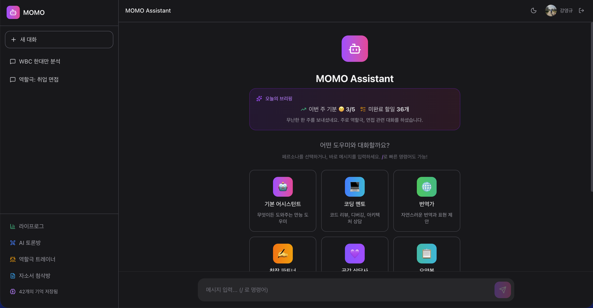
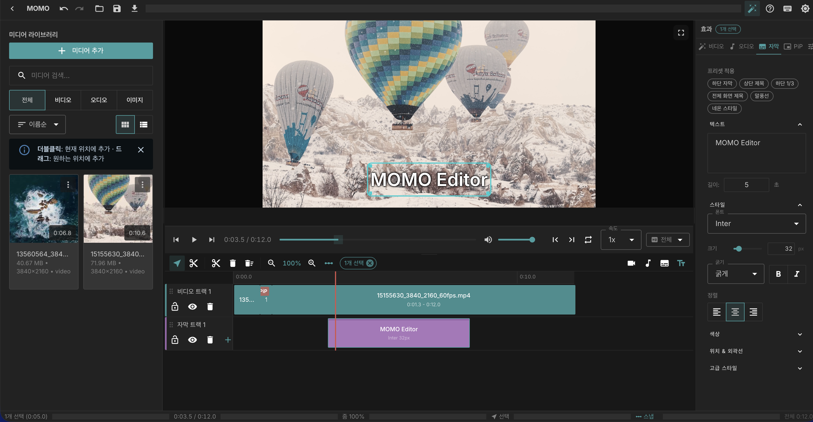
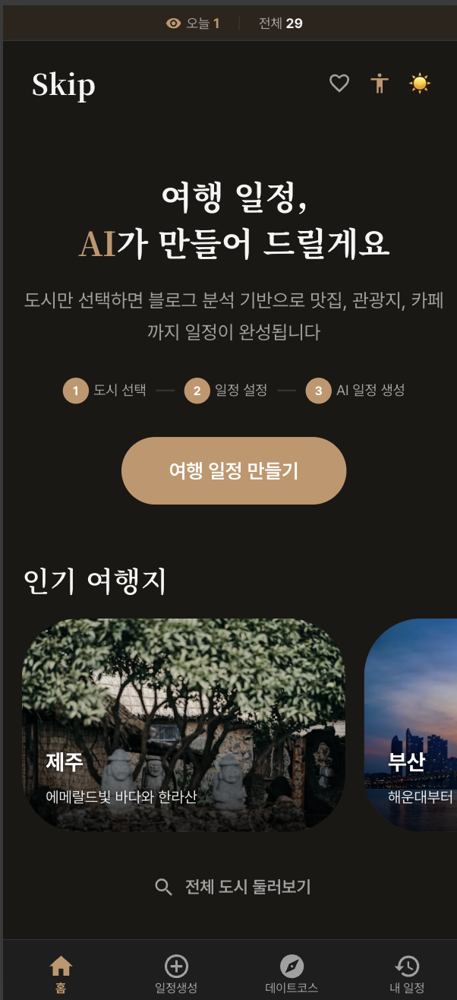

<section class="yg-hero">
  

    
Backend Engineer's Notes

    <h1 class="yg-hero-title">시스템과 인프라, 그 사이의 모든 것</h1>
    
Kang Young Gyu · Backend Engineer Kubernetes와 인프라 자동화를 좋아합니다. 시스템을 안정적으로 운영하는 방법에 대한 기록.

    

      JavaSpring BootNode.jsTypeScript
      AWSMySQLMongoDBRedis
      DockerKubernetes
    

  

</section>

<nav class="yg-pillbar">
  

    <a class="yg-pill active" href="#featured">전체</a>
    <a class="yg-pill" href="AI/Claude_Code/Claude_Code/">AI</a>
    <a class="yg-pill" href="Backend/API/API_Design_Patterns/">Backend</a>
    <a class="yg-pill" href="DevOps/Kubernetes/Kubernetes/">DevOps</a>
    <a class="yg-pill" href="DataBase/NoSQL/NoSQL/">Database</a>
    <a class="yg-pill" href="Security/HTTPS_and_TLS/">Security</a>
    <a class="yg-pill" href="AWS/Compute/Auto_Scaling/">AWS</a>
    <a class="yg-pill" href="GCP/Data/Big_Query/">GCP</a>
    <a class="yg-pill" href="Network/Protocol/Protocol/">Network</a>
    <a class="yg-pill" href="Application Architecture/Clean_Architecture/">Architecture</a>
    <a class="yg-pill" href="Linux/기본_명령어/기본_명령어/">Linux</a>
    <a class="yg-pill" href="Framework/Java/Spring/Bean/">Framework</a>
    <a class="yg-pill" href="Language/Java/Java 기본 개념/String 불변 객체/">Language</a>
  

</nav>

<section id="featured" class="yg-section">
  

    <h2 class="yg-section-title">최근 추천 글</h2>
    <a class="yg-section-link" href="#categories">전체 카테고리 →</a>
  

  

    <a class="yg-card" href="DevOps/Kubernetes/Kubernetes/">
      

        
♡

        ★ DevOps
      

      

        
<h3>Kubernetes 운영의 핵심 패턴</h3>★ 4.9

        
DevOps · Infrastructure

        
실제 프로덕션 환경에서 마주친 K8s 운영 이슈와 해결 방법.

        
<u>5분 분량</u>

      

    </a>

    <a class="yg-card" href="DataBase/NoSQL/Redis/Redis_Cache_Strategy/">
      

        
♡

        ★ Database
      

      

        
<h3>Redis 캐시 전략 비교</h3>★ 4.8

        
Database · Caching

        
Cache-Aside, Write-Through, Write-Behind 패턴 차이.

        
<u>3분 분량</u>

      

    </a>

    <a class="yg-card" href="Security/Zero_Trust_Architecture/">
      

        
♡

        ★ Security
      

      

        
<h3>Zero Trust 보안 모델</h3>★ 4.7

        
Security · Architecture

        
경계 기반 보안의 한계와 Zero Trust로의 전환.

        
<u>4분 분량</u>

      

    </a>

    <a class="yg-card" href="GCP/Data/Big_Query/">
      

        
♡

        ★ GCP
      

      

        
<h3>BigQuery로 로그 분석하기</h3>★ 4.8

        
GCP · Data

        
대규모 로그 분석 파이프라인 구축기.

        
<u>6분 분량</u>

      

    </a>

    <a class="yg-card" href="AI/Claude_Code/Claude_Code_Worktree/">
      

        
♡

        ★ AI
      

      

        
<h3>Claude Code 워크트리 활용</h3>★ 4.9

        
AI · Tooling

        
병렬 작업을 위한 git worktree와 Claude Code의 시너지.

        
<u>4분 분량</u>

      

    </a>

    <a class="yg-card" href="DevSecOps/Dev_Sec_Ops/">
      

        
♡

        ★ DevSecOps
      

      

        
<h3>DevSecOps 도입 가이드</h3>★ 4.6

        
DevOps · Security

        
개발 파이프라인에 보안을 자연스럽게 녹여내는 방법.

        
<u>5분 분량</u>

      

    </a>

    <a class="yg-card" href="Framework/Java/Spring/Spring_WebFlux/">
      

        
♡

        ★ Framework
      

      

        
<h3>Spring WebFlux 리액티브 입문</h3>★ 4.7

        
Spring · Reactive

        
WebFlux의 비동기 프로그래밍 모델과 사용 사례.

        
<u>7분 분량</u>

      

    </a>

    <a class="yg-card" href="AWS/Compute/Auto_Scaling/">
      

        
♡

        ★ AWS
      

      

        
<h3>Auto Scaling 전략 설계</h3>★ 4.5

        
AWS · Compute

        
트래픽 변동에 대응하는 오토스케일링 패턴.

        
<u>5분 분량</u>

      

    </a>

  

</section>

<section id="categories" class="yg-section">
  

    <h2 class="yg-section-title">전체 카테고리</h2>
  

  

    <a class="yg-cat" data-cat="ai" href="AI/Claude_Code/Claude_Code/">AI</a>
    <a class="yg-cat" data-cat="backend" href="Backend/API/API_Design_Patterns/">Backend</a>
    <a class="yg-cat" data-cat="devops" href="DevOps/Kubernetes/Kubernetes/">DevOps</a>
    <a class="yg-cat" data-cat="database" href="DataBase/NoSQL/NoSQL/">Database</a>
    <a class="yg-cat" data-cat="aws" href="AWS/Compute/Auto_Scaling/">AWS</a>
    <a class="yg-cat" data-cat="security" href="Security/HTTPS_and_TLS/">Security</a>
    <a class="yg-cat" data-cat="network" href="Network/Protocol/Protocol/">Network</a>
    <a class="yg-cat" data-cat="arch" href="Application Architecture/Clean_Architecture/">Architecture</a>
    <a class="yg-cat" data-cat="framework" href="Framework/Java/Spring/Bean/">Framework</a>
    <a class="yg-cat" data-cat="language" href="Language/Java/Java 기본 개념/String 불변 객체/">Language</a>
    <a class="yg-cat" data-cat="linux" href="Linux/기본_명령어/기본_명령어/">Linux</a>
    <a class="yg-cat" data-cat="webserver" href="WebServer/Nginx/Definition/">Web Server</a>
  

</section>

<section id="projects" class="yg-section">
  

    <h2 class="yg-section-title">개인 프로젝트</h2>
  

  

    <a class="yg-proj" href="http://gyutory.co.kr/momo" target="_blank">
      
      

        <h3>MOMO Assistant</h3>
        
페르소나 기반 AI 어시스턴트. 코딩 멘토, 번역가, 자소서 첨삭 등 역할별 전문 대화 지원.

      

    </a>
    <a class="yg-proj" href="http://gyutory.co.kr/momo_editor/" target="_blank">
      
      

        <h3>MOMO Editor</h3>
        
동영상 편집 데스크톱 애플리케이션. 타임라인 기반 편집, 미디어 라이브러리, 실시간 프리뷰 지원.

      

    </a>
    

      
      

        <h3>AI Trip Planner</h3>
        
AI 기반 여행 일정 생성 앱. 도시를 선택하면 맛집, 관광지, 카페 일정을 자동으로 구성.

      

    

  

</section>

