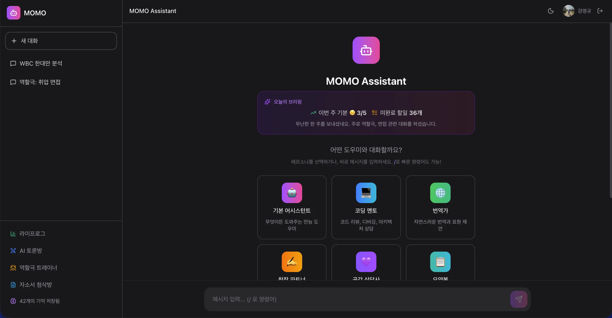
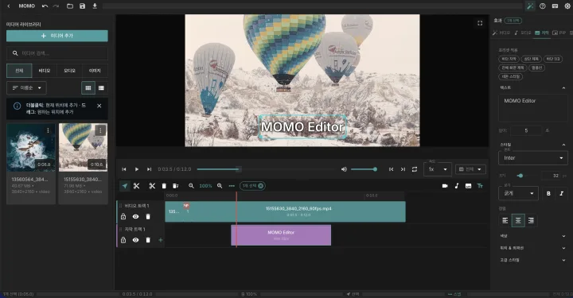
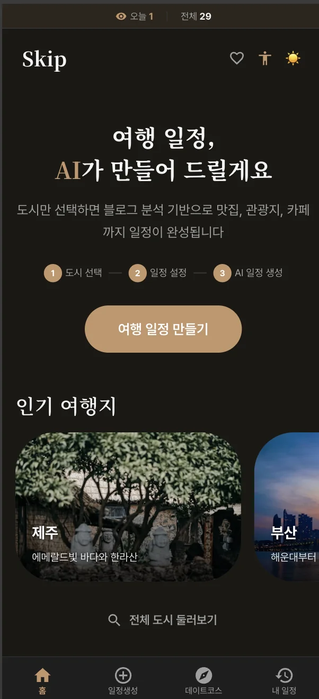

<section class="yg-section yg-about yg-about--hero">
  

    

      ABOUT
      <h1 class="yg-about-title">Kang Young Gyu</h1>
      

        시스템을 안정적으로 운영하는 방법에 대한 기록.
      

      

        백엔드 엔지니어로 일하면서 마주친 문제와 그 해결 과정을 정리합니다. 쿠버네티스, 인프라 자동화, 그리고 그 사이의 모든 것 — 코드 단편보다 시스템을 안정적으로 운영하는 원리에 더 관심이 많습니다.
      

      

        JavaSpring BootNode.jsTypeScript
        AWSKubernetesDockerMySQLMongoDBRedis
      

      

        <strong data-yg-total>—</strong>개의 문서
        
        최근 업데이트 <strong>2026.05</strong>
      

    

    

      <a class="yg-about-link" href="https://github.com/GYUTORY" target="_blank" rel="noopener">
        GitHub
        @GYUTORY
      </a>
      <a class="yg-about-link" href="mailto:azure0563@gmail.com">
        Email
        azure0563@gmail.com
      </a>
    

  

</section>

<section class="yg-section">
  

    

      RECENT
      <h2 class="yg-section-title">최근에 쓴 글</h2>
    

    <a class="yg-section-more" href="최근/">전체 보기</a>
  

  <!-- YG_RECENT: 빌드 시점에 tools/inject_build_meta.py 가 채운다. 직접 쓰지 말 것. -->
</section>

<section class="yg-section">
  

    

      CATEGORIES
      <h2 class="yg-section-title">관심 있는 주제로 바로 가기</h2>
    

  

  

    <a class="yg-cat-v2" data-cat="ai" data-yg-cat="AI" href="AI/Claude_Code/Claude_Code/">
      

      

        <h3>AI</h3>
        
Claude · Cursor · MCP · RAG

      

      
—

    </a>
    <a class="yg-cat-v2" data-cat="backend" data-yg-cat="Backend" href="Backend/API/API_Design_Patterns/">
      

      

        <h3>Backend</h3>
        
API · Auth · Resilience · Database

      

      
—

    </a>
    <a class="yg-cat-v2" data-cat="devops" data-yg-cat="DevOps" href="DevOps/Kubernetes/Kubernetes/">
      

      

        <h3>DevOps</h3>
        
Kubernetes · Docker · CI/CD

      

      
—

    </a>
    <a class="yg-cat-v2" data-cat="aws" data-yg-cat="Cloud" href="Cloud/AWS/Containers/ECS/">
      

      

        <h3>Cloud</h3>
        
AWS · GCP · 컨테이너 · 네트워킹

      

      
—

    </a>
    <a class="yg-cat-v2" data-cat="aws" data-yg-cat="AWS" href="Cloud/AWS/Compute/Auto_Scaling/">
      

      

        <h3>AWS</h3>
        
ECS · Fargate · Network · IAM

      

      
—

    </a>
    <a class="yg-cat-v2" data-cat="database" data-yg-cat="DataBase" href="DataBase/NoSQL/NoSQL/">
      

      

        <h3>Database</h3>
        
NoSQL · Redis · 인덱스 · 트랜잭션

      

      
—

    </a>
    <a class="yg-cat-v2" data-cat="framework" data-yg-cat="Framework" href="Framework/Java/Spring/Bean/">
      

      

        <h3>Framework</h3>
        
Spring · Node.js · NestJS

      

      
—

    </a>
    <a class="yg-cat-v2" data-cat="language" data-yg-cat="Language" href="Language/Java/Java 기본 개념/String 불변 객체/">
      

      

        <h3>Language</h3>
        
Java · TypeScript · JavaScript · Python

      

      
—

    </a>
    <a class="yg-cat-v2" data-cat="arch" data-yg-cat="Architecture" href="Architecture/Clean_Architecture/">
      

      

        <h3>Architecture</h3>
        
Clean Arch · MSA · DDD · Saga

      

      
—

    </a>
    <a class="yg-cat-v2" data-cat="network" data-yg-cat="Network" href="Network/Protocol/Protocol/">
      

      

        <h3>Network</h3>
        
Protocol · TCP/IP · HTTP · DNS

      

      
—

    </a>
    <a class="yg-cat-v2" data-cat="security" data-yg-cat="Security" href="Security/HTTPS_and_TLS/">
      

      

        <h3>Security</h3>
        
HTTPS · TLS · OAuth · 인증

      

      
—

    </a>
    <a class="yg-cat-v2" data-cat="linux" data-yg-cat="Linux" href="DevOps/Linux/기본_명령어/기본_명령어/">
      

      

        <h3>Linux</h3>
        
Shell · 권한 · 프로세스 · 시스템

      

      
—

    </a>
    <a class="yg-cat-v2" data-cat="backend" data-yg-cat="OS" href="OS/Process%20&amp;%20Thread/Process%20&amp;%20Thread/">
      

      

        <h3>OS</h3>
        
프로세스 · 스레드 · 메모리 · 스케줄링

      

      
—

    </a>
    <a class="yg-cat-v2" data-cat="arch" data-yg-cat="Algorithm" href="Algorithm/Binary_Search/">
      

      

        <h3>Algorithm</h3>
        
탐색 · 정렬 · 동적 계획법

      

      
—

    </a>
    <a class="yg-cat-v2" data-cat="webserver" data-yg-cat="WebServer" href="WebServer/Nginx/Definition/">
      

      

        <h3>Web Server</h3>
        
Nginx · Apache · 리버스 프록시

      

      
—

    </a>
  

</section>

<section class="yg-section">
  

    

      SERIES
      <h2 class="yg-section-title">시리즈로 깊게 읽기</h2>
    

  

  

    <a class="yg-series" href="DevOps/Kubernetes/Kubernetes/">
      
01

      

        Kubernetes
        <h3>쿠버네티스, 처음부터 운영까지</h3>
        
아키텍처와 핵심 리소스부터 네트워킹·스토리지·모니터링까지 단계별로.

      

    </a>
    <a class="yg-series" href="AWS/Containers/ECS/">
      
02

      

        AWS · ECS
        <h3>ECS / Fargate 실전 배포</h3>
        
태스크 정의, 오토스케일링, 사이드카, 멀티 태스크 커넥션까지 실무 케이스 중심으로.

      

    </a>
    <a class="yg-series" href="Architecture/MSA/Saga_패턴_및_분산_트랜잭션/">
      
03

      

        MSA
        <h3>분산 시스템에서 살아남기</h3>
        
Saga 패턴, 분산 트랜잭션, 서킷 브레이커 — 장애를 견디는 시스템 설계 원리.

      

    </a>
    <a class="yg-series" href="AI/Claude_Code/Claude_Code/">
      
04

      

        AI Tools
        <h3>AI 코딩 도구 정리</h3>
        
Claude Code, Cursor, Copilot, MCP — 어떤 상황에 무엇을 쓸지 비교하며 정리.

      

    </a>
  

</section>

<section class="yg-section">
  

    

      PROJECTS
      <h2 class="yg-section-title">개인 프로젝트</h2>
    

  

  

    <a class="yg-proj" href="http://gyutory.co.kr/momo" target="_blank" rel="noopener">
      

        
      

      

        AI · Web
        <h3>MOMO Assistant</h3>
        
페르소나 기반 AI 어시스턴트. 코딩 멘토, 번역가, 자소서 첨삭 등 역할별 전문 대화 지원.

      

    </a>
    <a class="yg-proj" href="http://gyutory.co.kr/momo_editor/" target="_blank" rel="noopener">
      

        
      

      

        Desktop · Video
        <h3>MOMO Editor</h3>
        
동영상 편집 데스크톱 애플리케이션. 타임라인 기반 편집, 미디어 라이브러리, 실시간 프리뷰.

      

    </a>
    

      

        
        준비 중
      

      

        AI · Mobile
        <h3>AI Trip Planner</h3>
        
AI 기반 여행 일정 생성 앱. 도시를 선택하면 맛집·관광지·카페 일정을 자동으로 구성.

      

    

  

</section>

<section class="yg-section">
  

    

      HUBS
      <h2 class="yg-section-title">주제별 가이드</h2>
    

  

  

    <a class="yg-series" href="_hub/트랜잭션과_동시성/">
      

        Database · OS
        <h3>트랜잭션과 동시성</h3>
        
ACID, 격리 수준, 분산 트랜잭션, Saga 패턴까지.

      

    </a>
    <a class="yg-series" href="_hub/인증과_토큰/">
      

        Security · Auth
        <h3>인증과 토큰</h3>
        
JWT, OAuth2, SSO, Passkey, NestJS Guards까지.

      

    </a>
    <a class="yg-series" href="_hub/메시징과_전달_보장/">
      

        Messaging · Queue
        <h3>메시징과 전달 보장</h3>
        
Kafka, RabbitMQ, SQS, Outbox 패턴, 멱등성까지.

      

    </a>
    <a class="yg-series" href="_hub/인덱스와_쿼리_성능/">
      

        Database · Performance
        <h3>인덱스와 쿼리 성능</h3>
        
B-Tree 인덱스, EXPLAIN, 옵티마이저, 성능 튜닝까지.

      

    </a>
    <a class="yg-series" href="_hub/캐싱/">
      

        Cache · Redis
        <h3>캐싱</h3>
        
Cache-Aside, Write-Through, Redis, 분산 캐싱까지.

      

    </a>
    <a class="yg-series" href="_hub/관측성/">
      

        Observability · Monitoring
        <h3>관측성</h3>
        
분산 추적, 메트릭, 로그, OpenTelemetry, SLI/SLO까지.

      

    </a>
  

</section>

