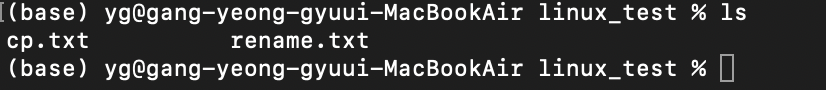
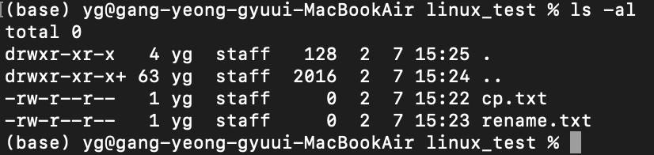
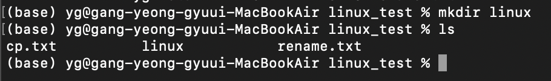
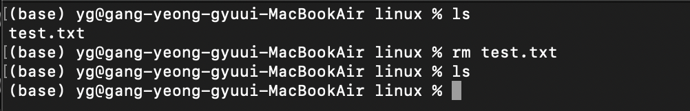

맥북 M1 기반으로 작성되었습니다.

ls로 현재 폴더안에 내용 확인하기

ls -al로 숨겨진 파일 및 파일 용량, 파일 권한 확인하기

mkdir linux로 디렉토리 파일 linux 만들기

만든 linux 경로로 이동하고 현재 경로 확인하기

parent 경로로 이동하고 현재 경로 확인하기

1. test.txt를 만들고 확인하기
2. 만든 test.txt linux 폴더로 이동하기
3. linux 폴더 내에 이동된 test.txt 확인하기

이동된 test.txt를 삭제하고 확인하기