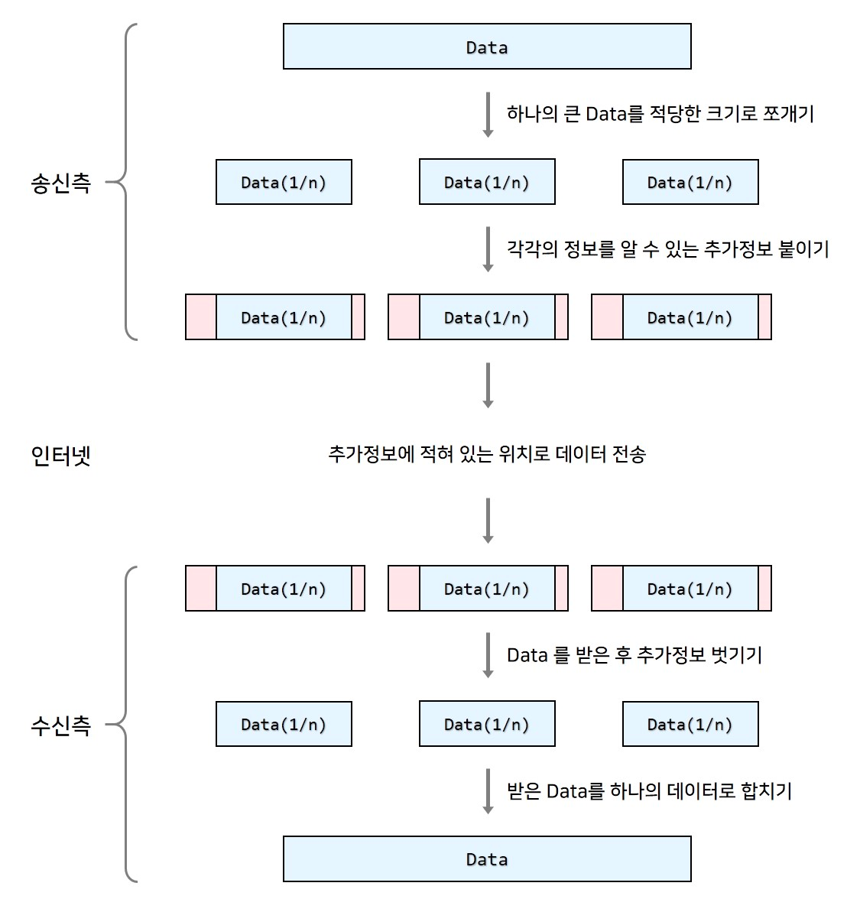

# TCP와 UDP

# TCP의 3-way HandShaking 역할
 
- 양쪽 모두 데이터가 전송 할 준비가 되었다는 것을 보장하고, 데이터 전달이 이루어지기 전 한 쪽이 다른 쪽이 준비가
되었다는 것을 알 수 있다.
- 양쪽 모두 상대편에 대한 초기 순차일련번호를 얻을 수 있도록 한다.

# 소켓 종류

스트림(TCP)

- 양방향으로 바이트 스트림을 전송, 연결 지향성
- 오류 수정, 전송처리, 흐름제어 보장
- 송신된 순서에 따라 중복되지 않게 데이터를 수신 -> 오버헤드가 발생
- 소량의 데이터보다 대량의 데이터 전송에 적합 -> TCP를 사용

데이터그램(UDP)

- 비연결형소켓
- 데이터의 크기에 제한이 있음
- 확실하게 전달이 보장되지 않음, 데이터가 손실되어도 오류가 발생하지 않음
- 실시간 멀티미디어 정보를 처리하기 위해 주로 사용 EX) 전화

# HTTP 통신과 SOCKET 통신의 비교

# HTTP 통신

- Client의 요청(Request)이 있을 때만 서버가 응답(Response)하여 해당 정보를 전송하고 곧바로 연결을 종료하는 방식

# HTTP 통신의 특징

- Client가 요청을 보내는 경우에만 Server가 응답하는 단방향 통신이다.
- Server로부터 응답을 받은 후에는 연결이 바로 종료된다.
- 실시간 연결이 아니고, 필요한 경우에만 Server로 요청을 보내는 상황에 유용하다.
- 요청을 보내 Server의 응답을 기다리는 어플리케이션의 개발에 주로 사용된다.

# SOCKET 통신

- Server와 Client가 특정 Port를 통해 실시간으로 양방향 통신을 하는 방식

# SOCKET 통신의 특징

- Server와 Client가 계속 연결을 유지하는 양방향 통신이다.
- Server와 Client가 실시간으로 데이터를 주고받는 상황이 필요한 경우에 사용한다.
- 실시간 동영상 Streaming이나 온라인 게임 등과 같은 경우에 자주 사용된다.

# TCP와 UDP

- 통신을 위해서는 바이너리 데이터를 주고받는 과정들이 필요하고, 이는 네트워크를 통해 진행됩니다.
- 네트워크는 어떻게 통신하고 계층화를 어떤 방법으로 적용하였는지에 대해 알아보겠습니다.

# 

# 먼저 패킷이란?
- 인터넷을 통해 주고받는 바이너리 데이터 블록(조각)를 포괄적으로 패킷(packet)이라 합니다.
- 송신측의 데이터를 적당한 크기로 쪼개에 추가정보를 붙인 하나의 데이터 단위

# 패킷이 사용되는 이유
- 보내는 데이터를 작은 단위로 나눠 빠르고 효율적이게 전달하기 위함입니다.
- 큰 용량의 데이터를 패킷으로 나누지 않고 한번에 보내게 당장 해당 파일을 보낼때는 빠를 수 있습니다.
- 하지만 현대의 컴퓨터는 하나의 프로그램에서 네트워크를 사용하지 않으며, 다른 프로그램에서 데이터를 주고받는 데 방해를 받을 수 있습니다

# 헤더(header)
- 패킷에 붙인 추가정보들을 주로 헤더(header)
- 그림에 보이는 헤더는 그저 단순한 데이터처럼 보이지만 사실 매우 많은 정보들이 들어갑니다.

# 송신측
- 수신측이 알아야할 정보들을 각 계층에서 추가하면서 데이터를 전달

# 수신측
- 송신측이 보낸 정보들을 각 계층에서 해석해 나가면서 데이터를 전달받습니다.

# OSI 7계층 & TCP/IP 4계층

7계층: 응용 계층 (Application Layer)
- 응용프로그램(사용자)에서 정보를 전달받아 컴퓨터가 통신할 수 있게 전달하는 역할을 수행하는 계층입니다. 대표적인 어플리케이션 프로토콜로 HTTP, FTP, DNS 등이 있습니다.

6계층: 표현 계층 (Presentation Layer)
- 응용 계층에서 받은 데이터의 인코딩과 디코딩, 암호화, 압축등을 수행하여 컴퓨터가 보낼 수 있는 데이터 형식으로 바꿔주는 계층입니다. 대표적인 형식으로 JPEG, MPEG, GIF 등이 있습니다.

5계층: 세션 계층 (Session Layer)
- 통신장치간의 연결을 관리하는 계층입니다. 세션을 만들고, 종료하고, 복구하는 등 기능을 수행합니다. 통신 연결은 포트 기반으로 연결되며, 대표적인 프로토콜로 SSH, TLS 등이 있습니다. OS가 세션계층에 속하며, 소켓 프로그래밍이 해당되는 부분입니다. 소켓 프로그래밍에 대해서는 다음 포스팅에서 자세히 다루겠습니다.

4계층: 전송 계층 (Transport Layer)
- port 번호를 사용하여 출발지에서 목적지까지 데이터를 전송할 수 있게 하는 계층입니다. 데이터를 분할하고, 전송하고, 오류가 있다면 다시 받아내고, 받은 데이터의 순서를 맞추는 등의 역할을 수행합니다. PDU는 TCP/IP는 세그먼트(Segment), UDP는 데이터그램(Datagram) 입니다. 대표적인 프로토콜은 TCP, UDP가 있습니다.

3계층: 네트워크 계층 (Network Layer)
- IP를 통해 보내는 곳의 주소를 확인하고, 라우터를 통해 해당 주소로 이동하는 경로를 선택하는 역할을 수행하는 계층입니다. PDU는 패킷(Packet)입니다. 대표적인 프로토콜은 IP, ICMP 등 입니다. 라우터와 스위치가 해당 계층에서 사용되는 장비입니다.

2계층: 데이터링크 계층 (Data Link Layer)
- 네트워크 기기들 사이에 데이터 전송을 하는 계층으로 하드웨어(LAN card)적으로 구현되어 있습니다. 데이터 전송 오류를 감지하거나, 오류를 감지하면 재전송하는 계층이며, 데이터의 시작과 끝을 알기 위해 데이터의 앞뒤에 특정한 비트열을 붙이는 작업(framing)을 수행합니다. PDU는 프레임(Frame)입니다.

1계층: 물리 계층 (Pysical Layer)
- 바이너리 데이터를 물리적으로 연결하고 전송하는 계층으로 하드웨어적(PHY칩)으로 구현되어 있습니다. 모든 메세지를 바이너리 전기신호로 변환하여 전송하는 역할을 수행합니다. PDU는 비트(Bit)입니다.

출처
- https://velog.io/@emplam27/CS-%EA%B7%B8%EB%A6%BC%EC%9C%BC%EB%A1%9C-%EC%95%8C%EC%95%84%EB%B3%B4%EB%8A%94-%EB%84%A4%ED%8A%B8%EC%9B%8C%ED%81%AC-%EA%B3%84%EC%B8%B5%ED%99%94%EC%99%80-OSI-TCPIP-UDP%EC%9D%98-%ED%8A%B9%EC%A7%95%EA%B3%BC-%EC%B0%A8%EC%9D%B4%EC%A0%90

