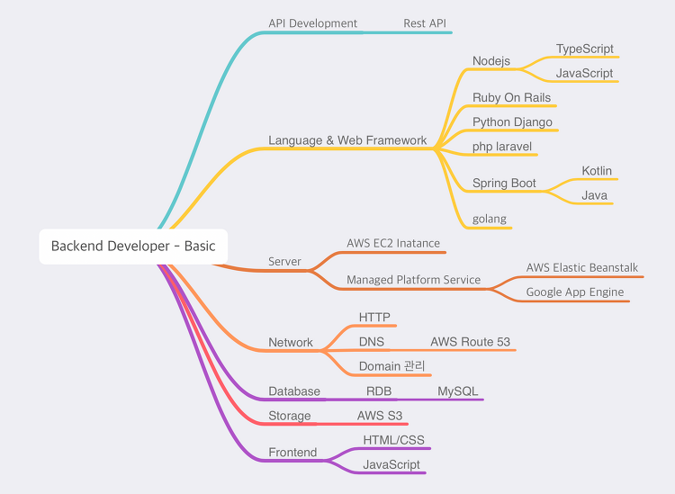

# 개요
- 어제 팀장님께서, 2년차 개발자라면 하나의 무기가 있어야 되지 않겠냐? 라는 말씀을 해주셨고,
나는 그에 정확하게 말씀을 드리지는 못했다..
- 개발자도 워낙 수많은 분야 예를 들어 인프라관리자, 네트워크 관리자, DBA...가 있고, 백엔드개발자가 단순 코딩만 하기 보다는 외부 업체와 연동도 하고 연동을 하기 위해서는 
네트워크 통신에 대해서 많이 알아야 대화가 수월할 것 같아. 나의 백엔드개발자 주무기는 네트워크로 결정했다.

# 목적
- 지금 내 수준에서 코딩과 네트워크 둘 다 완벽을 바라는건 아니지만, 어떤식으로 공부방향을 잡아갈지 알아보자.

# 순서
1. HTTP와 TCP 즉, 통신 프로토콜에 대해 알아보고, 그 다음 Domain 해당 방향으로
공부하다보면, 내가 무엇을 공부해야하는지 알 수 있을 것이다.