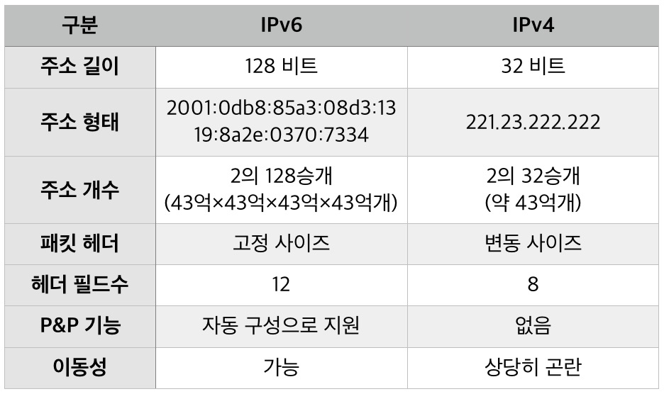

# IP
- First created By KYG at 2023-01-02

# 먼저 IP란?
- 인터넷 프로토콜(Internet Protocol)의 약자로, 인터넷이 통하는 네트워크에서 어떤 정보를 수신하고 송신하는 통신에 대한 규약
- IP는 OSI의 Layer 3(Network Layer)와 Internet Protocol Suite의 Layer 3(Internet Layer)에 위치하는 프로토콜이다.

# IPV4란?
- 최초의 안정적인 인터넷 프로토콜(IP) 버전
- 32비트로 이루어져있다.
- 마침표로 구분되는 4개의 8비트 필드로 구분된 십진수로 작성된다.

# 클래스
A 클래스
- A class는 최고 상위 클래스로, 1~126(0, 127은 예약됨) 범위의 IP 주소를 가집니다.
- 두 번째, 세 번째 그리고 네 번째 단위의 세 숫자는 A 클래스가 자유롭게 네트워크 사용자에게 부여가 가능한 IP이다.

클래스 A: 10.0.0.0~10.255.255.255

B 클래스
- 두 번째로 높은 단위의 클래스로써, IP 구성에서 첫 번째 단위의 세 숫자는 128~191 가운데 하나를 가지며 두번째 단위의 세 숫자는
B 클래스가 접속할 수 있는 네트워크를 지시합니다.

클래스 B: 172.16.0.0~172.31.255.255

C 클래스
- 최하위 클래스로서 IP 구성에서 첫 번째 단위의 세 숫자는 193 ~ 223 가운데 하나를 가지며 두 번째와 세 번째 단위의 세 숫자는
C 클래스가 접속할 수 있는 네트워크를 지시합니다. C 클래스가 자유로이 부여할 수 있는 IP는 마지막 4 번째 단위의 254개입니다. (2개는 예약)

클래스 C: 192.168.0.0~192.168.255.255

# IPV4의 구성
Network ID 
- 해당 컴퓨터가 소속된 네트워크에 배정된 이름과
Host ID 
- 해당 물리적 컴퓨터에 배정된 이름 으로 구분한다.

# IPV6란?
- RFC 2460 정의에 따르면 IPv6(IP 버전 6)는 IETF(Internet Engineering Task Force)가 정의한 최신 세대의 인터넷 프로토콜(IP)입니다
- IPv6는 최종적으로 IPv4를 대체하기 위한 것이지만, 맞물려있으며 대부분의 엔지니어는 두 가지를 병행하고 있습니다.

# IPV4와 IPV6의 차이

# IPv4 및 IPv6의 작동 원리
- IPv6 주소의 128비트는 콜론으로 분리된 8개의 16비트 16진수 블록입니다. 예를 들어 2dfc:0:0:0:0217:cbff:fe8c:0과 같습니다.
- IPv4 주소는 “클래스”로 분리되는데, 클래스 A 네트워크는 소수의 대형 네트워크를 위한 것이고, 클래스 C 네트워크는 수천 개의 소형 네트워크를 위한 것이고, 클래스 B 네트워크는 그 사이에 있는 것입니다.
- IPv6는 서브넷팅을 사용하여 주어진 주소 공간 할당에 맞게 네트워크 크기를 조정합니다.
- IPv4는 멀티캐스트 사용을 위해 클래스 유형의 주소 공간을 사용합니다(224.0.0.0/4). IPv6는 FF00::/8에서 멀티캐스트를 위해 통합된 주소 공간을 사용합니다.
- IPv4는 각 디바이스가 멈추고 패킷을 확인하도록 강제하는 “브로드캐스트” 주소를 사용합니다. IPv6는 멀티캐스트 그룹을 사용합니다.
- IPv4는 0.0.0.0을 미지정 주소로 사용하고 클래스 유형 주소(127.0.0.1)를 루프백에 사용합니다. IPv6는 미지정 주소에는 ::을, 루프백에는 ::1을 사용합니다.
- IPv4는 전역적으로 고유한 퍼블릭 주소를 트래픽 및 “프라이빗” 주소에 사용합니다. IPv6는 전역적으로 고유한 유니캐스트 주소와 로컬 주소를 사용합니다(FD00::/8).

참고
- https://moonnote.tistory.com/245
- https://namu.wiki/w/IP